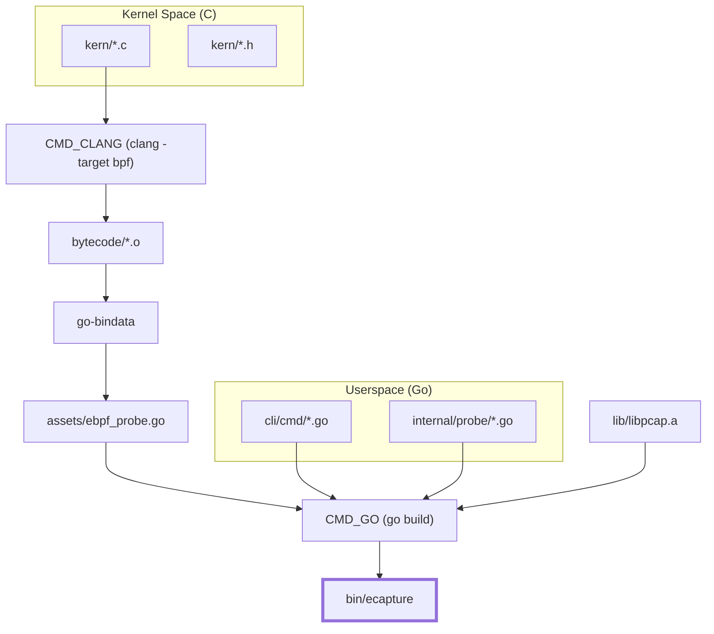
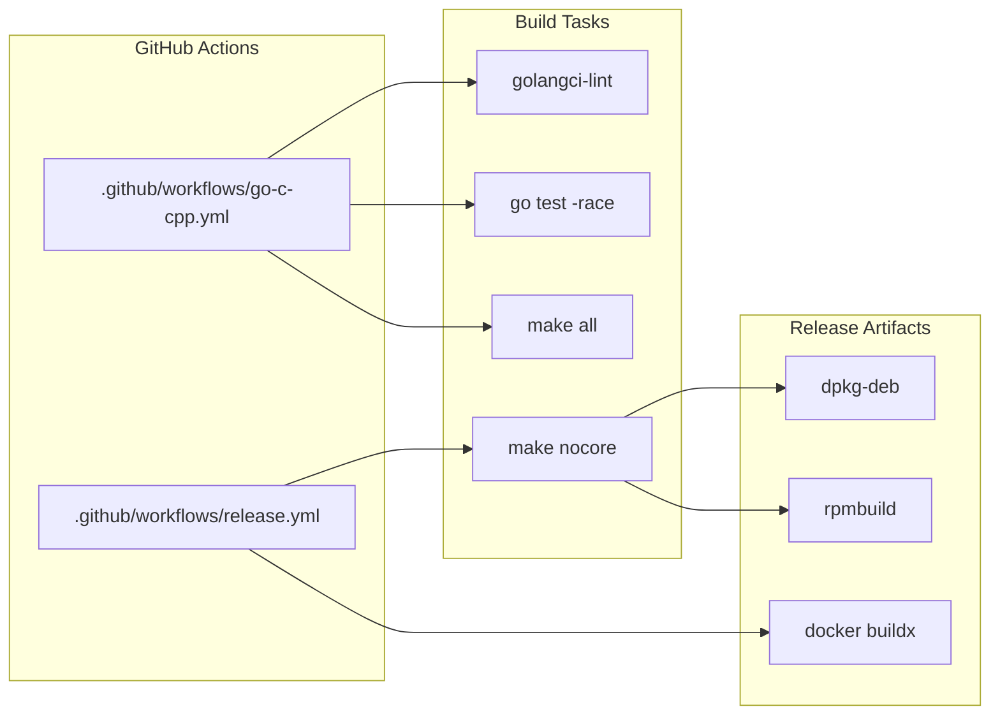

# Developer Guide

Relevant source files

The following files were used as context for generating this wiki page:

- [.github/workflows/go-c-cpp.yml](https://github.com/gojue/ecapture/blob/943a19fe/.github/workflows/go-c-cpp.yml)
- [.github/workflows/release.yml](https://github.com/gojue/ecapture/blob/943a19fe/.github/workflows/release.yml)
- [Makefile](https://github.com/gojue/ecapture/blob/943a19fe/Makefile)
- [builder/Dockerfile](https://github.com/gojue/ecapture/blob/943a19fe/builder/Dockerfile)
- [builder/Makefile.release](https://github.com/gojue/ecapture/blob/943a19fe/builder/Makefile.release)
- [builder/init_env.sh](https://github.com/gojue/ecapture/blob/943a19fe/builder/init_env.sh)
- [functions.mk](https://github.com/gojue/ecapture/blob/943a19fe/functions.mk)
- [variables.mk](https://github.com/gojue/ecapture/blob/943a19fe/variables.mk)

The Developer Guide provides the necessary technical context for engineers who wish to contribute to the eCapture project, add support for new software versions, or implement entirely new probes. eCapture uses a multi-language stack, combining **C** for eBPF kernel-space programs and **Go** for the userspace control plane.

## Build and Compilation Overview

Building eCapture requires a specific toolchain capable of compiling both Go code and eBPF C code. The project supports two primary build modes: **CO-RE** (Compile Once – Run Everywhere), which relies on BTF (BPF Type Format) for portability, and **non-CO-RE**, which compiles against specific kernel headers for older systems.

The build process is managed via a `Makefile` that handles:
*   Compiling eBPF C programs using `clang` and `llc`.
*   Embedding eBPF bytecode into Go files using `go-bindata`.
*   Compiling the static `libpcap` library for packet capture support.
*   Building the final Go binary with `cgo` enabled.

For detailed setup instructions, toolchain requirements (Clang 14+, Go 1.24+), and cross-compilation for Android or ARM64, see [Compilation and Build](8.1-compilation-and-build.md).

### Build System Flow
The following diagram illustrates how the build system transforms source code into a unified binary.

**Figure 1: eCapture Build Pipeline**

**Sources:**
*   [Makefile:4-15](https://github.com/gojue/ecapture/blob/943a19fe/Makefile#L4-L15) - Primary build targets (`all`, `nocore`).
*   [Makefile:161-166](https://github.com/gojue/ecapture/blob/943a19fe/Makefile#L161-L166) - Asset generation via `go-bindata`.
*   [functions.mk:47-54](https://github.com/gojue/ecapture/blob/943a19fe/functions.mk#L47-L54) - `gobuild` definition with `CGO` and `ldflags`.
*   [variables.mk:189-214](https://github.com/gojue/ecapture/blob/943a19fe/variables.mk#L189-L214) - List of eBPF source targets.

## Extending eCapture: Adding New Probes

eCapture is designed to be extensible. Adding a new probe typically involves three layers of implementation:
1.  **Kernel Layer**: Writing a C program in `kern/` to hook specific functions (e.g., `uprobes` on a new SSL library version).
2.  **Domain Layer**: Implementing the `Probe` and `EventDecoder` interfaces in `internal/domain/`.
3.  **CLI Layer**: Adding a new Cobra subcommand in `cli/cmd/` to expose the probe to users.

For a step-by-step walkthrough of this process, including how to register your new probe in the factory, see [How to Add a New Probe](8.2-how-to-add-a-new-probe.md).

**Sources:**
*   [variables.mk:189-214](https://github.com/gojue/ecapture/blob/943a19fe/variables.mk#L189-L214) - Where new kernel targets are registered.
*   [Makefile:139-159](https://github.com/gojue/ecapture/blob/943a19fe/Makefile#L139-L159) - Compilation logic for non-CO-RE objects.

## Testing Strategy and CI/CD

Quality assurance in eCapture is handled through a combination of local unit tests and automated GitHub Actions workflows. 

*   **Unit Testing**: Focuses on userspace logic, such as event processing and protocol parsing (e.g., HTTP/2).
*   **CI Workflows**: The project uses GitHub Actions to automate builds for `x86_64`, `arm64`, and `Android` across multiple kernel configurations.
*   **Release Pipeline**: Automated packaging into `.rpm` and `.deb` formats, along with Docker image publication.

For details on running tests locally and an overview of the automated release pipeline, see [Testing Strategy and CI/CD](8.3-testing-strategy-and-cicd.md).

### CI/CD Pipeline Architecture
This diagram maps the CI/CD stages to the specific workflow files and tools used.

**Figure 2: CI/CD and Release Workflow**

**Sources:**
*   [.github/workflows/go-c-cpp.yml:8-70](https://github.com/gojue/ecapture/blob/943a19fe/.github/workflows/go-c-cpp.yml#L8-L70) - Ubuntu 22.04 CI build steps.
*   [.github/workflows/release.yml:100-114](https://github.com/gojue/ecapture/blob/943a19fe/.github/workflows/release.yml#L100-L114) - Release snapshot and publish logic.
*   [builder/Makefile.release:141-157](https://github.com/gojue/ecapture/blob/943a19fe/builder/Makefile.release#L141-L157) - DEB package construction logic.
*   [builder/Dockerfile:1-38](https://github.com/gojue/ecapture/blob/943a19fe/builder/Dockerfile#L1-L38) - Multi-stage Docker build process.