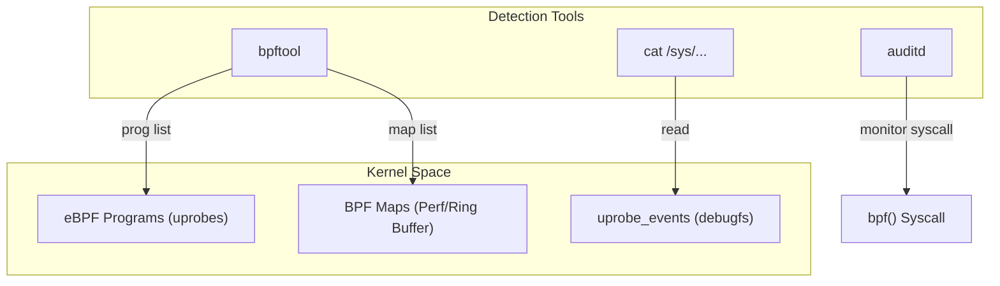
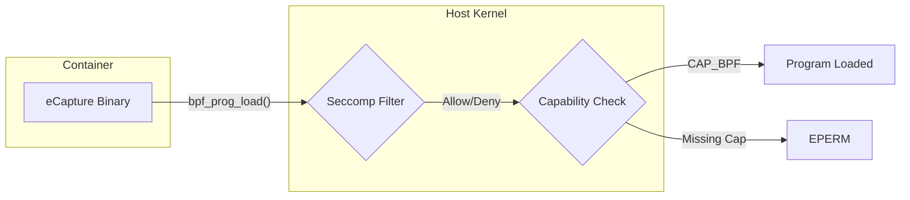
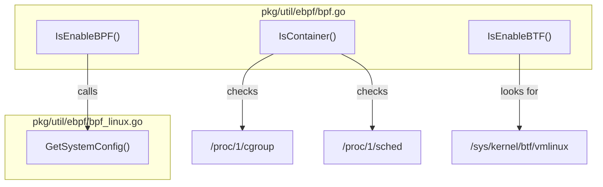

# Detection and Defense

<details>
<summary>Relevant source files</summary>

The following files were used as context for generating this wiki page:

- [README-zh_Hans.md](https://github.com/gojue/ecapture/blob/943a19fe/README-zh_Hans.md)
- [SECURITY.md](https://github.com/gojue/ecapture/blob/943a19fe/SECURITY.md)
- [docs/README.md](https://github.com/gojue/ecapture/blob/943a19fe/docs/README.md)
- [docs/defense-detection.md](https://github.com/gojue/ecapture/blob/943a19fe/docs/defense-detection.md)
- [docs/example-outputs.md](https://github.com/gojue/ecapture/blob/943a19fe/docs/example-outputs.md)
- [docs/minimum-privileges.md](https://github.com/gojue/ecapture/blob/943a19fe/docs/minimum-privileges.md)
- [docs/performance-benchmarks.md](https://github.com/gojue/ecapture/blob/943a19fe/docs/performance-benchmarks.md)
- [docs/release-verification.md](https://github.com/gojue/ecapture/blob/943a19fe/docs/release-verification.md)
- [pkg/util/ebpf/bpf.go](https://github.com/gojue/ecapture/blob/943a19fe/pkg/util/ebpf/bpf.go)
- [pkg/util/ebpf/bpf_linux.go](https://github.com/gojue/ecapture/blob/943a19fe/pkg/util/ebpf/bpf_linux.go)
- [pkg/util/ebpf/bpf_test.go](https://github.com/gojue/ecapture/blob/943a19fe/pkg/util/ebpf/bpf_test.go)

</details>


eCapture is a powerful security auditing tool that leverages eBPF to intercept plaintext traffic and system activity. Because it operates by hooking into sensitive library functions (like `SSL_read` and `SSL_write`) and system calls, it can be misused by unauthorized actors to exfiltrate data. This page provides technical details for security teams to detect the presence of eCapture (or similar eBPF tools) and implement defensive layers to restrict unauthorized eBPF activity.

## Detecting eBPF-based Capture Tools

Detection focuses on three layers: the kernel's eBPF subsystem, the tracing infrastructure (uprobes), and process-level activity.

### 1. eBPF Program Inspection
The most direct way to find eCapture is to list loaded eBPF programs. eCapture typically loads `uprobe` type programs to intercept SSL/TLS libraries.

```bash
# List all loaded eBPF programs
sudo bpftool prog list

# Filter for uprobe-type programs targeting SSL/TLS functions
sudo bpftool prog list | grep -i uprobe
```

### 2. Uprobe Event Monitoring
eCapture registers uprobes in the kernel's tracing subsystem. These are visible in `debugfs`. Security teams should monitor for unexpected entries targeting security-sensitive libraries like `libssl.so`, `libgnutls.so`, or `libnspr4.so`.

```bash
# Check registered uprobe events
sudo cat /sys/kernel/debug/tracing/uprobe_events

# Specific grep for common eCapture targets
sudo cat /sys/kernel/debug/tracing/uprobe_events | grep -E "ssl|SSL|gnutls|nspr"
```

### 3. Perf Event and Map Monitoring
eCapture uses eBPF maps (specifically `BPF_MAP_TYPE_PERF_EVENT_ARRAY` or `BPF_MAP_TYPE_RINGBUF`) to stream captured plaintext back to userspace.

```bash
# List perf event arrays used by eBPF
sudo bpftool map list | grep -i perf
```

### 4. Process and System Call Auditing
Standard process monitoring and Linux Audit (`auditd`) can catch the execution of the eCapture binary or the invocation of the `bpf()` system call.

```bash
# Monitor bpf() system calls via auditd
sudo auditctl -a always,exit -F arch=b64 -S bpf -k bpf_activity

# Monitor access to the tracing filesystem
sudo auditctl -w /sys/kernel/debug/tracing/ -p rwa -k tracing_access
```

### Detection Data Flow
The following diagram illustrates how security tools interact with the kernel to detect eCapture's components.

**Detection Mechanism Mapping**

**Sources:** [docs/defense-detection.md:7-48](https://github.com/gojue/ecapture/blob/943a19fe/docs/defense-detection.md#L7-L48), [pkg/util/ebpf/bpf.go:25-28](https://github.com/gojue/ecapture/blob/943a19fe/pkg/util/ebpf/bpf.go#L25-L28)

---

## Defense Strategies

Defenses should follow the principle of least privilege, restricting who can load eBPF programs and what capabilities they possess.

### 1. Restricting eBPF Access
The most effective defense is disabling unprivileged eBPF and restricting the `bpf()` system call to authorized users only.

| Action | Command / Configuration |
| :--- | :--- |
| **Disable Unprivileged BPF** | `sysctl -w kernel.unprivileged_bpf_disabled=1` |
| **Persistence** | Add to `/etc/sysctl.d/99-disable-bpf.conf` |

### 2. Linux Security Modules (LSM)
Using AppArmor or SELinux allows for fine-grained control over the `bpf`, `perfmon`, and `sys_ptrace` capabilities.

*   **AppArmor**: Create a profile that explicitly denies `capability bpf` and `capability perfmon`.
*   **SELinux**: Monitor and block BPF-related AVC (Access Vector Cache) denials.

### 3. Container Hardening
eCapture often runs in containers for portability. Security teams must avoid the `--privileged` flag, which bypasses almost all kernel security checks.

**Defense-in-Depth for Containers**

**Sources:** [docs/defense-detection.md:58-94](https://github.com/gojue/ecapture/blob/943a19fe/docs/defense-detection.md#L58-L94), [docs/minimum-privileges.md:75-104](https://github.com/gojue/ecapture/blob/943a19fe/docs/minimum-privileges.md#L75-L104)

---

## The Legitimate Boundary for eCapture

eCapture is designed for authorized security auditing. It performs its own environment checks to ensure it is running with the necessary (but minimum) privileges.

### Capability Requirements
eCapture checks for specific capabilities at startup to function correctly.

| Capability | Role in eCapture | Required in Mode |
| :--- | :--- | :--- |
| `CAP_BPF` | Load eBPF bytecode | All (Kernel >= 5.8) |
| `CAP_PERFMON` | Read data from perf buffers | All (Kernel >= 5.8) |
| `CAP_SYS_PTRACE` | Read `/proc/<pid>/maps` for symbol offsets | All |
| `CAP_NET_ADMIN` | Attach TC filters for packet capture | `pcapng` mode |
| `CAP_SYS_ADMIN` | Legacy catch-all for BPF | All (Kernel < 5.8) |

### Environment Detection Logic
eCapture includes internal logic to detect if it is running in a container or on a system with BTF (BPF Type Format) enabled, which determines how it loads its eBPF programs (CO-RE vs. Non-CO-RE).

**Code Entity Mapping: Environment Checks**

**Sources:** [pkg/util/ebpf/bpf.go:118-191](https://github.com/gojue/ecapture/blob/943a19fe/pkg/util/ebpf/bpf.go#L118-L191), [pkg/util/ebpf/bpf_linux.go:48-80](https://github.com/gojue/ecapture/blob/943a19fe/pkg/util/ebpf/bpf_linux.go#L48-L80), [docs/minimum-privileges.md:5-34](https://github.com/gojue/ecapture/blob/943a19fe/docs/minimum-privileges.md#L5-L34)

### Responsible Use Checklist
For legitimate deployments, security teams should:
1.  **Authorize**: Use `setcap` to grant specific capabilities to the binary rather than running as root [docs/minimum-privileges.md:45-58](https://github.com/gojue/ecapture/blob/943a19fe/docs/minimum-privileges.md#L45-L58).
2.  **Scope**: Use the `--pid` flag to limit capture to specific target processes [docs/performance-benchmarks.md:154-157](https://github.com/gojue/ecapture/blob/943a19fe/docs/performance-benchmarks.md#L154-L157).
3.  **Monitor**: Use `ss -tlnp | grep 28256` to ensure the remote config API is only listening on intended interfaces [docs/defense-detection.md:141-149](https://github.com/gojue/ecapture/blob/943a19fe/docs/defense-detection.md#L141-L149).
4.  **Verify**: Always verify the SHA256 checksum of the eCapture binary before deployment [docs/release-verification.md:5-24](https://github.com/gojue/ecapture/blob/943a19fe/docs/release-verification.md#L5-L24).

**Sources:** [SECURITY.md:70-74](https://github.com/gojue/ecapture/blob/943a19fe/SECURITY.md#L70-L74), [docs/defense-detection.md:151-167](https://github.com/gojue/ecapture/blob/943a19fe/docs/defense-detection.md#L151-L167)