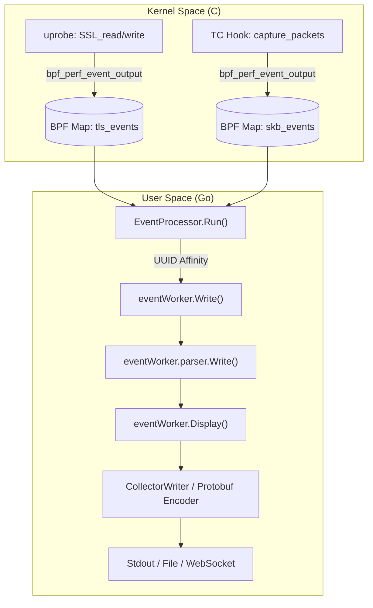
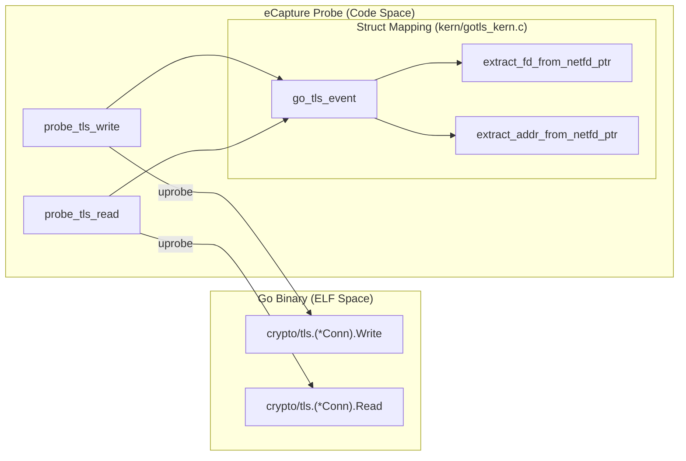

# Glossary

Relevant source files

The following files were used as context for generating this wiki page:

- [CHANGELOG.md](https://github.com/gojue/ecapture/blob/943a19fe/CHANGELOG.md)
- [README.md](https://github.com/gojue/ecapture/blob/943a19fe/README.md)
- [builder/Dockerfile](https://github.com/gojue/ecapture/blob/943a19fe/builder/Dockerfile)
- [builder/init_env.sh](https://github.com/gojue/ecapture/blob/943a19fe/builder/init_env.sh)
- [cli/cmd/root.go](https://github.com/gojue/ecapture/blob/943a19fe/cli/cmd/root.go)
- [examples/ecaptureq_client/README.md](https://github.com/gojue/ecapture/blob/943a19fe/examples/ecaptureq_client/README.md)
- [examples/ecaptureq_client/TESTING.md](https://github.com/gojue/ecapture/blob/943a19fe/examples/ecaptureq_client/TESTING.md)
- [examples/ecaptureq_client/go.mod](https://github.com/gojue/ecapture/blob/943a19fe/examples/ecaptureq_client/go.mod)
- [examples/ecaptureq_client/go.sum](https://github.com/gojue/ecapture/blob/943a19fe/examples/ecaptureq_client/go.sum)
- [functions.mk](https://github.com/gojue/ecapture/blob/943a19fe/functions.mk)
- [internal/probe/gotls/config.go](https://github.com/gojue/ecapture/blob/943a19fe/internal/probe/gotls/config.go)
- [internal/probe/gotls/event.go](https://github.com/gojue/ecapture/blob/943a19fe/internal/probe/gotls/event.go)
- [internal/probe/gotls/event_test.go](https://github.com/gojue/ecapture/blob/943a19fe/internal/probe/gotls/event_test.go)
- [kern/boringssl_masterkey.h](https://github.com/gojue/ecapture/blob/943a19fe/kern/boringssl_masterkey.h)
- [kern/common.h](https://github.com/gojue/ecapture/blob/943a19fe/kern/common.h)
- [kern/ecapture.h](https://github.com/gojue/ecapture/blob/943a19fe/kern/ecapture.h)
- [kern/gotls_kern.c](https://github.com/gojue/ecapture/blob/943a19fe/kern/gotls_kern.c)
- [kern/openssl.h](https://github.com/gojue/ecapture/blob/943a19fe/kern/openssl.h)
- [kern/openssl_masterkey.h](https://github.com/gojue/ecapture/blob/943a19fe/kern/openssl_masterkey.h)
- [kern/openssl_masterkey_3.0.h](https://github.com/gojue/ecapture/blob/943a19fe/kern/openssl_masterkey_3.0.h)
- [kern/tc.h](https://github.com/gojue/ecapture/blob/943a19fe/kern/tc.h)
- [main.go](https://github.com/gojue/ecapture/blob/943a19fe/main.go)
- [pkg/ecaptureq/README.md](https://github.com/gojue/ecapture/blob/943a19fe/pkg/ecaptureq/README.md)
- [pkg/event_processor/http_request.go](https://github.com/gojue/ecapture/blob/943a19fe/pkg/event_processor/http_request.go)
- [pkg/event_processor/http_response.go](https://github.com/gojue/ecapture/blob/943a19fe/pkg/event_processor/http_response.go)
- [pkg/event_processor/iparser.go](https://github.com/gojue/ecapture/blob/943a19fe/pkg/event_processor/iparser.go)
- [pkg/event_processor/iworker.go](https://github.com/gojue/ecapture/blob/943a19fe/pkg/event_processor/iworker.go)
- [pkg/event_processor/processor.go](https://github.com/gojue/ecapture/blob/943a19fe/pkg/event_processor/processor.go)
- [protobuf/gen/v1/ecaptureq.pb.go](https://github.com/gojue/ecapture/blob/943a19fe/protobuf/gen/v1/ecaptureq.pb.go)
- [protobuf/proto/v1/ecaptureq.proto](https://github.com/gojue/ecapture/blob/943a19fe/protobuf/proto/v1/ecaptureq.proto)
- [variables.mk](https://github.com/gojue/ecapture/blob/943a19fe/variables.mk)

This page provides definitions for codebase-specific terminology, eBPF domain concepts, and technical jargon used throughout the eCapture project. It serves as a reference for onboarding engineers to understand the implementation details and data flow of the system.

## eBPF and Kernel Concepts

### BTF (BPF Type Format)
A metadata format which describes the data types of BPF programs and the Linux kernel. eCapture uses BTF to support **CO-RE** (Compile Once – Run Everywhere), allowing a single binary to run on different kernel versions without recompilation.
*   **Code Pointer:** `globalConf.BtfMode` in [cli/cmd/root.go:163-163](https://github.com/gojue/ecapture/blob/943a19fe/cli/cmd/root.go#L163-L163).
*   **Implementation:** eCapture checks for BTF availability to decide between loading CO-RE or non-CO-RE bytecode.

### CO-RE vs. Non-CO-RE
*   **CO-RE:** Uses `vmlinux.h` and BPF relocations. Enabled via the `#ifndef NOCORE` block in [kern/ecapture.h:18-26](https://github.com/gojue/ecapture/blob/943a19fe/kern/ecapture.h#L18-L26).
*   **Non-CO-RE:** Legacy mode for kernels without BTF support. It uses standard Linux headers and requires specific bytecode for specific kernel versions. Defined in [kern/ecapture.h:28-88](https://github.com/gojue/ecapture/blob/943a19fe/kern/ecapture.h#L28-L88).

### Uprobe / Uretprobe
User-space probes. eCapture attaches these to functions in shared libraries (like `SSL_read` in OpenSSL) to intercept plaintext data.
*   **Code Pointer:** [kern/openssl_masterkey.h:163-164](https://github.com/gojue/ecapture/blob/943a19fe/kern/openssl_masterkey.h#L163-L164) (uprobe for master key extraction).

### TC (Traffic Control) Classifier
eBPF programs attached to the network interface's egress/ingress hooks. Used in eCapture for `pcap` mode to capture raw packets.
*   **Code Pointer:** `capture_packets` function in [kern/tc.h:136-199](https://github.com/gojue/ecapture/blob/943a19fe/kern/tc.h#L136-L199).

---

## eCapture Subsystems

### EventProcessor
The central hub in user-space that receives raw bytes from eBPF maps and dispatches them to specific workers.
*   **Code Pointer:** `EventProcessor` struct in [pkg/event_processor/processor.go](https://github.com/gojue/ecapture/blob/943a19fe/pkg/event_processor/processor.go).

### EventWorker
A per-connection or per-thread worker that handles the stateful reassembly and parsing of captured data. It maintains a buffer (`payload`) and an `IParser`.
*   **Code Pointer:** `eventWorker` struct in [pkg/event_processor/iworker.go:69-88](https://github.com/gojue/ecapture/blob/943a19fe/pkg/event_processor/iworker.go#L69-L88).
*   **Functions:** `Display()` [pkg/event_processor/iworker.go:174-227](https://github.com/gojue/ecapture/blob/943a19fe/pkg/event_processor/iworker.go#L174-L227) and `Run()` [pkg/event_processor/iworker.go:261-265](https://github.com/gojue/ecapture/blob/943a19fe/pkg/event_processor/iworker.go#L261-L265).

### IParser
An interface for protocol-specific parsers (e.g., HTTP/1.1, HTTP/2). It transforms raw byte streams into structured logs.
*   **Code Pointer:** `IParser` interface in [pkg/event_processor/iparser.go](https://github.com/gojue/ecapture/blob/943a19fe/pkg/event_processor/iparser.go).

### eCaptureQ
A WebSocket-based remote event distribution system. It allows eCapture to act as a server, pushing captured events to remote clients using Protobuf.
*   **Code Pointer:** `pkg/ecaptureq/` and `globalConf.EcaptureQ` in [cli/cmd/root.go:170-170](https://github.com/gojue/ecapture/blob/943a19fe/cli/cmd/root.go#L170-L170).

---

## TLS & Crypto Terminology

### Master Secret / Keylog
The secret material used to derive encryption keys for a TLS session. eCapture extracts these to allow Wireshark to decrypt traffic.
*   **Code Pointer:** `mastersecret_bssl_t` in [kern/boringssl_masterkey.h:33-52](https://github.com/gojue/ecapture/blob/943a19fe/kern/boringssl_masterkey.h#L33-L52) and `mastersecret_gotls_t` in [kern/gotls_kern.c:50-57](https://github.com/gojue/ecapture/blob/943a19fe/kern/gotls_kern.c#L50-L57).

### SSL/TLS Plaintext Fragment
The decrypted data captured from library functions like `SSL_read` and `SSL_write`. eCapture limits this to `MAX_DATA_SIZE_OPENSSL` (16KB) to fit within eBPF map constraints.
*   **Code Pointer:** [kern/common.h:39-39](https://github.com/gojue/ecapture/blob/943a19fe/kern/common.h#L39-L39).

---

## Code Entity Mapping Diagrams

### Data Path: From Kernel Hook to User Output
This diagram bridges the gap between the C-based kernel probes and the Go-based processing pipeline.

**Sources:** [pkg/event_processor/iworker.go:153-161](https://github.com/gojue/ecapture/blob/943a19fe/pkg/event_processor/iworker.go#L153-L161), [pkg/event_processor/iworker.go:174-227](https://github.com/gojue/ecapture/blob/943a19fe/pkg/event_processor/iworker.go#L174-L227), [kern/openssl.h:187-189](https://github.com/gojue/ecapture/blob/943a19fe/kern/openssl.h#L187-L189), [kern/tc.h:58-63](https://github.com/gojue/ecapture/blob/943a19fe/kern/tc.h#L58-L63).

### GoTLS Implementation: Symbol to Struct Mapping
GoTLS capture relies on specific offsets in the Go runtime and TLS library.

**Sources:** [kern/gotls_kern.c:31-48](https://github.com/gojue/ecapture/blob/943a19fe/kern/gotls_kern.c#L31-L48), [kern/gotls_kern.c:132-144](https://github.com/gojue/ecapture/blob/943a19fe/kern/gotls_kern.c#L132-L144), [kern/gotls_kern.c:162-165](https://github.com/gojue/ecapture/blob/943a19fe/kern/gotls_kern.c#L162-L165).

---

## Build System Vocabulary

| Term | Definition | Code Reference |
| :--- | :--- | :--- |
| `BYTECODE_FILES` | Makefile variable defining which eBPF programs to compile. | [variables.mk:36-36](https://github.com/gojue/ecapture/blob/943a19fe/variables.mk#L36-L36) |
| `go-bindata` | Tool used to embed eBPF `.o` or `.nocore` files into the Go binary. | [main.go:4-4](https://github.com/gojue/ecapture/blob/943a19fe/main.go#L4-L4) |
| `EXTRA_CFLAGS` | Compiler flags for eBPF programs, including optimization levels (`-O2`). | [variables.mk:236-240](https://github.com/gojue/ecapture/blob/943a19fe/variables.mk#L236-L240) |
| `TARGET_TAG` | Build tag used to differentiate between `linux` and `ecap_android`. | [variables.mk:65-68](https://github.com/gojue/ecapture/blob/943a19fe/variables.mk#L65-L68) |

**Sources:** [variables.mk:36-36](https://github.com/gojue/ecapture/blob/943a19fe/variables.mk#L36-L36), [variables.mk:65-68](https://github.com/gojue/ecapture/blob/943a19fe/variables.mk#L65-L68), [variables.mk:236-240](https://github.com/gojue/ecapture/blob/943a19fe/variables.mk#L236-L240), [main.go:4-4](https://github.com/gojue/ecapture/blob/943a19fe/main.go#L4-L4).