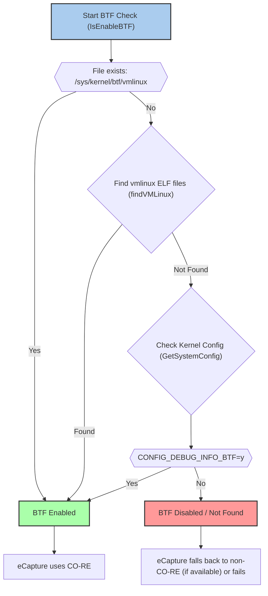
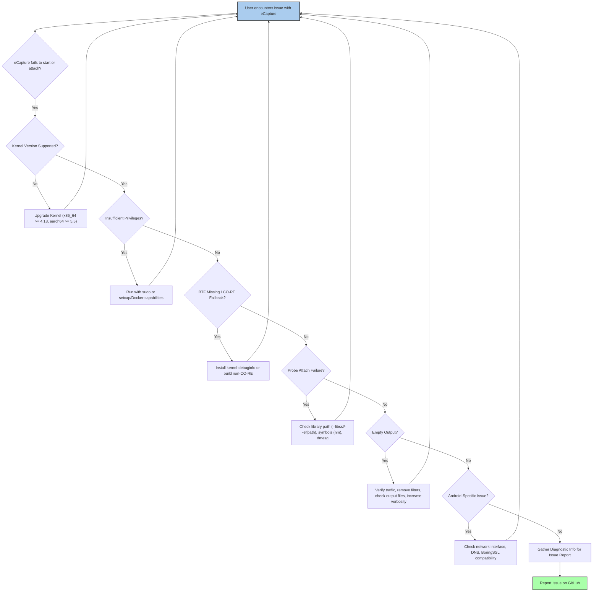

# FAQ and Troubleshooting

<details>
<summary>Relevant source files</summary>

The following files were used as context for generating this wiki page:

- [.github/ISSUE_TEMPLATE/bug_report.md](https://github.com/gojue/ecapture/blob/943a19fe/.github/ISSUE_TEMPLATE/bug_report.md)
- [.golangci.yml](https://github.com/gojue/ecapture/blob/943a19fe/.golangci.yml)
- [CHANGELOG.md](https://github.com/gojue/ecapture/blob/943a19fe/CHANGELOG.md)
- [README.md](https://github.com/gojue/ecapture/blob/943a19fe/README.md)
- [cli/cmd/env_detection.go](https://github.com/gojue/ecapture/blob/943a19fe/cli/cmd/env_detection.go)
- [main.go](https://github.com/gojue/ecapture/blob/943a19fe/main.go)
- [pkg/util/ebpf/bpf.go](https://github.com/gojue/ecapture/blob/943a19fe/pkg/util/ebpf/bpf.go)
- [pkg/util/ebpf/bpf_linux.go](https://github.com/gojue/ecapture/blob/943a19fe/pkg/util/ebpf/bpf_linux.go)
- [pkg/util/ebpf/bpf_test.go](https://github.com/gojue/ecapture/blob/943a19fe/pkg/util/ebpf/bpf_test.go)
- [pkg/util/kernel/kernel_version.go](https://github.com/gojue/ecapture/blob/943a19fe/pkg/util/kernel/kernel_version.go)
- [pkg/util/kernel/kernel_version_unsupport.go](https://github.com/gojue/ecapture/blob/943a19fe/pkg/util/kernel/kernel_version_unsupport.go)
- [pkg/util/kernel/version.go](https://github.com/gojue/ecapture/blob/943a19fe/pkg/util/kernel/version.go)

</details>


This page provides a consolidated list of common issues encountered during eCapture installation, runtime, and integration. It covers problems such as missing BTF information, insufficient privileges, unsupported kernel versions, probe attachment failures, empty output, and Android-specific challenges. It also outlines how to gather diagnostic information for effective issue reporting.

## 1. BTF Missing (CO-RE Fallback)

eCapture primarily leverages CO-RE (Compile Once – Run Everywhere) for its eBPF programs, which relies on BTF (BPF Type Format) information available on the host kernel. If BTF is not found, eCapture attempts to fall back to non-CO-RE mode, which requires a kernel header package or a pre-compiled eBPF program specific to your kernel.

**Problem:** You might see errors related to missing BTF or `vmlinux` files, or warnings about falling back to non-CO-RE mode.

**How eCapture detects BTF:**
eCapture checks for BTF availability in two main ways:
1.  **`/sys/kernel/btf/vmlinux`**: It first checks for the presence of the BTF file at `/sys/kernel/btf/vmlinux` [pkg/util/ebpf/bpf.go:89-94](https://github.com/gojue/ecapture/blob/943a19fe/pkg/util/ebpf/bpf.go#L89-L94).
2.  **`vmlinux` ELF files**: If the `/sys/kernel/btf/vmlinux` file is not found, it scans a list of common locations for `vmlinux` ELF files that contain BTF information [pkg/util/ebpf/bpf.go:100-116](https://github.com/gojue/ecapture/blob/943a19fe/pkg/util/ebpf/bpf.go#L100-L116). These locations include:
    *   `/boot/vmlinux-%s`
    *   `/lib/modules/%s/vmlinux-%[1]s`
    *   `/lib/modules/%s/build/vmlinux`
    *   `/usr/lib/modules/%s/kernel/vmlinux`
    *   `/usr/lib/debug/boot/vmlinux-%s`
    *   `/usr/lib/debug/boot/vmlinux-%s.debug`
    *   `/usr/lib/debug/lib/modules/%s/vmlinux`
    [pkg/util/ebpf/bpf_linux.go:37-45](https://github.com/gojue/ecapture/blob/943a19fe/pkg/util/ebpf/bpf_linux.go#L37-L45)
3.  **Kernel Configuration**: Finally, it checks the kernel configuration for `CONFIG_DEBUG_INFO_BTF=y` [pkg/util/ebpf/bpf.go:131-142](https://github.com/gojue/ecapture/blob/943a19fe/pkg/util/ebpf/bpf.go#L131-L142). This configuration indicates that the kernel was compiled with BTF support. The kernel configuration files are searched in paths like `/proc/config.gz`, `/boot/config`, `/boot/config-%s`, and `/lib/modules/%s/build/.config` [pkg/util/ebpf/bpf.go:38-43](https://github.com/gojue/ecapture/blob/943a19fe/pkg/util/ebpf/bpf.go#L38-L43).

**Troubleshooting Steps:**

1.  **Check for `/sys/kernel/btf/vmlinux`**:
    ```bash
    ls /sys/kernel/btf/vmlinux
    ```
    If this file exists, your kernel supports BTF.
2.  **Install `kernel-debuginfo` or `kernel-devel`**: On many distributions, installing the debug information package for your kernel will provide the necessary `vmlinux` file with BTF.
    *   **Debian/Ubuntu**: `sudo apt install linux-image-$(uname -r)-dbg`
    *   **CentOS/RHEL/Fedora**: `sudo dnf debuginfo-install kernel-$(uname -r)` or `sudo yum install kernel-devel`
3.  **Build from source (non-CO-RE)**: If you cannot enable BTF or find the debug symbols, you might need to build eCapture from source in non-CO-RE mode, which requires kernel headers to be present during compilation. Refer to the [Compilation and Build]() page for details.

**Diagram: BTF Detection Flow**

Sources: [pkg/util/ebpf/bpf.go:89-143](https://github.com/gojue/ecapture/blob/943a19fe/pkg/util/ebpf/bpf.go#L89-L143), [pkg/util/ebpf/bpf_linux.go:37-45](https://github.com/gojue/ecapture/blob/943a19fe/pkg/util/ebpf/bpf_linux.go#L37-L45)

## 2. Insufficient Privileges (Capability Errors)

eCapture requires elevated privileges to load eBPF programs and attach probes. Running without the necessary Linux Capabilities will result in permission denied errors.

**Problem:** You see errors like `permission denied`, `operation not permitted`, or `failed to load bpf programs`.

**Error Message Example:**
`the current user does not have CAP_BPF to load bpf programs. Please run as root or use sudo or add the --privileged=true flag for Docker` [cli/cmd/env_detection.go:58-59](https://github.com/gojue/ecapture/blob/943a19fe/cli/cmd/env_detection.go#L58-L59)

**Required Capabilities:**
The specific capabilities depend on your kernel version:

*   **Kernel < 5.8**: Requires `CAP_SYS_ADMIN`. This is a broad capability and should be used with caution.
*   **Kernel >= 5.8**: Can use the more fine-grained set of `CAP_BPF`, `CAP_PERFMON`, and `CAP_SYS_PTRACE`.
*   **Pcapng mode**: Additionally requires `CAP_NET_ADMIN` to create network interfaces for packet capture.

eCapture performs a check for `CAP_BPF` or `CAP_SYS_ADMIN` at startup [cli/cmd/env_detection.go:47-60](https://github.com/gojue/ecapture/blob/943a19fe/cli/cmd/env_detection.go#L47-L60).

**Troubleshooting Steps:**

1.  **Run with `sudo`**: The simplest solution is to run eCapture with `sudo`.
    ```bash
    sudo ecapture tls
    ```
2.  **Grant specific capabilities (recommended for production)**: Use `setcap` to grant the binary the required capabilities.
    ```bash
    # For kernels >= 5.8 (recommended)
    sudo setcap 'cap_bpf,cap_perfmon,cap_sys_ptrace+ep' /path/to/ecapture
    # If using pcapng mode, also add CAP_NET_ADMIN
    sudo setcap 'cap_bpf,cap_perfmon,cap_sys_ptrace,cap_net_admin+ep' /path/to/ecapture

    # For kernels < 5.8 (less secure)
    sudo setcap 'cap_sys_admin+ep' /path/to/ecapture
    ```
    After setting capabilities, you can run eCapture as a non-root user.
3.  **Docker containers**: When running eCapture in Docker, use `--privileged=true` (less secure) or specify individual capabilities.
    ```bash
    # Less secure, grants all capabilities
    docker run --rm --privileged=true --net=host gojue/ecapture tls

    # More secure, specify capabilities
    docker run --rm --cap-add=BPF --cap-add=PERFMON --cap-add=SYS_PTRACE --net=host gojue/ecapture tls
    # Add --cap-add=NET_ADMIN for pcapng mode
    ```
    Refer to the [Minimum Privileges]() page for detailed examples.

Sources: [cli/cmd/env_detection.go:47-60](https://github.com/gojue/ecapture/blob/943a19fe/cli/cmd/env_detection.go#L47-L60), [README.md:70](https://github.com/gojue/ecapture/blob/943a19fe/README.md#L70)

## 3. Unsupported Kernels

eCapture has minimum kernel version requirements due to the eBPF features it utilizes.

**Problem:** eCapture exits with an error indicating an unsupported kernel version.

**Error Message Example:**
`the Linux/Android Kernel version 4.15.0 (x86_64) is not supported. Requires a version greater than 4.18` [cli/cmd/env_detection.go:35-36](https://github.com/gojue/ecapture/blob/943a19fe/cli/cmd/env_detection.go#L35-L36)

**Minimum Kernel Versions:**

*   **x86_64**: Linux kernel version 4.18 or higher [cli/cmd/env_detection.go:33-36](https://github.com/gojue/ecapture/blob/943a19fe/cli/cmd/env_detection.go#L33-L36)
*   **aarch64**: Linux kernel version 5.5 or higher [cli/cmd/env_detection.go:37-40](https://github.com/gojue/ecapture/blob/943a19fe/cli/cmd/env_detection.go#L37-L40)

**Troubleshooting Steps:**

1.  **Check your kernel version**:
    ```bash
    uname -r
    ```
2.  **Upgrade your kernel**: If your kernel is below the minimum requirement, you will need to upgrade it. This process varies by distribution.
    *   **Ubuntu/Debian**: `sudo apt update && sudo apt upgrade` (may not upgrade to a new major kernel version) or install a specific kernel version.
    *   **CentOS/RHEL/Fedora**: `sudo dnf update kernel` or `sudo yum update kernel`.
3.  **Consider a different environment**: If upgrading the kernel is not feasible, consider running eCapture in a virtual machine or container with a supported kernel version.

Sources: [cli/cmd/env_detection.go:27-43](https://github.com/gojue/ecapture/blob/943a19fe/cli/cmd/env_detection.go#L27-L43), [README.md:13](https://github.com/gojue/ecapture/blob/943a19fe/README.md#L13)

## 4. Probe Attach Failures (Missing Symbols, Wrong Library Path)

eCapture uses `uprobes` to attach to specific functions within user-space libraries (e.g., `SSL_read`, `SSL_write` in OpenSSL). If the target library or function cannot be found, the probe will fail to attach.

**Problem:** You see errors like `failed to attach uprobe`, `symbol not found`, or `library not found`.

**Common Causes:**

*   **Incorrect library path**: eCapture tries to auto-detect library paths (e.g., for OpenSSL, it searches `/etc/ld.so.conf` and common locations) [README.md:108](https://github.com/gojue/ecapture/blob/943a19fe/README.md#L108). If the library is installed in a non-standard location, auto-detection might fail.
*   **Statically compiled binaries**: If the target application is statically compiled, the functions eCapture tries to hook might not be exposed as dynamic symbols. For GoTLS, if the binary is stripped, symbol information is lost.
*   **Unsupported library version**: While eCapture supports a wide range of library versions, very old or very new, untested versions might have different internal function names or structures.
*   **Missing debug symbols**: Sometimes, the symbols required for `uprobe` attachment are only available in debug symbol packages.

**Troubleshooting Steps:**

1.  **Specify library path manually**: Use the `--libssl` (for TLS probe) or `--elfpath` (for GoTLS probe) flag to explicitly point to the target library or binary.
    ```bash
    # For OpenSSL
    sudo ecapture tls --libssl /usr/lib/x86_64-linux-gnu/libssl.so.1.1

    # For GoTLS (if the Go binary is stripped, you might need the unstripped version or a symbol file)
    sudo ecapture gotls --elfpath /path/to/your/go_application
    ```
    If the target program is statically compiled, you can set the program path directly as the `--libssl` flag value [README.md:112](https://github.com/gojue/ecapture/blob/943a19fe/README.md#L112).
2.  **Check for debug symbols**: Ensure that debug symbol packages for the target library are installed if necessary.
    *   **Debian/Ubuntu**: `sudo apt install libssl-dev` (for OpenSSL development headers and symbols)
3.  **Verify function existence**: Use `nm -D /path/to/library.so | grep SSL_read` to check if the target function (`SSL_read`, `SSL_write`, `PR_Read`, `PR_Write`, `dispatch_command`, `exec_simple_query`, `readline`, `rl_line_buffer`, etc.) exists in the library.
4.  **Check `dmesg` for eBPF errors**: Kernel logs (`dmesg`) might contain more detailed eBPF-related errors if the probe attachment fails at a lower level.
5.  **Consult probe-specific documentation**: Each probe (TLS, GoTLS, GnuTLS, NSS, MySQL, PostgreSQL, Bash, Zsh) has specific requirements and supported versions. Refer to the [Probe Reference]() section for details.

## 5. Empty Output

You run eCapture, it starts successfully, but no output is displayed, even when traffic is clearly flowing.

**Problem:** eCapture runs without errors but produces no captured data.

**Common Causes:**

*   **No matching traffic**: The target application might not be using the hooked library, or no relevant traffic is occurring.
*   **Incorrect PID filtering**: If you're using `--pid` or `--uid` filters, ensure they correctly match the target process. Note that `--pid`/`--uid` filters are silently ignored on kernels < 5.2 [CHANGELOG.md:7](https://github.com/gojue/ecapture/blob/943a19fe/CHANGELOG.md#L7).
*   **Application not using the hooked function**: For example, an application might use a different TLS library than OpenSSL, or a custom network stack.
*   **eBPF program not triggering**: The eBPF program might be loaded, but the specific code path it's designed to hook is not being executed by the target application.
*   **Output mode configuration**: If you're using `pcapng` or `keylog` mode, output might be written to a file instead of stdout.
*   **Container environment issues**: In some container setups, process namespaces or network configurations might prevent eCapture from seeing the target process or traffic.

**Troubleshooting Steps:**

1.  **Verify target application activity**: Ensure the application you are trying to monitor is actively generating traffic that uses the hooked library. For example, if using `tls` probe, make sure an HTTPS request is made.
2.  **Remove filters**: Temporarily remove any `--pid`, `--uid`, or other filters to ensure they are not inadvertently blocking output.
3.  **Check output files**: If using `pcapng` or `keylog` mode, verify the specified output file (`--pcapfile`, `--keylogfile`) exists and contains data.
    ```bash
    # Check pcapng file
    ls -lh ecapture_openssl.pcapng
    # Check keylog file
    cat openssl_keylog.log
    ```
4.  **Increase verbosity**: Run eCapture with `-v` or `--debug` flags to get more detailed logging, which might indicate why no events are being processed.
5.  **Test with a known working example**: Try capturing traffic from a simple `curl https://google.com` command to confirm basic functionality.
6.  **Check `dmesg`**: Look for any eBPF-related warnings or errors in the kernel logs that might explain why events are not being generated or processed.
7.  **Cgroup filtering**: If running in a containerized environment, ensure cgroup filtering is correctly configured, especially for `TC hook` and `GoTLS uprobe` [CHANGELOG.md:20](https://github.com/gojue/ecapture/blob/943a19fe/CHANGELOG.md#L20).

## 6. Android-Specific Issues

eCapture supports Android GKI (Generic Kernel Image) on aarch64 devices with kernel >= 5.5. Android environments often have unique challenges.

**Problem:** Issues specific to Android, such as network interface detection, DNS resolution, or BoringSSL version compatibility.

**Common Android-Specific Issues:**

*   **Network interface auto-detection**: Android devices might have different network interface naming conventions or active interfaces.
*   **DNS resolution**: Android emulators or specific device configurations might have issues with DNS resolution, affecting `curl` or other network tools used for testing.
*   **BoringSSL versions**: Android uses BoringSSL, and specific versions (e.g., `a_13` ~ `a_16` and `na` branches) require special handling by the `tls` probe.
*   **`--pid`/`--uid` filtering**: As mentioned, these filters are ignored on kernels < 5.2, which might be relevant for older Android kernels.

**Troubleshooting Steps:**

1.  **Verify Android GKI and kernel version**: Ensure your Android device is running a GKI kernel and meets the minimum version requirement (aarch64 >= 5.5).
2.  **Check active network interface for PCAP mode**: eCapture attempts to auto-detect the active network interface for Android e2e PCAP mode [CHANGELOG.md:31](https://github.com/gojue/ecapture/blob/943a19fe/CHANGELOG.md#L31). If this fails, you might need to manually specify the interface using the `-i` flag.
    ```bash
    # Find active interface on Android (e.g., wlan0, eth0, rmnet_data0)
    ip a
    # Then use with ecapture
    sudo ecapture tls -m pcap -i rmnet_data0
    ```
3.  **DNS resolution for Android emulator**: If you encounter DNS issues, especially in emulators, eCapture might improve DNS resolution by using a custom DNS server [CHANGELOG.md:82](https://github.com/gojue/ecapture/blob/943a19fe/CHANGELOG.md#L82). Ensure your emulator's network settings are correct.
4.  **BoringSSL compatibility**: The `tls` probe has specific logic for Android BoringSSL versions. If you suspect compatibility issues, check the eCapture source code or report an issue with your Android version and BoringSSL version.
5.  **Build with `ecap_android` tag**: When building for Android, ensure you use the `ecap_android` build tag (formerly `androidgki`) [CHANGELOG.md:99](https://github.com/gojue/ecapture/blob/943a19fe/CHANGELOG.md#L99).
    ```bash
    make android
    ```

## 7. How to Gather Diagnostic Information for an Issue Report

When reporting an issue, providing comprehensive diagnostic information helps maintainers quickly understand and resolve the problem.

**Essential Information for a Bug Report:**

1.  **Description of the bug**: A clear and concise explanation of what went wrong.
2.  **Steps to reproduce**: A numbered list of steps that reliably trigger the bug.
3.  **Screenshots/Logs**: If applicable, include screenshots of the error or relevant log output.
4.  **Environment details**:
    *   **Device/OS**: `Linux Server` or `Pixel 9` (or other Android device) [/.github/ISSUE_TEMPLATE/bug_report.md:29](https://github.com/gojue/ecapture/blob/943a19fe//.github/ISSUE_TEMPLATE/bug_report.md#L29)
    *   **Kernel Info**: Output of `uname -a` [/.github/ISSUE_TEMPLATE/bug_report.md:30](https://github.com/gojue/ecapture/blob/943a19fe//.github/ISSUE_TEMPLATE/bug_report.md#L30)
    *   **eCapture Version**: Output of `ecapture -v` [/.github/ISSUE_TEMPLATE/bug_report.md:31](https://github.com/gojue/ecapture/blob/943a19fe//.github/ISSUE_TEMPLATE/bug_report.md#L31)
    *   **CPU Architecture**: `x86_64` or `aarch64`
    *   **Container environment**: If running in Docker or Kubernetes, specify versions and relevant configurations (e.g., `--privileged`, `securityContext`).
5.  **eCapture command used**: The exact `ecapture` command you executed.
6.  **Full eCapture output**: Copy-paste the complete output from eCapture, including any error messages or warnings.
7.  **`dmesg` output**: Relevant kernel log messages, especially those containing `bpf` or `uprobe`.
    ```bash
    sudo dmesg | grep -i "bpf\|uprobe"
    ```
8.  **Target application details**:
    *   Name and version of the application being monitored (e.g., `nginx 1.20`, `curl 7.68`).
    *   Path to the target library or binary (e.g., `/usr/lib/x86_64-linux-gnu/libssl.so.1.1`, `/path/to/go_app`).
    *   If applicable, output of `ldd /path/to/application` or `nm -D /path/to/library.so`.
9.  **Kernel configuration**: If BTF is an issue, provide relevant kernel config options.
    ```bash
    # Try to find your kernel config
    zcat /proc/config.gz | grep -E "CONFIG_BPF|CONFIG_UPROBES|CONFIG_ARCH_SUPPORTS_UPROBES|CONFIG_DEBUG_INFO_BTF"
    ```

**Example of a good issue report:**
Refer to the `.github/ISSUE_TEMPLATE/bug_report.md` template for a structured approach to reporting bugs.

Sources: [/.github/ISSUE_TEMPLATE/bug_report.md:1-34](https://github.com/gojue/ecapture/blob/943a19fe//.github/ISSUE_TEMPLATE/bug_report.md#L1-L34)

## Diagram: Troubleshooting Flow

Sources: [cli/cmd/env_detection.go:27-60](https://github.com/gojue/ecapture/blob/943a19fe/cli/cmd/env_detection.go#L27-L60), [pkg/util/ebpf/bpf.go:89-143](https://github.com/gojue/ecapture/blob/943a19fe/pkg/util/ebpf/bpf.go#L89-L143), [pkg/util/ebpf/bpf_linux.go:37-45](https://github.com/gojue/ecapture/blob/943a19fe/pkg/util/ebpf/bpf_linux.go#L37-L45), [README.md:108-112](https://github.com/gojue/ecapture/blob/943a19fe/README.md#L108-L112), [CHANGELOG.md:7](https://github.com/gojue/ecapture/blob/943a19fe/CHANGELOG.md#L7), [CHANGELOG.md:20](https://github.com/gojue/ecapture/blob/943a19fe/CHANGELOG.md#L20), [CHANGELOG.md:31](https://github.com/gojue/ecapture/blob/943a19fe/CHANGELOG.md#L31), [CHANGELOG.md:82](https://github.com/gojue/ecapture/blob/943a19fe/CHANGELOG.md#L82), [CHANGELOG.md:99](https://github.com/gojue/ecapture/blob/943a19fe/CHANGELOG.md#L99), [/.github/ISSUE_TEMPLATE/bug_report.md:1-34](https://github.com/gojue/ecapture/blob/943a19fe//.github/ISSUE_TEMPLATE/bug_report.md#L1-L34)