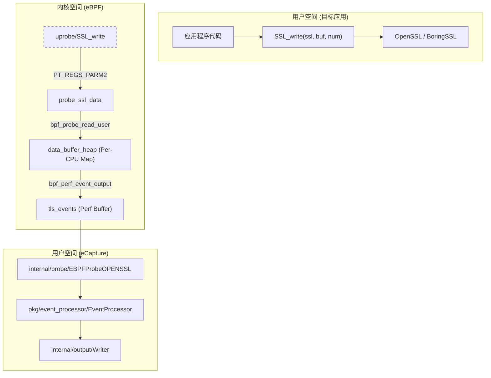
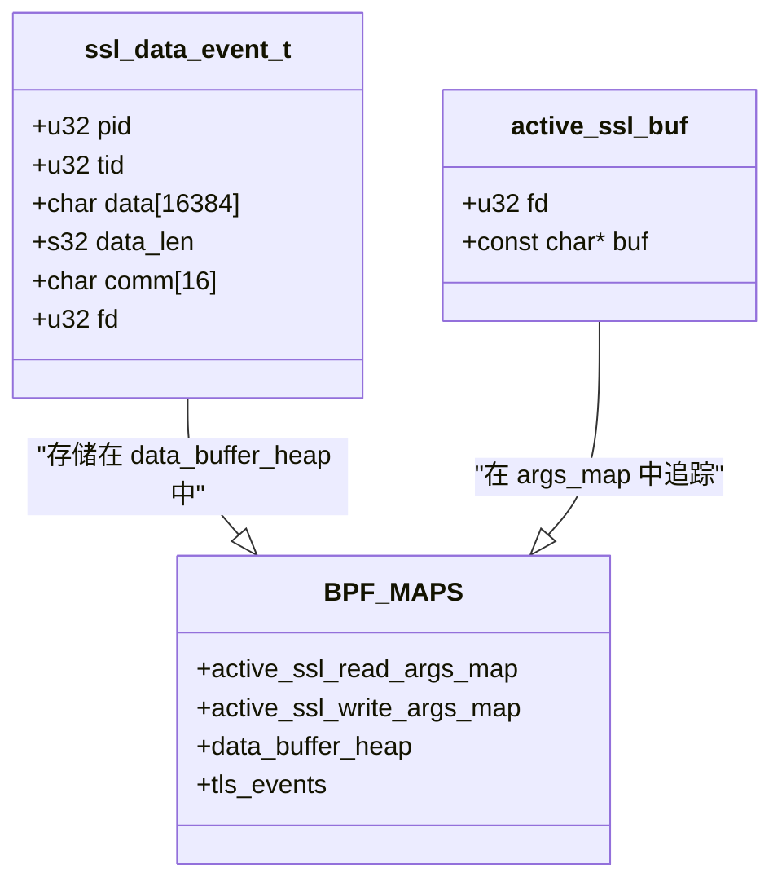

# 核心功能与特性

相关源文件

以下文件被用作生成此维基页面的上下文：

- [CHANGELOG.md](https://github.com/gojue/ecapture/blob/943a19fe/CHANGELOG.md)
- [README.md](https://github.com/gojue/ecapture/blob/943a19fe/README.md)
- [kern/boringssl_masterkey.h](https://github.com/gojue/ecapture/blob/943a19fe/kern/boringssl_masterkey.h)
- [kern/common.h](https://github.com/gojue/ecapture/blob/943a19fe/kern/common.h)
- [kern/ecapture.h](https://github.com/gojue/ecapture/blob/943a19fe/kern/ecapture.h)
- [kern/openssl.h](https://github.com/gojue/ecapture/blob/943a19fe/kern/openssl.h)
- [kern/openssl_masterkey.h](https://github.com/gojue/ecapture/blob/943a19fe/kern/openssl_masterkey.h)
- [kern/openssl_masterkey_3.0.h](https://github.com/gojue/ecapture/blob/943a19fe/kern/openssl_masterkey_3.0.h)
- [kern/tc.h](https://github.com/gojue/ecapture/blob/943a19fe/kern/tc.h)
- [main.go](https://github.com/gojue/ecapture/blob/943a19fe/main.go)

eCapture (旁观者) 是一款基于 eBPF 的多功能观测工具，能够捕获明文流量和系统事件，而无需 SSL/TLS CA 证书或代理配置 [README.md:10-10](https://github.com/gojue/ecapture/blob/943a19fe/README.md#L10-L10)。通过直接挂载（hook）到用户态库和内核函数，eCapture 能够以极低的开销深入洞察加密通信、数据库查询和管理 shell 活动。

## 核心能力

eCapture 围绕三个主要功能支柱构建，这些功能作为专用模块实现，利用了 `uprobes`（用户态探针）和 `TC`（流量控制）分类器 [README.md:95-103](https://github.com/gojue/ecapture/blob/943a19fe/README.md#L95-L103)。

### 1. TLS/SSL 明文捕获
eCapture 的旗舰能力是从加密流中拦截明文数据。与需要安装根 CA 证书以执行中间人（MitM）攻击的传统工具（如 mitmproxy）不同，eCapture 直接挂载到加密库 [README.md:38-39](https://github.com/gojue/ecapture/blob/943a19fe/README.md#L38-L39)。

*   **库支持**：支持 OpenSSL (1.0.x, 1.1.x, 3.0.x)、BoringSSL、LibreSSL、GnuTLS、NSPR (NSS) 以及 Go 原生的 `crypto/tls` [README.md:95-103](https://github.com/gojue/ecapture/blob/943a19fe/README.md#L95-L103)。
*   **机制**：它将 `uprobes` 附加到 `SSL_read` 和 `SSL_write` 等函数上 [kern/openssl.h:163-165](https://github.com/gojue/ecapture/blob/943a19fe/kern/openssl.h#L163-L165)。它在加密前（写入时）或解密后（读取时）捕获数据缓冲区。
*   **流量类型**：支持 HTTP/1.1、HTTP/2 (HPACK)，甚至通过 BoringSSL 挂载点支持 HTTP/3 (QUIC) [README.md:122-123](https://github.com/gojue/ecapture/blob/943a19fe/README.md#L122-L123)。

### 2. 数据库 SQL 审计
eCapture 通过挂载客户端或服务器端的调度函数，提供透明的数据库查询审计。这允许安全团队在不开启数据库服务器自身沉重日志的情况下监控数据库活动。

*   **MySQL**：挂载 `dispatch_command` 以捕获 `COM_QUERY` (0x03) 数据包 [kern/common.h:47-47](https://github.com/gojue/ecapture/blob/943a19fe/kern/common.h#L47-L47)。支持 MySQL 5.6, 5.7, 8.0 和 MariaDB [README.md:42-42](https://github.com/gojue/ecapture/blob/943a19fe/README.md#L42-L42)。
*   **PostgreSQL**：挂载 `exec_simple_query` 以捕获 Postgres 10+ 中的 SQL 语句 [README.md:102-102](https://github.com/gojue/ecapture/blob/943a19fe/README.md#L102-L102)。

### 3. Shell 命令审计
为了主机安全和合规性，eCapture 监控交互式 shell 会话。
*   **Bash & Zsh**：挂载 `readline` 函数以捕获用户输入的命令 [README.md:96-97](https://github.com/gojue/ecapture/blob/943a19fe/README.md#L96-L97)。
*   **元数据**：捕获命令字符串以及 PID、UID 和时间戳 [kern/common.h:53-56](https://github.com/gojue/ecapture/blob/943a19fe/kern/common.h#L53-L56)。

---

## 与传统工具对比

| 特性 | tcpdump / Wireshark | mitmproxy / Fiddler | eCapture |
| :--- | :--- | :--- | :--- |
| **加密** | 仅看到加密二进制块 | 需要 CA 证书 / 中间人 | **看到明文** |
| **CA 证书** | 不需要 | **需要** | **不需要** |
| **协议支持** | 任何（但加密） | 仅限 HTTP/HTTPS | HTTP, SQL, Shell |
| **部署方式** | 被动 | 主动代理 | **被动 (eBPF)** |
| **性能** | 高 | 低（代理延迟） | **高（内核级）** |

---

## 技术架构与数据流

下图展示了 eCapture 如何利用 eBPF maps 桥接应用程序的用户态内存与用户态控制平面。

### 数据路径：从挂载点到输出
标题：eCapture TLS 数据提取流程

**Sources:** [kern/openssl.h:84-84](https://github.com/gojue/ecapture/blob/943a19fe/kern/openssl.h#L84-L84), [kern/openssl.h:113-118](https://github.com/gojue/ecapture/blob/943a19fe/kern/openssl.h#L113-L118), [kern/openssl.h:163-190](https://github.com/gojue/ecapture/blob/943a19fe/kern/openssl.h#L163-L190), [README.md:106-113](https://github.com/gojue/ecapture/blob/943a19fe/README.md#L106-L113)

---

## 实现细节：OpenSSL 探针

OpenSSL 探针是 eCapture 核心能力的代表性示例。它使用名为 `tls_events` 的 `perf_event_array` 将数据流传输到用户态 [kern/openssl.h:79-84](https://github.com/gojue/ecapture/blob/943a19fe/kern/openssl.h#L79-L84)。

标题：OpenSSL 探针代码实体

**Sources:** [kern/openssl.h:28-39](https://github.com/gojue/ecapture/blob/943a19fe/kern/openssl.h#L28-L39), [kern/openssl.h:57-67](https://github.com/gojue/ecapture/blob/943a19fe/kern/openssl.h#L57-L67), [kern/openssl.h:97-118](https://github.com/gojue/ecapture/blob/943a19fe/kern/openssl.h#L97-L118)

### 关键函数
*   **`probe_ssl_master_key`**：为 `keylog` 输出模式提取 TLS 会话密钥，允许 Wireshark 解密标准 PCAP 文件 [kern/openssl_masterkey.h:25-35](https://github.com/gojue/ecapture/blob/943a19fe/kern/openssl_masterkey.h#L25-L35)。
*   **`process_SSL_data`**：核心逻辑，将用户态缓冲区读取到 `ssl_data_event_t` 结构中并发送到 perf buffer [kern/openssl.h:163-190](https://github.com/gojue/ecapture/blob/943a19fe/kern/openssl.h#L163-L190)。
*   **`passes_filter`**：实现基于 PID、UID 和 CGroup ID 的全局过滤，以减少噪音 [kern/ecapture.h:127-146](https://github.com/gojue/ecapture/blob/943a19fe/kern/ecapture.h#L127-L146)。

---

## 典型使用场景

1.  **安全审计与事件响应**：
    *   在不破坏端到端加密的情况下监控可疑的出站 HTTPS 流量。
    *   实时审计管理 shell 命令以满足合规性要求 [README.md:40-41](https://github.com/gojue/ecapture/blob/943a19fe/README.md#L40-L41)。
2.  **流量分析与调试**：
    *   调试由服务网格（如 Istio, Linkerd）管理证书的微服务间通信。
    *   在难以配置代理的环境中分析 HTTP/2 或 HTTP/3 流量 [README.md:122-123](https://github.com/gojue/ecapture/blob/943a19fe/README.md#L122-L123)。
3.  **数据库监控**：
    *   捕获 SQL 查询用于性能调优或数据泄露防护，无需修改应用程序代码或数据库配置 [README.md:42-42](https://github.com/gojue/ecapture/blob/943a19fe/README.md#L42-L42)。
4.  **恶意软件分析**：
    *   观察使用硬编码 OpenSSL 或 BoringSSL 库的恶意软件的明文 C2（命令与控制）通信。

**Sources:**
*   [README.md:36-43](https://github.com/gojue/ecapture/blob/943a19fe/README.md#L36-L43)
*   [README.md:94-103](https://github.com/gojue/ecapture/blob/943a19fe/README.md#L94-L103)
*   [kern/openssl.h:28-39](https://github.com/gojue/ecapture/blob/943a19fe/kern/openssl.h#L28-L39)
*   [kern/openssl.h:163-190](https://github.com/gojue/ecapture/blob/943a19fe/kern/openssl.h#L163-L190)
*   [kern/ecapture.h:127-146](https://github.com/gojue/ecapture/blob/943a19fe/kern/ecapture.h#L127-L146)
*   [kern/common.h:47-47](https://github.com/gojue/ecapture/blob/943a19fe/kern/common.h#L47-L47)