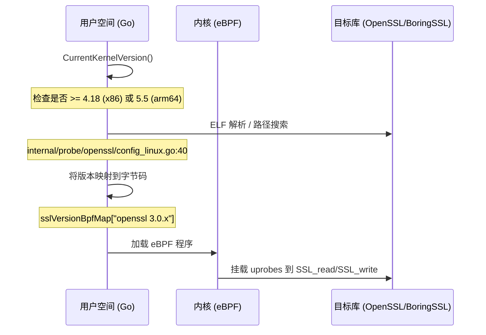

# 支持的平台与版本

<details>
<summary>相关源文件</summary>

以下文件被用作生成此维基页面的上下文：

- [.github/agents/pr-agent.md](https://github.com/gojue/ecapture/blob/943a19fe/.github/agents/pr-agent.md)
- [CHANGELOG.md](https://github.com/gojue/ecapture/blob/943a19fe/CHANGELOG.md)
- [README.md](https://github.com/gojue/ecapture/blob/943a19fe/README.md)
- [builder/Dockerfile](https://github.com/gojue/ecapture/blob/943a19fe/builder/Dockerfile)
- [builder/init_env.sh](https://github.com/gojue/ecapture/blob/943a19fe/builder/init_env.sh)
- [functions.mk](https://github.com/gojue/ecapture/blob/943a19fe/functions.mk)
- [internal/probe/gotls/config_iface.go](https://github.com/gojue/ecapture/blob/943a19fe/internal/probe/gotls/config_iface.go)
- [internal/probe/gotls/config_iface_test.go](https://github.com/gojue/ecapture/blob/943a19fe/internal/probe/gotls/config_iface_test.go)
- [internal/probe/openssl/config_ecandroid.go](https://github.com/gojue/ecapture/blob/943a19fe/internal/probe/openssl/config_ecandroid.go)
- [internal/probe/openssl/config_iface.go](https://github.com/gojue/ecapture/blob/943a19fe/internal/probe/openssl/config_iface.go)
- [internal/probe/openssl/config_iface_test.go](https://github.com/gojue/ecapture/blob/943a19fe/internal/probe/openssl/config_iface_test.go)
- [internal/probe/openssl/config_linux.go](https://github.com/gojue/ecapture/blob/943a19fe/internal/probe/openssl/config_linux.go)
- [main.go](https://github.com/gojue/ecapture/blob/943a19fe/main.go)
- [pkg/util/kernel/kernel_version.go](https://github.com/gojue/ecapture/blob/943a19fe/pkg/util/kernel/kernel_version.go)
- [pkg/util/kernel/kernel_version_unsupport.go](https://github.com/gojue/ecapture/blob/943a19fe/pkg/util/kernel/kernel_version_unsupport.go)
- [pkg/util/kernel/version.go](https://github.com/gojue/ecapture/blob/943a19fe/pkg/util/kernel/version.go)
- [test/e2e/android/android_tls_e2e_test.sh](https://github.com/gojue/ecapture/blob/943a19fe/test/e2e/android/android_tls_e2e_test.sh)
- [variables.mk](https://github.com/gojue/ecapture/blob/943a19fe/variables.mk)

</details>

eCapture 专为现代 Linux 环境设计，利用 eBPF (Extended Berkeley Packet Filter) 拦截明文流量。由于 eBPF 特性与 Linux 内核紧密耦合，其支持情况主要由内核版本和架构决定，而非特定的发行版名称。

## 操作系统与架构支持

eCapture 支持以下操作系统和 CPU 架构。它明确**不支持** Windows 或 macOS，因为这些系统缺少标准的 Linux eBPF 子系统。

| 操作系统 | 架构 | 最小内核版本 | 备注 |
| :--- | :--- | :--- | :--- |
| **Linux** | x86_64 (amd64) | 4.18+ | 标准服务器/桌面环境。 |
| **Linux** | aarch64 (arm64) | 5.5+ | AWS Graviton, 树莓派等。 |
| **Android** | aarch64 (GKI) | 5.5+ | 需要 GKI (通用内核镜像)。 |

### 平台验证列表
以下发行版通过 CI 或手动测试定期进行验证：
* **Ubuntu**: 20.04, 22.04, 24.04 [builder/init_env.sh:18-35](https://github.com/gojue/ecapture/blob/943a19fe/builder/init_env.sh#L18-L35)
* **CentOS / RHEL**: 8.x 及以上 (内核 4.18+)
* **Debian**: 10 及以上
* **Android**: Android 13, 14, 15, 和 16 (BoringSSL 特定钩子) [variables.mk:190-193](https://github.com/gojue/ecapture/blob/943a19fe/variables.mk#L190-L193)

## 架构与代码映射

下图展示了平台特定逻辑如何在 Go 用户空间和 eBPF 内核空间中进行分支处理。

### 平台逻辑调度
标题：平台特定实体映射
```mermaid
graph TD
    subgraph "用户空间 (Go)"
        A["cli.Start()"] --> B{"平台检测"}
        B -- "GOOS=linux" --> C["internal/probe/openssl/config_linux.go"]
        B -- "GOOS=android" --> D["internal/probe/openssl/config_ecandroid.go"]
        
        C --> E["detectOpenSSL()"]
        D --> F["detectAndroidVersion()"]
    end

    subgraph "内核空间 (C)"
        G["kern/bpf/"] --> H["x86/vmlinux.h"]
        G --> I["arm64/vmlinux.h"]
        
        J["*_kern.c"] --> K{"BTF 支持"}
        K -- "是" --> L["CO-RE (.o)"]
        K -- "否" --> M["Non-CO-RE (.nocore)"]
    end

    F -- "读取" --> N["/system/build.prop"]
    E -- "搜索" --> O["/usr/lib64/libssl.so"]
```
Sources: [internal/probe/openssl/config_linux.go:40-75](https://github.com/gojue/ecapture/blob/943a19fe/internal/probe/openssl/config_linux.go#L40-L75), [internal/probe/openssl/config_ecandroid.go:89-105](https://github.com/gojue/ecapture/blob/943a19fe/internal/probe/openssl/config_ecandroid.go#L89-L105), [variables.mk:147-166](https://github.com/gojue/ecapture/blob/943a19fe/variables.mk#L147-L166)

## CO-RE 与 Non-CO-RE 模式

eCapture 提供两种运行模式来处理内核兼容性：

1.  **CO-RE (一次编译，到处运行)**：
    *   **要求**：内核必须编译时开启 `CONFIG_DEBUG_INFO_BTF=y`。
    *   **机制**：使用 BPF 类型格式 (BTF) 在加载时重定位结构体偏移量。
    *   **二进制文件**：使用嵌入在二进制文件中的标准 `.o` 文件。
2.  **Non-CO-RE**：
    *   **要求**：当 BTF 不可用时使用（常见于较旧的 4.18+ 内核）。
    *   **机制**：专门针对目标内核的头文件进行编译/链接。
    *   **二进制文件**：使用在构建过程中生成的 `.nocore` 变体 [variables.mk:233](https://github.com/gojue/ecapture/blob/943a19fe/variables.mk#L233)。

## 不同平台的特性差异

虽然核心 TLS 捕获在所有支持的平台上均可工作，但某些高级功能受内核版本或操作系统变体的限制。

### 内核特性门控
* **PID/UID 过滤**：需要内核版本 >= 5.2。在旧版本内核上，这些过滤器将被静默忽略并伴有警告 [CHANGELOG.md:7](https://github.com/gojue/ecapture/blob/943a19fe/CHANGELOG.md#L7)。
* **Cgroup 过滤**：在 Linux 上支持 `tls` 和 `gotls` 探针，但在 Android 上被明确禁用/不支持 [internal/probe/openssl/config_ecandroid.go:133-136](https://github.com/gojue/ecapture/blob/943a19fe/internal/probe/openssl/config_ecandroid.go#L133-L136)。
* **网络接口**：在 Linux 上，接口检测通常是自动的。在 Android 上，eCapture 会专门探测 `wlan0` 或搜索活跃的非回环接口，如 `eth0` [internal/probe/openssl/config_ecandroid.go:107-131](https://github.com/gojue/ecapture/blob/943a19fe/internal/probe/openssl/config_ecandroid.go#L107-L131)。

### 探针可用性
| 探针 | Linux x86_64 | Linux arm64 | Android arm64 |
| :--- | :---: | :---: | :---: |
| TLS (OpenSSL/BoringSSL) | 是 | 是 | 是 |
| GoTLS | 是 | 是 | 是 |
| Bash/Zsh 审计 | 是 | 是 | 仅 Bash |
| MySQL / Postgres | 是 | 是 | 否 |
| GnuTLS / NSPR | 是 | 是 | 否 |

Sources: [variables.mk:215-227](https://github.com/gojue/ecapture/blob/943a19fe/variables.mk#L215-L227), [README.md:12-16](https://github.com/gojue/ecapture/blob/943a19fe/README.md#L12-L16), [CHANGELOG.md:20](https://github.com/gojue/ecapture/blob/943a19fe/CHANGELOG.md#L20)

## 实现细节：版本检测

eCapture 执行运行时环境检查以选择正确的 eBPF 字节码。

### 内核版本检查
`pkg/util/kernel` 包解析 `/proc/version_signature` (Ubuntu)、`/proc/version` (Debian) 或 `uname` 来确定 `LINUX_VERSION_CODE` [pkg/util/kernel/kernel_version.go:113-131](https://github.com/gojue/ecapture/blob/943a19fe/pkg/util/kernel/kernel_version.go#L113-L131)。

### Android BoringSSL 检测
在 Android 上，eCapture 读取 `/system/build.prop` 来识别操作系统版本（例如 `ro.build.version.release=13`），并将其映射到特定的 BoringSSL 钩子实现，如 `boringssl_a_13` [internal/probe/openssl/config_ecandroid.go:77-80](https://github.com/gojue/ecapture/blob/943a19fe/internal/probe/openssl/config_ecandroid.go#L77-L80)。

### 代码实体流
标题：内核与库版本映射

Sources: [pkg/util/kernel/kernel_version.go:113-131](https://github.com/gojue/ecapture/blob/943a19fe/pkg/util/kernel/kernel_version.go#L113-L131), [internal/probe/openssl/config_linux.go:40-75](https://github.com/gojue/ecapture/blob/943a19fe/internal/probe/openssl/config_linux.go#L40-L75), [.github/agents/pr-agent.md:115-118](https://github.com/gojue/ecapture/blob/943a19fe/.github/agents/pr-agent.md#L115-L118)