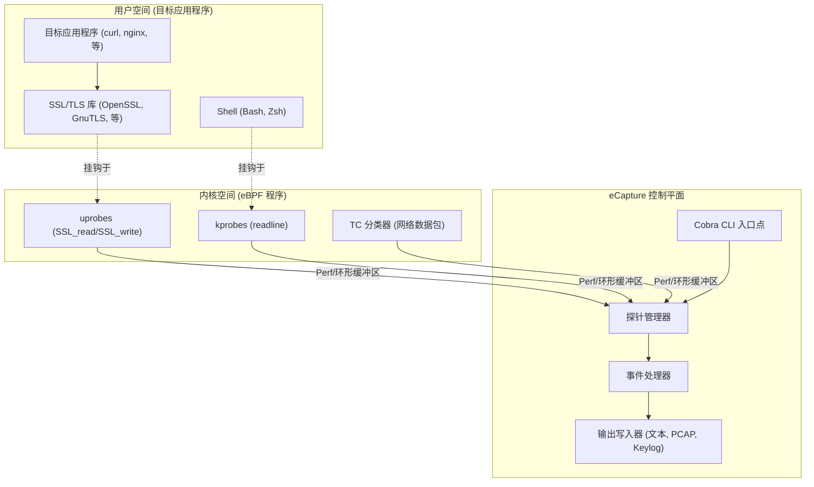
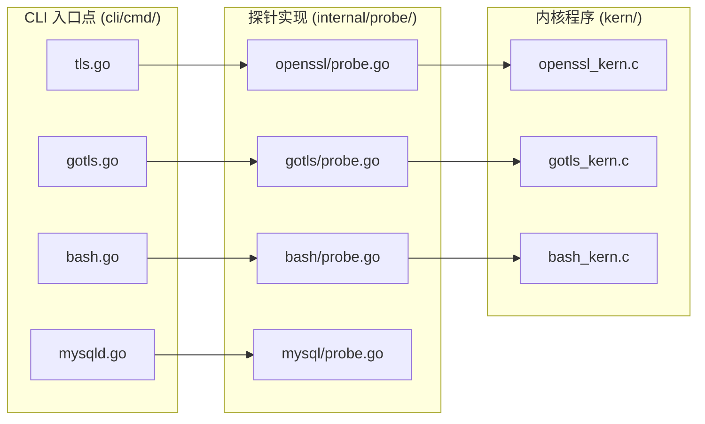

# eCapture 简介

相关源文件

以下文件用作生成此 Wiki 页面的上下文：

- [CHANGELOG.md](https://github.com/gojue/ecapture/blob/943a19fe/CHANGELOG.md)
- [README.md](https://github.com/gojue/ecapture/blob/943a19fe/README.md)
- [images/ecapture-architecture.png](images/ecapture-architecture.png)
- [images/ecapture-logo-400x400.png](images/ecapture-logo-400x400.png)
- [images/ecapture-user-manual.png](images/ecapture-user-manual.png)
- [images/how-ecapture-works.png](images/how-ecapture-works.png)
- [main.go](https://github.com/gojue/ecapture/blob/943a19fe/main.go)

eCapture (旁观者) 是一个强大的、基于 eBPF 的工具，旨在捕获 SSL/TLS 加密流量的明文内容、审计 shell 命令和监控数据库查询，而无需 CA 证书或侵入式流量拦截。

通过利用 Linux 内核的 eBPF (Extended Berkeley Packet Filter) 技术，eCapture 直接挂钩用户空间库和内核函数，以在加密之前或解密之后提取数据。这使其成为安全审计、故障排除和合规性监控的宝贵工具，尤其是在传统 MITM (中间人) 代理不切实际的环境中。

### 高层工作流程
eCapture 通过将 `uprobes` 附加到常用库（如 OpenSSL 或 BoringSSL）中的特定函数符号，以及将 `kprobes` 或 `TC` (流量控制) 分类器附加到网络级事件来运行。

**Sources:** [main.go:1-12](https://github.com/gojue/ecapture/blob/943a19fe/main.go#L1-L12), [README.md:36-45](https://github.com/gojue/ecapture/blob/943a19fe/README.md#L36-L45), [README.md:95-104](https://github.com/gojue/ecapture/blob/943a19fe/README.md#L95-L104)

---

### 导航索引

#### [核心功能与特性](1.1-introduction-and-core-capabilities.md)
了解 eCapture 的技术基础。本节涵盖主要用例：
*   **TLS 明文捕获：** 无需 CA 证书即可从 OpenSSL、BoringSSL、GnuTLS 和 NSPR 中提取流量。
*   **GoTLS 支持：** 对 Go 的原生 `crypto/tls` 实现的专门支持。
*   **软件审计：** 捕获 Bash/Zsh 命令和 MySQL/PostgreSQL 查询。
*   **比较：** eCapture 与 `tcpdump` 和 `mitmproxy` 的区别。

有关详细信息，请参阅 [核心功能与特性](1.1-introduction-and-core-capabilities.md)。

#### [支持的平台与版本](1.2-supported-platforms-and-versions.md)
检查您的环境是否与 eCapture 兼容。本节详细介绍：
*   **操作系统支持：** Linux x86_64 (内核 >= 4.18) 和 aarch64 (内核 >= 5.5)。
*   **Android 支持：** 与 Android GKI (通用内核镜像) 内核的兼容性。
*   **运行时模式：** 使用 BTF 的 **CO-RE** (一次编译 – 随处运行) 与非 CO-RE 传统模式之间的区别。

有关详细信息，请参阅 [支持的平台与版本](1.2-supported-platforms-and-versions.md)。

---

### 核心组件映射

下图将高级功能与实现它们的特定代码实体联系起来。

| 功能 | CLI 命令 | 探针逻辑 | eBPF 源 |
| :--- | :--- | :--- | :--- |
| **OpenSSL/TLS** | `ecapture tls` | `internal/probe/openssl` | `kern/openssl_kern.c` |
| **Go TLS** | `ecapture gotls` | `internal/probe/gotls` | `kern/gotls_kern.c` |
| **Bash 审计** | `ecapture bash` | `internal/probe/bash` | `kern/bash_kern.c` |
| **MySQL 审计** | `ecapture mysqld` | `internal/probe/mysql` | `kern/mysql_kern.c` |

**Sources:** [README.md:95-104](https://github.com/gojue/ecapture/blob/943a19fe/README.md#L95-L104), [CHANGELOG.md:97-113](https://github.com/gojue/ecapture/blob/943a19fe/CHANGELOG.md#L97-L113), [main.go:1-12](https://github.com/gojue/ecapture/blob/943a19fe/main.go#L1-L12)

---

### 输出模式快速摘要
eCapture 提供了三种主要的消费捕获数据的方式：
1.  **文本模式：** 明文打印到 `stdout` 或保存到文件。
2.  **Pcap/Pcapng 模式：** 生成包含解密流量的 Wireshark 兼容文件。
3.  **Keylog 模式：** 以 NSS Key Log 格式保存 TLS 主密钥，用于外部数据包捕获。

**Sources:** [README.md:114-153](https://github.com/gojue/ecapture/blob/943a19fe/README.md#L114-L153)