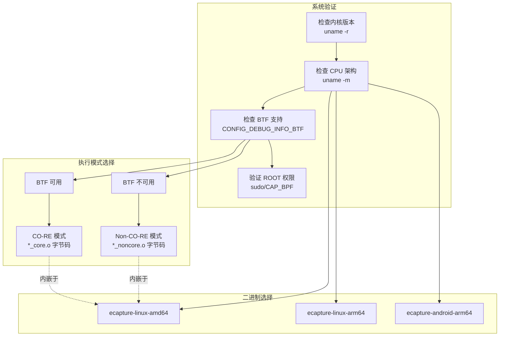
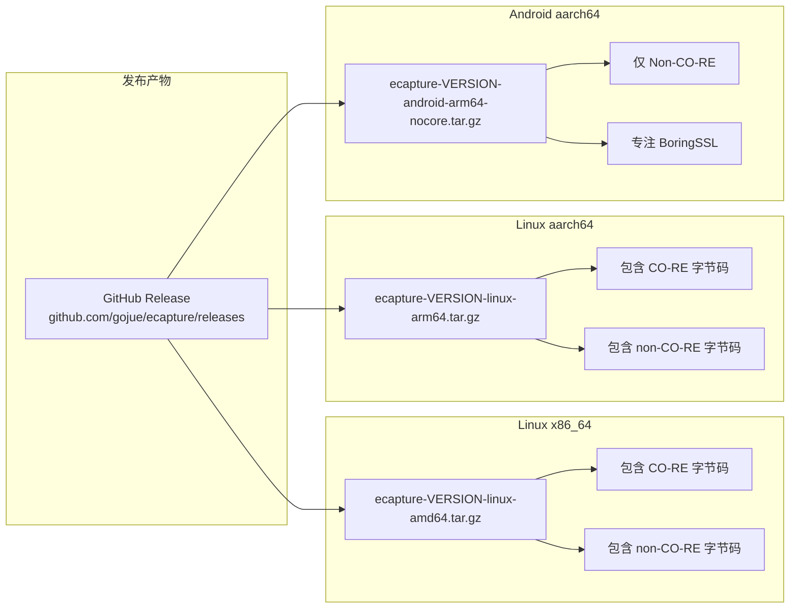
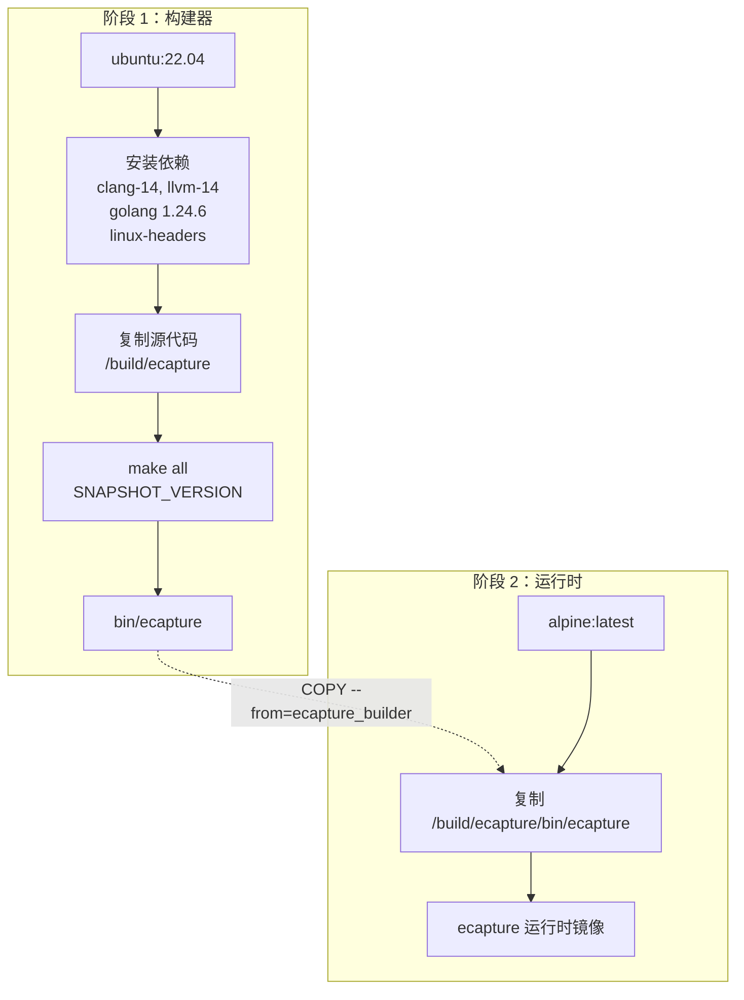
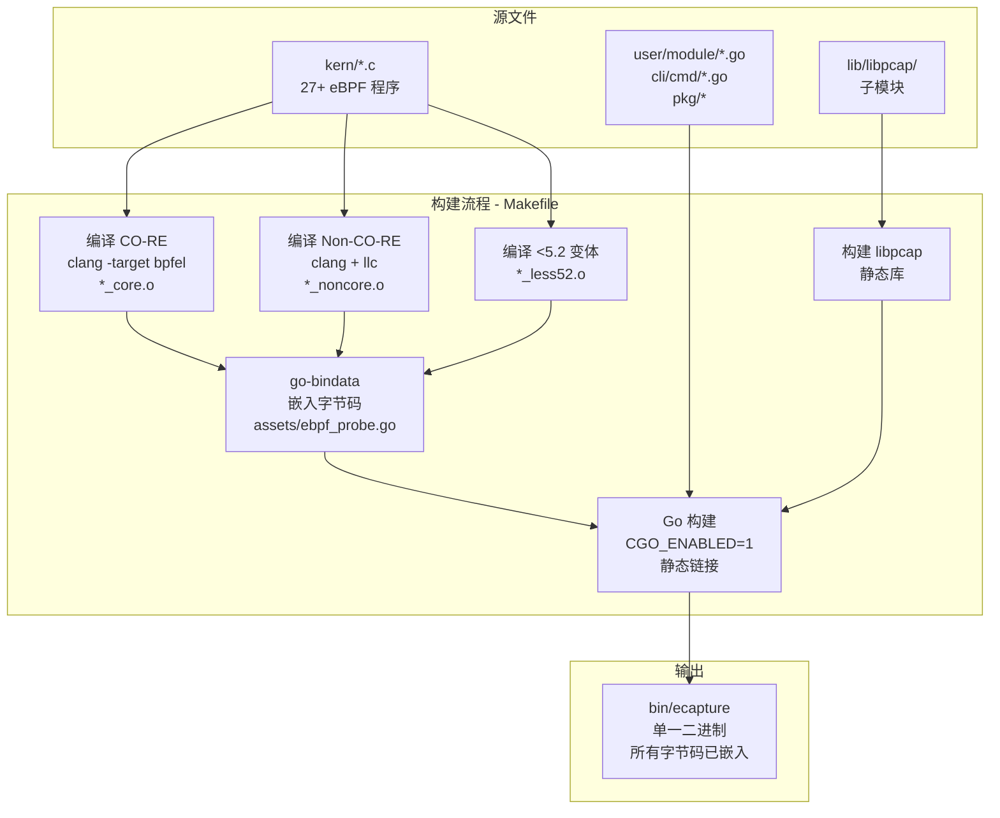
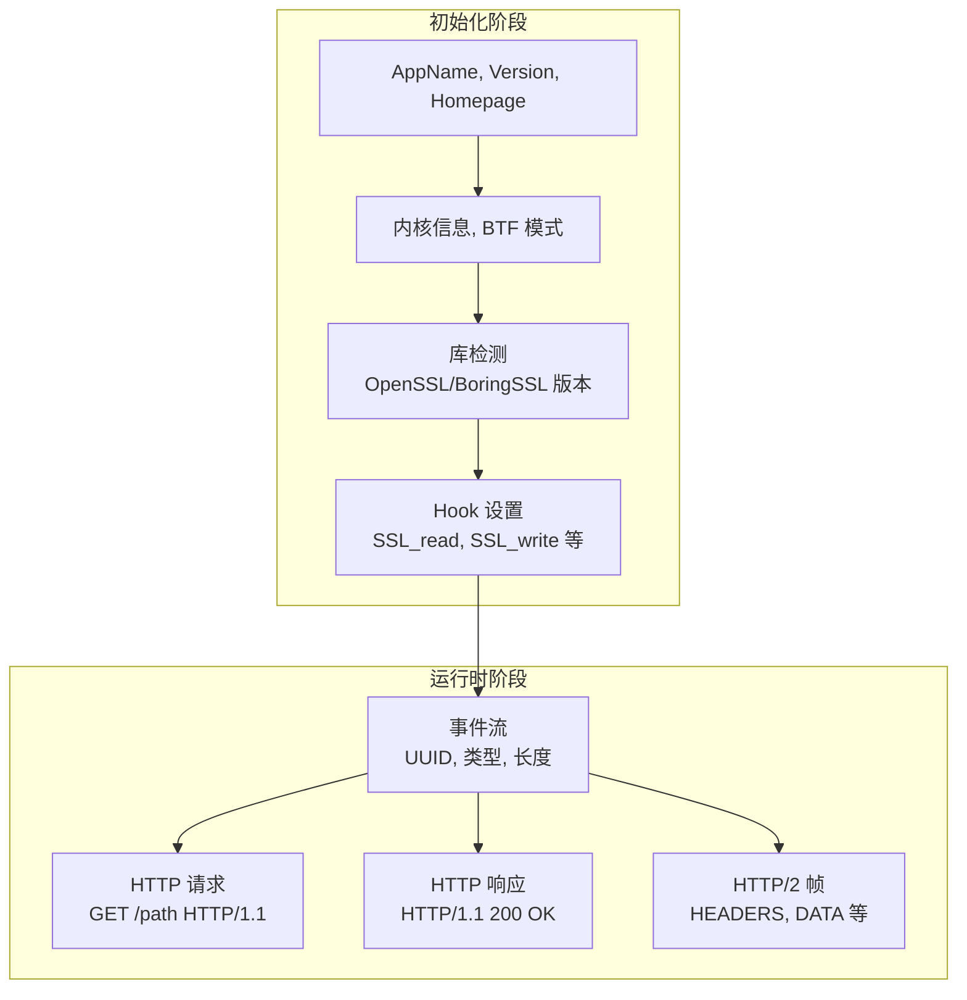
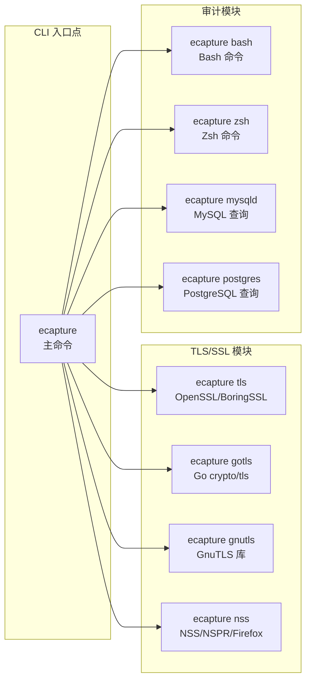
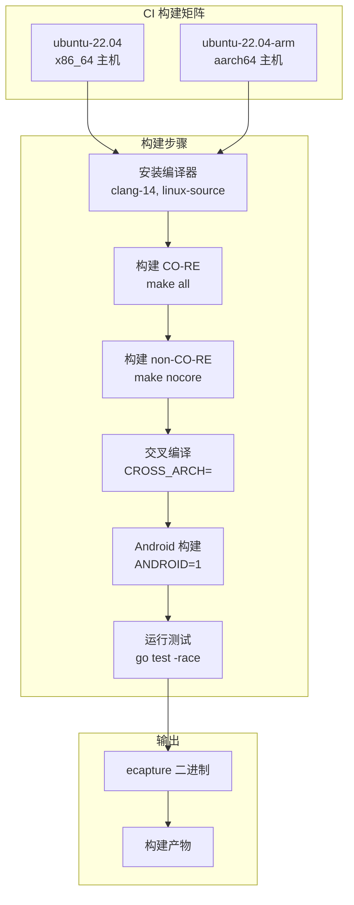

# 安装与快速入门

本页提供 eCapture 的安装说明和首次捕获运行指南。内容涵盖系统要求、安装方法（二进制下载、Docker、源码编译）以及基本使用示例，帮助您开始捕获 SSL/TLS 明文流量。

关于编译选项和自定义的详细信息，请参阅[构建系统](../5-development-guide/5.1-build-system.md)。关于完整的 CLI 文档，请参阅[命令行界面](1.2-command-line-interface.md)。关于底层架构的理解，请参阅[架构设计](../2-architecture/index.md)。

---

## 系统要求

由于基于 eBPF 实现，eCapture 对内核和架构有特定要求：

### 内核版本要求

| 架构 | 最低内核版本 | 说明 |
|-------------|------------------------|-------|
| x86_64 (amd64) | 4.18 | 完整功能支持 |
| aarch64 (arm64) | 5.5 | 完整功能支持 |

### 其他要求

- **权限**：需要 ROOT（超级用户）权限
- **BTF 支持**：可选但推荐用于 CO-RE 模式（更好的可移植性）
- **支持平台**：Linux、Android
- **不支持平台**：Windows、macOS

可通过以下命令验证 BTF（BPF Type Format）支持：

```bash
# 检查内核是否支持 BTF
cat /boot/config-$(uname -r) | grep CONFIG_DEBUG_INFO_BTF
# 应输出：CONFIG_DEBUG_INFO_BTF=y
```

### 系统架构检测流程图



**来源**: [README.md:13-16](https://github.com/gojue/ecapture/blob/0766a93b/README.md#L13-L16), [README_CN.md:14-17](https://github.com/gojue/ecapture/blob/0766a93b/README_CN.md#L14-L17), [.github/workflows/go-c-cpp.yml:10-127](https://github.com/gojue/ecapture/blob/0766a93b/.github/workflows/go-c-cpp.yml#L10-L127)

---

## 安装方法

eCapture 提供三种主要安装方法：预编译二进制下载、Docker 容器和源码编译。

### 方法 1：二进制发行版下载

最简单的安装方法是从 GitHub releases 下载预编译二进制文件。

#### 下载和解压

```bash
# 下载最新版本（将 VERSION 替换为实际版本号，如 v0.8.6）
VERSION=v1.5.1
ARCH=amd64  # 或 arm64

# 下载压缩包
wget https://github.com/gojue/ecapture/releases/download/${VERSION}/ecapture-${VERSION}-linux-${ARCH}.tar.gz

# 解压
tar -xzf ecapture-${VERSION}-linux-${ARCH}.tar.gz
cd ecapture-${VERSION}-linux-${ARCH}

# 验证
sudo ./ecapture --help
```

#### 二进制包内容

每个发行压缩包包含：

| 文件 | 说明 |
|------|-------------|
| `ecapture` | 主可执行二进制文件 |
| `LICENSE` | 项目许可证 |
| `CHANGELOG.md` | 发行说明和版本历史 |
| `README.md` | 英文文档 |
| `README_CN.md` | 中文文档 |

#### 架构特定的二进制文件



**来源**: [README.md:48-56](https://github.com/gojue/ecapture/blob/0766a93b/README.md#L48-L56), [README_CN.md:48-55](https://github.com/gojue/ecapture/blob/0766a93b/README_CN.md#L48-L55), [.github/workflows/release.yml:88-100](https://github.com/gojue/ecapture/blob/0766a93b/.github/workflows/release.yml#L88-L100)

### 方法 2：Docker 容器

Docker 提供了一个隔离环境来运行 eCapture，无需在主机系统上安装依赖。

#### 拉取并运行 Docker 镜像

```bash
# 拉取最新镜像
docker pull gojue/ecapture:latest

# 使用必需的权限运行
docker run --rm \
  --privileged=true \
  --net=host \
  -v /path/on/host:/path/in/container \
  gojue/ecapture:latest tls

# 示例：保存输出到主机目录
docker run --rm \
  --privileged=true \
  --net=host \
  -v $(pwd)/captures:/captures \
  gojue/ecapture:latest tls --pcapfile=/captures/output.pcapng
```

#### Docker 构建流程

Docker 镜像使用多阶段构建过程：



**Docker 配置详情**：

- **基础镜像**：构建时使用 Ubuntu 22.04，运行时使用 Alpine
- **必需标志**：`--privileged=true`（eBPF 需要内核访问），`--net=host`（网络监控）
- **卷挂载**：使用 `-v` 将输出文件保存到主机
- **多架构**：支持 linux/amd64 和 linux/arm64

**来源**: [README.md:58-70](https://github.com/gojue/ecapture/blob/0766a93b/README.md#L58-L70), [README_CN.md:57-67](https://github.com/gojue/ecapture/blob/0766a93b/README_CN.md#L57-L67), [builder/Dockerfile:1-39](https://github.com/gojue/ecapture/blob/0766a93b/builder/Dockerfile#L1-L39)

### 方法 3：从源码构建

从源码构建允许自定义并提供最新的开发功能。

#### 快速构建

```bash
# 克隆仓库
git clone https://github.com/gojue/ecapture.git
cd ecapture
git submodule update --init

# 安装依赖（Ubuntu/Debian）
sudo apt-get update
sudo apt-get install -y \
  build-essential \
  pkgconf \
  libelf-dev \
  llvm-14 \
  clang-14 \
  linux-tools-common \
  linux-tools-generic \
  linux-source

# 设置环境
make env

# 构建（包括 CO-RE 和 non-CO-RE）
make all

# 二进制输出位置
./bin/ecapture --help
```

#### 构建系统概览



**构建目标**：

| 目标 | 说明 | 命令 |
|--------|-------------|---------|
| `all` | 完整构建，包含 CO-RE 和 non-CO-RE | `make all` |
| `nocore` | 仅 non-CO-RE（旧内核） | `make nocore` |
| `env` | 显示构建环境 | `make env` |
| `clean` | 清理构建产物 | `make clean` |

**交叉编译**：

```bash
# 在 x86_64 主机上为 ARM64 构建
CROSS_ARCH=arm64 make env
CROSS_ARCH=arm64 make all

# 为 Android 构建
ANDROID=1 CROSS_ARCH=arm64 make nocore
```

**来源**: [Makefile:1-269](https://github.com/gojue/ecapture/blob/0766a93b/Makefile#L1-L269), [README.md:316-319](https://github.com/gojue/ecapture/blob/0766a93b/README.md#L316-L319), [CHANGELOG.md:553-562](https://github.com/gojue/ecapture/blob/0766a93b/CHANGELOG.md#L553-L562), [builder/init_env.sh:1-106](https://github.com/gojue/ecapture/blob/0766a93b/builder/init_env.sh#L1-L106)

---

## 首次捕获：TLS 模块

安装完成后，通过捕获 SSL/TLS 流量来验证 eCapture 是否正常工作。

### 基础 TLS 捕获

最简单的捕获命令可以监控所有 OpenSSL/BoringSSL 加密流量：

```bash
sudo ecapture tls
```

**预期输出结构**：



### 示例输出解读

```
2024-09-15T11:51:31Z INF AppName="eCapture(旁观者)"
2024-09-15T11:51:31Z INF Version=linux_arm64:0.8.6-20240915-d87ae48:5.15.0-113-generic
2024-09-15T11:51:31Z INF Listen=localhost:28256
2024-09-15T11:51:31Z WRN ========== module starting. ==========
2024-09-15T11:51:31Z INF Kernel Info=5.15.152 Pid=233698
2024-09-15T11:51:31Z INF BTF bytecode mode: CORE. btfMode=0
2024-09-15T11:51:31Z INF Hook masterKey function Functions=["SSL_get_wbio","SSL_in_before","SSL_do_handshake"]
2024-09-15T11:51:31Z INF target all process.
```

**输出字段说明**：

| 字段 | 说明 | 示例值 |
|-------|-------------|---------------|
| `Version` | 构建信息：OS_ARCH:VERSION:KERNEL | `linux_arm64:0.8.6:5.15.0-113` |
| `Listen` | 用于远程配置的 HTTP API 端点 | `localhost:28256` |
| `BTF bytecode mode` | CO-RE (0) 或 Non-CO-RE (1) | `CORE. btfMode=0` |
| `Hook masterKey function` | eBPF 探针附加点 | `["SSL_get_wbio",...]` |

### 理解捕获的事件

当流量被捕获时，事件将以以下结构显示：

```
2024-09-15T11:51:53Z ??? UUID:233851_233851_curl_5_1_172.16.71.1:51837, Name:HTTP2Request, Type:2, Length:304

Frame Type	=>	HEADERS
header field ":method" = "GET"
header field ":path" = "/"
header field ":authority" = "google.com"
```

**事件 UUID 格式**：`{pid}_{pid}_{comm}_{fd}_{direction}_{remote_addr}:{remote_port}`

| 组成部分 | 含义 |
|-----------|---------|
| `233851` | 进程 ID |
| `curl` | 进程名（截断至 16 字符） |
| `5` | 文件描述符 |
| `1` | 方向（0=读取/响应，1=写入/请求） |
| `172.16.71.1:51837` | 远程端点 |

**来源**: [README.md:72-149](https://github.com/gojue/ecapture/blob/0766a93b/README.md#L72-L149), [README_CN.md:73-126](https://github.com/gojue/ecapture/blob/0766a93b/README_CN.md#L73-L126)

---

## 常见使用模式

### 捕获模式

eCapture TLS 模块支持三种输出模式：

#### 文本模式（默认）

直接将明文输出到控制台或文件：

```bash
# 输出到控制台
sudo ecapture tls

# 输出到文件
sudo ecapture tls > capture_output.txt

# 指定 PID 过滤
sudo ecapture tls --pid=1234
```

#### PCAP 模式

保存为数据包捕获文件用于 Wireshark 分析：

```bash
# 基础 pcap 捕获
sudo ecapture tls -m pcap -i eth0 --pcapfile=capture.pcapng

# 使用网络过滤器
sudo ecapture tls -m pcap -i eth0 --pcapfile=https.pcapng tcp port 443

# 多个网络接口
sudo ecapture tls -m pcap -i eth0,wlan0 --pcapfile=multi.pcapng
```

**PCAP 过滤器语法**：支持 tcpdump/BPF 过滤器表达式（如 `host 192.168.1.1 and tcp port 443`）

#### Keylog 模式

导出 TLS 主密钥用于离线解密：

```bash
# 生成 keylog 文件
sudo ecapture tls -m keylog --keylogfile=tls_keys.log

# 与 tshark 结合实现实时解密
sudo ecapture tls -m keylog --keylogfile=keys.log &
tshark -o tls.keylog_file:keys.log -Y http -T fields -e http.file_data -f "port 443" -i eth0
```

**来源**: [README.md:172-253](https://github.com/gojue/ecapture/blob/0766a93b/README.md#L172-L253), [README_CN.md:150-219](https://github.com/gojue/ecapture/blob/0766a93b/README_CN.md#L150-L219), [CHANGELOG.md:688-757](https://github.com/gojue/ecapture/blob/0766a93b/CHANGELOG.md#L688-L757)

### 模块选择

eCapture 为不同目标提供专门的模块：



**快速模块示例**：

```bash
# 捕获 bash 命令
sudo ecapture bash

# 捕获 MySQL 查询
sudo ecapture mysqld

# 捕获 Go TLS 流量
sudo ecapture gotls --elfpath=/path/to/go/binary
```

**来源**: [README.md:151-161](https://github.com/gojue/ecapture/blob/0766a93b/README.md#L151-L161), [README_CN.md:128-139](https://github.com/gojue/ecapture/blob/0766a93b/README_CN.md#L128-L139), [main.go:1-11](https://github.com/gojue/ecapture/blob/0766a93b/main.go#L1-L11)

---

## 验证和故障排除

### 验证安装

```bash
# 检查版本
sudo ecapture --version

# 显示帮助
sudo ecapture --help

# 测试模块可用性
sudo ecapture tls --help
```

### 常见问题

#### 问题："内核版本过低"

**解决方案**：验证内核版本满足最低要求：

```bash
uname -r
# x86_64 应 >= 4.18，aarch64 应 >= 5.5
```

#### 问题："权限被拒绝"

**解决方案**：eCapture 需要 ROOT 权限：

```bash
# 使用 sudo
sudo ecapture tls

# 或检查 capabilities
sudo setcap cap_sys_admin,cap_bpf+ep ./ecapture
./ecapture tls
```

#### 问题："未找到 OpenSSL 版本"

**解决方案**：eCapture 将使用默认版本。您可以指定库路径：

```bash
# 从 ld.so.conf 自动检测
sudo ecapture tls

# 手动指定库
sudo ecapture tls --libssl=/usr/lib/x86_64-linux-gnu/libssl.so.3

# 对于静态二进制
sudo ecapture tls --libssl=/path/to/static/binary
```

#### 问题："BTF 不可用"

**解决方案**：将自动选择 non-CO-RE 模式。为获得更好的兼容性：

```bash
# 安装 linux-headers
sudo apt-get install linux-headers-$(uname -r)

# 或显式使用 non-CO-RE 构建
# （二进制包含两种模式，自动选择）
```

**来源**: [README.md:163-170](https://github.com/gojue/ecapture/blob/0766a93b/README.md#L163-L170), [.github/workflows/go-c-cpp.yml:16-33](https://github.com/gojue/ecapture/blob/0766a93b/.github/workflows/go-c-cpp.yml#L16-L33)

---

## 环境设置脚本

对于开发环境，eCapture 提供了自动化设置脚本：

```bash
# 运行初始化脚本（仅支持 Ubuntu）
/bin/bash -c "$(curl -fsSL https://raw.githubusercontent.com/gojue/ecapture/master/builder/init_env.sh)"
```

**脚本操作**：

1. 检测 Ubuntu 版本并设置适当的 clang 版本
2. 安装构建依赖（clang、llvm、linux-source、gcc 交叉编译器）
3. 提取并准备内核头文件
4. 安装 Go 1.24.6
5. 克隆 eCapture 仓库
6. 配置交叉编译支持

**支持的 Ubuntu 版本**：

| 版本 | Clang 版本 |
|---------|---------------|
| 20.04, 20.10 | clang-10 |
| 21.04 | clang-11 |
| 21.10, 22.04, 22.10 | clang-12 |
| 23.04, 23.10 | clang-15 |
| 24.04 | clang-18 |

**来源**: [builder/init_env.sh:1-106](https://github.com/gojue/ecapture/blob/0766a93b/builder/init_env.sh#L1-L106)

---

## CI/CD 构建验证

eCapture 使用 GitHub Actions 进行持续集成。构建流程验证：



**构建验证**：

- **原生编译**：x86_64 和 aarch64 运行器
- **交叉编译**：双向（x86_64 ↔ aarch64）
- **多种模式**：两种架构的 CO-RE 和 non-CO-RE
- **Android 支持**：针对 Android 的 non-CO-RE，专注 BoringSSL
- **代码质量**：golangci-lint 和 race 检测器测试

**来源**: [.github/workflows/go-c-cpp.yml:1-128](https://github.com/gojue/ecapture/blob/0766a93b/.github/workflows/go-c-cpp.yml#L1-L128), [.github/workflows/release.yml:1-129](https://github.com/gojue/ecapture/blob/0766a93b/.github/workflows/release.yml#L1-L129)

---

## 后续步骤

完成安装并运行首次捕获后：

- **探索 CLI 选项**：参阅[命令行界面](1.2-command-line-interface.md)了解详细的标志文档
- **理解架构**：在[架构设计](../2-architecture/index.md)中学习 eCapture 的工作原理
- **模块深入**： 
  - [OpenSSL 模块](../3-capture-modules/3.1.1-openssl-module.md) 了解 TLS/SSL 捕获详情
  - [Go TLS 模块](../3-capture-modules/3.1.2-go-tls-module.md) 了解 Go 特定捕获
  - [系统审计模块](../3-capture-modules/3.2-system-audit-modules.md) 了解 bash/数据库审计
- **输出格式**：参阅[输出格式](../4-output-formats/index.md)了解 PCAP、keylog 和文本模式详情
- **自定义构建**：参考[构建系统](../5-development-guide/5.1-build-system.md)了解编译自定义
- **依赖**：查看[依赖与系统要求](1.3-dependencies-and-system-requirements.md)了解详细的前置条件

**来源**: [README.md:1-335](https://github.com/gojue/ecapture/blob/0766a93b/README.md#L1-L335), [README_CN.md:1-315](https://github.com/gojue/ecapture/blob/0766a93b/README_CN.md#L1-L315), [CHANGELOG.md:1-100](https://github.com/gojue/ecapture/blob/0766a93b/CHANGELOG.md#L1-L100)