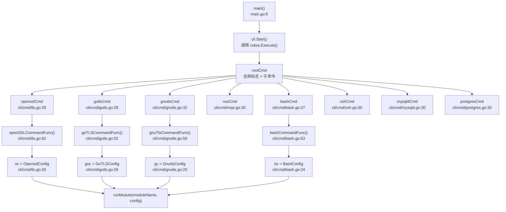
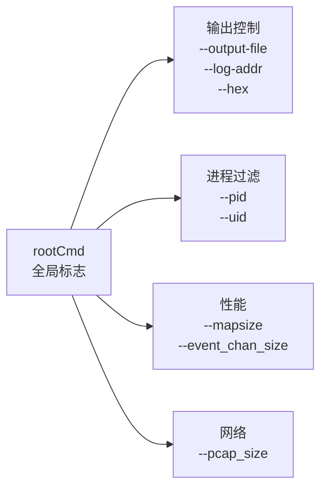
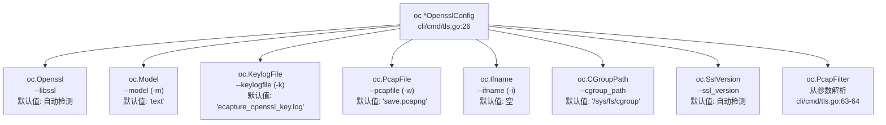
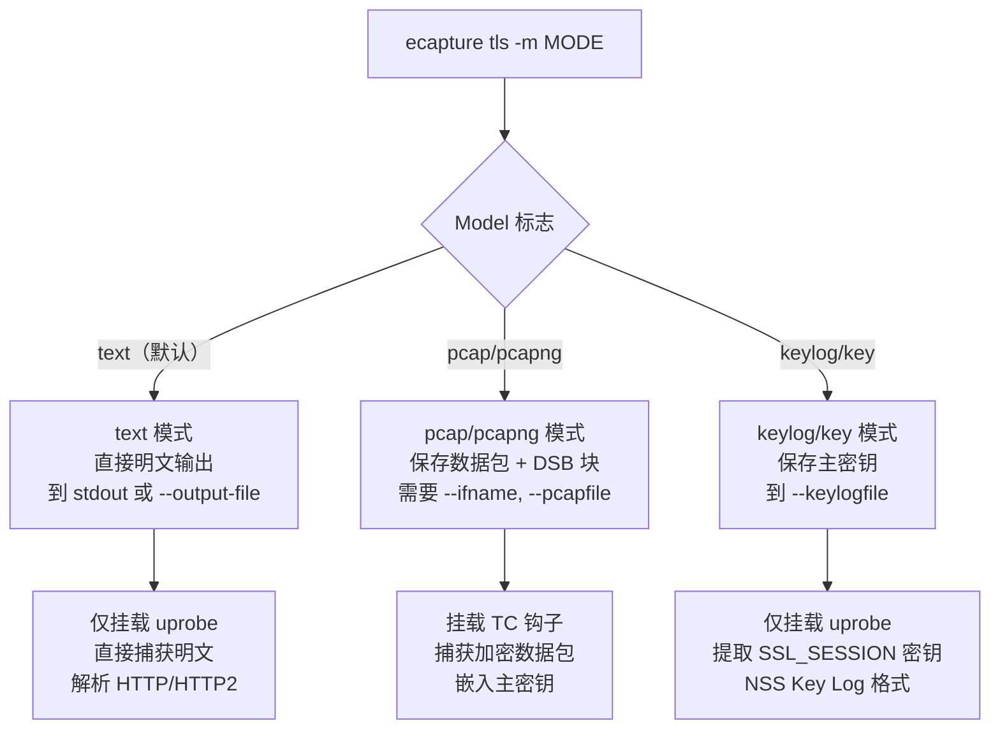
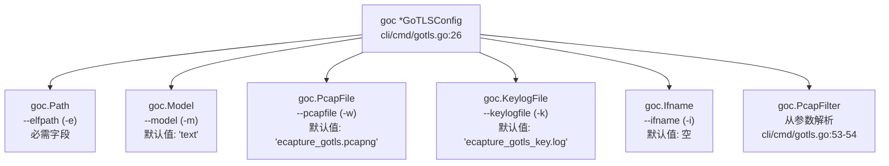
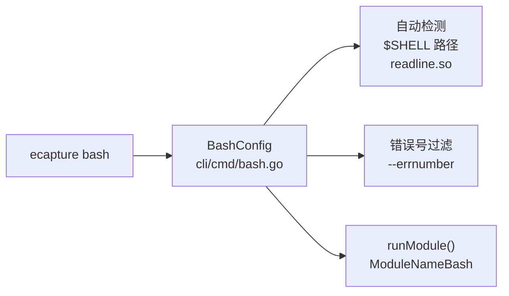
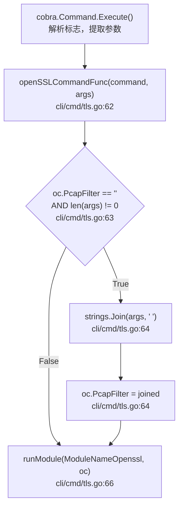
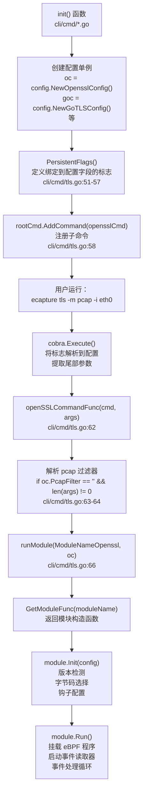

# 命令行界面

本文档描述了 eCapture 的命令行界面（CLI），它提供了模块选择、配置和运行时控制的主要机制。CLI 使用 [Cobra](https://github.com/spf13/cobra) 命令框架实现，通过配置对象将子命令映射到捕获模块。

CLI 执行三个主要功能：
1. **模块选择** - 通过 `runModule()` 将子命令路由到特定的捕获模块
2. **配置填充** - 将标志解析为模块特定的配置结构体
3. **过滤表达式解析** - 处理数据包捕获模式的 pcap 过滤表达式

关于 CLI 初始化后的模块生命周期，请参阅[模块系统与生命周期](../2-architecture/2.4-module-system-and-lifecycle.md)。关于通过 HTTP API 进行运行时配置更新，请参阅[配置系统](../2-architecture/2.3-configuration-system.md)。

---

## 命令结构概述

eCapture 使用基于模块的命令架构，其中每个子命令对应一个特定的捕获模块。入口点调用 Cobra 命令框架，该框架路由到模块初始化函数。

**CLI 命令到模块分发**



来源：[main.go:1-11](https://github.com/gojue/ecapture/blob/0766a93b/main.go#L1-L11), [cli/cmd/tls.go:26-67](https://github.com/gojue/ecapture/blob/0766a93b/cli/cmd/tls.go#L26-L67), [cli/cmd/gotls.go:26-58](https://github.com/gojue/ecapture/blob/0766a93b/cli/cmd/gotls.go#L26-L58), [cli/cmd/gnutls.go:29-64](https://github.com/gojue/ecapture/blob/0766a93b/cli/cmd/gnutls.go#L29-L64), [cli/cmd/bash.go:24-55](https://github.com/gojue/ecapture/blob/0766a93b/cli/cmd/bash.go#L24-L55)

**命令到模块的映射**

每个子命令创建一个模块特定的配置对象，并使用适当的模块名称常量调用 `runModule()`。

| 命令 | 别名 | 模块名称 | 配置类型 | 命令函数 |
|---------|---------|-------------|-------------|------------------|
| `tls` | `openssl` | `ModuleNameOpenssl` | `OpensslConfig` | `openSSLCommandFunc` |
| `gotls` | `tlsgo` | `ModuleNameGotls` | `GoTLSConfig` | `goTLSCommandFunc` |
| `gnutls` | `gnu` | `ModuleNameGnutls` | `GnutlsConfig` | `gnuTlsCommandFunc` |
| `nspr` | `nss` | `ModuleNameNspr` | `NsprConfig` | `nssCommandFunc` |
| `bash` | - | `ModuleNameBash` | `BashConfig` | `bashCommandFunc` |
| `zsh` | - | `ModuleNameZsh` | `ZshConfig` | `zshCommandFunc` |
| `mysqld` | - | `ModuleNameMysqld` | `MysqldConfig` | `mysqldCommandFunc` |
| `postgres` | - | `ModuleNamePostgres` | `PostgresConfig` | `postgresCommandFunc` |

来源：[cli/cmd/tls.go:26-67](https://github.com/gojue/ecapture/blob/0766a93b/cli/cmd/tls.go#L26-L67), [cli/cmd/gotls.go:26-58](https://github.com/gojue/ecapture/blob/0766a93b/cli/cmd/gotls.go#L26-L58), [cli/cmd/gnutls.go:29-64](https://github.com/gojue/ecapture/blob/0766a93b/cli/cmd/gnutls.go#L29-L64), [cli/cmd/nspr.go:27-51](https://github.com/gojue/ecapture/blob/0766a93b/cli/cmd/nspr.go#L27-L51), [cli/cmd/bash.go:24-55](https://github.com/gojue/ecapture/blob/0766a93b/cli/cmd/bash.go#L24-L55), [cli/cmd/zsh.go:27-57](https://github.com/gojue/ecapture/blob/0766a93b/cli/cmd/zsh.go#L27-L57), [cli/cmd/mysqld.go:27-49](https://github.com/gojue/ecapture/blob/0766a93b/cli/cmd/mysqld.go#L27-L49), [cli/cmd/postgres.go:27-45](https://github.com/gojue/ecapture/blob/0766a93b/cli/cmd/postgres.go#L27-L45)

---

## 全局标志

全局标志在根命令级别定义，适用于所有子命令。这些标志通过 Cobra 的持久标志机制被模块特定的命令继承。

**通用全局标志层次结构**



### 输出控制标志

| 标志 | 简写 | 类型 | 默认值 | 描述 |
|------|-------|------|---------|-------------|
| `--output-file` | `-l` | string | - | 事件输出的文件路径（文本模式） |
| `--logaddr` | - | string | `localhost:28256` | 用于配置更新的 HTTP 服务器地址 |
| `--hex` | - | bool | `false` | 以十六进制格式显示数据 |
| `--event_rotate_size` | - | uint64 | `0` | 文件轮转大小（0=禁用） |
| `--event_rotate_time` | - | uint64 | `0` | 文件轮转间隔（秒）（0=禁用） |

### 进程过滤标志

| 标志 | 简写 | 类型 | 默认值 | 描述 |
|------|-------|------|---------|-------------|
| `--pid` | `-p` | uint64 | `0` | 目标进程 ID（0=所有进程） |
| `--uid` | `-u` | uint64 | `0` | 目标用户 ID（0=所有用户） |

### 性能调优标志

| 标志 | 类型 | 默认值 | 描述 |
|------|------|---------|-------------|
| `--mapsize` | uint64 | `5120` | eBPF map 大小（KB） |
| `--event_chan_size` | uint32 | `100` | 事件通道缓冲区大小 |
| `--pcap_size` | uint64 | `4096` | 网络数据包捕获缓冲区大小 |

来源：基于 [cli/cmd/tls.go:50-57](https://github.com/gojue/ecapture/blob/0766a93b/cli/cmd/tls.go#L50-L57), [cli/cmd/gotls.go:42-48](https://github.com/gojue/ecapture/blob/0766a93b/cli/cmd/gotls.go#L42-L48), [README.md:44](https://github.com/gojue/ecapture/blob/0766a93b/README.md#L44) 中的通用模式

---

## TLS 模块（`tls`/`openssl`）

TLS 模块从 OpenSSL/BoringSSL 库捕获明文，支持版本 1.0.x 到 3.5.x 以及 Android 12-16 上的 BoringSSL。

### TLS 特定标志

**TLS 配置结构体字段映射**



| 标志 | 简写 | 结构体字段 | 类型 | 默认值 | 行引用 |
|------|-------|--------------|------|---------|----------------|
| `--libssl` | - | `oc.Openssl` | string | （自动检测） | [cli/cmd/tls.go:51](https://github.com/gojue/ecapture/blob/0766a93b/cli/cmd/tls.go#L51) |
| `--model` | `-m` | `oc.Model` | string | `"text"` | [cli/cmd/tls.go:53](https://github.com/gojue/ecapture/blob/0766a93b/cli/cmd/tls.go#L53) |
| `--keylogfile` | `-k` | `oc.KeylogFile` | string | `"ecapture_openssl_key.log"` | [cli/cmd/tls.go:54](https://github.com/gojue/ecapture/blob/0766a93b/cli/cmd/tls.go#L54) |
| `--pcapfile` | `-w` | `oc.PcapFile` | string | `"save.pcapng"` | [cli/cmd/tls.go:55](https://github.com/gojue/ecapture/blob/0766a93b/cli/cmd/tls.go#L55) |
| `--ifname` | `-i` | `oc.Ifname` | string | `""` | [cli/cmd/tls.go:56](https://github.com/gojue/ecapture/blob/0766a93b/cli/cmd/tls.go#L56) |
| `--cgroup_path` | - | `oc.CGroupPath` | string | `"/sys/fs/cgroup"` | [cli/cmd/tls.go:52](https://github.com/gojue/ecapture/blob/0766a93b/cli/cmd/tls.go#L52) |
| `--ssl_version` | - | `oc.SslVersion` | string | （自动检测） | [cli/cmd/tls.go:57](https://github.com/gojue/ecapture/blob/0766a93b/cli/cmd/tls.go#L57) |
| （尾部参数） | - | `oc.PcapFilter` | string | `""` | [cli/cmd/tls.go:63-64](https://github.com/gojue/ecapture/blob/0766a93b/cli/cmd/tls.go#L63-L64) |

**Pcap 过滤表达式**：尾部命令行参数通过 `strings.Join(args, " ")` 在 [cli/cmd/tls.go:64](https://github.com/gojue/ecapture/blob/0766a93b/cli/cmd/tls.go#L64) 处连接并存储在 `oc.PcapFilter` 中。

来源：[cli/cmd/tls.go:26-67](https://github.com/gojue/ecapture/blob/0766a93b/cli/cmd/tls.go#L26-L67)

### TLS 捕获模式

`--model`/`-m` 标志控制捕获和输出行为：

**模式决策流程**



来源：[cli/cmd/tls.go:32-47](https://github.com/gojue/ecapture/blob/0766a93b/cli/cmd/tls.go#L32-L47), [README.md:171-253](https://github.com/gojue/ecapture/blob/0766a93b/README.md#L171-L253)

### TLS 命令示例

**文本模式（默认）**
```shell
sudo ecapture tls --pid=1234 --hex
sudo ecapture tls -l output.log --libssl=/lib/x86_64-linux-gnu/libssl.so.3
```

**Keylog 模式**
```shell
sudo ecapture tls -m keylog -k ecapture_key.log
sudo ecapture tls -m key --keylogfile=/tmp/keys.log --pid=5678
```

**Pcap 模式**
```shell
sudo ecapture tls -m pcap -i eth0 -w capture.pcapng tcp port 443
sudo ecapture tls -m pcapng -i wlan0 --pcapfile=save.pcapng host 192.168.1.1 and tcp port 443
```

**Android BoringSSL**
```shell
sudo ecapture tls -m pcap --pcapfile=android.pcapng -i wlan0 \
  --libssl=/apex/com.android.conscrypt/lib64/libssl.so \
  --ssl_version="boringssl 1.1.1" tcp port 443
```

来源：[cli/cmd/tls.go:32-47](https://github.com/gojue/ecapture/blob/0766a93b/cli/cmd/tls.go#L32-L47), [README.md:74-253](https://github.com/gojue/ecapture/blob/0766a93b/README.md#L74-L253)

---

## GoTLS 模块（`gotls`）

GoTLS 模块从使用 `crypto/tls` 标准库的 Go 程序捕获明文，支持基于寄存器和基于栈的 ABI（Go 1.17+ PIE 模式）。

### GoTLS 特定标志

**GoTLS 配置结构体字段映射**



| 标志 | 简写 | 结构体字段 | 类型 | 默认值 | 行引用 |
|------|-------|--------------|------|---------|----------------|
| `--elfpath` | `-e` | `goc.Path` | string | `""`（必需） | [cli/cmd/gotls.go:43](https://github.com/gojue/ecapture/blob/0766a93b/cli/cmd/gotls.go#L43) |
| `--model` | `-m` | `goc.Model` | string | `"text"` | [cli/cmd/gotls.go:45](https://github.com/gojue/ecapture/blob/0766a93b/cli/cmd/gotls.go#L45) |
| `--pcapfile` | `-w` | `goc.PcapFile` | string | `"ecapture_gotls.pcapng"` | [cli/cmd/gotls.go:44](https://github.com/gojue/ecapture/blob/0766a93b/cli/cmd/gotls.go#L44) |
| `--keylogfile` | `-k` | `goc.KeylogFile` | string | `"ecapture_gotls_key.log"` | [cli/cmd/gotls.go:46](https://github.com/gojue/ecapture/blob/0766a93b/cli/cmd/gotls.go#L46) |
| `--ifname` | `-i` | `goc.Ifname` | string | `""` | [cli/cmd/gotls.go:47](https://github.com/gojue/ecapture/blob/0766a93b/cli/cmd/gotls.go#L47) |
| （尾部参数） | - | `goc.PcapFilter` | string | `""` | [cli/cmd/gotls.go:53-54](https://github.com/gojue/ecapture/blob/0766a93b/cli/cmd/gotls.go#L53-L54) |

**Pcap 过滤表达式**：尾部参数通过 `strings.Join(args, " ")` 在 [cli/cmd/gotls.go:54](https://github.com/gojue/ecapture/blob/0766a93b/cli/cmd/gotls.go#L54) 处连接并存储在 `goc.PcapFilter` 中。

来源：[cli/cmd/gotls.go:26-58](https://github.com/gojue/ecapture/blob/0766a93b/cli/cmd/gotls.go#L26-L58)

### GoTLS 命令示例

**文本模式**
```shell
sudo ecapture gotls --elfpath=/usr/local/bin/go_app --hex
sudo ecapture gotls -e /home/user/myapp --pid=9876 -l output.log
```

**Keylog 模式**
```shell
sudo ecapture gotls -m keylog -k gotls_keys.log --elfpath=/usr/bin/go_https_server
sudo ecapture gotls -m key --keylogfile=/tmp/gotls.log -e /app/binary --pid=4321
```

**Pcap 模式**
```shell
sudo ecapture gotls -m pcap --pcapfile=go_capture.pcapng -i eth0 \
  --elfpath=/usr/bin/go_client tcp port 443
sudo ecapture gotls -m pcapng -w output.pcapng -i wlan0 -e /app/server
```

来源：[cli/cmd/gotls.go:33-38](https://github.com/gojue/ecapture/blob/0766a93b/cli/cmd/gotls.go#L33-L38), [README.md:257-280](https://github.com/gojue/ecapture/blob/0766a93b/README.md#L257-L280)

---

## 其他 SSL/TLS 模块

### GnuTLS 模块（`gnutls`）

从 GnuTLS 库捕获明文，支持 keylog 和 pcap 模式。

| 标志 | 简写 | 类型 | 默认值 | 描述 |
|------|-------|------|---------|-------------|
| `--gnutls` | - | string | （自动检测） | `libgnutls.so` 的路径 |
| `--model` | `-m` | string | `text` | 捕获模式：`text`、`pcap`、`keylog` |
| `--keylogfile` | `-k` | string | `ecapture_gnutls_key.log` | Keylog 输出文件 |
| `--pcapfile` | `-w` | string | `save.pcapng` | PCAP 输出文件 |
| `--ifname` | `-i` | string | - | 网络接口 |
| `--ssl_version` | - | string | - | GnuTLS 版本（例如 `"3.7.9"`） |

**示例**：
```shell
sudo ecapture gnutls -m keylog -k gnutls_keys.log --ssl_version=3.7.9
sudo ecapture gnutls -m pcap -i eth0 -w gnutls.pcapng tcp port 443
```

来源：[cli/cmd/gnutls.go:29-64](https://github.com/gojue/ecapture/blob/0766a93b/cli/cmd/gnutls.go#L29-L64), [README.md:155-161](https://github.com/gojue/ecapture/blob/0766a93b/README.md#L155-L161), [CHANGELOG.md:126](https://github.com/gojue/ecapture/blob/0766a93b/CHANGELOG.md#L126)

### NSS/NSPR 模块（`nspr`/`nss`）

从 NSS/NSPR 库（Firefox、Thunderbird 使用）捕获明文。

| 标志 | 简写 | 类型 | 默认值 | 描述 |
|------|-------|------|---------|-------------|
| `--nspr` | - | string | （自动检测） | `libnspr44.so` 的路径 |

**示例**：
```shell
sudo ecapture nspr --hex --pid=3423
sudo ecapture nss -l firefox_capture.log --pid=5678
```

来源：[cli/cmd/nspr.go:27-51](https://github.com/gojue/ecapture/blob/0766a93b/cli/cmd/nspr.go#L27-L51), [README.md:158](https://github.com/gojue/ecapture/blob/0766a93b/README.md#L158)

---

## 系统审计模块

### Bash 模块（`bash`）

捕获 bash 命令输入/输出用于安全审计。

**Bash 命令流程**



| 标志 | 简写 | 类型 | 默认值 | 描述 |
|------|-------|------|---------|-------------|
| `--bash` | - | string | （自动检测） | bash 二进制文件的路径 |
| `--readlineso` | - | string | （自动检测） | `readline.so` 的路径 |
| `--errnumber` | `-e` | int | `BashErrnoDefault` | 按退出代码过滤命令 |

**示例**：
```shell
sudo ecapture bash
sudo ecapture bash --bash=/bin/bash -l bash_audit.log
sudo ecapture bash -e 0  # 仅显示成功的命令
```

来源：[cli/cmd/bash.go:24-55](https://github.com/gojue/ecapture/blob/0766a93b/cli/cmd/bash.go#L24-L55), [README.md:153-154](https://github.com/gojue/ecapture/blob/0766a93b/README.md#L153-L154)

### Zsh 模块（`zsh`）

与 bash 模块类似，捕获 zsh 命令活动。

| 标志 | 简写 | 类型 | 默认值 | 描述 |
|------|-------|------|---------|-------------|
| `--zsh` | - | string | （自动检测） | zsh 二进制文件的路径 |
| `--errnumber` | `-e` | int | `ZshErrnoDefault` | 按退出代码过滤命令 |

**示例**：
```shell
sudo ecapture zsh
sudo ecapture zsh --zsh=/usr/bin/zsh -l zsh_audit.log
```

来源：[cli/cmd/zsh.go:27-57](https://github.com/gojue/ecapture/blob/0766a93b/cli/cmd/zsh.go#L27-L57), [README.md:154](https://github.com/gojue/ecapture/blob/0766a93b/README.md#L154)

### MySQL 模块（`mysqld`）

从 MySQL/MariaDB 服务器进程捕获 SQL 查询，支持版本 5.6、5.7、8.0 和 MariaDB 10.5+。

| 标志 | 简写 | 类型 | 默认值 | 描述 |
|------|-------|------|---------|-------------|
| `--mysqld` | `-m` | string | `/usr/sbin/mariadbd` | mysqld 二进制文件的路径 |
| `--offset` | - | uint64 | `0` | `dispatch_command` 函数的手动偏移量 |
| `--funcname` | `-f` | string | - | 要挂钩的函数名称（覆盖自动检测） |

**示例**：
```shell
sudo ecapture mysqld -m /usr/sbin/mysqld -l mysql_queries.log
sudo ecapture mysqld --mysqld=/usr/local/mysql/bin/mysqld --pid=1234
```

来源：[cli/cmd/mysqld.go:27-49](https://github.com/gojue/ecapture/blob/0766a93b/cli/cmd/mysqld.go#L27-L49), [README.md:157](https://github.com/gojue/ecapture/blob/0766a93b/README.md#L157)

### PostgreSQL 模块（`postgres`）

从 PostgreSQL 服务器进程捕获 SQL 查询（版本 10+）。

| 标志 | 简写 | 类型 | 默认值 | 描述 |
|------|-------|------|---------|-------------|
| `--postgres` | `-m` | string | `/usr/bin/postgres` | postgres 二进制文件的路径 |
| `--funcname` | `-f` | string | - | 要挂钩的函数名称 |

**示例**：
```shell
sudo ecapture postgres -m /usr/lib/postgresql/14/bin/postgres
sudo ecapture postgres --postgres=/opt/pgsql/bin/postgres -l pg_queries.log
```

来源：[cli/cmd/postgres.go:27-45](https://github.com/gojue/ecapture/blob/0766a93b/cli/cmd/postgres.go#L27-L45), [README.md:159](https://github.com/gojue/ecapture/blob/0766a93b/README.md#L159)

---

## 标志处理和 Pcap 过滤器

TLS、GoTLS 和 GnuTLS 模块在 `pcap` 模式下支持 pcap 过滤表达式。这些表达式在 Cobra 标志解析完成后从尾部命令行参数处理。

**openSSLCommandFunc 中的 Pcap 过滤器处理**



**代码实现模式**（TLS、GoTLS、GnuTLS 中相同）：
```go
// cli/cmd/tls.go:62-67
func openSSLCommandFunc(command *cobra.Command, args []string) error {
    if oc.PcapFilter == "" && len(args) != 0 {
        oc.PcapFilter = strings.Join(args, " ")
    }
    return runModule(module.ModuleNameOpenssl, oc)
}
```

**过滤器示例**：
```shell
# 主机过滤
sudo ecapture tls -m pcap -i eth0 -w out.pcapng host 192.168.1.1

# 端口和协议
sudo ecapture tls -m pcap -i wlan0 tcp port 443

# 复杂表达式（多个条件）
sudo ecapture gotls -m pcap -i eth0 -w output.pcapng \
  host 192.168.1.1 and tcp port 443 and not port 22
```

来源：[cli/cmd/tls.go:62-67](https://github.com/gojue/ecapture/blob/0766a93b/cli/cmd/tls.go#L62-L67), [cli/cmd/gotls.go:52-58](https://github.com/gojue/ecapture/blob/0766a93b/cli/cmd/gotls.go#L52-L58), [cli/cmd/gnutls.go:59-64](https://github.com/gojue/ecapture/blob/0766a93b/cli/cmd/gnutls.go#L59-L64)

---

## 命令执行模式

所有模块命令遵循一致的三阶段执行模式：配置初始化、标志解析和模块分发。

**从 CLI 到模块的完整执行流程**



**三阶段命令函数模式**：

所有命令函数实现这个结构：
```go
// 阶段 1：在包初始化时创建配置对象
var oc = config.NewOpensslConfig()  // cli/cmd/tls.go:26

// 阶段 2：注册标志并绑定到配置
func init() {
    opensslCmd.PersistentFlags().StringVarP(&oc.Model, "model", "m", ...)
    rootCmd.AddCommand(opensslCmd)  // cli/cmd/tls.go:58
}

// 阶段 3：使用过滤器解析执行命令
func openSSLCommandFunc(command *cobra.Command, args []string) error {
    if oc.PcapFilter == "" && len(args) != 0 {
        oc.PcapFilter = strings.Join(args, " ")  // cli/cmd/tls.go:64
    }
    return runModule(module.ModuleNameOpenssl, oc)  // cli/cmd/tls.go:66
}
```

来源：[cli/cmd/tls.go:26-67](https://github.com/gojue/ecapture/blob/0766a93b/cli/cmd/tls.go#L26-L67), [cli/cmd/gotls.go:26-58](https://github.com/gojue/ecapture/blob/0766a93b/cli/cmd/gotls.go#L26-L58), [cli/cmd/bash.go:24-55](https://github.com/gojue/ecapture/blob/0766a93b/cli/cmd/bash.go#L24-L55)

---

## Docker 使用

TLS 模块文档包括容器化部署的 Docker 特定使用模式。

**Docker 卷挂载要求**：
```shell
docker run --rm --privileged=true --net=host \
  -v /etc:/etc \
  -v /usr:/usr \
  -v ${PWD}:/output \
  gojue/ecapture tls -m pcap -i eth0 \
    --pcapfile=/output/capture.pcapng tcp port 443
```

容器需要：
- `--privileged=true` 用于 eBPF 能力
- `--net=host` 访问主机网络接口
- 挂载 `/etc` 用于 `ld.so.conf` 库路径发现
- 挂载 `/usr` 用于访问系统库
- 挂载输出目录用于保存捕获文件

来源：[cli/cmd/tls.go:42-44](https://github.com/gojue/ecapture/blob/0766a93b/cli/cmd/tls.go#L42-L44), [README.md:59-68](https://github.com/gojue/ecapture/blob/0766a93b/README.md#L59-L68)

---

## 帮助文本和文档

每个命令通过 `-h` 或 `--help` 标志提供详细的帮助文本：

```shell
# 查看所有可用命令
sudo ecapture -h

# 查看 TLS 模块帮助
sudo ecapture tls -h

# 查看 GoTLS 模块帮助
sudo ecapture gotls -h
```

帮助系统内置于 Cobra 的命令结构中，根据标志定义和命令描述自动生成使用信息。

来源：[cli/cmd/tls.go:29-47](https://github.com/gojue/ecapture/blob/0766a93b/cli/cmd/tls.go#L29-L47), [cli/cmd/gotls.go:29-39](https://github.com/gojue/ecapture/blob/0766a93b/cli/cmd/gotls.go#L29-L39), [README.md:44](https://github.com/gojue/ecapture/blob/0766a93b/README.md#L44)