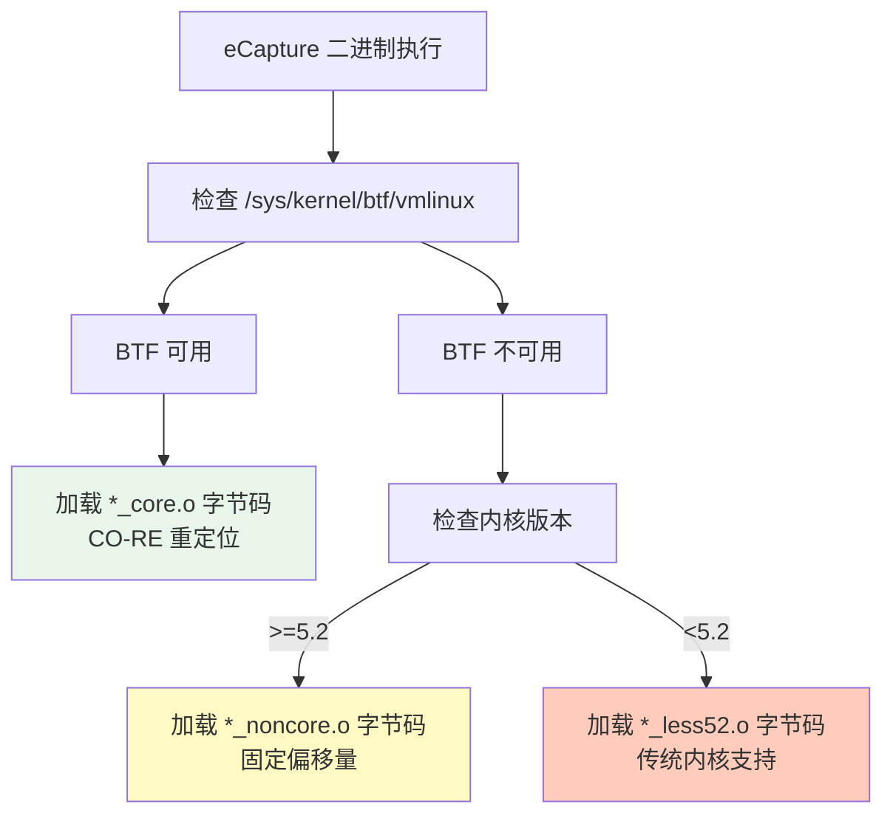
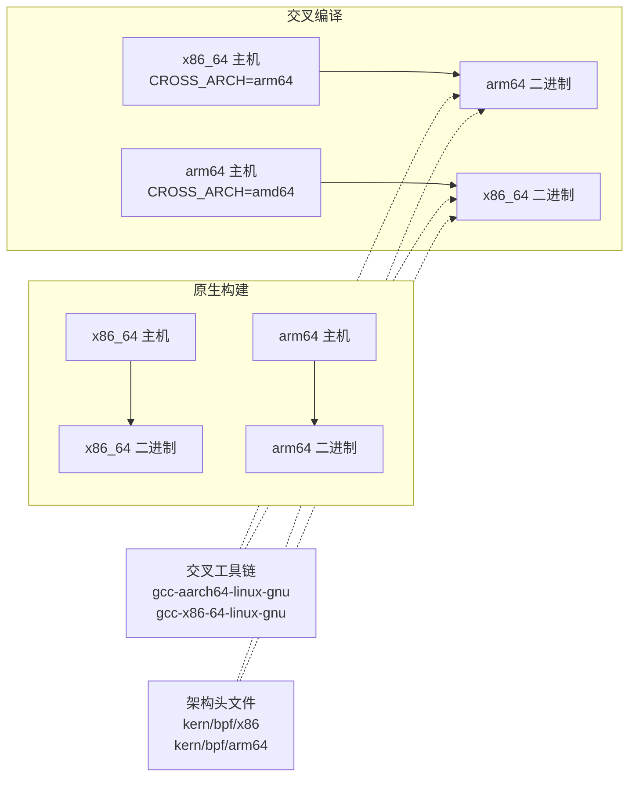
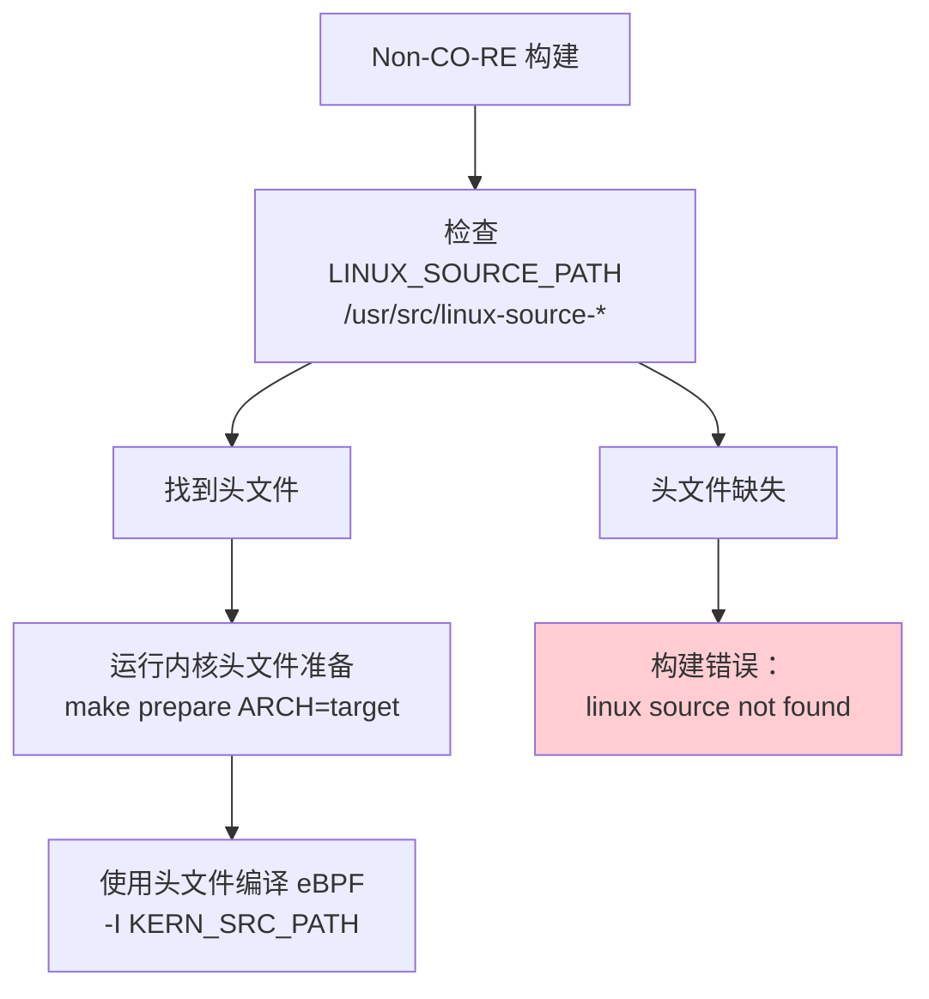
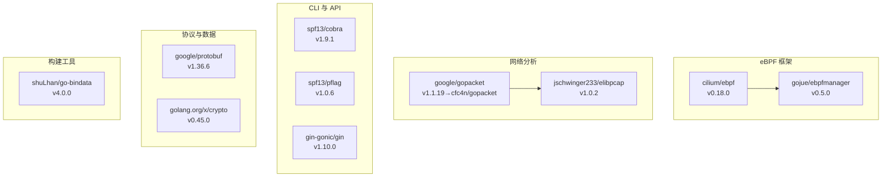
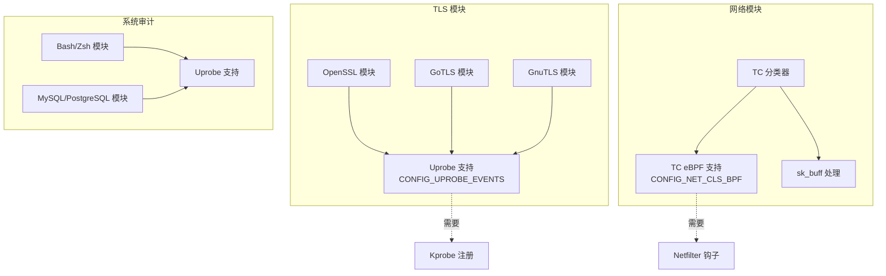
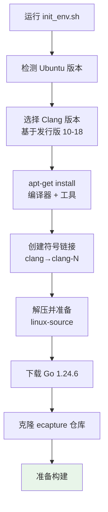
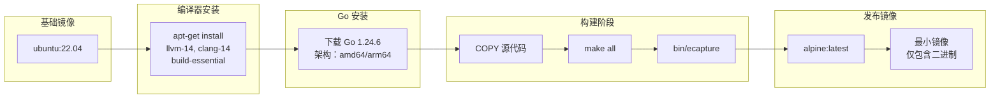

# 依赖与系统要求

本页面文档记录了构建和运行 eCapture 所需的系统要求、依赖项和工具链前置条件。内容涵盖内核版本要求、支持的架构、构建时工具、运行时依赖以及 Go 包依赖。

关于构建过程本身的信息，请参阅[构建系统](../5-development-guide/5.1-build-system.md)。关于安装说明，请参阅[安装与快速入门](1.1-installation-and-quick-start.md)。

---

## 概述

eCapture 在构建时（编译 eBPF 程序和 Go 二进制文件）和运行时（执行已编译的二进制文件）有不同的要求。系统支持两种编译模式，具有不同的要求：

- **CO-RE（一次编译 - 到处运行）**：运行时需要支持 BTF 的内核（≥5.2），但产生可移植的二进制文件
- **Non-CO-RE（非 CO-RE）**：构建时需要内核头文件，为旧系统产生特定于内核的二进制文件

---

## 内核要求

### 最低内核版本

| 模式 | 最低版本 | 需要 BTF | 备注 |
|------|----------------|--------------|-------|
| CO-RE | 5.2+ | 是 | 推荐用于可移植性 |
| CO-RE（传统） | 4.18-5.1 | 否 | 特殊的 `_less52.o` 字节码变体 |
| Non-CO-RE | 4.18+ | 否 | 需要精确的内核头文件 |

内核版本检测和处理在 [variables.mk](https://github.com/gojue/ecapture/blob/0766a93b/variables.mk) 中实现，为内核 < 5.2 设置 `KERNEL_LESS_5_2_PREFIX`。

### BTF（BPF 类型格式）支持

BTF 是 CO-RE 模式的关键特性。构建系统检查 BTF 可用性：



**BTF 检测**：系统在运行时检查 `/sys/kernel/btf/vmlinux`。如果存在，则使用 CO-RE 字节码；否则，采用 non-CO-RE 回退。

来源：[Makefile:122-134](https://github.com/gojue/ecapture/blob/0766a93b/Makefile#L122-L134), [functions.mk:13-22](https://github.com/gojue/ecapture/blob/0766a93b/functions.mk#L13-L22)

---

## 支持的架构

| 架构 | 状态 | 交叉编译 | 备注 |
|--------------|--------|-------------------|-------|
| x86_64 (amd64) | ✅ 完整支持 | 到 arm64 | 主要开发平台 |
| aarch64 (arm64) | ✅ 完整支持 | 到 x86_64 | 功能完全对等 |
| Android arm64 | ⚠️ 有限支持 | 从 x86_64/arm64 | 仅 non-CO-RE，专注 BoringSSL |

架构检测在 [variables.mk](https://github.com/gojue/ecapture/blob/0766a93b/variables.mk) 中处理，根据 `uname -m` 或 `CROSS_ARCH` 环境变量设置 `TARGET_ARCH`、`GOARCH`、`LINUX_ARCH` 和 `LIBPCAP_ARCH`。



来源：[.github/workflows/go-c-cpp.yml:59-65](https://github.com/gojue/ecapture/blob/0766a93b/.github/workflows/go-c-cpp.yml#L59-L65), [.github/workflows/release.yml:93-97](https://github.com/gojue/ecapture/blob/0766a93b/.github/workflows/release.yml#L93-L97), [builder/init_env.sh:43-61](https://github.com/gojue/ecapture/blob/0766a93b/builder/init_env.sh#L43-L61)

---

## 构建时依赖

### 必需的编译器和工具

下表列出了所有构建时依赖及其最低版本：

| 工具 | 最低版本 | 用途 | 包名（Ubuntu） |
|------|----------------|---------|----------------------|
| **clang** | 9.0+ | 编译 eBPF C 到字节码 | `clang-14`（推荐） |
| **llc** | 9.0+ | LLVM 编译器后端 | `llvm-14` |
| **llvm-strip** | 9.0+ | 剥离调试符号 | `llvm-14` |
| **gcc** | 系统默认 | C 编译 | `build-essential` |
| **go** | 1.24+ | Go 编译 | N/A（从 golang.org 安装） |
| **bpftool** | 任意 | 生成 vmlinux.h | `linux-tools-generic` |
| **flex** | 任意 | 内核构建的词法分析器 | `flex` |
| **bison** | 任意 | 内核构建的解析器 | `bison` |
| **elfutils** | 任意 | ELF 文件操作 | `libelf-dev` |
| **pkgconf** | 任意 | 包配置 | `pkgconf` |

版本检查在构建时强制执行：

[functions.mk:13-35](https://github.com/gojue/ecapture/blob/0766a93b/functions.mk#L13-L35)：
```
Clang 版本检查：CLANG_VERSION 必须 >= 9
Go 版本检查：GO_VERSION_MAJ=1，GO_VERSION_MIN >= 24
```

来源：[.github/workflows/go-c-cpp.yml:16-24](https://github.com/gojue/ecapture/blob/0766a93b/.github/workflows/go-c-cpp.yml#L16-L24), [functions.mk:13-35](https://github.com/gojue/ecapture/blob/0766a93b/functions.mk#L13-L35), [builder/init_env.sh:72-79](https://github.com/gojue/ecapture/blob/0766a93b/builder/init_env.sh#L72-L79)

### 内核头文件（仅 Non-CO-RE）

对于 non-CO-RE 构建，需要与目标内核匹配的内核头文件。构建系统在多个位置搜索头文件：



编译期间使用的头文件路径 [Makefile:154-161](https://github.com/gojue/ecapture/blob/0766a93b/Makefile#L154-L161)：
- `-I $(KERN_SRC_PATH)/arch/$(LINUX_ARCH)/include`
- `-I $(KERN_BUILD_PATH)/arch/$(LINUX_ARCH)/include/generated`
- `-I $(KERN_SRC_PATH)/include`
- `-I $(KERN_BUILD_PATH)/include/generated/uapi`

来源：[Makefile:98-104](https://github.com/gojue/ecapture/blob/0766a93b/Makefile#L98-L104), [Makefile:146-183](https://github.com/gojue/ecapture/blob/0766a93b/Makefile#L146-L183), [builder/init_env.sh:81-89](https://github.com/gojue/ecapture/blob/0766a93b/builder/init_env.sh#L81-L89)

### 交叉编译依赖

交叉编译需要特定于架构的工具链：

| 主机 → 目标 | 所需包 | 备注 |
|---------------|-----------------|-------|
| x86_64 → arm64 | `gcc-aarch64-linux-gnu` | 设置 `CC=aarch64-linux-gnu-gcc` |
| arm64 → x86_64 | `gcc-x86-64-linux-gnu` | Ubuntu 24.04+ 包名 |
| 任意 → Android | 不需要 NDK | 使用标准交叉编译器 |

来源：[.github/workflows/go-c-cpp.yml:19](https://github.com/gojue/ecapture/blob/0766a93b/.github/workflows/go-c-cpp.yml#L19), [builder/init_env.sh:46-58](https://github.com/gojue/ecapture/blob/0766a93b/builder/init_env.sh#L46-L58)

---

## Go 依赖

### 核心依赖

项目使用 Go 1.24.3+ 及以下主要依赖：



**关键依赖：**

1. **cilium/ebpf v0.18.0**：核心 eBPF 库，用于加载程序、管理映射和处理 CO-RE 重定位。提供 `ebpf.CollectionSpec` 和映射管理。

2. **gojue/ebpfmanager v0.5.0**：更高级别的 eBPF 生命周期管理。封装 cilium/ebpf，提供探针附加、TC 钩子管理和清理编排。

3. **cfc4n/gopacket v1.1.20**：`google/gopacket` 的分支版本，对 PCAP-NG 格式进行了改进。用于数据包序列化和 PCAP 文件生成。

4. **jschwinger233/elibpcap v1.0.2**：TC 程序的 BPF 过滤器编译器。将伯克利包过滤器（BPF）语法翻译为 eBPF 字节码。

5. **go-bindata**：将编译的 eBPF 字节码（`.o` 文件）作为字节数组嵌入到 [assets/ebpf_probe.go](https://github.com/gojue/ecapture/blob/0766a93b/assets/ebpf_probe.go) 中的 Go 二进制文件中。

来源：[go.mod:5-19](https://github.com/gojue/ecapture/blob/0766a93b/go.mod#L5-L19), [go.sum:8-14](https://github.com/gojue/ecapture/blob/0766a93b/go.sum#L8-L14)

### 间接依赖

关键的间接依赖包括：

| 包 | 版本 | 用途 |
|---------|---------|---------|
| `florianl/go-tc` | v0.4.5 | Linux 流量控制 netlink 接口 |
| `vishvananda/netlink` | v1.3.1 | 通用 netlink 操作 |
| `mdlayher/netlink` | v1.7.2 | 低级 netlink 套接字库 |
| `hashicorp/go-multierror` | v1.1.1 | 错误聚合 |

来源：[go.mod:22-58](https://github.com/gojue/ecapture/blob/0766a93b/go.mod#L22-L58)

---

## 运行时依赖

### 最小运行时要求

编译后的 `ecapture` 二进制文件除了内核特性外**没有运行时依赖**：

| 要求 | 描述 |
|-------------|-------------|
| Linux 内核 | 4.18+（non-CO-RE）或 5.2+（CO-RE） |
| BTF 支持 | 仅用于 CO-RE 模式 |
| `CAP_SYS_ADMIN` | 或 root 权限以加载 eBPF 程序 |
| `CAP_BPF` + `CAP_PERFMON` | 在 5.8+ 内核上作为 `CAP_SYS_ADMIN` 的替代 |

**静态链接**：二进制文件与 libpcap 静态链接 [functions.mk:48-53](https://github.com/gojue/ecapture/blob/0766a93b/functions.mk#L48-L53)：
```
CGO_LDFLAGS='-O2 -g -L$(CURDIR)/lib/libpcap/ -lpcap -static'
-ldflags "... -linkmode=external -extldflags -static"
```

这消除了运行时对 libpcap 的需求。

### 各模块的内核特性要求

不同的捕获模块需要不同的内核特性：



来源：[variables.mk](https://github.com/gojue/ecapture/blob/0766a93b/variables.mk), [Makefile:122-134](https://github.com/gojue/ecapture/blob/0766a93b/Makefile#L122-L134)

---

## 编译模式比较

### CO-RE 与 Non-CO-RE

| 方面 | CO-RE 模式 | Non-CO-RE 模式 |
|--------|-----------|----------------|
| **构建要求** | clang、llc、BTF 头文件 | clang、llc、完整内核头文件 |
| **运行时要求** | 支持 BTF 的内核（5.2+） | 任意 4.18+ 内核 |
| **可移植性** | 一个二进制适用所有内核 | 特定于内核的二进制 |
| **字节码大小** | 较大（包含重定位信息） | 较小（固定偏移量） |
| **构建时间** | 更快（无需内核准备） | 较慢（内核头文件准备） |
| **使用场景** | 通用分发 | 传统系统、Android |

**编译标志比较：**

CO-RE [Makefile:122-134](https://github.com/gojue/ecapture/blob/0766a93b/Makefile#L122-L134)：
```
-target bpfel -g -D__BPF_TARGET_MISSING="..."
# 使用 BTF 信息进行重定位
```

Non-CO-RE [Makefile:151-166](https://github.com/gojue/ecapture/blob/0766a93b/Makefile#L151-L166)：
```
-I $(KERN_SRC_PATH)/arch/$(LINUX_ARCH)/include
-I $(KERN_BUILD_PATH)/include/generated/uapi
# 需要所有内核头文件路径
```

来源：[Makefile:122-183](https://github.com/gojue/ecapture/blob/0766a93b/Makefile#L122-L183), [variables.mk](https://github.com/gojue/ecapture/blob/0766a93b/variables.mk)

---

## 开发环境设置

### 自动化设置（Ubuntu）

项目提供 [builder/init_env.sh](https://github.com/gojue/ecapture/blob/0766a93b/builder/init_env.sh) 用于自动化环境设置：



特定版本的 clang 选择 [builder/init_env.sh:16-39](https://github.com/gojue/ecapture/blob/0766a93b/builder/init_env.sh#L16-L39)：
- Ubuntu 20.04：clang-10
- Ubuntu 22.04：clang-12
- Ubuntu 23.04+：clang-15
- Ubuntu 24.04：clang-18

来源：[builder/init_env.sh:1-106](https://github.com/gojue/ecapture/blob/0766a93b/builder/init_env.sh#L1-L106)

### 手动设置

对于手动设置，安装这些包组：

**基础工具：**
```bash
sudo apt-get install build-essential pkgconf libelf-dev
```

**LLVM 工具链：**
```bash
sudo apt-get install llvm-14 clang-14
sudo ln -sf /usr/bin/clang-14 /usr/bin/clang
sudo ln -sf /usr/bin/llc-14 /usr/bin/llc
sudo ln -sf /usr/bin/llvm-strip-14 /usr/bin/llvm-strip
```

**内核工具：**
```bash
sudo apt-get install linux-tools-common linux-tools-generic flex bison
```

**交叉编译（可选）：**
```bash
# 在 x86_64 上编译 arm64
sudo apt-get install gcc-aarch64-linux-gnu

# 在 arm64 上编译 x86_64
sudo apt-get install gcc-x86-64-linux-gnu
```

**内核头文件（用于 non-CO-RE）：**
```bash
sudo apt-get install linux-source
cd /usr/src
sudo tar -xf linux-source-*.tar.bz2
cd linux-source-*/
sudo make oldconfig
sudo make prepare
```

来源：[.github/workflows/go-c-cpp.yml:16-33](https://github.com/gojue/ecapture/blob/0766a93b/.github/workflows/go-c-cpp.yml#L16-L33), [builder/init_env.sh:72-89](https://github.com/gojue/ecapture/blob/0766a93b/builder/init_env.sh#L72-L89)

---

## Docker 构建环境

项目提供 Dockerfile 用于容器化构建：



多阶段构建 [builder/Dockerfile:1-39](https://github.com/gojue/ecapture/blob/0766a93b/builder/Dockerfile#L1-L39)：
1. **构建器阶段**：Ubuntu 22.04 上的完整工具链
2. **发布阶段**：带有静态二进制文件的最小 Alpine 镜像

为多个架构构建：
```bash
docker buildx build --platform linux/amd64,linux/arm64 -t ecapture:latest .
```

来源：[builder/Dockerfile:1-39](https://github.com/gojue/ecapture/blob/0766a93b/builder/Dockerfile#L1-L39), [.github/workflows/release.yml:101-129](https://github.com/gojue/ecapture/blob/0766a93b/.github/workflows/release.yml#L101-L129)

---

## 验证命令

设置后，验证依赖：

```bash
# 检查工具版本
clang --version          # 应该 >= 9.0
go version               # 应该 >= 1.24.0
llc --version            # 应该与 clang 版本匹配
bpftool version          # 任意版本

# 检查 BTF 支持（运行时）
ls -l /sys/kernel/btf/vmlinux  # CO-RE 应该存在

# 检查 eBPF 内核配置
grep CONFIG_BPF /boot/config-$(uname -r)
# 应该显示：
# CONFIG_BPF=y
# CONFIG_BPF_SYSCALL=y
# CONFIG_HAVE_EBPF_JIT=y
```

来源：[functions.mk:2-39](https://github.com/gojue/ecapture/blob/0766a93b/functions.mk#L2-L39), [variables.mk](https://github.com/gojue/ecapture/blob/0766a93b/variables.mk)

---

## 常见问题

### Clang 版本过旧

**问题**：构建失败，提示 "you MUST use clang 9 or newer"

**解决方案**：安装较新的 clang 版本并创建符号链接 [builder/init_env.sh:75-79](https://github.com/gojue/ecapture/blob/0766a93b/builder/init_env.sh#L75-L79)：
```bash
sudo apt-get install clang-14 llc-14 llvm-strip-14
sudo ln -sf /usr/bin/clang-14 /usr/bin/clang
```

### 缺少内核头文件

**问题**：Non-CO-RE 构建失败，提示 "linux source not found"

**解决方案**：安装并准备内核头文件 [Makefile:98-104](https://github.com/gojue/ecapture/blob/0766a93b/Makefile#L98-L104)：
```bash
sudo apt-get install linux-source
cd /usr/src && sudo tar -xf linux-source-*.tar.bz2
cd linux-source-*/ && sudo make prepare
```

### Go 版本过旧

**问题**：构建失败，提示 "you MUST use golang 1.24 or newer"

**解决方案**：从 [golang.org/dl](https://golang.org/dl/) 下载 Go 1.24.6+ 并更新 PATH。

来源：[functions.mk:13-35](https://github.com/gojue/ecapture/blob/0766a93b/functions.mk#L13-L35), [Makefile:98-104](https://github.com/gojue/ecapture/blob/0766a93b/Makefile#L98-L104), [builder/init_env.sh:72-89](https://github.com/gojue/ecapture/blob/0766a93b/builder/init_env.sh#L72-L89)