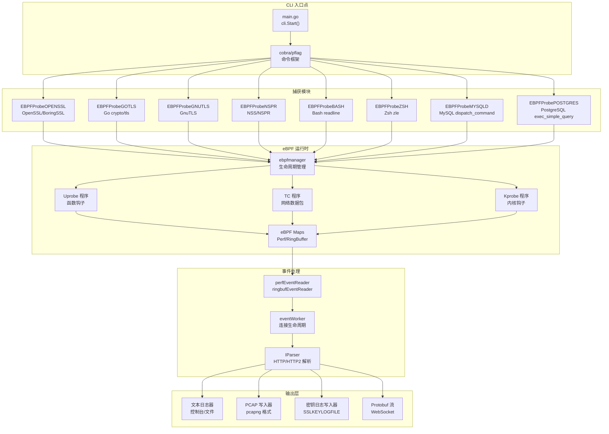
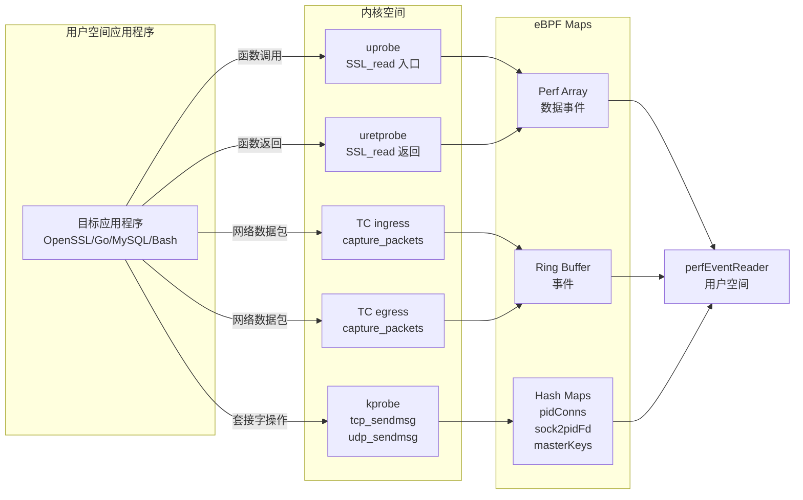
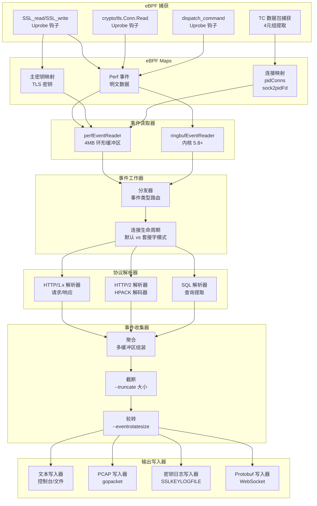
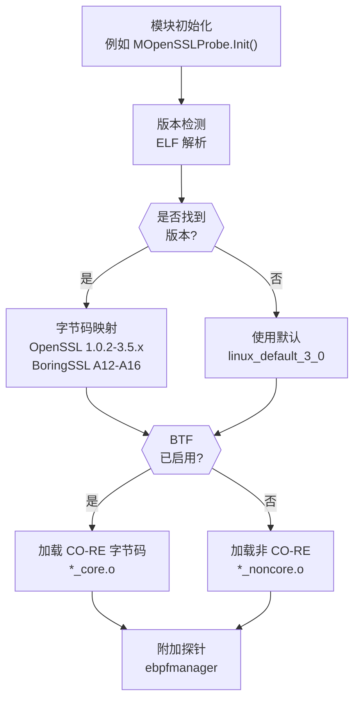

# 概述

本文档介绍 eCapture（旁观者），这是一个基于 eBPF 的网络流量捕获和系统审计工具。eCapture 拦截 SSL/TLS 加密通信并提取明文数据，无需 CA 证书或修改应用程序。它还提供了 Shell 命令和数据库查询的系统审计能力。

有关安装和使用说明，请参阅[安装与快速入门](1.1-installation-and-quick-start.md)。有关详细的模块文档，请参阅[捕获模块](../3-capture-modules/index.md)。有关构建和开发信息，请参阅[开发指南](../5-development-guide/index.md)。

## 系统目的与功能

eCapture 使用 eBPF（扩展伯克利包过滤器）技术在用户空间和内核空间边界捕获加密网络流量。系统将探针附加到 SSL/TLS 库函数和网络栈入口点，实现加密通信的明文捕获和系统活动的运行时审计。

**核心功能：**
- **SSL/TLS 明文捕获**：拦截来自 OpenSSL、BoringSSL、GnuTLS、NSS/NSPR 库的加密数据
- **Go TLS 捕获**：支持原生 Go `crypto/tls` 库加密
- **系统审计**：捕获 Bash/Zsh 命令和 MySQL/PostgreSQL SQL 查询
- **无需 CA 证书**：透明工作，无需证书安装
- **多种输出格式**：文本、PCAP-NG、密钥日志（SSLKEYLOGFILE）、Protobuf 流

来源：[README.md:1-43](https://github.com/gojue/ecapture/blob/0766a93b/README.md#L1-L43)、[README_CN.md:40-43](https://github.com/gojue/ecapture/blob/0766a93b/README_CN.md#L40-L43)、[CHANGELOG.md:188-273](https://github.com/gojue/ecapture/blob/0766a93b/CHANGELOG.md#L188-L273)

## 平台支持

eCapture 支持 Linux 和 Android 操作系统，具有特定的内核版本要求：

| 架构 | 最低内核版本 | 备注 |
|------|-------------|------|
| x86_64 | 4.18 | 完整功能支持 |
| aarch64 | 5.5 | 完整功能支持 |

**要求：**
- eBPF 操作需要 ROOT 权限
- 推荐但不强制要求 BTF（BPF Type Format）支持
- 非 CO-RE 编译模式需要内核头文件

**不支持的平台：**
- Windows（无 eBPF 支持）
- macOS（无 eBPF 支持）

系统会自动检测内核能力，并在运行时选择 CO-RE（一次编译，到处运行）或非 CO-RE 字节码。

来源：[README.md:14-16](https://github.com/gojue/ecapture/blob/0766a93b/README.md#L14-L16)、[README_CN.md:15-17](https://github.com/gojue/ecapture/blob/0766a93b/README_CN.md#L15-L17)、[go.mod:1-60](https://github.com/gojue/ecapture/blob/0766a93b/go.mod#L1-L60)

## 系统架构



**系统层次：**

1. **CLI 入口点**：使用 Cobra 框架的命令行界面，用于子命令路由
2. **捕获模块**：八个专用模块，实现 `IModule` 接口，用于不同协议
3. **eBPF 运行时**：探针管理、字节码加载和 eBPF 程序生命周期
4. **事件处理**：事件读取、连接跟踪和协议解析
5. **输出层**：针对不同消费场景的多种输出格式

每个模块通过 `IModule` 接口进行协调，使用自己的 eBPF 程序和事件处理程序独立运行。

来源：[main.go:1-12](https://github.com/gojue/ecapture/blob/0766a93b/main.go#L1-L12)、[README.md:152-161](https://github.com/gojue/ecapture/blob/0766a93b/README.md#L152-L161)、[README_CN.md:129-140](https://github.com/gojue/ecapture/blob/0766a93b/README_CN.md#L129-L140)

## 捕获模块

eCapture 提供八个模块用于捕获不同的协议和应用程序：

| 模块 | 目标 | 描述 | 命令 |
|------|------|------|------|
| `tls` | OpenSSL/BoringSSL | 从 OpenSSL 1.0.x-3.5.x 和 BoringSSL（Android 12-16）捕获 SSL/TLS 明文 | `ecapture tls` |
| `gotls` | Go crypto/tls | 从使用原生 crypto/tls 库的 Go 应用程序捕获 TLS 流量 | `ecapture gotls` |
| `gnutls` | GnuTLS | 从 GnuTLS 库应用程序捕获 TLS 流量 | `ecapture gnutls` |
| `nss` | NSS/NSPR | 从 Firefox 和其他基于 NSS/NSPR 的应用程序捕获流量 | `ecapture nss` |
| `bash` | Bash | 通过 readline 库钩子审计 bash 命令执行 | `ecapture bash` |
| `zsh` | Zsh | 通过 zle（Z-Shell 行编辑器）钩子审计 zsh 命令执行 | `ecapture zsh` |
| `mysqld` | MySQL/MariaDB | 从 MySQL 5.6/5.7/8.0 和 MariaDB 捕获 SQL 查询 | `ecapture mysqld` |
| `postgres` | PostgreSQL | 从 PostgreSQL 10+ 捕获 SQL 查询 | `ecapture postgres` |

每个模块实现 `IModule` 接口，可以独立运行或与其他模块组合使用。

来源：[README.md:152-161](https://github.com/gojue/ecapture/blob/0766a93b/README.md#L152-L161)、[README_CN.md:129-140](https://github.com/gojue/ecapture/blob/0766a93b/README_CN.md#L129-L140)、[CHANGELOG.md:38-42](https://github.com/gojue/ecapture/blob/0766a93b/CHANGELOG.md#L38-L42)

## eBPF 技术使用



**eBPF 探针类型：**

1. **Uprobe/Uretprobe**：附加到用户空间库函数
   - 入口探针捕获函数参数（例如 `SSL_read(ssl, buf, len)`）
   - 返回探针捕获返回值和输出缓冲区
   - 用途：SSL/TLS 函数、数据库查询、Shell 命令

2. **TC（流量控制）**：附加到网络接口入口/出口
   - 在内核级别捕获网络数据包
   - 提取 4 元组（源/目的 IP:端口）用于连接跟踪
   - 用途：PCAP 模式数据包捕获，带进程归属

3. **Kprobe**：附加到内核函数
   - 钩取套接字操作（`tcp_sendmsg`、`udp_sendmsg`）
   - 将套接字文件描述符映射到进程
   - 用途：连接跟踪和进程识别

**CO-RE vs 非 CO-RE：**
- **CO-RE（启用 BTF）**：单一字节码适用于所有内核版本
- **非 CO-RE**：需要带头文件的内核特定字节码
- eCapture 自动检测 BTF 可用性并加载适当的字节码

来源：[README.md:38-43](https://github.com/gojue/ecapture/blob/0766a93b/README.md#L38-L43)、[CHANGELOG.md:249-251](https://github.com/gojue/ecapture/blob/0766a93b/CHANGELOG.md#L249-L251)、[CHANGELOG.md:552-556](https://github.com/gojue/ecapture/blob/0766a93b/CHANGELOG.md#L552-L556)

## 输出模式和格式

eCapture 支持四种主要输出模式，每个模块可配置：

### 文本模式

**命令**：`ecapture tls -m text`（默认模式）

直接将明文数据输出到控制台或文件。包括 HTTP/1.x 和 HTTP/2 协议解析，自动解码压缩响应。

**功能：**
- 实时输出到 stdout
- 使用 `-w <文件名>` 输出到文件
- HTTP/HTTP2 请求/响应解析
- 彩色输出，提高可读性
- 使用 `--hex` 标志的十六进制转储模式

### PCAP 模式

**命令**：`ecapture tls -m pcap --pcapfile=output.pcapng -i eth0`

生成与 Wireshark 兼容的 PCAP-NG 文件，将捕获的明文与重构的网络数据包结合。

**功能：**
- 标准 pcapng 格式，带 EPB（增强数据包块）
- DSB（解密密钥块）用于 TLS 主密钥
- IPv4/IPv6 支持，带 4 元组跟踪
- TCP 和 UDP 协议支持（包括 QUIC）
- 通过 eBPF 进行 PID/UID 过滤

### 密钥日志模式

**命令**：`ecapture tls -m keylog --keylogfile=keys.log`

以 `SSLKEYLOGFILE` 格式导出 TLS 主密钥，供 Wireshark 或 tshark 使用。

**格式：**
```
CLIENT_RANDOM <client_random_hex> <master_secret_hex>
CLIENT_HANDSHAKE_TRAFFIC_SECRET <client_random_hex> <secret_hex>
SERVER_HANDSHAKE_TRAFFIC_SECRET <client_random_hex> <secret_hex>
```

**使用案例：**
```shell
# 捕获密钥
ecapture tls -m keylog --keylogfile=keys.log

# 使用 tshark 解密
tshark -o tls.keylog_file:keys.log -Y http -T fields -e http.file_data -f "port 443" -i eth0
```

### Protobuf 模式

**命令**：`ecapture tls`，启用 WebSocket 服务器（默认：`localhost:28256`）

以 Protocol Buffer 格式将事件流式传输到已连接的客户端（例如 eCaptureQ GUI 应用程序）。

**事件类型：**
- `SSLDataEvent`：SSL/TLS 明文数据
- `MasterSecretEvent`：TLS 主密钥
- `BashEvent`：Shell 命令
- `MysqldEvent`：SQL 查询

来源：[README.md:172-253](https://github.com/gojue/ecapture/blob/0766a93b/README.md#L172-L253)、[README_CN.md:150-220](https://github.com/gojue/ecapture/blob/0766a93b/README_CN.md#L150-L220)、[CHANGELOG.md:715-747](https://github.com/gojue/ecapture/blob/0766a93b/CHANGELOG.md#L715-L747)

## 数据流管道



**管道阶段：**

1. **捕获**：eBPF 探针拦截函数调用和网络数据包
2. **Maps**：事件和连接状态的内核空间存储
3. **读取器**：eBPF 映射数据的用户空间消费者（perf 数组或 ring buffer）
4. **工作器**：事件类型分发和连接生命周期管理
5. **解析器**：协议特定解析（HTTP、HTTP/2、SQL）
6. **收集器**：事件聚合、截断和轮转
7. **写入器**：格式特定的输出生成

管道支持可配置的事件截断（`--truncate`）、文件轮转（`--eventrotatesize`、`--eventrotatetime`）以及按 PID（`--pid`）或 UID（`--uid`）进行选择性过滤。

来源：[CHANGELOG.md:137-163](https://github.com/gojue/ecapture/blob/0766a93b/CHANGELOG.md#L137-L163)、[CHANGELOG.md:647-653](https://github.com/gojue/ecapture/blob/0766a93b/CHANGELOG.md#L647-L653)、[CHANGELOG.md:491-493](https://github.com/gojue/ecapture/blob/0766a93b/CHANGELOG.md#L491-L493)

## 版本检测与字节码选择



**版本检测过程：**

1. **ELF 解析**：读取共享库文件（例如 `libssl.so.3`）以提取版本字符串
2. **版本映射**：将检测到的版本映射到特定的结构体偏移量
3. **字节码选择**：根据版本和 BTF 可用性选择适当的 eBPF 字节码
4. **回退策略**：如果检测失败，使用默认版本偏移量

**支持的 OpenSSL 版本：**
- 1.0.2 系列：1.0.2a-1.0.2zg
- 1.1.0 系列：1.1.0-1.1.0l
- 1.1.1 系列：1.1.1-1.1.1w
- 3.0 系列：3.0.0-3.0.15
- 3.1 系列：3.1.0-3.1.7
- 3.2 系列：3.2.0-3.2.3
- 3.3 系列：3.3.0-3.3.3
- 3.4 系列：3.4.0-3.4.1
- 3.5 系列：3.5.0-3.5.4

**支持的 BoringSSL 版本：**
- Android 12（API 31，A12）
- Android 13（API 33，A13）
- Android 14（API 34，A14）
- Android 15（API 35，A15）
- Android 16（API 36，A16）

当版本检测失败时，系统会发出警告，但会继续使用默认偏移量。

来源：[CHANGELOG.md:14-35](https://github.com/gojue/ecapture/blob/0766a93b/CHANGELOG.md#L14-L35)、[CHANGELOG.md:98-99](https://github.com/gojue/ecapture/blob/0766a93b/CHANGELOG.md#L98-L99)、[CHANGELOG.md:305-308](https://github.com/gojue/ecapture/blob/0766a93b/CHANGELOG.md#L305-L308)、[CHANGELOG.md:540-541](https://github.com/gojue/ecapture/blob/0766a93b/CHANGELOG.md#L540-L541)、[CHANGELOG.md:651-654](https://github.com/gojue/ecapture/blob/0766a93b/CHANGELOG.md#L651-L654)、[CHANGELOG.md:779-781](https://github.com/gojue/ecapture/blob/0766a93b/CHANGELOG.md#L779-L781)

## 使用场景

### 网络调试与开发

**场景**：调试 HTTPS API 调用，无需修改应用程序代码

```shell
# 捕获特定进程的明文
ecapture tls --pid=12345

# 捕获带 HTTP/2 解析
ecapture tls -m text

# 生成 PCAP 供 Wireshark 分析
ecapture tls -m pcap -i eth0 --pcapfile=debug.pcapng
```

### 安全分析与监控

**场景**：实时监控加密通信以进行安全审计

```shell
# 捕获系统上所有 HTTPS 流量
ecapture tls

# 监控特定用户的连接
ecapture tls --uid=1000

# 导出密钥进行离线分析
ecapture tls -m keylog --keylogfile=audit_keys.log
```

### 数据库活动审计

**场景**：监控 SQL 查询以进行合规性和性能分析

```shell
# 捕获 MySQL 查询
ecapture mysqld --pid=$(pidof mysqld)

# 捕获 PostgreSQL 查询
ecapture postgres --pid=$(pidof postgres)
```

### Shell 命令审计

**场景**：跟踪 Shell 命令以进行安全审计和事件响应

```shell
# 审计所有 bash 会话
ecapture bash

# 审计 zsh 会话
ecapture zsh
```

### Go 应用程序 TLS 捕获

**场景**：调试使用原生 crypto/tls 库的 Go 应用程序

```shell
# 指定 Go 二进制文件路径
ecapture gotls --elfpath=/path/to/go_binary

# 使用密钥日志模式捕获
ecapture gotls --elfpath=/path/to/go_binary -m keylog
```

来源：[README.md:72-280](https://github.com/gojue/ecapture/blob/0766a93b/README.md#L72-L280)、[README_CN.md:69-251](https://github.com/gojue/ecapture/blob/0766a93b/README_CN.md#L69-L251)、[CHANGELOG.md:260-273](https://github.com/gojue/ecapture/blob/0766a93b/CHANGELOG.md#L260-L273)

## 远程配置与集成

eCapture 提供 HTTP API 用于运行时配置更新和事件转发：

**HTTP 配置 API**：可在 `localhost:28256` 访问（可使用 `--listen` 标志配置）

**事件转发：**
- WebSocket 流式传输到外部客户端
- Protocol Buffer 序列化用于结构化数据
- 与 eCaptureQ GUI 应用程序集成
- 支持 Burp Suite 和其他分析工具

详细 API 文档请参阅：
- 远程配置：[docs/remote-config-update-api.md](https://github.com/gojue/ecapture/blob/0766a93b/docs/remote-config-update-api.md)
- 事件转发：[docs/event-forward-api.md](https://github.com/gojue/ecapture/blob/0766a93b/docs/event-forward-api.md)
- Protobuf 协议：[protobuf/PROTOCOLS.md](https://github.com/gojue/ecapture/blob/0766a93b/protobuf/PROTOCOLS.md)

来源：[CHANGELOG.md:16-17](https://github.com/gojue/ecapture/blob/0766a93b/CHANGELOG.md#L16-L17)、[CHANGELOG.md:27-28](https://github.com/gojue/ecapture/blob/0766a93b/CHANGELOG.md#L27-L28)、[CHANGELOG.md:43-45](https://github.com/gojue/ecapture/blob/0766a93b/CHANGELOG.md#L43-L45)、[CHANGELOG.md:82-89](https://github.com/gojue/ecapture/blob/0766a93b/CHANGELOG.md#L82-L89)、[README.md:288-327](https://github.com/gojue/ecapture/blob/0766a93b/README.md#L288-L327)、[README_CN.md:268-307](https://github.com/gojue/ecapture/blob/0766a93b/README_CN.md#L268-L307)

## 构建与部署

eCapture 使用复杂的构建系统生成独立的二进制文件：

**构建产物：**
- **Linux ELF 二进制文件**：嵌入 eBPF 字节码的静态二进制文件
- **Docker 镜像**：多架构镜像（linux/amd64、linux/arm64）
- **Debian 软件包**：用于软件包管理的 `.deb` 格式
- **Android 发行版**：仅非 CO-RE，支持 BoringSSL

**二进制嵌入**：所有 eBPF 字节码变体都使用 `go-bindata` 嵌入，消除对外部字节码文件的运行时依赖。

**交叉编译**：支持在 aarch64 主机上构建 x86_64 二进制文件，反之亦然。

有关构建说明和开发设置，请参阅[构建系统](../5-development-guide/5.1-build-system.md)。

来源：[CHANGELOG.md:537-538](https://github.com/gojue/ecapture/blob/0766a93b/CHANGELOG.md#L537-L538)、[README.md:316-319](https://github.com/gojue/ecapture/blob/0766a93b/README.md#L316-L319)、[README_CN.md:297-300](https://github.com/gojue/ecapture/blob/0766a93b/README_CN.md#L297-L300)