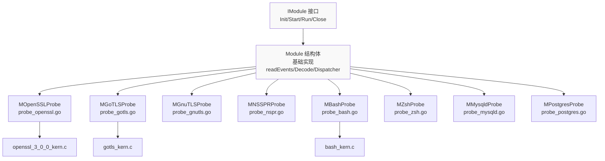
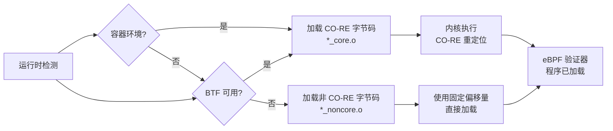
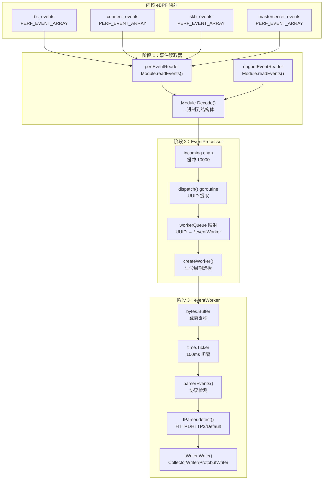
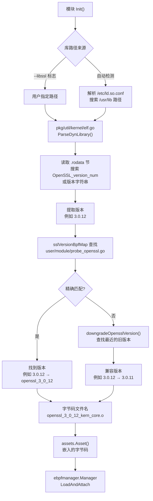

# 概述

**eCapture（旁观者）** 是一个基于 eBPF 的网络流量捕获和系统审计工具，无需 CA 证书或修改应用程序即可拦截 SSL/TLS 加密通信的明文。该工具使用内核级的 uprobe、kprobe 和 Traffic Control (TC) 钩子在加密边界捕获数据，支持多种 SSL/TLS 库实现，并提供全面的系统审计能力。

本页提供 eCapture 用途、架构和功能的高层次概览。有关安装说明，请参阅[安装与快速入门](1.1-installation-and-quick-start.md)。有关详细的架构信息，请参阅[架构](../2-architecture/index.md)。有关模块特定的文档，请参阅[捕获模块](../3-capture-modules/index.md)。

---

## 目的与范围

eCapture 解决了检查加密网络流量和审计系统活动的问题，无需：

- 在目标应用程序中安装 CA 证书
- 修改应用程序源代码或配置
- 在网络层执行中间人攻击
- 需要应用程序重启或环境变量注入

该工具完全通过加载到 Linux 内核的 eBPF 程序运行，在用户空间/内核空间边界拦截函数调用，在加密之前或解密之后捕获明文数据。

**来源：** [README.md:1-44](https://github.com/gojue/ecapture/blob/ca085d05/README.md#L1-L44), [README_CN.md:1-43](https://github.com/gojue/ecapture/blob/ca085d05/README_CN.md#L1-L43), [CHANGELOG.md:188-282](https://github.com/gojue/ecapture/blob/ca085d05/CHANGELOG.md#L188-L282)

---

## 核心能力

eCapture 提供按功能组织的八个不同捕获模块：

| 模块 | 目的 | 主要钩子点 | 支持的版本 |
|--------|---------|-------------------|-------------------|
| `tls` | OpenSSL/BoringSSL TLS 捕获 | `SSL_read`, `SSL_write`, `SSL_do_handshake` | OpenSSL 1.0.2-3.5.x, BoringSSL Android 12-16 |
| `gotls` | Go crypto/tls 捕获 | `crypto/tls.(*Conn).Write`, `crypto/tls.(*Conn).Read` | Go 1.x，支持 register/stack ABI |
| `gnutls` | GnuTLS 库捕获 | `gnutls_record_recv`, `gnutls_record_send` | GnuTLS 3.x |
| `nss` | NSS/NSPR 库捕获 | `PR_Write`, `PR_Read`, `PR_Send`, `PR_Recv` | Firefox, Thunderbird |
| `bash` | Bash 命令审计 | `readline` 库函数 | Bash 4.x-5.x |
| `zsh` | Zsh 命令审计 | `zle_line_finish` 函数 | Zsh 5.x |
| `mysqld` | MySQL 查询审计 | `dispatch_command` 函数 | MySQL 5.6/5.7/8.0, MariaDB |
| `postgres` | PostgreSQL 查询审计 | `exec_simple_query` 函数 | PostgreSQL 10+ |

每个模块独立运行，可以通过 [cli/cmd/root.go](https://github.com/gojue/ecapture/blob/ca085d05/cli/cmd/root.go) 中定义的 CLI 命令结构启用。

**来源：** [README.md:152-161](https://github.com/gojue/ecapture/blob/ca085d05/README.md#L152-L161), [README_CN.md:129-137](https://github.com/gojue/ecapture/blob/ca085d05/README_CN.md#L129-L137), [CHANGELOG.md:188-282](https://github.com/gojue/ecapture/blob/ca085d05/CHANGELOG.md#L188-L282)

---

## 系统架构概览

以下图表显示了从 CLI 调用到事件输出的完整 eCapture 系统架构：

**图表：五层 eCapture 架构**

```mermaid
graph TB
    subgraph CLI["1. CLI 层"]
        Main["main.go<br/>cli.Start()"]
        RootCmd["cli/cmd/root.go<br/>rootCmd Execute()"]
        TLSCmd["cli/cmd/tls.go<br/>tlsCommand"]
        GoTLSCmd["cli/cmd/gotls.go<br/>gotlsCommand"]
        BashCmd["cli/cmd/bash.go<br/>bashCommand"]
    end
    
    subgraph ModOrch["2. 模块编排层"]
        IModule["IModule 接口<br/>Init/Start/Run/Close"]
        BaseModule["Module 结构体<br/>基础实现"]
        OpenSSLProbe["MOpenSSLProbe"]
        GoTLSProbe["MGoTLSProbe"]
        BashProbe["MBashProbe"]
        MysqldProbe["MMysqldProbe"]
        PostgresProbe["MPostgresProbe"]
        GnuTLSProbe["MGnuTLSProbe"]
        NSSProbe["MNSSPRProbe"]
        ZshProbe["MZshProbe"]
    end
    
    subgraph eBPFExec["3. eBPF 执行层"]
        Manager["ebpfmanager.Manager<br/>程序加载"]
        BytecodeAssets["assets/ebpf_probe.go<br/>Asset() 函数"]
        CoreBC["*_kern_core.o<br/>启用 BTF"]
        NonCoreBC["*_kern_noncore.o<br/>固定偏移量"]
        Uprobes["Uprobe 附加<br/>SSL_read/write"]
        Kprobes["Kprobe 附加<br/>tcp_sendmsg"]
        TC["TC 附加<br/>egress/ingress"]
    end
    
    subgraph EventProc["4. 事件处理层"]
        PerfReader["perfEventReader<br/>Module.readEvents()"]
        EventProc["EventProcessor<br/>分发 goroutine"]
        WorkerQueue["workerQueue 映射<br/>UUID 到 eventWorker"]
        EventWorker["eventWorker<br/>每个连接的状态"]
        Parsers["IParser<br/>HTTP1/HTTP2/Default"]
    end
    
    subgraph Output["5. 输出层"]
        CollectorWriter["CollectorWriter<br/>zerolog 格式"]
        ProtobufWriter["ProtobufWriter<br/>pb.LogEntry"]
        PcapngWriter["PcapngWriter<br/>DSB 块"]
        KeylogWriter["KeylogWriter<br/>CLIENT_RANDOM"]
        WebSocket["WebSocket 服务器<br/>:28256/:28257"]
    end
    
    Main --> RootCmd
    RootCmd --> TLSCmd
    RootCmd --> GoTLSCmd
    RootCmd --> BashCmd
    
    TLSCmd --> OpenSSLProbe
    GoTLSCmd --> GoTLSProbe
    BashCmd --> BashProbe
    
    OpenSSLProbe --> IModule
    GoTLSProbe --> IModule
    BashProbe --> IModule
    MysqldProbe --> IModule
    PostgresProbe --> IModule
    GnuTLSProbe --> IModule
    NSSProbe --> IModule
    ZshProbe --> IModule
    
    IModule --> BaseModule
    
    BaseModule --> Manager
    Manager --> BytecodeAssets
    BytecodeAssets --> CoreBC
    BytecodeAssets --> NonCoreBC
    
    Manager --> Uprobes
    Manager --> Kprobes
    Manager --> TC
    
    Uprobes --> PerfReader
    Kprobes --> PerfReader
    TC --> PerfReader
    
    PerfReader --> EventProc
    EventProc --> WorkerQueue
    WorkerQueue --> EventWorker
    EventWorker --> Parsers
    
    Parsers --> CollectorWriter
    Parsers --> ProtobufWriter
    Parsers --> PcapngWriter
    Parsers --> KeylogWriter
    
    ProtobufWriter --> WebSocket
```

**架构描述：**

系统遵循五层设计：

1. **CLI 层**：通过 `main.go` 调用 `cli.Start()` 的入口点，使用 cobra 框架从 [cli/cmd/root.go](https://github.com/gojue/ecapture/blob/ca085d05/cli/cmd/root.go) 执行 `rootCmd`。每个子命令（tls、gotls、bash 等）在 [cli/cmd/](https://github.com/gojue/ecapture/blob/ca085d05/cli/cmd/) 中定义。

2. **模块编排层**：所有捕获模块实现 [user/module/imodule.go](https://github.com/gojue/ecapture/blob/ca085d05/user/module/imodule.go) 中的 `IModule` 接口，具有生命周期方法 `Init()`、`Start()`、`Run()` 和 `Close()`。`Module` 基础结构体 [user/module/module.go](https://github.com/gojue/ecapture/blob/ca085d05/user/module/module.go) 提供通用功能，包括事件读取和配置管理。八个探针实现扩展了这个基础。

3. **eBPF 执行层**：`ebpfmanager.Manager` [pkg/util/ebpf/manager.go](https://github.com/gojue/ecapture/blob/ca085d05/pkg/util/ebpf/manager.go) 使用 `Asset()` 函数从 [assets/ebpf_probe.go](https://github.com/gojue/ecapture/blob/ca085d05/assets/ebpf_probe.go) 加载字节码。字节码有两个变体：CO-RE（需要 BTF）和非 CO-RE。程序作为 uprobe（SSL_read/SSL_write）、kprobe（tcp_sendmsg）或 TC 分类器（网络数据包）附加。

4. **事件处理层**：每个模块的 `readEvents()` 方法中的 `perfEventReader` 轮询 perf/ring 缓冲区。事件被分发到 `EventProcessor` [pkg/event_processor/processor.go](https://github.com/gojue/ecapture/blob/ca085d05/pkg/event_processor/processor.go)，它通过 UUID 将事件路由到专用的 `eventWorker` goroutine。Worker 调用 `IParser` 实现进行协议检测。

5. **输出层**：四种写入器类型格式化事件：`CollectorWriter`（zerolog）、`ProtobufWriter`（pb.LogEntry）、`PcapngWriter`（带 DSB 的 PCAP-NG）和 `KeylogWriter`（SSLKEYLOGFILE）。`ProtobufWriter` 为端口 28256/28257 上的 WebSocket 服务器提供数据。

**来源：** [main.go:1-11](https://github.com/gojue/ecapture/blob/ca085d05/main.go#L1-L11), [cli/cmd/root.go](https://github.com/gojue/ecapture/blob/ca085d05/cli/cmd/root.go), [user/module/imodule.go](https://github.com/gojue/ecapture/blob/ca085d05/user/module/imodule.go), [user/module/module.go](https://github.com/gojue/ecapture/blob/ca085d05/user/module/module.go), [pkg/util/ebpf/manager.go](https://github.com/gojue/ecapture/blob/ca085d05/pkg/util/ebpf/manager.go), [pkg/event_processor/processor.go](https://github.com/gojue/ecapture/blob/ca085d05/pkg/event_processor/processor.go), [assets/ebpf_probe.go](https://github.com/gojue/ecapture/blob/ca085d05/assets/ebpf_probe.go)

---

## 关键组件与代码结构

### 模块系统

所有捕获模块实现 [user/module/imodule.go](https://github.com/gojue/ecapture/blob/ca085d05/user/module/imodule.go) 中定义的 `IModule` 接口，它提供一个通用的生命周期：

```
Init(ctx, logger, conf) → Start() → Run() → Close()
```

基础实现由 `Module` 结构体 [user/module/module.go](https://github.com/gojue/ecapture/blob/ca085d05/user/module/module.go) 提供，每个探针都扩展它。每个模块在 [cli/cmd/](https://github.com/gojue/ecapture/blob/ca085d05/cli/cmd/) 中有相应的 CLI 命令，在 [kern/](https://github.com/gojue/ecapture/blob/ca085d05/kern/) 中有 eBPF 字节码。

**图表：模块实现层次结构**


```mermaid
graph TB
    IModule["IModule 接口<br/>Init/Start/Run/Close"]
    Module["Module 结构体<br/>基础实现<br/>readEvents/Decode/Dispatcher"]
    
    OpenSSL["MOpenSSLProbe<br/>probe_openssl.go"]
    GoTLS["MGoTLSProbe<br/>probe_gotls.go"]
    GnuTLS["MGnuTLSProbe<br/>probe_gnutls.go"]
    NSS["MNSSPRProbe<br/>probe_nspr.go"]
    Bash["MBashProbe<br/>probe_bash.go"]
    Zsh["MZshProbe<br/>probe_zsh.go"]
    Mysqld["MMysqldProbe<br/>probe_mysqld.go"]
    Postgres["MPostgresProbe<br/>probe_postgres.go"]
    
    IModule --> Module
    Module --> OpenSSL
    Module --> GoTLS
    Module --> GnuTLS
    Module --> NSS
    Module --> Bash
    Module --> Zsh
    Module --> Mysqld
    Module --> Postgres
    
    OpenSSL --> ByteOpenSSL["openssl_3_0_0_kern.c"]
    GoTLS --> ByteGoTLS["gotls_kern.c"]
    Bash --> ByteBash["bash_kern.c"]
    
    style IModule fill:#f9f9f9
    style Module fill:#f9f9f9
```

| 探针结构体 | 源文件 | eBPF 字节码 | 主要钩子 | 支持的版本 |
|--------------|------------|---------------|---------------|-------------------|
| `MOpenSSLProbe` | [user/module/probe_openssl.go](https://github.com/gojue/ecapture/blob/ca085d05/user/module/probe_openssl.go) | [kern/openssl_*_kern.c]() | SSL_read, SSL_write, SSL_do_handshake, SSL_get_wbio, SSL_in_before | OpenSSL 1.0.2-3.5.x, BoringSSL Android 12-16 |
| `MGoTLSProbe` | [user/module/probe_gotls.go](https://github.com/gojue/ecapture/blob/ca085d05/user/module/probe_gotls.go) | [kern/gotls_kern.c](https://github.com/gojue/ecapture/blob/ca085d05/kern/gotls_kern.c) | crypto/tls.(*Conn).writeRecordLocked, crypto/tls.(*Conn).Read, crypto/tls.(*Conn).writeKeyLog | Go 1.x (register/stack ABI) |
| `MGnuTLSProbe` | [user/module/probe_gnutls.go](https://github.com/gojue/ecapture/blob/ca085d05/user/module/probe_gnutls.go) | [kern/gnutls_kern.c](https://github.com/gojue/ecapture/blob/ca085d05/kern/gnutls_kern.c) | gnutls_record_recv, gnutls_record_send | GnuTLS 3.x |
| `MNSSPRProbe` | [user/module/probe_nspr.go](https://github.com/gojue/ecapture/blob/ca085d05/user/module/probe_nspr.go) | [kern/nspr_kern.c](https://github.com/gojue/ecapture/blob/ca085d05/kern/nspr_kern.c) | PR_Write, PR_Read, PR_Send, PR_Recv | Firefox, Thunderbird |
| `MBashProbe` | [user/module/probe_bash.go](https://github.com/gojue/ecapture/blob/ca085d05/user/module/probe_bash.go) | [kern/bash_kern.c](https://github.com/gojue/ecapture/blob/ca085d05/kern/bash_kern.c) | readline() | Bash 4.x-5.x |
| `MZshProbe` | [user/module/probe_zsh.go](https://github.com/gojue/ecapture/blob/ca085d05/user/module/probe_zsh.go) | [kern/zsh_kern.c](https://github.com/gojue/ecapture/blob/ca085d05/kern/zsh_kern.c) | zle_line_finish() | Zsh 5.x |
| `MMysqldProbe` | [user/module/probe_mysqld.go](https://github.com/gojue/ecapture/blob/ca085d05/user/module/probe_mysqld.go) | [kern/mysqld_kern.c](https://github.com/gojue/ecapture/blob/ca085d05/kern/mysqld_kern.c) | dispatch_command() | MySQL 5.6/5.7/8.0, MariaDB |
| `MPostgresProbe` | [user/module/probe_postgres.go](https://github.com/gojue/ecapture/blob/ca085d05/user/module/probe_postgres.go) | [kern/postgres_kern.c](https://github.com/gojue/ecapture/blob/ca085d05/kern/postgres_kern.c) | exec_simple_query() | PostgreSQL 10+ |

**来源：** [user/module/imodule.go](https://github.com/gojue/ecapture/blob/ca085d05/user/module/imodule.go), [user/module/module.go](https://github.com/gojue/ecapture/blob/ca085d05/user/module/module.go), [user/module/probe_openssl.go](https://github.com/gojue/ecapture/blob/ca085d05/user/module/probe_openssl.go), [user/module/probe_gotls.go](https://github.com/gojue/ecapture/blob/ca085d05/user/module/probe_gotls.go), [kern/openssl_3_0_0_kern.c](https://github.com/gojue/ecapture/blob/ca085d05/kern/openssl_3_0_0_kern.c), [kern/gotls_kern.c](https://github.com/gojue/ecapture/blob/ca085d05/kern/gotls_kern.c)

### eBPF 字节码管理

eCapture 在构建时将 eBPF 程序编译为两个变体：

- **CO-RE（一次编译，到处运行）**：使用 BTF 进行内核结构重定位，文件命名为 `*_core.o`
- **非 CO-RE**：针对特定内核头文件编译，文件命名为 `*_noncore.o`

在运行时，系统检测内核 BTF 支持 [pkg/util/kernel/btf.go](https://github.com/gojue/ecapture/blob/ca085d05/pkg/util/kernel/btf.go) 并从嵌入的资源 [assets/ebpf_probe.go](https://github.com/gojue/ecapture/blob/ca085d05/assets/ebpf_probe.go) 中选择适当的字节码：


```mermaid
flowchart LR
    Runtime["运行时检测"] --> Container{容器环境?}
    Runtime --> BTFCheck{BTF 可用?}
    
    Container -->|是| CoreMode["加载 CO-RE 字节码<br/>*_core.o"]
    Container -->|否| BTFCheck
    
    BTFCheck -->|是| CoreMode
    BTFCheck -->|否| NonCoreMode["加载非 CO-RE 字节码<br/>*_noncore.o"]
    
    CoreMode --> Relocate["内核执行<br/>CO-RE 重定位"]
    NonCoreMode --> DirectLoad["使用固定偏移量<br/>直接加载"]
    
    Relocate --> KernelLoad["eBPF 验证器<br/>程序已加载"]
    DirectLoad --> KernelLoad
```

字节码文件在构建过程中通过 `go-bindata` [Makefile](https://github.com/gojue/ecapture/blob/ca085d05/Makefile) 嵌入，并通过 [assets/ebpf_probe.go](https://github.com/gojue/ecapture/blob/ca085d05/assets/ebpf_probe.go) 访问。

**来源：** [assets/ebpf_probe.go](https://github.com/gojue/ecapture/blob/ca085d05/assets/ebpf_probe.go), [pkg/util/kernel/btf.go](https://github.com/gojue/ecapture/blob/ca085d05/pkg/util/kernel/btf.go), [Makefile](https://github.com/gojue/ecapture/blob/ca085d05/Makefile)

### 事件处理流程

事件处理架构使用三阶段流程，基于 UUID 的路由确保来自同一连接的事件有序处理。

**图表：从内核到输出的事件流**


```mermaid
graph TB
    subgraph KernelMaps["内核 eBPF 映射"]
        TLSEvents["tls_events<br/>PERF_EVENT_ARRAY"]
        ConnEvents["connect_events<br/>PERF_EVENT_ARRAY"]
        SkbEvents["skb_events<br/>PERF_EVENT_ARRAY"]
        MasterSecretEvents["mastersecret_events<br/>PERF_EVENT_ARRAY"]
    end
    
    subgraph ReaderStage["阶段 1：事件读取器"]
        PerfReader["perfEventReader<br/>Module.readEvents()"]
        RingReader["ringbufEventReader<br/>Module.readEvents()"]
        Decode["Module.Decode()<br/>二进制到结构体"]
    end
    
    subgraph ProcessorStage["阶段 2：EventProcessor"]
        Incoming["incoming chan<br/>缓冲 10000"]
        Dispatch["dispatch() goroutine<br/>UUID 提取"]
        WorkerQueue["workerQueue 映射<br/>UUID → *eventWorker"]
        WorkerCreate["createWorker()<br/>生命周期选择"]
    end
    
    subgraph WorkerStage["阶段 3：eventWorker"]
        Buffer["bytes.Buffer<br/>载荷累积"]
        Ticker["time.Ticker<br/>100ms 间隔"]
        ParserEvents["parserEvents()<br/>协议检测"]
        IParser["IParser.detect()<br/>HTTP1/HTTP2/Default"]
        IWriter["IWriter.Write()<br/>CollectorWriter/ProtobufWriter"]
    end
    
    TLSEvents --> PerfReader
    ConnEvents --> PerfReader
    SkbEvents --> PerfReader
    MasterSecretEvents --> PerfReader
    
    PerfReader --> Decode
    RingReader --> Decode
    
    Decode --> Incoming
    Incoming --> Dispatch
    Dispatch --> WorkerQueue
    WorkerQueue --> WorkerCreate
    
    WorkerCreate --> Buffer
    Buffer --> Ticker
    Ticker --> ParserEvents
    ParserEvents --> IParser
    IParser --> IWriter
```

**流程阶段：**

1. **事件读取器**：模块的 `readEvents()` 方法使用 `perfEventReader` 或 `ringbufEventReader` 轮询 perf/ring 缓冲区。原始事件通过 `Module.Decode()` 解码为 [user/module/event_type.go](https://github.com/gojue/ecapture/blob/ca085d05/user/module/event_type.go) 中定义的类型化结构体（`SSLDataEvent`、`ConnDataEvent` 等）。

2. **EventProcessor**：`incoming` 通道缓冲最多 10,000 个事件。`dispatch()` goroutine 从事件中提取 UUID 并将它们路由到 `workerQueue` 映射。如果 UUID 不存在 worker，`createWorker()` 实例化一个，使用套接字绑定或默认生命周期。

3. **eventWorker**：每个 worker 在 `bytes.Buffer` 中累积载荷，并通过 `time.Ticker` 每 100ms 触发一次解析。`parserEvents()` 方法调用 `IParser.detect()` 进行协议识别，然后通过 `IWriter.Write()` 写入格式化的输出。

**Worker 生命周期模型：**

- **套接字绑定 worker**：为具有明确打开/关闭事件的 TCP 连接创建。Worker 持续存在直到接收到关闭事件。
- **默认 worker**：为无连接协议或单次事件创建。Worker 在 1 秒不活动后自动销毁。

**来源：** [pkg/event_processor/processor.go](https://github.com/gojue/ecapture/blob/ca085d05/pkg/event_processor/processor.go), [pkg/event_processor/iworker.go](https://github.com/gojue/ecapture/blob/ca085d05/pkg/event_processor/iworker.go), [user/module/event_type.go](https://github.com/gojue/ecapture/blob/ca085d05/user/module/event_type.go), [user/module/module.go](https://github.com/gojue/ecapture/blob/ca085d05/user/module/module.go)

---

## 版本检测与字节码选择

eCapture 通过 ELF 解析自动检测 SSL 库版本，并在运行时选择兼容的字节码。

**图表：版本检测与字节码映射**


```mermaid
flowchart TB
    Init["模块 Init()"] --> LibPath{库路径来源}
    
    LibPath -->|--libssl 标志| UserPath["用户指定路径"]
    LibPath -->|自动检测| LdConf["解析 /etc/ld.so.conf<br/>搜索 /usr/lib 路径"]
    
    UserPath --> ElfParse["pkg/util/kernel/elf.go<br/>ParseDynLibrary()"]
    LdConf --> ElfParse
    
    ElfParse --> ReadSection["读取 .rodata 节<br/>搜索 OpenSSL_version_num<br/>或版本字符串"]
    
    ReadSection --> VersionString["提取版本<br/>例如 3.0.12"]
    
    VersionString --> MapLookup["sslVersionBpfMap 查找<br/>user/module/probe_openssl.go"]
    
    MapLookup --> Exact{精确匹配?}
    
    Exact -->|是| Found["找到版本<br/>例如 3.0.12 → openssl_3_0_12"]
    Exact -->|否| Downgrade["downgradeOpensslVersion()<br/>查找最近的旧版本"]
    
    Downgrade --> Compatible["兼容版本<br/>例如 3.0.12 → 3.0.11"]
    
    Found --> BytecodeFile["字节码文件名<br/>openssl_3_0_12_kern_core.o"]
    Compatible --> BytecodeFile
    
    BytecodeFile --> Asset["assets.Asset()<br/>嵌入的字节码"]
    
    Asset --> Manager["ebpfmanager.Manager<br/>LoadAndAttach"]
```

**版本映射策略：**

[user/module/probe_openssl.go](https://github.com/gojue/ecapture/blob/ca085d05/user/module/probe_openssl.go) 中的 `sslVersionBpfMap` 根据内部结构兼容性对库版本进行分组：

- **OpenSSL 1.0.2**：所有 1.0.2a-u 变体使用 `openssl_1_0_2a_kern.o`（26 个版本 → 1 个文件）
- **OpenSSL 1.1.0**：所有 1.1.0a-l 变体使用 `openssl_1_1_0a_kern.o`（12 个版本 → 1 个文件）
- **OpenSSL 1.1.1**：根据结构偏移量细分为组（1.1.1d-j、1.1.1k-w）
- **OpenSSL 3.0-3.5**：由于结构频繁变化，每个次要版本都有专用字节码

**版本降级逻辑：**

当精确版本匹配失败时，`downgradeOpensslVersion()` [user/module/probe_openssl.go](https://github.com/gojue/ecapture/blob/ca085d05/user/module/probe_openssl.go) 执行向后兼容性搜索。例如，如果结构保持兼容，OpenSSL 3.0.13（未知）会回退到 3.0.12 字节码。

**特殊情况：**

- **BoringSSL**：版本检测读取 Android 系统属性或库元数据。支持的版本：Android 12、13、14、15、16。
- **Go TLS**：不需要版本检测。ABI 检测确定寄存器与堆栈调用约定（Go 1.17+ 使用寄存器 ABI）。
- **静态二进制文件**：`--libssl` 标志必须直接指向可执行文件，eCapture 将其视为共享库。

**支持的版本范围（截至 v1.5.2）：**

- **OpenSSL**：1.0.2a-u、1.1.0a-l、1.1.1a-w、3.0.0-3.5.4
- **BoringSSL**：Android 12、13、14、15、16
- **GnuTLS**：3.x 系列
- **NSS/NSPR**：Firefox 60+、Thunderbird
- **Go TLS**：所有 Go 版本，支持 ABI 自动检测

**来源：** [user/module/probe_openssl.go](https://github.com/gojue/ecapture/blob/ca085d05/user/module/probe_openssl.go), [pkg/util/kernel/elf.go](https://github.com/gojue/ecapture/blob/ca085d05/pkg/util/kernel/elf.go), [assets/ebpf_probe.go](https://github.com/gojue/ecapture/blob/ca085d05/assets/ebpf_probe.go), [CHANGELOG.md:23-32](https://github.com/gojue/ecapture/blob/ca085d05/CHANGELOG.md#L23-L32)

---

## 输出格式概览

eCapture 支持四种不同的输出格式，每种格式都针对不同的用例设计：

### 文本模式

直接将明文输出到控制台或文件，可选十六进制编码。除非明确覆盖，否则为所有模块的默认模式。

**配置：** `-m text`（默认），`--output_file` 用于文件目标

### PCAP/PCAPNG 模式

使用明文载荷重建网络数据包，并在解密密钥块（DSB）中嵌入 TLS 主密钥。与 Wireshark 兼容以进行协议分析。

**配置：** `-m pcap` 或 `-m pcapng`，`--pcapfile`（默认：`ecapture_openssl.pcapng`），`-i` 接口

**文件结构：**
```
Section Header Block (SHB)
Interface Description Block (IDB)
Decryption Secrets Block (DSB) - TLS 密钥
Enhanced Packet Block (EPB) - 每个数据包
```

实现在 [pkg/util/pcapng/](https://github.com/gojue/ecapture/blob/ca085d05/pkg/util/pcapng/)

### Keylog 模式

以 SSLKEYLOGFILE 格式提取并保存 TLS 握手密钥，使用 Wireshark 或 tshark 进行离线解密。

**配置：** `-m keylog`，`--keylogfile`（默认：`ecapture_masterkey.log`）

**格式：**
```
CLIENT_RANDOM <32字节十六进制> <48字节十六进制主密钥>
```

### Protobuf 流模式

使用 Protocol Buffers 通过 WebSocket 或 HTTP 进行实时事件流传输。eCaptureQ GUI 集成的主要格式。

**配置：** `localhost:28256` 上的 HTTP API 服务器（默认）

**事件类型：** 在 [protobuf/event.proto](https://github.com/gojue/ecapture/blob/ca085d05/protobuf/event.proto) 中定义，包括 `SSLDataEvent`、`ConnDataEvent`、`MasterSecretEvent`

有关每种格式的详细文档，请参阅[输出格式](../4-output-formats/index.md)。

**来源：** [pkg/util/pcapng/](https://github.com/gojue/ecapture/blob/ca085d05/pkg/util/pcapng/), [protobuf/event.proto](https://github.com/gojue/ecapture/blob/ca085d05/protobuf/event.proto), [pkg/api/server.go](https://github.com/gojue/ecapture/blob/ca085d05/pkg/api/server.go)

---

## 部署目标与要求

### Linux 系统

| 架构 | 最低内核 | BTF 要求 | 推荐内核 | 注意事项 |
|-------------|----------------|--------------|-------------------|-------|
| x86_64 | 4.18 | 可选 | 5.15+ 带 BTF | CO-RE 模式需要 BTF 进行内核结构重定位 |
| aarch64 | 5.5 | 可选 | 5.15+ 带 BTF | v0.8.0 添加 ARM64 支持，v1.0.0 生产就绪 |

**所需能力：**
- **Root 访问**：最简单的部署方法，提供所有必要的能力
- **CAP_BPF + CAP_PERFMON + CAP_NET_ADMIN**：对于内核 5.8+，允许非 root 操作
- **CAP_SYS_ADMIN**：内核 < 5.8 的传统能力

**BTF 检测：**

BTF（BPF 类型格式）支持在运行时通过以下方式检测：
1. 检查 `/sys/kernel/btf/vmlinux` 是否存在 [pkg/util/kernel/btf.go](https://github.com/gojue/ecapture/blob/ca085d05/pkg/util/kernel/btf.go)
2. 验证内核配置中的 `CONFIG_DEBUG_INFO_BTF=y`
3. 容器环境可能需要从主机绑定挂载 BTF

如果 BTF 不可用，eCapture 会自动回退到使用固定内核结构偏移量编译的非 CO-RE 字节码。

**来源：** [README.md:14-16](https://github.com/gojue/ecapture/blob/ca085d05/README.md#L14-L16), [pkg/util/kernel/btf.go](https://github.com/gojue/ecapture/blob/ca085d05/pkg/util/kernel/btf.go), [CHANGELOG.md:188-282](https://github.com/gojue/ecapture/blob/ca085d05/CHANGELOG.md#L188-L282)

### Android 系统

| Android 版本 | BoringSSL 支持 | 内核要求 |
|-----------------|-------------------|---------------------|
| 12-16 | 完全支持 | 4.14+ 带 BTF |

**部署：** 需要 root 设备或容器环境（例如 Redroid）。有关 Android 特定的说明，请参阅[安装与快速入门](1.1-installation-and-quick-start.md)。

### 容器环境

eCapture 在 Docker 中使用 `--privileged=true` 和 `--net=host` 标志运行：

```bash
docker run --rm --privileged=true --net=host \
  -v ${HOST_PATH}:${CONTAINER_PATH} \
  gojue/ecapture:latest tls
```

**容器要求：**

- `--privileged=true`：授予容器访问权限以加载 eBPF 程序
- `--net=host`：允许直接访问主机网络接口以用于 TC 分类器
- 卷挂载：可选，用于输出文件持久性（PCAP、keylog 文件）

**容器中的 BTF：**

容器从主机继承内核 BTF。如果主机内核启用了 BTF（`/sys/kernel/btf/vmlinux` 存在），容器将使用 CO-RE 字节码。如果 BTF 不可用，则自动选择非 CO-RE 字节码。

**镜像内容：**

`gojue/ecapture:latest` 镜像包括：
- 所有模块的 CO-RE 和非 CO-RE 字节码
- 用于 PCAP 生成的静态 libpcap 库
- x86_64 和 aarch64 的预编译二进制文件

有关可用标签和多架构支持，请参阅 [Docker Hub](https://hub.docker.com/r/gojue/ecapture)。

**来源：** [README.md:63-68](https://github.com/gojue/ecapture/blob/ca085d05/README.md#L63-L68), [README_CN.md:62-67](https://github.com/gojue/ecapture/blob/ca085d05/README_CN.md#L62-L67)

---

## 用例与应用

### 网络流量分析

- **HTTPS 解密**：检查加密的 Web 流量，无需 CA 证书或浏览器扩展
- **API 监控**：捕获来自使用 OpenSSL/BoringSSL 的应用程序的 REST/GraphQL API 调用
- **协议调试**：使用内置解析器分析 HTTP/2 和 QUIC 协议实现

### 安全审计

- **命令历史**：跟踪用户执行的 bash/zsh 命令（合规要求）
- **数据库审计**：记录来自 MySQL/PostgreSQL 的 SQL 查询以进行安全分析
- **内部威胁检测**：监控来自内部应用程序的加密通信

### 开发与调试

- **TLS 故障排除**：调试 TLS 握手失败和密码套件协商
- **性能分析**：测量加密开销和数据传输模式
- **集成测试**：在 CI/CD 期间验证 API 客户端/服务器通信

### 研究与取证

- **协议分析**：研究跨库的 TLS 1.2/1.3 实现差异
- **恶意软件分析**：检查受感染系统的 C2 通信
- **事件响应**：在安全事件期间捕获网络活动

该工具以非侵入方式运行，不需要应用程序重启或配置更改，适用于传统检查方法不切实际的生产环境。

**来源：** [CHANGELOG.md:188-282](https://github.com/gojue/ecapture/blob/ca085d05/CHANGELOG.md#L188-L282), [README.md:36-44](https://github.com/gojue/ecapture/blob/ca085d05/README.md#L36-L44)

---

## 系统限制与约束

### 技术限制

- **内核兼容性**：需要 Linux 内核 ≥4.18（x86_64）或 ≥5.5（aarch64）
- **架构支持**：仅 x86_64 和 aarch64；不支持 32 位
- **权限要求**：必须以 root 身份运行或具有 `CAP_BPF`/`CAP_SYS_ADMIN` 能力
- **动态链接**：针对动态链接的库；静态二进制文件需要 `--libssl` 路径规范

### 操作约束

- **性能影响**：eBPF 钩子增加最小开销（通常 <5%），但高吞吐量场景可能会经历可测量的延迟
- **内存使用**：Perf/ring 缓冲区映射消耗内核内存，可通过 `--mapsize` 配置（默认 5120 KB）
- **事件丢失**：如果用户空间处理无法跟上内核事件生成，事件可能会被丢弃

### 不支持的场景

- **Windows/macOS**：eBPF 是 Linux 特定的；不支持其他操作系统
- **自定义 SSL 库**：需要已知的库版本；异域或大量修改的 SSL 实现可能无法工作
- **内核模式 TLS**：无法捕获卸载到内核的 TLS（例如 ktls）

有关详细的兼容性信息，请参阅[依赖与系统要求](1.3-dependencies-and-system-requirements.md)。

**来源：** [README.md:14-16](https://github.com/gojue/ecapture/blob/ca085d05/README.md#L14-L16), [pkg/util/ebpf/manager.go](https://github.com/gojue/ecapture/blob/ca085d05/pkg/util/ebpf/manager.go)

---

## 项目结构

代码库组织为功能目录：

```
ecapture/
├── cli/                    # 命令行接口（cobra 框架）
│   └── cmd/               # 子命令（tls、gotls 等）
├── user/                  # 用户空间捕获逻辑
│   └── module/           # 捕获模块实现
├── kern/                  # eBPF C 程序（uprobe/kprobe/TC）
├── pkg/                   # 共享实用程序
│   ├── event_processor/  # 事件路由和解析
│   ├── util/             # 内核交互、ELF 解析
│   └── api/              # HTTP API 服务器
├── assets/               # 嵌入的 eBPF 字节码
├── protobuf/             # Protocol buffer 定义
└── builder/              # 构建脚本和 Dockerfile
```

有关构建系统的详细信息，请参阅[构建系统](../5-development-guide/5.1-build-system.md)。有关添加新模块，请参阅[添加新模块](../5-development-guide/5.3-adding-new-modules.md)。

**来源：** [main.go:1-12](https://github.com/gojue/ecapture/blob/ca085d05/main.go#L1-L12), [cli/cmd/](https://github.com/gojue/ecapture/blob/ca085d05/cli/cmd/), [user/module/](https://github.com/gojue/ecapture/blob/ca085d05/user/module/), [kern/](https://github.com/gojue/ecapture/blob/ca085d05/kern/)

---

本概览建立了对 eCapture 用途、架构和功能的基础理解。本文档的后续章节提供每个组件和子系统的详细技术规范。