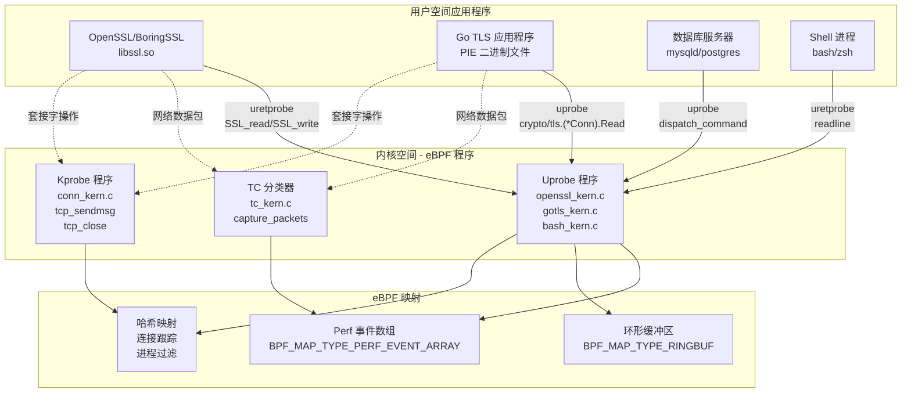
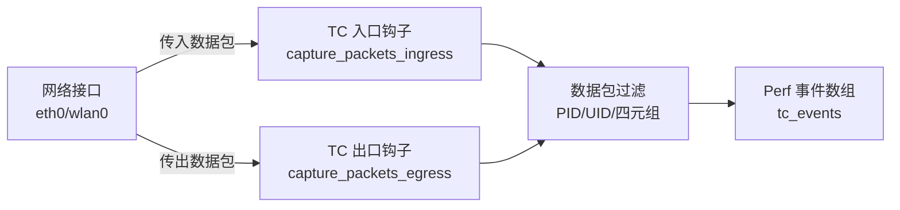
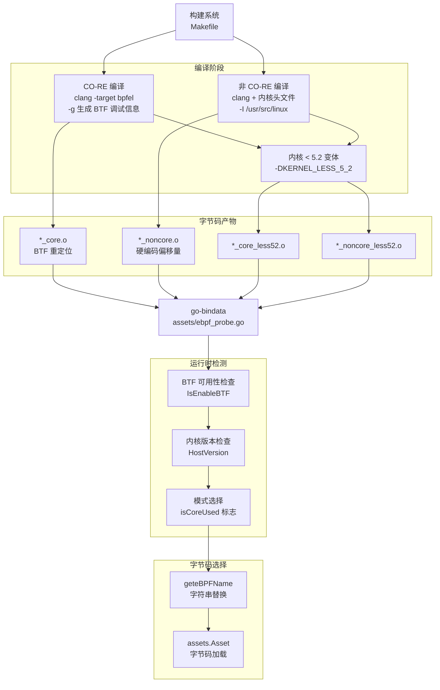
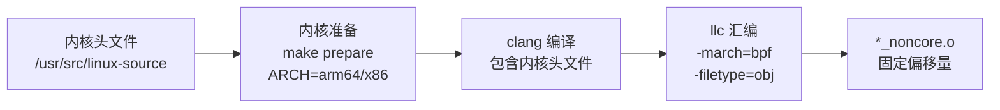
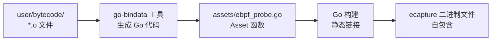
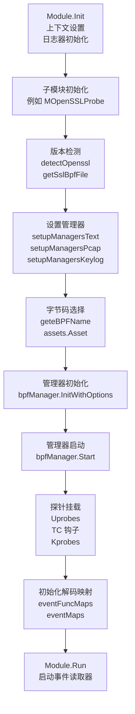
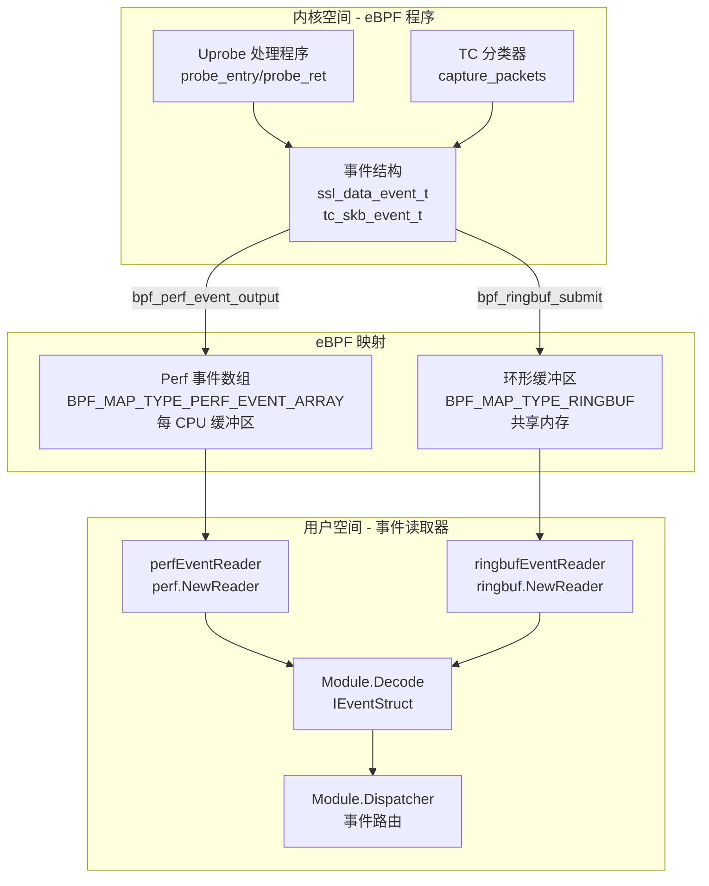
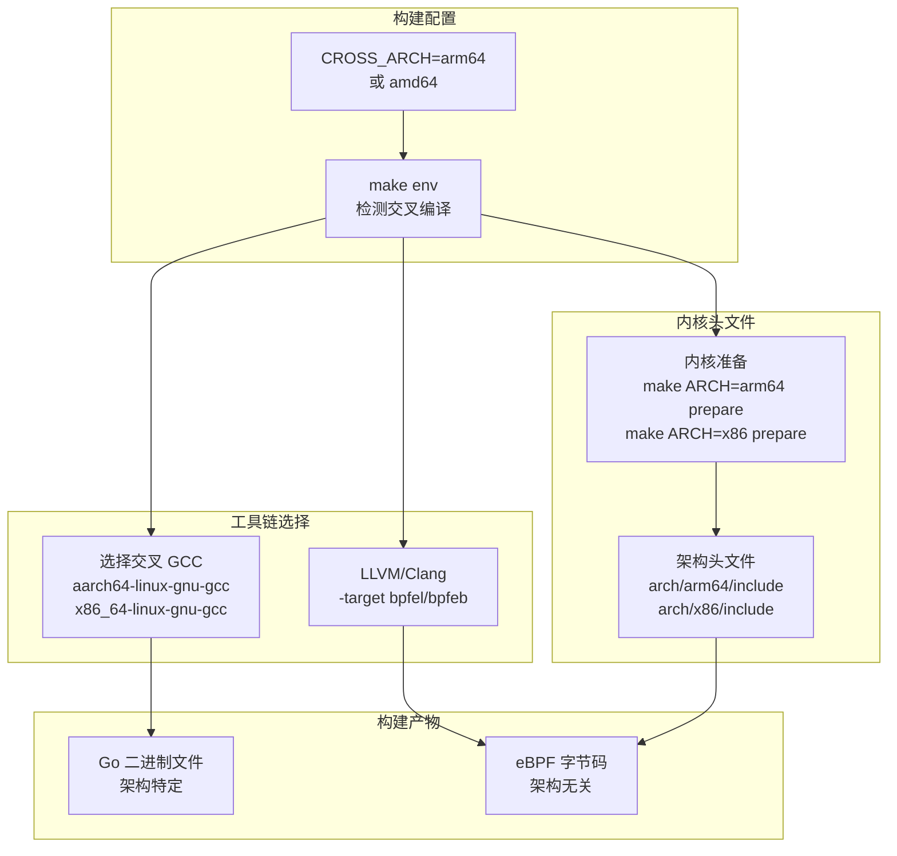

# eBPF 引擎

eBPF 引擎是 eCapture 的基础运行时层，负责管理 eBPF 程序的生命周期，通过 CO-RE/非 CO-RE 模式处理内核兼容性，并促进内核空间与用户空间之间的通信。本文档涵盖 eBPF 程序加载、BTF 检测、字节码选择和事件映射管理的技术实现。

关于各个捕获模块如何使用 eBPF 引擎的信息，请参阅[模块系统与生命周期](2.4-module-system-and-lifecycle.md)。有关版本检测和字节码映射策略的详细信息，请参阅[版本检测与字节码选择](2.5-version-detection-and-bytecode-selection.md)。关于 eBPF 映射将数据传递到用户空间后的事件处理，请参阅[事件处理流程](2.2-event-processing-pipeline.md)。

## eBPF 程序类型与挂载

eCapture 采用三种主要的 eBPF 程序类型来捕获系统行为的不同方面：

**程序类型架构**



来源: [Makefile:118-183](https://github.com/gojue/ecapture/blob/0766a93b/Makefile#L118-L183), [user/module/probe_openssl.go:83-106](https://github.com/gojue/ecapture/blob/0766a93b/user/module/probe_openssl.go#L83-L106)

### Uprobe 程序

Uprobe 挂载到动态链接库和可执行文件中的用户空间函数。主要用例包括：

| 函数钩子 | 目的 | eBPF 程序 |
|--------------|---------|--------------|
| `SSL_read` / `SSL_write` | 捕获 TLS 明文 | `openssl_kern.c` |
| `SSL_do_handshake` | 提取主密钥 | `openssl_kern.c` |
| `crypto/tls.(*Conn).Read` | Go TLS 捕获 | `gotls_kern.c` |
| `dispatch_command` | MySQL 查询审计 | `mysqld_kern.c` |
| `readline` | Bash 命令审计 | `bash_kern.c` |

模块通过 `github.com/gojue/ebpfmanager` 管理 uprobe 挂载，该库处理探针生命周期、错误恢复和清理。

来源: [user/module/probe_openssl.go:280-350](https://github.com/gojue/ecapture/blob/0766a93b/user/module/probe_openssl.go#L280-L350)

### TC（流量控制）分类器

TC eBPF 程序挂载到流量控制层的网络接口上，支持具有进程归属的数据包级捕获：



当指定 cgroup 路径时，TC 程序实现 BPF cgroup 套接字过滤，并可应用 Berkeley 数据包过滤器表达式进行高级过滤。

来源: [user/module/probe_openssl.go:302-307](https://github.com/gojue/ecapture/blob/0766a93b/user/module/probe_openssl.go#L302-L307)

### Kprobe 程序

Kprobe 挂载到内核函数，用于连接跟踪和套接字生命周期监控：

- `tcp_sendmsg`：将 TCP 连接关联到进程 ID
- `tcp_close`：检测连接终止
- `udp_sendmsg`：UDP 连接跟踪

连接映射使 TC 程序能够将数据包归属到特定进程，这对于 PCAP 输出模式至关重要。

来源: 架构图，内核跟踪的常见模式

## CO-RE 与 BTF 模式

eCapture 实现了双重编译策略以最大化内核兼容性：CO-RE（编译一次 - 到处运行）用于具有 BTF 支持的现代内核，传统的非 CO-RE 用于较旧或自定义内核。

**编译与运行时模式选择**



来源: [Makefile:118-183](https://github.com/gojue/ecapture/blob/0766a93b/Makefile#L118-L183), [user/module/imodule.go:173-214](https://github.com/gojue/ecapture/blob/0766a93b/user/module/imodule.go#L173-L214)

### BTF（BPF 类型格式）

BTF 是一种元数据格式，描述内核数据结构的布局，使 eBPF 程序能够跨内核版本移植。eCapture 的 BTF 检测逻辑：

**BTF 检测流程**

| 步骤 | 函数 | 位置 |
|------|----------|----------|
| 1. 容器检测 | `ebpfenv.IsContainer()` | [user/module/imodule.go:175-179](https://github.com/gojue/ecapture/blob/0766a93b/user/module/imodule.go#L175-L179) |
| 2. BTF 可用性检查 | `ebpfenv.IsEnableBTF()` | [user/module/imodule.go:180-186](https://github.com/gojue/ecapture/blob/0766a93b/user/module/imodule.go#L180-L186) |
| 3. 模式覆盖 | `conf.GetBTF()` | [user/module/imodule.go:154-164](https://github.com/gojue/ecapture/blob/0766a93b/user/module/imodule.go#L154-L164) |

BTF 模式在配置系统中定义：

```
BTFModeAutoDetect = 0  // 自动检测（默认）
BTFModeCore       = 1  // 强制 CO-RE 模式
BTFModeNonCore    = 2  // 强制非 CO-RE 模式
```

来源: [user/config/iconfig.go:82-86](https://github.com/gojue/ecapture/blob/0766a93b/user/config/iconfig.go#L82-L86), [user/module/imodule.go:154-190](https://github.com/gojue/ecapture/blob/0766a93b/user/module/imodule.go#L154-L190)

### CO-RE 编译

CO-RE 字节码编译使用 LLVM 的 BTF 生成和重定位功能：

**编译标志**

```
clang -D__TARGET_ARCH_x86 \
      -target bpfel \           # 小端 BPF 目标
      -fno-ident \              # 省略编译器标识
      -fdebug-compilation-dir . \
      -g \                       # 生成调试信息（BTF）
      -D__BPF_TARGET_MISSING="..." \
      -MD -MP                    # 依赖项生成
```

生成的 `*_core.o` 文件包含 BTF 信息，内核的 BTF 加载器使用这些信息在加载时执行字段偏移重定位。

来源: [Makefile:122-134](https://github.com/gojue/ecapture/blob/0766a93b/Makefile#L122-L134), [.github/workflows/go-c-cpp.yml:42](https://github.com/gojue/ecapture/blob/0766a93b/.github/workflows/go-c-cpp.yml#L42)

### 非 CO-RE 编译

非 CO-RE 模式在编译时需要内核头文件来确定精确的结构体偏移量：

**非 CO-RE 构建流程**



Makefile 显式包含架构特定的头文件路径：

```
-I $(KERN_SRC_PATH)/arch/$(LINUX_ARCH)/include
-I $(KERN_BUILD_PATH)/arch/$(LINUX_ARCH)/include/generated
-I $(KERN_SRC_PATH)/include
```

来源: [Makefile:146-183](https://github.com/gojue/ecapture/blob/0766a93b/Makefile#L146-L183), [.github/workflows/go-c-cpp.yml:16-33](https://github.com/gojue/ecapture/blob/0766a93b/.github/workflows/go-c-cpp.yml#L16-L33)

### 内核 < 5.2 支持

5.2.0 之前的内核缺少某些 eBPF 功能（全局变量、有界循环）。eCapture 生成带有定义 `KERNEL_LESS_5_2` 宏的单独字节码变体：

```c
#ifdef KERNEL_LESS_5_2
    // 使用不带全局变量的替代实现
#else
    // 现代内核实现
#endif
```

运行时检测内核版本并选择适当的后缀：

来源: [Makefile:131-134](https://github.com/gojue/ecapture/blob/0766a93b/Makefile#L131-L134), [user/module/imodule.go:140-149](https://github.com/gojue/ecapture/blob/0766a93b/user/module/imodule.go#L140-L149), [user/module/imodule.go:208-211](https://github.com/gojue/ecapture/blob/0766a93b/user/module/imodule.go#L208-L211)

## 字节码资源嵌入

所有编译的 eBPF 字节码使用 `go-bindata` 嵌入到 Go 二进制文件中，消除运行时依赖：

**资源嵌入流程**



通过以下方式访问嵌入的资源：

```go
byteBuf, err := assets.Asset("user/bytecode/openssl_3_2_0_kern_core.o")
```

这种方法确保二进制文件可以在任何兼容系统上运行，无需外部字节码文件。

来源: [Makefile:186-195](https://github.com/gojue/ecapture/blob/0766a93b/Makefile#L186-L195), [user/module/probe_openssl.go:310-317](https://github.com/gojue/ecapture/blob/0766a93b/user/module/probe_openssl.go#L310-L317)

## eBPF 程序生命周期

eBPF 程序生命周期通过 `ebpfmanager` 库管理，该库提供了一种结构化方法来加载、挂载和管理多个 eBPF 程序和映射。

**模块初始化与启动流程**



来源: [user/module/imodule.go:110-171](https://github.com/gojue/ecapture/blob/0766a93b/user/module/imodule.go#L110-L171), [user/module/probe_openssl.go:109-176](https://github.com/gojue/ecapture/blob/0766a93b/user/module/probe_openssl.go#L109-L176), [user/module/probe_openssl.go:280-350](https://github.com/gojue/ecapture/blob/0766a93b/user/module/probe_openssl.go#L280-L350)

### 管理器初始化

`ebpfmanager.Manager` 结构集中管理 eBPF 程序和映射：

**管理器配置**

```go
type MOpenSSLProbe struct {
    bpfManager        *manager.Manager
    bpfManagerOptions manager.Options
    eventFuncMaps     map[*ebpf.Map]event.IEventStruct
    eventMaps         []*ebpf.Map
}
```

管理器选项包括：

- **ConstantEditors**：将用户空间值传递给 eBPF（PID/UID 过滤器）
- **Probes**：定义 uprobe/kprobe 挂载点
- **Maps**：指定 eBPF 映射配置
- **ActivatedProbes**：控制启用哪些探针

来源: [user/module/probe_openssl.go:83-106](https://github.com/gojue/ecapture/blob/0766a93b/user/module/probe_openssl.go#L83-L106), [user/module/probe_openssl.go:361-387](https://github.com/gojue/ecapture/blob/0766a93b/user/module/probe_openssl.go#L361-L387)

### 常量编辑器

常量编辑器允许将配置值从用户空间传递到 eBPF 程序：

```go
func (m *MOpenSSLProbe) constantEditor() []manager.ConstantEditor {
    return []manager.ConstantEditor{
        {
            Name:  "target_pid",
            Value: uint64(m.conf.GetPid()),
        },
        {
            Name:  "target_uid",
            Value: uint64(m.conf.GetUid()),
        },
    }
}
```

eBPF 程序检查这些常量进行过滤：

```c
const volatile u64 target_pid = 0;
const volatile u64 target_uid = 0;

// 在探针函数中：
if (target_pid != 0 && current_pid != target_pid) {
    return 0;  // 过滤掉
}
```

来源: [user/module/probe_openssl.go:361-387](https://github.com/gojue/ecapture/blob/0766a93b/user/module/probe_openssl.go#L361-L387)

### 字节码加载

字节码选择算法考虑多个因素：

```go
func (m *Module) geteBPFName(filename string) string {
    var newFilename = filename
    
    // 选择 CO-RE vs 非 CO-RE
    switch m.conf.GetByteCodeFileMode() {
    case config.ByteCodeFileCore:
        newFilename = strings.Replace(newFilename, ".o", "_core.o", 1)
    case config.ByteCodeFileNonCore:
        newFilename = strings.Replace(newFilename, ".o", "_noncore.o", 1)
    default:
        if m.isCoreUsed {
            newFilename = strings.Replace(newFilename, ".o", "_core.o", 1)
        } else {
            newFilename = strings.Replace(newFilename, ".o", "_noncore.o", 1)
        }
    }
    
    // 内核版本后缀
    if m.isKernelLess5_2 {
        newFilename = strings.Replace(newFilename, ".o", "_less52.o", 1)
    }
    
    return newFilename
}
```

这会生成如下文件名：
- `openssl_3_2_0_kern_core.o`（CO-RE，内核 >= 5.2）
- `openssl_3_2_0_kern_noncore.o`（非 CO-RE，内核 >= 5.2）
- `openssl_3_2_0_kern_core_less52.o`（CO-RE，内核 < 5.2）
- `openssl_3_2_0_kern_noncore_less52.o`（非 CO-RE，内核 < 5.2）

来源: [user/module/imodule.go:191-214](https://github.com/gojue/ecapture/blob/0766a93b/user/module/imodule.go#L191-L214), [user/module/probe_openssl.go:311-312](https://github.com/gojue/ecapture/blob/0766a93b/user/module/probe_openssl.go#L311-L312)

### 管理器启动

`bpfManager.Start()` 调用执行：

1. 使用 `bpf()` 系统调用将 eBPF 程序加载到内核
2. 针对内核的 eBPF 验证器验证程序字节码
3. 将探针挂载到目标函数/跟踪点
4. 创建和配置 eBPF 映射
5. 如果指定，启用基于 cgroup 的过滤

如果验证失败，错误包含用于调试的验证器日志。

来源: [user/module/probe_openssl.go:328-331](https://github.com/gojue/ecapture/blob/0766a93b/user/module/probe_openssl.go#L328-L331)

## eBPF 映射通信

eBPF 映射是内核到用户空间数据传输的主要机制。eCapture 使用两种映射类型来处理事件：

**事件映射架构**



来源: [user/module/imodule.go:285-306](https://github.com/gojue/ecapture/blob/0766a93b/user/module/imodule.go#L285-L306), [user/module/imodule.go:308-391](https://github.com/gojue/ecapture/blob/0766a93b/user/module/imodule.go#L308-L391)

### Perf 事件数组

Perf 事件数组为高吞吐量事件传递提供每 CPU 环形缓冲区：

**Perf 事件读取器配置**

| 参数 | 配置 | 位置 |
|-----------|---------------|----------|
| 映射大小 | `conf.GetPerCpuMapSize()` | [user/module/imodule.go:309](https://github.com/gojue/ecapture/blob/0766a93b/user/module/imodule.go#L309) |
| 默认大小 | 每 CPU 1024 * PAGE_SIZE | [cli/cmd/root.go:143](https://github.com/gojue/ecapture/blob/0766a93b/cli/cmd/root.go#L143) |
| 读取器类型 | `perf.NewReader(em, size)` | [user/module/imodule.go:310](https://github.com/gojue/ecapture/blob/0766a93b/user/module/imodule.go#L310) |

读取器循环：

```go
func (m *Module) perfEventReader(errChan chan error, em *ebpf.Map) {
    rd, err := perf.NewReader(em, m.conf.GetPerCpuMapSize())
    // ...
    go func() {
        for {
            select {
            case <-m.ctx.Done():
                return
            default:
            }
            
            record, err := rd.Read()
            if record.LostSamples != 0 {
                m.logger.Warn().Uint64("lostSamples", record.LostSamples)
                continue
            }
            
            evt, err := m.child.Decode(em, record.RawSample)
            m.Dispatcher(evt)
        }
    }()
}
```

来源: [user/module/imodule.go:308-351](https://github.com/gojue/ecapture/blob/0766a93b/user/module/imodule.go#L308-L351)

### 环形缓冲区

环形缓冲区（内核 >= 5.8）提供具有更好内存效率的共享内存区域：

```go
func (m *Module) ringbufEventReader(errChan chan error, em *ebpf.Map) {
    rd, err := ringbuf.NewReader(em)
    // ...
    go func() {
        for {
            select {
            case <-m.ctx.Done():
                return
            default:
            }
            
            record, err := rd.Read()
            e, err := m.child.Decode(em, record.RawSample)
            m.Dispatcher(e)
        }
    }()
}
```

环形缓冲区的优势：
- 更好的内存效率（单个共享缓冲区 vs 每 CPU）
- 可变大小事件的开销更低
- 保证单个缓冲区内的顺序

来源: [user/module/imodule.go:353-391](https://github.com/gojue/ecapture/blob/0766a93b/user/module/imodule.go#L353-L391)

### 事件解码

每个模块为其映射注册解码函数：

```go
type MOpenSSLProbe struct {
    eventFuncMaps map[*ebpf.Map]event.IEventStruct
    eventMaps     []*ebpf.Map
}

func (m *MOpenSSLProbe) DecodeFun(p *ebpf.Map) (event.IEventStruct, bool) {
    fun, found := m.eventFuncMaps[em]
    return fun, found
}
```

解码过程：
1. 通过映射指针查找解码器
2. 克隆事件结构模板
3. 调用 `Decode([]byte)` 解组二进制数据
4. 返回类型化的事件结构

来源: [user/module/probe_openssl.go:389-396](https://github.com/gojue/ecapture/blob/0766a93b/user/module/probe_openssl.go#L389-L396), [user/module/imodule.go:393-406](https://github.com/gojue/ecapture/blob/0766a93b/user/module/imodule.go#L393-L406)

### 用于状态的哈希映射

哈希映射存储 eBPF 程序查询或更新的状态：

**常见哈希映射用途**

| 映射用途 | 键 | 值 | 使用 |
|-------------|-----|-------|-------|
| 连接跟踪 | `(pid, fd)` | `(tuple, sock)` | 将 FD 映射到四元组 |
| 套接字查找 | `sock` | `(pid, fd)` | 反向映射 |
| PID 过滤 | `pid` | `1` | 进程白名单 |
| 主密钥去重 | `client_random` | `1` | 防止重复 |

OpenSSL 模块的示例：

```go
// 与 eBPF 映射同步的用户空间状态
type MOpenSSLProbe struct {
    pidConns   map[uint32]map[uint32]ConnInfo  // pid -> (fd -> ConnInfo)
    sock2pidFd map[uint64][2]uint32            // sock -> (pid, fd)
}
```

来源: [user/module/probe_openssl.go:90-94](https://github.com/gojue/ecapture/blob/0766a93b/user/module/probe_openssl.go#L90-L94), [user/module/probe_openssl.go:398-480](https://github.com/gojue/ecapture/blob/0766a93b/user/module/probe_openssl.go#L398-L480)

## 内核兼容性策略

eCapture 的兼容性矩阵跨越多个维度：

**兼容性矩阵**

| 维度 | 选项 | 检测方法 |
|-----------|---------|------------------|
| 内核版本 | < 5.2, >= 5.2 | `kernel.HostVersion()` |
| BTF 支持 | 启用、禁用 | `ebpfenv.IsEnableBTF()` |
| 架构 | x86_64, aarch64 | 构建时 `GOARCH` |
| SSL 库 | OpenSSL 1.0.x-3.5.x, BoringSSL | ELF 解析 |

### 内核版本检测

```go
kv, err := kernel.HostVersion()
if kv < kernel.VersionCode(5, 2, 0) {
    m.isKernelLess5_2 = true
    m.logger.Warn().Str("kernel", kv.String()).
        Msg("Kernel version is less than 5.2, Process filtering parameters do not take effect")
}
```

内核 < 5.2 限制：
- eBPF 中没有全局变量（必须使用映射）
- 没有有界循环（必须展开）
- 辅助函数有限
- PID/UID 过滤效果较差

来源: [user/module/imodule.go:140-149](https://github.com/gojue/ecapture/blob/0766a93b/user/module/imodule.go#L140-L149)

### 构建时架构处理

构建系统生成架构特定的字节码：

```makefile
TARGET_ARCH = $(if $(filter $(CROSS_ARCH),arm64),arm64,x86_64)
LINUX_ARCH  = $(if $(filter $(CROSS_ARCH),arm64),arm64,x86)
GOARCH      = $(if $(filter $(CROSS_ARCH),arm64),arm64,amd64)
```

架构特定注意事项：
- 不同的指令集（x86 vs ARM）
- 不同的结构体填充和对齐
- 架构特定的内核头文件

来源: [variables.mk（在 Makefile 中引用）](), [.github/workflows/go-c-cpp.yml:31](https://github.com/gojue/ecapture/blob/0766a93b/.github/workflows/go-c-cpp.yml#L31), [.github/workflows/release.yml:45](https://github.com/gojue/ecapture/blob/0766a93b/.github/workflows/release.yml#L45)

### 容器与 BTF 检测

容器化环境的特殊处理：

```go
isContainer, err := ebpfenv.IsContainer()
if isContainer {
    m.logger.Warn().Msg("Your environment is like a container. " +
        "We won't be able to detect the BTF configuration.")
}
```

容器可能没有：
- `/sys/kernel/btf/vmlinux` 文件
- 访问宿主机内核头文件
- 正确的 `/proc/kallsyms` 访问权限

`-b` 标志允许手动指定 BTF 模式以覆盖检测。

来源: [user/module/imodule.go:174-189](https://github.com/gojue/ecapture/blob/0766a93b/user/module/imodule.go#L174-L189), [cli/cmd/root.go:141](https://github.com/gojue/ecapture/blob/0766a93b/cli/cmd/root.go#L141)

## 交叉编译支持

构建系统支持双向交叉编译（x86_64 ↔ aarch64）：

**交叉编译架构**



来源: [.github/workflows/go-c-cpp.yml:56-65](https://github.com/gojue/ecapture/blob/0766a93b/.github/workflows/go-c-cpp.yml#L56-L65), [.github/workflows/release.yml:93-97](https://github.com/gojue/ecapture/blob/0766a93b/.github/workflows/release.yml#L93-L97), [Makefile:92-93](https://github.com/gojue/ecapture/blob/0766a93b/Makefile#L92-L93)

### 交叉编译工作流程

在 x86_64 上为 ARM64 构建：

```bash
# 准备 ARM64 内核头文件
cd /usr/src/linux-source-X.Y.Z
make ARCH=arm64 CROSS_COMPILE=aarch64-linux-gnu- prepare

# 构建 eCapture
CROSS_ARCH=arm64 make env
CROSS_ARCH=arm64 make
```

构建系统：
1. 检测 `CROSS_ARCH` 环境变量
2. 选择适当的交叉编译器和 libc
3. 为目标架构配置 libpcap
4. 编译 eBPF 程序（架构中立）
5. 链接 Go 二进制文件与交叉编译的 libpcap

来源: [.github/workflows/go-c-cpp.yml:16-33](https://github.com/gojue/ecapture/blob/0766a93b/.github/workflows/go-c-cpp.yml#L16-L33), [Makefile:98-104](https://github.com/gojue/ecapture/blob/0766a93b/Makefile#L98-L104), [builder/init_env.sh:43-61](https://github.com/gojue/ecapture/blob/0766a93b/builder/init_env.sh#L43-L61)

### Android 支持

Android 构建使用 BoringSSL 特定的字节码，并需要非 CO-RE 模式：

```bash
ANDROID=1 CROSS_ARCH=arm64 make nocore
```

Android 特定注意事项：
- BoringSSL 而非 OpenSSL
- 没有 BTF 支持（SELinux 限制）
- 内核头文件有限
- 版本特定的 BoringSSL 偏移量（A12-A16）

来源: [.github/workflows/go-c-cpp.yml:61-65](https://github.com/gojue/ecapture/blob/0766a93b/.github/workflows/go-c-cpp.yml#L61-L65), [user/module/probe_openssl.go:247-262](https://github.com/gojue/ecapture/blob/0766a93b/user/module/probe_openssl.go#L247-L262)

## 错误处理与验证

eBPF 程序在加载前经过严格验证。常见失败模式：

**验证错误**

| 错误类型 | 原因 | 解决方案 |
|------------|-------|------------|
| 无效内存访问 | 越界读/写 | 修复边界检查 |
| 无界循环 | 没有保证终止的循环 | 展开或限制迭代 |
| 无效辅助函数调用 | 上下文中不允许的辅助函数 | 使用替代辅助函数 |
| 寄存器溢出/填充 | 变量太多 | 减少局部变量 |
| BTF 不匹配 | 结构体布局改变 | 更新 BTF 信息或偏移量 |

模块记录详细的验证器错误：

```go
if err = m.bpfManager.InitWithOptions(bytes.NewReader(byteBuf), m.bpfManagerOptions); err != nil {
    var ve *ebpf.VerifierError
    if errors.As(err, &ve) {
        m.logger.Error().Err(ve).Msg("couldn't verify bpf prog")
    }
    return fmt.Errorf("couldn't init manager %w", err)
}
```

来源: [user/module/probe_openssl.go:320-326](https://github.com/gojue/ecapture/blob/0766a93b/user/module/probe_openssl.go#L320-L326)

## 总结

eBPF 引擎通过以下方式为 eCapture 的捕获能力提供强大的基础：

1. **多模式编译**：CO-RE 和非 CO-RE 字节码以实现广泛的内核兼容性
2. **自动检测**：BTF 可用性、内核版本和架构检测
3. **灵活挂载**：Uprobe、TC 和 kprobe 程序类型用于多样化的监控需求
4. **高效通信**：Perf 事件数组和环形缓冲区用于高吞吐量数据传输
5. **跨平台支持**：x86_64、aarch64、Linux 和 Android 构建

引擎通过 `IModule` 接口从更高级别的模块中抽象出 eBPF 的复杂性，使开发人员能够专注于捕获逻辑而非底层 eBPF 细节。

来源: [user/module/imodule.go:47-75](https://github.com/gojue/ecapture/blob/0766a93b/user/module/imodule.go#L47-L75), [user/module/probe_openssl.go:83-106](https://github.com/gojue/ecapture/blob/0766a93b/user/module/probe_openssl.go#L83-L106), [Makefile:1-269](https://github.com/gojue/ecapture/blob/0766a93b/Makefile#L1-L269), [user/config/iconfig.go:24-70](https://github.com/gojue/ecapture/blob/0766a93b/user/config/iconfig.go#L24-L70)