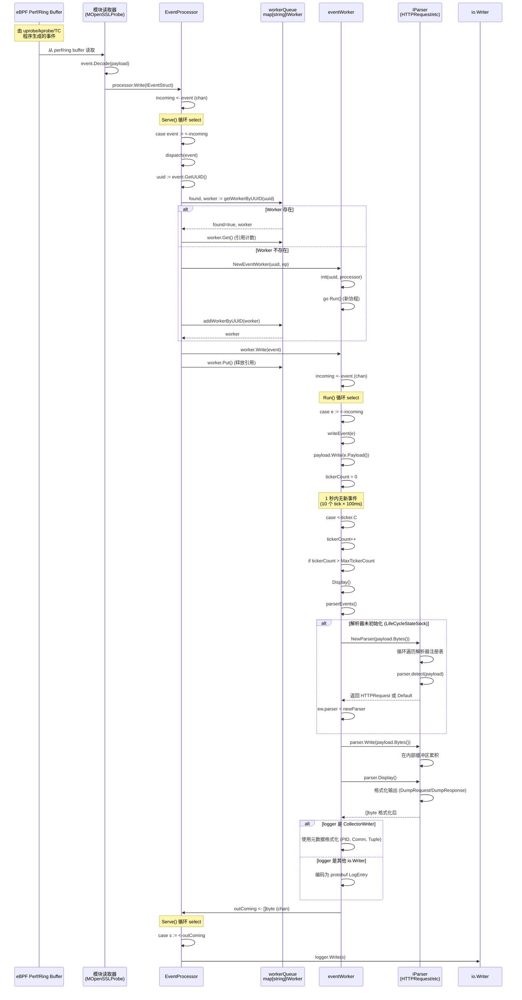
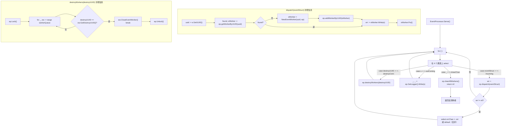
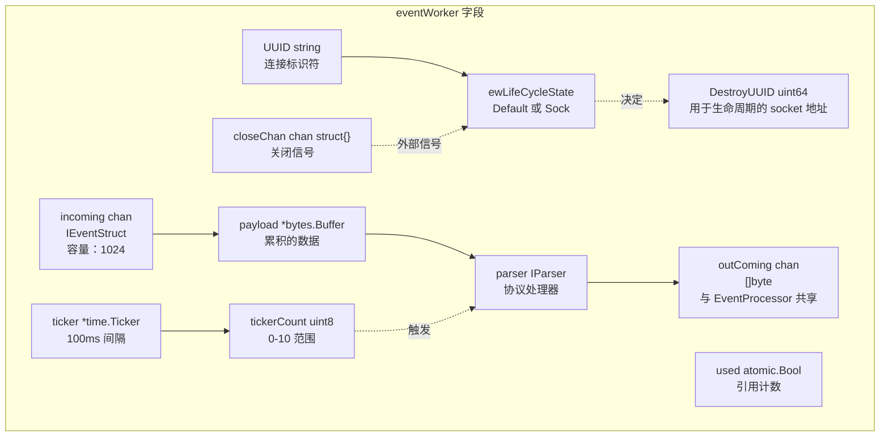
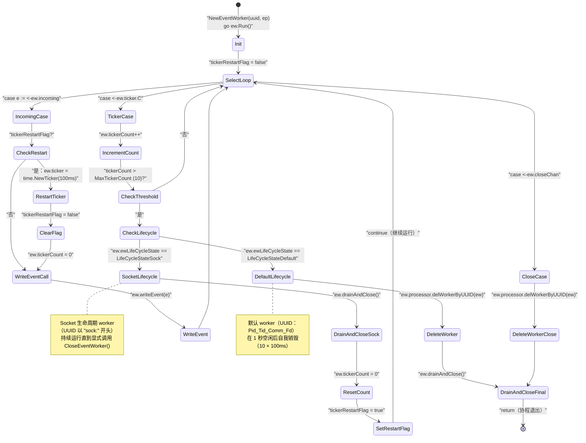
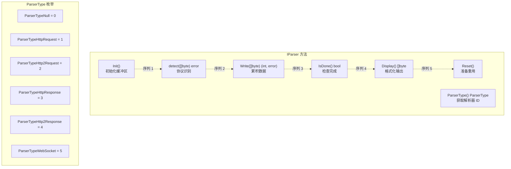
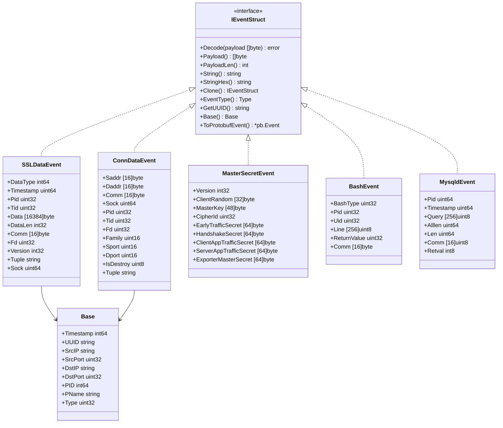
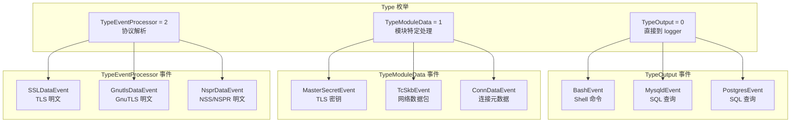
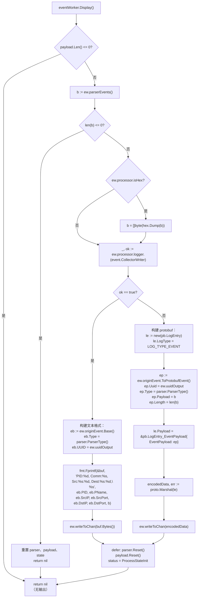
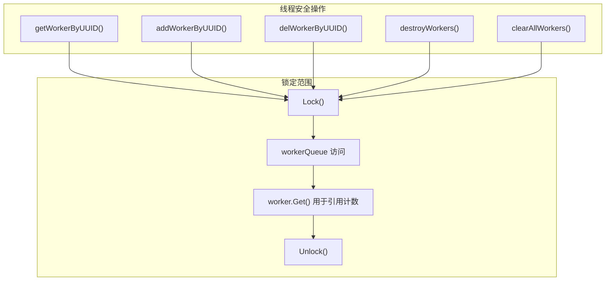

# 事件处理流程

## 目的与范围

事件处理流程将来自内核空间的原始 eBPF 事件转换为格式化的、协议感知的输出。该流程位于 eBPF 数据收集层（参见 [2.1 eBPF 引擎](2.1-ebpf-engine.md)）和输出系统（参见 [4 输出格式](../4-output-formats/index.md)）之间，负责：

- **事件路由**：通过 `EventProcessor.dispatch()` 将事件分发到每个连接的 worker
- **有效负载聚合**：在 `eventWorker` 实例中累积数据块
- **协议检测**：通过 `IParser` 接口识别 HTTP/1.1、HTTP/2 或原始数据
- **生命周期管理**：支持基于超时和基于 socket 生命周期的 worker 清理
- **输出格式化**：将二进制有效负载转换为文本、十六进制或 Protobuf 格式

事件流经路径：eBPF maps → 模块解码器 → `EventProcessor` → `eventWorker` 实例 → `IParser` 实现 → 输出写入器。

---

## 架构概览

事件处理流程由三个主要层次组成：事件接收、基于 worker 的聚合和协议感知解析。

**事件处理流程架构**

```mermaid
graph TB
    subgraph "eBPF Maps（内核空间）"
        PerfArray["Perf Event Arrays<br/>或 Ring Buffers"]
    end
    
    subgraph "模块层（用户空间）"
        ModuleDecode["Module.Decode()<br/>SSLDataEvent.Decode()<br/>ConnDataEvent.Decode()"]
        ModuleWrite["模块调用<br/>processor.Write(IEventStruct)"]
    end
    
    subgraph "EventProcessor"
        Incoming["incoming chan event.IEventStruct<br/>容量：1024"]
        Serve["Serve() 循环<br/>在 4 个通道上 select"]
        Dispatch["dispatch(e event.IEventStruct)<br/>UUID 路由"]
        WorkerQueue["workerQueue map[string]IWorker<br/>UUID → worker 映射"]
        OutComing["outComing chan []byte<br/>容量：1024"]
        DestroyConn["destroyConn chan uint64<br/>socket 销毁信号"]
    end
    
    subgraph "eventWorker 协程"
        Worker1["eventWorker #1<br/>UUID: 1234_1234_curl_3_0"]
        Worker2["eventWorker #2<br/>UUID: sock:5678_5678_nginx_5_0_..._140234567890"]
        WorkerIncoming["incoming chan event.IEventStruct<br/>容量：1024"]
        PayloadBuf["payload *bytes.Buffer<br/>累积的数据"]
        Ticker["ticker *time.Ticker<br/>100ms，tickerCount 0-10"]
        WorkerRun["Run() 循环<br/>3 个 select case"]
    end
    
    subgraph "解析器注册表"
        NewParser["NewParser(payload []byte)<br/>协议检测"]
        HTTPRequest["HTTPRequest<br/>http.ReadRequest()"]
        HTTPResponse["HTTPResponse<br/>http.ReadResponse()"]
        HTTP2Request["HTTP2Request<br/>HPACK 解码"]
        HTTP2Response["HTTP2Response<br/>HPACK 解码"]
        DefaultParser["DefaultParser<br/>hex.Dump() 回退"]
    end
    
    subgraph "输出写入器"
        Logger["io.Writer logger<br/>文件或 stdout"]
        CollectorWriter["CollectorWriter<br/>zerolog.Logger"]
    end
    
    PerfArray -->|"读取事件"| ModuleDecode
    ModuleDecode --> ModuleWrite
    ModuleWrite --> Incoming
    
    Incoming --> Serve
    Serve --> Dispatch
    Dispatch -->|"getWorkerByUUID()<br/>或 NewEventWorker()"| WorkerQueue
    
    WorkerQueue --> Worker1
    WorkerQueue --> Worker2
    
    Worker1 --> WorkerIncoming
    WorkerIncoming --> PayloadBuf
    Ticker -."|MaxTickerCount<br/>触发 Display()"| PayloadBuf
    
    PayloadBuf --> NewParser
    NewParser -->|"detect() 成功"| HTTPRequest
    NewParser -->|"detect() 成功"| HTTPResponse
    NewParser -->|"detect() 成功"| HTTP2Request
    NewParser -->|"detect() 成功"| HTTP2Response
    NewParser -->|"无匹配"| DefaultParser
    
    HTTPRequest --> OutComing
    HTTPResponse --> OutComing
    HTTP2Request --> OutComing
    HTTP2Response --> OutComing
    DefaultParser --> OutComing
    
    OutComing --> Serve
    Serve --> Logger
    Logger -."|类型断言"| CollectorWriter
    
    DestroyConn --> Serve
    Serve -."|destroyWorkers()"| WorkerQueue
```

**来源：** [pkg/event_processor/processor.go:30-63](https://github.com/gojue/ecapture/blob/0766a93b/pkg/event_processor/processor.go#L30-L63), [pkg/event_processor/processor.go:66-89](https://github.com/gojue/ecapture/blob/0766a93b/pkg/event_processor/processor.go#L66-L89), [pkg/event_processor/iworker.go:70-89](https://github.com/gojue/ecapture/blob/0766a93b/pkg/event_processor/iworker.go#L70-L89), [pkg/event_processor/iworker.go:262-306](https://github.com/gojue/ecapture/blob/0766a93b/pkg/event_processor/iworker.go#L262-L306), [pkg/event_processor/iparser.go:85-115](https://github.com/gojue/ecapture/blob/0766a93b/pkg/event_processor/iparser.go#L85-L115)

---

## 事件流

事件通过不同的阶段遍历流程：摄入、路由、聚合、解析和输出。

**事件在流程中的流动**



**来源：** [pkg/event_processor/processor.go:65-109](https://github.com/gojue/ecapture/blob/0766a93b/pkg/event_processor/processor.go#L65-L109), [pkg/event_processor/iworker.go:91-136](https://github.com/gojue/ecapture/blob/0766a93b/pkg/event_processor/iworker.go#L91-L136), [pkg/event_processor/iworker.go:154-162](https://github.com/gojue/ecapture/blob/0766a93b/pkg/event_processor/iworker.go#L154-L162), [pkg/event_processor/iworker.go:262-306](https://github.com/gojue/ecapture/blob/0766a93b/pkg/event_processor/iworker.go#L262-L306), [pkg/event_processor/iworker.go:175-228](https://github.com/gojue/ecapture/blob/0766a93b/pkg/event_processor/iworker.go#L175-L228), [pkg/event_processor/iparser.go:85-115](https://github.com/gojue/ecapture/blob/0766a93b/pkg/event_processor/iparser.go#L85-L115)

---

## EventProcessor：中央调度器

`EventProcessor` 管理全局事件路由系统并维护所有活动 worker 的生命周期。

### 结构和通道

| 字段 | 类型 | 目的 |
|-------|------|---------|
| `incoming` | `chan event.IEventStruct` | 接收来自模块的事件（容量：1024） |
| `outComing` | `chan []byte` | 将格式化的输出发送到 logger（容量：1024） |
| `destroyConn` | `chan uint64` | 通过 socket 地址信号连接销毁 |
| `workerQueue` | `map[string]IWorker` | 将 UUID 映射到活动 worker（容量：1024） |
| `closeChan` | `chan bool` | 向 `Serve()` 循环发送关闭信号 |
| `errChan` | `chan error` | 报告调度错误（容量：16） |
| `logger` | `io.Writer` | 输出目标（控制台或文件） |

**来源：** [pkg/event_processor/processor.go:30-50](https://github.com/gojue/ecapture/blob/0766a93b/pkg/event_processor/processor.go#L30-L50)

### 核心方法

**`Serve()` 方法 - 主事件循环**

`Serve()` 方法持续运行，使用 `select` 语句处理四种通道类型：



**关键行为：**
- **非阻塞错误报告**：如果 `errChan` 已满，通过 `default` case 丢弃错误
- **socket 销毁时的 worker 清理**：`destroyWorkers()` 通过 `DestroyUUID`（socket 地址）匹配
- **优雅关闭**：`closeChan` 信号清除所有 worker 并从 `Serve()` 返回

**来源：** [pkg/event_processor/processor.go:66-89](https://github.com/gojue/ecapture/blob/0766a93b/pkg/event_processor/processor.go#L66-L89), [pkg/event_processor/processor.go:91-109](https://github.com/gojue/ecapture/blob/0766a93b/pkg/event_processor/processor.go#L91-L109), [pkg/event_processor/processor.go:115-128](https://github.com/gojue/ecapture/blob/0766a93b/pkg/event_processor/processor.go#L115-L128)

**`dispatch(e event.IEventStruct)` - 将事件路由到合适的 worker：**

1. 通过 `e.GetUUID()` 从事件中提取 UUID
2. 在 `workerQueue` 中查找现有 worker
3. 如果未找到，通过 `NewEventWorker(uuid, ep)` 创建新的 `eventWorker`
4. 调用 `worker.Write(e)` 将事件入队
5. 通过 `worker.Put()` 释放 worker 引用

**来源：** [pkg/event_processor/processor.go:91-109](https://github.com/gojue/ecapture/blob/0766a93b/pkg/event_processor/processor.go#L91-L109)

**Worker 生命周期方法：**

- `getWorkerByUUID(uuid string)` - 带引用计数的线程安全查找
- `addWorkerByUUID(worker IWorker)` - 线程安全插入
- `delWorkerByUUID(worker IWorker)` - 由 worker 调用以自我销毁
- `destroyWorkers(destroyUUID uint64)` - 通知基于 socket 的 worker 关闭

**来源：** [pkg/event_processor/processor.go:130-155](https://github.com/gojue/ecapture/blob/0766a93b/pkg/event_processor/processor.go#L130-L155)

---

## eventWorker：每连接聚合器

每个 `eventWorker` 聚合单个逻辑连接或数据流的事件，由唯一的 UUID 标识。Worker 作为独立的协程运行，具有内部状态机。

### UUID 格式和生命周期状态

Worker 基于 UUID 格式支持两种生命周期模型：

| 生命周期状态 | UUID 格式 | 示例 | 销毁触发器 |
|----------------|-------------|---------|---------------------|
| `LifeCycleStateDefault` | `{Pid}_{Tid}_{Comm}_{Fd}_{DataType}` | `1234_1234_curl_3_0` | 10 个 tick 超时（1 秒空闲） |
| `LifeCycleStateSock` | `sock:{Pid}_{Tid}_{Comm}_{Fd}_{DataType}_{Tuple}_{Sock}` | `sock:1234_1234_curl_3_0_1.2.3.4:80-5.6.7.8:443_140234567890` | 通过 `CloseEventWorker()` 的外部信号 |

**来源：** [pkg/event_processor/iworker.go:57-63](https://github.com/gojue/ecapture/blob/0766a93b/pkg/event_processor/iworker.go#L57-L63), [pkg/event_processor/iworker.go:100-123](https://github.com/gojue/ecapture/blob/0766a93b/pkg/event_processor/iworker.go#L100-L123)

### 结构和状态



**来源：** [pkg/event_processor/iworker.go:70-89](https://github.com/gojue/ecapture/blob/0766a93b/pkg/event_processor/iworker.go#L70-L89)

### Run 循环和生命周期

`Run()` 方法实现 worker 的事件循环，具有三个 select case 和依赖生命周期的超时处理：



**关键时间详情：**
- **Ticker 间隔**：每个 tick `100ms` ([pkg/event_processor/iworker.go:126](https://github.com/gojue/ecapture/blob/0766a93b/pkg/event_processor/iworker.go#L126))
- **超时阈值**：`MaxTickerCount = 10` tick = 1 秒空闲 ([pkg/event_processor/iworker.go:52](https://github.com/gojue/ecapture/blob/0766a93b/pkg/event_processor/iworker.go#L52))
- **Ticker 重启**：Socket worker 在 `drainAndClose()` 后重新创建 ticker 以避免陈旧的 ticker 通道 ([pkg/event_processor/iworker.go:293-296](https://github.com/gojue/ecapture/blob/0766a93b/pkg/event_processor/iworker.go#L293-L296))

**生命周期状态确定：**
- UUID 格式在 `uuidParse()` 中解析 ([pkg/event_processor/iworker.go:100-123](https://github.com/gojue/ecapture/blob/0766a93b/pkg/event_processor/iworker.go#L100-L123))
- 如果 UUID 以 `"sock:"` 开头并以有效的 socket 地址结尾：`LifeCycleStateSock`
- 否则：`LifeCycleStateDefault`

**来源：** [pkg/event_processor/iworker.go:262-306](https://github.com/gojue/ecapture/blob/0766a93b/pkg/event_processor/iworker.go#L262-L306), [pkg/event_processor/iworker.go:51-63](https://github.com/gojue/ecapture/blob/0766a93b/pkg/event_processor/iworker.go#L51-L63), [pkg/event_processor/iworker.go:100-123](https://github.com/gojue/ecapture/blob/0766a93b/pkg/event_processor/iworker.go#L100-L123)

### 事件聚合和显示

**`writeEvent(e event.IEventStruct)` - 累积有效负载数据：**

1. 检查状态是否为 `ProcessStateInit`（防止处理过程中的写入）
2. 如果 `truncateSize > 0` 且有效负载超过限制，应用截断
3. 存储 `originEvent` 以获取元数据
4. 将 `e.Payload()` 附加到内部 `bytes.Buffer`

**来源：** [pkg/event_processor/iworker.go:230-245](https://github.com/gojue/ecapture/blob/0766a93b/pkg/event_processor/iworker.go#L230-L245)

**`Display()` - 触发解析和输出：**

1. 检查有效负载是否有数据（`payload.Len() > 0`）
2. 调用 `parserEvents()` 处理累积的缓冲区
3. 如果 `processor.isHex` 为 true，应用十六进制转储
4. 使用元数据格式化输出（PID、Comm、Src/Dst IP:Port）
5. 作为 `[]byte` 或 `Protobuf` 写入 `outComing` 通道
6. 重置解析器、有效负载缓冲区和状态

**来源：** [pkg/event_processor/iworker.go:175-228](https://github.com/gojue/ecapture/blob/0766a93b/pkg/event_processor/iworker.go#L175-L228)

**`drainAndClose()` - 确保干净关闭：**

循环直到 `incoming` 通道为空且没有外部例程持有引用（`IfUsed() == false`）。这可以防止在销毁 worker 时另一个例程试图向其写入时发生数据丢失。

**来源：** [pkg/event_processor/iworker.go:308-337](https://github.com/gojue/ecapture/blob/0766a93b/pkg/event_processor/iworker.go#L308-L337)

---

## 协议检测和解析

解析器子系统自动从原始有效负载字节识别协议并应用适当的格式化。

### IParser 接口



**来源：** [pkg/event_processor/iparser.go:49-60](https://github.com/gojue/ecapture/blob/0766a93b/pkg/event_processor/iparser.go#L49-L60)

### 解析器注册和选择

**全局解析器注册表**

解析器在包初始化期间注册自己：

```go
// 在 pkg/event_processor/iparser.go 中
var parsers = make(map[string]IParser)

func Register(p IParser) {
    if p == nil {
        panic("Register Parser is nil")
    }
    name := p.Name()
    if _, dup := parsers[name]; dup {
        panic(fmt.Sprintf("Register called twice for Parser %s", name))
    }
    parsers[name] = p
}

// 在每个解析器文件的 init() 中
func init() {
    hr := &HTTPRequest{}
    hr.Init()
    Register(hr)
}
```

**来源：** [pkg/event_processor/iparser.go:62-73](https://github.com/gojue/ecapture/blob/0766a93b/pkg/event_processor/iparser.go#L62-L73), [pkg/event_processor/http_request.go:159-163](https://github.com/gojue/ecapture/blob/0766a93b/pkg/event_processor/http_request.go#L159-L163), [pkg/event_processor/http_response.go:177-181](https://github.com/gojue/ecapture/blob/0766a93b/pkg/event_processor/http_response.go#L177-L181)

**`NewParser(payload []byte)` - 协议检测算法**

```mermaid
flowchart TD
    Entry["NewParser(payload []byte)"]
    CheckEmpty{"len(payload) > 0?"}
    
    CheckEmpty -->|否| CreateDefault["newParser = new(DefaultParser)"]
    CreateDefault --> InitDefault["newParser.Init()"]
    InitDefault --> ReturnParser["return newParser"]
    
    CheckEmpty -->|是| GetRegistry["parsers := GetAllModules()"]
    GetRegistry --> InitVars["var newParser IParser"]
    InitVars --> LoopStart["for _, parser := range parsers"]
    
    LoopStart --> CallDetect["err := parser.detect(payload)"]
    CallDetect --> CheckError{"err == nil?"}
    
    CheckError -->|否| NextIter["continue 到下一个解析器"]
    NextIter --> LoopStart
    
    CheckError -->|是| SwitchType["switch parser.ParserType()"]
    
    SwitchType -->|"ParserTypeHttpRequest"| NewHTTPReq["newParser = new(HTTPRequest)"]
    SwitchType -->|"ParserTypeHttpResponse"| NewHTTPResp["newParser = new(HTTPResponse)"]
    SwitchType -->|"ParserTypeHttp2Request"| NewHTTP2Req["newParser = new(HTTP2Request)"]
    SwitchType -->|"ParserTypeHttp2Response"| NewHTTP2Resp["newParser = new(HTTP2Response)"]
    SwitchType -->|"default"| NewDefault["newParser = new(DefaultParser)"]
    
    NewHTTPReq --> Break["break（退出循环）"]
    NewHTTPResp --> Break
    NewHTTP2Req --> Break
    NewHTTP2Resp --> Break
    NewDefault --> Break
    
    Break --> CheckNil{"newParser == nil?"}
    NextIter -."|未找到匹配"| CheckNil
    
    CheckNil -->|是| FallbackDefault["newParser = new(DefaultParser)"]
    CheckNil -->|否| InitNew["newParser.Init()"]
    FallbackDefault --> InitNew
    
    InitNew --> ReturnParser
```

**检测顺序**：解析器按 map 迭代顺序测试（非确定性）。每个解析器的 `detect()` 方法都使用有效负载调用。第一个成功检测的获胜。

**示例检测方法：**
- `HTTPRequest.detect()`：调用 `http.ReadRequest()` ([pkg/event_processor/http_request.go:83-92](https://github.com/gojue/ecapture/blob/0766a93b/pkg/event_processor/http_request.go#L83-L92))
- `HTTPResponse.detect()`：调用 `http.ReadResponse()` ([pkg/event_processor/http_response.go:94-102](https://github.com/gojue/ecapture/blob/0766a93b/pkg/event_processor/http_response.go#L94-L102))
- `DefaultParser.detect()`：始终返回 `nil`（匹配所有内容）([pkg/event_processor/iparser.go:136-138](https://github.com/gojue/ecapture/blob/0766a93b/pkg/event_processor/iparser.go#L136-L138))

**来源：** [pkg/event_processor/iparser.go:85-115](https://github.com/gojue/ecapture/blob/0766a93b/pkg/event_processor/iparser.go#L85-L115), [pkg/event_processor/iparser.go:136-138](https://github.com/gojue/ecapture/blob/0766a93b/pkg/event_processor/iparser.go#L136-L138)

### HTTP/1.1 请求解析器

`HTTPRequest` 解析器利用 Go 的标准 `net/http` 包：

**结构：**
```go
type HTTPRequest struct {
    request    *http.Request   // 解析的 HTTP 请求
    packerType PacketType      // PacketTypeNull 或 PacketTypeGzip
    isDone     bool            // 完成标志（目前未使用）
    isInit     bool            // 第一次 Write() 调用后为 true
    reader     *bytes.Buffer   // 原始字节的累加器
    bufReader  *bufio.Reader   // reader 上的缓冲读取器
}
```

**来源：** [pkg/event_processor/http_request.go:28-35](https://github.com/gojue/ecapture/blob/0766a93b/pkg/event_processor/http_request.go#L28-L35)

**协议检测**

`detect()` 方法尝试 HTTP 解析：

```go
func (hr *HTTPRequest) detect(payload []byte) error {
    rd := bytes.NewReader(payload)
    buf := bufio.NewReader(rd)
    _, err := http.ReadRequest(buf)
    if err != nil {
        return err
    }
    return nil
}
```

成功表示有效的 HTTP/1.1 请求格式。**来源：** [pkg/event_processor/http_request.go:83-92](https://github.com/gojue/ecapture/blob/0766a93b/pkg/event_processor/http_request.go#L83-L92)

**处理生命周期**

| 阶段 | 方法 | 操作 | 关键行 |
|-------|--------|-----------|-----------|
| 初始化 | `Init()` | 创建 `bytes.Buffer` 和 `bufio.Reader` | [pkg/event_processor/http_request.go:37-40](https://github.com/gojue/ecapture/blob/0766a93b/pkg/event_processor/http_request.go#L37-L40) |
| 第一次写入 | `Write(b)` (isInit=false) | 写入缓冲区，调用 `http.ReadRequest()`，存储结果，设置 `isInit=true` | [pkg/event_processor/http_request.go:56-67](https://github.com/gojue/ecapture/blob/0766a93b/pkg/event_processor/http_request.go#L56-L67) |
| 后续写入 | `Write(b)` (isInit=true) | 将额外的 body 数据附加到缓冲区 | [pkg/event_processor/http_request.go:71-78](https://github.com/gojue/ecapture/blob/0766a93b/pkg/event_processor/http_request.go#L71-L78) |
| 输出 | `Display()` | 读取 body，如果存在则解压 gzip，调用 `httputil.DumpRequest(false)` | [pkg/event_processor/http_request.go:105-157](https://github.com/gojue/ecapture/blob/0766a93b/pkg/event_processor/http_request.go#L105-L157) |
| 清理 | `Reset()` | 设置 `isDone=false`，`isInit=false`，重置缓冲区 | [pkg/event_processor/http_request.go:98-103](https://github.com/gojue/ecapture/blob/0766a93b/pkg/event_processor/http_request.go#L98-L103) |

**Gzip 解压缩**

如果存在 `Content-Encoding: gzip` 头：
1. 通过 `io.ReadAll(hr.request.Body)` 读取原始 body
2. 创建 `gzip.NewReader(bytes.NewReader(rawData))`
3. 解压缩：`rawData, err = io.ReadAll(reader)`
4. 设置 `hr.packerType = PacketTypeGzip`

**来源：** [pkg/event_processor/http_request.go:123-142](https://github.com/gojue/ecapture/blob/0766a93b/pkg/event_processor/http_request.go#L123-L142)

**HTTP/2.0 检测**

如果 `hr.request.Proto == "HTTP/2.0"`，返回原始字节而不处理。HTTP/2 需要专门的帧处理。**来源：** [pkg/event_processor/http_request.go:106-108](https://github.com/gojue/ecapture/blob/0766a93b/pkg/event_processor/http_request.go#L106-L108)

### HTTP/1.1 响应解析器

类似于请求解析器，但使用 `http.ReadResponse()`：

**关键差异：**
- 处理分块响应（负的 `ContentLength`）
- 当 body 不完整时记录截断的响应
- 支持 HTTP/2.0 检测（返回原始字节而不处理）

**来源：** [pkg/event_processor/http_response.go:28-37](https://github.com/gojue/ecapture/blob/0766a93b/pkg/event_processor/http_response.go#L28-L37), [pkg/event_processor/http_response.go:58-92](https://github.com/gojue/ecapture/blob/0766a93b/pkg/event_processor/http_response.go#L58-L92), [pkg/event_processor/http_response.go:115-175](https://github.com/gojue/ecapture/blob/0766a93b/pkg/event_processor/http_response.go#L115-L175)

### HTTP/2 解析器

HTTP/2 解析器已定义，但实现详细信息在未提供的单独文件中。它们处理：
- HPACK 头压缩/解压缩
- 二进制帧格式
- 流多路复用

**来源：** 在 [pkg/event_processor/iparser.go:96-99](https://github.com/gojue/ecapture/blob/0766a93b/pkg/event_processor/iparser.go#L96-L99) 中引用

### DefaultParser

未识别协议的回退解析器：

- 在 `bytes.Buffer` 中累积所有字节
- 在 `Display()` 上，检查第一个字节是否为可打印的 ASCII（32-126）
- 如果非 ASCII，通过 `hex.Dump()` 输出十六进制转储
- 如果是 ASCII，输出为字符串（通过 `CToGoString()` 进行 C 风格的 null 终止）

**来源：** [pkg/event_processor/iparser.go:117-166](https://github.com/gojue/ecapture/blob/0766a93b/pkg/event_processor/iparser.go#L117-L166)

---

## 事件类型和结构

所有事件都实现 `IEventStruct` 接口，从而在流程中实现多态处理。

### IEventStruct 接口



**来源：** [user/event/ievent.go:26-52](https://github.com/gojue/ecapture/blob/0766a93b/user/event/ievent.go#L26-L52)

### 事件类型分类

事件按其处理目标分类：



**来源：** [user/event/ievent.go:26-37](https://github.com/gojue/ecapture/blob/0766a93b/user/event/ievent.go#L26-L37), [user/event/event_openssl.go:77-92](https://github.com/gojue/ecapture/blob/0766a93b/user/event/event_openssl.go#L77-L92), [user/event/event_bash.go:37-47](https://github.com/gojue/ecapture/blob/0766a93b/user/event/event_bash.go#L37-L47), [user/event/event_masterkey.go:37-55](https://github.com/gojue/ecapture/blob/0766a93b/user/event/event_masterkey.go#L37-L55)

### SSLDataEvent 结构

OpenSSL/BoringSSL 捕获的主要事件类型：

**字段：**
- **DataType**：0（ProbeEntry/接收）或 1（ProbeRet/发送）
- **Timestamp**：解码为 Unix 纳秒的内核时间
- **Pid/Tid/Comm**：进程标识
- **Data**：有效负载缓冲区（最大 16384 字节）
- **DataLen**：实际数据长度
- **Fd**：文件描述符
- **Version**：TLS 版本常量（0x0303 = TLS 1.2 等）
- **Tuple**：网络 5 元组字符串（`srcip:port-dstip:port`）
- **Sock**：Socket 指针地址（用于生命周期跟踪）

**UUID 格式：**
- 默认：`{Pid}_{Tid}_{Comm}_{Fd}_{DataType}`
- Socket 生命周期：`sock:{Pid}_{Tid}_{Comm}_{Fd}_{DataType}_{Tuple}_{Sock}`

**来源：** [user/event/event_openssl.go:77-92](https://github.com/gojue/ecapture/blob/0766a93b/user/event/event_openssl.go#L77-L92), [user/event/event_openssl.go:138-141](https://github.com/gojue/ecapture/blob/0766a93b/user/event/event_openssl.go#L138-L141)

### ConnDataEvent 结构

用于 socket 跟踪的连接生命周期事件：

**目的：** 在创建或销毁 socket 时提供网络 5 元组信息，通过 socket 地址与 `SSLDataEvent` 进行关联。

**字段：**
- **Saddr/Daddr**：源/目标 IP（IPv6 为 16 字节）
- **Sport/Dport**：源/目标端口
- **Family**：`AF_INET`（2）或 `AF_INET6`（10）
- **Sock**：Socket 指针（与 `SSLDataEvent.Sock` 匹配）
- **IsDestroy**：如果连接正在销毁则为 1，如果创建则为 0

**Tuple 生成：** 格式化为 `ip:port-ip:port`，IPv6 使用括号表示法。

**来源：** [user/event/event_openssl.go:272-310](https://github.com/gojue/ecapture/blob/0766a93b/user/event/event_openssl.go#L272-L310)

---

## 输出路由

`eventWorker.Display()` 方法使用类型断言根据 logger 类型路由格式化的输出。

### 输出决策流程



**类型断言逻辑：**

```go
_, ok := ew.processor.logger.(event.CollectorWriter)
if ok {
    // 文本模式：使用元数据格式化
} else {
    // Protobuf 模式：序列化为 pb.LogEntry
}
```

**来源：** [pkg/event_processor/iworker.go:175-228](https://github.com/gojue/ecapture/blob/0766a93b/pkg/event_processor/iworker.go#L175-L228), [pkg/event_processor/iworker.go:198-212](https://github.com/gojue/ecapture/blob/0766a93b/pkg/event_processor/iworker.go#L198-L212), [pkg/event_processor/iworker.go:213-227](https://github.com/gojue/ecapture/blob/0766a93b/pkg/event_processor/iworker.go#L213-L227)

**CollectorWriter 类型：**

```go
type CollectorWriter struct {
    logger *zerolog.Logger
}

func (e CollectorWriter) Write(p []byte) (n int, err error) {
    return e.logger.Write(p)
}
```

当配置了使用 `zerolog` 的结构化日志时使用。**来源：** [user/event/ievent.go:54-70](https://github.com/gojue/ecapture/blob/0766a93b/user/event/ievent.go#L54-L70)

### 输出格式示例

**文本模式（CollectorWriter）：**
```
PID:1234, Comm:curl, Src:192.168.1.10:54321, Dest:93.184.216.34:443,
GET / HTTP/1.1
Host: example.com
User-Agent: curl/7.81.0
Accept: */*
```

**Protobuf 模式：**
```protobuf
message LogEntry {
  LogType log_type = 1;  // LOG_TYPE_EVENT
  oneof payload {
    Event event_payload = 2;
  }
}

message Event {
  int64 timestamp = 1;
  string uuid = 2;
  int64 pid = 3;
  string pname = 4;
  string src_ip = 5;
  uint32 src_port = 6;
  string dst_ip = 7;
  uint32 dst_port = 8;
  uint32 type = 9;
  uint32 length = 10;
  bytes payload = 11;
}
```

**来源：** [pkg/event_processor/iworker.go:198-227](https://github.com/gojue/ecapture/blob/0766a93b/pkg/event_processor/iworker.go#L198-L227), [user/event/event_openssl.go:237-266](https://github.com/gojue/ecapture/blob/0766a93b/user/event/event_openssl.go#L237-L266)

---

## 性能特征

流程设计用于高吞吐量的事件处理和有界的内存使用。

### 缓冲区容量和限制

| 组件 | 缓冲区类型 | 容量 | 目的 |
|-----------|-------------|----------|---------|
| EventProcessor.incoming | 缓冲通道 | 1024 个事件 | 从模块接收事件 |
| EventProcessor.outComing | 缓冲通道 | 1024 条消息 | 格式化输出到 logger |
| EventProcessor.destroyConn | 缓冲通道 | 1024 个信号 | 连接销毁信号 |
| EventProcessor.errChan | 缓冲通道 | 16 个错误 | 错误报告 |
| eventWorker.incoming | 缓冲通道 | 1024 个事件 | 每个 worker 的事件队列 |
| eventWorker.payload | bytes.Buffer | 无界* | 有效负载累积 |

*受 `truncateSize` 配置参数限制。

**来源：** [pkg/event_processor/processor.go:25-28](https://github.com/gojue/ecapture/blob/0766a93b/pkg/event_processor/processor.go#L25-L28), [pkg/event_processor/iworker.go:51-54](https://github.com/gojue/ecapture/blob/0766a93b/pkg/event_processor/iworker.go#L51-L54)

### 背压处理

流程使用带有 `select` + `default` 的非阻塞通道写入来防止停顿：

**EventProcessor.Write() - 模块到处理器**

```go
func (ep *EventProcessor) Write(e event.IEventStruct) {
    if ep.isClosed {
        return
    }
    select {
    case ep.incoming <- e:
        return
    default:
        // 队列已满：静默丢弃事件
    }
}
```

**来源：** [pkg/event_processor/processor.go:165-175](https://github.com/gojue/ecapture/blob/0766a93b/pkg/event_processor/processor.go#L165-L175)

**eventWorker.Write() - 处理器到 Worker**

```go
func (ew *eventWorker) Write(e event.IEventStruct) error {
    var err error
    select {
    case ew.incoming <- e:
    default:
        err = ErrEventWorkerIncomingFull
    }
    return err
}
```

当 worker 队列已满（容量：1024）时返回 `ErrEventWorkerIncomingFull`。错误被传播到 `EventProcessor.errChan` 但不会阻塞。**来源：** [pkg/event_processor/iworker.go:154-162](https://github.com/gojue/ecapture/blob/0766a93b/pkg/event_processor/iworker.go#L154-L162), [pkg/event_processor/iworker.go:66](https://github.com/gojue/ecapture/blob/0766a93b/pkg/event_processor/iworker.go#L66)

**eventWorker.writeToChan() - Worker 到处理器输出**

```go
func (ew *eventWorker) writeToChan(b []byte) error {
    var err error
    select {
    case ew.outComing <- b:
    default:
        err = ErrEventWorkerOutcomingFull
    }
    return err
}
```

当处理器输出队列已满（容量：1024）时返回 `ErrEventWorkerOutcomingFull`。**来源：** [pkg/event_processor/iworker.go:164-172](https://github.com/gojue/ecapture/blob/0766a93b/pkg/event_processor/iworker.go#L164-L172), [pkg/event_processor/iworker.go:67](https://github.com/gojue/ecapture/blob/0766a93b/pkg/event_processor/iworker.go#L67)

**理由**：非阻塞操作可防止阻塞 eBPF 事件读取器（这会导致内核空间环形缓冲区溢出）。在监控场景中，在极端负载下丢弃少量事件是可以接受的。

### 截断行为

如果 `EventProcessor.truncateSize > 0`：
- Worker 在每次写入前检查有效负载大小
- 如果 `payload.Len() >= truncateSize`，截断到确切大小
- 日志消息：`"Events truncated, size: %d bytes\n"`
- 防止长期存在的连接进行大传输时内存无限增长

**来源：** [pkg/event_processor/iworker.go:236-242](https://github.com/gojue/ecapture/blob/0766a93b/pkg/event_processor/iworker.go#L236-L242)

---

## 线程安全和同步

流程采用多种同步机制来确保并发访问下的正确性。

### EventProcessor 锁定

所有 `workerQueue` 操作都受 `sync.Mutex` 保护：



**来源：** [pkg/event_processor/processor.go:130-161](https://github.com/gojue/ecapture/blob/0766a93b/pkg/event_processor/processor.go#L130-L161)

### Worker 引用计数

`eventWorker.used` 是一个跟踪外部引用的 `atomic.Bool`：

**Get/Put 模式：**
```go
// 在 EventProcessor.dispatch() 中
worker.Get()      // 原子设置 used = true
defer worker.Put() // 原子设置 used = false

// 在 eventWorker.drainAndClose() 中
for {
    if ew.IfUsed() {
        time.Sleep(10 * time.Millisecond)
        continue  // 等待 Put()
    }
    ew.Close()
    return
}
```

**目的：** 防止 worker 在 `dispatch()` 正在向其写入时被销毁。使用带有 10ms 睡眠的忙等待来确保在最终清理之前释放引用。

**来源：** [pkg/event_processor/iworker.go:346-360](https://github.com/gojue/ecapture/blob/0766a93b/pkg/event_processor/iworker.go#L346-L360), [pkg/event_processor/iworker.go:308-337](https://github.com/gojue/ecapture/blob/0766a93b/pkg/event_processor/iworker.go#L308-L337)

### 基于通道的信号

Socket 生命周期 worker 使用 `closeChan` 进行干净关闭：

```go
closeChan chan struct{}  // 默认生命周期为 nil，socket 生命周期已初始化
closeOnce sync.Once      // 确保 close() 只调用一次

func (ew *eventWorker) CloseEventWorker() {
    if ew.closeChan != nil {
        ew.closeOnce.Do(func() {
            close(ew.closeChan)
        })
    }
}
```

**模式：** 关闭通道同时向所有读取器发出信号。`sync.Once` 防止双重关闭导致的 panic。

**来源：** [pkg/event_processor/iworker.go:86-88](https://github.com/gojue/ecapture/blob/0766a93b/pkg/event_processor/iworker.go#L86-L88), [pkg/event_processor/iworker.go:142-148](https://github.com/gojue/ecapture/blob/0766a93b/pkg/event_processor/iworker.go#L142-L148)

---

## 总结

事件处理流程通过三阶段架构将原始 eBPF 事件转换为协议感知的格式化输出：

1. **EventProcessor** 将传入事件路由到基于 UUID 键的 worker
2. **eventWorker** 实例累积有效负载并管理连接生命周期
3. **IParser** 实现检测协议并格式化输出

关键设计原则：
- **非阻塞操作**：完整的通道丢弃事件而不是停顿
- **自动生命周期管理**：Worker 在空闲期或外部信号后自我销毁
- **协议无关核心**：解析器注册系统支持任意协议处理器
- **线程安全访问**：互斥锁保护的 map 和原子引用计数防止竞争

流程支持输出到控制台、文件、PCAP、keylog 和 Protobuf 流，从而能够与外部分析工具集成。

**来源：** [pkg/event_processor/processor.go:1-216](https://github.com/gojue/ecapture/blob/0766a93b/pkg/event_processor/processor.go#L1-L216), [pkg/event_processor/iworker.go:1-366](https://github.com/gojue/ecapture/blob/0766a93b/pkg/event_processor/iworker.go#L1-L366), [pkg/event_processor/iparser.go:1-167](https://github.com/gojue/ecapture/blob/0766a93b/pkg/event_processor/iparser.go#L1-L167)