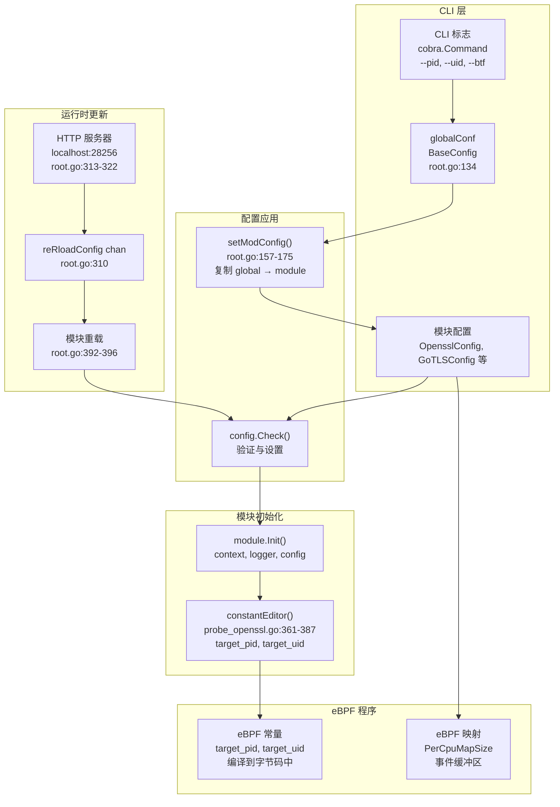
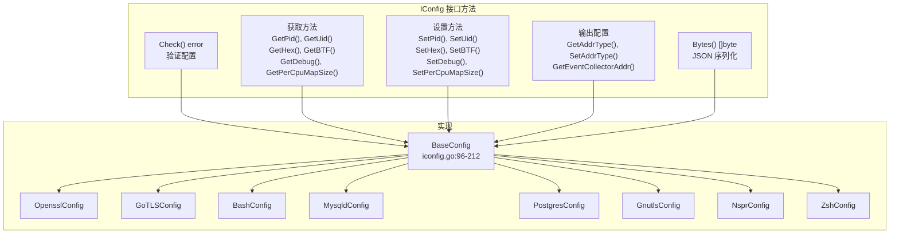
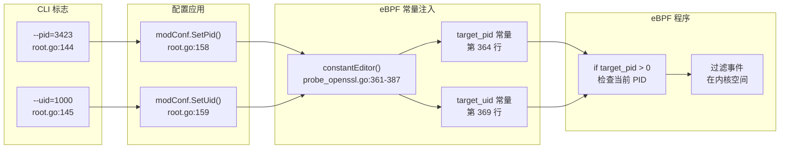
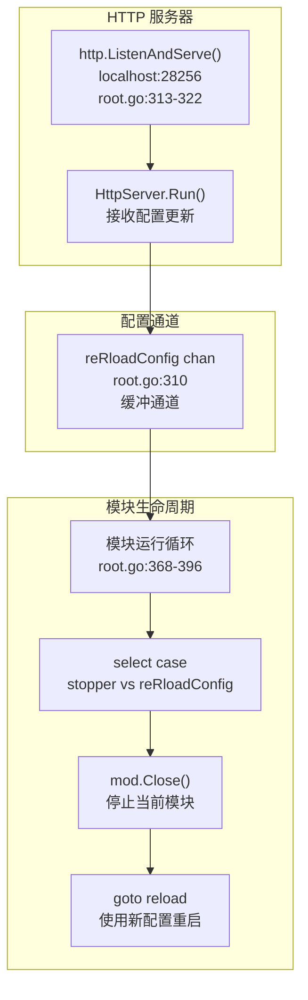
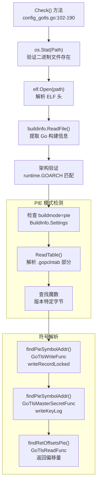
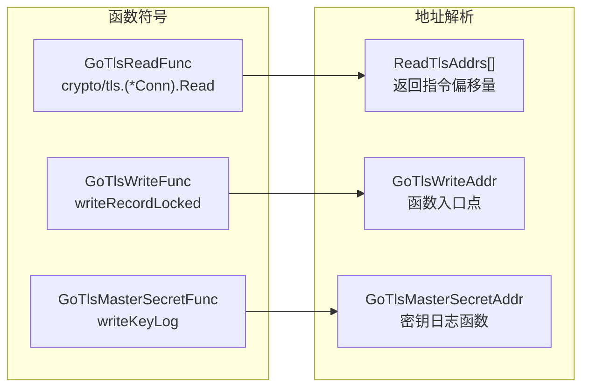
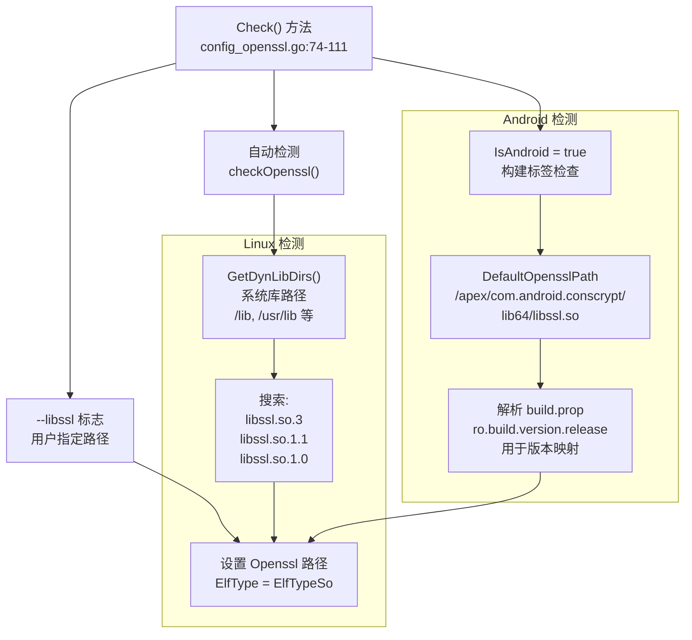
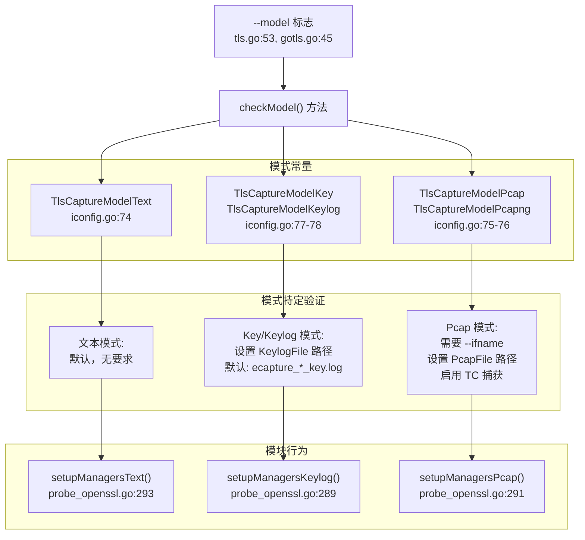
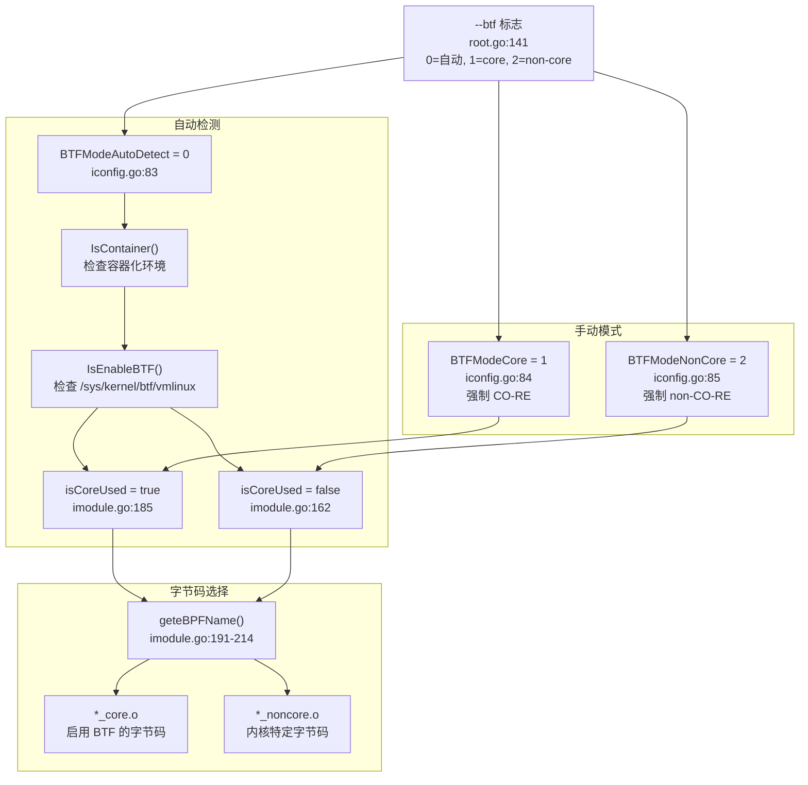

# 配置系统

配置系统管理 eCapture 各个捕获模块的模块特定设置、运行时参数、库发现和过滤机制。它提供了一个统一的 `IConfig` 接口，由基础配置和模块特定配置共同实现，使所有模块（OpenSSL、Go TLS、GnuTLS、NSPR、Bash、MySQL、PostgreSQL、Zsh）都能一致地处理参数。

配置系统支持：
- **进程和用户过滤**：基于 PID/UID 的目标定位，传递给 eBPF 程序
- **运行时更新**：通过 HTTP API 动态更改配置，无需重启
- **平台检测**：自动发现 Linux 和 Android 平台的库
- **输出模式**：文本、PCAP、密钥日志格式选择
- **eBPF 参数**：BTF 模式、映射大小、字节码选择

关于模块生命周期和初始化，请参见[模块系统与生命周期](2.4-module-system-and-lifecycle.md)。关于编译时配置，请参见[构建系统](../5-development-guide/5.1-build-system.md)。

## 配置流程概览

配置系统从 CLI 标志开始，经过验证后传递到 eBPF 程序常量：



**来源：** [cli/cmd/root.go:134-175](https://github.com/gojue/ecapture/blob/0766a93b/cli/cmd/root.go#L134-L175), [user/module/probe_openssl.go:361-387](https://github.com/gojue/ecapture/blob/0766a93b/user/module/probe_openssl.go#L361-L387), [cli/cmd/root.go:310-396](https://github.com/gojue/ecapture/blob/0766a93b/cli/cmd/root.go#L310-L396)

## IConfig 接口

`IConfig` 接口定义了所有配置实现必须满足的契约：



**来源：** [user/config/iconfig.go:24-70](https://github.com/gojue/ecapture/blob/0766a93b/user/config/iconfig.go#L24-L70), [user/config/iconfig.go:96-212](https://github.com/gojue/ecapture/blob/0766a93b/user/config/iconfig.go#L96-L212)

### IConfig 方法分类

| 类别 | 方法 | 用途 |
|------|------|------|
| **验证** | `Check() error` | 在模块启动前验证配置设置 |
| **进程过滤** | `GetPid()`, `SetPid()`, `GetUid()`, `SetUid()` | 针对特定进程或用户 |
| **eBPF 控制** | `GetBTF()`, `SetBTF()`, `GetPerCpuMapSize()`, `SetPerCpuMapSize()` | 控制 eBPF 字节码和映射配置 |
| **输出控制** | `GetHex()`, `SetHex()`, `GetTruncateSize()`, `SetTruncateSize()` | 控制输出格式 |
| **调试** | `GetDebug()`, `SetDebug()` | 启用详细日志 |
| **序列化** | `Bytes() []byte` | 将配置序列化为 JSON，用于运行时更新 |

**来源：** [user/config/iconfig.go:24-70](https://github.com/gojue/ecapture/blob/0766a93b/user/config/iconfig.go#L24-L70)

## BaseConfig 结构

`BaseConfig` 实现了 `IConfig` 接口，并被所有模块特定配置嵌入：

| 字段 | 类型 | 默认值 | 用途 |
|------|------|--------|------|
| `Pid` | `uint64` | `0` | 目标进程 ID（0 = 所有进程）|
| `Uid` | `uint64` | `0` | 目标用户 ID（0 = 所有用户）|
| `PerCpuMapSize` | `int` | `1024 * PAGESIZE` | 每个 CPU 的 eBPF 映射大小（字节）|
| `IsHex` | `bool` | `false` | 以十六进制格式输出数据 |
| `Debug` | `bool` | `false` | 启用调试日志 |
| `BtfMode` | `uint8` | `0` | BTF 模式：0=自动，1=core，2=non-core |
| `ByteCodeFileMode` | `uint8` | `0` | 字节码选择：0=全部，1=core，2=non-core |
| `TruncateSize` | `uint64` | `0` | 截断捕获数据（0 = 不截断）|
| `LoggerAddr` | `string` | `""` | 日志输出地址（文件/tcp/ws）|
| `EventCollectorAddr` | `string` | `""` | 事件收集器地址 |
| `Listen` | `string` | `"localhost:28256"` | HTTP API 监听地址 |

**来源：** [user/config/iconfig.go:96-112](https://github.com/gojue/ecapture/blob/0766a93b/user/config/iconfig.go#L96-L112), [cli/cmd/root.go:134-154](https://github.com/gojue/ecapture/blob/0766a93b/cli/cmd/root.go#L134-L154)

## 进程和用户过滤

eCapture 支持按进程 ID（PID）或用户 ID（UID）过滤捕获。这些过滤器在初始化期间作为常量传递给 eBPF 程序：

### 过滤器配置流程



**来源：** [cli/cmd/root.go:144-145](https://github.com/gojue/ecapture/blob/0766a93b/cli/cmd/root.go#L144-L145), [cli/cmd/root.go:157-159](https://github.com/gojue/ecapture/blob/0766a93b/cli/cmd/root.go#L157-L159), [user/module/probe_openssl.go:361-387](https://github.com/gojue/ecapture/blob/0766a93b/user/module/probe_openssl.go#L361-L387)

### 常量编辑器实现

`constantEditor()` 方法在加载前将配置值注入 eBPF 字节码：

```go
// 来自 probe_openssl.go:361-387
func (m *MOpenSSLProbe) constantEditor() []manager.ConstantEditor {
    editor := []manager.ConstantEditor{
        {
            Name:  "target_pid",
            Value: uint64(m.conf.GetPid()),
        },
        {
            Name:  "target_uid",
            Value: uint64(m.conf.GetUid()),
        },
    }
    // 为简洁起见，省略日志记录
    return editor
}
```

当 `target_pid` 为 0 时，eBPF 程序捕获所有进程。当设置为特定 PID 时，仅捕获该进程的事件。`target_uid` 也采用相同的逻辑。

**注意：** 在内核版本 < 5.2 的系统上，由于缺少 eBPF 功能，进程过滤可能无法正常工作。这在 [user/module/imodule.go:140-149](https://github.com/gojue/ecapture/blob/0766a93b/user/module/imodule.go#L140-L149) 中被检测到。

**来源：** [user/module/probe_openssl.go:361-387](https://github.com/gojue/ecapture/blob/0766a93b/user/module/probe_openssl.go#L361-L387), [user/module/imodule.go:140-149](https://github.com/gojue/ecapture/blob/0766a93b/user/module/imodule.go#L140-L149)

## 通过 HTTP API 进行运行时配置更新

eCapture 提供了一个 HTTP API，用于在运行时更新配置而无需重启捕获进程：

### HTTP API 架构



**来源：** [cli/cmd/root.go:310-322](https://github.com/gojue/ecapture/blob/0766a93b/cli/cmd/root.go#L310-L322), [cli/cmd/root.go:368-396](https://github.com/gojue/ecapture/blob/0766a93b/cli/cmd/root.go#L368-L396)

### 重载流程

1. **HTTP 请求**：客户端向 `http://localhost:28256` 发送新配置
2. **通道发送**：HTTP 处理程序解析 JSON 并发送到 `reRloadConfig` 通道
3. **接收信号**：主运行循环从通道接收新配置
4. **停止模块**：调用当前模块的 `Close()` 方法
5. **重载**：控制跳转到 `reload` 标签，使用新配置重新初始化模块
6. **重启**：模块使用更新后的配置启动

配置使用 `IConfig` 的 `Bytes()` 方法进行序列化：

```go
// 来自 iconfig.go:205-211
func (c *BaseConfig) Bytes() []byte {
    b, e := json.Marshal(c)
    if e != nil {
        return []byte{}
    }
    return b
}
```

这使得可以动态更新 PID 过滤器、UID 过滤器、调试模式和其他运行时可配置的设置，而无需停止捕获。

**来源：** [cli/cmd/root.go:368-396](https://github.com/gojue/ecapture/blob/0766a93b/cli/cmd/root.go#L368-L396), [user/config/iconfig.go:205-211](https://github.com/gojue/ecapture/blob/0766a93b/user/config/iconfig.go#L205-L211)

## 模块特定配置

每个捕获模块都有一个特定的配置结构，该结构嵌入了 `BaseConfig`：

| 模块 | 配置类型 | CLI 变量 | 关键字段 |
|------|----------|----------|----------|
| OpenSSL/BoringSSL | `OpensslConfig` | `oc` (tls.go:26) | `Openssl`, `Model`, `KeylogFile`, `PcapFile`, `Ifname`, `SslVersion`, `CGroupPath` |
| Go TLS | `GoTLSConfig` | `goc` (gotls.go:26) | `Path`, `Model`, `KeylogFile`, `PcapFile`, `Ifname` |
| GnuTLS | `GnutlsConfig` | `gc` (gnutls.go:29) | `Gnutls`, `Model`, `KeylogFile`, `PcapFile`, `Ifname`, `SslVersion` |
| NSPR/NSS | `NsprConfig` | `nc` (nspr.go:27) | `Nsprpath` |
| Bash | `BashConfig` | `bc` (bash.go:24) | `Bashpath`, `Readline`, `ErrNo` |
| MySQL | `MysqldConfig` | `myc` (mysqld.go:27) | `Mysqldpath`, `Offset`, `FuncName` |
| PostgreSQL | `PostgresConfig` | `pgc` (postgres.go:27) | `PostgresPath`, `FuncName` |
| Zsh | `ZshConfig` | `zc` (zsh.go:27) | `Zshpath`, `ErrNo` |

**来源：** [cli/cmd/tls.go:26](https://github.com/gojue/ecapture/blob/0766a93b/cli/cmd/tls.go#L26), [cli/cmd/gotls.go:26](https://github.com/gojue/ecapture/blob/0766a93b/cli/cmd/gotls.go#L26), [cli/cmd/gnutls.go:29](https://github.com/gojue/ecapture/blob/0766a93b/cli/cmd/gnutls.go#L29), [cli/cmd/nspr.go:27](https://github.com/gojue/ecapture/blob/0766a93b/cli/cmd/nspr.go#L27), [cli/cmd/bash.go:24](https://github.com/gojue/ecapture/blob/0766a93b/cli/cmd/bash.go#L24), [cli/cmd/mysqld.go:27](https://github.com/gojue/ecapture/blob/0766a93b/cli/cmd/mysqld.go#L27), [cli/cmd/postgres.go:27](https://github.com/gojue/ecapture/blob/0766a93b/cli/cmd/postgres.go#L27), [cli/cmd/zsh.go:27](https://github.com/gojue/ecapture/blob/0766a93b/cli/cmd/zsh.go#L27)

## Go TLS 配置

`GoTLSConfig` 对 Go 应用程序进行二进制分析，以提取符号地址和函数偏移量，用于 uprobe 附加：

### 二进制分析流程

Go 二进制文件需要符号解析以定位特定的 TLS 函数进行 uprobe 附加。配置执行 ELF 分析和符号表解析：



**来源：** [user/config/config_gotls.go:102-190](https://github.com/gojue/ecapture/blob/0766a93b/user/config/config_gotls.go#L102-L190), [user/config/config_gotls.go:281-325](https://github.com/gojue/ecapture/blob/0766a93b/user/config/config_gotls.go#L281-L325), [user/config/config_gotls.go:327-357](https://github.com/gojue/ecapture/blob/0766a93b/user/config/config_gotls.go#L327-L357)

### 符号地址解析

Go 配置解析特定函数地址以进行 uprobe 附加：

| 函数 | 常量 | 用途 |
|------|------|------|
| `crypto/tls.(*Conn).Read` | `GoTlsReadFunc` | TLS 读取拦截 |
| `crypto/tls.(*Conn).writeRecordLocked` | `GoTlsWriteFunc` | TLS 写入拦截 |
| `crypto/tls.(*Config).writeKeyLog` | `GoTlsMasterSecretFunc` | 主密钥提取 |



**来源：** [user/config/config_gotls.go:31-35](https://github.com/gojue/ecapture/blob/0766a93b/user/config/config_gotls.go#L31-L35), [user/config/config_gotls.go:88-91](https://github.com/gojue/ecapture/blob/0766a93b/user/config/config_gotls.go#L88-L91), [user/config/config_gotls.go:168-182](https://github.com/gojue/ecapture/blob/0766a93b/user/config/config_gotls.go#L168-L182)

## OpenSSL/BoringSSL 配置

`OpensslConfig` 处理 OpenSSL 和 BoringSSL 库的库发现、版本检测和捕获模式配置：

### 库发现流程

如果未指定路径，OpenSSL 配置会执行自动库检测：



**来源：** [user/config/config_openssl.go:74-111](https://github.com/gojue/ecapture/blob/0766a93b/user/config/config_openssl.go#L74-L111), [user/config/config_openssl_linux.go:38-67](https://github.com/gojue/ecapture/blob/0766a93b/user/config/config_openssl_linux.go#L38-L67), [user/config/config_openssl_androidgki.go:34-71](https://github.com/gojue/ecapture/blob/0766a93b/user/config/config_openssl_androidgki.go#L34-L71)

### 平台特定路径

| 平台 | 默认库路径 | 接口 |
|------|-----------|------|
| Linux | `/usr/lib/x86_64-linux-gnu/libssl.so.3` | `eth0` |
| Android | `/apex/com.android.conscrypt/lib64/libssl.so` | `wlan0` |

**来源：** [user/config/config_openssl_linux.go:28-36](https://github.com/gojue/ecapture/blob/0766a93b/user/config/config_openssl_linux.go#L28-L36), [user/config/config_openssl_androidgki.go:26-32](https://github.com/gojue/ecapture/blob/0766a93b/user/config/config_openssl_androidgki.go#L26-L32)

## 捕获模式选择

TLS/SSL 模块支持 `IConfig` 常量中定义的三种捕获模式：

### 捕获模式类型

| 模式常量 | CLI 值 | 用途 | 输出 |
|---------|--------|------|------|
| `TlsCaptureModelText` | `"text"` (默认) | 明文捕获，带 HTTP/HTTP2 解析 | 控制台或文件输出 |
| `TlsCaptureModelKey` / `TlsCaptureModelKeylog` | `"key"` 或 `"keylog"` | 仅提取主密钥 | SSLKEYLOGFILE 格式 |
| `TlsCaptureModelPcap` / `TlsCaptureModelPcapng` | `"pcap"` 或 `"pcapng"` | 完整数据包捕获，带加密密钥 | PCAP-NG 文件 |

**来源：** [user/config/iconfig.go:73-79](https://github.com/gojue/ecapture/blob/0766a93b/user/config/iconfig.go#L73-L79)

### 模式选择和验证



**来源：** [user/config/iconfig.go:73-79](https://github.com/gojue/ecapture/blob/0766a93b/user/config/iconfig.go#L73-L79), [cli/cmd/tls.go:53](https://github.com/gojue/ecapture/blob/0766a93b/cli/cmd/tls.go#L53), [cli/cmd/gotls.go:45](https://github.com/gojue/ecapture/blob/0766a93b/cli/cmd/gotls.go#L45), [user/module/probe_openssl.go:287-296](https://github.com/gojue/ecapture/blob/0766a93b/user/module/probe_openssl.go#L287-L296)

## BTF 模式配置

eCapture 支持 CO-RE（一次编译 - 到处运行）和非 CO-RE eBPF 字节码。BTF 模式决定加载哪个字节码变体：

### BTF 模式选择



**来源：** [cli/cmd/root.go:141](https://github.com/gojue/ecapture/blob/0766a93b/cli/cmd/root.go#L141), [user/config/iconfig.go:82-86](https://github.com/gojue/ecapture/blob/0766a93b/user/config/iconfig.go#L82-L86), [user/module/imodule.go:154-214](https://github.com/gojue/ecapture/blob/0766a93b/user/module/imodule.go#L154-L214)

### BTF 模式影响

| 模式 | 字节码文件 | 要求 | 优势 |
|------|-----------|------|------|
| **CO-RE** (`_core.o`) | 启用 BTF | 支持 BTF 的内核（5.2+）| 单个字节码适用于所有内核版本 |
| **Non-CO-RE** (`_noncore.o`) | 内核特定 | 编译时匹配内核头文件 | 适用于没有 BTF 的旧内核 |

系统会根据内核功能自动选择适当的字节码，除非使用 `--btf` 标志覆盖。

**来源：** [user/module/imodule.go:191-214](https://github.com/gojue/ecapture/blob/0766a93b/user/module/imodule.go#L191-L214), [user/module/imodule.go:173-190](https://github.com/gojue/ecapture/blob/0766a93b/user/module/imodule.go#L173-L190)

## 配置序列化

所有配置都实现了 `Bytes()` 方法进行 JSON 序列化，以支持配置导出和运行时更新：

```go
// 来自 iconfig.go:205-211
func (c *BaseConfig) Bytes() []byte {
    b, e := json.Marshal(c)
    if e != nil {
        return []byte{}
    }
    return b
}
```

此序列化用于：
- **HTTP API**：以 JSON 形式接收配置更新
- **日志记录**：使用 `logger.Info().RawJSON("config", modConfig.Bytes())` 记录当前配置
- **调试**：检查活动配置

配置 JSON 示例：
```json
{
  "pid": 3423,
  "uid": 1000,
  "debug": true,
  "is_hex": false,
  "btf_mode": 0,
  "per_cpu_map_size": 4194304,
  "truncate_size": 1024
}
```

**来源：** [user/config/iconfig.go:205-211](https://github.com/gojue/ecapture/blob/0766a93b/user/config/iconfig.go#L205-L211), [cli/cmd/root.go:394](https://github.com/gojue/ecapture/blob/0766a93b/cli/cmd/root.go#L394)