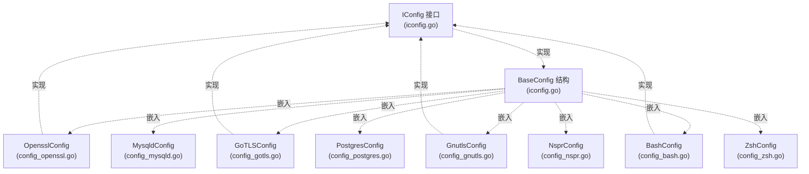
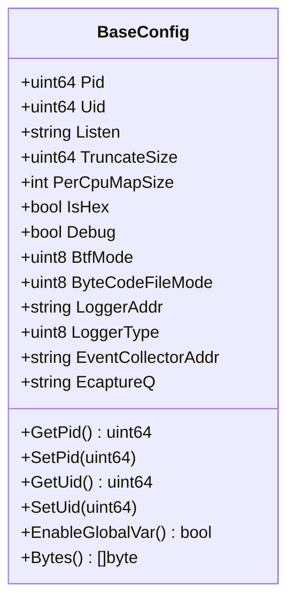
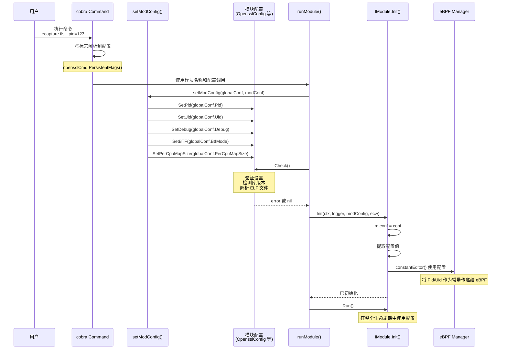
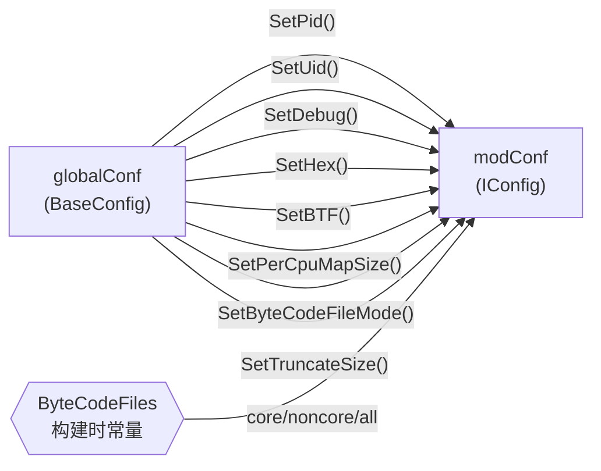
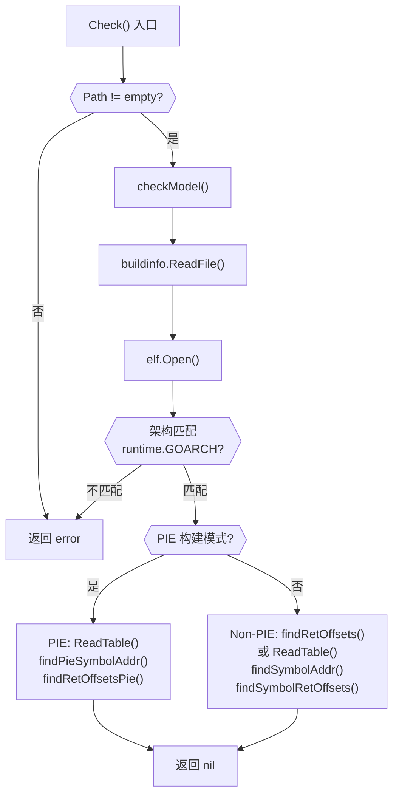
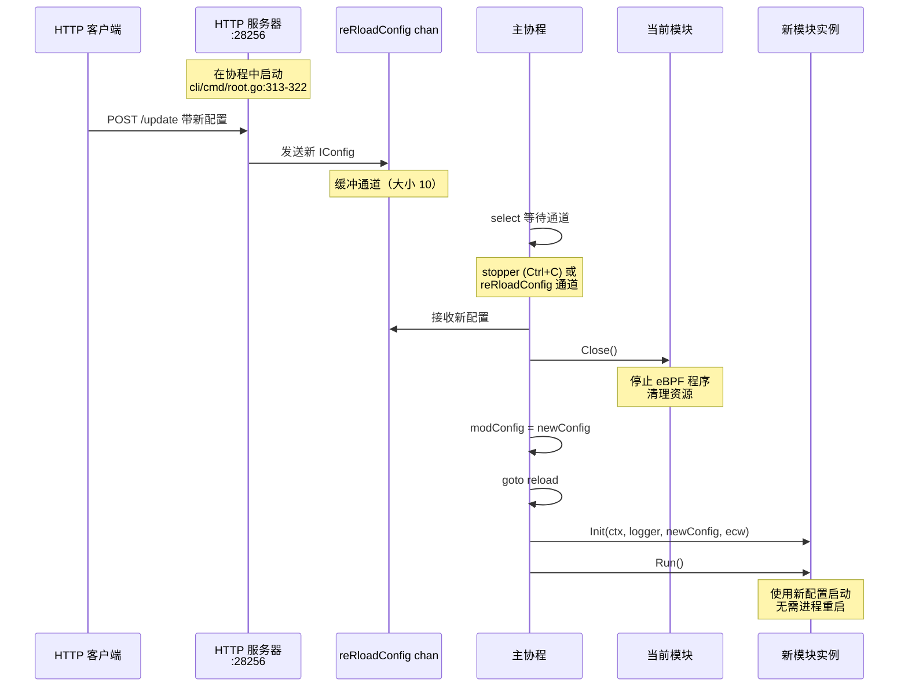
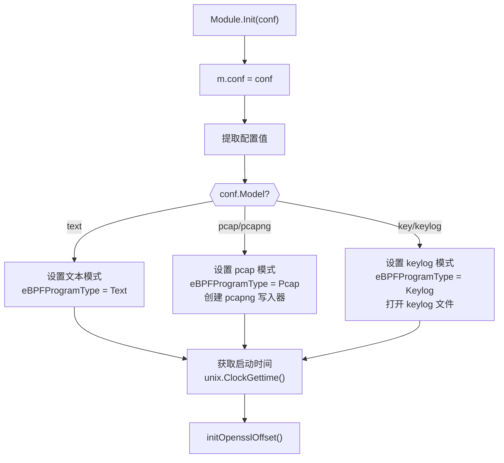

# 配置系统

eCapture 的配置系统提供了一种灵活的、分层的方法来管理不同捕获模块的设置。它定义了一个公共接口（`IConfig`），所有模块配置都必须实现该接口，同时允许模块特定的扩展。该系统支持通过 CLI 标志进行编译时配置和通过 HTTP API 进行运行时更新。

有关使用这些配置的模块系统的信息，请参阅[模块系统与生命周期](2.5-module-system-and-lifecycle.md)。有关 CLI 命令结构，请参阅[命令行接口](../1-overview/1.2-command-line-interface.md)。

---

## 配置架构

配置系统采用基于接口的设计，具有基础实现和模块特定扩展：



**来源：** [user/config/iconfig.go:24-70](https://github.com/gojue/ecapture/blob/ca085d05/user/config/iconfig.go#L24-L70), [user/config/iconfig.go:95-112](https://github.com/gojue/ecapture/blob/ca085d05/user/config/iconfig.go#L95-L112), [user/config/config_gotls.go:77-94](https://github.com/gojue/ecapture/blob/ca085d05/user/config/config_gotls.go#L77-L94)

---

## IConfig 接口

`IConfig` 接口定义了所有配置实现必须满足的契约：

| 方法 | 返回类型 | 用途 |
|--------|-------------|---------|
| `Check()` | `error` | 在模块初始化之前验证配置设置 |
| `GetPid()` / `SetPid(uint64)` | `uint64` / void | 目标进程 ID 过滤器（0 = 所有进程） |
| `GetUid()` / `SetUid(uint64)` | `uint64` / void | 目标用户 ID 过滤器（0 = 所有用户） |
| `GetHex()` / `SetHex(bool)` | `bool` / void | 启用十六进制输出格式 |
| `GetBTF()` / `SetBTF(uint8)` | `uint8` / void | BTF 模式选择（0=自动，1=core，2=non-core） |
| `GetDebug()` / `SetDebug(bool)` | `bool` / void | 启用调试日志 |
| `GetByteCodeFileMode()` / `SetByteCodeFileMode(uint8)` | `uint8` / void | 字节码文件选择（0=all，1=core，2=non-core） |
| `GetPerCpuMapSize()` / `SetPerCpuMapSize(int)` | `int` / void | 每个 CPU 的 eBPF 映射大小（默认：1024 * PAGESIZE） |
| `GetAddrType()` / `SetAddrType(uint8)` | `uint8` / void | 日志输出类型（0=stdout，1=file，2=tcp，3=websocket） |
| `GetEventCollectorAddr()` / `SetEventCollectorAddr(string)` | `string` / void | 事件收集器服务器地址 |
| `GetTruncateSize()` / `SetTruncateSize(uint64)` | `uint64` / void | 文本模式下捕获的最大数据大小 |
| `EnableGlobalVar()` | `bool` | 检查是否支持全局变量（内核 >= 5.2） |
| `Bytes()` | `[]byte` | 将配置序列化为 JSON |

**来源：** [user/config/iconfig.go:24-70](https://github.com/gojue/ecapture/blob/ca085d05/user/config/iconfig.go#L24-L70)

---

## BaseConfig 结构

`BaseConfig` 提供 `IConfig` 的基础实现，包含所有模块共享的公共字段：



**关键字段：**
- **Pid/Uid**：通过常量编辑器传递给 eBPF 程序的进程和用户过滤器 [user/module/probe_openssl.go:366-394](https://github.com/gojue/ecapture/blob/ca085d05/user/module/probe_openssl.go#L366-L394)
- **PerCpuMapSize**：控制事件数据的 eBPF 映射缓冲区大小 [user/config/iconfig.go:178-184](https://github.com/gojue/ecapture/blob/ca085d05/user/config/iconfig.go#L178-L184)
- **BtfMode**：决定是使用 CO-RE（启用 BTF）还是非 CO-RE 字节码 [user/module/imodule.go:154-169](https://github.com/gojue/ecapture/blob/ca085d05/user/module/imodule.go#L154-L169)
- **LoggerAddr/EventCollectorAddr**：日志和捕获事件的独立目标地址 [cli/cmd/root.go:146-147](https://github.com/gojue/ecapture/blob/ca085d05/cli/cmd/root.go#L146-L147)
- **EcaptureQ**：启用本地服务器模式以供远程客户端连接 [cli/cmd/root.go:149](https://github.com/gojue/ecapture/blob/ca085d05/cli/cmd/root.go#L149)

**来源：** [user/config/iconfig.go:95-112](https://github.com/gojue/ecapture/blob/ca085d05/user/config/iconfig.go#L95-L112), [user/config/iconfig.go:114-211](https://github.com/gojue/ecapture/blob/ca085d05/user/config/iconfig.go#L114-L211)

---

## 模块特定配置

每个捕获模块都使用模块特定的设置扩展 `BaseConfig`：

### OpensslConfig

OpenSSL/BoringSSL TLS 捕获的配置：

```go
type OpensslConfig struct {
    BaseConfig
    Openssl      string  // libssl.so 路径
    CGroupPath   string  // 用于过滤的 cgroup 路径
    Model        string  // "text"、"pcap"、"keylog"
    KeylogFile   string  // TLS 密钥的输出文件
    PcapFile     string  // 数据包的输出文件
    Ifname       string  // TC 的网络接口
    SslVersion   string  // OpenSSL 版本字符串
    PcapFilter   string  // BPF 过滤表达式
    IsAndroid    bool    // Android 检测标志
    AndroidVer   string  // Android 版本
}
```

**来源：** [cli/cmd/tls.go:26](https://github.com/gojue/ecapture/blob/ca085d05/cli/cmd/tls.go#L26), [cli/cmd/tls.go:51-58](https://github.com/gojue/ecapture/blob/ca085d05/cli/cmd/tls.go#L51-L58), [user/module/probe_openssl.go:126-174](https://github.com/gojue/ecapture/blob/ca085d05/user/module/probe_openssl.go#L126-L174)

### GoTLSConfig

带 ELF 分析的 Go TLS 捕获配置：

```go
type GoTLSConfig struct {
    BaseConfig
    Path                  string              // Go 二进制路径
    PcapFile              string
    KeylogFile            string
    Model                 string
    Ifname                string
    PcapFilter            string
    goElf                 *elf.File           // 解析的 ELF 文件
    Buildinfo             *buildinfo.BuildInfo // Go 构建元数据
    ReadTlsAddrs          []int               // Read 的 uprobe 地址
    GoTlsWriteAddr        uint64              // Write 的 uprobe 地址
    GoTlsMasterSecretAddr uint64              // 主密钥的 uprobe 地址
    IsPieBuildMode        bool                // PIE 检测
    goSymTab              *gosym.Table        // Go 符号表
}
```

**关键特性：** `Check()` 方法执行广泛的 ELF 分析以定位函数地址 [user/config/config_gotls.go:103-213](https://github.com/gojue/ecapture/blob/ca085d05/user/config/config_gotls.go#L103-L213)

**来源：** [user/config/config_gotls.go:77-94](https://github.com/gojue/ecapture/blob/ca085d05/user/config/config_gotls.go#L77-L94), [cli/cmd/gotls.go:26](https://github.com/gojue/ecapture/blob/ca085d05/cli/cmd/gotls.go#L26), [cli/cmd/gotls.go:43-48](https://github.com/gojue/ecapture/blob/ca085d05/cli/cmd/gotls.go#L43-L48)

### 其他模块配置

| 模块 | 配置类型 | 关键字段 | CLI 命令 |
|--------|-------------|------------|-------------|
| GnuTLS | `GnutlsConfig` | `Gnutls`（库路径）、`SslVersion` | [cli/cmd/gnutls.go:29-54](https://github.com/gojue/ecapture/blob/ca085d05/cli/cmd/gnutls.go#L29-L54) |
| Bash | `BashConfig` | `Bashpath`、`Readline`（readline.so 路径）、`ErrNo` | [cli/cmd/bash.go:24-38](https://github.com/gojue/ecapture/blob/ca085d05/cli/cmd/bash.go#L24-L38) |
| MySQL | `MysqldConfig` | `Mysqldpath`、`Offset`、`FuncName` | [cli/cmd/mysqld.go:27-42](https://github.com/gojue/ecapture/blob/ca085d05/cli/cmd/mysqld.go#L27-L42) |
| Postgres | `PostgresConfig` | `PostgresPath`、`FuncName` | [cli/cmd/postgres.go:27-38](https://github.com/gojue/ecapture/blob/ca085d05/cli/cmd/postgres.go#L27-L38) |
| NSPR/NSS | `NsprConfig` | `Nsprpath`（libnspr44.so） | [cli/cmd/nspr.go:27-44](https://github.com/gojue/ecapture/blob/ca085d05/cli/cmd/nspr.go#L27-L44) |
| Zsh | `ZshConfig` | `Zshpath`、`ErrNo` | [cli/cmd/zsh.go:27-40](https://github.com/gojue/ecapture/blob/ca085d05/cli/cmd/zsh.go#L27-L40) |

---

## 配置生命周期

配置从 CLI 输入到模块使用经历多个阶段：



**来源：** [cli/cmd/root.go:156-175](https://github.com/gojue/ecapture/blob/ca085d05/cli/cmd/root.go#L156-L175), [cli/cmd/root.go:249-403](https://github.com/gojue/ecapture/blob/ca085d05/cli/cmd/root.go#L249-L403), [user/module/probe_openssl.go:109-176](https://github.com/gojue/ecapture/blob/ca085d05/user/module/probe_openssl.go#L109-L176), [user/module/probe_openssl.go:361-395](https://github.com/gojue/ecapture/blob/ca085d05/user/module/probe_openssl.go#L361-L395)

---

## 配置传递到模块

`setModConfig` 函数将全局设置传递到模块特定的配置：



**传递逻辑：**
1. 全局命令行标志（pid、uid、debug 等）被解析到 `globalConf` [cli/cmd/root.go:134-153](https://github.com/gojue/ecapture/blob/ca085d05/cli/cmd/root.go#L134-L153)
2. 模块特定标志被解析到模块配置（例如，OpenSSL 的 `oc`） [cli/cmd/tls.go:51-58](https://github.com/gojue/ecapture/blob/ca085d05/cli/cmd/tls.go#L51-L58)
3. `setModConfig()` 将全局设置复制到模块配置 [cli/cmd/root.go:156-175](https://github.com/gojue/ecapture/blob/ca085d05/cli/cmd/root.go#L156-L175)
4. 构建时常量 `ByteCodeFiles` 决定字节码文件模式 [cli/cmd/root.go:167-174](https://github.com/gojue/ecapture/blob/ca085d05/cli/cmd/root.go#L167-L174)

**来源：** [cli/cmd/root.go:156-175](https://github.com/gojue/ecapture/blob/ca085d05/cli/cmd/root.go#L156-L175), [cli/cmd/root.go:134-153](https://github.com/gojue/ecapture/blob/ca085d05/cli/cmd/root.go#L134-L153)

---

## 配置验证

每个模块配置都实现 `Check()` 方法以在初始化前验证设置：

### OpensslConfig 验证
- 验证捕获模式（text/pcap/keylog） [cli/cmd/tls.go:53](https://github.com/gojue/ecapture/blob/ca085d05/cli/cmd/tls.go#L53)
- 检查文件路径（keylog 文件、pcap 文件） [user/module/probe_openssl.go:130-148](https://github.com/gojue/ecapture/blob/ca085d05/user/module/probe_openssl.go#L130-L148)
- 通过 ELF 分析检测 OpenSSL 版本 [user/module/probe_openssl.go:178-278](https://github.com/gojue/ecapture/blob/ca085d05/user/module/probe_openssl.go#L178-L278)
- 选择适当的 eBPF 字节码文件 [user/module/probe_openssl.go:179-278](https://github.com/gojue/ecapture/blob/ca085d05/user/module/probe_openssl.go#L179-L278)

### GoTLSConfig 验证
最复杂的验证过程：



**关键验证步骤：**
1. **二进制文件存在性**：检查 Go 二进制路径是否存在 [user/config/config_gotls.go:105-116](https://github.com/gojue/ecapture/blob/ca085d05/user/config/config_gotls.go#L105-L116)
2. **构建信息提取**：解析 Go 构建元数据 [user/config/config_gotls.go:119-122](https://github.com/gojue/ecapture/blob/ca085d05/user/config/config_gotls.go#L119-L122)
3. **架构验证**：确保二进制文件与主机架构匹配 [user/config/config_gotls.go:130-150](https://github.com/gojue/ecapture/blob/ca085d05/user/config/config_gotls.go#L130-L150)
4. **PIE 检测**：检查位置独立可执行文件模式 [user/config/config_gotls.go:155-162](https://github.com/gojue/ecapture/blob/ca085d05/user/config/config_gotls.go#L155-L162)
5. **符号解析**：定位 `crypto/tls` 函数地址 [user/config/config_gotls.go:169-211](https://github.com/gojue/ecapture/blob/ca085d05/user/config/config_gotls.go#L169-L211)
6. **RET 指令查找**：识别 uretprobe 钩子的返回地址 [user/config/config_gotls.go:219-285](https://github.com/gojue/ecapture/blob/ca085d05/user/config/config_gotls.go#L219-L285)

**来源：** [user/config/config_gotls.go:103-213](https://github.com/gojue/ecapture/blob/ca085d05/user/config/config_gotls.go#L103-L213), [user/config/config_gotls.go:219-285](https://github.com/gojue/ecapture/blob/ca085d05/user/config/config_gotls.go#L219-L285), [user/config/config_gotls.go:350-446](https://github.com/gojue/ecapture/blob/ca085d05/user/config/config_gotls.go#L350-L446)

---

## 运行时配置更新

eCapture 支持通过 HTTP API 进行运行时配置更新，无需重启捕获：



**运行时更新流程：**
1. HTTP 服务器监听配置的地址（默认：`127.0.0.1:28256`） [cli/cmd/root.go:77](https://github.com/gojue/ecapture/blob/ca085d05/cli/cmd/root.go#L77)
2. 客户端通过 HTTP POST 发送新配置 [cli/cmd/root.go:313-322](https://github.com/gojue/ecapture/blob/ca085d05/cli/cmd/root.go#L313-L322)
3. 新配置被发送到 `reRloadConfig` 通道 [cli/cmd/root.go:310](https://github.com/gojue/ecapture/blob/ca085d05/cli/cmd/root.go#L310)
4. 主循环接收配置更新信号 [cli/cmd/root.go:368-384](https://github.com/gojue/ecapture/blob/ca085d05/cli/cmd/root.go#L368-L384)
5. 当前模块被优雅关闭 [cli/cmd/root.go:387-390](https://github.com/gojue/ecapture/blob/ca085d05/cli/cmd/root.go#L387-L390)
6. 模块使用新配置重新初始化 [cli/cmd/root.go:392-395](https://github.com/gojue/ecapture/blob/ca085d05/cli/cmd/root.go#L392-L395)
7. 模块使用更新的设置启动 [cli/cmd/root.go:358-362](https://github.com/gojue/ecapture/blob/ca085d05/cli/cmd/root.go#L358-L362)

**限制：**
- 模块类型不能更改（例如，不能从 `tls` 切换到 `bash`）
- 需要优雅清理 eBPF 资源
- 重新加载期间捕获会短暂中断

**来源：** [cli/cmd/root.go:309-322](https://github.com/gojue/ecapture/blob/ca085d05/cli/cmd/root.go#L309-L322), [cli/cmd/root.go:349-396](https://github.com/gojue/ecapture/blob/ca085d05/cli/cmd/root.go#L349-L396), [cli/cmd/root.go:77](https://github.com/gojue/ecapture/blob/ca085d05/cli/cmd/root.go#L77)

---

## 模块中的配置使用

模块在整个生命周期中访问配置：

### 初始化期间



**来源：** [user/module/probe_openssl.go:109-176](https://github.com/gojue/ecapture/blob/ca085d05/user/module/probe_openssl.go#L109-L176), [user/module/probe_openssl.go:126-154](https://github.com/gojue/ecapture/blob/ca085d05/user/module/probe_openssl.go#L126-L154)

### eBPF 设置期间

配置通过常量编辑器传递给 eBPF 程序：

```go
func (m *MOpenSSLProbe) constantEditor() []manager.ConstantEditor {
    return []manager.ConstantEditor{
        {
            Name:  "target_pid",
            Value: uint64(m.conf.GetPid()),
        },
        {
            Name:  "target_uid",
            Value: uint64(m.conf.GetUid()),
        },
        {
            Name:  "less52",
            Value: kernelLess52,  // 基于内核版本检查
        },
    }
}
```

**来源：** [user/module/probe_openssl.go:361-395](https://github.com/gojue/ecapture/blob/ca085d05/user/module/probe_openssl.go#L361-L395)

### 运行时期间

模块持续引用配置用于：
- **输出格式化**：检查 `GetHex()` 以获取十六进制输出 [user/module/imodule.go:416-425](https://github.com/gojue/ecapture/blob/ca085d05/user/module/imodule.go#L416-L425)
- **捕获模式**：确定如何处理事件（text/pcap/keylog） [user/module/probe_openssl.go:287-296](https://github.com/gojue/ecapture/blob/ca085d05/user/module/probe_openssl.go#L287-L296)
- **文件路径**：写入配置的输出文件 [user/module/probe_openssl.go:575-580](https://github.com/gojue/ecapture/blob/ca085d05/user/module/probe_openssl.go#L575-L580)
- **过滤器设置**：遵守 PID/UID 过滤器 [user/module/probe_openssl.go:382-392](https://github.com/gojue/ecapture/blob/ca085d05/user/module/probe_openssl.go#L382-L392)

**来源：** [user/module/imodule.go:416-425](https://github.com/gojue/ecapture/blob/ca085d05/user/module/imodule.go#L416-L425), [user/module/probe_openssl.go:287-296](https://github.com/gojue/ecapture/blob/ca085d05/user/module/probe_openssl.go#L287-L296)

---

## 配置常量和模式

### TLS 捕获模式

| 常量 | 值 | 描述 |
|----------|-------|-------------|
| `TlsCaptureModelText` | `"text"` | 将明文数据输出到控制台/日志 |
| `TlsCaptureModelPcap` | `"pcap"` | 以 PCAP 格式输出数据包 |
| `TlsCaptureModelPcapng` | `"pcapng"` | 以 PCAPNG 格式输出数据包 |
| `TlsCaptureModelKey` | `"key"` | 仅输出 TLS 密钥 |
| `TlsCaptureModelKeylog` | `"keylog"` | 以 SSLKEYLOGFILE 格式输出密钥 |

**来源：** [user/config/iconfig.go:73-79](https://github.com/gojue/ecapture/blob/ca085d05/user/config/iconfig.go#L73-L79)

### BTF 模式

| 常量 | 值 | 含义 |
|----------|-------|---------|
| `BTFModeAutoDetect` | `0` | 自动检测 BTF 可用性 |
| `BTFModeCore` | `1` | 强制使用 CO-RE（启用 BTF）字节码 |
| `BTFModeNonCore` | `2` | 强制使用非 CO-RE 字节码 |

**BTF 检测逻辑：**
1. 检查是否在容器中运行 [user/module/imodule.go:175-178](https://github.com/gojue/ecapture/blob/ca085d05/user/module/imodule.go#L175-L178)
2. 检查 `/sys/kernel/btf/vmlinux` 是否存在 [user/module/imodule.go:180-186](https://github.com/gojue/ecapture/blob/ca085d05/user/module/imodule.go#L180-L186)
3. 如果找到 BTF 则默认使用 CO-RE，否则使用非 CO-RE [user/module/imodule.go:154-189](https://github.com/gojue/ecapture/blob/ca085d05/user/module/imodule.go#L154-L189)

**来源：** [user/config/iconfig.go:82-86](https://github.com/gojue/ecapture/blob/ca085d05/user/config/iconfig.go#L82-L86), [user/module/imodule.go:173-190](https://github.com/gojue/ecapture/blob/ca085d05/user/module/imodule.go#L173-L190)

### 字节码文件模式

| 常量 | 值 | 描述 |
|----------|-------|-------------|
| `ByteCodeFileAll` | `0` | CO-RE 和非 CO-RE 字节码都可用 |
| `ByteCodeFileCore` | `1` | 仅嵌入 CO-RE 字节码 |
| `ByteCodeFileNonCore` | `2` | 仅嵌入非 CO-RE 字节码 |

**构建时选择：**
- 通过编译期间的 `ByteCodeFiles` 变量设置 [cli/cmd/root.go:57](https://github.com/gojue/ecapture/blob/ca085d05/cli/cmd/root.go#L57)
- 决定由 `go-bindata` 嵌入哪些字节码文件 [cli/cmd/root.go:167-174](https://github.com/gojue/ecapture/blob/ca085d05/cli/cmd/root.go#L167-L174)

**来源：** [user/config/iconfig.go:89-93](https://github.com/gojue/ecapture/blob/ca085d05/user/config/iconfig.go#L89-L93), [cli/cmd/root.go:57](https://github.com/gojue/ecapture/blob/ca085d05/cli/cmd/root.go#L57), [cli/cmd/root.go:167-174](https://github.com/gojue/ecapture/blob/ca085d05/cli/cmd/root.go#L167-L174)

---

## 配置序列化

所有配置都实现 `Bytes()` 以进行 JSON 序列化：

```go
func (c *BaseConfig) Bytes() []byte {
    b, e := json.Marshal(c)
    if e != nil {
        return []byte{}
    }
    return b
}
```

**使用场景：**
- **日志记录**：启动时记录配置 [cli/cmd/root.go:298-307](https://github.com/gojue/ecapture/blob/ca085d05/cli/cmd/root.go#L298-L307)
- **重新加载**：重新加载前记录新配置 [cli/cmd/root.go:394](https://github.com/gojue/ecapture/blob/ca085d05/cli/cmd/root.go#L394)
- **调试**：可以通过 JSON 输出检查配置

**来源：** [user/config/iconfig.go:205-211](https://github.com/gojue/ecapture/blob/ca085d05/user/config/iconfig.go#L205-L211), [user/config/config_gotls.go:448-454](https://github.com/gojue/ecapture/blob/ca085d05/user/config/config_gotls.go#L448-L454)

---

## 配置最佳实践

1. **始终在 `Check()` 中验证**：在 eBPF 初始化之前捕获配置错误
2. **使用嵌入的 BaseConfig**：重用公共功能而不是重新实现
3. **遵守 EnableGlobalVar()**：在使用全局变量之前检查内核版本 [user/config/iconfig.go:194-203](https://github.com/gojue/ecapture/blob/ca085d05/user/config/iconfig.go#L194-L203)
4. **优雅处理 BTF**：同时支持 CO-RE 和非 CO-RE 模式 [user/module/imodule.go:154-169](https://github.com/gojue/ecapture/blob/ca085d05/user/module/imodule.go#L154-L169)
5. **提供合理的默认值**：使用 `DefaultMapSizePerCpu` 等常量 [user/config/config_gotls.go:99](https://github.com/gojue/ecapture/blob/ca085d05/user/config/config_gotls.go#L99)
6. **记录模块特定字段**：清晰的注释帮助用户理解选项

**来源：** [user/config/iconfig.go:194-203](https://github.com/gojue/ecapture/blob/ca085d05/user/config/iconfig.go#L194-L203), [user/module/imodule.go:154-169](https://github.com/gojue/ecapture/blob/ca085d05/user/module/imodule.go#L154-L169), [user/config/config_gotls.go:97-101](https://github.com/gojue/ecapture/blob/ca085d05/user/config/config_gotls.go#L97-L101)