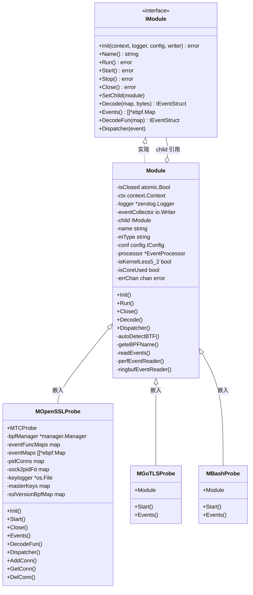
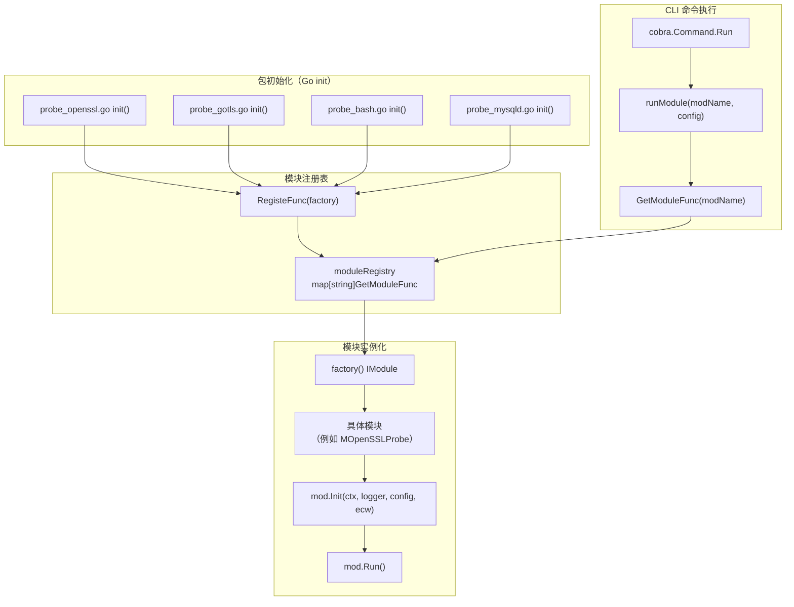
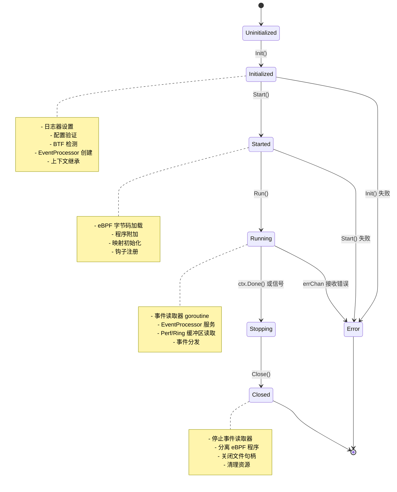
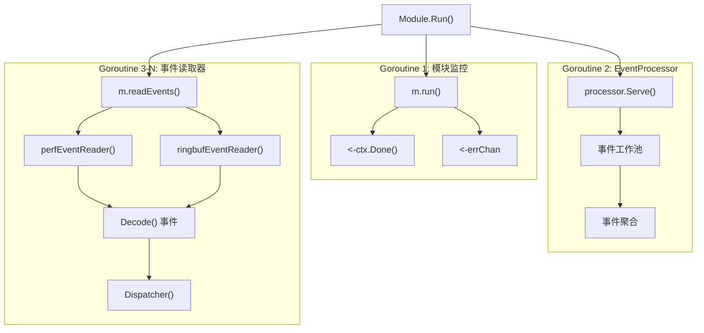
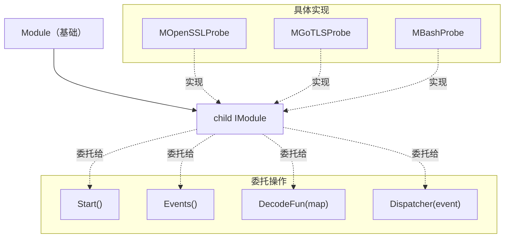
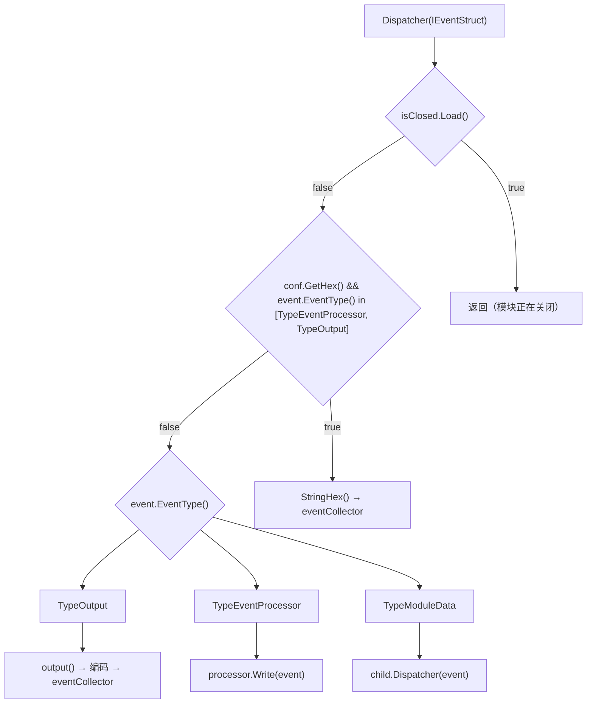
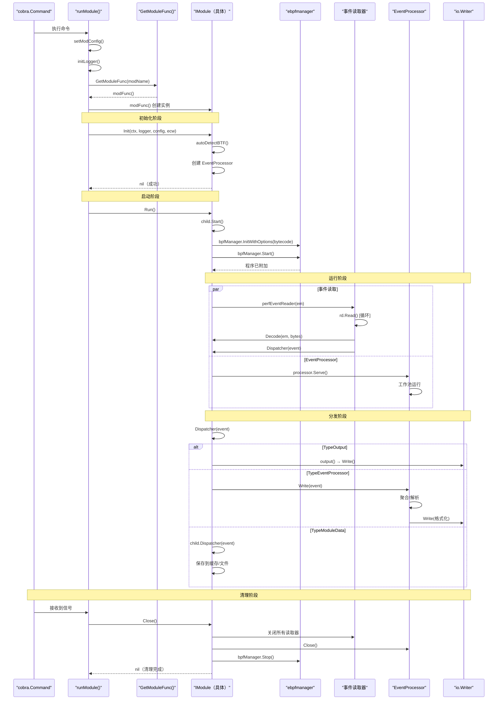

# 模块系统与生命周期

本文档解释了 eCapture 中的模块系统架构，包括 `IModule` 接口约定、模块注册模式，以及从初始化到关闭的完整生命周期。模块系统提供了一个可插拔的架构，每种捕获类型（OpenSSL、GoTLS、Bash、MySQL 等）都实现了一个通用接口，同时保持专门的行为。

有关模块如何配置自身的详细信息，请参见页面 **2.3 配置系统**。有关模块内 eBPF 程序加载的信息，请参见页面 **2.1 eBPF 引擎**。有关捕获后的事件处理，请参见页面 **2.2 事件处理流程**。

## IModule 接口约定

`IModule` 接口定义了所有捕获模块必须实现的标准约定。该接口在整个系统中实现多态模块处理，允许 CLI 命令和 HTTP API 通过工厂模式统一实例化和管理不同的捕获类型。

**核心接口定义**

| 方法 | 用途 | 调用者 |
|--------|---------|-----------|
| `Init(context.Context, *zerolog.Logger, config.IConfig, io.Writer)` | 使用上下文、日志器、配置和事件写入器初始化模块 | 启动前的 CLI/HTTP 处理器 |
| `Name()` | 返回模块名称（例如 "openssl"、"gotls"） | 日志记录和标识 |
| `Run()` | 启动事件处理流程 | 初始化完成后的 CLI |
| `Start()` | 加载并附加 eBPF 程序 | 内部由 `Module.Run()` 调用 |
| `Stop()` | 优雅地停止捕获 | 信号处理器 |
| `Close()` | 释放所有资源 | 关闭序列 |
| `SetChild(IModule)` | 为父子模式注册具体实现 | `Init()` 阶段 |
| `Events()` | 返回用于事件读取的 eBPF 映射列表 | 事件读取器设置 |
| `DecodeFun(*ebpf.Map)` | 获取特定 eBPF 映射的解码器 | 事件解码 |
| `Decode(*ebpf.Map, []byte)` | 将原始字节解码为事件结构 | 事件处理 |
| `Dispatcher(event.IEventStruct)` | 处理已解码的事件 | 事件路由 |

该接口在整个系统中实现多态处理，允许 CLI 命令和 HTTP API 通过工厂模式统一实例化和管理不同的捕获类型。

**来源：** [user/module/imodule.go:47-75](https://github.com/gojue/ecapture/blob/0766a93b/user/module/imodule.go#L47-L75), [user/module/probe_openssl.go:83-106](https://github.com/gojue/ecapture/blob/0766a93b/user/module/probe_openssl.go#L83-L106)



**图表：IModule 接口层次结构**

父子模式允许基础 `Module` 结构体提供通用功能（BTF 检测、事件读取、上下文管理），同时通过 `child` 字段将模块特定操作（eBPF 程序设置、事件解码）委托给具体实现。

**来源：** [user/module/imodule.go:83-108](https://github.com/gojue/ecapture/blob/0766a93b/user/module/imodule.go#L83-L108), [user/module/probe_openssl.go:83-106](https://github.com/gojue/ecapture/blob/0766a93b/user/module/probe_openssl.go#L83-L106)

## 模块注册与工厂模式

eCapture 使用工厂模式进行模块实例化，基于 CLI 命令实现动态模块加载。每个模块在包初始化期间使用 Go 的 `init()` 机制注册一个工厂函数。

**注册实现**

每个模块文件都包含一个注册工厂的 `init()` 函数：

```go
// 来自 probe_openssl.go 的示例
func init() {
    RegisteFunc(NewOpenSSLProbe)
}

func NewOpenSSLProbe() IModule {
    mod := &MOpenSSLProbe{}
    mod.name = ModuleNameOpenssl
    mod.mType = ProbeTypeUprobe
    return mod
}
```

`RegisteFunc()` 函数将这些工厂存储在一个以模块名称为键的全局注册表映射中。当 CLI 命令执行时，它调用 `GetModuleFunc(moduleName)` 来检索工厂并实例化模块。



**图表：模块注册与工厂模式流程**

**来源：** [user/module/probe_openssl.go:777-786](https://github.com/gojue/ecapture/blob/0766a93b/user/module/probe_openssl.go#L777-L786), [user/module/imodule.go:47-75](https://github.com/gojue/ecapture/blob/0766a93b/user/module/imodule.go#L47-L75)

**模块名称常量**

每个模块由一个用于注册表查找的唯一字符串常量标识：

| 模块名称 | 常量 | 目标 |
|-------------|----------|--------|
| `ModuleNameOpenssl` | "openssl" | OpenSSL/BoringSSL |
| `ModuleNameGotls` | "gotls" | Go crypto/tls |
| `ModuleNameGnutls` | "gnutls" | GnuTLS |
| `ModuleNameNspr` | "nspr" | NSS/NSPR |
| `ModuleNameBash` | "bash" | Bash shell |
| `ModuleNameZsh` | "zsh" | Zsh shell |
| `ModuleNameMysqld` | "mysqld" | MySQL 服务器 |
| `ModuleNamePostgres` | "postgres" | PostgreSQL |

**CLI 到模块的映射**

`cli/cmd/` 中的 CLI 层为每个模块包含一个 cobra 命令文件。每个命令文件使用适当的模块名称常量和配置对象调用 `runModule()`：

| CLI 命令 | 模块名称常量 | 配置类型 | 源文件 |
|-------------|---------------------|-------------|-------------|
| `ecapture tls` | `ModuleNameOpenssl` | `OpensslConfig` | cli/cmd/tls.go |
| `ecapture gotls` | `ModuleNameGotls` | `GoTLSConfig` | cli/cmd/gotls.go |
| `ecapture gnutls` | `ModuleNameGnutls` | `GnutlsConfig` | cli/cmd/gnutls.go |
| `ecapture bash` | `ModuleNameBash` | `BashConfig` | cli/cmd/bash.go |
| `ecapture zsh` | `ModuleNameZsh` | `ZshConfig` | cli/cmd/zsh.go |
| `ecapture mysqld` | `ModuleNameMysqld` | `MysqldConfig` | cli/cmd/mysqld.go |
| `ecapture postgres` | `ModuleNamePostgres` | `PostgresConfig` | cli/cmd/postgres.go |

[cli/cmd/root.go:249-403](https://github.com/gojue/ecapture/blob/0766a93b/cli/cmd/root.go#L249-L403) 中的 `runModule()` 函数协调完整的模块生命周期：配置设置、日志器初始化、通过工厂实例化模块、初始化、执行和清理。

**来源：** [cli/cmd/root.go:249-403](https://github.com/gojue/ecapture/blob/0766a93b/cli/cmd/root.go#L249-L403)

## 模块生命周期阶段

模块生命周期由五个不同的阶段组成，每个阶段都有特定的职责。模块按顺序经历这些阶段，在每个转换点都有错误处理。



**图表：模块生命周期状态机**

**来源：** [cli/cmd/root.go:336-397](https://github.com/gojue/ecapture/blob/0766a93b/cli/cmd/root.go#L336-L397), [user/module/imodule.go:110-171](https://github.com/gojue/ecapture/blob/0766a93b/user/module/imodule.go#L110-L171)

### 初始化阶段（Init）

`Init()` 方法为执行准备模块。这是模块接收其依赖项并执行环境检测的地方。

**初始化职责：**

1. **上下文继承**：存储父上下文以进行取消传播
2. **日志器配置**：设置 `zerolog.Logger` 实例进行模块特定的日志记录
3. **配置存储**：保存 `IConfig` 引用以便运行时参数访问
4. **BTF 模式检测**：确定是使用 CO-RE（支持 BTF）还是非 CO-RE 字节码
5. **内核版本检查**：检测内核版本是否 < 5.2（影响过滤能力和字节码选择）
6. **EventProcessor 创建**：初始化 `event_processor.EventProcessor` 用于事件聚合和格式化
7. **输出格式选择**：根据 `eventCollector` 类型选择文本或 protobuf 编码
8. **错误通道设置**：创建缓冲的 `errChan` 用于错误传播
9. **关闭标志初始化**：将 `isClosed` 原子标志设置为 false

**基础模块 Init 实现：**

[user/module/imodule.go:110-171](https://github.com/gojue/ecapture/blob/0766a93b/user/module/imodule.go#L110-L171) 中的 `Module.Init()` 方法提供所有模块执行的通用初始化逻辑：

```go
// 上下文和核心依赖
m.isClosed.Store(false)
m.ctx = ctx
m.logger = logger
m.eventCollector = eventCollector
m.errChan = make(chan error, 16)

// BTF 模式确定（CO-RE vs 非 CO-RE）
if conf.GetBTF() == config.BTFModeAutoDetect {
    m.autoDetectBTF()  // 检查内核中的 BTF 支持
} else {
    m.isCoreUsed = (conf.GetBTF() == config.BTFModeCore)
}

// 内核版本检测用于字节码选择
kv, err := kernel.HostVersion()
if kv < kernel.VersionCode(5, 2, 0) {
    m.isKernelLess5_2 = true  // 使用 *_less52.o 字节码变体
}

// 输出格式检测
if _, ok := m.eventCollector.(event.CollectorWriter); !ok {
    m.eventOutputType = codecTypeProtobuf
} else {
    m.eventOutputType = codecTypeText
}

// EventProcessor 初始化，支持截断
tsize := conf.GetTruncateSize()
m.processor = event_processor.NewEventProcessor(eventCollector, conf.GetHex(), tsize)
```

[user/module/imodule.go:173-190](https://github.com/gojue/ecapture/blob/0766a93b/user/module/imodule.go#L173-L190) 中的 `autoDetectBTF()` 方法检查容器环境和内核 BTF 配置以确定 CO-RE 支持。

**模块特定的 Init 扩展：**

具体模块通过专门的设置扩展初始化。例如，[user/module/probe_openssl.go:109-176](https://github.com/gojue/ecapture/blob/0766a93b/user/module/probe_openssl.go#L109-L176) 中的 `MOpenSSLProbe.Init()` 执行 OpenSSL 特定的初始化：

```go
// 调用父初始化
err = m.Module.Init(ctx, logger, conf, ecw)
if err != nil {
    return err
}

// 将自身注册为子对象以进行委托模式
m.Module.SetChild(m)

// 初始化模块特定的数据结构
m.eventMaps = make([]*ebpf.Map, 0, 2)
m.eventFuncMaps = make(map[*ebpf.Map]event.IEventStruct)
m.pidConns = make(map[uint32]map[uint32]ConnInfo)  // pid -> fd -> 连接
m.sock2pidFd = make(map[uint64][2]uint32)          // sock -> [pid, fd]
m.pidLocker = new(sync.Mutex)
m.masterKeys = make(map[string]bool)                // 去重映射
m.sslVersionBpfMap = make(map[string]string)        // 版本 -> 字节码文件

// 捕获模式确定
model := m.conf.(*config.OpensslConfig).Model
switch model {
case config.TlsCaptureModelKeylog, config.TlsCaptureModelKey:
    m.keylogger, err = os.OpenFile(keylogFilename, os.O_APPEND|os.O_WRONLY|os.O_CREATE, 0o600)
    m.eBPFProgramType = TlsCaptureModelTypeKeylog
case config.TlsCaptureModelPcap, config.TlsCaptureModelPcapng:
    m.eBPFProgramType = TlsCaptureModelTypePcap
    m.tcPacketsChan = make(chan *TcPacket, 2048)
case config.TlsCaptureModelText:
    m.eBPFProgramType = TlsCaptureModelTypeText
}

// 时钟同步用于时间戳转换
unix.ClockGettime(unix.CLOCK_MONOTONIC, &ts)
m.startTime = uint64(ts.Nano())
m.bootTime = uint64(time.Now().UnixNano() - ts.Nano())

// 初始化 OpenSSL 偏移配置
m.initOpensslOffset()
```

不同的模块执行不同的专门初始化：GoTLS 执行 Go 二进制分析，Bash 定位 readline 库，MySQL 检测 `dispatch_command` 函数偏移等。

**来源：** [user/module/imodule.go:110-171](https://github.com/gojue/ecapture/blob/0766a93b/user/module/imodule.go#L110-L171), [user/module/probe_openssl.go:109-176](https://github.com/gojue/ecapture/blob/0766a93b/user/module/probe_openssl.go#L109-L176)

### 启动阶段

`Start()` 方法加载并附加 eBPF 程序。这是执行模块特定钩子逻辑的地方。

**启动阶段操作：**

1. **管理器设置**：使用探针和映射配置 `ebpfmanager.Manager`
2. **字节码选择**：根据版本检测选择适当的 `.o` 文件
3. **程序加载**：解析 ELF 字节码并创建 eBPF 程序
4. **常量编辑**：将运行时值（目标 PID、UID）注入 eBPF 常量
5. **程序附加**：将 uprobe/kprobe/TC 钩子附加到目标函数
6. **映射注册**：存储对 eBPF 映射的引用以进行事件读取

**OpenSSL 模块启动示例：**

[user/module/probe_openssl.go:284-350](https://github.com/gojue/ecapture/blob/0766a93b/user/module/probe_openssl.go#L284-L350) 中的 `MOpenSSLProbe.start()` 方法演示了典型的启动阶段流程：

```go
// 1. 根据捕获模式设置 eBPF 管理器
switch m.eBPFProgramType {
case TlsCaptureModelTypeKeylog:
    err = m.setupManagersKeylog()
case TlsCaptureModelTypePcap:
    err = m.setupManagersPcap()
case TlsCaptureModelTypeText:
    err = m.setupManagersText()
}

// 2. 如果在 pcap 模式下应用 pcap 过滤器
if m.eBPFProgramType == TlsCaptureModelTypePcap && pcapFilter != "" {
    m.bpfManager.InstructionPatchers = prepareInsnPatchers(...)
}

// 3. 选择适当的字节码文件
bpfFileName := m.geteBPFName(filepath.Join("user/bytecode", m.sslBpfFile))
// 结果：例如 "user/bytecode/openssl_3_0_0_kern_core.o"

// 4. 从资产加载嵌入的字节码
byteBuf, err := assets.Asset(bpfFileName)

// 5. 使用字节码初始化 eBPF 管理器
err = m.bpfManager.InitWithOptions(bytes.NewReader(byteBuf), m.bpfManagerOptions)

// 6. 启动管理器（附加所有探针）
err = m.bpfManager.Start()

// 7. 为映射注册事件解码器
switch m.eBPFProgramType {
case TlsCaptureModelTypeKeylog:
    err = m.initDecodeFunKeylog()
case TlsCaptureModelTypePcap:
    err = m.initDecodeFunPcap()
case TlsCaptureModelTypeText:
    err = m.initDecodeFunText()
}
```

[user/module/imodule.go:191-214](https://github.com/gojue/ecapture/blob/0766a93b/user/module/imodule.go#L191-L214) 中的 `geteBPFName()` 方法通过追加后缀来选择字节码文件名：根据 BTF 支持添加 `_core.o` 或 `_noncore.o`，对于内核 < 5.2 添加 `_less52.o`。

**按模式划分的管理器配置：**

不同的捕获模式配置不同的 eBPF 程序和映射：

| 模式 | 管理器方法 | 使用的 eBPF 映射 | TC 程序 | Uprobe |
|------|---------------|----------------|-------------|---------|
| Text | `setupManagersText()` | `events`（SSL 数据） | 否 | SSL_read, SSL_write |
| Pcap | `setupManagersPcap()` | `events`, `mastersecret_events`, `skb_events` | 是（ingress/egress） | SSL_read, SSL_write, SSL_do_handshake, SSL_get_wbio |
| Keylog | `setupManagersKeylog()` | `mastersecret_events` | 否 | SSL_do_handshake, SSL_get_wbio, SSL_in_before |

Pcap 模式使用附加到网络接口的 TC（流量控制）eBPF 程序来捕获数据包元数据，而 Text 和 Keylog 模式仅在 SSL 库函数上使用 uprobe。

**来源：** [user/module/probe_openssl.go:284-350](https://github.com/gojue/ecapture/blob/0766a93b/user/module/probe_openssl.go#L284-L350)

### 运行阶段

`Run()` 方法启动事件处理流程，为事件读取和分发启动 goroutine。

**运行阶段组件：**



**图表：运行阶段 Goroutine 架构**

**事件读取实现：**

[user/module/imodule.go:285-306](https://github.com/gojue/ecapture/blob/0766a93b/user/module/imodule.go#L285-L306) 中的 `readEvents()` 方法遍历 `child.Events()` 返回的映射，并根据映射类型创建适当的读取器：

- **Perf 事件数组**：使用 `perf.NewReader(em, mapSize)` 配置可配置的每个 CPU 缓冲区大小 [user/module/imodule.go:308-351](https://github.com/gojue/ecapture/blob/0766a93b/user/module/imodule.go#L308-L351)
- **环形缓冲区**：对于内核 >= 5.8，使用 `ringbuf.NewReader(em)` [user/module/imodule.go:353-391](https://github.com/gojue/ecapture/blob/0766a93b/user/module/imodule.go#L353-L391)

每个读取器产生一个具有此事件循环的 goroutine：

```go
for {
    select {
    case <-m.ctx.Done():
        return  // 优雅关闭
    default:
    }
    
    record, err := rd.Read()  // 阻塞等待事件
    if err != nil {
        if errors.Is(err, perf.ErrClosed) {
            return
        }
        errChan <- err
        return
    }
    
    // 将原始字节解码为类型化事件
    evt, err := m.child.Decode(em, record.RawSample)
    
    // 路由到适当的处理器
    m.Dispatcher(evt)
}
```

缓冲区大小可通过 `--mapsize` 标志配置，默认为每个 CPU 核心 1024 KB。

**错误处理：**

事件读取系统实现多种错误处理策略：

- **丢失样本**：Perf 事件读取器通过 `record.LostSamples` 检测缓冲区溢出并记录警告 [user/module/imodule.go:336](https://github.com/gojue/ecapture/blob/0766a93b/user/module/imodule.go#L336)
- **读取器错误**：不可恢复的错误发送到 `errChan`，触发模块关闭 [user/module/imodule.go:331-333](https://github.com/gojue/ecapture/blob/0766a93b/user/module/imodule.go#L331-L333)
- **解码错误**：单个事件解码失败被记录但不会停止读取器 [user/module/imodule.go:342-345](https://github.com/gojue/ecapture/blob/0766a93b/user/module/imodule.go#L342-L345)
- **上下文取消**：所有读取器 goroutine 监控 `ctx.Done()` 以进行优雅关闭 [user/module/imodule.go:320-324](https://github.com/gojue/ecapture/blob/0766a93b/user/module/imodule.go#L320-L324), [user/module/imodule.go:363-367](https://github.com/gojue/ecapture/blob/0766a93b/user/module/imodule.go#L363-L367)

[user/module/imodule.go:268-283](https://github.com/gojue/ecapture/blob/0766a93b/user/module/imodule.go#L268-L283) 中的 `Module.run()` goroutine 监控上下文取消和错误通道，确保错误发生时正确清理。

**来源：** [user/module/imodule.go:236-262](https://github.com/gojue/ecapture/blob/0766a93b/user/module/imodule.go#L236-L262), [user/module/imodule.go:285-391](https://github.com/gojue/ecapture/blob/0766a93b/user/module/imodule.go#L285-L391), [user/module/imodule.go:268-283](https://github.com/gojue/ecapture/blob/0766a93b/user/module/imodule.go#L268-L283)

### 停止和清理阶段

`Close()` 方法执行优雅关闭，释放所有获取的资源。

**清理序列：**

模块清理遵循定义的关闭序列以确保正确释放资源：

1. **设置关闭标志**：`m.isClosed.Store(true)` 防止新事件被分发 [user/module/imodule.go:451](https://github.com/gojue/ecapture/blob/0766a93b/user/module/imodule.go#L451)
2. **关闭事件读取器**：停止所有 perf 事件和环形缓冲区读取器 [user/module/imodule.go:453-457](https://github.com/gojue/ecapture/blob/0766a93b/user/module/imodule.go#L453-L457)
3. **停止 EventProcessor**：`m.processor.Close()` 刷新挂起的事件并停止工作池 [user/module/imodule.go:458-459](https://github.com/gojue/ecapture/blob/0766a93b/user/module/imodule.go#L458-L459)
4. **模块特定清理**：子对象的 `Close()` 方法执行模块特定的清理（见下文）
5. **上下文取消**：父上下文取消传播到所有 goroutine

模块特定清理（OpenSSL 示例）：

```go
// 分离 eBPF 程序并卸载映射
err := m.bpfManager.Stop(manager.CleanAll)

// 关闭文件句柄
if m.keylogger != nil {
    m.keylogger.Close()
}

// 调用父清理
return m.Module.Close()
```

`bpfManager.Stop(manager.CleanAll)` 中的 eBPF 管理器清理分离所有 uprobe、kprobe 和 TC 程序，然后取消映射并关闭所有 eBPF 映射。

**来源：** [user/module/imodule.go:450-460](https://github.com/gojue/ecapture/blob/0766a93b/user/module/imodule.go#L450-L460), [user/module/probe_openssl.go:352-358](https://github.com/gojue/ecapture/blob/0766a93b/user/module/probe_openssl.go#L352-L358)

## 基础模块实现

`Module` 结构体提供所有捕获模块共享的通用功能，部分实现 IModule 接口，并将专门操作委托给子模块。

**共享能力：**

| 能力 | 实现 | 用途 |
|------------|----------------|---------|
| BTF 检测 | `autoDetectBTF()` | 确定 CO-RE 支持 [user/module/imodule.go:173-190](https://github.com/gojue/ecapture/blob/0766a93b/user/module/imodule.go#L173-L190) |
| 字节码选择 | `geteBPFName()` | 选择 _core.o vs _noncore.o 变体 [user/module/imodule.go:191-214](https://github.com/gojue/ecapture/blob/0766a93b/user/module/imodule.go#L191-L214) |
| 事件读取 | `perfEventReader()`, `ringbufEventReader()` | 从 eBPF 映射读取 [user/module/imodule.go:308-391](https://github.com/gojue/ecapture/blob/0766a93b/user/module/imodule.go#L308-L391) |
| 事件解码 | `Decode()` | 反序列化 eBPF 事件 [user/module/imodule.go:393-406](https://github.com/gojue/ecapture/blob/0766a93b/user/module/imodule.go#L393-L406) |
| 事件路由 | `Dispatcher()` | 按类型路由事件 [user/module/imodule.go:408-448](https://github.com/gojue/ecapture/blob/0766a93b/user/module/imodule.go#L408-L448) |
| 输出编码 | `output()` | 格式化为文本或 protobuf [user/module/imodule.go:461-479](https://github.com/gojue/ecapture/blob/0766a93b/user/module/imodule.go#L461-L479) |
| 上下文管理 | `run()` | 监控关闭信号 [user/module/imodule.go:268-283](https://github.com/gojue/ecapture/blob/0766a93b/user/module/imodule.go#L268-L283) |

**父子委托模式：**

基础 `Module` 结构体嵌入通用功能，并通过 `child IModule` 字段存储对其具体实现的引用。需要模块特定逻辑的操作通过此引用委托：



**图表：父子委托架构**

[user/module/imodule.go:393-406](https://github.com/gojue/ecapture/blob/0766a93b/user/module/imodule.go#L393-L406) 中的 `Decode()` 方法演示了委托：

```go
func (m *Module) Decode(em *ebpf.Map, b []byte) (event.IEventStruct, error) {
    // 委托给子对象以获取此映射的适当解码器
    es, found := m.child.DecodeFun(em)
    if !found {
        return nil, fmt.Errorf("找不到映射 %s 的解码器", em.String())
    }
    
    // 克隆事件结构模板并解码
    te := es.Clone()
    err = te.Decode(b)
    return te, err
}
```

**使用 SetChild 初始化：**

具体模块必须在初始化期间将自己注册为子对象：

```go
func (m *MOpenSSLProbe) Init(ctx context.Context, logger *zerolog.Logger, 
                             conf config.IConfig, ecw io.Writer) error {
    // 调用父 Init
    err := m.Module.Init(ctx, logger, conf, ecw)
    if err != nil {
        return err
    }
    
    // 将自身注册为子对象以进行委托
    m.Module.SetChild(m)
    
    // 模块特定初始化继续...
}
```

这种模式允许基础 `Module` 提供基础设施（BTF 检测、事件读取、上下文管理），同时将捕获特定逻辑委托给专门的实现。

**来源：** [user/module/imodule.go:83-108](https://github.com/gojue/ecapture/blob/0766a93b/user/module/imodule.go#L83-L108), [user/module/imodule.go:216-218](https://github.com/gojue/ecapture/blob/0766a93b/user/module/imodule.go#L216-L218), [user/module/imodule.go:393-406](https://github.com/gojue/ecapture/blob/0766a93b/user/module/imodule.go#L393-L406), [user/module/probe_openssl.go:109-116](https://github.com/gojue/ecapture/blob/0766a93b/user/module/probe_openssl.go#L109-L116)

## 模块配置集成

模块通过 `IConfig` 接口接收配置，允许运行时行为定制。每种模块类型都有相应的配置结构。

**配置到模块的映射：**

| 模块 | 配置类型 | CLI 命令 | 关键标志 |
|--------|-------------|-------------|-----------|
| MOpenSSLProbe | `OpensslConfig` | `tls` | `--libssl`, `--model`, `--pcapfile` |
| MGoTLSProbe | `GoTLSConfig` | `gotls` | `--elfpath`, `--model` |
| MGnuTLSProbe | `GnutlsConfig` | `gnutls` | `--gnutls`, `--ssl_version` |
| MBashProbe | `BashConfig` | `bash` | `--bash`, `--errnumber` |
| MMysqldProbe | `MysqldConfig` | `mysqld` | `--mysqld`, `--offset` |
| MPostgresProbe | `PostgresConfig` | `postgres` | `--postgres` |

**全局配置应用：**

[cli/cmd/root.go:156-175](https://github.com/gojue/ecapture/blob/0766a93b/cli/cmd/root.go#L156-L175) 将全局设置应用于模块配置：

```
func setModConfig(globalConf config.BaseConfig, modConf config.IConfig) {
    modConf.SetPid(globalConf.Pid)
    modConf.SetUid(globalConf.Uid)
    modConf.SetDebug(globalConf.Debug)
    modConf.SetHex(globalConf.IsHex)
    modConf.SetBTF(globalConf.BtfMode)
    modConf.SetPerCpuMapSize(globalConf.PerCpuMapSize)
    modConf.SetTruncateSize(globalConf.TruncateSize)
    ...
}
```

**运行时配置更新：**

HTTP 服务器（在 [cli/cmd/root.go:313-322](https://github.com/gojue/ecapture/blob/0766a93b/cli/cmd/root.go#L313-L322) 中启动）默认监听 `localhost:28256` 并支持运行时配置重新加载。[cli/cmd/root.go:349-396](https://github.com/gojue/ecapture/blob/0766a93b/cli/cmd/root.go#L349-L396) 中的重新加载机制遵循此序列：

```go
reload:
    // 初始化并启动模块
    mod := modFunc()
    err = mod.Init(ctx, &logger, modConfig, ecw)
    err = mod.Run()
    
    // 等待信号
    select {
    case <-stopper:          // SIGINT 或 SIGTERM
        isReload = false
    case rc := <-reRloadConfig:  // HTTP POST /config
        isReload = true
        modConfig = rc
    }
    
    // 清理当前实例
    err = mod.Close()
    
    // 如果配置已更改则重新加载
    if isReload {
        goto reload  // 使用新配置重新启动
    }
```

当 HTTP API 接收到配置更新时，它在 `reRloadConfig` 通道上发送新的 `IConfig`。主循环关闭当前模块实例并跳回到 `reload`，使用更新的设置重新初始化模块。这使得无需重启 eCapture 进程即可动态更改过滤器、输出模式和其他参数。

**来源：** [cli/cmd/root.go:156-175](https://github.com/gojue/ecapture/blob/0766a93b/cli/cmd/root.go#L156-L175), [cli/cmd/root.go:313-322](https://github.com/gojue/ecapture/blob/0766a93b/cli/cmd/root.go#L313-L322), [cli/cmd/root.go:349-396](https://github.com/gojue/ecapture/blob/0766a93b/cli/cmd/root.go#L349-L396), [user/config/iconfig.go:24-70](https://github.com/gojue/ecapture/blob/0766a93b/user/config/iconfig.go#L24-L70)

## 事件分发和处理

`Dispatcher()` 方法根据事件类型将已解码的事件路由到适当的处理器。这实现了三向路由策略。



**图表：事件分发路由逻辑**

**事件类型类别：**

[user/module/imodule.go:408-448](https://github.com/gojue/ecapture/blob/0766a93b/user/module/imodule.go#L408-L448) 按类型路由事件：

- **`TypeOutput`**：准备显示的最终格式化事件 → `eventCollector.Write()`
- **`TypeEventProcessor`**：需要聚合/解析的事件 → `processor.Write()`
- **`TypeModuleData`**：模块特定数据（连接、主密钥） → `child.Dispatcher()`

**模块特定分发示例：**

[user/module/probe_openssl.go:733-754](https://github.com/gojue/ecapture/blob/0766a93b/user/module/probe_openssl.go#L733-L754) 中的 `MOpenSSLProbe.Dispatcher()` 方法处理 TLS 捕获的模块特定事件类型：

```go
func (m *MOpenSSLProbe) Dispatcher(eventStruct event.IEventStruct) {
    switch ev := eventStruct.(type) {
    case *event.ConnDataEvent:
        // 连接生命周期跟踪
        if ev.IsDestroy == 0 {
            m.AddConn(ev.Pid, ev.Fd, ev.Tuple, ev.Sock)
        } else {
            m.DelConn(ev.Sock)
        }
    
    case *event.MasterSecretEvent:
        // TLS 主密钥（OpenSSL）
        m.saveMasterSecret(ev)  // 写入 keylog 文件或 PCAP DSB
    
    case *event.MasterSecretBSSLEvent:
        // TLS 主密钥（BoringSSL 变体）
        m.saveMasterSecretBSSL(ev)
    
    case *event.TcSkbEvent:
        // 来自 TC 钩子的网络数据包
        err := m.dumpTcSkb(ev)  // 写入 PCAP 文件
    
    case *event.SSLDataEvent:
        // 明文 SSL 数据
        m.dumpSslData(ev)  // 发送到 EventProcessor
    }
}
```

模块维护有状态跟踪：
- **连接映射**：`pidConns` 将 `[pid][fd] -> ConnInfo{tuple, sock}` 映射，用于将 SSL 数据关联到网络连接 [user/module/probe_openssl.go:91-94]()
- **主密钥**：`masterKeys` 映射通过客户端随机数去重主密钥 [user/module/probe_openssl.go:98](https://github.com/gojue/ecapture/blob/0766a93b/user/module/probe_openssl.go#L98)
- **文件句柄**：`keylogger` 文件用于写入 SSLKEYLOGFILE 格式 [user/module/probe_openssl.go:96-97](https://github.com/gojue/ecapture/blob/0766a93b/user/module/probe_openssl.go#L96-L97)

[user/module/probe_openssl.go:756-775](https://github.com/gojue/ecapture/blob/0766a93b/user/module/probe_openssl.go#L756-L775) 中的 `dumpSslData()` 方法查找连接信息并在发送到 `EventProcessor` 之前丰富 `SSLDataEvent`。

**来源：** [user/module/imodule.go:408-448](https://github.com/gojue/ecapture/blob/0766a93b/user/module/imodule.go#L408-L448), [user/module/probe_openssl.go:733-754](https://github.com/gojue/ecapture/blob/0766a93b/user/module/probe_openssl.go#L733-L754), [user/module/probe_openssl.go:756-775](https://github.com/gojue/ecapture/blob/0766a93b/user/module/probe_openssl.go#L756-L775), [user/module/probe_openssl.go:91-98](https://github.com/gojue/ecapture/blob/0766a93b/user/module/probe_openssl.go#L91-L98)

## 完整的系统集成流程

此图显示模块如何从 CLI 调用到事件输出与更广泛的 eCapture 系统集成。



**图表：完整的模块集成序列**

**来源：** [cli/cmd/root.go:249-403](https://github.com/gojue/ecapture/blob/0766a93b/cli/cmd/root.go#L249-L403), [user/module/imodule.go:236-262](https://github.com/gojue/ecapture/blob/0766a93b/user/module/imodule.go#L236-L262)

## 模块列表和能力

下表总结了所有可用模块及其关键特征：

| 模块 | 名称常量 | 主要目标 | eBPF 钩子 | 钩取的关键函数 | 事件类型 | 输出模式 |
|--------|---------------|----------------|------------|----------------------|-------------|--------------|
| MOpenSSLProbe | `openssl` | libssl.so, libcrypto.so | Uprobe, TC（pcap 模式） | SSL_read, SSL_write, SSL_do_handshake, SSL_get_wbio, SSL_in_before | SSLDataEvent, MasterSecretEvent, MasterSecretBSSLEvent, TcSkbEvent, ConnDataEvent | Text, PCAP, Keylog |
| MGoTLSProbe | `gotls` | 使用 crypto/tls 的 Go 二进制文件 | Uprobe, TC（pcap 模式）, Kprobe（connect） | crypto/tls.(*Conn).Read, crypto/tls.(*Conn).Write, crypto/tls.(*clientHandshakeStateTLS13).handshake | TlsDataEvent, MasterSecretEvent, TcSkbEvent | Text, PCAP, Keylog |
| MGnuTLSProbe | `gnutls` | libgnutls.so | Uprobe, TC（pcap/keylog 模式） | gnutls_record_recv, gnutls_record_send, gnutls_handshake | SSLDataEvent, MasterSecretEvent | Text, PCAP, Keylog |
| MNSPRProbe | `nspr` | libnspr4.so（Firefox、Chrome） | Uprobe | PR_Read, PR_Write, PR_Send, PR_Recv | NsprDataEvent | Text |
| MBashProbe | `bash` | /bin/bash | Uprobe | readline, bash_execute_command | BashEvent | Text |
| MZshProbe | `zsh` | /bin/zsh | Uprobe | zleread, execcmd | ZshEvent | Text |
| MMysqldProbe | `mysqld` | mysqld 二进制文件 | Uprobe | dispatch_command | MysqldEvent | Text |
| MPostgresProbe | `postgres` | postgres 二进制文件 | Uprobe | exec_simple_query | PostgresEvent | Text |

每个模块检测适当的库或二进制文件路径，解析符号地址，并在关键点附加 eBPF 程序以拦截数据。有关特定模块的详细信息，请参见页面 **3 捕获模块**。

**来源：** [user/module/probe_openssl.go:777-786](https://github.com/gojue/ecapture/blob/0766a93b/user/module/probe_openssl.go#L777-L786), [user/module/imodule.go:47-75](https://github.com/gojue/ecapture/blob/0766a93b/user/module/imodule.go#L47-L75)