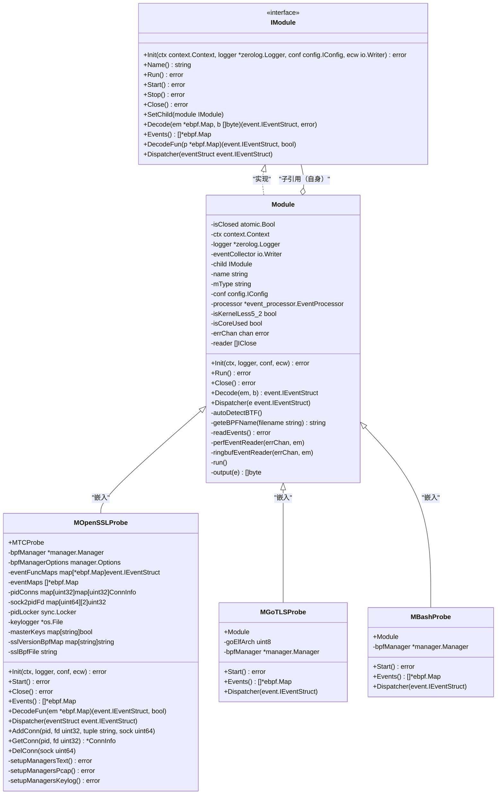
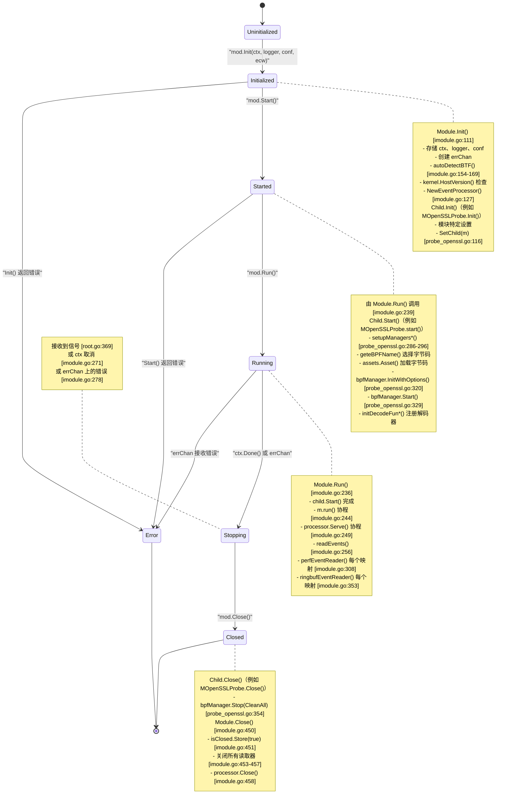
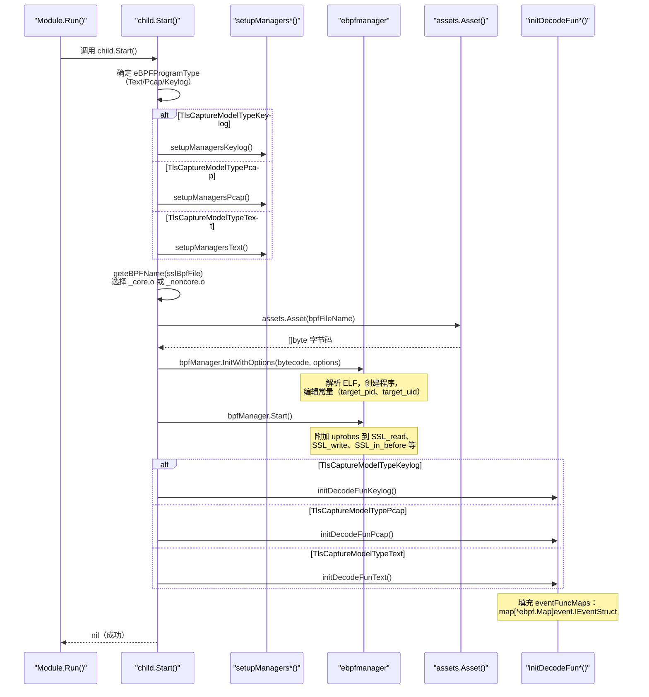
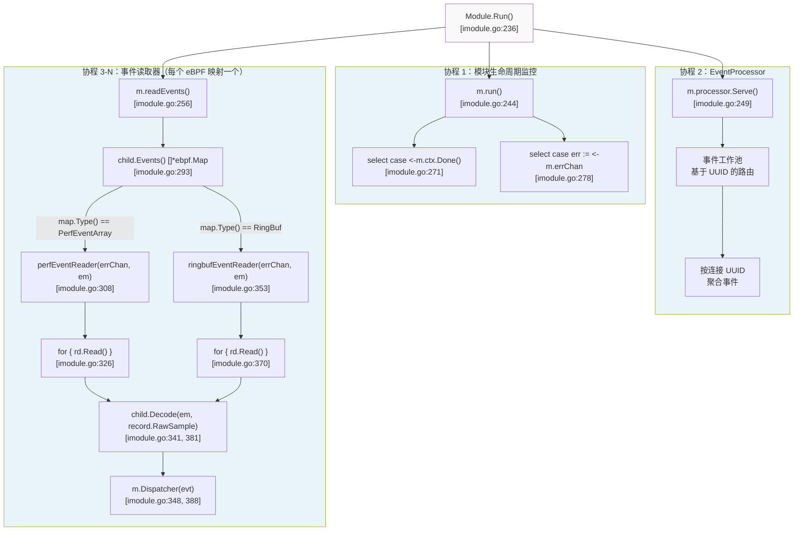
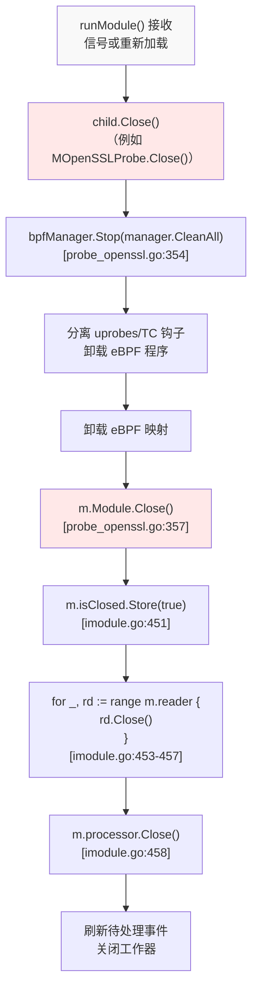
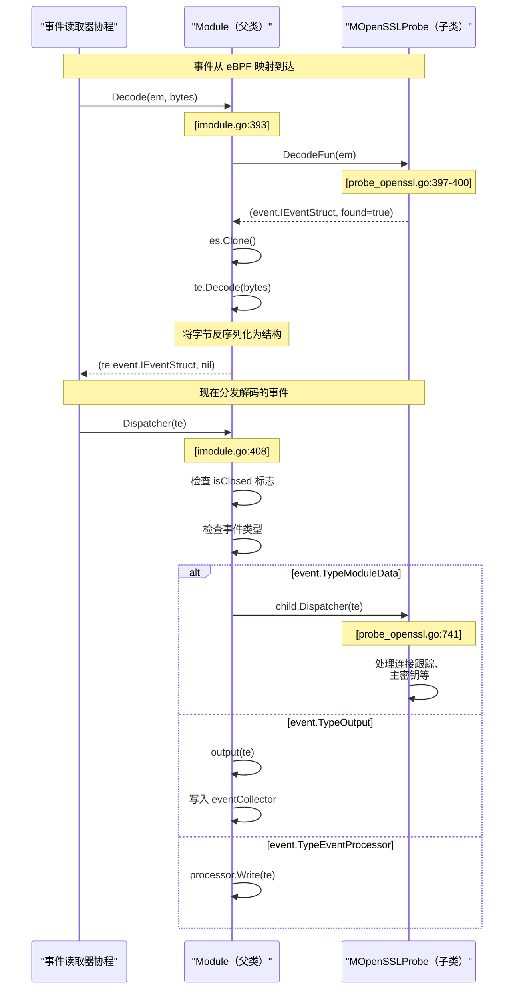
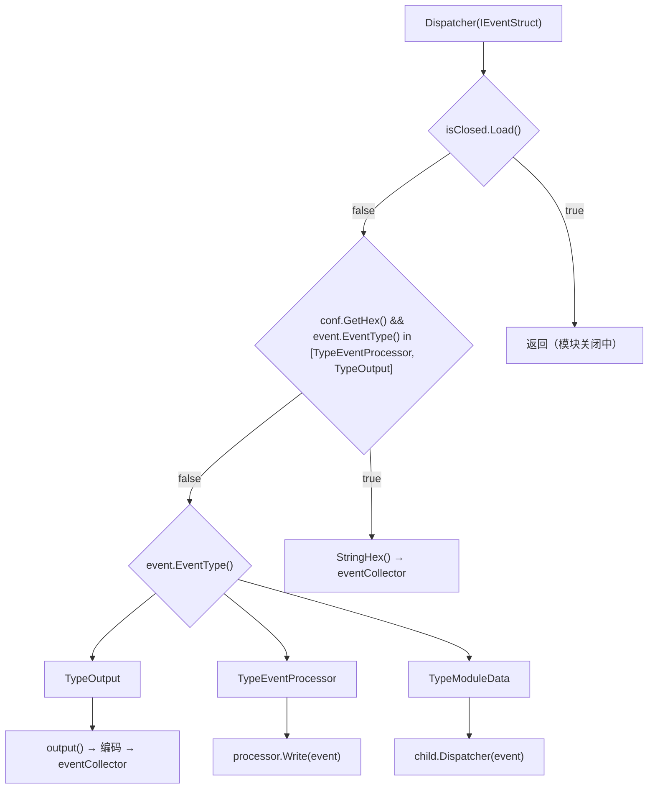
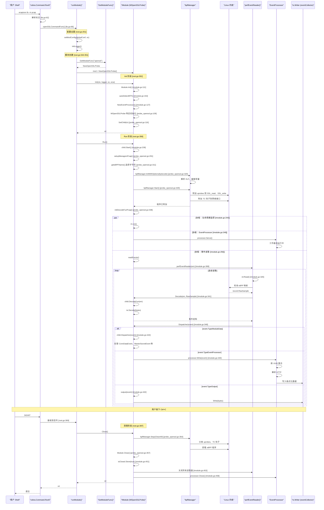

# 模块系统与生命周期

本文档解释了 eCapture 的模块系统架构，包括 `IModule` 接口规范、模块注册模式，以及从初始化到关闭的完整生命周期。所有捕获模块（TLS、Bash、MySQL 等）都实现了 `IModule` 接口并遵循标准生命周期：Init → Start → Run → Close。

关于模块如何配置自身的详细信息，请参阅第 2.4 节（配置系统）。关于模块内 eBPF 程序加载的信息，请参阅第 2.1 节（eBPF 引擎）。关于捕获后的事件处理，请参阅第 2.2 节（事件处理流程）。

## IModule 接口规范

`IModule` 接口定义了所有模块必须实现的标准规范。该接口支持整个系统中的多态模块处理，允许 CLI 和 HTTP API 以统一方式实例化和管理不同的捕获类型（TLS、Bash、MySQL 等）。

**核心接口定义**

`IModule` 接口在 [user/module/imodule.go:47-75](https://github.com/gojue/ecapture/blob/ca085d05/user/module/imodule.go#L47-L75) 中定义，并规定了所有模块必须实现的契约：

| 方法 | 返回类型 | 目的 | 调用方 |
|------|----------|------|--------|
| `Init(context.Context, *zerolog.Logger, config.IConfig, io.Writer) error` | `error` | 使用依赖项初始化模块 | [cli/cmd/root.go:352](https://github.com/gojue/ecapture/blob/ca085d05/cli/cmd/root.go#L352) 中的 `runModule()` |
| `Name() string` | `string` | 返回模块标识符（"openssl"、"gotls" 等） | 日志记录和错误消息 |
| `Run() error` | `error` | 启动事件处理管道 | [cli/cmd/root.go:358](https://github.com/gojue/ecapture/blob/ca085d05/cli/cmd/root.go#L358) 中的 `runModule()` |
| `Start() error` | `error` | 加载 eBPF 字节码并附加程序 | [user/module/imodule.go:239](https://github.com/gojue/ecapture/blob/ca085d05/user/module/imodule.go#L239) 中 `Module.Run()` 调用 |
| `Stop() error` | `error` | 优雅地停止捕获（保留供将来使用） | 当前未使用 |
| `Close() error` | `error` | 释放所有资源并清理 | [cli/cmd/root.go:387](https://github.com/gojue/ecapture/blob/ca085d05/cli/cmd/root.go#L387) 中的 `runModule()` |
| `SetChild(IModule)` | - | 注册具体实现（父子模式） | 模块自身的 `Init()` |
| `Events() []*ebpf.Map` | `[]*ebpf.Map` | 返回要读取事件的 eBPF 映射 | [user/module/imodule.go:293]() 中的 `readEvents()` |
| `DecodeFun(*ebpf.Map) (event.IEventStruct, bool)` | `(event.IEventStruct, bool)` | 获取特定映射的事件解码器 | [user/module/imodule.go:394](https://github.com/gojue/ecapture/blob/ca085d05/user/module/imodule.go#L394) 中的 `Decode()` |
| `Decode(*ebpf.Map, []byte) (event.IEventStruct, error)` | `(event.IEventStruct, error)` | 反序列化原始 eBPF 事件字节 | [user/module/imodule.go:341-345]() 中的事件读取器协程 |
| `Dispatcher(event.IEventStruct)` | - | 将解码的事件路由到处理程序 | [user/module/imodule.go:348](https://github.com/gojue/ecapture/blob/ca085d05/user/module/imodule.go#L348) 中的事件读取器协程 |

**来源：** [user/module/imodule.go:47-75](https://github.com/gojue/ecapture/blob/ca085d05/user/module/imodule.go#L47-L75)



**图示：IModule 接口和类层次结构**

父子模式允许基础 `Module` 结构提供通用功能（通过 `autoDetectBTF()` 进行 BTF 检测，通过 `perfEventReader()` 和 `ringbufEventReader()` 读取事件，通过 `run()` 进行上下文管理），同时通过存储在 `Module` 中的 `child` 字段将模块特定操作（通过 `Start()` 设置 eBPF 程序，通过 `DecodeFun()` 解码事件）委托给具体实现。

**来源：** [user/module/imodule.go:83-108](https://github.com/gojue/ecapture/blob/ca085d05/user/module/imodule.go#L83-L108)，[user/module/probe_openssl.go:83-106](https://github.com/gojue/ecapture/blob/ca085d05/user/module/probe_openssl.go#L83-L106)

## 模块注册与工厂模式

eCapture 使用工厂模式进行模块实例化，根据 CLI 命令动态加载模块。每个模块在包初始化期间注册一个工厂函数。

**注册机制**

```mermaid
graph TB
    subgraph PackageInit["包初始化（Go init()）"]
        Init1["probe_openssl.go:785-794<br/>init() 调用<br/>RegisteFunc(NewOpenSSLProbe)"]
        Init2["probe_gotls.go:init()<br/>RegisteFunc(NewGoTLSProbe)"]
        Init3["probe_bash.go:init()<br/>RegisteFunc(NewBashProbe)"]
    end
    
    subgraph Registry["模块注册表"]
        RegisteFunc["RegisteFunc(fn GetModuleFunc)<br/>user/module/module.go"]
        Registry["moduleRegistry<br/>map[string]GetModuleFunc<br/><br/>键：<br/>ModuleNameOpenssl = 'openssl'<br/>ModuleNameGotls = 'gotls'<br/>ModuleNameBash = 'bash'"]
    end
    
    subgraph CLIInvoke["CLI 调用"]
        CLI["cobra.Command.RunE<br/>cli/cmd/tls.go:62"]
        RunModule["runModule(modName, config)<br/>cli/cmd/root.go:250"]
        GetFunc["GetModuleFunc(modName)<br/>cli/cmd/root.go:344"]
    end
    
    subgraph Creation["模块创建"]
        Factory["modFunc()<br/>返回 IModule"]
        NewOpenSSL["NewOpenSSLProbe()<br/>probe_openssl.go:789<br/>返回 &MOpenSSLProbe{}"]
        Instance["IModule 实例"]
    end
    
    Init1 --> RegisteFunc
    Init2 --> RegisteFunc
    Init3 --> RegisteFunc
    RegisteFunc --> Registry
    
    CLI --> RunModule
    RunModule --> GetFunc
    GetFunc --> Registry
    Registry --> Factory
    Factory --> NewOpenSSL
    NewOpenSSL --> Instance
    
    style Registry fill:#f9f9f9
    style Factory fill:#f9f9f9
```

**图示：模块注册和工厂模式流程**

每个模块在 Go 包初始化期间注册一个工厂函数。当 CLI 调用命令（例如 `ecapture tls`）时，`runModule()` 函数在 `moduleRegistry` 中查找工厂并创建实例。

**来源：** [user/module/probe_openssl.go:785-794](https://github.com/gojue/ecapture/blob/ca085d05/user/module/probe_openssl.go#L785-L794)，[cli/cmd/root.go:344-347](https://github.com/gojue/ecapture/blob/ca085d05/cli/cmd/root.go#L344-L347)

**模块名称常量和 CLI 映射**

每个模块由模块源文件中定义的唯一字符串常量标识。这些常量用作 `moduleRegistry` 映射的键。

| CLI 命令 | 模块名称常量 | 值 | 工厂函数 | 目标 |
|----------|-------------|-----|----------|------|
| `ecapture tls` | `ModuleNameOpenssl` | `"openssl"` | `NewOpenSSLProbe()` | OpenSSL/BoringSSL (libssl.so) |
| `ecapture gotls` | `ModuleNameGotls` | `"gotls"` | `NewGoTLSProbe()` | Go crypto/tls 包 |
| `ecapture gnutls` | `ModuleNameGnutls` | `"gnutls"` | `NewGnuTLSProbe()` | GnuTLS (libgnutls.so) |
| `ecapture nspr` | `ModuleNameNspr` | `"nspr"` | `NewNsprProbe()` | NSS/NSPR (libnspr4.so) |
| `ecapture bash` | `ModuleNameBash` | `"bash"` | `NewBashProbe()` | Bash shell |
| `ecapture zsh` | `ModuleNameZsh` | `"zsh"` | `NewZshProbe()` | Zsh shell |
| `ecapture mysqld` | `ModuleNameMysqld` | `"mysqld"` | `NewMysqldProbe()` | MySQL 服务器 |
| `ecapture postgres` | `ModuleNamePostgres` | `"postgres"` | `NewPostgresProbe()` | PostgreSQL |

**CLI 命令到 runModule() 调用：**

- `ecapture tls` → `openSSLCommandFunc()` [cli/cmd/tls.go:62](https://github.com/gojue/ecapture/blob/ca085d05/cli/cmd/tls.go#L62) → `runModule(module.ModuleNameOpenssl, oc)` [cli/cmd/tls.go:66](https://github.com/gojue/ecapture/blob/ca085d05/cli/cmd/tls.go#L66)
- `ecapture gotls` → `goTLSCommandFunc()` [cli/cmd/gotls.go:52](https://github.com/gojue/ecapture/blob/ca085d05/cli/cmd/gotls.go#L52) → `runModule(module.ModuleNameGotls, goc)` [cli/cmd/gotls.go:57](https://github.com/gojue/ecapture/blob/ca085d05/cli/cmd/gotls.go#L57)
- `ecapture bash` → `bashCommandFunc()` [cli/cmd/bash.go:53](https://github.com/gojue/ecapture/blob/ca085d05/cli/cmd/bash.go#L53) → `runModule(module.ModuleNameBash, bc)` [cli/cmd/bash.go:54](https://github.com/gojue/ecapture/blob/ca085d05/cli/cmd/bash.go#L54)
- `ecapture mysqld` → `mysqldCommandFunc()` [cli/cmd/mysqld.go:47](https://github.com/gojue/ecapture/blob/ca085d05/cli/cmd/mysqld.go#L47) → `runModule(module.ModuleNameMysqld, myc)` [cli/cmd/mysqld.go:48](https://github.com/gojue/ecapture/blob/ca085d05/cli/cmd/mysqld.go#L48)

**来源：** [cli/cmd/tls.go:62-67](https://github.com/gojue/ecapture/blob/ca085d05/cli/cmd/tls.go#L62-L67)，[cli/cmd/gotls.go:52-58](https://github.com/gojue/ecapture/blob/ca085d05/cli/cmd/gotls.go#L52-L58)，[cli/cmd/bash.go:53-55](https://github.com/gojue/ecapture/blob/ca085d05/cli/cmd/bash.go#L53-L55)，[cli/cmd/mysqld.go:47-49](https://github.com/gojue/ecapture/blob/ca085d05/cli/cmd/mysqld.go#L47-L49)

## 模块生命周期阶段

模块生命周期由五个不同的阶段组成，每个阶段都有特定的职责。模块按顺序经过这些阶段，在每个转换点都有错误处理。



**图示：带代码引用的模块生命周期状态机**

**来源：** [cli/cmd/root.go:336-397](https://github.com/gojue/ecapture/blob/ca085d05/cli/cmd/root.go#L336-L397)，[user/module/imodule.go:110-171](https://github.com/gojue/ecapture/blob/ca085d05/user/module/imodule.go#L110-L171)，[user/module/imodule.go:236-262](https://github.com/gojue/ecapture/blob/ca085d05/user/module/imodule.go#L236-L262)，[user/module/probe_openssl.go:109-176](https://github.com/gojue/ecapture/blob/ca085d05/user/module/probe_openssl.go#L109-L176)，[user/module/probe_openssl.go:280-350](https://github.com/gojue/ecapture/blob/ca085d05/user/module/probe_openssl.go#L280-L350)，[user/module/probe_openssl.go:352-358](https://github.com/gojue/ecapture/blob/ca085d05/user/module/probe_openssl.go#L352-L358)

### 初始化阶段（Init）

`Init()` 方法由 [cli/cmd/root.go:352](https://github.com/gojue/ecapture/blob/ca085d05/cli/cmd/root.go#L352) 中的 `runModule()` 调用，执行依赖注入和环境设置。

**Module.Init() 基础职责（[user/module/imodule.go:111-171](https://github.com/gojue/ecapture/blob/ca085d05/user/module/imodule.go#L111-L171)）：**

| 操作 | 代码引用 | 目的 |
|------|----------|------|
| 设置 `isClosed` 标志 | [imodule.go:112](https://github.com/gojue/ecapture/blob/ca085d05/imodule.go#L112) | 使用原子布尔值跟踪关闭状态 |
| 存储 `ctx` | [imodule.go:113](https://github.com/gojue/ecapture/blob/ca085d05/imodule.go#L113) | 从 CLI 继承取消上下文 |
| 存储 `logger` | [imodule.go:114](https://github.com/gojue/ecapture/blob/ca085d05/imodule.go#L114) | 模块特定的 zerolog 实例 |
| 创建 `errChan` | [imodule.go:115](https://github.com/gojue/ecapture/blob/ca085d05/imodule.go#L115) | 用于异步错误的缓冲通道 |
| BTF 检测 | [imodule.go:154-169](https://github.com/gojue/ecapture/blob/ca085d05/imodule.go#L154-L169) | 调用 `autoDetectBTF()` 或使用配置 |
| 内核版本检查 | [imodule.go:140-148](https://github.com/gojue/ecapture/blob/ca085d05/imodule.go#L140-L148) | `kernel.HostVersion()` < 5.2 检测 |
| 设置 `eventOutputType` | [imodule.go:120-126](https://github.com/gojue/ecapture/blob/ca085d05/imodule.go#L120-L126) | 选择文本或 protobuf 编码 |
| 创建 `EventProcessor` | [imodule.go:127](https://github.com/gojue/ecapture/blob/ca085d05/imodule.go#L127) | `event_processor.NewEventProcessor(ecw, hex, tsize)` |
| 启动错误处理器协程 | [imodule.go:129-139](https://github.com/gojue/ecapture/blob/ca085d05/imodule.go#L129-L139) | 从 `processor.ErrorChan()` 读取 |

**BTF 自动检测逻辑（[user/module/imodule.go:173-190](https://github.com/gojue/ecapture/blob/ca085d05/user/module/imodule.go#L173-L190)）：**

```
func (m *Module) autoDetectBTF() {
    isContainer, err := ebpfenv.IsContainer()
    if isContainer {
        m.logger.Warn().Msg("检测到容器，BTF 自动检测可能失败")
    }
    enable, e := ebpfenv.IsEnableBTF()
    if enable {
        m.isCoreUsed = true  // 使用 CO-RE 字节码（_core.o）
    }
}
```

**模块特定的 Init 扩展**

具体模块调用 `m.Module.Init()`，然后添加自己的设置。来自 `MOpenSSLProbe.Init()` 的示例 [user/module/probe_openssl.go:109-176](https://github.com/gojue/ecapture/blob/ca085d05/user/module/probe_openssl.go#L109-L176)：

| 操作 | 代码引用 | 目的 |
|------|----------|------|
| 调用父 Init | [probe_openssl.go:111](https://github.com/gojue/ecapture/blob/ca085d05/probe_openssl.go#L111) | `m.Module.Init(ctx, logger, conf, ecw)` |
| 注册子模块 | [probe_openssl.go:116](https://github.com/gojue/ecapture/blob/ca085d05/probe_openssl.go#L116) | `m.Module.SetChild(m)` 用于委托 |
| 初始化映射 | [probe_openssl.go:117-122](https://github.com/gojue/ecapture/blob/ca085d05/probe_openssl.go#L117-L122) | `eventMaps`、`eventFuncMaps`、`pidConns`、`sock2pidFd`、`masterKeys` |
| 选择捕获模式 | [probe_openssl.go:128-154](https://github.com/gojue/ecapture/blob/ca085d05/probe_openssl.go#L128-L154) | 根据 `conf.Model` 选择 Text/Pcap/Keylog |
| 打开输出文件 | [probe_openssl.go:131-148](https://github.com/gojue/ecapture/blob/ca085d05/probe_openssl.go#L131-L148) | 创建 `keylogger` 或 pcap 文件句柄 |
| 同步时钟 | [probe_openssl.go:156-167](https://github.com/gojue/ecapture/blob/ca085d05/probe_openssl.go#L156-L167) | `unix.ClockGettime(CLOCK_MONOTONIC)` 用于时间戳转换 |
| 初始化 SSL 偏移映射 | [probe_openssl.go:172](https://github.com/gojue/ecapture/blob/ca085d05/probe_openssl.go#L172) | `initOpensslOffset()` 用于版本到字节码的映射 |

**来源：** [user/module/imodule.go:110-171](https://github.com/gojue/ecapture/blob/ca085d05/user/module/imodule.go#L110-L171)，[user/module/probe_openssl.go:109-176](https://github.com/gojue/ecapture/blob/ca085d05/user/module/probe_openssl.go#L109-L176)，[cli/cmd/root.go:352](https://github.com/gojue/ecapture/blob/ca085d05/cli/cmd/root.go#L352)

### Start 阶段

`Start()` 方法由 [user/module/imodule.go:239](https://github.com/gojue/ecapture/blob/ca085d05/user/module/imodule.go#L239) 中的 `Module.Run()` 调用，将 eBPF 程序加载到内核中。

**MOpenSSLProbe.Start() 流程（[user/module/probe_openssl.go:280-350](https://github.com/gojue/ecapture/blob/ca085d05/user/module/probe_openssl.go#L280-L350)）**



**图示：MOpenSSLProbe 的 Start 阶段序列**

**按捕获模式的管理器设置：**

| eBPFProgramType | 设置函数 | 使用的 eBPF 映射 | TC 钩子 | Uprobes |
|-----------------|----------|------------------|---------|---------|
| `TlsCaptureModelTypeText` | `setupManagersText()` | `events` | 否 | SSL_read/write |
| `TlsCaptureModelTypePcap` | `setupManagersPcap()` | `events`、`mastersecret_events`、`skb_events` | 是（egress/ingress） | SSL_read/write、SSL_in_before |
| `TlsCaptureModelTypeKeylog` | `setupManagersKeylog()` | `mastersecret_events` | 否 | 仅 SSL_in_before |

**eBPF 程序的常量编辑（[user/module/probe_openssl.go:361-395](https://github.com/gojue/ecapture/blob/ca085d05/user/module/probe_openssl.go#L361-L395)）**

`constantEditor()` 方法将运行时值注入 eBPF 全局变量：

| 常量名称 | 值来源 | 目的 |
|----------|--------|------|
| `target_pid` | `conf.GetPid()` | 按进程 ID 过滤事件（0 = 所有） |
| `target_uid` | `conf.GetUid()` | 按用户 ID 过滤事件（0 = 所有） |
| `less52` | `m.isKernelLess5_2` | 在内核 < 5.2 上禁用 PID/UID 过滤 |

**来源：** [user/module/probe_openssl.go:280-350](https://github.com/gojue/ecapture/blob/ca085d05/user/module/probe_openssl.go#L280-L350)，[user/module/probe_openssl.go:361-395](https://github.com/gojue/ecapture/blob/ca085d05/user/module/probe_openssl.go#L361-L395)，[user/module/imodule.go:239](https://github.com/gojue/ecapture/blob/ca085d05/user/module/imodule.go#L239)

### Run 阶段

`Run()` 方法由 [cli/cmd/root.go:358](https://github.com/gojue/ecapture/blob/ca085d05/cli/cmd/root.go#L358) 中的 `runModule()` 调用，启动用于事件处理的并发协程。

**Run 阶段架构**



**图示：带代码引用的 Run 阶段协程架构**

**事件读取器实现细节**

[user/module/imodule.go:285-306](https://github.com/gojue/ecapture/blob/ca085d05/user/module/imodule.go#L285-L306) 中的 `readEvents()` 方法遍历 `child.Events()` 返回的所有 eBPF 映射，并根据映射类型创建适当的读取器：

**Perf Event Array 读取器（[user/module/imodule.go:308-351](https://github.com/gojue/ecapture/blob/ca085d05/user/module/imodule.go#L308-L351)）**

| 操作 | 代码行 | 描述 |
|------|--------|------|
| 创建读取器 | `perf.NewReader(em, m.conf.GetPerCpuMapSize())` [imodule.go:310](https://github.com/gojue/ecapture/blob/ca085d05/imodule.go#L310) | 分配每 CPU 环形缓冲区 |
| 启动协程 | `go func() { ... }()` [imodule.go:316](https://github.com/gojue/ecapture/blob/ca085d05/imodule.go#L316) | 每个映射一个协程 |
| 读取事件 | `record, err := rd.Read()` [imodule.go:326](https://github.com/gojue/ecapture/blob/ca085d05/imodule.go#L326) | 从环形缓冲区阻塞读取 |
| 检查丢失样本 | `if record.LostSamples != 0` [imodule.go:335](https://github.com/gojue/ecapture/blob/ca085d05/imodule.go#L335) | 记录缓冲区溢出 |
| 解码 | `m.child.Decode(em, record.RawSample)` [imodule.go:341](https://github.com/gojue/ecapture/blob/ca085d05/imodule.go#L341) | 将字节反序列化为事件结构 |
| 分发 | `m.Dispatcher(evt)` [imodule.go:348](https://github.com/gojue/ecapture/blob/ca085d05/imodule.go#L348) | 路由到事件处理程序 |
| 检查取消 | `case <-m.ctx.Done()` [imodule.go:320](https://github.com/gojue/ecapture/blob/ca085d05/imodule.go#L320) | 在上下文取消时退出 |

**Ring Buffer 读取器（[user/module/imodule.go:353-391](https://github.com/gojue/ecapture/blob/ca085d05/user/module/imodule.go#L353-L391)）**

类似的流程，但在 [imodule.go:354](https://github.com/gojue/ecapture/blob/ca085d05/imodule.go#L354) 处使用 `ringbuf.NewReader(em)` 而不是 perf 读取器。在较新的内核（5.8+）上，Ring Buffer 因其更好的性能而优先使用。

**来源：** [user/module/imodule.go:236-262](https://github.com/gojue/ecapture/blob/ca085d05/user/module/imodule.go#L236-L262)，[user/module/imodule.go:285-391](https://github.com/gojue/ecapture/blob/ca085d05/user/module/imodule.go#L285-L391)，[cli/cmd/root.go:358](https://github.com/gojue/ecapture/blob/ca085d05/cli/cmd/root.go#L358)

### Stop 和清理阶段

`Close()` 方法由 [cli/cmd/root.go:387](https://github.com/gojue/ecapture/blob/ca085d05/cli/cmd/root.go#L387) 中的 `runModule()` 在关闭期间调用，按初始化的相反顺序执行资源清理。

**清理序列**



**图示：模块清理序列**

**MOpenSSLProbe.Close() 实现（[user/module/probe_openssl.go:352-358](https://github.com/gojue/ecapture/blob/ca085d05/user/module/probe_openssl.go#L352-L358)）**

```go
func (m *MOpenSSLProbe) Close() error {
    m.logger.Info().Msg("module close.")
    if err := m.bpfManager.Stop(manager.CleanAll); err != nil {
        return fmt.Errorf("couldn't stop manager %w .", err)
    }
    return m.Module.Close()  // 委托给父类
}
```

**Module.Close() 实现（[user/module/imodule.go:450-460](https://github.com/gojue/ecapture/blob/ca085d05/user/module/imodule.go#L450-L460)）**

| 步骤 | 代码 | 目的 |
|------|------|------|
| 1 | `m.isClosed.Store(true)` | 原子地设置关闭标志以防止来自 `Dispatcher()` 的新事件 |
| 2 | `for _, iClose := range m.reader` | 遍历 perf/ring buffer 读取器 |
| 3 | `iClose.Close()` | 停止读取器协程（导致 `Read()` 返回错误） |
| 4 | `m.processor.Close()` | 刷新聚合的事件并关闭工作器池 |
| 5 | `return err` | 传播任何错误 |

**额外的模块特定清理**

某些模块在调用 `Module.Close()` 之前执行额外的清理：

- **MOpenSSLProbe**：如果在 keylog 模式下，关闭 `keylogger` 文件句柄
- **MTCProbe**（MOpenSSLProbe 的父类）：关闭 pcapng 写入器，刷新 DSB（解密密钥块）
- 连接跟踪映射（`pidConns`、`sock2pidFd`）被垃圾回收

**来源：** [user/module/imodule.go:450-460](https://github.com/gojue/ecapture/blob/ca085d05/user/module/imodule.go#L450-L460)，[user/module/probe_openssl.go:352-358](https://github.com/gojue/ecapture/blob/ca085d05/user/module/probe_openssl.go#L352-L358)，[cli/cmd/root.go:387](https://github.com/gojue/ecapture/blob/ca085d05/cli/cmd/root.go#L387)

## 基础 Module 实现

[user/module/imodule.go:83-108](https://github.com/gojue/ecapture/blob/ca085d05/user/module/imodule.go#L83-L108) 处的 `Module` 结构实现了所有捕获模块使用的通用操作：

**Module 基类中的共享功能**

| 功能 | 方法 | 实现位置 | 目的 |
|------|------|----------|------|
| BTF 检测 | `autoDetectBTF()` | [imodule.go:173-190](https://github.com/gojue/ecapture/blob/ca085d05/imodule.go#L173-L190) | 检测内核是否支持用于 CO-RE 字节码的 BTF |
| 字节码文件选择 | `geteBPFName(filename string) string` | [imodule.go:191-214](https://github.com/gojue/ecapture/blob/ca085d05/imodule.go#L191-L214) | 根据 BTF 支持添加 `_core.o` 或 `_noncore.o` 后缀 |
| 事件读取（Perf） | `perfEventReader(errChan, em)` | [imodule.go:308-351](https://github.com/gojue/ecapture/blob/ca085d05/imodule.go#L308-L351) | 为 `ebpf.PerfEventArray` 映射创建 perf 读取器协程 |
| 事件读取（Ring） | `ringbufEventReader(errChan, em)` | [imodule.go:353-391](https://github.com/gojue/ecapture/blob/ca085d05/imodule.go#L353-L391) | 为 `ebpf.RingBuf` 映射创建 ring buffer 读取器协程 |
| 事件解码 | `Decode(em *ebpf.Map, b []byte)` | [imodule.go:393-406]() | 使用 `child.DecodeFun(em)` 反序列化字节 |
| 事件路由 | `Dispatcher(e event.IEventStruct)` | [imodule.go:408-448](https://github.com/gojue/ecapture/blob/ca085d05/imodule.go#L408-L448) | 根据 `e.EventType()` 路由到输出、处理器或子模块 |
| 输出编码 | `output(e event.IEventStruct)` | [imodule.go:461-479](https://github.com/gojue/ecapture/blob/ca085d05/imodule.go#L461-L479) | 编码为文本字符串或 protobuf `LogEntry` |
| 生命周期监控 | `run()` | [imodule.go:268-283](https://github.com/gojue/ecapture/blob/ca085d05/imodule.go#L268-L283) | 监控 `ctx.Done()` 和 `errChan` 以获取关闭信号 |
| 读取器管理 | `readEvents()` | [imodule.go:285-306](https://github.com/gojue/ecapture/blob/ca085d05/imodule.go#L285-L306) | 遍历 `child.Events()` 并生成读取器 |

**父子委托模式**

`Module` 基类使用组合和委托来共享通用代码，同时允许模块特定的自定义。`child IModule` 字段存储对具体模块（例如 `MOpenSSLProbe`）的引用。

**委托的工作原理**



**图示：Decode 和 Dispatcher 的委托流程**

**SetChild 注册模式**

每个具体模块在初始化期间调用 `SetChild(m)` 来注册自身：

**来自 MOpenSSLProbe.Init() 的示例（[user/module/probe_openssl.go:109-176](https://github.com/gojue/ecapture/blob/ca085d05/user/module/probe_openssl.go#L109-L176)）**

```go
func (m *MOpenSSLProbe) Init(ctx context.Context, logger *zerolog.Logger, 
                             conf config.IConfig, ecw io.Writer) error {
    // 1. 首先调用父类 Init
    err = m.Module.Init(ctx, logger, conf, ecw)
    if err != nil {
        return err
    }
    
    // 2. 注册自身为子模块以进行委托
    m.Module.SetChild(m)  // 第 116 行
    
    // 3. 模块特定的初始化
    m.eventMaps = make([]*ebpf.Map, 0, 2)
    m.eventFuncMaps = make(map[*ebpf.Map]event.IEventStruct)
    m.pidConns = make(map[uint32]map[uint32]ConnInfo)
    // ... 更多设置
}
```

此模式允许父类 `Module` 回调子类的方法，如 `Start()`、`Events()`、`DecodeFun()` 和 `Dispatcher()`。

**来源：** [user/module/imodule.go:393-406](https://github.com/gojue/ecapture/blob/ca085d05/user/module/imodule.go#L393-L406)，[user/module/imodule.go:408-448](https://github.com/gojue/ecapture/blob/ca085d05/user/module/imodule.go#L408-L448)，[user/module/probe_openssl.go:109-176](https://github.com/gojue/ecapture/blob/ca085d05/user/module/probe_openssl.go#L109-L176)

## 模块配置集成

模块通过 `IConfig` 接口接收配置，允许运行时行为自定义。每个模块类型都有相应的配置结构。

**配置到模块的映射：**

| 模块 | 配置类型 | CLI 命令 | 关键标志 |
|------|---------|----------|---------|
| MOpenSSLProbe | `OpensslConfig` | `tls` | `--libssl`、`--model`、`--pcapfile` |
| MGoTLSProbe | `GoTLSConfig` | `gotls` | `--elfpath`、`--model` |
| MGnuTLSProbe | `GnutlsConfig` | `gnutls` | `--gnutls`、`--ssl_version` |
| MBashProbe | `BashConfig` | `bash` | `--bash`、`--errnumber` |
| MMysqldProbe | `MysqldConfig` | `mysqld` | `--mysqld`、`--offset` |
| MPostgresProbe | `PostgresConfig` | `postgres` | `--postgres` |

**全局配置应用：**

[cli/cmd/root.go:156-175](https://github.com/gojue/ecapture/blob/ca085d05/cli/cmd/root.go#L156-L175) 将全局设置应用于模块配置：

```
func setModConfig(globalConf config.BaseConfig, modConf config.IConfig) {
    modConf.SetPid(globalConf.Pid)
    modConf.SetUid(globalConf.Uid)
    modConf.SetDebug(globalConf.Debug)
    modConf.SetHex(globalConf.IsHex)
    modConf.SetBTF(globalConf.BtfMode)
    modConf.SetPerCpuMapSize(globalConf.PerCpuMapSize)
    modConf.SetTruncateSize(globalConf.TruncateSize)
    ...
}
```

**运行时配置更新：**

HTTP 服务器通过 `POST /config` 支持运行时配置重新加载 [cli/cmd/root.go:375-396](https://github.com/gojue/ecapture/blob/ca085d05/cli/cmd/root.go#L375-L396)：

1. 在 `reRloadConfig` 通道上接收新配置
2. 调用 `mod.Close()` 停止当前模块
3. `goto reload` 跳回初始化
4. 应用新配置并重新启动模块

**来源：** [cli/cmd/root.go:156-175](https://github.com/gojue/ecapture/blob/ca085d05/cli/cmd/root.go#L156-L175)，[cli/cmd/root.go:336-397](https://github.com/gojue/ecapture/blob/ca085d05/cli/cmd/root.go#L336-L397)，[user/config/iconfig.go:24-70](https://github.com/gojue/ecapture/blob/ca085d05/user/config/iconfig.go#L24-L70)

## 事件分发和处理

`Dispatcher()` 方法根据事件类型将解码的事件路由到适当的处理程序。这实现了三路路由策略。



**图示：事件分发路由逻辑**

**事件类型类别：**

[user/module/imodule.go:408-448](https://github.com/gojue/ecapture/blob/ca085d05/user/module/imodule.go#L408-L448) 按类型路由事件：

- **`TypeOutput`**：准备显示的最终格式化事件 → `eventCollector.Write()`
- **`TypeEventProcessor`**：需要聚合/解析的事件 → `processor.Write()`
- **`TypeModuleData`**：模块特定数据（连接、主密钥） → `child.Dispatcher()`

**模块特定的 Dispatcher 实现**

每个具体模块实现 `Dispatcher()` 来处理其特定的事件类型。基础 `Module.Dispatcher()` 为 `TypeModuleData` 事件调用 `child.Dispatcher()`。

**MOpenSSLProbe.Dispatcher() 实现（[user/module/probe_openssl.go:741-762](https://github.com/gojue/ecapture/blob/ca085d05/user/module/probe_openssl.go#L741-L762)）**

```go
func (m *MOpenSSLProbe) Dispatcher(eventStruct event.IEventStruct) {
    switch ev := eventStruct.(type) {
    case *event.ConnDataEvent:
        if ev.IsDestroy == 0 {
            m.AddConn(ev.Pid, ev.Fd, ev.Tuple, ev.Sock)
        } else {
            m.DelConn(ev.Sock)
        }
    case *event.MasterSecretEvent:
        m.saveMasterSecret(ev)
    case *event.MasterSecretBSSLEvent:
        m.saveMasterSecretBSSL(ev)
    case *event.TcSkbEvent:
        err := m.dumpTcSkb(ev)
        if err != nil {
            m.logger.Error().Err(err).Msg("save packet error.")
        }
    case *event.SSLDataEvent:
        m.dumpSslData(ev)
    }
}
```

**MOpenSSLProbe 的事件类型处理程序映射：**

| 事件类型 | 处理方法 | 目的 |
|---------|---------|------|
| `*event.ConnDataEvent` | `AddConn()` / `DelConn()` | 跟踪套接字 FD 到元组的映射 |
| `*event.MasterSecretEvent` | `saveMasterSecret()` | 将 TLS 1.2/1.3 密钥写入 keylog 文件 |
| `*event.MasterSecretBSSLEvent` | `saveMasterSecretBSSL()` | 将 BoringSSL 密钥写入 keylog 文件 |
| `*event.TcSkbEvent` | `dumpTcSkb()` | 将数据包写入 PCAP 文件 |
| `*event.SSLDataEvent` | `dumpSslData()` | 查找连接信息并写入 `processor` |

**连接跟踪方法：**

- `AddConn(pid, fd, tuple, sock)` [probe_openssl.go:406-424](https://github.com/gojue/ecapture/blob/ca085d05/probe_openssl.go#L406-L424)：存储 `(pid, fd) → (tuple, sock)` 的映射
- `GetConn(pid, fd)` [probe_openssl.go:472-488](https://github.com/gojue/ecapture/blob/ca085d05/probe_openssl.go#L472-L488)：检索套接字 FD 的连接信息
- `DelConn(sock)` [probe_openssl.go:463-470](https://github.com/gojue/ecapture/blob/ca085d05/probe_openssl.go#L463-L470)：安排延迟删除（3 秒延迟）
- `DestroyConn(sock)` [probe_openssl.go:426-460](https://github.com/gojue/ecapture/blob/ca085d05/probe_openssl.go#L426-L460)：立即从映射中删除连接

**来源：** [user/module/imodule.go:408-448](https://github.com/gojue/ecapture/blob/ca085d05/user/module/imodule.go#L408-L448)，[user/module/probe_openssl.go:741-762](https://github.com/gojue/ecapture/blob/ca085d05/user/module/probe_openssl.go#L741-L762)，[user/module/probe_openssl.go:406-488](https://github.com/gojue/ecapture/blob/ca085d05/user/module/probe_openssl.go#L406-L488)

## 完整系统集成流程

此序列图展示了从 CLI 命令执行到模块初始化、eBPF 程序附加、事件捕获和清理的完整生命周期。



**图示：从 CLI 到内核的完整模块集成序列**

**关键集成点：**

| 阶段 | 入口点 | 关键操作 |
|------|--------|---------|
| **CLI 解析** | `cobra.Command.RunE` | 解析标志，调用 `runModule()` |
| **模块创建** | `runModule()` [root.go:344-351](https://github.com/gojue/ecapture/blob/ca085d05/root.go#L344-L351) | `GetModuleFunc()` → 工厂函数 → 模块实例 |
| **初始化** | `mod.Init()` [root.go:352](https://github.com/gojue/ecapture/blob/ca085d05/root.go#L352) | 父类 `Module.Init()` → 子类特定初始化 → `SetChild()` |
| **eBPF 加载** | `mod.Run()` [root.go:358](https://github.com/gojue/ecapture/blob/ca085d05/root.go#L358) | `Start()` → `setupManagers()` → `bpfManager.InitWithOptions()` → `bpfManager.Start()` |
| **事件捕获** | `Run()` 中的协程 | `readEvents()` → `perfEventReader()` → `Decode()` → `Dispatcher()` |
| **事件处理** | `processor.Serve()` | 工作器池按 UUID 聚合事件，解析协议 |
| **清理** | `mod.Close()` [root.go:387](https://github.com/gojue/ecapture/blob/ca085d05/root.go#L387) | `bpfManager.Stop()` → 分离程序 → 关闭读取器 → 刷新处理器 |

**来源：** [cli/cmd/root.go:249-403](https://github.com/gojue/ecapture/blob/ca085d05/cli/cmd/root.go#L249-L403)，[cli/cmd/tls.go:62-67](https://github.com/gojue/ecapture/blob/ca085d05/cli/cmd/tls.go#L62-L67)，[user/module/imodule.go:236-262](https://github.com/gojue/ecapture/blob/ca085d05/user/module/imodule.go#L236-L262)，[user/module/probe_openssl.go:280-350](https://github.com/gojue/ecapture/blob/ca085d05/user/module/probe_openssl.go#L280-L350)

## 模块列表和功能

下表总结了所有可用模块及其关键特性：

| 模块 | 名称常量 | 主要目标 | eBPF 程序 | 事件类型 | 输出模式 |
|------|---------|---------|----------|---------|---------|
| MOpenSSLProbe | `openssl` | libssl.so、libcrypto.so | Uprobes (SSL_read/write)、TC | SSLDataEvent、MasterSecretEvent、TcSkbEvent、ConnDataEvent | Text、PCAP、Keylog |
| MGoTLSProbe | `gotls` | Go crypto/tls | Uprobes (crypto/tls 函数)、TC | TlsDataEvent、MasterSecretEvent、TcSkbEvent | Text、PCAP、Keylog |
| MGnuTLSProbe | `gnutls` | libgnutls.so | Uprobes (gnutls_record 函数)、TC | SSLDataEvent、MasterSecretEvent | Text、PCAP、Keylog |
| MNSSProbe | `nspr` | libnspr4.so | Uprobes (PR_Read/Write) | NsprDataEvent | Text |
| MBashProbe | `bash` | /bin/bash | Uprobes (readline 函数) | BashEvent | Text |
| MZshProbe | `zsh` | /bin/zsh | Uprobes (readline 函数) | ZshEvent | Text |
| MMysqldProbe | `mysqld` | mysqld 二进制 | Uprobes (dispatch_command) | MysqldEvent | Text |
| MPostgresProbe | `postgres` | postgres 二进制 | Uprobes (PostgresMain) | PostgresEvent | Text |

**来源：** [user/module/](https://github.com/gojue/ecapture/blob/ca085d05/user/module/) 目录中的模块文件