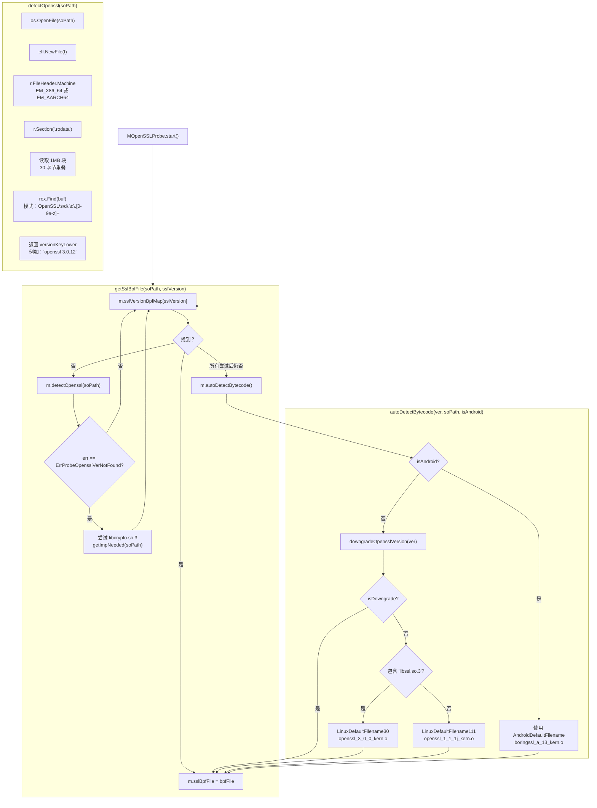
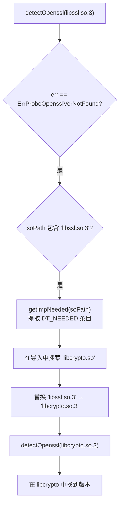
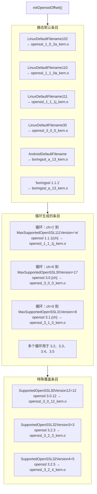
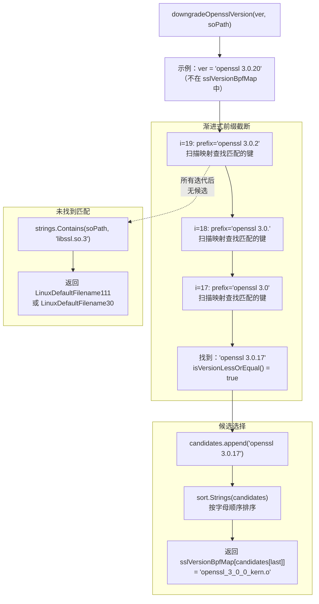
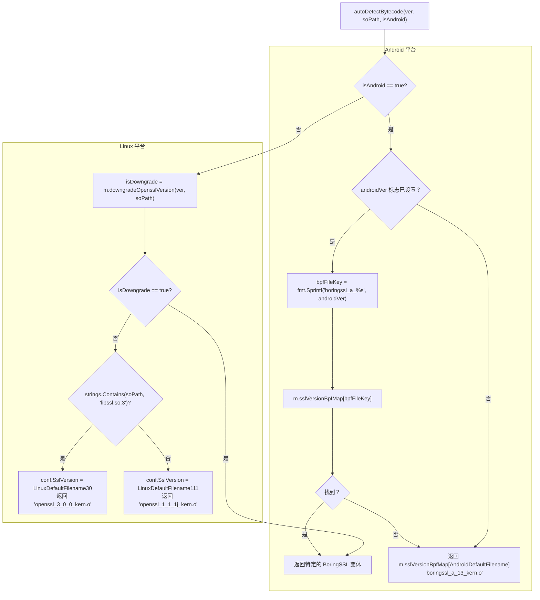
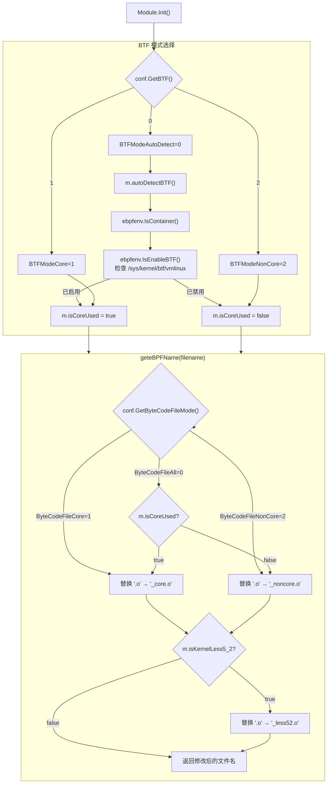
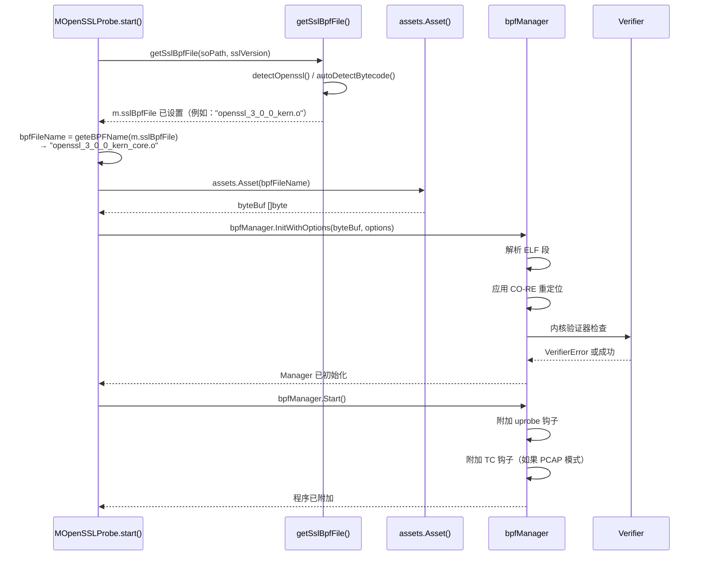

# 版本检测与字节码选择

## 目的与范围

版本检测与字节码选择系统使 eCapture 能够在运行时自动识别 SSL/TLS 库版本并选择兼容的 eBPF 字节码。这消除了大多数情况下手动指定版本的需要。该系统通过 ELF 解析、版本映射和回退策略处理超过 20 种不同的 OpenSSL/BoringSSL 变体。

本页记录了 `MOpenSSLProbe` 版本检测机制、`sslVersionBpfMap` 映射结构以及 `detectOpenssl()` / `autoDetectBytecode()` 选择算法。

相关章节：[eBPF 引擎](2.1-ebpf-engine.md) 介绍字节码加载，[模块系统与生命周期](2.4-module-system-and-lifecycle.md) 介绍初始化流程，[构建系统](../5-development-guide/5.1-build-system.md) 介绍字节码编译。

## 系统概述

eCapture 维护 22 个 OpenSSL/BoringSSL eBPF 字节码变体（包括 CO-RE 和 non-CO-RE 版本共 44 个文件）以支持：
- **OpenSSL**：1.0.2a - 3.5.4（跨版本系列的 21 个变体）
- **BoringSSL**：Android 12-16 和非 Android 版本（5 个变体）

每个版本都有独特的内部结构偏移量，需要特定版本的字节码。`MOpenSSLProbe` 结构体通过三个核心函数管理此选择：
- `detectOpenssl()`：解析 ELF `.rodata` 段获取版本字符串
- `getSslBpfFile()`：将检测到的版本映射到字节码文件
- `autoDetectBytecode()`：当无法精确匹配时应用回退策略

**来源：** [variables.mk:189-228](https://github.com/gojue/ecapture/blob/0766a93b/variables.mk#L189-L228), [user/module/probe_openssl_lib.go:30-42](https://github.com/gojue/ecapture/blob/0766a93b/user/module/probe_openssl_lib.go#L30-L42), [user/module/probe_openssl.go:100-106](https://github.com/gojue/ecapture/blob/0766a93b/user/module/probe_openssl.go#L100-L106)

## 版本检测架构

**高层检测流程**



**来源：** [user/module/probe_openssl.go:178-278](https://github.com/gojue/ecapture/blob/0766a93b/user/module/probe_openssl.go#L178-L278), [user/module/probe_openssl_lib.go:189-282](https://github.com/gojue/ecapture/blob/0766a93b/user/module/probe_openssl_lib.go#L189-L282), [user/module/probe_openssl_lib.go:284-317](https://github.com/gojue/ecapture/blob/0766a93b/user/module/probe_openssl_lib.go#L284-L317)

## ELF 解析与版本提取

`detectOpenssl()` 函数使用 ELF 解析从 SSL/TLS 共享库的 `.rodata` 段提取版本字符串。

### 实现细节

**函数签名：**
```go
func (m *MOpenSSLProbe) detectOpenssl(soPath string) (string, error)
```

**处理过程：**

1. **打开 ELF 文件**：`elf.NewFile(f)` 位于 [user/module/probe_openssl_lib.go:194](https://github.com/gojue/ecapture/blob/0766a93b/user/module/probe_openssl_lib.go#L194)
2. **架构检查**：验证 `r.FileHeader.Machine` 是 `EM_X86_64` 或 `EM_AARCH64`，位于 [user/module/probe_openssl_lib.go:199-204](https://github.com/gojue/ecapture/blob/0766a93b/user/module/probe_openssl_lib.go#L199-L204)
3. **定位 .rodata**：`r.Section(".rodata")` 返回包含只读数据的段，位于 [user/module/probe_openssl_lib.go:206](https://github.com/gojue/ecapture/blob/0766a93b/user/module/probe_openssl_lib.go#L206)
4. **流式读取**：1MB 缓冲区，30 字节重叠（`OpenSslVersionLen = 30`），位于 [user/module/probe_openssl_lib.go:236-269](https://github.com/gojue/ecapture/blob/0766a93b/user/module/probe_openssl_lib.go#L236-L269)
5. **模式匹配**：正则表达式 `(OpenSSL\s\d\.\d\.[0-9a-z]+)`，位于 [user/module/probe_openssl_lib.go:231]()
6. **标准化**：`strings.ToLower(versionKey)` 返回小写版本，位于 [user/module/probe_openssl_lib.go:279](https://github.com/gojue/ecapture/blob/0766a93b/user/module/probe_openssl_lib.go#L279)

### 边缘情况处理

| 场景 | 代码位置 | 行为 |
|------|---------|------|
| 版本跨越缓冲区边界 | [user/module/probe_openssl_lib.go:261](https://github.com/gojue/ecapture/blob/0766a93b/user/module/probe_openssl_lib.go#L261) | 30 字节重叠防止分割 |
| `.rodata` 未找到 | [user/module/probe_openssl_lib.go:208-210](https://github.com/gojue/ecapture/blob/0766a93b/user/module/probe_openssl_lib.go#L208-L210) | 返回错误和消息 |
| 无正则匹配 | [user/module/probe_openssl_lib.go:275-277](https://github.com/gojue/ecapture/blob/0766a93b/user/module/probe_openssl_lib.go#L275-L277) | 返回 `ErrProbeOpensslVerNotFound` |
| BoringSSL（无版本） | [user/module/probe_openssl.go:214-244](https://github.com/gojue/ecapture/blob/0766a93b/user/module/probe_openssl.go#L214-L244) | 回退到 Android 检测 |

**提取示例：**
- 输入：`"OpenSSL 1.1.1j  16 Feb 2021"` → 输出：`"openssl 1.1.1j"`
- 输入：`"OpenSSL 3.2.0 23 Nov 2023"` → 输出：`"openssl 3.2.0"`
- 输入：`"BoringSSL"` → 输出：`ErrProbeOpensslVerNotFound`

**来源：** [user/module/probe_openssl_lib.go:189-282](https://github.com/gojue/ecapture/blob/0766a93b/user/module/probe_openssl_lib.go#L189-L282), [user/module/probe_openssl_lib.go:30-42](https://github.com/gojue/ecapture/blob/0766a93b/user/module/probe_openssl_lib.go#L30-L42)

### OpenSSL 3.x 的 libcrypto.so 回退

当 `detectOpenssl()` 在 `libssl.so.3` 上失败时，系统尝试解析 `libcrypto.so.3`：



**原理：** OpenSSL 3.x 将功能分散在 `libssl.so.3` 和 `libcrypto.so.3` 中。版本字符串可能位于任一库中。`getImpNeeded()` 函数位于 [user/module/probe_openssl_lib.go:319-339](https://github.com/gojue/ecapture/blob/0766a93b/user/module/probe_openssl_lib.go#L319-L339)，使用 `elf.DynString(elf.DT_NEEDED)` 查找链接的库。

**来源：** [user/module/probe_openssl.go:214-244](https://github.com/gojue/ecapture/blob/0766a93b/user/module/probe_openssl.go#L214-L244), [user/module/probe_openssl_lib.go:319-339](https://github.com/gojue/ecapture/blob/0766a93b/user/module/probe_openssl_lib.go#L319-L339)

## 版本到字节码映射系统

`sslVersionBpfMap` 映射（类型为 `map[string]string`）存储所有版本到字节码的关联。`initOpensslOffset()` 函数位于 [user/module/probe_openssl_lib.go:73-187]()，在 `MOpenSSLProbe.Init()` 期间填充此映射。

### 映射表结构

| 版本系列 | 版本范围 | 字节码文件 | 注释 |
|---------|---------|-----------|------|
| OpenSSL 1.0.2 | 1.0.2a - 1.0.2u | `openssl_1_0_2a_kern.o` | 所有 1.0.2 版本共享偏移量 |
| OpenSSL 1.1.0 | 1.1.0a - 1.1.0l | `openssl_1_1_0a_kern.o` | 所有 1.1.0 版本共享偏移量 |
| OpenSSL 1.1.1a | 仅 1.1.1a | `openssl_1_1_1a_kern.o` | 独特的偏移量组 |
| OpenSSL 1.1.1b-c | 1.1.1b - 1.1.1c | `openssl_1_1_1b_kern.o` | 第二偏移量组 |
| OpenSSL 1.1.1d-i | 1.1.1d - 1.1.1i | `openssl_1_1_1d_kern.o` | 第三偏移量组 |
| OpenSSL 1.1.1j+ | 1.1.1j - 1.1.1w | `openssl_1_1_1j_kern.o` | 最常见的 1.1.1 变体 |
| OpenSSL 3.0.x | 3.0.0 - 3.0.11, 3.0.13+ | `openssl_3_0_0_kern.o` | 3.0 系列默认版本 |
| OpenSSL 3.0.12 | 仅 3.0.12 | `openssl_3_0_12_kern.o` | 具有独特偏移量的特殊情况 |
| OpenSSL 3.1.x | 3.1.0 - 3.1.8 | `openssl_3_1_0_kern.o` | 与 3.0 系列共享基础 |
| OpenSSL 3.2.0-2 | 3.2.0 - 3.2.2 | `openssl_3_2_0_kern.o` | 早期 3.2 系列 |
| OpenSSL 3.2.3 | 仅 3.2.3 | `openssl_3_2_3_kern.o` | 结构变化 |
| OpenSSL 3.2.5 | 仅 3.2.5 | `openssl_3_2_4_kern.o` | 额外变化 |
| OpenSSL 3.3.0-1 | 3.3.0 - 3.3.1 | `openssl_3_3_0_kern.o` | 早期 3.3 系列 |
| OpenSSL 3.3.2 | 仅 3.3.2 | `openssl_3_3_2_kern.o` | 中期系列变化 |
| OpenSSL 3.3.3-4 | 3.3.3 - 3.3.4 | `openssl_3_3_3_kern.o` | 最新 3.3 系列 |
| OpenSSL 3.4.0 | 仅 3.4.0 | `openssl_3_4_0_kern.o` | 初始 3.4 发布 |
| OpenSSL 3.4.1+ | 3.4.1 - 3.4.2 | `openssl_3_4_1_kern.o` | 更新的 3.4 系列 |
| OpenSSL 3.5.x | 3.5.0 - 3.5.4 | `openssl_3_5_0_kern.o` | 最新支持版本 |
| BoringSSL A12-13 | Android 12-13 | `boringssl_a_13_kern.o` | Google 的分支 |
| BoringSSL A14 | Android 14 | `boringssl_a_14_kern.o` | 更新的结构 |
| BoringSSL A15 | Android 15 | `boringssl_a_15_kern.o` | 最新 Android |
| BoringSSL A16 | Android 16 | `boringssl_a_16_kern.o` | 即将推出的 Android |
| BoringSSL NA | 非 Android | `boringssl_na_kern.o` | 通用 BoringSSL |

### 映射结构与初始化

**数据结构：**
```go
m.sslVersionBpfMap = map[string]string{
    "openssl 1.1.1j": "openssl_1_1_1j_kern.o",
    "openssl 3.0.12": "openssl_3_0_12_kern.o",
    "boringssl_a_13": "boringssl_a_13_kern.o",
    // ... 100+ 条目
}
```

**初始化模式：**



**关键常量：** 所有版本限制定义在 [user/module/probe_openssl_lib.go:44-62](https://github.com/gojue/ecapture/blob/0766a93b/user/module/probe_openssl_lib.go#L44-L62)
- `MaxSupportedOpenSSL111Version = 'w'`
- `MaxSupportedOpenSSL30Version = 17`
- `MaxSupportedOpenSSL35Version = 4`

**来源：** [user/module/probe_openssl_lib.go:73-187](https://github.com/gojue/ecapture/blob/0766a93b/user/module/probe_openssl_lib.go#L73-L187), [user/module/probe_openssl_lib.go:44-62](https://github.com/gojue/ecapture/blob/0766a93b/user/module/probe_openssl_lib.go#L44-L62)

## 降级版本选择算法

当 `sslVersionBpfMap` 查找失败时，`downgradeOpensslVersion()` 位于 [user/module/probe_openssl_lib.go:341-369](https://github.com/gojue/ecapture/blob/0766a93b/user/module/probe_openssl_lib.go#L341-L369) 实现渐进式前缀匹配以找到最新的兼容旧版本。

### 算法实现

**函数签名：**
```go
func (m *MOpenSSLProbe) downgradeOpensslVersion(ver string, soPath string) (string, bool)
// 返回值：(bpfFile, isDowngrade)
```

**截断循环：**



**版本比较：** `isVersionLessOrEqual()` 位于 [user/module/probe_openssl_lib.go:372-422](https://github.com/gojue/ecapture/blob/0766a93b/user/module/probe_openssl_lib.go#L372-L422)，按 `.` 分割版本字符串，使用 `extractVersionPart()` 位于 [user/module/probe_openssl_lib.go:425-448](https://github.com/gojue/ecapture/blob/0766a93b/user/module/probe_openssl_lib.go#L425-L448) 提取数字和后缀部分，并逐组件比较。

**示例：**
- 输入：`ver = "openssl 3.6.0"`（不支持的未来版本）
- 循环找到：`["openssl 3.5.0", "openssl 3.5.1", "openssl 3.5.4"]`
- 排序后返回：`sslVersionBpfMap["openssl 3.5.4"]` = `"openssl_3_5_0_kern.o"`

**来源：** [user/module/probe_openssl_lib.go:341-369](https://github.com/gojue/ecapture/blob/0766a93b/user/module/probe_openssl_lib.go#L341-L369), [user/module/probe_openssl_lib.go:372-422](https://github.com/gojue/ecapture/blob/0766a93b/user/module/probe_openssl_lib.go#L372-L422)

## 默认回退行为

当检测和降级都失败时，`autoDetectBytecode()` 位于 [user/module/probe_openssl_lib.go:284-317](https://github.com/gojue/ecapture/blob/0766a93b/user/module/probe_openssl_lib.go#L284-L317) 应用平台特定的默认值。

### 回退决策树



**默认常量：**
- `LinuxDefaultFilename30 = "linux_default_3_0"` → `"openssl_3_0_0_kern.o"`
- `LinuxDefaultFilename111 = "linux_default_1_1_1"` → `"openssl_1_1_1j_kern.o"`
- `AndroidDefaultFilename = "android_default"` → `"boringssl_a_13_kern.o"`

定义在 [user/module/probe_openssl_lib.go:30-40](https://github.com/gojue/ecapture/blob/0766a93b/user/module/probe_openssl_lib.go#L30-L40)

**来源：** [user/module/probe_openssl_lib.go:284-317](https://github.com/gojue/ecapture/blob/0766a93b/user/module/probe_openssl_lib.go#L284-L317), [user/module/probe_openssl_lib.go:30-40](https://github.com/gojue/ecapture/blob/0766a93b/user/module/probe_openssl_lib.go#L30-L40), [user/module/probe_openssl_lib.go:361-368](https://github.com/gojue/ecapture/blob/0766a93b/user/module/probe_openssl_lib.go#L361-L368)

## CO-RE 与 Non-CO-RE 字节码选择

版本到字节码映射后，`geteBPFName()` 函数位于 [user/module/imodule.go:191-214](https://github.com/gojue/ecapture/blob/0766a93b/user/module/imodule.go#L191-L214) 根据 BTF 可用性和用户配置附加 `_core.o` 或 `_noncore.o` 后缀。

### 选择标准

| 标准 | CO-RE 模式 | Non-CO-RE 模式 |
|------|-----------|---------------|
| 内核 BTF 支持 | `CONFIG_DEBUG_INFO_BTF=y` | 不需要 |
| 最低内核版本 | 5.2+ (x86_64), 5.5+ (aarch64) | 4.18+ (x86_64), 5.5+ (aarch64) |
| 字节码后缀 | `_core.o` | `_noncore.o` |
| 重定位 | 通过 libbpf 在运行时 | 通过内核头在编译时 |
| 可移植性 | 跨内核版本工作 | 绑定到特定内核 |

### BTF 模式检测与后缀附加



**BTF 检测：** `IsEnableBTF()` 检查 `/sys/kernel/btf/vmlinux` 是否存在，位于 [pkg/util/ebpf/ebpf.go](https://github.com/gojue/ecapture/blob/0766a93b/pkg/util/ebpf/ebpf.go)

**转换示例：**
- 输入：`"openssl_3_0_0_kern.o"`，CO-RE 模式，内核 5.10
  - 输出：`"openssl_3_0_0_kern_core.o"`
- 输入：`"openssl_3_0_0_kern.o"`，non-CO-RE 模式，内核 4.18
  - 输出：`"openssl_3_0_0_kern_noncore_less52.o"`

**来源：** [user/module/imodule.go:191-214](https://github.com/gojue/ecapture/blob/0766a93b/user/module/imodule.go#L191-L214), [user/module/imodule.go:154-169](https://github.com/gojue/ecapture/blob/0766a93b/user/module/imodule.go#L154-L169), [user/module/imodule.go:173-190](https://github.com/gojue/ecapture/blob/0766a93b/user/module/imodule.go#L173-L190)

## 字节码加载与验证

选择后，`MOpenSSLProbe.start()` 通过 `ebpfmanager` 库加载并验证字节码。

### 加载序列



**关键函数：**
- `assets.Asset()`：从 Go 二进制文件检索嵌入的字节码，位于 [user/module/probe_openssl.go:313](https://github.com/gojue/ecapture/blob/0766a93b/user/module/probe_openssl.go#L313)
- `InitWithOptions()`：解析字节码并应用重定位，位于 [user/module/probe_openssl.go:320](https://github.com/gojue/ecapture/blob/0766a93b/user/module/probe_openssl.go#L320)
- `Start()`：将 eBPF 程序附加到内核，位于 [user/module/probe_openssl.go:329](https://github.com/gojue/ecapture/blob/0766a93b/user/module/probe_openssl.go#L329)

**来源：** [user/module/probe_openssl.go:284-350](https://github.com/gojue/ecapture/blob/0766a93b/user/module/probe_openssl.go#L284-L350), [user/module/probe_openssl.go:178-278](https://github.com/gojue/ecapture/blob/0766a93b/user/module/probe_openssl.go#L178-L278)

### 错误处理策略

| 错误条件 | 恢复操作 | 日志消息 |
|---------|---------|---------|
| `.rodata` 中未找到版本 | 根据库名使用默认 | `"OpenSSL/BoringSSL version not found, used default version"` |
| 字节码文件未找到 | 致命错误，退出 | `"BPF bytecode file is not matched"` |
| Uprobe 附加失败 | 记录警告，继续 | `"attach uprobe failed"` |
| 符号未找到 | 跳过该钩子 | `"symbol not found, ignored"` |

**来源：** [user/module/probe_openssl_lib.go:189-282](https://github.com/gojue/ecapture/blob/0766a93b/user/module/probe_openssl_lib.go#L189-L282), [user/module/probe_openssl_lib.go:284-317](https://github.com/gojue/ecapture/blob/0766a93b/user/module/probe_openssl_lib.go#L284-L317)

## 版本支持矩阵

此表总结了完整的版本支持情况：

| 库 | 最低版本 | 最高版本 | 总变体数 | 注释 |
|----|---------|---------|---------|------|
| OpenSSL 1.0.2 | 1.0.2a | 1.0.2u | 1 | 传统支持 |
| OpenSSL 1.1.0 | 1.1.0a | 1.1.0l | 1 | 传统支持 |
| OpenSSL 1.1.1 | 1.1.1a | 1.1.1w | 4 | 生产中最常见 |
| OpenSSL 3.0 | 3.0.0 | 3.0.17 | 2 | Ubuntu 22.04+ 默认 |
| OpenSSL 3.1 | 3.1.0 | 3.1.8 | 1 | 与 3.0 共享基础 |
| OpenSSL 3.2 | 3.2.0 | 3.2.5 | 3 | 多次结构变化 |
| OpenSSL 3.3 | 3.3.0 | 3.3.4 | 3 | 最新稳定版 |
| OpenSSL 3.4 | 3.4.0 | 3.4.2 | 2 | 最近发布 |
| OpenSSL 3.5 | 3.5.0 | 3.5.4 | 1 | 最新支持版本 |
| BoringSSL Android | 12 | 16 | 4 | 每个 Android 版本 |
| BoringSSL | 非 Android | N/A | 1 | 通用变体 |

**总字节码文件数：** 22 个 SSL/TLS 变体 × 2 种模式（CO-RE + non-CO-RE）= 仅 OpenSSL/BoringSSL 就有 **44 个字节码文件**

**来源：** [user/module/probe_openssl_lib.go:44-62](https://github.com/gojue/ecapture/blob/0766a93b/user/module/probe_openssl_lib.go#L44-L62), [variables.mk:189-228](https://github.com/gojue/ecapture/blob/0766a93b/variables.mk#L189-L228), [CHANGELOG.md:14-23](https://github.com/gojue/ecapture/blob/0766a93b/CHANGELOG.md#L14-L23)

## 配置选项

用户可以通过 `OpensslConfig` 结构体中的 CLI 标志覆盖自动检测：

| 标志 | 配置字段 | 类型 | 目的 |
|-----|---------|------|------|
| `--ssl_version` | `SslVersion` | `string` | 强制指定版本，绕过检测 |
| `--libssl` | `ElfPath` | `string` | 指定库路径 |
| `--android_ver` | `AndroidVer` | `string` | Android 版本（12-16） |
| `-b, --btf` | `BtfMode` | `uint8` | BTF 模式：0=自动，1=core，2=non-core |

**命令示例：**

```bash
# 手动版本覆盖
sudo ecapture tls --ssl_version="openssl 3.2.3" --libssl=/usr/local/lib/libssl.so.3

# Android 设备（强制 BoringSSL A14）
adb shell "ecapture tls --android_ver=14"

# 强制 non-CO-RE 模式
sudo ecapture tls -b 2

# 强制 CO-RE 模式（需要 BTF）
sudo ecapture tls -b 1
```

**版本覆盖逻辑：** 当设置 `--ssl_version` 时，`getSslBpfFile()` 位于 [user/module/probe_openssl.go:198-204](https://github.com/gojue/ecapture/blob/0766a93b/user/module/probe_openssl.go#L198-L204) 首先检查 `sslVersionBpfMap[sslVersion]`，完全跳过 ELF 检测。

**来源：** [user/config/openssl.go](https://github.com/gojue/ecapture/blob/0766a93b/user/config/openssl.go), [user/module/probe_openssl.go:178-278](https://github.com/gojue/ecapture/blob/0766a93b/user/module/probe_openssl.go#L178-L278)

## 日志与诊断

版本检测系统在多个阶段提供详细的日志记录：

### 日志消息类别

| 阶段 | 日志级别 | 示例消息 | 解释 |
|------|---------|---------|------|
| 检测成功 | INFO | `"Openssl Version=openssl 3.0.12"` | 找到精确版本 |
| 默认回退 | WARN | `"OpenSSL/BoringSSL version not found, used default version OpenSSL Version=linux_default_3_0"` | 使用通用默认 |
| 应用降级 | ERROR | `"OpenSSL Version=openssl 3.6.0, used downgrade version openssl 3.5.4"` | 更新版本，使用最接近的旧版本 |
| 字节码匹配 | INFO | `"BPF bytecode file is matched. bpfFileName=openssl_3_0_0_kern_core.o"` | 字节码选择完成 |
| BTF 模式 | INFO | `"BTF bytecode mode: CORE. btfMode=0"` | 已启用 CO-RE |

### 故障排除指南

**问题：** `"OpenSSL/BoringSSL version not found"`

**解决方案：**
1. 检查 `.rodata` 段是否存在：`readelf -S /path/to/libssl.so | grep rodata`
2. 手动指定版本：`--ssl_version="openssl x.x.x"`
3. 对于 BoringSSL，使用：`--ssl_version="boringssl_a_13"`

**问题：** `"BPF bytecode file is not matched"`

**解决方案：**
1. 验证字节码文件存在：`ls user/bytecode/*.o`
2. 检查构建是否完成：`make`
3. 尝试强制版本：`--ssl_version`

**问题：** 捕获工作但数据乱码

**原因：** 版本/偏移量不匹配

**解决方案：**
1. 启用调试模式：`ecapture tls --debug`
2. 尝试相邻版本：`--ssl_version="openssl 3.0.11"` vs `"openssl 3.0.13"`
3. 检查库版本：`openssl version` 或 `strings /lib/libssl.so.3 | grep "OpenSSL"`

**来源：** [user/module/probe_openssl_lib.go:300-316](https://github.com/gojue/ecapture/blob/0766a93b/user/module/probe_openssl_lib.go#L300-L316), [README.md:89-101](https://github.com/gojue/ecapture/blob/0766a93b/README.md#L89-L101)