# 网络连接跟踪

## 目的与范围

本文档解释了 eCapture 的网络连接跟踪系统，该系统将捕获的网络数据包与生成它们的进程关联起来。该系统通过维护网络四元组（协议、源/目标 IP/端口）与进程标识符（PID、UID、文件描述符）之间的双向映射，使得数据包级捕获（通过 TC eBPF 程序）能够与 SSL/TLS 明文数据（通过 uprobe 钩子）相关联。

有关整体 eBPF 架构的信息，请参阅 [eBPF 引擎](2.1-ebpf-engine.md)。有关 SSL/TLS 捕获和主密钥提取的详细信息，请参阅 [TLS/SSL 模块](../3-capture-modules/3.1-tlsssl-modules.md)。有关 PCAP 输出集成，请参阅 [PCAP 集成](../4-output-formats/4.2-pcap-integration.md)。

---

## 概述

eCapture 中的网络连接跟踪主要服务于两个功能：

1. **网络数据包的进程归属**：当 TC（流量控制）程序在网络层捕获数据包时，它们需要确定是哪个进程发送/接收了该数据包，以应用过滤器并丰富元数据。

2. **明文数据的连接上下文**：当 uprobe 钩子捕获 SSL/TLS 明文数据时，它们需要将数据与网络连接元组关联，以便进行 PCAP 重建和协议解析。

跟踪系统结合使用：
- **内核空间**：在 `tcp_sendmsg`/`udp_sendmsg` 上的 kprobe 填充共享 eBPF 映射表
- **内核空间**：TC 分类器查询映射表以将数据包归属到进程
- **用户空间**：维护 SSL/TLS 文件描述符到套接字的连接状态跟踪

来源：[kern/tc.h:1-398](https://github.com/gojue/ecapture/blob/0766a93b/kern/tc.h#L1-L398)，[user/module/probe_openssl.go:78-481](https://github.com/gojue/ecapture/blob/0766a93b/user/module/probe_openssl.go#L78-L481)

---

## 架构概览

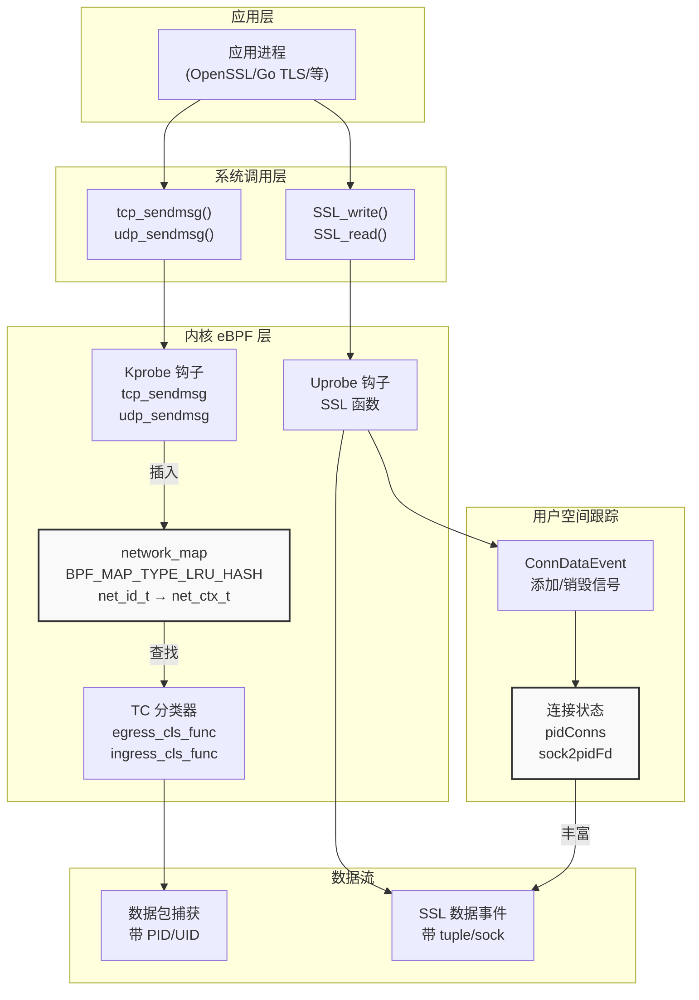

**图表**：网络连接跟踪架构

该图展示了双层跟踪系统。当连接建立时，kprobe 填充内核 `network_map`，允许 TC 程序归属数据包。另外，用户空间维护连接状态，以便用网络元组丰富 SSL/TLS 数据事件。

来源：[kern/tc.h:57-77](https://github.com/gojue/ecapture/blob/0766a93b/kern/tc.h#L57-L77)，[kern/tc.h:290-397](https://github.com/gojue/ecapture/blob/0766a93b/kern/tc.h#L290-L397)，[user/module/probe_openssl.go:78-106](https://github.com/gojue/ecapture/blob/0766a93b/user/module/probe_openssl.go#L78-L106)

---

## 内核空间连接跟踪

### 网络标识结构

内核使用支持 IPv4 和 IPv6 的四元组标识符来跟踪连接：

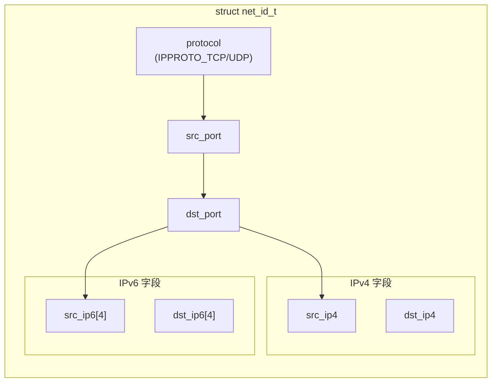

**图表**：网络标识结构（四元组）

`net_id_t` 结构 [kern/tc.h:39-47](https://github.com/gojue/ecapture/blob/0766a93b/kern/tc.h#L39-L47) 作为 eBPF 映射表的键。它包含 IPv4 和 IPv6 地址的字段，根据地址族只填充相关字段。

| 字段 | 类型 | 描述 |
|-------|------|-------------|
| `protocol` | `u32` | IPPROTO_TCP (6) 或 IPPROTO_UDP (17) |
| `src_port` | `u32` | 源端口号（主机字节序） |
| `dst_port` | `u32` | 目标端口号（主机字节序） |
| `src_ip4` | `u32` | 源 IPv4 地址 |
| `dst_ip4` | `u32` | 目标 IPv4 地址 |
| `src_ip6[4]` | `u32[4]` | 源 IPv6 地址（128 位） |
| `dst_ip6[4]` | `u32[4]` | 目标 IPv6 地址（128 位） |

来源：[kern/tc.h:39-47](https://github.com/gojue/ecapture/blob/0766a93b/kern/tc.h#L39-L47)

### 进程上下文结构

每个连接都与进程上下文信息相关联：

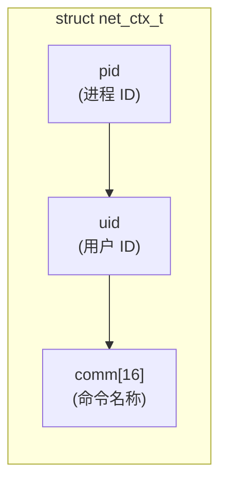

**图表**：进程上下文结构

`net_ctx_t` 结构 [kern/tc.h:49-54](https://github.com/gojue/ecapture/blob/0766a93b/kern/tc.h#L49-L54) 存储进程信息，稍后由 TC 程序用于过滤和归属。

来源：[kern/tc.h:49-54](https://github.com/gojue/ecapture/blob/0766a93b/kern/tc.h#L49-L54)

### 基于 Kprobe 的连接注册

系统钩住 `tcp_sendmsg` 和 `udp_sendmsg` 内核函数以捕获连接建立：

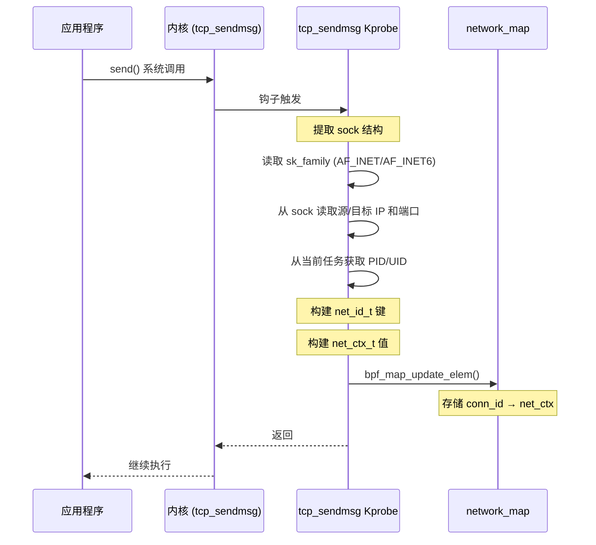

**图表**：Kprobe 连接注册序列

kprobe 实现 [kern/tc.h:290-347](https://github.com/gojue/ecapture/blob/0766a93b/kern/tc.h#L290-L347) 执行以下步骤：

1. **提取进程上下文**：从 `bpf_get_current_pid_tgid()` 获取 PID，从 `bpf_get_current_uid_gid()` 获取 UID
2. **读取套接字结构**：提取 `struct sock *` 参数并使用 `bpf_probe_read()` 读取网络字段
3. **确定地址族**：检查 `sk->__sk_common.skc_family` 是否为 AF_INET (2) 或 AF_INET6 (10)
4. **提取连接元组**：
   - 本地端口：`sk->__sk_common.skc_num`（已经是主机字节序）
   - 远程端口：`sk->__sk_common.skc_dport`（需要 `bpf_ntohs()`）
   - 本地 IP：`skc_rcv_saddr` (IPv4) 或 `skc_v6_rcv_saddr` (IPv6)
   - 远程 IP：`skc_daddr` (IPv4) 或 `skc_v6_daddr` (IPv6)
5. **更新 eBPF 映射表**：使用 BPF_ANY 标志将映射插入 `network_map`

重要的实现细节：

- **kprobe 中无 PID/UID 过滤**：与其他 eBPF 程序不同，kprobe 不按 target_pid/target_uid 过滤 [kern/tc.h:296-302](https://github.com/gojue/ecapture/blob/0766a93b/kern/tc.h#L296-L302)。这确保跟踪所有连接，允许 TC 程序稍后执行过滤。
- **LRU 驱逐**：映射类型 `BPF_MAP_TYPE_LRU_HASH` [kern/tc.h:73](https://github.com/gojue/ecapture/blob/0766a93b/kern/tc.h#L73) 在满时自动驱逐最近最少使用的条目（最大 10240 条）。
- **单独的 UDP 处理程序**：`udp_sendmsg` kprobe [kern/tc.h:349-397](https://github.com/gojue/ecapture/blob/0766a93b/kern/tc.h#L349-L397) 使用相同的逻辑，但设置 `protocol = IPPROTO_UDP`。

来源：[kern/tc.h:290-347](https://github.com/gojue/ecapture/blob/0766a93b/kern/tc.h#L290-L347)，[kern/tc.h:349-397](https://github.com/gojue/ecapture/blob/0766a93b/kern/tc.h#L349-L397)

### 基于 TC 的数据包捕获和归属

流量控制（TC）eBPF 分类器在入口和出口点捕获数据包：

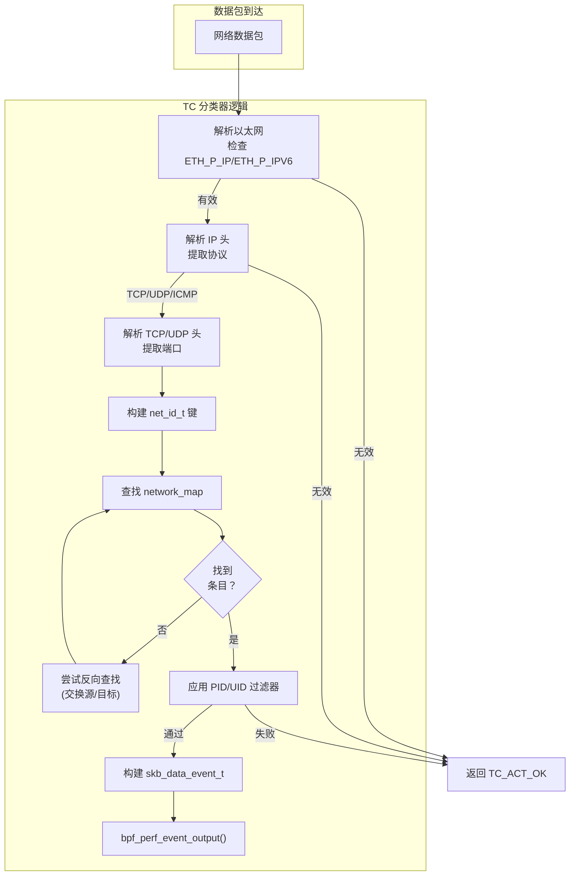

**图表**：TC 数据包捕获和归属流程

`capture_packets()` 函数 [kern/tc.h:135-276](https://github.com/gojue/ecapture/blob/0766a93b/kern/tc.h#L135-L276) 实现了数据包捕获逻辑：

**步骤 1：数据包解析**
- 验证数据包长度：至少为 `sizeof(ethhdr) + sizeof(iphdr)` [kern/tc.h:141-144](https://github.com/gojue/ecapture/blob/0766a93b/kern/tc.h#L141-L144)
- 解析以太网头以确定 IPv4 还是 IPv6 [kern/tc.h:156-236](https://github.com/gojue/ecapture/blob/0766a93b/kern/tc.h#L156-L236)
- 使用 `skb_revalidate_data()` [kern/tc.h:102-119](https://github.com/gojue/ecapture/blob/0766a93b/kern/tc.h#L102-L119) 确保在访问头之前有足够的数据
- 提取协议（TCP/UDP/ICMP）和连接元组

**步骤 2：连接查找**
- 从数据包头构建 `net_id_t` 键
- 调用 `bpf_map_lookup_elem(&network_map, &conn_id)` [kern/tc.h:188-198](https://github.com/gojue/ecapture/blob/0766a93b/kern/tc.h#L188-L198)
- 如果未找到，交换源/目标字段并重试（处理双向流量）

**步骤 3：进程过滤**
- 如果找到连接，则检查 `target_pid` 和 `target_uid` 常量 [kern/tc.h:243-250](https://github.com/gojue/ecapture/blob/0766a93b/kern/tc.h#L243-L250)
- 这些过滤器仅在内核 >= 5.2 上有效（KERNEL_LESS_5_2 检查）

**步骤 4：事件生成**
- 创建包含时间戳、PID、命令、数据包长度、接口索引的 `skb_data_event_t` [kern/tc.h:30-37](https://github.com/gojue/ecapture/blob/0766a93b/kern/tc.h#L30-L37)
- 使用 `bpf_perf_event_output()` [kern/tc.h:271](https://github.com/gojue/ecapture/blob/0766a93b/kern/tc.h#L271) 将最小事件数据（36 字节）加上数据包数据发送到用户空间

**可选：PCAP 过滤**
TC 程序通过 `filter_pcap_l2()` 函数 [kern/tc.h:128-132](https://github.com/gojue/ecapture/blob/0766a93b/kern/tc.h#L128-L132) 支持运行时 PCAP 过滤器注入。这被实现为一个桩函数 `filter_pcap_ebpf_l2()` [kern/tc.h:122-126](https://github.com/gojue/ecapture/blob/0766a93b/kern/tc.h#L122-L126)，在加载时由指令修补器替换 [user/module/probe_openssl.go:303-306](https://github.com/gojue/ecapture/blob/0766a93b/user/module/probe_openssl.go#L303-L306)。

来源：[kern/tc.h:135-276](https://github.com/gojue/ecapture/blob/0766a93b/kern/tc.h#L135-L276)，[kern/tc.h:279-288](https://github.com/gojue/ecapture/blob/0766a93b/kern/tc.h#L279-L288)

### 映射配置

网络跟踪映射定义为：

```c
struct {
    __uint(type, BPF_MAP_TYPE_LRU_HASH);
    __type(key, struct net_id_t);
    __type(value, struct net_ctx_t);
    __uint(max_entries, 10240);
} network_map SEC(".maps");
```

| 参数 | 值 | 原因 |
|-----------|-------|-----------|
| 类型 | `BPF_MAP_TYPE_LRU_HASH` | 自动驱逐旧条目防止内存耗尽 |
| 最大条目数 | 10,240 | 在内存使用和并发连接容量之间取得平衡 |
| 键大小 | 56 字节 | `net_id_t` 结构（协议 + 端口 + IP） |
| 值大小 | 20 字节 | `net_ctx_t` 结构（pid + uid + comm） |

来源：[kern/tc.h:72-77](https://github.com/gojue/ecapture/blob/0766a93b/kern/tc.h#L72-L77)

---

## 用户空间连接跟踪

### 连接状态管理

OpenSSL 探针在用户空间维护额外的连接状态，以将 SSL/TLS 操作与网络连接关联：

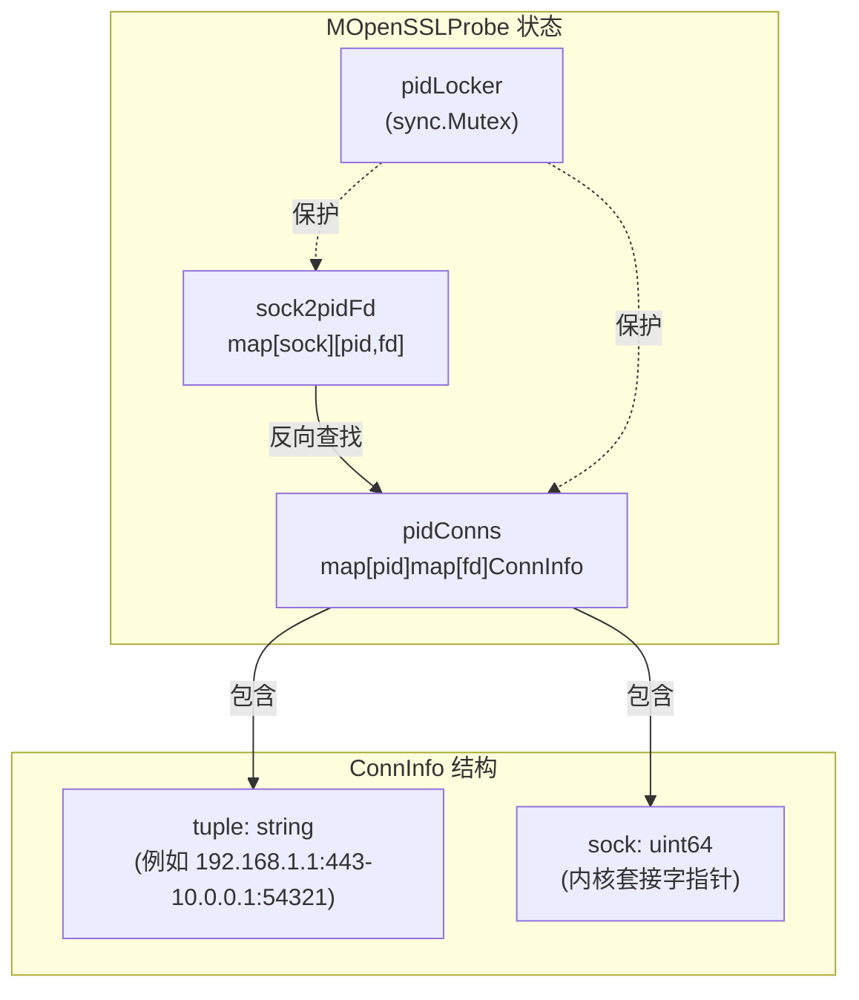

**图表**：用户空间连接状态结构

用户空间跟踪系统 [user/module/probe_openssl.go:78-106](https://github.com/gojue/ecapture/blob/0766a93b/user/module/probe_openssl.go#L78-L106) 维护两个同步的映射表：

**1. 主映射表：`pidConns`**
- 类型：`map[uint32]map[uint32]ConnInfo`
- 结构：PID → 文件描述符 → 连接信息
- 目的：为 SSL 操作按进程和文件描述符快速查找

**2. 反向映射表：`sock2pidFd`**
- 类型：`map[uint64][2]uint32`
- 结构：套接字指针 → [PID, FD]
- 目的：当内核通知套接字销毁时启用连接清理

**连接信息字段：**
- `tuple`：人类可读的连接字符串（格式："src_ip:src_port-dst_ip:dst_port"）
- `sock`：内核套接字指针（用于一致性检查）

来源：[user/module/probe_openssl.go:78-106](https://github.com/gojue/ecapture/blob/0766a93b/user/module/probe_openssl.go#L78-L106)

### 连接生命周期操作

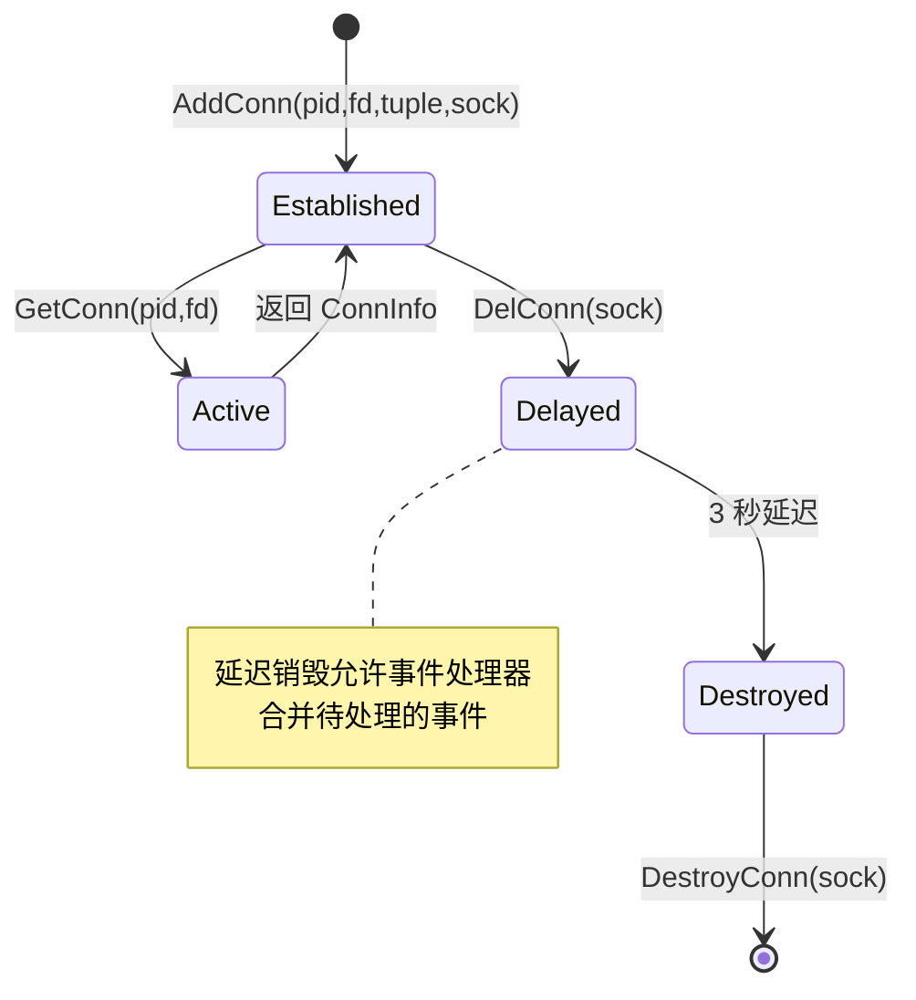

**图表**：连接生命周期状态机

#### AddConn：连接注册

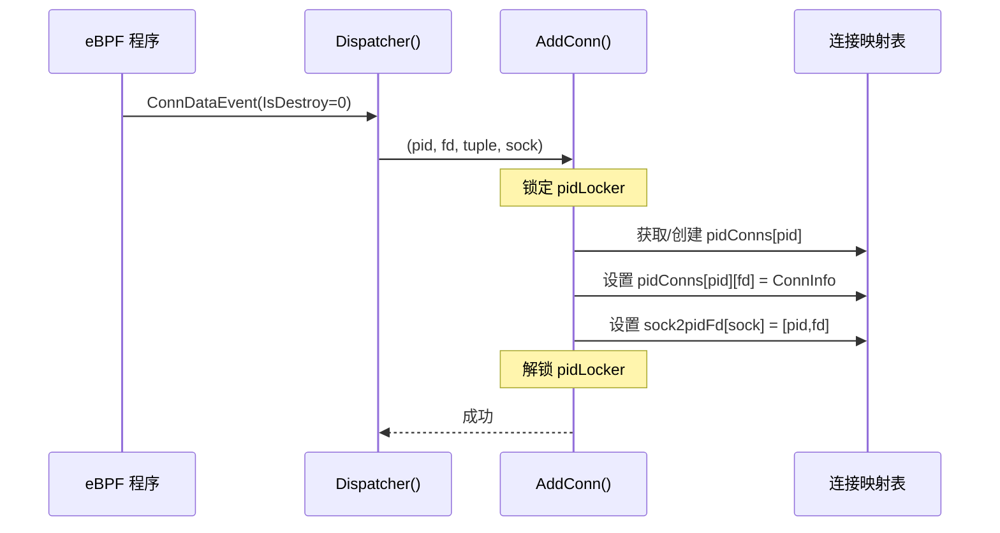

**图表**：AddConn 序列

`AddConn()` 方法 [user/module/probe_openssl.go:398-416](https://github.com/gojue/ecapture/blob/0766a93b/user/module/probe_openssl.go#L398-L416) 在检测到新连接时被调用：

1. **验证**：如果 `fd <= 0` 则拒绝 [user/module/probe_openssl.go:399-402](https://github.com/gojue/ecapture/blob/0766a93b/user/module/probe_openssl.go#L399-L402)
2. **获取锁**：使用互斥锁防止并发修改 [user/module/probe_openssl.go:404](https://github.com/gojue/ecapture/blob/0766a93b/user/module/probe_openssl.go#L404)
3. **映射初始化**：如果不存在则为 PID 创建嵌套映射 [user/module/probe_openssl.go:406-409](https://github.com/gojue/ecapture/blob/0766a93b/user/module/probe_openssl.go#L406-L409)
4. **存储连接**：添加带有元组和套接字指针的 `ConnInfo` [user/module/probe_openssl.go:410-411](https://github.com/gojue/ecapture/blob/0766a93b/user/module/probe_openssl.go#L410-L411)
5. **反向映射**：存储 socket → [pid, fd] 以便清理 [user/module/probe_openssl.go:413]()

来源：[user/module/probe_openssl.go:398-416](https://github.com/gojue/ecapture/blob/0766a93b/user/module/probe_openssl.go#L398-L416)

#### GetConn：连接检索

`GetConn()` 方法 [user/module/probe_openssl.go:464-480](https://github.com/gojue/ecapture/blob/0766a93b/user/module/probe_openssl.go#L464-L480) 为 SSL/TLS 数据事件检索连接信息：

1. **快速验证**：如果 `fd <= 0` 则返回 nil [user/module/probe_openssl.go:465-467](https://github.com/gojue/ecapture/blob/0766a93b/user/module/probe_openssl.go#L465-L467)
2. **锁定查找**：在互斥锁保护下访问映射表 [user/module/probe_openssl.go:469-470](https://github.com/gojue/ecapture/blob/0766a93b/user/module/probe_openssl.go#L469-L470)
3. **两级查找**：首先查找 PID 的映射，然后查找 FD 的连接 [user/module/probe_openssl.go:471-479](https://github.com/gojue/ecapture/blob/0766a93b/user/module/probe_openssl.go#L471-L479)

此方法由 `dumpSslData()` [user/module/probe_openssl.go:762](https://github.com/gojue/ecapture/blob/0766a93b/user/module/probe_openssl.go#L762) 调用，以使用网络元组信息丰富 SSL 数据事件。

来源：[user/module/probe_openssl.go:464-480](https://github.com/gojue/ecapture/blob/0766a93b/user/module/probe_openssl.go#L464-L480)，[user/module/probe_openssl.go:756-775](https://github.com/gojue/ecapture/blob/0766a93b/user/module/probe_openssl.go#L756-L775)

#### DelConn：延迟销毁

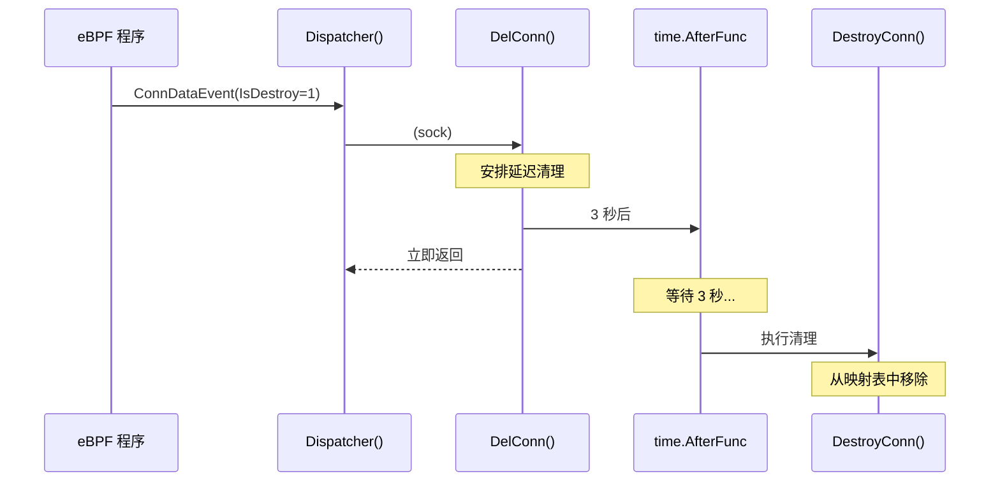

**图表**：延迟连接销毁

`DelConn()` 方法 [user/module/probe_openssl.go:455-462](https://github.com/gojue/ecapture/blob/0766a93b/user/module/probe_openssl.go#L455-L462) 实现延迟清理：

- **3 秒延迟**：使用 `time.AfterFunc()` 延迟实际销毁 [user/module/probe_openssl.go:459](https://github.com/gojue/ecapture/blob/0766a93b/user/module/probe_openssl.go#L459)
- **原因**：延迟必须超过事件处理器的合并间隔 [user/module/probe_openssl.go:456-458](https://github.com/gojue/ecapture/blob/0766a93b/user/module/probe_openssl.go#L456-L458)。这确保在删除连接状态之前处理所有待处理的事件。

来源：[user/module/probe_openssl.go:455-462](https://github.com/gojue/ecapture/blob/0766a93b/user/module/probe_openssl.go#L455-L462)

#### DestroyConn：实际清理

`DestroyConn()` 方法 [user/module/probe_openssl.go:418-452](https://github.com/gojue/ecapture/blob/0766a93b/user/module/probe_openssl.go#L418-L452) 执行实际清理：

1. **通知处理器**：向事件处理器发送信号以刷新连接数据 [user/module/probe_openssl.go:423-424](https://github.com/gojue/ecapture/blob/0766a93b/user/module/probe_openssl.go#L423-L424)
2. **反向查找**：使用 `sock2pidFd` 查找 [pid, fd] [user/module/probe_openssl.go:426-429]()
3. **一致性检查**：在删除前验证套接字指针匹配 [user/module/probe_openssl.go:441-445](https://github.com/gojue/ecapture/blob/0766a93b/user/module/probe_openssl.go#L441-L445)（防止竞态条件）
4. **清理映射表**：从 `pidConns` 中移除，如果为空则可能删除整个 PID 映射 [user/module/probe_openssl.go:446-449](https://github.com/gojue/ecapture/blob/0766a93b/user/module/probe_openssl.go#L446-L449)

来源：[user/module/probe_openssl.go:418-452](https://github.com/gojue/ecapture/blob/0766a93b/user/module/probe_openssl.go#L418-L452)

---

## 与 SSL/TLS 数据捕获的集成

### 丰富 SSL 数据事件

当 uprobe 钩子捕获 SSL/TLS 明文数据时，连接跟踪系统使用网络上下文丰富事件：

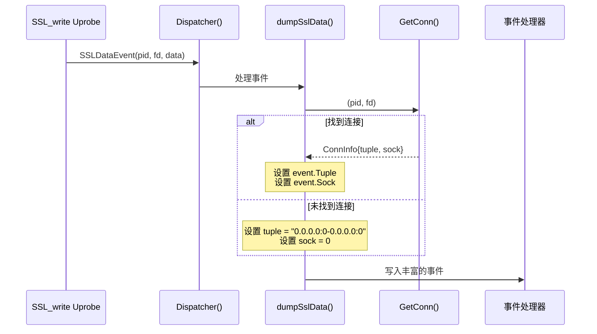

**图表**：SSL 数据事件丰富流程

`dumpSslData()` 方法 [user/module/probe_openssl.go:756-775](https://github.com/gojue/ecapture/blob/0766a93b/user/module/probe_openssl.go#L756-L775) 执行丰富操作：

1. **验证**：检查 FD 是否有效以及 BIO 类型是否合适 [user/module/probe_openssl.go:758-761](https://github.com/gojue/ecapture/blob/0766a93b/user/module/probe_openssl.go#L758-L761)
2. **连接查找**：调用 `GetConn(pid, fd)` [user/module/probe_openssl.go:762](https://github.com/gojue/ecapture/blob/0766a93b/user/module/probe_openssl.go#L762)
3. **后备处理**：如果未找到连接，使用默认元组 `"0.0.0.0:0-0.0.0.0:0"` [user/module/probe_openssl.go:763-766](https://github.com/gojue/ecapture/blob/0766a93b/user/module/probe_openssl.go#L763-L766)
4. **事件丰富**：在事件上设置 `tuple` 和 `sock` 字段 [user/module/probe_openssl.go:769-770](https://github.com/gojue/ecapture/blob/0766a93b/user/module/probe_openssl.go#L769-L770)
5. **转发到处理器**：将丰富的事件发送到事件处理器 [user/module/probe_openssl.go:774](https://github.com/gojue/ecapture/blob/0766a93b/user/module/probe_openssl.go#L774)

**默认元组常量：**
常量 `DefaultTuple = "0.0.0.0:0-0.0.0.0:0"` [user/module/probe_openssl.go:43](https://github.com/gojue/ecapture/blob/0766a93b/user/module/probe_openssl.go#L43) 在连接信息不可用时使用，通常用于：
- 内存 BIO 操作（无网络套接字）
- eCapture 启动前建立的连接
- 文件描述符不匹配

来源：[user/module/probe_openssl.go:756-775](https://github.com/gojue/ecapture/blob/0766a93b/user/module/probe_openssl.go#L756-L775)，[user/module/probe_openssl.go:42-43](https://github.com/gojue/ecapture/blob/0766a93b/user/module/probe_openssl.go#L42-L43)

### 连接事件分发

分发器将连接相关事件路由到适当的处理程序：

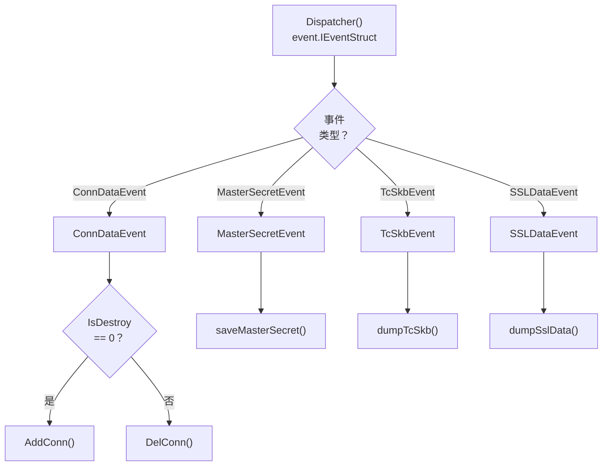

**图表**：事件分发器路由

`Dispatcher()` 方法 [user/module/probe_openssl.go:733-754](https://github.com/gojue/ecapture/blob/0766a93b/user/module/probe_openssl.go#L733-L754) 使用类型开关来路由事件：

- **ConnDataEvent**：来自 TC 或套接字操作的连接生命周期事件
  - `IsDestroy == 0`：新连接 → `AddConn()` [user/module/probe_openssl.go:738](https://github.com/gojue/ecapture/blob/0766a93b/user/module/probe_openssl.go#L738)
  - `IsDestroy != 0`：关闭连接 → `DelConn()` [user/module/probe_openssl.go:740](https://github.com/gojue/ecapture/blob/0766a93b/user/module/probe_openssl.go#L740)
- **MasterSecretEvent**：TLS 主密钥 → `saveMasterSecret()` [user/module/probe_openssl.go:743](https://github.com/gojue/ecapture/blob/0766a93b/user/module/probe_openssl.go#L743)
- **TcSkbEvent**：TC 数据包捕获 → `dumpTcSkb()` [user/module/probe_openssl.go:747](https://github.com/gojue/ecapture/blob/0766a93b/user/module/probe_openssl.go#L747)
- **SSLDataEvent**：SSL/TLS 明文数据 → `dumpSslData()` [user/module/probe_openssl.go:752](https://github.com/gojue/ecapture/blob/0766a93b/user/module/probe_openssl.go#L752)

来源：[user/module/probe_openssl.go:733-754](https://github.com/gojue/ecapture/blob/0766a93b/user/module/probe_openssl.go#L733-L754)

---

## PCAP 模式集成

在 PCAP 模式下，连接跟踪系统启用数据包级重建：

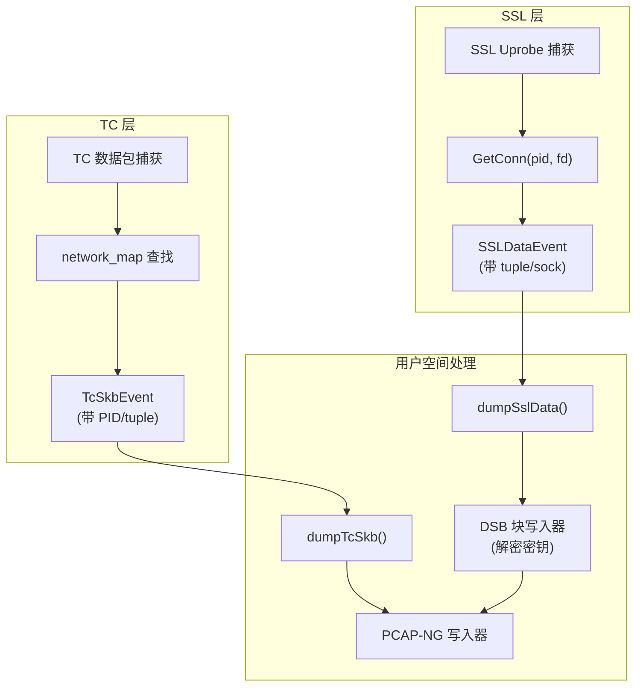

**图表**：PCAP 模式连接跟踪集成

在 PCAP 模式（`TlsCaptureModelTypePcap`）下，系统：

1. **捕获网络数据包**：TC 程序捕获带有进程归属的原始数据包
2. **捕获 TLS 密钥**：Uprobe 钩子提取带有连接元组的主密钥
3. **通过元组关联**：两个数据流都写入同一个 PCAP-NG 文件，允许 Wireshark 通过匹配数据包头中的元组与 DSB（解密密钥块）记录中的密钥来解密 TLS 流量

连接元组作为以下内容之间的关联键：
- 加密网络数据包（来自 TC 层）
- TLS 主密钥（来自 SSL/TLS 层）

有关详细的 PCAP 输出格式，请参阅 [PCAP 集成](../4-output-formats/4.2-pcap-integration.md)。

来源：[user/module/probe_openssl.go:137-154](https://github.com/gojue/ecapture/blob/0766a93b/user/module/probe_openssl.go#L137-L154)

---

## 性能考虑

### 映射大小和驱逐

`network_map` 使用 LRU（最近最少使用）驱逐，最多 10,240 个条目：

| 场景 | 映射行为 | 影响 |
|----------|-------------|--------|
| 低连接数 | 所有连接被跟踪 | 所有数据包完全归属 |
| 高连接流失 | 旧连接被驱逐 | 最近的连接优先 |
| 映射已满 | LRU 条目被替换 | 可能会失去空闲连接的归属 |

**缓解措施**：LRU 策略确保活跃连接保留在映射表中，而最近未发送数据包的空闲连接是驱逐的候选者。

来源：[kern/tc.h:72-77](https://github.com/gojue/ecapture/blob/0766a93b/kern/tc.h#L72-L77)

### 锁竞争

用户空间连接状态使用单个互斥锁（`pidLocker`）保护两个映射表 [user/module/probe_openssl.go:94](https://github.com/gojue/ecapture/blob/0766a93b/user/module/probe_openssl.go#L94)：

**锁点：**
- `AddConn()`：在映射插入期间持有 [user/module/probe_openssl.go:404](https://github.com/gojue/ecapture/blob/0766a93b/user/module/probe_openssl.go#L404)
- `GetConn()`：在映射查找期间持有 [user/module/probe_openssl.go:469](https://github.com/gojue/ecapture/blob/0766a93b/user/module/probe_openssl.go#L469)
- `DestroyConn()`：在映射清理期间持有 [user/module/probe_openssl.go:419](https://github.com/gojue/ecapture/blob/0766a93b/user/module/probe_openssl.go#L419)

**优化机会**：当前实现使用全局锁。高并发场景可能受益于：
- 按 PID 锁（分片）
- 读写锁（许多查找，少量修改）
- 无锁并发映射

然而，对于典型工作负载，竞争很小，因为大多数操作快速完成（简单的映射操作）。

来源：[user/module/probe_openssl.go:404](https://github.com/gojue/ecapture/blob/0766a93b/user/module/probe_openssl.go#L404)，[user/module/probe_openssl.go:419](https://github.com/gojue/ecapture/blob/0766a93b/user/module/probe_openssl.go#L419)，[user/module/probe_openssl.go:469](https://github.com/gojue/ecapture/blob/0766a93b/user/module/probe_openssl.go#L469)

### 延迟销毁原因

`DelConn()` 中的 3 秒延迟 [user/module/probe_openssl.go:459](https://github.com/gojue/ecapture/blob/0766a93b/user/module/probe_openssl.go#L459) 有特定目的：

**问题**：事件可能无序到达或在 eBPF perf/ring 缓冲区中缓冲
**解决方案**：在关闭后短暂保持连接状态活动，以确保所有事件都被丰富
**权衡**：增加内存使用（短期）与数据完整性

选择延迟是为了超过事件处理器的合并间隔，确保连接状态对引用它的所有事件都可用。

来源：[user/module/probe_openssl.go:455-462](https://github.com/gojue/ecapture/blob/0766a93b/user/module/probe_openssl.go#L455-L462)

---

## 限制和边界情况

### 内核版本约束

TC 程序中的进程过滤仅在内核 >= 5.2 上有效：

```c
#ifndef KERNEL_LESS_5_2
    if (target_pid != 0 && target_pid != net_ctx->pid) {
        return TC_ACT_OK;
    }
    if (target_uid != 0 && target_uid != net_ctx->uid) {
        return TC_ACT_OK;
    }
#endif
```

在旧内核上，TC 程序捕获所有数据包，无论 PID/UID 过滤器如何 [kern/tc.h:147-150](https://github.com/gojue/ecapture/blob/0766a93b/kern/tc.h#L147-L150)，[kern/tc.h:243-250](https://github.com/gojue/ecapture/blob/0766a93b/kern/tc.h#L243-L250)。

来源：[kern/tc.h:243-250](https://github.com/gojue/ecapture/blob/0766a93b/kern/tc.h#L243-L250)

### 连接元组匹配

双向查找 [kern/tc.h:188-198](https://github.com/gojue/ecapture/blob/0766a93b/kern/tc.h#L188-L198) 处理两个方向的数据包：

1. 首先使用数据包的 (src, dst) 查找
2. 如果未找到，交换并使用 (dst, src) 查找

**边界情况**：ICMP 数据包没有端口号，因此元组对于多连接场景可能不明确。

来源：[kern/tc.h:188-198](https://github.com/gojue/ecapture/blob/0766a93b/kern/tc.h#L188-L198)，[kern/tc.h:226-235](https://github.com/gojue/ecapture/blob/0766a93b/kern/tc.h#L226-L235)

### 竞态条件

**套接字重用**：如果内核在关闭和新分配之间重用套接字指针，`DestroyConn()` 中的一致性检查 [user/module/probe_openssl.go:441-445](https://github.com/gojue/ecapture/blob/0766a93b/user/module/probe_openssl.go#L441-L445) 可防止错误删除：

```go
if connInfo.sock != sock {
    m.logger.Debug().Msg("DestroyConn skip")
    return
}
```

这确保只销毁确切的连接实例，而不是恰好使用相同套接字指针的新连接。

来源：[user/module/probe_openssl.go:441-445](https://github.com/gojue/ecapture/blob/0766a93b/user/module/probe_openssl.go#L441-L445)

### 缺失连接状态

当 `GetConn()` 返回 nil 时，`dumpSslData()` 使用默认元组 [user/module/probe_openssl.go:763-766](https://github.com/gojue/ecapture/blob/0766a93b/user/module/probe_openssl.go#L763-L766)：

**原因：**
- 没有网络套接字的 BIO 操作（内存 BIO、文件 BIO）
- eCapture 附加之前建立的连接
- 文件描述符在事件之间关闭/重用

**影响：**
- PCAP 重建不可能（没有关联的元组）
- 文本模式输出仍然有效（显示默认元组）
- 事件处理器仍然可以通过 sock 字段合并事件

来源：[user/module/probe_openssl.go:763-766](https://github.com/gojue/ecapture/blob/0766a93b/user/module/probe_openssl.go#L763-L766)

---

## 总结

eCapture 中的网络连接跟踪系统实现了复杂的多层关联机制：

**内核空间：**
- `tcp_sendmsg`/`udp_sendmsg` 上的 kprobe 填充连接映射表
- TC 分类器查询映射表以进行数据包归属
- LRU 驱逐以 10K 连接限制管理内存

**用户空间：**
- 双向映射表（pid/fd → conn，sock → pid/fd）实现快速查找
- 延迟清理（3 秒）防止过早删除状态
- 连接丰富将 SSL/TLS 数据与网络元组关联

**关键设计原则：**
1. **关注点分离**：内核跟踪网络，用户空间跟踪 SSL/TLS
2. **双向查找**：支持数据包→进程和 fd→连接流程
3. **优雅降级**：缺失的连接使用默认元组
4. **性能优化**：LRU 驱逐、最小锁定、有针对性的过滤

这种架构使 eCapture 能够通过关联加密的网络数据包与明文应用数据和解密密钥来提供 TLS 流量的完整可见性。

来源：[kern/tc.h:1-398](https://github.com/gojue/ecapture/blob/0766a93b/kern/tc.h#L1-L398)，[user/module/probe_openssl.go:1-787](https://github.com/gojue/ecapture/blob/0766a93b/user/module/probe_openssl.go#L1-L787)