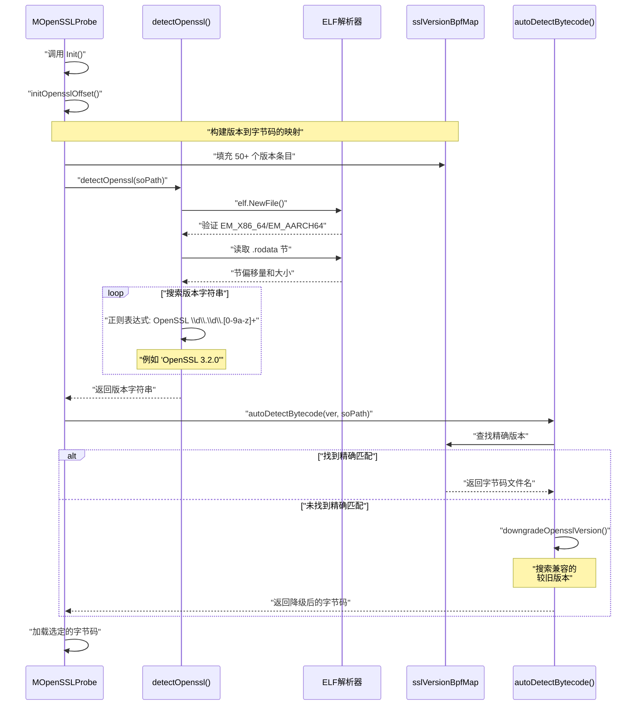
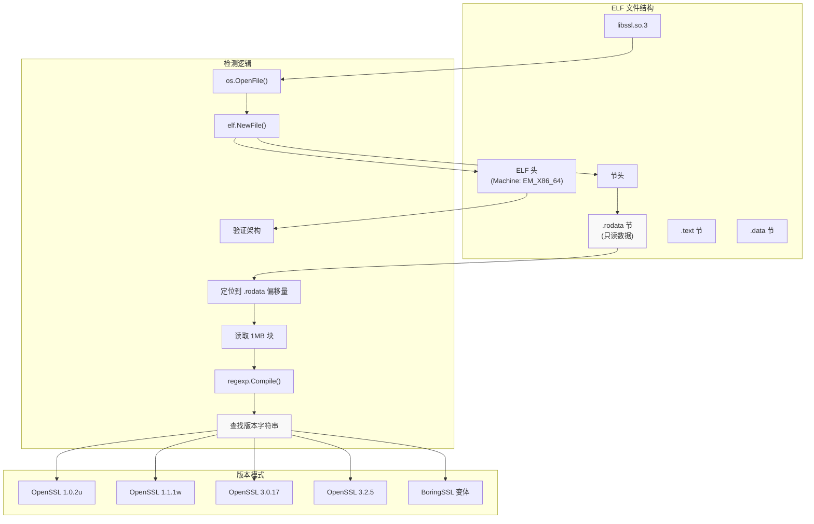
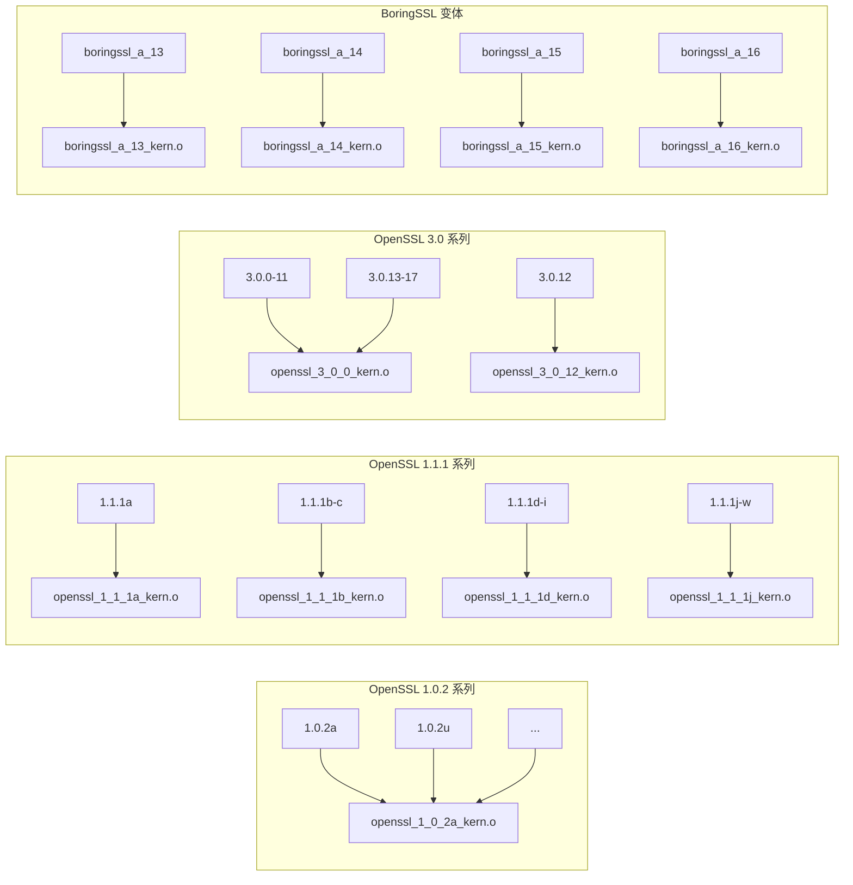
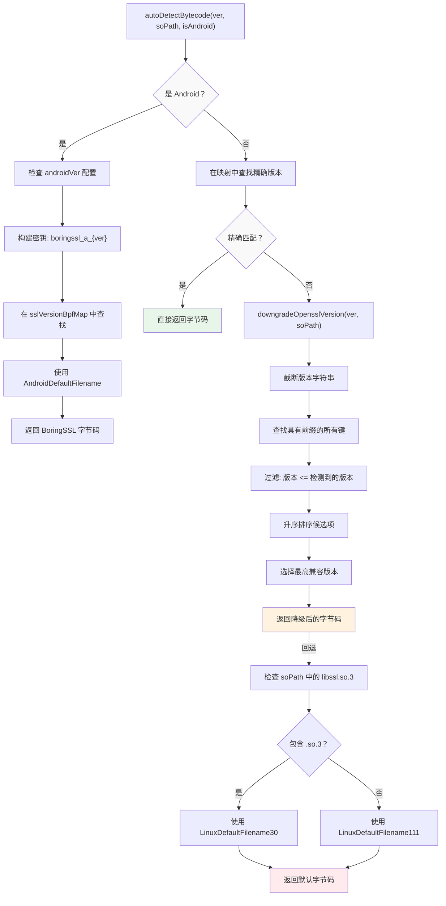
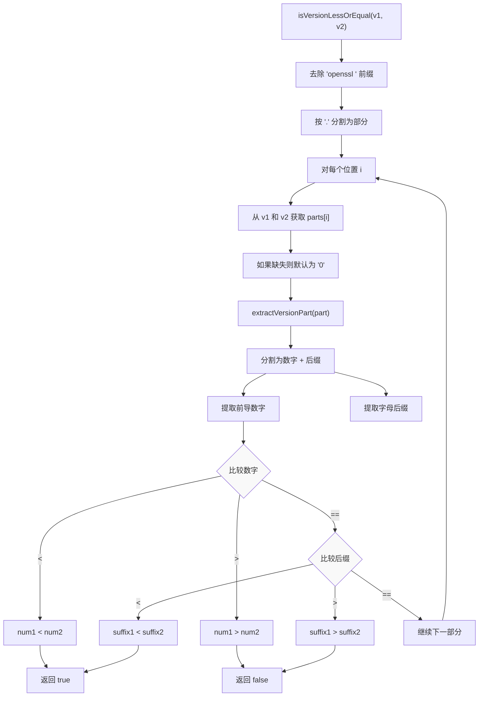
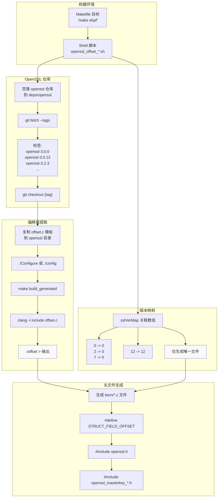

# 版本检测与字节码选择

本页面说明 eCapture 如何检测目标库版本（OpenSSL、BoringSSL、Go TLS），选择兼容的 eBPF 字节码，并通过智能降级逻辑处理版本兼容性。检测和选择系统确保在 eBPF 程序从内核访问内部库数据结构时使用正确的结构体偏移量。

**范围**：本页面涵盖运行时版本检测机制和字节码选择逻辑。有关实现新捕获模块的信息，请参阅[添加新模块](../5-development-guide/5.3-adding-new-modules.md)。有关 eBPF 编译过程本身的详细信息，请参阅[eBPF 引擎](2.1-ebpf-engine.md)。

---

## 检测架构

版本检测系统分为三个阶段运行：库发现、版本提取和字节码映射。该系统必须处理多种库实现（OpenSSL 1.0.x 到 3.5.x、BoringSSL 变体、Go TLS），这些库的内部数据结构布局在不同版本之间差异显著。



**来源**：[user/module/probe_openssl_lib.go:189-282](https://github.com/gojue/ecapture/blob/ca085d05/user/module/probe_openssl_lib.go#L189-L282)

---

## 版本字符串提取

`detectOpenssl()` 函数解析目标库的 ELF 文件，以提取嵌入在 `.rodata` 节中的版本字符串。这种方法避免依赖可能不反映实际库版本的文件名或符号链接。

### ELF 解析过程

| 步骤 | 操作 | 目的 |
|------|-----------|---------|
| 1 | 打开目标 `.so` 文件 | 访问共享库二进制文件 |
| 2 | 解析 ELF 头 | 验证架构（x86_64/aarch64）|
| 3 | 定位 `.rodata` 节 | 查找包含版本字符串的只读数据 |
| 4 | 流式读取节内容 | 高效搜索大节（最多 1MB 块）|
| 5 | 应用正则表达式模式 | 匹配 `OpenSSL \d\.\d\.[0-9a-z]+` |
| 6 | 标准化为小写 | 标准化以便映射查找 |



检测处理边缘情况，即版本字符串可能跨越缓冲区边界，通过在连续读取之间保持 30 字节重叠（`OpenSslVersionLen`）。

**来源**：[user/module/probe_openssl_lib.go:189-282](https://github.com/gojue/ecapture/blob/ca085d05/user/module/probe_openssl_lib.go#L189-L282)

---

## 版本到字节码的映射

`initOpensslOffset()` 方法构建 `sslVersionBpfMap`，这是从版本字符串到 eBPF 字节码文件名的综合映射。此映射编码了关于哪些版本共享相同结构体偏移量的知识。

### 版本分组策略

多个库版本通常共享相同的内部结构体布局，允许重用字节码：

| 版本范围 | 字节码文件 | 共享偏移量的版本 |
|---------------|---------------|--------------------------|
| OpenSSL 1.0.2a-u | `openssl_1_0_2a_kern.o` | 21 个版本（a 到 u）|
| OpenSSL 1.1.0a-l | `openssl_1_1_0a_kern.o` | 12 个版本（a 到 l）|
| OpenSSL 1.1.1a | `openssl_1_1_1a_kern.o` | 1 个版本（独特偏移量）|
| OpenSSL 1.1.1b-c | `openssl_1_1_1b_kern.o` | 2 个版本 |
| OpenSSL 1.1.1d-i | `openssl_1_1_1d_kern.o` | 6 个版本 |
| OpenSSL 1.1.1j-w | `openssl_1_1_1j_kern.o` | 14 个版本 |
| OpenSSL 3.0.0-11, 13-17 | `openssl_3_0_0_kern.o` | 16 个版本 |
| OpenSSL 3.0.12 | `openssl_3_0_12_kern.o` | 1 个版本（特殊情况）|
| OpenSSL 3.1.0-8 | `openssl_3_1_0_kern.o` | 9 个版本 |
| OpenSSL 3.2.0-2 | `openssl_3_2_0_kern.o` | 3 个版本 |
| OpenSSL 3.2.3 | `openssl_3_2_3_kern.o` | 1 个版本 |
| OpenSSL 3.2.4-5 | `openssl_3_2_4_kern.o` | 2 个版本 |



### 特殊情况：OpenSSL 3.0.12

OpenSSL 3.0.12 需要专用字节码，因为其内部结构体偏移量与 3.0 系列中较早（3.0.0-3.0.11）和较晚（3.0.13-3.0.17）版本都不同。此异常在代码中明确记录。

**来源**：[user/module/probe_openssl_lib.go:73-187](https://github.com/gojue/ecapture/blob/ca085d05/user/module/probe_openssl_lib.go#L73-L187)、[user/module/probe_openssl_lib.go:128-130](https://github.com/gojue/ecapture/blob/ca085d05/user/module/probe_openssl_lib.go#L128-L130)

---

## 字节码选择算法

当检测到版本字符串时，`autoDetectBytecode()` 函数确定要加载哪个字节码。选择过程遵循回退层次结构以最大化兼容性。



### 降级逻辑

当未找到精确版本时，`downgradeOpensslVersion()` 函数实现版本兼容性匹配。它迭代截断版本字符串以查找兼容的较旧版本：

1. **前缀匹配**：对于检测到的版本 "openssl 3.2.7"，尝试前缀 "openssl 3.2."、"openssl 3."、"openssl "
2. **候选收集**：查找所有匹配每个前缀的映射键
3. **版本过滤**：使用 `isVersionLessOrEqual()` 仅保留 ≤ 检测到的版本
4. **排序**：按版本号排序候选项（数字和字母组件）
5. **选择**：选择最高兼容版本

示例：如果检测到 OpenSSL 3.2.7 但不在映射中，算法会找到 "openssl 3.2.5"（最高可用版本 ≤ 3.2.7）并使用其字节码。

**来源**：[user/module/probe_openssl_lib.go:284-317](https://github.com/gojue/ecapture/blob/ca085d05/user/module/probe_openssl_lib.go#L284-L317)、[user/module/probe_openssl_lib.go:341-448](https://github.com/gojue/ecapture/blob/ca085d05/user/module/probe_openssl_lib.go#L341-L448)

---

## 版本比较算法

`isVersionLessOrEqual()` 函数实现了复杂的版本比较，可以处理数字和字母版本组件（例如 "1.1.1a" 与 "1.1.1b"）。



**比较示例**：
- `isVersionLessOrEqual("openssl 1.1.1a", "openssl 1.1.1b")` → `true`
- `isVersionLessOrEqual("openssl 3.0.11", "openssl 3.0.12")` → `true`
- `isVersionLessOrEqual("openssl 3.2.5", "openssl 3.2.3")` → `false`

**来源**：[user/module/probe_openssl_lib.go:371-448](https://github.com/gojue/ecapture/blob/ca085d05/user/module/probe_openssl_lib.go#L371-L448)

---

## 结构体偏移量生成

偏移量生成系统生成包含结构体字段偏移量的版本特定 C 头文件。这些偏移量对于 eBPF 程序正确读取内部库数据结构至关重要。

### 生成流程



### 偏移量脚本结构

每个版本系列（3.0、3.1、3.2、3.3、3.4、3.5）都有专用的 shell 脚本：

| 脚本 | 版本范围 | 模板文件 | 输出模式 |
|--------|---------------|---------------|----------------|
| `openssl_offset_3.0.sh` | 3.0.0-3.0.17 | `openssl_3_0_offset.c` | `openssl_3_0_{0,12}_kern.c` |
| `openssl_offset_3.1.sh` | 3.1.0-3.1.8 | `openssl_3_0_offset.c` | `openssl_3_1_0_kern.c` |
| `openssl_offset_3.2.sh` | 3.2.0-3.2.5 | `openssl_3_2_0_offset.c` | `openssl_3_2_{0,3,4}_kern.c` |
| `openssl_offset_3.3.sh` | 3.3.0-3.3.4 | `openssl_3_2_0_offset.c` | `openssl_3_3_{0,2,3}_kern.c` |
| `openssl_offset_3.4.sh` | 3.4.0-3.4.2 | `openssl_3_2_0_offset.c` | `openssl_3_4_{0,1}_kern.c` |
| `openssl_offset_3.5.sh` | 3.5.0-3.5.4 | `openssl_3_5_0_offset.c` | `openssl_3_5_{0-4}_kern.c` |

### 脚本中的版本映射

脚本使用关联数组（`sslVerMap`）将次要版本号映射到应提取偏移量的版本：

```bash
# 来自 openssl_offset_3.0.sh
sslVerMap["0"]="0"    # 3.0.0 -> 使用 3.0.0 偏移量
sslVerMap["11"]="0"   # 3.0.11 -> 使用 3.0.0 偏移量
sslVerMap["12"]="12"  # 3.0.12 -> 使用 3.0.12 偏移量（特殊）
sslVerMap["13"]="0"   # 3.0.13 -> 使用 3.0.0 偏移量
```

此映射确保仅生成唯一的偏移量文件，减少构建时间和二进制大小。

**来源**：[utils/openssl_offset_3.0.sh:24-88](https://github.com/gojue/ecapture/blob/ca085d05/utils/openssl_offset_3.0.sh#L24-L88)、[utils/openssl_offset_3.2.sh:24-75](https://github.com/gojue/ecapture/blob/ca085d05/utils/openssl_offset_3.2.sh#L24-L75)、[utils/openssl_offset_3.3.sh:24-75](https://github.com/gojue/ecapture/blob/ca085d05/utils/openssl_offset_3.3.sh#L24-L75)、[utils/openssl_offset_3.4.sh:24-73](https://github.com/gojue/ecapture/blob/ca085d05/utils/openssl_offset_3.4.sh#L24-L73)、[utils/openssl_offset_3.5.sh:24-74](https://github.com/gojue/ecapture/blob/ca085d05/utils/openssl_offset_3.5.sh#L24-L74)

---

## 生成的头文件格式

每个生成的头文件包含结构体字段偏移量的预处理器定义：

```c
#ifndef ECAPTURE_OPENSSL_3_0_0_KERN_H
#define ECAPTURE_OPENSSL_3_0_0_KERN_H

// 生成的偏移量定义
#define SSL_ST_VERSION 0x68
#define SSL_ST_WBIO 0x20
#define SSL_ST_RBIO 0x28
// ... 更多偏移量

#include "openssl.h"
#include "openssl_masterkey_3.0.h"
#endif
```

这些偏移量被 eBPF 程序用于导航内存布局：

```c
// 在 eBPF 代码中
void *ssl_st = ...; // SSL* 指针
void *wbio = (void *)((u64)ssl_st + SSL_ST_WBIO);
```

偏移量提取过程针对特定 OpenSSL 版本的头文件编译偏移量模板，确保准确性。

**来源**：[utils/openssl_offset_3.0.sh:75-80](https://github.com/gojue/ecapture/blob/ca085d05/utils/openssl_offset_3.0.sh#L75-L80)、[utils/openssl_offset_3.2.sh:59-67](https://github.com/gojue/ecapture/blob/ca085d05/utils/openssl_offset_3.2.sh#L59-L67)

---

## 默认版本选择

当无法检测或匹配版本时，系统根据上下文提供合理的默认值：

### Android 默认值

对于 Android 系统（`isAndroid=true`），默认值为 `AndroidDefaultFilename`，映射到 `boringssl_a_13_kern.o`（Android 13 BoringSSL）。用户可以使用 `--android_ver` 标志覆盖。

### Linux 默认值

对于 Linux 系统，默认值通过检查共享库文件名确定：
- 如果文件名包含 `libssl.so.3` → 使用 `LinuxDefaultFilename30`（OpenSSL 3.0）
- 否则 → 使用 `LinuxDefaultFilename111`（OpenSSL 1.1.1）

这种启发式方法利用标准库版本控制约定，其中主要版本号出现在 `.so` 文件名中。

**来源**：[user/module/probe_openssl_lib.go:284-317](https://github.com/gojue/ecapture/blob/ca085d05/user/module/probe_openssl_lib.go#L284-L317)、[user/module/probe_openssl_lib.go:361-368](https://github.com/gojue/ecapture/blob/ca085d05/user/module/probe_openssl_lib.go#L361-L368)

---

## 常量与版本限制

系统定义最大支持版本边界，以确保仅使用经过测试的版本：

```go
MaxSupportedOpenSSL102Version = 'u'  // 1.0.2u
MaxSupportedOpenSSL110Version = 'l'  // 1.1.0l
MaxSupportedOpenSSL111Version = 'w'  // 1.1.1w
MaxSupportedOpenSSL30Version  = 17   // 3.0.17
MaxSupportedOpenSSL31Version  = 8    // 3.1.8
MaxSupportedOpenSSL32Version  = 3    // 3.2.3
MaxSupportedOpenSSL33Version  = 4    // 3.3.4
MaxSupportedOpenSSL34Version  = 2    // 3.4.2
MaxSupportedOpenSSL35Version  = 4    // 3.5.4
```

这些常量用于填充 `sslVersionBpfMap` 条目的循环中，确保覆盖每个系列中的所有经过测试的版本。

**来源**：[user/module/probe_openssl_lib.go:44-62](https://github.com/gojue/ecapture/blob/ca085d05/user/module/probe_openssl_lib.go#L44-L62)

---

## 错误处理与用户指导

当版本检测失败时，系统提供信息丰富的错误消息：

```go
ErrProbeOpensslVerNotFound = errors.New("OpenSSL/BoringSSL version not found")
ErrProbeOpensslVerBytecodeNotFound = errors.New("OpenSSL/BoringSSL version bytecode not found")
```

用户指导消息建议手动指定版本：

- **Android**：`"--ssl_version='boringssl_a_13'", "--ssl_version='boringssl_a_14'"`
- **Linux**：`"--ssl_version='openssl x.x.x'", support openssl 1.0.x, 1.1.x, 3.x or newer`

当发生自动选择（降级或默认）时，警告消息会通知用户：
- "OpenSSL/BoringSSL version not found, used downgrade version."
- "OpenSSL/BoringSSL version not found, used default version."

**来源**：[user/module/probe_openssl_lib.go:64-70](https://github.com/gojue/ecapture/blob/ca085d05/user/module/probe_openssl_lib.go#L64-L70)、[user/module/probe_openssl_lib.go:303-314](https://github.com/gojue/ecapture/blob/ca085d05/user/module/probe_openssl_lib.go#L303-L314)

---

## 与模块初始化的集成

版本检测和字节码选择集成到模块初始化序列中：

1. **模块初始化**：调用 `MOpenSSLProbe.Init()`
2. **偏移量映射初始化**：`initOpensslOffset()` 填充 `sslVersionBpfMap`
3. **库检测**：`detectOpenssl(soPath)` 提取版本字符串
4. **字节码选择**：`autoDetectBytecode(ver, soPath, isAndroid)` 选择字节码
5. **eBPF 加载**：将选定的字节码文件加载到内核

此序列确保在任何 eBPF 程序尝试访问目标库内部之前，正确的结构体偏移量可用。

**来源**：[user/module/probe_openssl_lib.go:73-187](https://github.com/gojue/ecapture/blob/ca085d05/user/module/probe_openssl_lib.go#L73-L187)、[user/module/probe_openssl_lib.go:189-282](https://github.com/gojue/ecapture/blob/ca085d05/user/module/probe_openssl_lib.go#L189-L282)、[user/module/probe_openssl_lib.go:284-317](https://github.com/gojue/ecapture/blob/ca085d05/user/module/probe_openssl_lib.go#L284-L317)