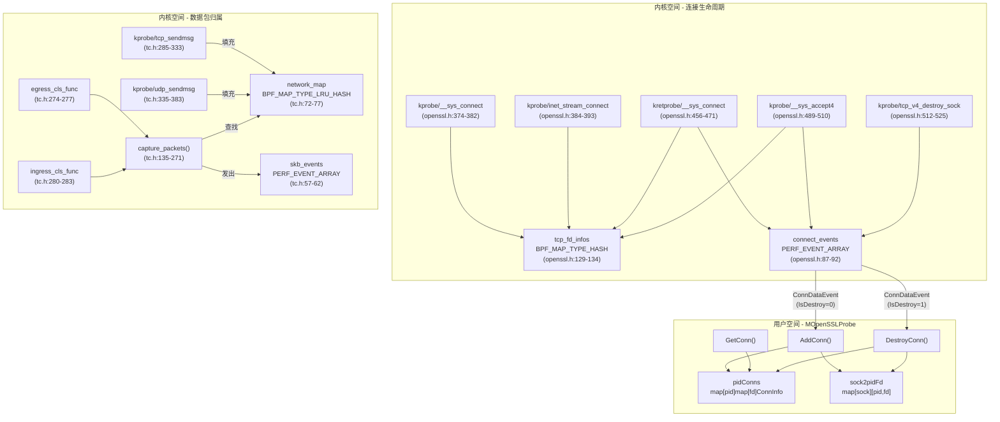
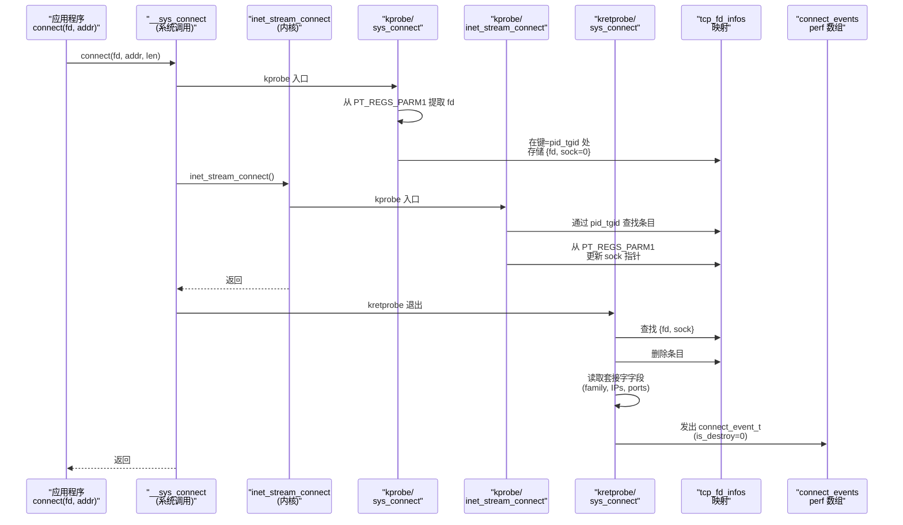
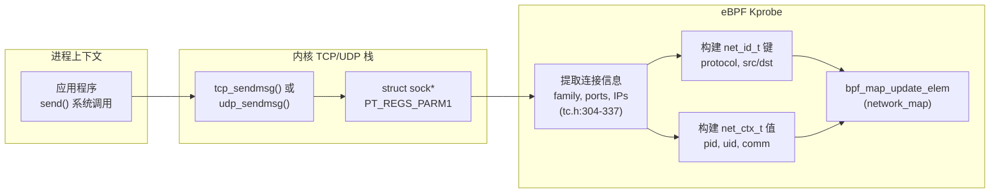
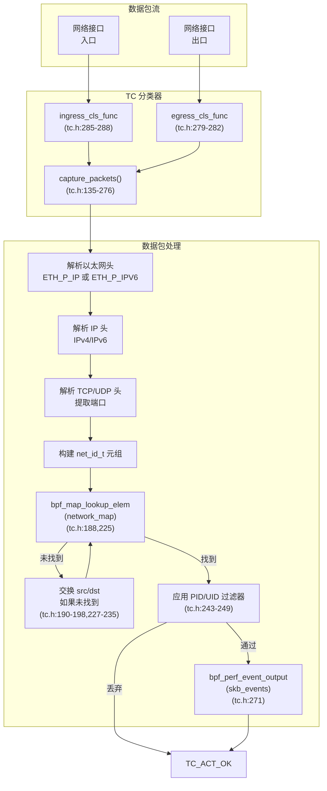
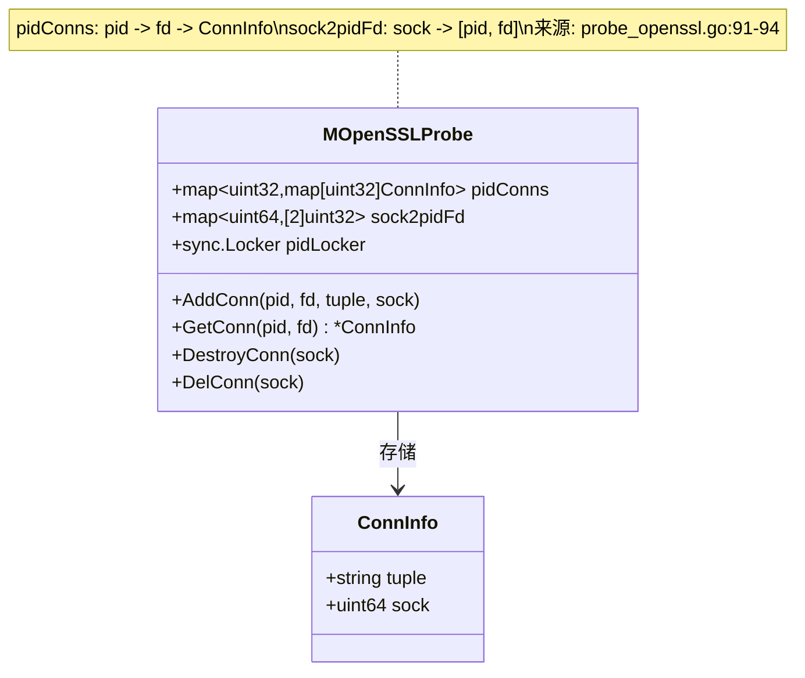
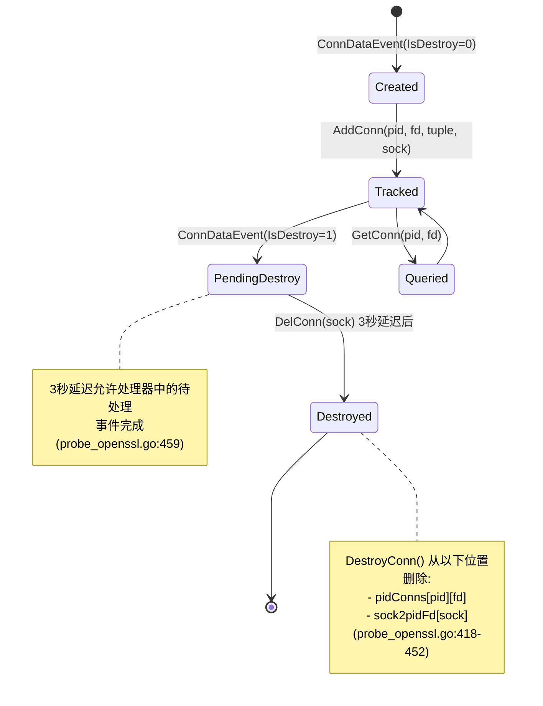
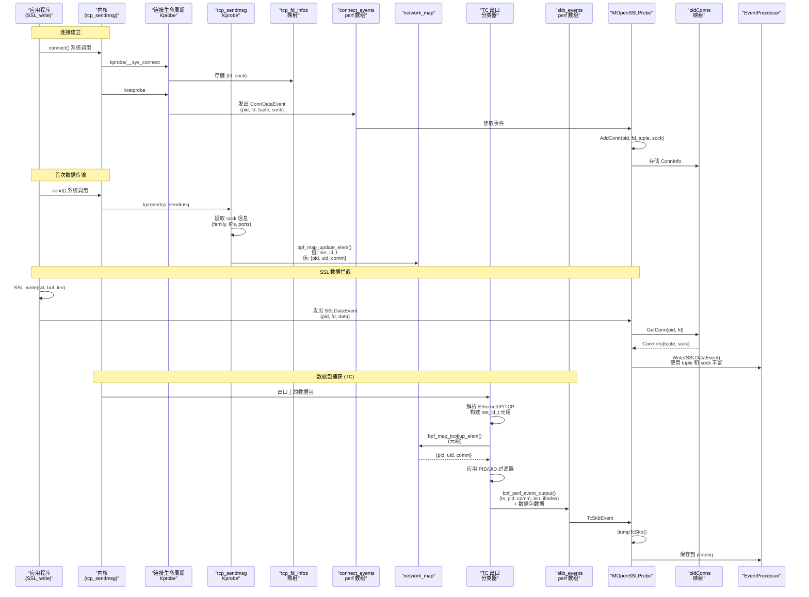

# 网络连接跟踪

## 目的与范围

网络连接跟踪是负责将网络连接与进程关联并维护文件描述符到套接字地址映射的子系统。这使 eCapture 能够：

1. **将网络数据包归属到进程**：通过在 `tcp_sendmsg`/`udp_sendmsg` 上的 kprobe 填充的 `network_map`
2. **跟踪连接生命周期**：通过在 `__sys_connect`、`__sys_accept4` 和 `tcp_v4_destroy_sock` 上的 kprobe
3. **将文件描述符映射到连接元组**：通过从 `ConnDataEvent` 填充的用户空间 `pidConns` 和 `sock2pidFd` 结构

该系统在三个层面运行：
- **内核空间连接生命周期跟踪**（[kern/openssl.h](https://github.com/gojue/ecapture/blob/ca085d05/kern/openssl.h) 中对 connect/accept/destroy 的 kprobe）
- **内核空间数据包归属**（[kern/tc.h](https://github.com/gojue/ecapture/blob/ca085d05/kern/tc.h) 中对 sendmsg 的 kprobe 和 TC 分类器）
- **用户空间 FD 到元组的映射**（由 [user/module/probe_openssl.go](https://github.com/gojue/ecapture/blob/ca085d05/user/module/probe_openssl.go) 中的 `MOpenSSLProbe` 维护）

有关 TC 数据包捕获机制本身的信息，请参阅第 3.3 页。有关消费连接事件的事件处理流程的详细信息，请参阅第 2.2 页。

## 架构概述

网络连接跟踪系统由两个并行的子系统组成：

### 系统 1：连接生命周期跟踪（kern/openssl.h）
- **对 connect/accept/destroy 的 Kprobe**：跟踪连接何时创建和销毁
- **tcp_fd_infos 映射**：连接建立期间的中间存储
- **connect_events perf 数组**：向用户空间发出 `ConnDataEvent`
- **目的**：为 SSL 数据归属提供 FD 到元组的映射

### 系统 2：数据包归属（kern/tc.h）
- **对 tcp_sendmsg/udp_sendmsg 的 Kprobe**：在发送数据时填充 `network_map`
- **network_map**：将连接元组映射到进程上下文（PID/UID/comm）
- **TC 分类器**：在 `network_map` 中查找数据包以进行进程归属
- **目的**：使 TC 能够使用进程元数据捕获数据包

### 架构图



**来源：** [kern/openssl.h:41-55](https://github.com/gojue/ecapture/blob/ca085d05/kern/openssl.h#L41-L55), [kern/openssl.h:87-92](https://github.com/gojue/ecapture/blob/ca085d05/kern/openssl.h#L87-L92), [kern/openssl.h:129-134](https://github.com/gojue/ecapture/blob/ca085d05/kern/openssl.h#L129-L134), [kern/openssl.h:374-525](https://github.com/gojue/ecapture/blob/ca085d05/kern/openssl.h#L374-L525), [kern/tc.h:39-77](https://github.com/gojue/ecapture/blob/ca085d05/kern/tc.h#L39-L77), [kern/tc.h:135-383](https://github.com/gojue/ecapture/blob/ca085d05/kern/tc.h#L135-L383), [user/module/probe_openssl.go:78-106](https://github.com/gojue/ecapture/blob/ca085d05/user/module/probe_openssl.go#L78-L106)

## 连接生命周期跟踪（kern/openssl.h）

该子系统通过钩取系统调用和内核函数来跟踪网络连接的创建和销毁。它向用户空间发出包含文件描述符、套接字指针和连接元组信息的 `ConnDataEvent` 结构。

### 连接事件结构（connect_event_t）

`connect_event_t` 结构在连接建立或销毁时发出：

**结构定义（[kern/openssl.h:41-55](https://github.com/gojue/ecapture/blob/ca085d05/kern/openssl.h#L41-L55)）：**

| 字段 | 类型 | 描述 |
|-------|------|-------------|
| `saddr` | `unsigned __int128` | 源地址（IPv4 或 IPv6） |
| `daddr` | `unsigned __int128` | 目标地址 |
| `comm` | `char[16]` | 进程命令名称 |
| `timestamp_ns` | `u64` | 纳秒时间戳 |
| `sock` | `u64` | 内核套接字结构指针 |
| `pid` | `u32` | 进程 ID |
| `tid` | `u32` | 线程 ID |
| `fd` | `u32` | 文件描述符 |
| `family` | `u16` | 地址族（AF_INET 或 AF_INET6） |
| `sport` | `u16` | 源端口 |
| `dport` | `u16` | 目标端口 |
| `is_destroy` | `u8` | 如果是销毁事件则为 1，创建事件则为 0 |
| `pad[7]` | `u8[7]` | 填充以避免对齐问题 |

**注意：** 该结构标记为 `__attribute__((packed))`，以防止可能导致用户空间事件反序列化问题的填充空洞。

### 中间存储：tcp_fd_infos 映射

`tcp_fd_infos` 映射在连接建立期间临时存储文件描述符和套接字指针对。它用于关联多个钩点之间的信息。

**映射定义（[kern/openssl.h:129-134](https://github.com/gojue/ecapture/blob/ca085d05/kern/openssl.h#L129-L134)）：**
```
struct tcp_fd_info {
    u64 sock;   // 套接字结构指针
    int fd;     // 文件描述符
};

BPF_MAP_TYPE_HASH: tcp_fd_infos
键: u64 (pid_tgid)
值: struct tcp_fd_info
最大条目数: 10240
```

**生命周期：**
1. 入口探针在 `tcp_fd_infos[pid_tgid]` 中存储 FD
2. 中间探针向同一条目添加套接字指针
3. 返回探针读取两个值，发出事件，删除条目

### 连接建立钩子

#### 主动连接：__sys_connect

系统钩取 `__sys_connect` 系统调用及相关内核函数以跟踪出站连接：

**钩子序列图：**



**实现细节：**

1. **probe_connect（[kern/openssl.h:374-382](https://github.com/gojue/ecapture/blob/ca085d05/kern/openssl.h#L374-L382)）：**
   - 钩子：`__sys_connect` 系统调用
   - 提取：从第一个参数提取 FD
   - 存储：`{fd, sock=0}` 在 `tcp_fd_infos[pid_tgid]` 中

2. **probe_inet_stream_connect（[kern/openssl.h:384-393](https://github.com/gojue/ecapture/blob/ca085d05/kern/openssl.h#L384-L393)）：**
   - 钩子：`inet_stream_connect` 内核函数
   - 提取：从第一个参数提取套接字指针
   - 更新：`tcp_fd_infos[pid_tgid].sock`

3. **retprobe_connect（[kern/openssl.h:456-471](https://github.com/gojue/ecapture/blob/ca085d05/kern/openssl.h#L456-L471)）：**
   - 钩子：`__sys_connect` 系统调用返回
   - 调用：`lookup_and_delete_fd_info()` 从 `tcp_fd_infos` 检索并删除条目
   - 验证：套接字指针非空
   - 调用：`kretprobe_connect()` 发出事件

4. **kretprobe_connect（[kern/openssl.h:395-454](https://github.com/gojue/ecapture/blob/ca085d05/kern/openssl.h#L395-L454)）：**
   - 读取：使用 `bpf_probe_read_kernel()` 读取套接字字段：
     - `sk->__sk_common.skc_family`（地址族）
     - `sk->__sk_common.skc_addrpair`（IPv4 地址）或 `skc_v6_*`（IPv6）
     - `sk->__sk_common.skc_portpair`（网络字节序端口）
   - 验证：端口和地址非零（连接已建立）
   - 构建：带有 `is_destroy=0` 的 `connect_event_t` 结构
   - 发出：事件到 `connect_events` perf 数组

**主动连接标志：**

`active` 布尔参数确定连接是出站（true）还是入站（false）：
- **出站（active=true）**：`dport = bpf_ntohs(ports)`，`sport = ports >> 16`
- **入站（active=false）**：交换源和目标（因为 accept 在套接字结构中将远程返回为源）

#### 被动连接：__sys_accept4

系统钩取 `__sys_accept4` 系统调用以跟踪入站连接：

**钩子实现：**

1. **probe_connect（在 __sys_accept4 上）（[user/module/probe_openssl_text.go:94-98](https://github.com/gojue/ecapture/blob/ca085d05/user/module/probe_openssl_text.go#L94-L98)）：**
   - 注意：重用与 connect 相同的函数，在 `tcp_fd_infos` 中存储 FD
   - UID："kprobe_sys_accept4"

2. **probe_inet_accept（[kern/openssl.h:478-487](https://github.com/gojue/ecapture/blob/ca085d05/kern/openssl.h#L478-L487)）：**
   - 钩子：`inet_accept` 内核函数
   - 提取：从第二个参数提取套接字指针（`PT_REGS_PARM2`）
   - 更新：`tcp_fd_infos[pid_tgid].sock`

3. **retprobe_accept4（[kern/openssl.h:489-510](https://github.com/gojue/ecapture/blob/ca085d05/kern/openssl.h#L489-L510)）：**
   - 钩子：`__sys_accept4` 系统调用返回
   - 提取：从返回值提取新的 FD（`PT_REGS_RC`）
   - 验证：FD 非负
   - 调用：`lookup_and_delete_fd_info()` 和带 `active=false` 的 `kretprobe_connect()`

### 连接销毁钩子

**probe_tcp_v4_destroy_sock（[kern/openssl.h:512-525](https://github.com/gojue/ecapture/blob/ca085d05/kern/openssl.h#L512-L525)）：**

跟踪内核何时销毁 TCP 连接：

- 钩子：`tcp_v4_destroy_sock` 内核函数
- 提取：从第一个参数提取套接字指针
- 发出：`connect_event_t`，包含：
  - `sock` 指针（用于与现有条目关联）
  - `is_destroy = 1`
  - 其他字段清零（销毁时仅 sock 重要）

**目的：** 允许用户空间在连接关闭时从 `pidConns` 中删除过期条目，而无需显式调用 close() 系统调用（例如，进程终止、内核清理）。

### SSL_set_fd 钩子

除了 connect/accept 钩子外，系统还钩取 `SSL_set_fd` 及相关函数，以处理在 SSL 结构创建后设置 FD 的情况：

**钩子（[user/module/probe_openssl_text.go:130-150](https://github.com/gojue/ecapture/blob/ca085d05/user/module/probe_openssl_text.go#L130-L150)）：**
- `SSL_set_fd`
- `SSL_set_rfd`（读 FD）
- `SSL_set_wfd`（写 FD）

**实现（[kern/openssl.h:531-543](https://github.com/gojue/ecapture/blob/ca085d05/kern/openssl.h#L531-L543)）：**
- 存储映射：`ssl_st_fd[ssl_addr] = fd`
- 使用场景：当 bio->num 为 0 时由 `process_SSL_bio()` 使用

**来源：** [kern/openssl.h:41-55](https://github.com/gojue/ecapture/blob/ca085d05/kern/openssl.h#L41-L55), [kern/openssl.h:87-92](https://github.com/gojue/ecapture/blob/ca085d05/kern/openssl.h#L87-L92), [kern/openssl.h:129-134](https://github.com/gojue/ecapture/blob/ca085d05/kern/openssl.h#L129-L134), [kern/openssl.h:354-543](https://github.com/gojue/ecapture/blob/ca085d05/kern/openssl.h#L354-L543), [user/module/probe_openssl_text.go:76-150](https://github.com/gojue/ecapture/blob/ca085d05/user/module/probe_openssl_text.go#L76-L150)

## 数据包归属系统（kern/tc.h）

该子系统使 TC 分类器能够通过维护连接元组到进程上下文的映射来将捕获的数据包归属到进程。

### network_map 结构

`network_map` 是一个 LRU（最近最少使用）哈希映射，存储由网络连接标识符索引的进程上下文信息。它使 TC 分类器能够确定哪个进程拥有特定数据包。

**映射定义：**
```c
struct {
    __uint(type, BPF_MAP_TYPE_LRU_HASH);
    __type(key, struct net_id_t);
    __type(value, struct net_ctx_t);
    __uint(max_entries, 10240);
} network_map SEC(".maps");
```

**键结构（`net_id_t`）：**
| 字段 | 类型 | 描述 |
|-------|------|-------------|
| `protocol` | `u32` | IP 协议（IPPROTO_TCP=6，IPPROTO_UDP=17） |
| `src_port` | `u32` | 源端口号 |
| `src_ip4` | `u32` | 源 IPv4 地址 |
| `dst_port` | `u32` | 目标端口号 |
| `dst_ip4` | `u32` | 目标 IPv4 地址 |
| `src_ip6[4]` | `u32[4]` | 源 IPv6 地址 |
| `dst_ip6[4]` | `u32[4]` | 目标 IPv6 地址 |

**值结构（`net_ctx_t`）：**
| 字段 | 类型 | 描述 |
|-------|------|-------------|
| `pid` | `u32` | 进程 ID |
| `uid` | `u32` | 用户 ID |
| `comm[16]` | `char[]` | 进程命令名称（TASK_COMM_LEN） |

**重要：** `network_map` 与上述连接生命周期跟踪系统分离。它由 sendmsg 钩子填充（而非 connect/accept），仅用于 TC 分类器的数据包归属。

**来源：** [kern/tc.h:39-54](https://github.com/gojue/ecapture/blob/ca085d05/kern/tc.h#L39-L54), [kern/tc.h:72-77](https://github.com/gojue/ecapture/blob/ca085d05/kern/tc.h#L72-L77)

### 数据包归属的 Kprobe 钩子

系统钩取 `tcp_sendmsg` 和 `udp_sendmsg` 内核函数，以在进程发送数据时填充 `network_map`。这些钩子**独立于**连接建立钩子，并服务于不同的目的：使 TC 分类器能够将数据包归属到进程。



**TCP 钩子实现：**
- 入口点：[kern/tc.h:290-347](https://github.com/gojue/ecapture/blob/ca085d05/kern/tc.h#L290-L347) 的 `tcp_sendmsg` kprobe
- 读取：使用 `bpf_probe_read()` 读取 IPv4 和 IPv6 的 `struct sock` 字段
- 处理：AF_INET（IPv4）和 AF_INET6（IPv6）套接字族
- 提取：`skc_num`（本地端口）、`skc_dport`（远程端口，网络字节序）、IP 地址
- 更新：使用连接元组和进程上下文更新 `network_map`

**UDP 钩子实现：**
- 入口点：[kern/tc.h:349-397](https://github.com/gojue/ecapture/blob/ca085d05/kern/tc.h#L349-L397) 的 `udp_sendmsg` kprobe
- 与 TCP 钩子几乎相同，但将 `protocol` 设置为 `IPPROTO_UDP`
- 重用相同的 `struct tcphdr` 布局进行端口提取（UDP 头具有相同的初始布局）

**注意：** 这些 kprobe 故意不按 `target_pid` 或 `target_uid` 过滤，因为 TC 分类器需要所有进程的全面连接信息才能执行数据包归属。

**为什么与 Connect 钩子分离？**
- Connect/accept 钩子可能在实际发送数据之前触发
- Sendmsg 钩子保证连接处于活动状态且数据正在流动
- LRU 驱逐自动删除非活动连接
- 无需显式清理跟踪

**来源：** [kern/tc.h:285-333](https://github.com/gojue/ecapture/blob/ca085d05/kern/tc.h#L285-L333), [kern/tc.h:335-383](https://github.com/gojue/ecapture/blob/ca085d05/kern/tc.h#L335-L383)

### TC 分类器数据包关联

TC（流量控制）分类器在数据链路层（第 2 层）的入口和出口路径上拦截数据包。对于每个数据包，它们提取连接元组（协议、IP、端口）并在 `network_map` 中查找以将数据包归属到进程。



**双向查找逻辑：**

TC 分类器首先尝试在 `network_map` 中查找数据包的源到目标元组。如果未找到，它会交换源和目标（IP 和端口）并重试查找。这处理两个方向的数据包：

- **出站数据包：** 元组匹配由 `tcp_sendmsg`/`udp_sendmsg` 创建的条目（进程是发送者）
- **入站数据包：** 交换后的元组匹配条目（进程是接收者）

**过滤器应用：**

成功查找后，TC 分类器应用 PID 和 UID 过滤器（如果设置了 `target_pid` 或 `target_uid`）以决定是否捕获数据包。只有与过滤条件匹配的数据包才会发出到 `skb_events` perf 数组。

**来源：** [kern/tc.h:135-271](https://github.com/gojue/ecapture/blob/ca085d05/kern/tc.h#L135-L271), [kern/tc.h:274-283](https://github.com/gojue/ecapture/blob/ca085d05/kern/tc.h#L274-L283)

## 用户空间连接跟踪（MOpenSSLProbe）

### 目的与集成

`MOpenSSLProbe` 中的用户空间连接跟踪维护进程文件描述符（FD）与其对应套接字地址（元组）之间的映射。这弥合了 SSL/TLS 事件捕获和网络数据包捕获之间的差距：

1. **SSL 函数操作 FD**：`SSL_read`/`SSL_write` 使用文件描述符，而不是套接字结构
2. **SSL 数据事件需要丰富**：来自 uprobe 的 `SSLDataEvent` 仅包含 PID 和 FD
3. **数据包捕获需要关联**：TC 捕获的数据包需要与 SSL 数据匹配

该跟踪由上述连接生命周期 kprobe（connect/accept/destroy）发出的 `ConnDataEvent` 结构填充。

**与 eBPF 事件的关系：**
- 输入：来自 `connect_events` perf 数组的 `ConnDataEvent`
- 源：`__sys_connect`、`__sys_accept4`、`tcp_v4_destroy_sock` 上的 Kprobe
- 输出：可通过 `GetConn(pid, fd)` 查询的 `ConnInfo` 结构

**来源：** [user/module/probe_openssl.go:78-82](https://github.com/gojue/ecapture/blob/ca085d05/user/module/probe_openssl.go#L78-L82), [user/module/probe_openssl.go:90-94](https://github.com/gojue/ecapture/blob/ca085d05/user/module/probe_openssl.go#L90-L94), [user/event/event_conn.go](https://github.com/gojue/ecapture/blob/ca085d05/user/event/event_conn.go)

### 数据结构



**pidConns 结构：**
- 类型：`map[uint32]map[uint32]ConnInfo`
- 外部键：进程 ID（PID）
- 内部键：文件描述符（FD）
- 值：包含元组字符串和套接字指针的 `ConnInfo`

**sock2pidFd 结构：**
- 类型：`map[uint64][2]uint32`
- 键：套接字指针（来自内核）
- 值：用于反向查找的 [PID, FD] 数组

**ConnInfo 结构：**
- `tuple`（字符串）：格式为 "src_ip:src_port-dst_ip:dst_port" 的连接元组
- `sock`（uint64）：内核套接字结构指针用于一致性检查

**来源：** [user/module/probe_openssl.go:78-82](https://github.com/gojue/ecapture/blob/ca085d05/user/module/probe_openssl.go#L78-L82), [user/module/probe_openssl.go:90-94](https://github.com/gojue/ecapture/blob/ca085d05/user/module/probe_openssl.go#L90-L94)

### 连接生命周期管理



**连接创建（AddConn）：**

当分派 `IsDestroy=0` 的 `ConnDataEvent` 时，调用 `AddConn`：

1. 验证 FD 非零 [probe_openssl.go:399-402](https://github.com/gojue/ecapture/blob/ca085d05/probe_openssl.go#L399-L402)
2. 获取 `pidLocker` 互斥锁以进行线程安全访问 [probe_openssl.go:404](https://github.com/gojue/ecapture/blob/ca085d05/probe_openssl.go#L404)
3. 如果不存在则为 PID 创建嵌套映射 [probe_openssl.go:406-409](https://github.com/gojue/ecapture/blob/ca085d05/probe_openssl.go#L406-L409)
4. 在 `pidConns[pid][fd]` 中存储 `ConnInfo{tuple, sock}` [probe_openssl.go:410]()
5. 在 `sock2pidFd[sock] = [pid, fd]` 中创建反向映射 [probe_openssl.go:413]()
6. 记录调试消息 [probe_openssl.go:415](https://github.com/gojue/ecapture/blob/ca085d05/probe_openssl.go#L415)

**连接销毁（DelConn → DestroyConn）：**

当分派 `IsDestroy=1` 的 `ConnDataEvent` 时：

1. `DelConn` 使用 `time.AfterFunc` 安排 3 秒延迟的 `DestroyConn` [probe_openssl.go:455-462](https://github.com/gojue/ecapture/blob/ca085d05/probe_openssl.go#L455-L462)
2. 延迟允许事件处理器完成此连接的事件合并
3. `DestroyConn` 通过 `processor.WriteDestroyConn(sock)` 向处理器发出清理信号 [probe_openssl.go:423](https://github.com/gojue/ecapture/blob/ca085d05/probe_openssl.go#L423)
4. 在 `sock2pidFd` 中执行反向查找以找到 [pid, fd] [probe_openssl.go:426-433]()
5. 验证套接字一致性（存储的 sock == 提供的 sock） [probe_openssl.go:441-445](https://github.com/gojue/ecapture/blob/ca085d05/probe_openssl.go#L441-L445)
6. 从 `pidConns[pid][fd]` 中删除条目，如果为空则删除 PID 映射 [probe_openssl.go:446-449]()
7. 从 `sock2pidFd` 中删除反向映射 [probe_openssl.go:431](https://github.com/gojue/ecapture/blob/ca085d05/probe_openssl.go#L431)

**连接查找（GetConn）：**

在处理 `SSLDataEvent` 结构时由 `dumpSslData` 调用：

1. 验证 FD 非零 [probe_openssl.go:465-467](https://github.com/gojue/ecapture/blob/ca085d05/probe_openssl.go#L465-L467)
2. 获取 `pidLocker` 互斥锁 [probe_openssl.go:469](https://github.com/gojue/ecapture/blob/ca085d05/probe_openssl.go#L469)
3. 执行两级查找：`pidConns[pid][fd]` [probe_openssl.go:471-478]()
4. 返回指向 `ConnInfo` 的指针或 `nil`（如果未找到） [probe_openssl.go:479](https://github.com/gojue/ecapture/blob/ca085d05/probe_openssl.go#L479)

**线程安全：**
所有操作都获取 `pidLocker` 互斥锁，以防止多个事件处理线程并发访问映射时出现竞争条件。

**来源：** [user/module/probe_openssl.go:398-416](https://github.com/gojue/ecapture/blob/ca085d05/user/module/probe_openssl.go#L398-L416), [user/module/probe_openssl.go:418-462](https://github.com/gojue/ecapture/blob/ca085d05/user/module/probe_openssl.go#L418-L462), [user/module/probe_openssl.go:464-480](https://github.com/gojue/ecapture/blob/ca085d05/user/module/probe_openssl.go#L464-L480)

## 完整跟踪流程

本节描述两个跟踪系统如何协同工作，从系统调用到数据包捕获提供全面的连接跟踪。

### 两系统集成



**关键点：**

1. **连接建立：**
   - `connect()` 或 `accept()` 系统调用触发 kprobe
   - 发出带有 FD、套接字指针和完整连接元组的 `ConnDataEvent`
   - 用户空间在 `pidConns` 中存储 FD→元组映射

2. **首次数据传输：**
   - `send()` 系统调用调用 `tcp_sendmsg`
   - Kprobe 使用元组→进程映射填充 `network_map`
   - 独立于连接建立跟踪

3. **SSL 数据捕获：**
   - `SSL_write` 上的 Uprobe 捕获带有 PID 和 FD 的数据
   - 用户空间调用 `GetConn(pid, fd)` 检索连接元组
   - 事件被丰富并发送到协议解析器

4. **数据包捕获：**
   - TC 分类器从数据包头提取元组
   - 在 `network_map` 中查找元组（由 sendmsg 填充）
   - 将数据包归属到进程，应用过滤器
   - 将带有进程元数据的数据包发出到用户空间

**为什么需要两个系统？**
- **连接生命周期系统**：为 SSL 数据提供 FD→元组映射
- **数据包归属系统**：为 TC 提供元组→进程映射
- 不同的触发点（connect vs sendmsg）服务于不同的目的

**来源：** [kern/openssl.h:374-525](https://github.com/gojue/ecapture/blob/ca085d05/kern/openssl.h#L374-L525), [kern/tc.h:285-383](https://github.com/gojue/ecapture/blob/ca085d05/kern/tc.h#L285-L383), [user/module/probe_openssl.go:733-775](https://github.com/gojue/ecapture/blob/ca085d05/user/module/probe_openssl.go#L733-L775)

## 与模块分派器的集成

`MOpenSSLProbe.Dispatcher` 方法将连接相关事件路由到适当的处理程序：

```go
func (m *MOpenSSLProbe) Dispatcher(eventStruct event.IEventStruct) {
    switch ev := eventStruct.(type) {
    case *event.ConnDataEvent:
        if ev.IsDestroy == 0 {
            m.AddConn(ev.Pid, ev.Fd, ev.Tuple, ev.Sock)
        } else {
            m.DelConn(ev.Sock)
        }
    case *event.TcSkbEvent:
        err := m.dumpTcSkb(ev)
    case *event.SSLDataEvent:
        m.dumpSslData(ev)
    // ... 其他事件类型
    }
}
```

**事件流表：**

| 事件类型 | 源 eBPF 映射 | 源 Kprobe/Uprobe | 处理程序 | 目的 |
|------------|----------------|---------------------------|---------|---------|
| `ConnDataEvent` | `connect_events` | `__sys_connect`、`__sys_accept4`、`tcp_v4_destroy_sock` | `AddConn`/`DelConn` | 维护 FD→元组映射 |
| `TcSkbEvent` | `skb_events` | TC 出口/入口分类器 | `dumpTcSkb` | 将数据包写入 pcapng |
| `SSLDataEvent` | `tls_events` | `SSL_read`/`SSL_write` uprobe | `dumpSslData` | 使用元组丰富，发送到处理器 |

分派器在从 perf/ring 缓冲区解码事件后由 `Module.Dispatcher` 调用。事件从多个映射并发读取，解码为各自的事件结构，并路由到处理程序。

**来源：** [user/module/probe_openssl.go:733-754](https://github.com/gojue/ecapture/blob/ca085d05/user/module/probe_openssl.go#L733-L754), [user/module/probe_openssl.go:756-775](https://github.com/gojue/ecapture/blob/ca085d05/user/module/probe_openssl.go#L756-L775), [user/module/imodule.go:409-448](https://github.com/gojue/ecapture/blob/ca085d05/user/module/imodule.go#L409-L448)

## 配置与过滤

连接跟踪系统遵循通过命令行标志配置的进程和用户过滤：

**内核空间过滤：**
- 常量 `target_pid` 和 `target_uid` 定义在 [kern/common.h:67-68](https://github.com/gojue/ecapture/blob/ca085d05/kern/common.h#L67-L68)
- 通过 [user/module/probe_openssl.go:361-387](https://github.com/gojue/ecapture/blob/ca085d05/user/module/probe_openssl.go#L361-L387) 中的常量编辑器设置
- 在 [kern/tc.h:243-249](https://github.com/gojue/ecapture/blob/ca085d05/kern/tc.h#L243-L249) 的 TC 分类器中应用
- 注意：Kprobe 不进行过滤以确保全面的 `network_map` 填充

**用户空间过滤：**
- 在处理 `SSLDataEvent` 时在 `dumpSslData` 中强制执行
- 只有与过滤条件匹配的连接才会在 `pidConns` 中跟踪
- 过滤器检查在调用 `AddConn` 之前发生

**默认元组处理：**

当 `GetConn` 返回 `nil`（未跟踪连接）时，`SSLDataEvent` 使用默认值：
- `Tuple = DefaultTuple`（"0.0.0.0:0-0.0.0.0:0"）在 [user/module/probe_openssl.go:43](https://github.com/gojue/ecapture/blob/ca085d05/user/module/probe_openssl.go#L43)
- `Sock = 0`

这发生在以下情况：
- FD 无效（≤0）
- 连接未被捕获（被过滤掉，或 BIO 类型是非套接字）
- 连接已销毁

**对跟踪系统的影响：**

1. **连接生命周期 kprobe**：不应用过滤器（跟踪所有连接以实现准确的 FD 映射）
2. **Sendmsg kprobe**：不应用过滤器（TC 需要全面的 `network_map`）
3. **TC 分类器**：在发出数据包事件之前应用过滤器
4. **用户空间 AddConn**：存储连接时应用过滤器

**来源：** [kern/common.h:66-70](https://github.com/gojue/ecapture/blob/ca085d05/kern/common.h#L66-L70), [kern/tc.h:242-244](https://github.com/gojue/ecapture/blob/ca085d05/kern/tc.h#L242-L244), [user/module/probe_openssl.go:361-387](https://github.com/gojue/ecapture/blob/ca085d05/user/module/probe_openssl.go#L361-L387), [user/module/probe_openssl.go:756-775](https://github.com/gojue/ecapture/blob/ca085d05/user/module/probe_openssl.go#L756-L775)