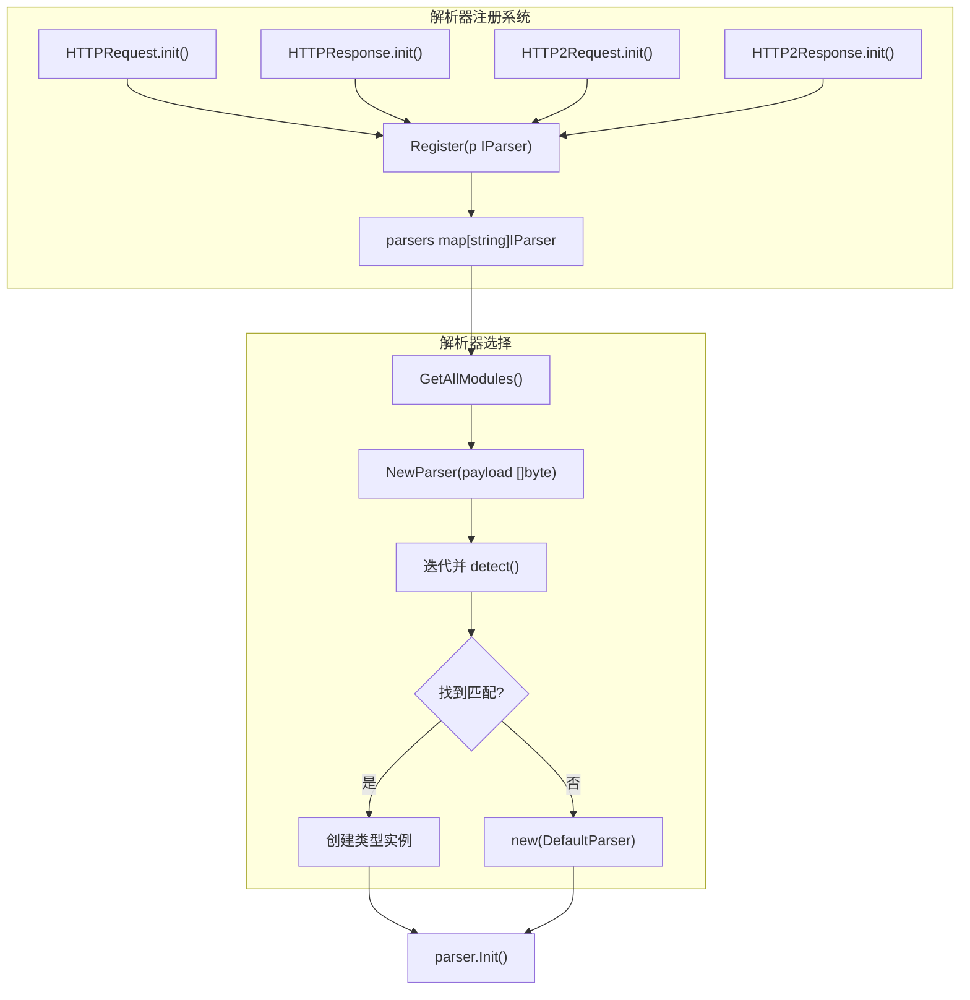
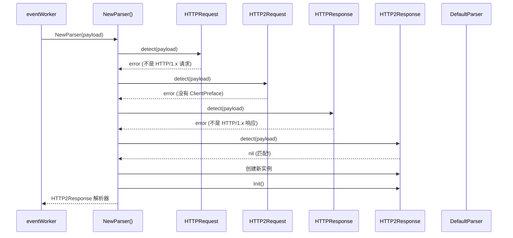
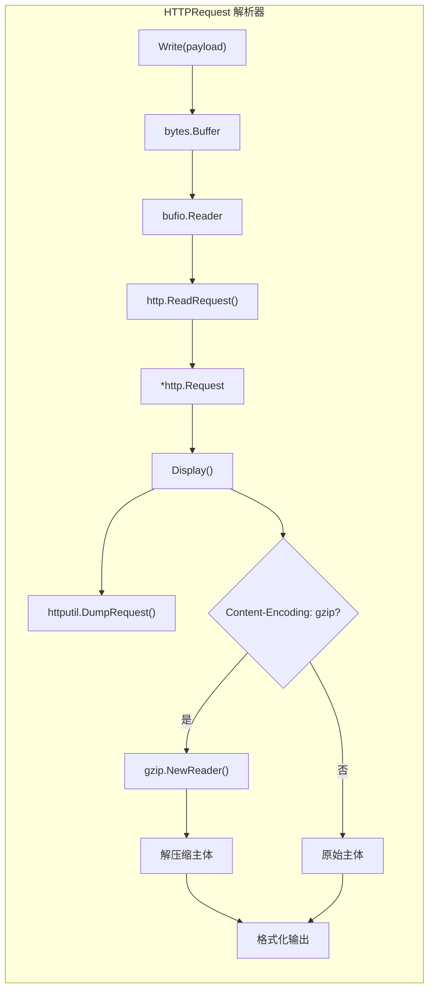
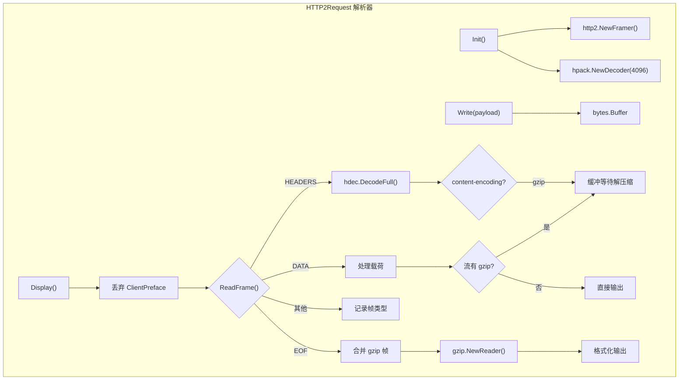
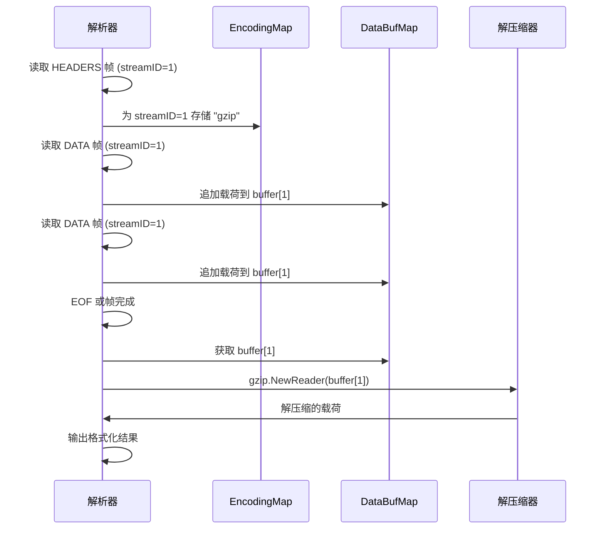
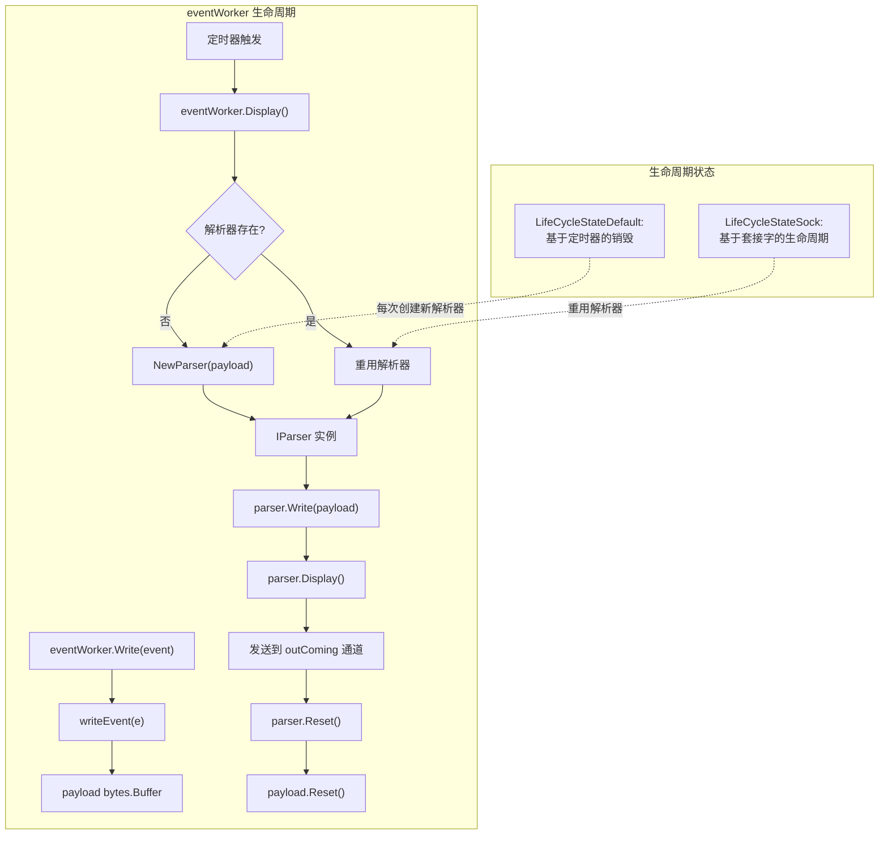

# 协议解析

## 目的与范围

协议解析子系统用于解释从 SSL/TLS 连接中捕获的载荷数据，为 HTTP/1.x 和 HTTP/2 协议提供自动检测和结构化输出。解析器处理 HPACK 头部解压缩、gzip 内容解压缩和特定协议的格式化。它们在事件处理流程中运行（参见[事件处理流程](2.2-event-processing-pipeline.md)），将原始二进制载荷转换为可读的协议消息。

相关主题：输入事件结构参见[事件结构与类型](2.3-event-structures-and-types.md)，格式化输出处理参见[输出格式](../4-output-formats/index.md)。

---

## 解析器架构

### IParser 接口

所有协议解析器的核心抽象是在 [pkg/event_processor/iparser.go:49-60](https://github.com/gojue/ecapture/blob/ca085d05/pkg/event_processor/iparser.go#L49-L60) 中定义的 `IParser` 接口。每个解析器实现都必须满足此接口：

| 方法 | 用途 |
|--------|---------|
| `detect(b []byte) error` | 识别载荷是否匹配此协议 |
| `Write(b []byte) (int, error)` | 累积载荷数据用于解析 |
| `ParserType() ParserType` | 返回解析器类型标识符 |
| `PacketType() PacketType` | 返回检测到的编码/压缩类型 |
| `Name() string` | 返回人类可读的解析器名称 |
| `IsDone() bool` | 指示解析是否完成 |
| `Init()` | 初始化解析器状态 |
| `Display() []byte` | 返回格式化输出 |
| `Reset()` | 清除状态以便重用 |

**来源：** [pkg/event_processor/iparser.go:49-60](https://github.com/gojue/ecapture/blob/ca085d05/pkg/event_processor/iparser.go#L49-L60)

### 解析器与数据包类型

系统定义了用于解析器标识和内容编码的枚举：

```go
// ParserType 标识协议解析器
const (
    ParserTypeNull ParserType = iota
    ParserTypeHttpRequest
    ParserTypeHttp2Request
    ParserTypeHttpResponse
    ParserTypeHttp2Response
    ParserTypeWebSocket
)

// PacketType 标识内容编码
const (
    PacketTypeNull PacketType = iota
    PacketTypeUnknow
    PacketTypeGzip
    PacketTypeWebSocket
)
```

`ParserType` 被事件处理系统用于路由事件，而 `PacketType` 指示内容是否被压缩以及在解析期间是否已被解压缩。

**来源：** [pkg/event_processor/iparser.go:23-47](https://github.com/gojue/ecapture/blob/ca085d05/pkg/event_processor/iparser.go#L23-L47)

### 解析器注册系统

解析器使用 `init()` 函数模式进行自注册。注册系统维护一个可用解析器的全局映射表：



`Register()` 函数 [pkg/event_processor/iparser.go:64-73](https://github.com/gojue/ecapture/blob/ca085d05/pkg/event_processor/iparser.go#L64-L73) 将解析器添加到全局映射表中，确保没有重复的名称。当新的载荷数据到达时，`NewParser()` [pkg/event_processor/iparser.go:85-115](https://github.com/gojue/ecapture/blob/ca085d05/pkg/event_processor/iparser.go#L85-L115) 遍历已注册的解析器，调用每个 `detect()` 方法直到找到匹配，或回退到 `DefaultParser`。

**来源：** [pkg/event_processor/iparser.go:62-115](https://github.com/gojue/ecapture/blob/ca085d05/pkg/event_processor/iparser.go#L62-L115)

---

## 解析器检测与选择

解析器选择过程使用尝试所有解析器的方法，在第一次匹配时提前终止：



每个解析器的 `detect()` 方法检查协议特定的标记：
- **HTTP/1.x 请求**：通过 `http.ReadRequest()` 检查标准 HTTP 方法（GET、POST 等）[pkg/event_processor/http_request.go:83-91](https://github.com/gojue/ecapture/blob/ca085d05/pkg/event_processor/http_request.go#L83-L91)
- **HTTP/1.x 响应**：通过 `http.ReadResponse()` 检查 HTTP 版本行 [pkg/event_processor/http_response.go:94-102](https://github.com/gojue/ecapture/blob/ca085d05/pkg/event_processor/http_response.go#L94-L102)
- **HTTP/2 请求**：ClientPreface 魔术字符串 "PRI * HTTP/2.0\r\n\r\nSM\r\n\r\n" [pkg/event_processor/http2_request.go:42-58](https://github.com/gojue/ecapture/blob/ca085d05/pkg/event_processor/http2_request.go#L42-L58)
- **HTTP/2 响应**：有效的帧头部结构 [pkg/event_processor/http2_response.go:56-88](https://github.com/gojue/ecapture/blob/ca085d05/pkg/event_processor/http2_response.go#L56-L88)

**来源：** [pkg/event_processor/iparser.go:85-115](https://github.com/gojue/ecapture/blob/ca085d05/pkg/event_processor/iparser.go#L85-L115), [pkg/event_processor/http_request.go:83-91](https://github.com/gojue/ecapture/blob/ca085d05/pkg/event_processor/http_request.go#L83-L91), [pkg/event_processor/http_response.go:94-102](https://github.com/gojue/ecapture/blob/ca085d05/pkg/event_processor/http_response.go#L94-L102), [pkg/event_processor/http2_request.go:42-58](https://github.com/gojue/ecapture/blob/ca085d05/pkg/event_processor/http2_request.go#L42-L58), [pkg/event_processor/http2_response.go:56-88](https://github.com/gojue/ecapture/blob/ca085d05/pkg/event_processor/http2_response.go#L56-L88)

---

## HTTP/1.x 解析

### 请求解析

`HTTPRequest` 解析器使用 Go 的标准 `net/http` 包来解析 HTTP/1.x 请求：



解析器在缓冲区中累积数据 [pkg/event_processor/http_request.go:54-80](https://github.com/gojue/ecapture/blob/ca085d05/pkg/event_processor/http_request.go#L54-L80)，然后使用 `http.ReadRequest()` 解析头部和主体。在第一次写入时，它初始化请求结构；后续写入累积主体数据。

**Gzip 检测与解压缩：** 解析器检查 `Content-Encoding` 头部 [pkg/event_processor/http_request.go:123-142](https://github.com/gojue/ecapture/blob/ca085d05/pkg/event_processor/http_request.go#L123-L142)。如果设置为 "gzip"，它会：
1. 从主体字节创建 `gzip.NewReader()`
2. 通过 `io.ReadAll()` 解压缩
3. 将 `PacketType` 设置为 `PacketTypeGzip`
4. 在输出中返回解压缩的内容

**来源：** [pkg/event_processor/http_request.go:28-163](https://github.com/gojue/ecapture/blob/ca085d05/pkg/event_processor/http_request.go#L28-L163)

### 响应解析

`HTTPResponse` 解析器遵循类似的结构，但使用 `http.ReadResponse()`：

| 字段 | 用途 |
|-------|---------|
| `response *http.Response` | 解析的 HTTP 响应结构 |
| `reader *bytes.Buffer` | 累积原始字节 |
| `bufReader *bufio.Reader` | 为 http.ReadResponse 提供缓冲 |
| `packerType PacketType` | 跟踪 gzip 压缩 |
| `isInit bool` | 指示是否已解析响应头部 |

解析器通过 Go 的 HTTP 库自动处理分块传输编码。当调用 `Display()` 时 [pkg/event_processor/http_response.go:115-175](https://github.com/gojue/ecapture/blob/ca085d05/pkg/event_processor/http_response.go#L115-L175)，它会：
1. 通过 `io.ReadAll()` 读取完整的响应主体
2. 通过 `Content-Encoding` 头部检测 gzip
3. 如有必要进行解压缩
4. 使用 `httputil.DumpResponse()` 进行格式化输出

**截断主体处理：** 解析器优雅地处理 `io.ErrUnexpectedEOF` [pkg/event_processor/http_response.go:121-128](https://github.com/gojue/ecapture/blob/ca085d05/pkg/event_processor/http_response.go#L121-L128)，当 SSL/TLS 数据增量捕获且声明的 `Content-Length` 超过接收的数据时会发生此情况。

**来源：** [pkg/event_processor/http_response.go:28-182](https://github.com/gojue/ecapture/blob/ca085d05/pkg/event_processor/http_response.go#L28-L182)

---

## HTTP/2 解析

由于二进制帧和 HPACK 头部压缩，HTTP/2 解析明显更复杂。

### HTTP/2 帧结构

所有 HTTP/2 通信使用带有 9 字节头部的帧 [pkg/event_processor/http2_response.go:56-88](https://github.com/gojue/ecapture/blob/ca085d05/pkg/event_processor/http2_response.go#L56-L88)：

```
+-----------------------------------------------+
|                 Length (24)                   |
+---------------+---------------+---------------+
|   Type (8)    |   Flags (8)   |
+-+-------------+---------------+-------------------------------+
|R|                 Stream Identifier (31)                      |
+=+=============================================================+
|                   Frame Payload (0...)                      ...
+---------------------------------------------------------------+
```

帧类型包括：`DATA`、`HEADERS`、`PRIORITY`、`RST_STREAM`、`SETTINGS`、`PUSH_PROMISE`、`PING`、`GOAWAY`、`WINDOW_UPDATE`、`CONTINUATION`。

### HTTP/2 请求解析



**ClientPreface 检测：** HTTP/2 请求以魔术字符串 "PRI * HTTP/2.0\r\n\r\nSM\r\n\r\n" 开始 [pkg/event_processor/http2_request.go:42-58](https://github.com/gojue/ecapture/blob/ca085d05/pkg/event_processor/http2_request.go#L42-L58)。`detect()` 方法验证这个 24 字节序列。在 `Display()` 期间，解析器在处理帧之前丢弃此前言 [pkg/event_processor/http2_request.go:103-112](https://github.com/gojue/ecapture/blob/ca085d05/pkg/event_processor/http2_request.go#L103-L112)。

**帧处理：** 解析器使用来自 `golang.org/x/net/http2` 的 `http2.Framer` [pkg/event_processor/http2_request.go:61-71](https://github.com/gojue/ecapture/blob/ca085d05/pkg/event_processor/http2_request.go#L61-L71) 顺序读取帧。对于每个帧：
- **HEADERS 帧**：使用 `hpack.Decoder` 解压缩头部字段 [pkg/event_processor/http2_request.go:129-145](https://github.com/gojue/ecapture/blob/ca085d05/pkg/event_processor/http2_request.go#L129-L145)
- **DATA 帧**：收集载荷字节，按流 ID 跟踪压缩 [pkg/event_processor/http2_request.go:146-165](https://github.com/gojue/ecapture/blob/ca085d05/pkg/event_processor/http2_request.go#L146-L165)
- **其他帧**：记录帧类型和流 ID

**来源：** [pkg/event_processor/http2_request.go:32-206](https://github.com/gojue/ecapture/blob/ca085d05/pkg/event_processor/http2_request.go#L32-L206)

### HTTP/2 响应解析

`HTTP2Response` 解析器共享类似的结构但处理响应：

```mermaid
graph TB
    subgraph "HPACK 动态表"
        SharedTable["hpack.Decoder 在连接间共享"]
        Note["RFC 7541 第 2.2 节:<br/>一个元组 = 一个表"]
    end
    
    subgraph "每流状态"
        EncodingMap["encodingMap[streamID]string"]
        DataBufMap["dataBufMap[streamID]*bytes.Buffer"]
        
        HEADERSFrame["HEADERS 帧"]
        HEADERSFrame --> DecodeHeaders["hdec.DecodeFull()"]
        DecodeHeaders --> ExtractEncoding["提取 content-encoding"]
        ExtractEncoding --> EncodingMap
        
        DATAFrame["DATA 帧"]
        DATAFrame --> CheckEncoding{"encodingMap[streamID]?"}
        CheckEncoding -->|gzip| DataBufMap
        CheckEncoding -->|无| DirectOut["直接输出"]
        
        DataBufMap --> MergePhase["所有帧之后"]
        MergePhase --> Decompress["gzip 解压缩"]
    end
    
    SharedTable -.->|维护上下文| DecodeHeaders
```



**HPACK 动态表：** HTTP/2 规范要求在整个连接上维护一个共享的动态表 [pkg/event_processor/http2_response.go:94-100](https://github.com/gojue/ecapture/blob/ca085d05/pkg/event_processor/http2_response.go#L94-L100)。解析器为每个连接生命周期创建一个 `hpack.Decoder`，而不是为每个帧创建。这在多个请求/响应对之间保留了头部压缩上下文。

**不完整帧处理：** 在增量 SSL/TLS 捕获期间，帧可能被截断。解析器优雅地处理 `io.ErrUnexpectedEOF` [pkg/event_processor/http2_response.go:137-144](https://github.com/gojue/ecapture/blob/ca085d05/pkg/event_processor/http2_response.go#L137-L144)，方法是：
1. 检查错误是否为 EOF 或 `ErrUnexpectedEOF`
2. 仅记录其他错误
3. 继续处理成功解析的帧

这可以防止在流式捕获期间出现虚假错误。

**来源：** [pkg/event_processor/http2_response.go:46-224](https://github.com/gojue/ecapture/blob/ca085d05/pkg/event_processor/http2_response.go#L46-L224)

### HPACK 头部压缩

HPACK（HTTP/2 头部压缩）通过以下方式减少头部冗余：

| 机制 | 描述 |
|-----------|-------------|
| 静态表 | 预定义的常见头部（例如 `:method: GET`）|
| 动态表 | 连接特定的头部缓存（默认 4096 字节）|
| Huffman 编码 | 压缩头部字符串值 |

解析器使用 `hpack.DecodeFull()` 解码完整的头部块片段 [pkg/event_processor/http2_request.go:133-141](https://github.com/gojue/ecapture/blob/ca085d05/pkg/event_processor/http2_request.go#L133-L141)、[pkg/event_processor/http2_response.go:151-160](https://github.com/gojue/ecapture/blob/ca085d05/pkg/event_processor/http2_response.go#L151-L160)。每个解码的头部字段包含一个名称-值对。解析器特别关注 `content-encoding` 头部以按流跟踪压缩。

**CONTINUATION 帧限制：** 当前实现不支持跨 `CONTINUATION` 帧拆分的 `HEADERS` 帧 [pkg/event_processor/http2_request.go:143-144](https://github.com/gojue/ecapture/blob/ca085d05/pkg/event_processor/http2_request.go#L143-L144)、[pkg/event_processor/http2_response.go:162-163](https://github.com/gojue/ecapture/blob/ca085d05/pkg/event_processor/http2_response.go#L162-L163)。如果 `HeadersEnded()` 返回 false（表示头部不完整），它会记录警告。

**来源：** [pkg/event_processor/http2_request.go:129-145](https://github.com/gojue/ecapture/blob/ca085d05/pkg/event_processor/http2_request.go#L129-L145)、[pkg/event_processor/http2_response.go:146-163](https://github.com/gojue/ecapture/blob/ca085d05/pkg/event_processor/http2_response.go#L146-L163)

### HTTP/2 Gzip 解压缩

由于基于帧的流式传输，HTTP/2 gzip 处理与 HTTP/1.x 不同：



解析器维护两个按流 ID 键控的映射表 [pkg/event_processor/http2_request.go:114-115](https://github.com/gojue/ecapture/blob/ca085d05/pkg/event_processor/http2_request.go#L114-L115)、[pkg/event_processor/http2_response.go:132-133](https://github.com/gojue/ecapture/blob/ca085d05/pkg/event_processor/http2_response.go#L132-L133)：
1. `encodingMap[streamID]` - 按流跟踪内容编码
2. `dataBufMap[streamID]` - 按流累积 gzip 压缩的载荷

读取所有帧后，它解压缩累积的缓冲区 [pkg/event_processor/http2_request.go:172-189](https://github.com/gojue/ecapture/blob/ca085d05/pkg/event_processor/http2_request.go#L172-L189)、[pkg/event_processor/http2_response.go:190-207](https://github.com/gojue/ecapture/blob/ca085d05/pkg/event_processor/http2_response.go#L190-L207)：
1. 检查流是否有 gzip 编码
2. 从累积的缓冲区创建 `gzip.NewReader()`
3. 通过 `io.ReadAll()` 读取解压缩的数据
4. 附加到带有流 ID 注释的输出

**来源：** [pkg/event_processor/http2_request.go:114-189](https://github.com/gojue/ecapture/blob/ca085d05/pkg/event_processor/http2_request.go#L114-L189)、[pkg/event_processor/http2_response.go:132-207](https://github.com/gojue/ecapture/blob/ca085d05/pkg/event_processor/http2_response.go#L132-L207)

---

## 默认解析器

当未检测到特定协议时，`DefaultParser` 作为回退：

```go
type DefaultParser struct {
    reader *bytes.Buffer
    isdone bool
}
```

它提供最小处理 [pkg/event_processor/iparser.go:117-166](https://github.com/gojue/ecapture/blob/ca085d05/pkg/event_processor/iparser.go#L117-L166)：
1. 在缓冲区中累积所有字节
2. 在 `Display()` 时，检查第一个字节的可打印性
3. 如果字节 < 32 或 > 126（不可打印），输出十六进制转储
4. 否则，将 C 风格的空终止字符串转换为 Go 字符串

这确保即使协议特定的解析失败，也可以查看所有捕获的数据。

**来源：** [pkg/event_processor/iparser.go:117-166](https://github.com/gojue/ecapture/blob/ca085d05/pkg/event_processor/iparser.go#L117-L166)

---

## 与事件工作者的集成

解析器在事件处理流程中的事件工作者上下文中运行：



**解析器实例化：** 工作者在 `parserEvents()` 方法中懒惰地创建解析器 [pkg/event_processor/iworker.go:248-260](https://github.com/gojue/ecapture/blob/ca085d05/pkg/event_processor/iworker.go#L248-L260)：
- 第 251 行：`if ew.parser == nil { ew.parser = NewParser(ew.payload.Bytes()) }` 在第一次解析时创建解析器
- 对于 `LifeCycleStateDefault` 工作者（基于定时器的销毁），每次可能创建一个新解析器
- 对于 `LifeCycleStateSock` 工作者（基于套接字的生命周期），解析器在多个事件之间持久存在
- `NewParser()` 通过尝试每个已注册解析器的 `detect()` 方法来检测协议

**两种生命周期模型：**

| 生命周期状态 | 解析器行为 | 用例 |
|----------------|-----------------|----------|
| `LifeCycleStateDefault` | 在第一次解析时创建解析器，当工作者在 1 秒不活动后超时时销毁 [pkg/event_processor/iworker.go:279-289](https://github.com/gojue/ecapture/blob/ca085d05/pkg/event_processor/iworker.go#L279-L289) | 短期或一次性 SSL/TLS 连接 |
| `LifeCycleStateSock` | 在第一次解析时创建解析器，重用直到套接字关闭 [pkg/event_processor/iworker.go:280-284](https://github.com/gojue/ecapture/blob/ca085d05/pkg/event_processor/iworker.go#L280-L284) | 需要 HPACK 状态的长期连接（例如 HTTP/2 多路复用）|

套接字生命周期模型对于 HTTP/2 连接至关重要，因为 HPACK 动态表必须在连接中的所有帧之间持久存在 [pkg/event_processor/http2_response.go:94-100](https://github.com/gojue/ecapture/blob/ca085d05/pkg/event_processor/http2_response.go#L94-L100)。

**解析器生命周期阶段：**
1. **累积阶段**：事件载荷字节在 `eventWorker.payload` 缓冲区中累积 [pkg/event_processor/iworker.go:230-245](https://github.com/gojue/ecapture/blob/ca085d05/pkg/event_processor/iworker.go#L230-L245)
2. **解析阶段**：定时器触发（`MaxTickerCount = 10`，或 1 秒）[pkg/event_processor/iworker.go:279](https://github.com/gojue/ecapture/blob/ca085d05/pkg/event_processor/iworker.go#L279) 并调用 `Display()`
3. **懒惰实例化**：第一次调用 `parserEvents()` 通过 `NewParser()` 创建解析器 [pkg/event_processor/iworker.go:251-252](https://github.com/gojue/ecapture/blob/ca085d05/pkg/event_processor/iworker.go#L251-L252)
4. **写入阶段**：`parser.Write()` 接收所有累积的字节 [pkg/event_processor/iworker.go:254](https://github.com/gojue/ecapture/blob/ca085d05/pkg/event_processor/iworker.go#L254)
5. **显示阶段**：`parser.Display()` 返回格式化输出 [pkg/event_processor/iworker.go:259](https://github.com/gojue/ecapture/blob/ca085d05/pkg/event_processor/iworker.go#L259)
6. **重置阶段**：解析器状态通过 `parser.Reset()` 清除 [pkg/event_processor/iworker.go:183](https://github.com/gojue/ecapture/blob/ca085d05/pkg/event_processor/iworker.go#L183)，载荷缓冲区通过 `ew.payload.Reset()` 清除 [pkg/event_processor/iworker.go:184](https://github.com/gojue/ecapture/blob/ca085d05/pkg/event_processor/iworker.go#L184)

**截断支持：** 工作者遵守 `truncateSize` 配置 [pkg/event_processor/iworker.go:236-242](https://github.com/gojue/ecapture/blob/ca085d05/pkg/event_processor/iworker.go#L236-L242)，在解析之前限制累积的载荷大小。达到限制时，载荷被截断并生成日志消息 [pkg/event_processor/iworker.go:238-241](https://github.com/gojue/ecapture/blob/ca085d05/pkg/event_processor/iworker.go#L238-L241)。

**来源：** [pkg/event_processor/iworker.go:51-306](https://github.com/gojue/ecapture/blob/ca085d05/pkg/event_processor/iworker.go#L51-L306)、[pkg/event_processor/http2_response.go:94-100](https://github.com/gojue/ecapture/blob/ca085d05/pkg/event_processor/http2_response.go#L94-L100)

---

## 关键设计决策

| 决策 | 理由 | 实现 |
|----------|-----------|----------------|
| 通过 `init()` 自注册解析器 | 使新协议解析器能够模块化添加而无需修改核心代码 | [pkg/event_processor/iparser.go:64-73](https://github.com/gojue/ecapture/blob/ca085d05/pkg/event_processor/iparser.go#L64-L73) `Register()` 函数，从解析器 `init()` 函数调用 |
| 通过试错检测 | 比魔术字节检查更简单；利用标准库协议解析器 | [pkg/event_processor/iparser.go:85-115](https://github.com/gojue/ecapture/blob/ca085d05/pkg/event_processor/iparser.go#L85-L115) `NewParser()` 迭代已注册的解析器 |
| 两种工作者生命周期模型 | 平衡内存效率（默认）与协议状态要求（套接字）| [pkg/event_processor/iworker.go:57-63](https://github.com/gojue/ecapture/blob/ca085d05/pkg/event_processor/iworker.go#L57-L63) `LifeCycleState` 枚举和生命周期逻辑 [pkg/event_processor/iworker.go:262-306](https://github.com/gojue/ecapture/blob/ca085d05/pkg/event_processor/iworker.go#L262-L306) |
| 在套接字生命周期中重用解析器 | 维护跨连接的 HTTP/2 HPACK 动态表 | [pkg/event_processor/iworker.go:251](https://github.com/gojue/ecapture/blob/ca085d05/pkg/event_processor/iworker.go#L251) 解析器持久存在，[pkg/event_processor/http2_response.go:94-100](https://github.com/gojue/ecapture/blob/ca085d05/pkg/event_processor/http2_response.go#L94-L100) HPACK 解码器重用 |
| 优雅处理 `io.ErrUnexpectedEOF` | 增量 TLS 捕获期间的正常情况；不是错误 | [pkg/event_processor/http_response.go:121-128](https://github.com/gojue/ecapture/blob/ca085d05/pkg/event_processor/http_response.go#L121-L128)、[pkg/event_processor/http2_response.go:137-144](https://github.com/gojue/ecapture/blob/ca085d05/pkg/event_processor/http2_response.go#L137-L144) 错误检查 |
| HTTP/2 中按流跟踪 gzip | HTTP/2 多路复用流；压缩是按流的，而不是按连接的 | [pkg/event_processor/http2_request.go:114-115](https://github.com/gojue/ecapture/blob/ca085d05/pkg/event_processor/http2_request.go#L114-L115) `encodingMap` 和 `dataBufMap` 按流 ID 键控 |
| 十六进制转储回退 | 确保即使协议未知也可以查看所有数据 | [pkg/event_processor/iparser.go:117-166](https://github.com/gojue/ecapture/blob/ca085d05/pkg/event_processor/iparser.go#L117-L166) `DefaultParser` 带有十六进制转储逻辑 [pkg/event_processor/iparser.go:152-160](https://github.com/gojue/ecapture/blob/ca085d05/pkg/event_processor/iparser.go#L152-L160) |

**来源：** [pkg/event_processor/iparser.go:64-166](https://github.com/gojue/ecapture/blob/ca085d05/pkg/event_processor/iparser.go#L64-L166)、[pkg/event_processor/iworker.go:51-306](https://github.com/gojue/ecapture/blob/ca085d05/pkg/event_processor/iworker.go#L51-L306)、[pkg/event_processor/http2_request.go:114-189](https://github.com/gojue/ecapture/blob/ca085d05/pkg/event_processor/http2_request.go#L114-L189)、[pkg/event_processor/http2_response.go:94-207](https://github.com/gojue/ecapture/blob/ca085d05/pkg/event_processor/http2_response.go#L94-L207)、[pkg/event_processor/http_response.go:121-128](https://github.com/gojue/ecapture/blob/ca085d05/pkg/event_processor/http_response.go#L121-L128)