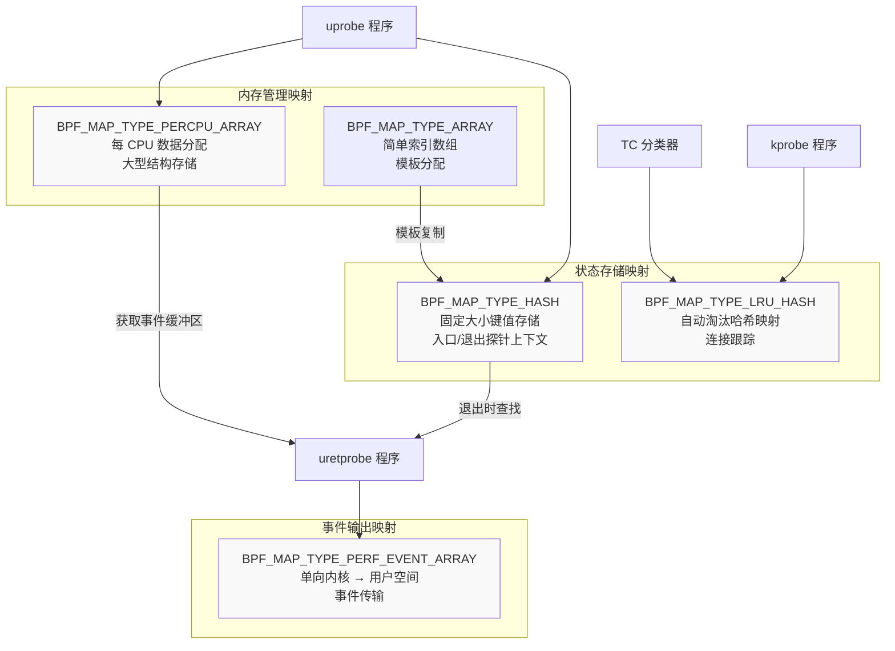
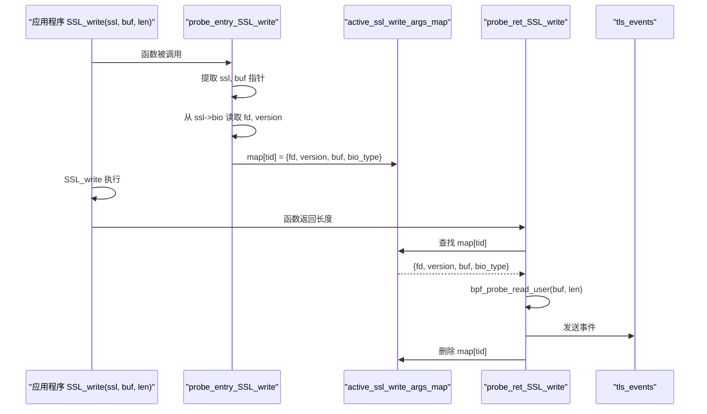
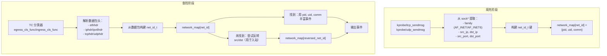
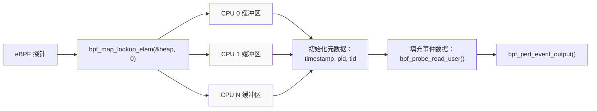
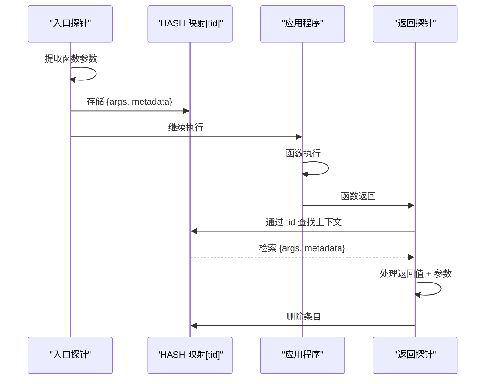

# eBPF 映射与数据结构

本页面记录了 eCapture 各模块中使用的所有 BPF 映射和数据结构，用于存储状态、传递事件以及在 eBPF 执行环境的约束下管理内存。这些映射构成了内核空间 eBPF 程序和用户空间事件处理之间的桥梁。

关于从这些映射读取事件后如何处理的信息，请参见[事件处理流程](2.2-event-processing-pipeline.md)。有关事件结构定义和类型的详细信息，请参见[事件结构与类型](2.3-event-structures-and-types.md)。

## 概述

eCapture 使用 BPF 映射主要有三个目的：

1. **事件输出** - 通过 PERF_EVENT_ARRAY 或 RINGBUF 将捕获的数据从内核传输到用户空间
2. **状态存储** - 使用 HASH 和 LRU_HASH 映射维护函数入口/退出探针之间的上下文
3. **内存管理** - 使用 PERCPU_ARRAY 实现堆分配，以规避 eBPF 的 512 字节栈限制

所有映射遵循一致的命名约定，并在模块内的 eBPF 程序之间共享。映射定义使用基于 BTF 的声明语法，带有 `SEC(".maps")` 注解。

来源：[kern/openssl.h:74-135](https://github.com/gojue/ecapture/blob/ca085d05/kern/openssl.h#L74-L135), [kern/tc.h:56-78](https://github.com/gojue/ecapture/blob/ca085d05/kern/tc.h#L56-L78), [kern/gotls_kern.c:50-72](https://github.com/gojue/ecapture/blob/ca085d05/kern/gotls_kern.c#L50-L72), [kern/openssl_masterkey.h:45-68](https://github.com/gojue/ecapture/blob/ca085d05/kern/openssl_masterkey.h#L45-L68)

## 映射类型概览



**映射类型选择理由：**

| 映射类型 | 使用场景 | 选择原因 |
|----------|----------|----------|
| `PERF_EVENT_ARRAY` | 事件输出 | 高效批量数据传输到用户空间，开销最小 |
| `HASH` | 短期上下文 | 快速查找用于入口/退出探针关联（PID/TID 键） |
| `LRU_HASH` | 连接跟踪 | 自动淘汰防止长期运行进程的内存耗尽 |
| `PERCPU_ARRAY` | 大型结构 | 绕过 512 字节栈限制；无 CPU 竞争 |
| `ARRAY` | 模板存储 | 单条目数组用作堆分配模板 |

来源：[kern/openssl.h:79-135](https://github.com/gojue/ecapture/blob/ca085d05/kern/openssl.h#L79-L135), [kern/tc.h:57-78](https://github.com/gojue/ecapture/blob/ca085d05/kern/tc.h#L57-L78)

## OpenSSL/BoringSSL 模块映射

### 事件输出映射

#### tls_events

**类型：** `BPF_MAP_TYPE_PERF_EVENT_ARRAY`  
**用途：** 将捕获的 SSL/TLS 明文数据从内核传输到用户空间  
**键：** CPU ID (u32)  
**值：** perf 环形缓冲区引用 (u32)  
**最大条目数：** 1024

该映射输出包含解密 TLS 数据的 `ssl_data_event_t` 结构，这些数据通过 `SSL_read` 和 `SSL_write` 的 uprobe 钩子捕获。每个事件包括明文载荷（最多 16KB）、进程元数据、文件描述符、TLS 版本和 BIO 类型。

```mermaid
graph LR
    WRITE["probe_entry_SSL_write<br/>kern/openssl.h:332"] --> STORE["在 active_ssl_write_args_map<br/>中存储参数"]
    STORE --> RET["probe_ret_SSL_write<br/>kern/openssl.h:337"]
    RET --> LOOKUP["查找已保存的参数"]
    LOOKUP --> CREATE["create_ssl_data_event()<br/>kern/openssl.h:141"]
    CREATE --> HEAP["从 data_buffer_heap<br/>获取缓冲区"]
    HEAP --> READ["bpf_probe_read_user()<br/>读取明文"]
    READ --> OUTPUT["bpf_perf_event_output()<br/>kern/openssl.h:188"]
    OUTPUT --> TLS_EVENTS["tls_events 映射"]
    TLS_EVENTS --> USERSPACE["用户空间<br/>perfEventReader"]
```



**事件结构：** `ssl_data_event_t`
- `type` - kSSLRead (0) 或 kSSLWrite (1)
- `timestamp_ns` - 捕获时间戳
- `pid`, `tid` - 进程/线程标识符
- `data[MAX_DATA_SIZE_OPENSSL]` - 明文载荷（最大 16KB）
- `data_len` - 实际载荷长度
- `comm[TASK_COMM_LEN]` - 进程名称
- `fd` - 文件描述符
- `version` - TLS 协议版本
- `bio_type` - OpenSSL BIO 类型（socket、file 等）

来源：[kern/openssl.h:79-84](https://github.com/gojue/ecapture/blob/ca085d05/kern/openssl.h#L79-L84), [kern/openssl.h:28-39](https://github.com/gojue/ecapture/blob/ca085d05/kern/openssl.h#L28-L39), [kern/openssl.h:164-191](https://github.com/gojue/ecapture/blob/ca085d05/kern/openssl.h#L164-L191)

#### connect_events

**类型：** `BPF_MAP_TYPE_PERF_EVENT_ARRAY`  
**用途：** 跟踪 TCP 连接生命周期（connect、accept、destroy）  
**键：** CPU ID (u32)  
**值：** perf 环形缓冲区引用 (u32)  
**最大条目数：** 1024

从 `__sys_connect`、`__sys_accept4` 和 `tcp_v4_destroy_sock` 的 kprobe 输出 `connect_event_t` 结构。用于将文件描述符与网络套接字地址关联。

**事件结构：** `connect_event_t`
- `saddr`, `daddr` - 源/目标 IPv4/IPv6 地址（128 位）
- `sport`, `dport` - 源/目标端口
- `sock` - 内核套接字结构地址
- `fd` - 文件描述符
- `family` - AF_INET 或 AF_INET6
- `is_destroy` - 连接销毁标志
- packed 属性以避免填充空洞

来源：[kern/openssl.h:87-92](https://github.com/gojue/ecapture/blob/ca085d05/kern/openssl.h#L87-L92), [kern/openssl.h:41-55](https://github.com/gojue/ecapture/blob/ca085d05/kern/openssl.h#L41-L55), [kern/openssl.h:395-454](https://github.com/gojue/ecapture/blob/ca085d05/kern/openssl.h#L395-L454)

### 状态存储映射

#### active_ssl_read_args_map 和 active_ssl_write_args_map

**类型：** `BPF_MAP_TYPE_HASH`  
**用途：** 在入口和退出探针之间存储 SSL 函数参数  
**键：** 来自 `bpf_get_current_pid_tgid()` 的线程 ID (u64)  
**值：** `active_ssl_buf` 结构  
**最大条目数：** 1024

这些映射实现了**两阶段探针模式**：入口探针存储函数参数（SSL 指针、缓冲区指针），然后返回探针检索它们以在函数完成后读取实际数据。



**值结构：** `active_ssl_buf`
- `version` - SSL 协议版本
- `fd` - 文件描述符
- `bio_type` - OpenSSL BIO 类型
- `buf` - 数据缓冲区指针

来源：[kern/openssl.h:97-109](https://github.com/gojue/ecapture/blob/ca085d05/kern/openssl.h#L97-L109), [kern/openssl.h:57-67](https://github.com/gojue/ecapture/blob/ca085d05/kern/openssl.h#L57-L67), [kern/openssl.h:268-323](https://github.com/gojue/ecapture/blob/ca085d05/kern/openssl.h#L268-L323)

#### tcp_fd_infos

**类型：** `BPF_MAP_TYPE_HASH`  
**用途：** 在 connect/accept 期间将文件描述符与内核套接字结构关联  
**键：** PID/TID (u64)  
**值：** `tcp_fd_info` 结构  
**最大条目数：** 10240

在多阶段 kprobe 序列中使用：
1. `probe_connect` 从系统调用参数存储 `fd`
2. `probe_inet_stream_connect` 添加 `sock` 指针
3. `retprobe_connect` 检索两者以发出连接事件

**值结构：** `tcp_fd_info`
- `sock` - 内核套接字结构地址
- `fd` - 文件描述符

来源：[kern/openssl.h:129-134](https://github.com/gojue/ecapture/blob/ca085d05/kern/openssl.h#L129-L134), [kern/openssl.h:69-72](https://github.com/gojue/ecapture/blob/ca085d05/kern/openssl.h#L69-L72), [kern/openssl.h:354-393](https://github.com/gojue/ecapture/blob/ca085d05/kern/openssl.h#L354-L393)

#### ssl_st_fd

**类型：** `BPF_MAP_TYPE_HASH`  
**用途：** 从 SSL_set_fd() 存储 SSL 结构到文件描述符的映射  
**键：** SSL 结构地址 (u64)  
**值：** 文件描述符 (u64)  
**最大条目数：** 10240

通过在钩子 `SSL_set_fd`、`SSL_set_rfd`、`SSL_set_wfd` 函数时提供回退 FD 查找，处理 `ssl->bio->num` 为零的情况。

来源：[kern/openssl.h:121-126](https://github.com/gojue/ecapture/blob/ca085d05/kern/openssl.h#L121-L126), [kern/openssl.h:528-543](https://github.com/gojue/ecapture/blob/ca085d05/kern/openssl.h#L528-L543)

### 内存管理映射

#### data_buffer_heap

**类型：** `BPF_MAP_TYPE_PERCPU_ARRAY`  
**用途：** 大型事件结构的堆分配（规避 512 字节栈限制）  
**键：** 始终为 0 (u32)  
**值：** `ssl_data_event_t` 结构  
**最大条目数：** 1

每 CPU 设计消除了锁定开销并防止数据竞争。`create_ssl_data_event()` 辅助函数检索缓冲区、初始化元数据并返回指针供探针填充。

```c
// eCapture eBPF 程序中使用的内存分配模式
static __inline struct ssl_data_event_t* create_ssl_data_event(u64 current_pid_tgid) {
    u32 kZero = 0;
    // 查找返回每 CPU 实例，无竞争
    struct ssl_data_event_t* event = bpf_map_lookup_elem(&data_buffer_heap, &kZero);
    if (event == NULL) return NULL;
    
    // 初始化公共字段
    event->timestamp_ns = bpf_ktime_get_ns();
    event->pid = current_pid_tgid >> 32;
    event->tid = current_pid_tgid & 0xffffffff;
    return event;
}
```

**为什么使用 PERCPU_ARRAY：**
- eBPF 栈限制为 512 字节，但 `ssl_data_event_t` 约为 16KB
- 每 CPU 设计：不需要锁定，无竞争
- 单条目数组（键始终为 0）充当临时空间
- 比动态堆分配更便宜

来源：[kern/openssl.h:113-118](https://github.com/gojue/ecapture/blob/ca085d05/kern/openssl.h#L113-L118), [kern/openssl.h:141-158](https://github.com/gojue/ecapture/blob/ca085d05/kern/openssl.h#L141-L158)

## Traffic Control (TC) 模块映射

### 事件输出映射

#### skb_events

**类型：** `BPF_MAP_TYPE_PERF_EVENT_ARRAY`  
**用途：** 输出原始网络数据包元数据和载荷  
**键：** CPU ID (u32)  
**值：** perf 环形缓冲区引用 (u32)  
**最大条目数：** 10240

从 TC 分类器程序（`egress_cls_func`、`ingress_cls_func`）输出 `skb_data_event_t` 结构。每个事件包括数据包元数据，这些元数据通过来自 `network_map` 的进程上下文进行了丰富。

**事件结构：** `skb_data_event_t`
- `ts` - 时间戳
- `pid` - 进程 ID（来自 network_map 查找）
- `comm[TASK_COMM_LEN]` - 进程名称
- `len` - 数据包长度
- `ifindex` - 网络接口索引

来源：[kern/tc.h:57-62](https://github.com/gojue/ecapture/blob/ca085d05/kern/tc.h#L57-L62), [kern/tc.h:30-37](https://github.com/gojue/ecapture/blob/ca085d05/kern/tc.h#L30-L37)

#### skb_data_buffer_heap

**类型：** `BPF_MAP_TYPE_PERCPU_ARRAY`  
**用途：** SKB 事件结构的每 CPU 分配  
**键：** 始终为 0 (u32)  
**值：** `skb_data_event_t` 结构  
**最大条目数：** 1

遵循与 OpenSSL 事件的 `data_buffer_heap` 相同的堆分配模式。由 `make_skb_data_event()` 辅助函数使用。

来源：[kern/tc.h:64-69](https://github.com/gojue/ecapture/blob/ca085d05/kern/tc.h#L64-L69), [kern/tc.h:92-100](https://github.com/gojue/ecapture/blob/ca085d05/kern/tc.h#L92-L100)

### 状态存储映射

#### network_map

**类型：** `BPF_MAP_TYPE_LRU_HASH`  
**用途：** 将网络 5 元组（协议、IP、端口）映射到进程上下文  
**键：** `net_id_t` 结构（5 元组）  
**值：** `net_ctx_t` 结构（PID、UID、comm）  
**最大条目数：** 10240

由 `tcp_sendmsg` 和 `udp_sendmsg` 的 kprobe 填充，然后由 TC 分类器查询以将数据包与进程关联。LRU 淘汰防止处理许多连接的服务器内存耗尽。



**键结构：** `net_id_t`
- `protocol` - IPPROTO_TCP、IPPROTO_UDP、IPPROTO_ICMP
- `src_ip4`, `dst_ip4` - IPv4 地址 (u32)
- `src_ip6[4]`, `dst_ip6[4]` - IPv6 地址（u32 数组）
- `src_port`, `dst_port` - 端口号

**值结构：** `net_ctx_t`
- `pid` - 进程 ID
- `uid` - 用户 ID
- `comm[TASK_COMM_LEN]` - 进程名称

来源：[kern/tc.h:72-77](https://github.com/gojue/ecapture/blob/ca085d05/kern/tc.h#L72-L77), [kern/tc.h:39-54](https://github.com/gojue/ecapture/blob/ca085d05/kern/tc.h#L39-L54), [kern/tc.h:285-333](https://github.com/gojue/ecapture/blob/ca085d05/kern/tc.h#L285-L333), [kern/tc.h:135-271](https://github.com/gojue/ecapture/blob/ca085d05/kern/tc.h#L135-L271)

## Go TLS 模块映射

### 事件输出映射

#### events (Go TLS 数据)

**类型：** `BPF_MAP_TYPE_PERF_EVENT_ARRAY`  
**用途：** 输出捕获的 Go TLS 明文数据  
**键：** CPU ID (u32)  
**值：** perf 环形缓冲区引用 (u32)  
**最大条目数：** 1024

从 Go 的 `crypto/tls.(*Conn).writeRecordLocked` 和 `crypto/tls.(*Conn).Read` 函数的 uprobe 输出 `go_tls_event` 结构。基于寄存器的 ABI（Go ≥1.17）和基于栈的 ABI（Go <1.17）有独立的探针。

**事件结构：** `go_tls_event`
- `ts_ns` - 时间戳
- `pid`, `tid` - 进程/线程标识符
- `data_len` - 载荷长度
- `event_type` - GOTLS_EVENT_TYPE_WRITE (0) 或 GOTLS_EVENT_TYPE_READ (1)
- `comm[TASK_COMM_LEN]` - 进程名称
- `data[MAX_DATA_SIZE_OPENSSL]` - 明文载荷（16KB）

来源：[kern/gotls_kern.c:60-65](https://github.com/gojue/ecapture/blob/ca085d05/kern/gotls_kern.c#L60-L65), [kern/gotls_kern.c:31-39](https://github.com/gojue/ecapture/blob/ca085d05/kern/gotls_kern.c#L31-L39)

#### mastersecret_go_events

**类型：** `BPF_MAP_TYPE_PERF_EVENT_ARRAY`  
**用途：** 捕获 TLS 主密钥以生成密钥日志  
**键：** CPU ID (u32)  
**值：** perf 环形缓冲区引用 (u32)  
**最大条目数：** 1024

钩子 `crypto/tls.(*Config).writeKeyLog` 以提取 TLS 1.3 流量密钥和 TLS 1.2 主密钥。每个事件包含标签字符串、客户端随机数和密钥字节。

**事件结构：** `mastersecret_gotls_t`
- `label[MASTER_SECRET_KEY_LEN]` - 密钥标签（例如，"CLIENT_HANDSHAKE_TRAFFIC_SECRET"）
- `labellen` - 标签字符串长度
- `client_random[EVP_MAX_MD_SIZE]` - 客户端随机字节
- `client_random_len` - 客户端随机长度
- `secret_[EVP_MAX_MD_SIZE]` - 密钥材料
- `secret_len` - 密钥长度

来源：[kern/gotls_kern.c:53-58](https://github.com/gojue/ecapture/blob/ca085d05/kern/gotls_kern.c#L53-L58), [kern/gotls_kern.c:41-48](https://github.com/gojue/ecapture/blob/ca085d05/kern/gotls_kern.c#L41-L48), [kern/gotls_kern.c:194-267](https://github.com/gojue/ecapture/blob/ca085d05/kern/gotls_kern.c#L194-L267)

### 内存管理映射

#### gte_context_gen

**类型：** `BPF_MAP_TYPE_PERCPU_ARRAY`  
**用途：** Go TLS 事件结构的每 CPU 分配  
**键：** 始终为 0 (u32)  
**值：** `go_tls_event` 结构  
**最大条目数：** 1

类似于 OpenSSL 的 `data_buffer_heap`，为大型事件结构提供堆分配。通过 `get_gotls_event()` 辅助函数访问。

来源：[kern/gotls_kern.c:67-72](https://github.com/gojue/ecapture/blob/ca085d05/kern/gotls_kern.c#L67-L72), [kern/gotls_kern.c:74-87](https://github.com/gojue/ecapture/blob/ca085d05/kern/gotls_kern.c#L74-L87)

## OpenSSL 主密钥映射

### 事件输出映射

#### mastersecret_events

**类型：** `BPF_MAP_TYPE_PERF_EVENT_ARRAY`  
**用途：** 捕获 OpenSSL/BoringSSL TLS 主密钥  
**键：** CPU ID (u32)  
**值：** perf 环形缓冲区引用 (u32)  
**最大条目数：** 1024

从 `SSL_write` 或配置的主密钥提取函数的 uprobe 输出 `mastersecret_t` 结构。包含 TLS 1.2 主密钥和 TLS 1.3 流量密钥。

**事件结构：** `mastersecret_t`
- **TLS 1.2 字段：**
  - `version` - SSL/TLS 版本常量
  - `client_random[SSL3_RANDOM_SIZE]` - 32 字节客户端随机数
  - `master_key[MASTER_SECRET_MAX_LEN]` - 48 字节主密钥
- **TLS 1.3 字段：**
  - `cipher_id` - 密码套件标识符
  - `early_secret[EVP_MAX_MD_SIZE]` - 早期流量密钥
  - `handshake_secret[EVP_MAX_MD_SIZE]` - 握手流量密钥
  - `handshake_traffic_hash[EVP_MAX_MD_SIZE]` - 握手哈希
  - `client_app_traffic_secret[EVP_MAX_MD_SIZE]` - 客户端应用流量密钥
  - `server_app_traffic_secret[EVP_MAX_MD_SIZE]` - 服务器应用流量密钥
  - `exporter_master_secret[EVP_MAX_MD_SIZE]` - 导出器主密钥

来源：[kern/openssl_masterkey.h:48-53](https://github.com/gojue/ecapture/blob/ca085d05/kern/openssl_masterkey.h#L48-L53), [kern/openssl_masterkey.h:25-39](https://github.com/gojue/ecapture/blob/ca085d05/kern/openssl_masterkey.h#L25-L39), [kern/openssl_masterkey.h:82-251](https://github.com/gojue/ecapture/blob/ca085d05/kern/openssl_masterkey.h#L82-L251)

### 状态存储映射

#### bpf_context

**类型：** `BPF_MAP_TYPE_LRU_HASH`  
**用途：** 在提取期间临时存储主密钥结构  
**键：** PID/TID (u64)  
**值：** `mastersecret_t` 结构  
**最大条目数：** 2048

在 `make_event()` 分配模式期间用作中间存储。LRU 淘汰策略防止在清理前崩溃的进程造成内存泄漏。

来源：[kern/openssl_masterkey.h:55-60](https://github.com/gojue/ecapture/blob/ca085d05/kern/openssl_masterkey.h#L55-L60)

#### bpf_context_gen

**类型：** `BPF_MAP_TYPE_ARRAY`  
**用途：** 主密钥结构分配的模板  
**键：** 始终为 0 (u32)  
**值：** `mastersecret_t` 结构  
**最大条目数：** 1

单条目数组充当复制到 `bpf_context` 映射的模板。这种两阶段分配模式规避了 eBPF 栈大小限制。

```c
// 用于大型结构分配的模式
static __always_inline struct mastersecret_t *make_event() {
    u32 key_gen = 0;
    // 从单条目数组获取模板
    struct mastersecret_t *bpf_ctx = bpf_map_lookup_elem(&bpf_context_gen, &key_gen);
    if (!bpf_ctx) return 0;
    
    // 复制到哈希映射中的每线程条目
    u64 id = bpf_get_current_pid_tgid();
    bpf_map_update_elem(&bpf_context, &id, bpf_ctx, BPF_ANY);
    
    // 返回哈希映射条目的指针以进行修改
    return bpf_map_lookup_elem(&bpf_context, &id);
}
```

来源：[kern/openssl_masterkey.h:62-68](https://github.com/gojue/ecapture/blob/ca085d05/kern/openssl_masterkey.h#L62-L68), [kern/openssl_masterkey.h:71-78](https://github.com/gojue/ecapture/blob/ca085d05/kern/openssl_masterkey.h#L71-L78)

## 映射大小配置

映射大小根据预期工作负载选择：

| 映射 | 最大条目数 | 理由 |
|-----|-------------|-----------|
| `tls_events` | 1024 | 每个 CPU 核心一个用于事件输出 |
| `connect_events` | 1024 | 每个 CPU 核心一个用于事件输出 |
| `active_ssl_*_args_map` | 1024 | 支持约 1024 个并发 SSL 操作 |
| `ssl_st_fd` | 10240 | 许多持久的 SSL 连接 |
| `tcp_fd_infos` | 10240 | accept/connect 期间的高连接流失 |
| `network_map` | 10240 | LRU 处理长期服务器连接 |
| `bpf_context` | 2048 | 并发主密钥提取 |
| `data_buffer_heap` | 1 | 单个每 CPU 临时空间 |

较大的值会增加内存使用，但可防止高负载下的事件丢失。PERF_EVENT_ARRAY 映射（1024 条目）匹配典型服务器的 CPU 数量。LRU_HASH 映射自动淘汰条目以防止无限增长。

来源：[kern/openssl.h:79-134](https://github.com/gojue/ecapture/blob/ca085d05/kern/openssl.h#L79-L134), [kern/tc.h:57-77](https://github.com/gojue/ecapture/blob/ca085d05/kern/tc.h#L57-L77)

## 内存管理策略

### 每 CPU 堆分配模式

eBPF 程序有 512 字节的栈限制，但许多事件结构超过此限制（例如，`ssl_data_event_t` 约为 16KB，包括其数据载荷）。eCapture 使用 PERCPU_ARRAY 映射作为每 CPU 堆：



**优势：**
- 无竞争：每个 CPU 都有自己的缓冲区实例
- 无锁定开销
- 超过栈大小限制
- 可在同一 CPU 上的多个事件之间重复使用

**使用模式：**
1. 从 PERCPU_ARRAY 映射查找键 `0`
2. BPF 验证器自动返回每 CPU 实例
3. 初始化公共字段（时间戳、PID）
4. 填充事件特定数据
5. 发送到输出映射
6. 缓冲区可立即被同一 CPU 上的下一个事件重复使用

来源：[kern/openssl.h:113-118](https://github.com/gojue/ecapture/blob/ca085d05/kern/openssl.h#L113-L118), [kern/openssl.h:141-158](https://github.com/gojue/ecapture/blob/ca085d05/kern/openssl.h#L141-L158), [kern/tc.h:64-69](https://github.com/gojue/ecapture/blob/ca085d05/kern/tc.h#L64-L69), [kern/gotls_kern.c:67-72](https://github.com/gojue/ecapture/blob/ca085d05/kern/gotls_kern.c#L67-L72)

### 入口/退出探针上下文存储

对于两阶段探针（入口 + 返回），HASH 映射存储上下文：



**关键设计要点：**
- 键始终是用于线程本地存储的 `bpf_get_current_pid_tgid()`
- 入口探针存储，返回探针消费
- 通过 `bpf_map_delete_elem()` 自动清理防止泄漏
- 最大条目数根据并发操作调整

示例：`active_ssl_read_args_map`、`active_ssl_write_args_map`、`tcp_fd_infos`

来源：[kern/openssl.h:97-109](https://github.com/gojue/ecapture/blob/ca085d05/kern/openssl.h#L97-L109), [kern/openssl.h:268-323](https://github.com/gojue/ecapture/blob/ca085d05/kern/openssl.h#L268-L323), [kern/openssl.h:354-393](https://github.com/gojue/ecapture/blob/ca085d05/kern/openssl.h#L354-L393)

### 基于 LRU 的连接跟踪

`network_map` 使用 LRU_HASH 防止无限增长：

**场景：** 处理数百万连接的 Web 服务器会用常规 HASH 映射耗尽内存。LRU_HASH 在映射填满时自动淘汰最近最少使用的条目。

**权衡：** 被淘汰的连接失去进程上下文丰富，但数据包仍被捕获。对于长期捕获，最近连接最重要的情况是可以接受的。

来源：[kern/tc.h:72-77](https://github.com/gojue/ecapture/blob/ca085d05/kern/tc.h#L72-L77), [kern/tc.h:285-333](https://github.com/gojue/ecapture/blob/ca085d05/kern/tc.h#L285-L333)

## 全局变量配置

从 Linux 内核 5.2 开始，eBPF 支持可以在程序加载前从用户空间设置的全局变量。eCapture 使用这些进行过滤：

**在 [kern/common.h:64-70](https://github.com/gojue/ecapture/blob/ca085d05/kern/common.h#L64-L70) 中定义的常量：**
- `less52` - 内核版本标志（1 = <5.2，禁用过滤）
- `target_pid` - 按进程 ID 过滤（0 = 所有进程）
- `target_uid` - 按用户 ID 过滤（0 = 所有用户）
- `target_errno` - Bash 模块错误代码过滤

这些在加载 eBPF 字节码之前通过用户空间的 `ConstantEditor` 设置：

```go
// 示例来自 user/module/probe_gotls.go:193-228
editor := []manager.ConstantEditor{
    {Name: "target_pid", Value: g.conf.GetPid()},
    {Name: "target_uid", Value: g.conf.GetUid()},
    {Name: "less52", Value: kernelLess52},
}
```

**过滤函数：**
- `passes_filter(ctx)` - 检查 uprobe/kprobe 的 PID/UID [kern/ecapture.h:108-127](https://github.com/gojue/ecapture/blob/ca085d05/kern/ecapture.h#L108-L127)
- `filter_rejects(pid, uid)` - 检查 TC 分类器的 PID/UID [kern/ecapture.h:93-105](https://github.com/gojue/ecapture/blob/ca085d05/kern/ecapture.h#L93-L105)

对于内核 <5.2，不支持全局变量，因此禁用过滤（`less52 = 1`）。

来源：[kern/common.h:64-70](https://github.com/gojue/ecapture/blob/ca085d05/kern/common.h#L64-L70), [kern/ecapture.h:93-127](https://github.com/gojue/ecapture/blob/ca085d05/kern/ecapture.h#L93-L127), [user/module/probe_gotls.go:193-228](https://github.com/gojue/ecapture/blob/ca085d05/user/module/probe_gotls.go#L193-L228)

## 用户空间映射访问

用户空间模块通过以下方式从事件输出映射读取：

1. **Perf Event Arrays**（内核 <5.8）- 使用 `cilium/ebpf` 库的 `perfEventReader`
2. **Ring Buffers**（内核 ≥5.8）- 使用 `ringbufEventReader` 以获得更好的性能

用户空间的映射注册：

```go
// 来自 user/module/probe_openssl_text.go:190-212
func (m *MOpenSSLProbe) initDecodeFunText() error {
    // 获取映射句柄
    SSLDumpEventsMap, found, err := m.bpfManager.GetMap("tls_events")
    if err != nil { return err }
    
    // 用相应的事件解码器注册映射
    m.eventMaps = append(m.eventMaps, SSLDumpEventsMap)
    sslEvent := &event.SSLDataEvent{}
    m.eventFuncMaps[SSLDumpEventsMap] = sslEvent
    
    // 对其他映射重复（connect_events 等）
}
```

每个模块维护：
- `eventMaps [](*ebpf.Map)` - 要轮询的映射列表
- `eventFuncMaps map[*ebpf.Map]event.IEventStruct` - 映射解码器函数

事件处理循环并发读取所有注册的映射。

来源：[user/module/probe_openssl_text.go:190-234](https://github.com/gojue/ecapture/blob/ca085d05/user/module/probe_openssl_text.go#L190-L234), [user/module/probe_gotls.go:231-234](https://github.com/gojue/ecapture/blob/ca085d05/user/module/probe_gotls.go#L231-L234)

## 汇总表：按模块的所有映射

| 模块 | 映射名称 | 类型 | 键 | 值 | 用途 |
|--------|----------|------|-----|-------|---------|
| **OpenSSL/BoringSSL** | `tls_events` | PERF_EVENT_ARRAY | CPU ID | - | SSL/TLS 明文输出 |
| | `connect_events` | PERF_EVENT_ARRAY | CPU ID | - | 连接生命周期事件 |
| | `active_ssl_read_args_map` | HASH | TID | `active_ssl_buf` | SSL_read 上下文存储 |
| | `active_ssl_write_args_map` | HASH | TID | `active_ssl_buf` | SSL_write 上下文存储 |
| | `data_buffer_heap` | PERCPU_ARRAY | 0 | `ssl_data_event_t` | 大型事件分配 |
| | `ssl_st_fd` | HASH | SSL ptr | FD | SSL 结构到 FD 的映射 |
| | `tcp_fd_infos` | HASH | PID/TID | `tcp_fd_info` | Connect/accept FD 跟踪 |
| | `mastersecret_events` | PERF_EVENT_ARRAY | CPU ID | - | 主密钥输出 |
| | `bpf_context` | LRU_HASH | PID/TID | `mastersecret_t` | 主密钥临时存储 |
| | `bpf_context_gen` | ARRAY | 0 | `mastersecret_t` | 主密钥模板 |
| **Traffic Control** | `skb_events` | PERF_EVENT_ARRAY | CPU ID | - | 数据包元数据输出 |
| | `skb_data_buffer_heap` | PERCPU_ARRAY | 0 | `skb_data_event_t` | SKB 事件分配 |
| | `network_map` | LRU_HASH | `net_id_t` | `net_ctx_t` | 5 元组到进程的映射 |
| **Go TLS** | `events` | PERF_EVENT_ARRAY | CPU ID | - | Go TLS 明文输出 |
| | `mastersecret_go_events` | PERF_EVENT_ARRAY | CPU ID | - | Go 主密钥输出 |
| | `gte_context_gen` | PERCPU_ARRAY | 0 | `go_tls_event` | Go TLS 事件分配 |

来源：本文档中引用的所有文件