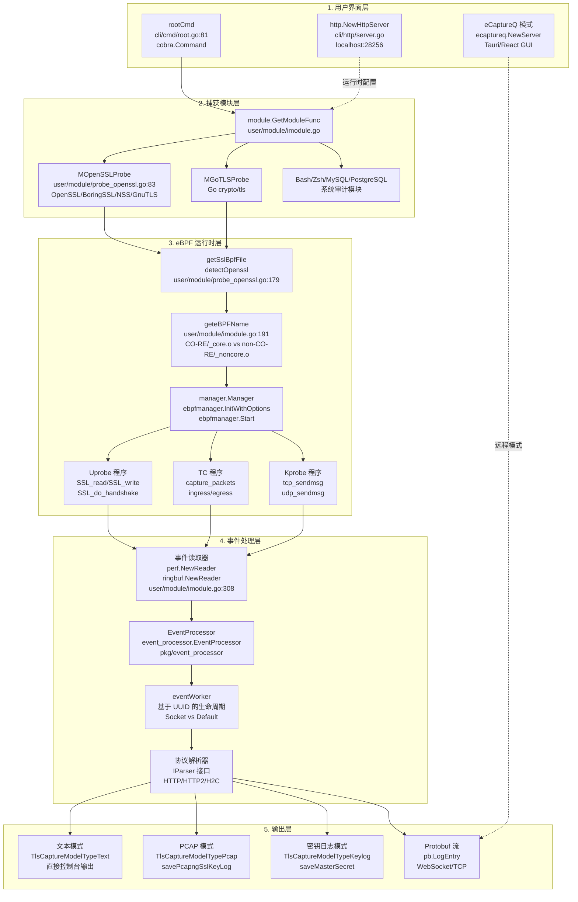
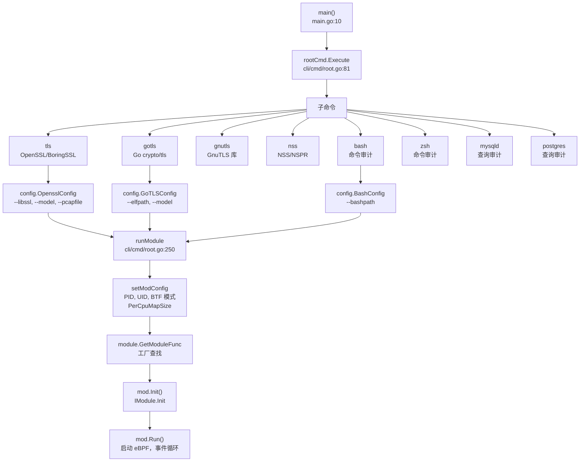
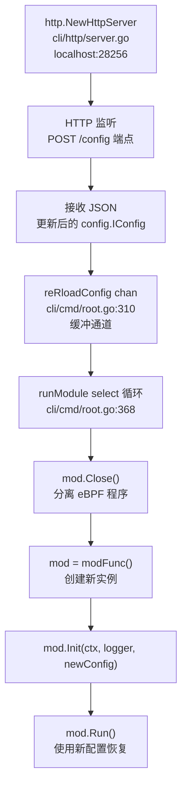
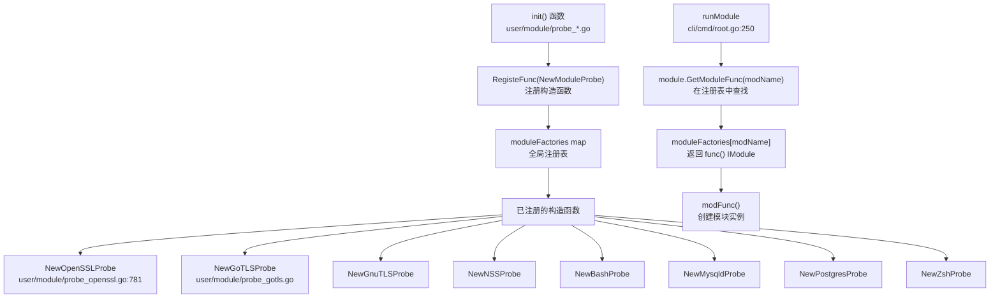
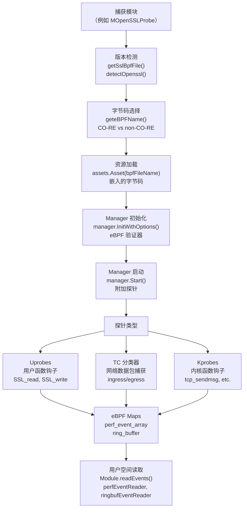
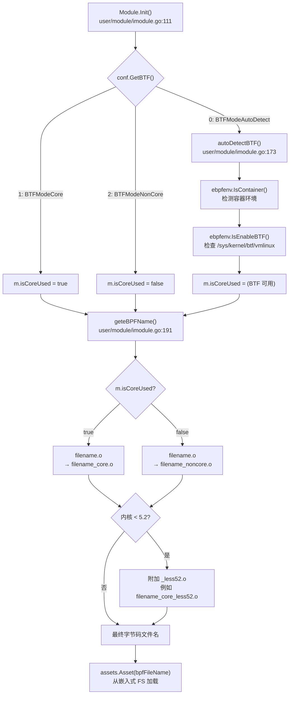
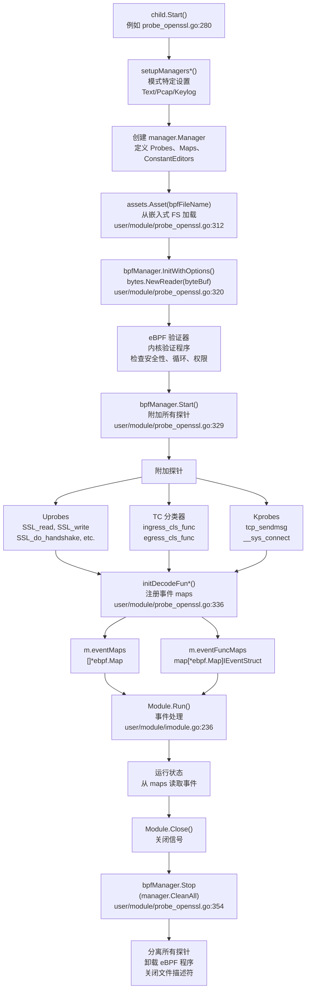

# 架构设计

eCapture 是一个基于 eBPF 的复杂可观测性平台，能够在不需要 CA 证书或代码修改的情况下捕获 SSL/TLS 明文并执行系统审计。系统架构由五个主要层级组成，它们协同工作以在不同系统级别拦截加密流量并生成格式化输出。

本页面提供高层次的架构概述。有关特定组件的详细信息，请参阅：
- [eBPF 引擎](2.1-ebpf-engine.md) - eBPF 技术使用、探针附加、CO-RE 与 non-CO-RE 模式
- [事件处理流程](2.2-event-processing-pipeline.md) - 从 eBPF maps 到 workers 和 parsers 的事件流
- [配置系统](2.3-configuration-system.md) - IConfig 接口和运行时配置
- [模块系统与生命周期](2.4-module-system-and-lifecycle.md) - IModule 接口和模块管理
- [版本检测与字节码选择](2.5-version-detection-and-bytecode-selection.md) - SSL/TLS 库版本检测策略
- [网络连接跟踪](2.6-network-connection-tracking.md) - 基于 TC 的数据包捕获和连接映射

有关模块特定的实现细节，请参阅[捕获模块](../3-capture-modules/index.md)。有关构建系统架构，请参阅[构建系统](../5-development-guide/5.1-build-system.md)。

## 系统架构概述

eCapture 实现了一个五层架构，具有清晰的关注点分离。数据从被监控的应用程序通过内核空间的 eBPF 钩子流向用户空间的事件处理，最终以多种格式（文本、PCAP-NG、密钥日志文件或 protobuf 流）生成格式化输出。

**图表：五层架构**



来源：[cli/cmd/root.go:80-153](https://github.com/gojue/ecapture/blob/0766a93b/cli/cmd/root.go#L80-L153), [user/module/probe_openssl.go:83-106](https://github.com/gojue/ecapture/blob/0766a93b/user/module/probe_openssl.go#L83-L106), [user/module/imodule.go:47-75](https://github.com/gojue/ecapture/blob/0766a93b/user/module/imodule.go#L47-L75), [user/module/probe_openssl.go:178-278](https://github.com/gojue/ecapture/blob/0766a93b/user/module/probe_openssl.go#L178-L278), [user/module/imodule.go:191-214](https://github.com/gojue/ecapture/blob/0766a93b/user/module/imodule.go#L191-L214)

### 架构层级说明

每一层都有特定的职责：

| 层级 | 职责 | 关键组件 |
|-------|------------------|----------------|
| **1. 用户界面** | 命令解析、配置输入、运行时更新 | `rootCmd` (Cobra CLI)、HTTP 配置服务器、eCaptureQ 集成 |
| **2. 捕获模块** | 协议特定逻辑、字节码选择、探针附加 | `IModule` 接口、`MOpenSSLProbe`、`MGoTLSProbe` 等 |
| **3. eBPF 运行时** | 版本检测、CO-RE/non-CO-RE 选择、eBPF 程序生命周期 | `manager.Manager`、uprobe/TC/kprobe 程序、BTF 检测 |
| **4. 事件处理** | 事件读取、聚合、协议解析、连接跟踪 | `EventProcessor`、`eventWorker`、`IParser` 实现 |
| **5. 输出** | 格式转换、文件写入、网络流 | Text/PCAP/Keylog/Protobuf 写入器、PCAP-NG DSB 块 |

有关 IModule 接口的详细信息，请参阅[模块系统与生命周期](2.4-module-system-and-lifecycle.md)；有关事件流详细信息，请参阅[事件处理流程](2.2-event-processing-pipeline.md)。

### 关键架构决策

架构做出了几个关键的设计决策以实现其功能：

| 决策 | 理由 | 实现 |
|----------|-----------|----------------|
| **模块的工厂模式** | 支持基于 CLI 命令的动态模块加载 | `IModule` 接口 [user/module/imodule.go:47-75](https://github.com/gojue/ecapture/blob/0766a93b/user/module/imodule.go#L47-L75)；模块通过 `RegisteFunc` 在包初始化时注册 |
| **双字节码编译** | 支持 BTF 启用（CO-RE）和非 BTF 内核 | 构建系统生成 `*_core.o` 和 `*_noncore.o` 变体；运行时通过 `geteBPFName` 选择 [user/module/imodule.go:191-214](https://github.com/gojue/ecapture/blob/0766a93b/user/module/imodule.go#L191-L214) |
| **版本检测层** | 处理 20+ 个具有不同结构布局的 OpenSSL/BoringSSL 版本 | `detectOpenssl` [user/module/probe_openssl.go:178-278](https://github.com/gojue/ecapture/blob/0766a93b/user/module/probe_openssl.go#L178-L278) 解析 ELF `.rodata`，通过 `sslVersionBpfMap` 将版本映射到字节码 |
| **事件处理流程** | 将捕获与输出格式化解耦，支持协议解析 | `EventProcessor` [user/module/imodule.go:104](https://github.com/gojue/ecapture/blob/0766a93b/user/module/imodule.go#L104) 按 UUID 聚合事件，应用 HTTP/HTTP2 解析器 |
| **多种输出格式** | 支持实时分析（文本）、取证（PCAP）、解密（密钥日志） | `TlsCaptureModelType` 枚举 [user/module/probe_openssl.go:58-76](https://github.com/gojue/ecapture/blob/0766a93b/user/module/probe_openssl.go#L58-L76) 控制捕获模式 |
| **连接跟踪** | 在没有用户空间协作的情况下将网络数据包映射到进程 | Kprobes 填充 `network_map` LRU 哈希表；TC 钩子查找 PID/UID。参见[网络连接跟踪](2.6-network-connection-tracking.md) |
| **双 Worker 生命周期** | 针对不同连接模式优化资源使用 | 持久连接使用基于 Socket 的生命周期，短期连接使用默认（10-tick 超时）。参见[事件处理流程](2.2-event-processing-pipeline.md) |

来源：[user/module/imodule.go:47-75](https://github.com/gojue/ecapture/blob/0766a93b/user/module/imodule.go#L47-L75), [user/module/probe_openssl.go:58-76](https://github.com/gojue/ecapture/blob/0766a93b/user/module/probe_openssl.go#L58-L76), [user/module/probe_openssl.go:178-278](https://github.com/gojue/ecapture/blob/0766a93b/user/module/probe_openssl.go#L178-L278), [user/module/imodule.go:191-214](https://github.com/gojue/ecapture/blob/0766a93b/user/module/imodule.go#L191-L214)

## 数据流管道

以下图表显示了数据如何从应用程序流向输出：

**图表：完整数据流**

```mermaid
graph LR
    App["被监控的应用程序<br/>curl, browser, etc.<br/>使用 OpenSSL/Go TLS"] --> LibraryCall["库函数调用<br/>SSL_write/SSL_read<br/>tls.Conn.Write/Read"]
    
    LibraryCall --> UprobeHook["Uprobe 钩子<br/>内核拦截<br/>函数入口/返回"]
    
    UprobeHook --> PlaintextCapture["明文捕获<br/>加密前<br/>解密后"]
    
    PlaintextCapture --> eBPFMap["eBPF Map<br/>perf_event_array<br/>或 ring_buffer"]
    
    eBPFMap --> UserSpaceRead["perf.NewReader.Read<br/>user/module/imodule.go:308<br/>每个 map 一个 goroutine"]
    
    UserSpaceRead --> DecodeEvent["解码事件<br/>child.Decode(map, bytes)<br/>→ IEventStruct"]
    
    DecodeEvent --> Dispatcher["Module.Dispatcher<br/>user/module/imodule.go:409<br/>根据 EventType 路由"]
    
    Dispatcher --> ProcessorQueue{"EventType?"}
    ProcessorQueue -->|TypeEventProcessor| EventProcessor["EventProcessor.Write<br/>按 UUID 聚合"]
    ProcessorQueue -->|TypeOutput| DirectOutput["直接输出"]
    ProcessorQueue -->|TypeModuleData| ModuleCache["模块缓存<br/>主密钥、元组"]
    
    EventProcessor --> WorkerPool["eventWorker 池<br/>解析 HTTP/HTTP2<br/>格式化输出"]
    
    WorkerPool --> FinalOutput["最终输出"]
    DirectOutput --> FinalOutput
    
    FinalOutput --> OutputFormat{"输出模式"}
    OutputFormat -->|Text| Console["控制台/文件<br/>zerolog.Logger"]
    OutputFormat -->|PCAP| PcapFile["PCAP-NG 文件<br/>+ DSB 密钥日志块"]
    OutputFormat -->|Keylog| KeylogFile["密钥日志文件<br/>CLIENT_RANDOM 格式"]
    OutputFormat -->|Protobuf| WebSocket["WebSocket/TCP<br/>pb.LogEntry 消息"]
```



来源：[user/module/imodule.go:285-391](https://github.com/gojue/ecapture/blob/0766a93b/user/module/imodule.go#L285-L391), [user/module/imodule.go:409-448](https://github.com/gojue/ecapture/blob/0766a93b/user/module/imodule.go#L409-L448), [cli/cmd/root.go:250-403](https://github.com/gojue/ecapture/blob/0766a93b/cli/cmd/root.go#L250-L403)

## 用户界面层

eCapture 提供三种用户交互界面：CLI 命令、HTTP 配置 API 和 eCaptureQ GUI 集成。

### CLI 入口点

CLI 使用 Cobra 命令框架。每个子命令对应一个捕获模块。

**图表：CLI 命令结构**



来源：[main.go:9-11](https://github.com/gojue/ecapture/blob/0766a93b/main.go#L9-L11), [cli/cmd/root.go:80-153](https://github.com/gojue/ecapture/blob/0766a93b/cli/cmd/root.go#L80-L153), [cli/cmd/root.go:250-403](https://github.com/gojue/ecapture/blob/0766a93b/cli/cmd/root.go#L250-L403), [cli/cmd/root.go:156-175](https://github.com/gojue/ecapture/blob/0766a93b/cli/cmd/root.go#L156-L175)

**持久化标志**（应用于所有模块）[cli/cmd/root.go:140-153](https://github.com/gojue/ecapture/blob/0766a93b/cli/cmd/root.go#L140-L153)：

| 标志 | 类型 | 默认值 | 用途 |
|------|------|---------|---------|
| `--pid` / `-p` | uint64 | 0 (全部) | 目标特定进程 ID |
| `--uid` / `-u` | uint64 | 0 (全部) | 目标特定用户 ID |
| `--btf` / `-b` | uint8 | 0 (自动) | BTF 模式：0=自动，1=core，2=non-core |
| `--mapsize` | int | 1024 | 每 CPU 的 eBPF map 大小（KB） |
| `--logaddr` / `-l` | string | "" | 日志目的地：文件路径、`tcp://host:port` 或 `ws://host:port/path` |
| `--eventaddr` | string | "" | 事件目的地（与日志分开） |
| `--listen` | string | `localhost:28256` | HTTP 配置服务器监听地址 |
| `--tsize` / `-t` | uint64 | 0 | 文本模式下的截断大小（字节，0=不截断） |
| `--ecaptureq` | string | "" | 监听 eCaptureQ 客户端连接 |

### HTTP 配置服务器

HTTP 服务器并发运行以接受运行时配置更新而无需重启。

**图表：运行时配置更新**



来源：[cli/cmd/root.go:313-322](https://github.com/gojue/ecapture/blob/0766a93b/cli/cmd/root.go#L313-L322), [cli/cmd/root.go:368-396](https://github.com/gojue/ecapture/blob/0766a93b/cli/cmd/root.go#L368-L396)

HTTP 服务器支持动态重新配置。当收到带有更新配置 JSON 的 POST 请求时，系统会：
1. 关闭当前模块（分离 eBPF 程序）
2. 创建新的模块实例
3. 使用更新的配置初始化
4. 使用新设置重新启动事件捕获

有关配置结构详细信息，请参阅[配置系统](2.3-configuration-system.md)；有关 API 详细信息，请参阅 [HTTP API 文档](https://github.com/gojue/ecapture/blob/0766a93b/docs/remote-config-update-api.md)。

### 输出目的地

eCapture 支持多个日志和事件的输出目的地：

**图表：输出路由**

```mermaid
graph TB
    initLogger["initLogger()<br/>cli/cmd/root.go:178"] --> CheckAddr{"logaddr 标志?"}
    
    CheckAddr -->|""| StdoutOnly["zerolog.ConsoleWriter<br/>仅 os.Stdout"]
    CheckAddr -->|文件路径| FileWriter["os.Create(addr)<br/>MultiLevelWriter"]
    CheckAddr -->|tcp://| TCPWriter["net.Dial('tcp', addr)<br/>TCP 连接"]
    CheckAddr -->|ws://| WSWriter["ws.NewClient<br/>WebSocket 连接"]
    
    FileWriter --> MultiWriter["zerolog.MultiLevelWriter<br/>控制台 + 文件/TCP/WS"]
    TCPWriter --> MultiWriter
    WSWriter --> MultiWriter
    
    MultiWriter --> LoggerInstance["zerolog.Logger<br/>被模块使用"]
    StdoutOnly --> LoggerInstance
    
    LoggerInstance --> EventCollector["eventCollector io.Writer<br/>event.CollectorWriter 或 ecaptureQEventWriter"]
    
    EventCollector --> ModuleInit["mod.Init(ctx, logger, conf, eventCollector)<br/>user/module/imodule.go:111"]
```

来源：[cli/cmd/root.go:178-247](https://github.com/gojue/ecapture/blob/0766a93b/cli/cmd/root.go#L178-L247), [cli/cmd/root.go:255-295](https://github.com/gojue/ecapture/blob/0766a93b/cli/cmd/root.go#L255-L295)

输出类型 [cli/cmd/root.go:69-73](https://github.com/gojue/ecapture/blob/0766a93b/cli/cmd/root.go#L69-L73)：
- **Stdout**（类型 0）：仅控制台输出
- **File**（类型 1）：写入本地文件，可通过 `--eventroratesize` 和 `--eventroratetime` 选择性轮转
- **TCP**（类型 2）：流式传输到 `tcp://host:port`
- **WebSocket**（类型 3）：流式传输到 `ws://host:port/path` 或 `wss://`（TLS）

`eventCollector` 接收捕获的事件，而 `logger` 接收操作日志。它们可以通过 `--logaddr` 和 `--eventaddr` 标志使用相同或不同的目的地。

## 捕获模块层

模块系统使用工厂模式进行动态模块实例化。每个模块都实现 `IModule` 接口并嵌入基础 `Module` 结构体以获得通用功能。

### 模块工厂和注册

模块在包初始化时自注册。

**图表：模块工厂模式**



来源：[user/module/probe_openssl.go:777-786](https://github.com/gojue/ecapture/blob/0766a93b/user/module/probe_openssl.go#L777-L786), [cli/cmd/root.go:344-347](https://github.com/gojue/ecapture/blob/0766a93b/cli/cmd/root.go#L344-L347)

来自 OpenSSL 模块的注册示例 [user/module/probe_openssl.go:777-786](https://github.com/gojue/ecapture/blob/0766a93b/user/module/probe_openssl.go#L777-L786)：
```go
func init() {
    RegisteFunc(NewOpenSSLProbe)
}

func NewOpenSSLProbe() IModule {
    mod := &MOpenSSLProbe{}
    mod.name = ModuleNameOpenssl
    mod.mType = ProbeTypeUprobe
    return mod
}
```

CLI 通过 `module.GetModuleFunc(modName)` [cli/cmd/root.go:344](https://github.com/gojue/ecapture/blob/0766a93b/cli/cmd/root.go#L344) 检索构造函数并调用它来创建实例。

### IModule 接口

所有模块都实现 `IModule` 接口 [user/module/imodule.go:47-75](https://github.com/gojue/ecapture/blob/0766a93b/user/module/imodule.go#L47-L75)，该接口定义了生命周期和事件处理方法。

**IModule 接口方法**

| 方法 | 用途 | 阶段 | 责任 |
|--------|---------|-------|----------------|
| `Init(context.Context, *zerolog.Logger, config.IConfig, io.Writer)` | 初始化模块，设置 EventProcessor，BTF 检测 | 初始化 | 基础 `Module` + 子类重写 |
| `Start()` | 加载 eBPF 字节码，附加探针/钩子 | 启动 | 子类实现 |
| `Run()` | 启动事件读取器，开始处理循环 | 运行 | 基础 `Module`（调用 child.Start） |
| `Events() []*ebpf.Map` | 返回要读取事件的 eBPF maps | 运行 | 子类实现 |
| `Decode(*ebpf.Map, []byte) (event.IEventStruct, error)` | 将原始事件字节解析为结构体 | 事件处理 | 基础委托给 child.DecodeFun |
| `DecodeFun(*ebpf.Map) (event.IEventStruct, bool)` | 返回特定 map 的解码器 | 事件处理 | 子类实现 |
| `Dispatcher(event.IEventStruct)` | 路由事件（缓存、处理、输出） | 事件处理 | 基础 + 子类都实现 |
| `Close()` | 停止 eBPF 程序，清理资源 | 关闭 | 基础 + 子类都实现 |

有关详细的生命周期信息，请参阅[模块系统与生命周期](2.4-module-system-and-lifecycle.md)。

来源：[user/module/imodule.go:47-75](https://github.com/gojue/ecapture/blob/0766a93b/user/module/imodule.go#L47-L75), [user/module/imodule.go:110-171](https://github.com/gojue/ecapture/blob/0766a93b/user/module/imodule.go#L110-L171)

### 基础模块实现

`Module` 结构体 [user/module/imodule.go:83-108](https://github.com/gojue/ecapture/blob/0766a93b/user/module/imodule.go#L83-L108) 提供了所有探针通过嵌入继承的通用功能。

**图表：模块结构体组成**

```mermaid
graph TB
    BaseModule["Module 结构体<br/>user/module/imodule.go:83<br/>被所有探针嵌入"] --> CoreFields["核心字段"]
    BaseModule --> CoreMethods["核心方法"]
    
    CoreFields --> ctx["ctx context.Context<br/>取消信号"]
    CoreFields --> logger["logger *zerolog.Logger<br/>日志接口"]
    CoreFields --> conf["conf config.IConfig<br/>模块配置"]
    CoreFields --> processor["processor *EventProcessor<br/>pkg/event_processor"]
    CoreFields --> reader["reader []IClose<br/>perf/ringbuf 读取器"]
    CoreFields --> child["child IModule<br/>实际探针（例如 MOpenSSLProbe）"]
    CoreFields --> eventCollector["eventCollector io.Writer<br/>输出目的地"]
    CoreFields --> flags["isCoreUsed bool<br/>isKernelLess5_2 bool"]
    
    CoreMethods --> InitMethod["Init()<br/>BTF 检测<br/>EventProcessor 设置<br/>user/module/imodule.go:111"]
    CoreMethods --> RunMethod["Run()<br/>启动 child.Start()<br/>readEvents()<br/>user/module/imodule.go:236"]
    CoreMethods --> readEvents["readEvents()<br/>perfEventReader<br/>ringbufEventReader<br/>user/module/imodule.go:285"]
    CoreMethods --> DecodeMethod["Decode()<br/>委托给 child.DecodeFun<br/>user/module/imodule.go:393"]
    CoreMethods --> DispatcherMethod["Dispatcher()<br/>路由事件<br/>user/module/imodule.go:409"]
    CoreMethods --> CloseMethod["Close()<br/>清理读取器<br/>user/module/imodule.go:450"]
    
    ProbeModules["探针模块"] --> MOpenSSL["MOpenSSLProbe<br/>user/module/probe_openssl.go:83<br/>嵌入 Module"]
    ProbeModules --> MGoTLS["MGoTLSProbe<br/>嵌入 Module"]
    ProbeModules --> MGnuTLS["MGnuTLSProbe<br/>嵌入 Module"]
    ProbeModules --> MBash["MBashProbe<br/>嵌入 Module"]
    
    MOpenSSL --> ImplStart["实现 Start()<br/>setupManagers*<br/>加载 eBPF 字节码"]
    MOpenSSL --> ImplEvents["实现 Events()<br/>返回事件 maps"]
    MOpenSSL --> ImplDecodeFun["实现 DecodeFun()<br/>Map → 事件结构体类型"]
    MOpenSSL --> ImplDispatcher["实现 Dispatcher()<br/>saveMasterSecret<br/>AddConn/DelConn"]
```



来源：[user/module/imodule.go:83-108](https://github.com/gojue/ecapture/blob/0766a93b/user/module/imodule.go#L83-L108), [user/module/probe_openssl.go:83-106](https://github.com/gojue/ecapture/blob/0766a93b/user/module/probe_openssl.go#L83-L106)

**基础模块职责** [user/module/imodule.go:83-460](https://github.com/gojue/ecapture/blob/0766a93b/user/module/imodule.go#L83-L460)：

1. **BTF 检测**：`autoDetectBTF()` 检查 `/sys/kernel/btf/vmlinux` 和容器环境 [user/module/imodule.go:173-190](https://github.com/gojue/ecapture/blob/0766a93b/user/module/imodule.go#L173-L190)
2. **字节码选择**：`geteBPFName()` 附加 `_core.o`/`_noncore.o` 和 `_less52.o` 后缀 [user/module/imodule.go:191-214](https://github.com/gojue/ecapture/blob/0766a93b/user/module/imodule.go#L191-L214)
3. **事件读取器**：`perfEventReader()` 和 `ringbufEventReader()` 为每个 eBPF map 设置 goroutines [user/module/imodule.go:308-391](https://github.com/gojue/ecapture/blob/0766a93b/user/module/imodule.go#L308-L391)
4. **EventProcessor**：使用截断大小和十六进制模式初始化 [user/module/imodule.go:127](https://github.com/gojue/ecapture/blob/0766a93b/user/module/imodule.go#L127)
5. **输出路由**：检测 `eventCollector` 类型以选择文本或 protobuf 编码 [user/module/imodule.go:122-126](https://github.com/gojue/ecapture/blob/0766a93b/user/module/imodule.go#L122-L126), [user/module/imodule.go:461-479](https://github.com/gojue/ecapture/blob/0766a93b/user/module/imodule.go#L461-L479)
6. **生命周期管理**：通过 `Start()`、`Run()`、`Close()` 协调子模块的生命周期 [user/module/imodule.go:236-262](https://github.com/gojue/ecapture/blob/0766a93b/user/module/imodule.go#L236-L262)

### 模块特定实现

每个探针模块都嵌入 `Module` 并添加模块特定的状态和逻辑。有关详细的实现信息，请参阅[捕获模块](../3-capture-modules/index.md)。

**关键模块类型**

| 模块 | 用途 | 目标库/二进制文件 | 关键状态 | 另请参阅 |
|--------|---------|---------------------------|-----------|----------|
| `MOpenSSLProbe` | TLS 明文捕获 | libssl.so、libcrypto.so、BoringSSL | `sslVersionBpfMap`、`pidConns`、`masterKeys`、`eBPFProgramType` | [OpenSSL 模块](../3-capture-modules/3.1.1-openssl-module.md) |
| `MGoTLSProbe` | Go TLS 明文捕获 | Go 二进制文件（crypto/tls） | `isRegisterABI`、`tcPacketsChan`、`keylogger` | [Go TLS 模块](../3-capture-modules/3.1.2-go-tls-module.md) |
| `MGnuTLSProbe` | GnuTLS 明文捕获 | libgnutls.so | `keylogger`、`masterKeys` | [GnuTLS 与 NSS 模块](../3-capture-modules/3.1.3-gnutls-and-nss-modules.md) |
| `MNSSProbe` | NSS/NSPR 明文捕获 | libnss3.so、libnspr4.so | 主密钥提取 | [GnuTLS 与 NSS 模块](../3-capture-modules/3.1.3-gnutls-and-nss-modules.md) |
| `MBashProbe` | Bash 命令审计 | bash 二进制文件 | 通过 readline 钩子过滤命令 | [Shell 命令审计](../3-capture-modules/3.2.1-shell-command-auditing.md) |
| `MZshProbe` | Zsh 命令审计 | zsh 二进制文件 | 通过 zle 钩子过滤命令 | [Shell 命令审计](../3-capture-modules/3.2.1-shell-command-auditing.md) |
| `MMysqldProbe` | MySQL 查询审计 | mysqld 二进制文件 | `funcName`，从 dispatch_command 提取 SQL | [数据库查询审计](../3-capture-modules/3.2.2-database-query-auditing.md) |
| `MPostgresProbe` | PostgreSQL 查询审计 | postgres 二进制文件 | 从 exec_simple_query 提取查询 | [数据库查询审计](../3-capture-modules/3.2.2-database-query-auditing.md) |

来源：[user/module/probe_openssl.go:83-106](https://github.com/gojue/ecapture/blob/0766a93b/user/module/probe_openssl.go#L83-L106)

**示例：MOpenSSLProbe 状态** [user/module/probe_openssl.go:83-106](https://github.com/gojue/ecapture/blob/0766a93b/user/module/probe_openssl.go#L83-L106)：

| 字段 | 类型 | 用途 |
|-------|------|---------|
| `pidConns` | `map[uint32]map[uint32]ConnInfo` | 映射 PID → FD → 连接元组和套接字 [user/module/probe_openssl.go:91]() |
| `sock2pidFd` | `map[uint64][2]uint32` | 反向映射：套接字 → [PID, FD] 用于连接清理 [user/module/probe_openssl.go:93]() |
| `masterKeys` | `map[string]bool` | 通过客户端随机数去重 TLS 主密钥 [user/module/probe_openssl.go:98]() |
| `sslVersionBpfMap` | `map[string]string` | 将 SSL 版本字符串映射到字节码文件名 [user/module/probe_openssl.go:101]() |
| `eBPFProgramType` | `TlsCaptureModelType` | 确定捕获模式（Text/Pcap/Keylog）[user/module/probe_openssl.go:99](https://github.com/gojue/ecapture/blob/0766a93b/user/module/probe_openssl.go#L99) |
| `keylogger` | `*os.File` | 密钥日志模式输出的文件句柄 [user/module/probe_openssl.go:96](https://github.com/gojue/ecapture/blob/0766a93b/user/module/probe_openssl.go#L96) |
| `bpfManager` | `*manager.Manager` | eBPF 程序生命周期管理器 [user/module/probe_openssl.go:85](https://github.com/gojue/ecapture/blob/0766a93b/user/module/probe_openssl.go#L85) |

这些映射表启用了 SSL 数据事件（由 PID/FD 标识）与 TC 钩子捕获的网络元组之间的关联。有关 `sslVersionBpfMap` 的使用，请参阅[版本检测与字节码选择](2.5-version-detection-and-bytecode-selection.md)；有关连接映射的详细信息，请参阅[网络连接跟踪](2.6-network-connection-tracking.md)。

## eBPF 运行时层

eBPF 运行时层连接用户空间模块和内核空间检测。它通过 `ebpfmanager` 库处理版本检测、字节码选择和 eBPF 程序生命周期。

有关 eBPF 程序和钩子的综合详细信息，请参阅 [eBPF 引擎](2.1-ebpf-engine.md)。有关版本检测算法，请参阅[版本检测与字节码选择](2.5-version-detection-and-bytecode-selection.md)。

### eBPF 运行时组件概述

**图表：eBPF 运行时组件**



来源：[user/module/probe_openssl.go:178-278](https://github.com/gojue/ecapture/blob/0766a93b/user/module/probe_openssl.go#L178-L278), [user/module/imodule.go:191-214](https://github.com/gojue/ecapture/blob/0766a93b/user/module/imodule.go#L191-L214), [user/module/probe_openssl.go:312-331](https://github.com/gojue/ecapture/blob/0766a93b/user/module/probe_openssl.go#L312-L331), [user/module/imodule.go:285-391](https://github.com/gojue/ecapture/blob/0766a93b/user/module/imodule.go#L285-L391)

运行时层执行以下操作：

1. **版本检测**：确定目标库版本（参见[版本检测与字节码选择](2.5-version-detection-and-bytecode-selection.md)）
2. **字节码选择**：根据 BTF 可用性选择 CO-RE 或 non-CO-RE 字节码
3. **资源加载**：从 `assets` 包加载嵌入的字节码
4. **eBPF 验证**：内核验证程序安全性
5. **探针附加**：附加 uprobes、TC 分类器、kprobes
6. **事件读取**：为 eBPF maps 设置读取器

### BTF 检测与字节码选择

eCapture 编译每个 eBPF 程序的两个变体：**CO-RE**（启用 BTF，内核 >= 5.2）和 **non-CO-RE**（传统，所有内核）。运行时选择基于内核 BTF 支持。

**图表：BTF 检测与字节码模式选择**



来源：[user/module/imodule.go:154-170](https://github.com/gojue/ecapture/blob/0766a93b/user/module/imodule.go#L154-L170), [user/module/imodule.go:173-190](https://github.com/gojue/ecapture/blob/0766a93b/user/module/imodule.go#L173-L190), [user/module/imodule.go:191-214](https://github.com/gojue/ecapture/blob/0766a93b/user/module/imodule.go#L191-L214)

**BTF 检测逻辑** [user/module/imodule.go:173-190](https://github.com/gojue/ecapture/blob/0766a93b/user/module/imodule.go#L173-L190)：
1. 检查是否在容器中运行（在容器中 BTF 检测可能不可靠）
2. 查找 `/sys/kernel/btf/vmlinux` 文件以确认 BTF 支持
3. 根据检测结果设置 `m.isCoreUsed` 标志

**文件名转换示例** [user/module/imodule.go:191-214](https://github.com/gojue/ecapture/blob/0766a93b/user/module/imodule.go#L191-L214)：
- `openssl_3_0_0_kern.o` → `openssl_3_0_0_kern_core.o`（BTF 内核 >= 5.2）
- `openssl_3_0_0_kern.o` → `openssl_3_0_0_kern_noncore.o`（非 BTF 内核 >= 5.2）
- `openssl_3_0_0_kern.o` → `openssl_3_0_0_kern_core_less52.o`（BTF 内核 < 5.2）
- `openssl_3_0_0_kern.o` → `openssl_3_0_0_kern_noncore_less52.o`（非 BTF 内核 < 5.2）

CO-RE 字节码使用 BTF 类型信息在加载时解析结构布局，实现**一次编译 - 随处运行**。non-CO-RE 字节码为特定内核版本硬编码偏移量。有关编译详细信息，请参阅[构建系统](../5-development-guide/5.1-build-system.md)。

### eBPF 程序生命周期

`ebpfmanager.Manager` [user/module/probe_openssl.go:85](https://github.com/gojue/ecapture/blob/0766a93b/user/module/probe_openssl.go#L85) 管理 eBPF 程序的加载、验证、附加和清理。

**图表：eBPF 生命周期管理**



来源：[user/module/probe_openssl.go:280-357](https://github.com/gojue/ecapture/blob/0766a93b/user/module/probe_openssl.go#L280-L357), [user/module/imodule.go:236-262](https://github.com/gojue/ecapture/blob/0766a93b/user/module/imodule.go#L236-L262)

**生命周期阶段**：

1. **设置**：`Start()` 调用模式特定的设置（`setupManagersText`、`setupManagersPcap`、`setupManagersKeylog`）
2. **字节码加载**：`assets.Asset(bpfFileName)` 检索嵌入的字节码 [user/module/probe_openssl.go:312-317](https://github.com/gojue/ecapture/blob/0766a93b/user/module/probe_openssl.go#L312-L317)
3. **初始化**：`bpfManager.InitWithOptions()` 加载字节码，内核验证程序 [user/module/probe_openssl.go:320-326](https://github.com/gojue/ecapture/blob/0766a93b/user/module/probe_openssl.go#L320-L326)
4. **附加**：`bpfManager.Start()` 附加 uprobes/TC/kprobes [user/module/probe_openssl.go:329-331](https://github.com/gojue/ecapture/blob/0766a93b/user/module/probe_openssl.go#L329-L331)
5. **Map 注册**：`initDecodeFun*()` 填充 `eventMaps` 和 `eventFuncMaps` [user/module/probe_openssl.go:333-348](https://github.com/gojue/ecapture/blob/0766a93b/user/module/probe_openssl.go#L333-L348)
6. **运行**：基础 `Module.Run()` 生成事件读取器和 EventProcessor [user/module/imodule.go:236-262](https://github.com/gojue/ecapture/blob/0766a93b/user/module/imodule.go#L236-L262)
7. **关闭**：`bpfManager.Stop(manager.CleanAll)` 分离并清理 [user/module/probe_openssl.go:352-357](https://github.com/gojue/ecapture/blob/0766a93b/user/module/probe_openssl.go#L352-L357)

### 通过常量编辑器注入配置

eBPF 程序定义在加载时重写的常量变量以注入运行时配置（PID、UID 过滤器）。

**常量编辑器机制**

| 常量名称 | 用途 | 类型 | 值来源 | 效果 |
|---------------|---------|------|--------------|--------|
| `target_pid` | 按进程 ID 过滤 | `uint64` | `conf.GetPid()` | 0 = 捕获所有 PID，非零 = 仅特定 PID |
| `target_uid` | 按用户 ID 过滤 | `uint64` | `conf.GetUid()` | 0 = 捕获所有 UID，非零 = 仅特定 UID |

来源：[user/module/probe_openssl.go:361-387](https://github.com/gojue/ecapture/blob/0766a93b/user/module/probe_openssl.go#L361-L387)

`constantEditor()` 方法 [user/module/probe_openssl.go:361-387](https://github.com/gojue/ecapture/blob/0766a93b/user/module/probe_openssl.go#L361-L387) 返回一个 `manager.ConstantEditor` 结构体切片。eBPF 管理器在加载到内核**之前**重写字节码中的这些常量。这使得无需重新编译 eBPF 程序即可实现参数化过滤。

对于内核 < 5.2，全局变量支持受限。`EnableGlobalVar()` 检查 [user/config/iconfig.go:194-203](https://github.com/gojue/ecapture/blob/0766a93b/user/config/iconfig.go#L194-L203) 返回 false，禁用某些功能。

## 事件处理层

在 eBPF 程序捕获事件并通过 perf 数组或环形缓冲区传输后，用户空间事件处理流程会聚合、解析并格式化它们以供输出。

有关全面的事件处理详细信息，请参阅[事件处理流程](2.2-event-processing-pipeline.md)。