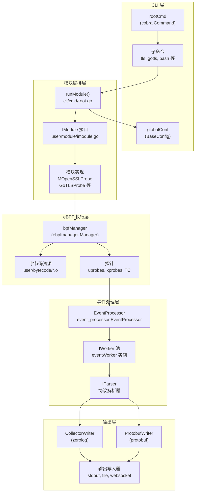
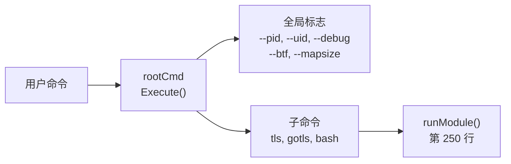
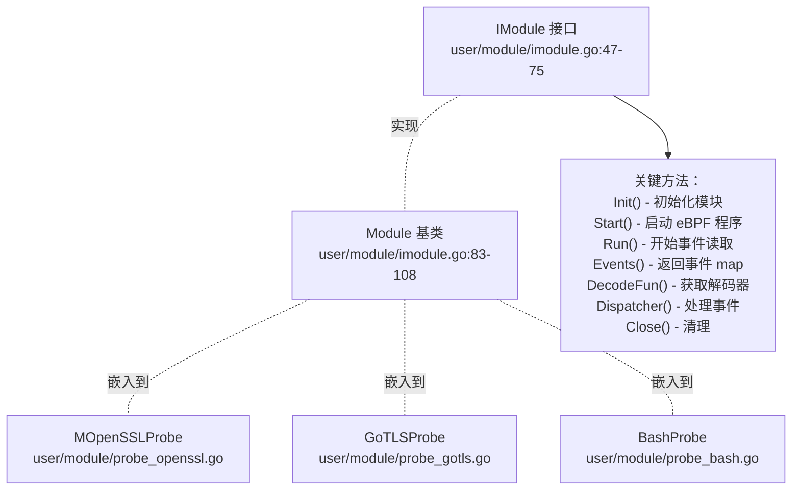
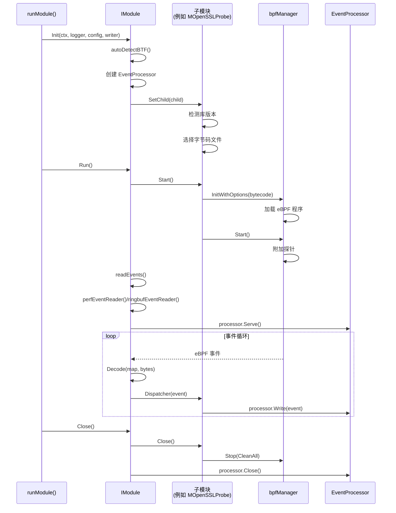
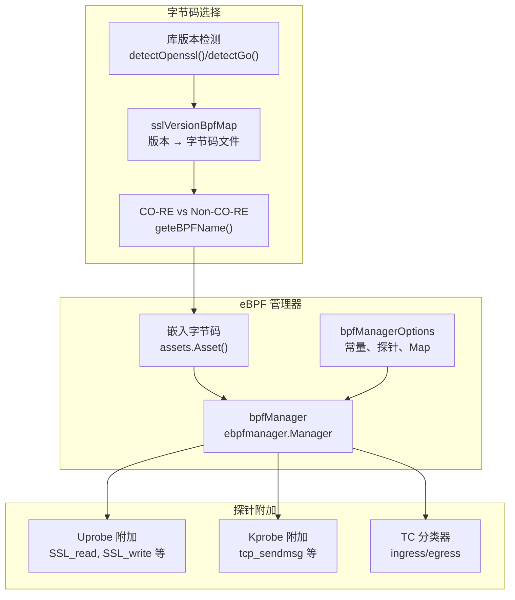
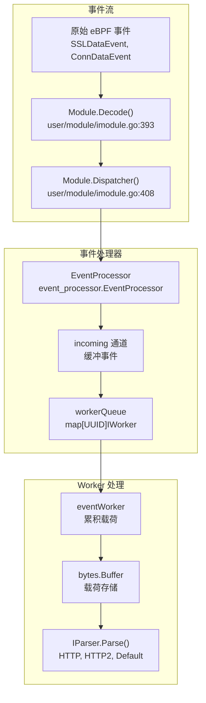
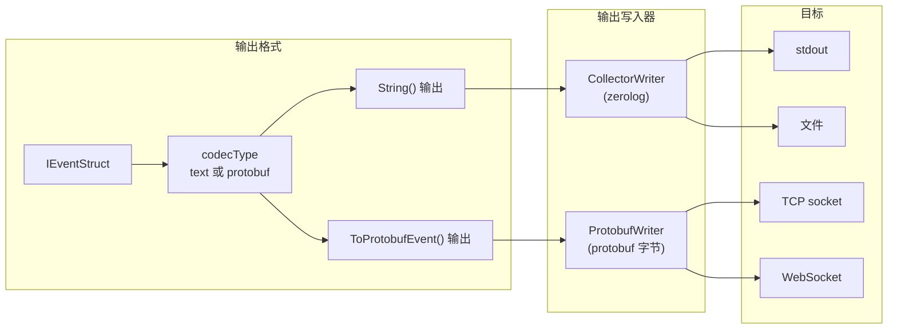

# 架构

本文档描述了 eCapture 的整体架构，解释了系统如何分层组织，以及数据如何从命令行接口通过 eBPF 探针流向最终输出。该架构遵循五层设计：**CLI 层 → 模块编排 → eBPF 执行 → 事件处理 → 输出**。

有关特定捕获模块（OpenSSL、GoTLS 等）的详细信息，请参阅[捕获模块](../3-capture-modules/index.md)。有关 eBPF 实现的信息，请参阅 [eBPF 引擎](2.1-ebpf-engine.md)。有关事件处理内部机制，请参阅[事件处理流程](2.2-event-processing-pipeline.md)。

---

## 系统概述

eCapture 被组织为一个基于 eBPF 的模块化捕获系统。该架构将关注点分离到不同的层，允许在不修改核心基础设施的情况下添加新的捕获模块。每个模块都实现 `IModule` 接口并管理自己的 eBPF 程序，同时共享通用的事件处理和输出机制。

**来源：** [README.md:36-44](https://github.com/gojue/ecapture/blob/ca085d05/README.md#L36-L44), [cli/cmd/root.go:44-51](https://github.com/gojue/ecapture/blob/ca085d05/cli/cmd/root.go#L44-L51), [user/module/imodule.go:47-75](https://github.com/gojue/ecapture/blob/ca085d05/user/module/imodule.go#L47-L75)

---

## 五层架构


```mermaid
graph TB
    subgraph CLI["CLI 层"]
        RootCmd["rootCmd<br/>(cobra.Command)"]
        SubCommands["子命令<br/>tls, gotls, bash 等"]
        GlobalConf["globalConf<br/>(BaseConfig)"]
    end
    
    subgraph ModuleOrch["模块编排层"]
        RunModule["runModule()<br/>cli/cmd/root.go"]
        IModule["IModule 接口<br/>user/module/imodule.go"]
        ModuleImpl["模块实现<br/>MOpenSSLProbe<br/>GoTLSProbe 等"]
    end
    
    subgraph eBPFExec["eBPF 执行层"]
        BPFManager["bpfManager<br/>(ebpfmanager.Manager)"]
        BytecodeAssets["字节码资源<br/>user/bytecode/*.o"]
        Probes["探针<br/>uprobes, kprobes, TC"]
    end
    
    subgraph EventProc["事件处理层"]
        EventProcessor["EventProcessor<br/>event_processor.EventProcessor"]
        IWorker["IWorker 池<br/>eventWorker 实例"]
        IParser["IParser<br/>协议解析器"]
    end
    
    subgraph Output["输出层"]
        CollectorWriter["CollectorWriter<br/>(zerolog)"]
        ProtobufWriter["ProtobufWriter<br/>(protobuf)"]
        Writers["输出写入器<br/>stdout, file, websocket"]
    end
    
    RootCmd --> SubCommands
    SubCommands --> RunModule
    RunModule --> GlobalConf
    RunModule --> IModule
    IModule --> ModuleImpl
    
    ModuleImpl --> BPFManager
    BPFManager --> BytecodeAssets
    BPFManager --> Probes
    
    Probes --> EventProcessor
    EventProcessor --> IWorker
    IWorker --> IParser
    
    IParser --> CollectorWriter
    IParser --> ProtobufWriter
    CollectorWriter --> Writers
    ProtobufWriter --> Writers
```

**架构概览：五个不同的层次，关注点明确分离**

该架构由五个主要层次组成：

1. **CLI 层**：解析命令和标志，管理配置
2. **模块编排层**：实现 `IModule` 接口模式，协调模块生命周期
3. **eBPF 执行层**：加载和管理 eBPF 程序，将探针附加到目标函数
4. **事件处理层**：聚合原始 eBPF 事件并解析为结构化数据
5. **输出层**：格式化已处理的事件并写入各种目标

**来源：** [cli/cmd/root.go:80-133](https://github.com/gojue/ecapture/blob/ca085d05/cli/cmd/root.go#L80-L133), [user/module/imodule.go:47-75](https://github.com/gojue/ecapture/blob/ca085d05/user/module/imodule.go#L47-L75), [user/module/probe_openssl.go:83-106](https://github.com/gojue/ecapture/blob/ca085d05/user/module/probe_openssl.go#L83-L106)

---

## CLI 层

CLI 层使用 Cobra 框架实现，为所有 eCapture 操作提供入口点。


```mermaid
graph LR
    User["用户命令"]
    RootCmd["rootCmd<br/>Execute()"]
    GlobalFlags["全局标志<br/>--pid, --uid, --debug<br/>--btf, --mapsize"]
    SubCmd["子命令<br/>tls, gotls, bash"]
    RunModule["runModule()<br/>第 250 行"]
    
    User --> RootCmd
    RootCmd --> GlobalFlags
    RootCmd --> SubCmd
    SubCmd --> RunModule
```

**CLI 命令流程：从用户输入到模块执行**

[cli/cmd/root.go:81-113](https://github.com/gojue/ecapture/blob/ca085d05/cli/cmd/root.go#L81-L113) 中的 `rootCmd` 是根 Cobra 命令。它定义了适用于所有子命令的全局标志：

| 标志 | 类型 | 用途 | 默认值 |
|------|------|---------|---------|
| `--pid` / `-p` | uint64 | 目标进程 ID（0 = 所有进程） | 0 |
| `--uid` / `-u` | uint64 | 目标用户 ID（0 = 所有用户） | 0 |
| `--debug` / `-d` | bool | 启用调试日志 | false |
| `--btf` / `-b` | uint8 | BTF 模式（0=自动，1=core，2=non-core） | 0 |
| `--mapsize` | int | 每个 CPU 的 eBPF map 大小（KB） | 1024 |
| `--logaddr` / `-l` | string | 日志输出地址 | "" |
| `--listen` | string | HTTP API 监听地址 | "localhost:28256" |

每个子命令（例如 `tls`、`gotls`、`bash`）最终都会调用 [cli/cmd/root.go:250-403](https://github.com/gojue/ecapture/blob/ca085d05/cli/cmd/root.go#L250-L403) 中的 `runModule()`，该函数：

1. 使用 `setModConfig()` 从全局配置创建模块特定配置 [cli/cmd/root.go:157-175](https://github.com/gojue/ecapture/blob/ca085d05/cli/cmd/root.go#L157-L175)
2. 初始化日志记录器和事件收集器 [cli/cmd/root.go:282-295](https://github.com/gojue/ecapture/blob/ca085d05/cli/cmd/root.go#L282-L295)
3. 启动 HTTP 服务器用于运行时配置更新 [cli/cmd/root.go:313-322](https://github.com/gojue/ecapture/blob/ca085d05/cli/cmd/root.go#L313-L322)
4. 通过 `IModule.Init()` 初始化模块 [cli/cmd/root.go:352-356](https://github.com/gojue/ecapture/blob/ca085d05/cli/cmd/root.go#L352-L356)
5. 通过 `IModule.Run()` 运行模块 [cli/cmd/root.go:358-362](https://github.com/gojue/ecapture/blob/ca085d05/cli/cmd/root.go#L358-L362)
6. 处理重载或关闭信号 [cli/cmd/root.go:367-396](https://github.com/gojue/ecapture/blob/ca085d05/cli/cmd/root.go#L367-L396)

**来源：** [cli/cmd/root.go:80-154](https://github.com/gojue/ecapture/blob/ca085d05/cli/cmd/root.go#L80-L154), [cli/cmd/root.go:157-175](https://github.com/gojue/ecapture/blob/ca085d05/cli/cmd/root.go#L157-L175), [cli/cmd/root.go:250-403](https://github.com/gojue/ecapture/blob/ca085d05/cli/cmd/root.go#L250-L403)

---

## 模块编排层

模块编排层围绕 `IModule` 接口构建，所有捕获模块都实现该接口。


```mermaid
graph TB
    IModule["IModule 接口<br/>user/module/imodule.go:47-75"]
    Module["Module 基类<br/>user/module/imodule.go:83-108"]
    
    OpenSSL["MOpenSSLProbe<br/>user/module/probe_openssl.go"]
    GoTLS["GoTLSProbe<br/>user/module/probe_gotls.go"]
    Bash["BashProbe<br/>user/module/probe_bash.go"]
    
    IModule -.实现.- Module
    Module -.嵌入到.- OpenSSL
    Module -.嵌入到.- GoTLS
    Module -.嵌入到.- Bash
    
    Methods["关键方法：<br/>Init() - 初始化模块<br/>Start() - 启动 eBPF 程序<br/>Run() - 开始事件读取<br/>Events() - 返回事件 map<br/>DecodeFun() - 获取解码器<br/>Dispatcher() - 处理事件<br/>Close() - 清理"]
    
    IModule --> Methods
```

**IModule 接口及其实现**

[user/module/imodule.go:47-75](https://github.com/gojue/ecapture/blob/ca085d05/user/module/imodule.go#L47-L75) 中的 `IModule` 接口为所有捕获模块定义了契约：

- **`Init(context.Context, *zerolog.Logger, config.IConfig, io.Writer) error`**：使用上下文、日志记录器、配置和事件写入器初始化模块
- **`Name() string`**：返回模块名称
- **`Start() error`**：启动 eBPF 程序并附加探针
- **`Run() error`**：开始从 eBPF map 读取事件
- **`Events() []*ebpf.Map`**：返回包含事件的 eBPF map
- **`DecodeFun(*ebpf.Map) (event.IEventStruct, bool)`**：返回特定 map 的解码函数
- **`Dispatcher(event.IEventStruct)`**：处理和路由解码后的事件
- **`Close() error`**：清理资源

[user/module/imodule.go:83-108](https://github.com/gojue/ecapture/blob/ca085d05/user/module/imodule.go#L83-L108) 中的 `Module` 基类提供通用功能：

- 从 perf 缓冲区和 ring 缓冲区读取事件 [user/module/imodule.go:285-391](https://github.com/gojue/ecapture/blob/ca085d05/user/module/imodule.go#L285-L391)
- 事件解码 [user/module/imodule.go:393-406](https://github.com/gojue/ecapture/blob/ca085d05/user/module/imodule.go#L393-L406)
- 将事件分发到事件处理器 [user/module/imodule.go:408-448](https://github.com/gojue/ecapture/blob/ca085d05/user/module/imodule.go#L408-L448)
- BTF（BPF 类型格式）检测 [user/module/imodule.go:173-190](https://github.com/gojue/ecapture/blob/ca085d05/user/module/imodule.go#L173-L190)
- 字节码文件选择（CO-RE 与 non-CO-RE）[user/module/imodule.go:191-214](https://github.com/gojue/ecapture/blob/ca085d05/user/module/imodule.go#L191-L214)

**来源：** [user/module/imodule.go:47-108](https://github.com/gojue/ecapture/blob/ca085d05/user/module/imodule.go#L47-L108), [user/module/imodule.go:236-262](https://github.com/gojue/ecapture/blob/ca085d05/user/module/imodule.go#L236-L262), [user/module/imodule.go:285-391](https://github.com/gojue/ecapture/blob/ca085d05/user/module/imodule.go#L285-L391)

---

## 模块生命周期

模块生命周期遵循三阶段模式：**Init → Run → Close**。


```mermaid
sequenceDiagram
    participant CLI as runModule()
    participant Mod as IModule
    participant Child as 子模块<br/>(例如 MOpenSSLProbe)
    participant BPF as bpfManager
    participant EP as EventProcessor
    
    CLI->>Mod: Init(ctx, logger, config, writer)
    Mod->>Mod: autoDetectBTF()
    Mod->>Mod: 创建 EventProcessor
    Mod->>Child: SetChild(child)
    Child->>Child: 检测库版本
    Child->>Child: 选择字节码文件
    
    CLI->>Mod: Run()
    Mod->>Child: Start()
    Child->>BPF: InitWithOptions(bytecode)
    BPF->>BPF: 加载 eBPF 程序
    Child->>BPF: Start()
    BPF->>BPF: 附加探针
    
    Mod->>Mod: readEvents()
    Mod->>Mod: perfEventReader()/ringbufEventReader()
    Mod->>EP: processor.Serve()
    
    loop 事件循环
        BPF-->>Mod: eBPF 事件
        Mod->>Mod: Decode(map, bytes)
        Mod->>Child: Dispatcher(event)
        Child->>EP: processor.Write(event)
    end
    
    CLI->>Mod: Close()
    Mod->>Child: Close()
    Child->>BPF: Stop(CleanAll)
    Mod->>EP: processor.Close()
```

**模块生命周期：三阶段初始化、执行和清理**

### Init 阶段

`Init()` 方法执行模块初始化：

1. **上下文和日志记录器设置** 在 [user/module/imodule.go:111-127](https://github.com/gojue/ecapture/blob/ca085d05/user/module/imodule.go#L111-L127)
2. **BTF 检测** 使用 `autoDetectBTF()` 在 [user/module/imodule.go:173-190](https://github.com/gojue/ecapture/blob/ca085d05/user/module/imodule.go#L173-L190)
3. **内核版本检查** 在 [user/module/imodule.go:140-149](https://github.com/gojue/ecapture/blob/ca085d05/user/module/imodule.go#L140-L149)
4. **EventProcessor 创建** 在 [user/module/imodule.go:127](https://github.com/gojue/ecapture/blob/ca085d05/user/module/imodule.go#L127)
5. **子模块特定初始化**（例如，OpenSSL 版本检测在 [user/module/probe_openssl.go:109-176](https://github.com/gojue/ecapture/blob/ca085d05/user/module/probe_openssl.go#L109-L176)）

### Run 阶段

`Run()` 方法协调执行：

1. **调用子模块的 `Start()`** 在 [user/module/imodule.go:239-242](https://github.com/gojue/ecapture/blob/ca085d05/user/module/imodule.go#L239-L242)
2. **启动事件读取协程** 在 [user/module/imodule.go:256-259](https://github.com/gojue/ecapture/blob/ca085d05/user/module/imodule.go#L256-L259)
3. **启动 EventProcessor** 在 [user/module/imodule.go:249-254](https://github.com/gojue/ecapture/blob/ca085d05/user/module/imodule.go#L249-L254)
4. **从 eBPF map 读取事件** 在 [user/module/imodule.go:285-305](https://github.com/gojue/ecapture/blob/ca085d05/user/module/imodule.go#L285-L305)

`Start()` 方法（由子模块实现）加载并附加 eBPF 程序：

1. **根据捕获模式设置管理器** 在 [user/module/probe_openssl.go:284-300](https://github.com/gojue/ecapture/blob/ca085d05/user/module/probe_openssl.go#L284-L300)
2. **从嵌入资源加载字节码** 在 [user/module/probe_openssl.go:310-326](https://github.com/gojue/ecapture/blob/ca085d05/user/module/probe_openssl.go#L310-L326)
3. **初始化 bpfManager** 在 [user/module/probe_openssl.go:320-326](https://github.com/gojue/ecapture/blob/ca085d05/user/module/probe_openssl.go#L320-L326)
4. **启动 bpfManager**（附加探针）在 [user/module/probe_openssl.go:328-331](https://github.com/gojue/ecapture/blob/ca085d05/user/module/probe_openssl.go#L328-L331)
5. **初始化解码函数** 在 [user/module/probe_openssl.go:333-347](https://github.com/gojue/ecapture/blob/ca085d05/user/module/probe_openssl.go#L333-L347)

### Close 阶段

`Close()` 方法执行清理：

1. **停止 bpfManager** 并分离探针在 [user/module/probe_openssl.go:352-357](https://github.com/gojue/ecapture/blob/ca085d05/user/module/probe_openssl.go#L352-L357)
2. **关闭 EventProcessor** 在 [user/module/imodule.go:458-459](https://github.com/gojue/ecapture/blob/ca085d05/user/module/imodule.go#L458-L459)
3. **关闭事件读取器** 在 [user/module/imodule.go:453-457](https://github.com/gojue/ecapture/blob/ca085d05/user/module/imodule.go#L453-L457)

**来源：** [user/module/imodule.go:111-171](https://github.com/gojue/ecapture/blob/ca085d05/user/module/imodule.go#L111-L171), [user/module/imodule.go:236-262](https://github.com/gojue/ecapture/blob/ca085d05/user/module/imodule.go#L236-L262), [user/module/probe_openssl.go:109-176](https://github.com/gojue/ecapture/blob/ca085d05/user/module/probe_openssl.go#L109-L176), [user/module/probe_openssl.go:280-350](https://github.com/gojue/ecapture/blob/ca085d05/user/module/probe_openssl.go#L280-L350)

---

## eBPF 执行层

eBPF 执行层管理 eBPF 程序的加载、初始化和生命周期。


```mermaid
graph TB
    subgraph "字节码选择"
        VersionDetect["库版本检测<br/>detectOpenssl()/detectGo()"]
        BytecodeMap["sslVersionBpfMap<br/>版本 → 字节码文件"]
        CoreNonCore["CO-RE vs Non-CO-RE<br/>geteBPFName()"]
    end
    
    subgraph "eBPF 管理器"
        Assets["嵌入字节码<br/>assets.Asset()"]
        BPFMgr["bpfManager<br/>ebpfmanager.Manager"]
        BPFOpts["bpfManagerOptions<br/>常量、探针、Map"]
    end
    
    subgraph "探针附加"
        Uprobe["Uprobe 附加<br/>SSL_read, SSL_write 等"]
        Kprobe["Kprobe 附加<br/>tcp_sendmsg 等"]
        TC["TC 分类器<br/>ingress/egress"]
    end
    
    VersionDetect --> BytecodeMap
    BytecodeMap --> CoreNonCore
    CoreNonCore --> Assets
    Assets --> BPFMgr
    BPFOpts --> BPFMgr
    
    BPFMgr --> Uprobe
    BPFMgr --> Kprobe
    BPFMgr --> TC
```

**eBPF 程序加载和附加**

### 字节码选择

eCapture 根据以下因素使用不同的 eBPF 字节码文件：

1. **目标库版本**：OpenSSL 1.0.x、1.1.x、3.0.x、3.x、BoringSSL 变体 [user/module/probe_openssl.go:178-278](https://github.com/gojue/ecapture/blob/ca085d05/user/module/probe_openssl.go#L178-L278)
2. **CO-RE 支持**：内核 BTF 可用性决定 CO-RE 或 non-CO-RE 字节码 [user/module/imodule.go:173-190](https://github.com/gojue/ecapture/blob/ca085d05/user/module/imodule.go#L173-L190)
3. **内核版本**：内核 < 5.2 有不同的限制 [user/module/imodule.go:140-149](https://github.com/gojue/ecapture/blob/ca085d05/user/module/imodule.go#L140-L149)

[user/module/imodule.go:191-214](https://github.com/gojue/ecapture/blob/ca085d05/user/module/imodule.go#L191-L214) 中的 `geteBPFName()` 方法通过在基础文件名后附加 `_core.o` 或 `_noncore.o` 来选择合适的字节码文件。

### 管理器初始化

来自 `ebpfmanager` 库的 `bpfManager` 管理 eBPF 程序生命周期：

1. **从嵌入资源加载字节码** 通过 `assets.Asset()` [user/module/probe_openssl.go:312-317](https://github.com/gojue/ecapture/blob/ca085d05/user/module/probe_openssl.go#L312-L317)
2. **使用 `InitWithOptions()` 初始化管理器** [user/module/probe_openssl.go:320-326](https://github.com/gojue/ecapture/blob/ca085d05/user/module/probe_openssl.go#L320-L326)
3. **启动管理器** 以使用 `Start()` 附加探针 [user/module/probe_openssl.go:328-331](https://github.com/gojue/ecapture/blob/ca085d05/user/module/probe_openssl.go#L328-L331)

`bpfManagerOptions` 结构包含：

- **常量**：目标 PID、UID、内核版本标志 [user/module/probe_openssl.go:361-395](https://github.com/gojue/ecapture/blob/ca085d05/user/module/probe_openssl.go#L361-L395)
- **探针**：要附加的 uprobe/kprobe/TC 程序列表
- **Map**：用于事件读取的 eBPF map 引用

### 事件 Map

每个模块定义用于事件收集的 eBPF map：

- **PerfEventArray** 或 **RingBuf** map 用于事件流
- 由 eBPF 管理器管理，通过 `Events()` 方法访问 [user/module/imodule.go:224-226](https://github.com/gojue/ecapture/blob/ca085d05/user/module/imodule.go#L224-L226)
- 事件读取由 `perfEventReader()` 或 `ringbufEventReader()` 处理 [user/module/imodule.go:308-391](https://github.com/gojue/ecapture/blob/ca085d05/user/module/imodule.go#L308-L391)

**来源：** [user/module/probe_openssl.go:178-278](https://github.com/gojue/ecapture/blob/ca085d05/user/module/probe_openssl.go#L178-L278), [user/module/probe_openssl.go:280-350](https://github.com/gojue/ecapture/blob/ca085d05/user/module/probe_openssl.go#L280-L350), [user/module/imodule.go:173-214](https://github.com/gojue/ecapture/blob/ca085d05/user/module/imodule.go#L173-L214), [user/module/imodule.go:308-391](https://github.com/gojue/ecapture/blob/ca085d05/user/module/imodule.go#L308-L391)

---

## 事件处理层

事件处理层聚合原始 eBPF 事件、缓冲载荷并解析协议数据。详细信息请参阅[事件处理流程](2.2-event-processing-pipeline.md)。


```mermaid
graph TB
    subgraph "事件流"
        RawEvent["原始 eBPF 事件<br/>SSLDataEvent, ConnDataEvent"]
        Decoder["Module.Decode()<br/>user/module/imodule.go:393"]
        Dispatcher["Module.Dispatcher()<br/>user/module/imodule.go:408"]
    end
    
    subgraph "事件处理器"
        EP["EventProcessor<br/>event_processor.EventProcessor"]
        IncomingChan["incoming 通道<br/>缓冲事件"]
        WorkerQueue["workerQueue<br/>map[UUID]IWorker"]
    end
    
    subgraph "Worker 处理"
        Worker["eventWorker<br/>累积载荷"]
        Buffer["bytes.Buffer<br/>载荷存储"]
        Parser["IParser.Parse()<br/>HTTP, HTTP2, Default"]
    end
    
    RawEvent --> Decoder
    Decoder --> Dispatcher
    Dispatcher --> EP
    EP --> IncomingChan
    IncomingChan --> WorkerQueue
    WorkerQueue --> Worker
    Worker --> Buffer
    Buffer --> Parser
```

**事件处理：聚合、缓冲和解析**

### 事件解码

从 eBPF map 的原始字节解码为事件结构：

1. **通过 `DecodeFun()` 获取解码器函数** [user/module/imodule.go:228-230](https://github.com/gojue/ecapture/blob/ca085d05/user/module/imodule.go#L228-L230)
2. **通过 `Decode()` 将字节解码为事件结构** [user/module/imodule.go:393-406](https://github.com/gojue/ecapture/blob/ca085d05/user/module/imodule.go#L393-L406)
3. **通过 `Dispatcher()` 分发事件** [user/module/imodule.go:408-448](https://github.com/gojue/ecapture/blob/ca085d05/user/module/imodule.go#L408-L448)

### 事件处理器

[user/module/imodule.go:127](https://github.com/gojue/ecapture/blob/ca085d05/user/module/imodule.go#L127) 中的 `EventProcessor` 管理 worker 池：

- **基于 UUID 的路由**：具有相同 UUID（连接 ID）的事件发送到同一个 worker
- **Worker 生命周期**：Worker 按需创建，在空闲后销毁
- **缓冲累积**：Worker 在解析之前累积事件片段

详见[事件处理流程](2.2-event-processing-pipeline.md)以了解实现细节。

**来源：** [user/module/imodule.go:285-448](https://github.com/gojue/ecapture/blob/ca085d05/user/module/imodule.go#L285-L448), [user/module/probe_openssl.go:741-783](https://github.com/gojue/ecapture/blob/ca085d05/user/module/probe_openssl.go#L741-L783)

---

## 输出层

输出层格式化处理后的事件并将其写入配置的目标。


```mermaid
graph LR
    subgraph "输出格式"
        Event["IEventStruct"]
        CodecType["codecType<br/>text 或 protobuf"]
        TextOutput["String() 输出"]
        ProtobufOutput["ToProtobufEvent() 输出"]
    end
    
    subgraph "输出写入器"
        CollectorWriter["CollectorWriter<br/>(zerolog)"]
        ProtobufWriter["ProtobufWriter<br/>(protobuf 字节)"]
    end
    
    subgraph "目标"
        Stdout["stdout"]
        File["文件"]
        TCP["TCP socket"]
        WebSocket["WebSocket"]
    end
    
    Event --> CodecType
    CodecType --> TextOutput
    CodecType --> ProtobufOutput
    
    TextOutput --> CollectorWriter
    ProtobufOutput --> ProtobufWriter
    
    CollectorWriter --> Stdout
    CollectorWriter --> File
    ProtobufWriter --> TCP
    ProtobufWriter --> WebSocket
```

**输出格式化和目标**

### 输出格式选择

输出格式由 `eventCollector` 写入器类型决定：

- **文本模式**：当 `eventCollector` 是 `CollectorWriter` 时 [user/module/imodule.go:122-126](https://github.com/gojue/ecapture/blob/ca085d05/user/module/imodule.go#L122-L126)
- **Protobuf 模式**：当 `eventCollector` 是 `ecaptureQEventWriter` 时 [user/module/imodule.go:122-126](https://github.com/gojue/ecapture/blob/ca085d05/user/module/imodule.go#L122-L126)

格式在 [user/module/imodule.go:461-479](https://github.com/gojue/ecapture/blob/ca085d05/user/module/imodule.go#L461-L479) 的 `Module.output()` 中应用：

```
if m.eventOutputType == codecTypeProtobuf {
    // 编组为 protobuf
    le := new(pb.LogEntry)
    le.LogType = pb.LogType_LOG_TYPE_EVENT
    ep := e.ToProtobufEvent()
    ...
} else {
    // 转换为字符串
    s := e.String()
    ...
}
```

### 输出目标

输出目标通过 `--logaddr` 和 `--eventaddr` 标志配置：

| 目标类型 | 标志格式 | 实现 |
|-----------------|-------------|----------------|
| Stdout（默认） | （无） | `zerolog.ConsoleWriter` 到 `os.Stdout` |
| 文件 | `/path/to/file.log` | `os.Create()` 文件句柄 |
| TCP | `tcp://host:port` | `net.Dial("tcp", addr)` |
| WebSocket | `ws://host:port/path` | `ws.NewClient().Dial()` |

[cli/cmd/root.go:178-247](https://github.com/gojue/ecapture/blob/ca085d05/cli/cmd/root.go#L178-L247) 中的日志记录器初始化根据地址格式创建适当的写入器。

### 模块特定输出

某些模块具有专门的输出模式：

- **PCAP 模式**：写入带有 DSB（解密秘密块）的 pcapng 格式供 Wireshark 使用 [user/config/iconfig.go:73-79](https://github.com/gojue/ecapture/blob/ca085d05/user/config/iconfig.go#L73-L79)
- **Keylog 模式**：以 SSLKEYLOGFILE 格式写入 TLS 主密钥 [user/config/iconfig.go:73-79](https://github.com/gojue/ecapture/blob/ca085d05/user/config/iconfig.go#L73-L79)
- **文本模式**：带有协议解析的直接明文输出 [user/config/iconfig.go:73-79](https://github.com/gojue/ecapture/blob/ca085d05/user/config/iconfig.go#L73-L79)

详见[输出格式](../4-output-formats/index.md)以了解每种格式的详细信息。

**来源：** [user/module/imodule.go:111-127](https://github.com/gojue/ecapture/blob/ca085d05/user/module/imodule.go#L111-L127), [user/module/imodule.go:461-479](https://github.com/gojue/ecapture/blob/ca085d05/user/module/imodule.go#L461-L479), [cli/cmd/root.go:178-247](https://github.com/gojue/ecapture/blob/ca085d05/cli/cmd/root.go#L178-L247), [user/config/iconfig.go:73-79](https://github.com/gojue/ecapture/blob/ca085d05/user/config/iconfig.go#L73-L79)

---

## 数据流总结

通过架构的完整数据流：

1. **用户执行 CLI 命令** → `rootCmd.Execute()` 解析标志
2. **子命令处理程序** 使用模块名称和配置调用 `runModule()`
3. **模块初始化** → `IModule.Init()` 检测库，选择字节码
4. **模块启动** → `IModule.Run()` 加载 eBPF，附加探针，启动事件处理器
5. **eBPF 探针** 在内核中捕获数据，写入 map
6. **事件读取器** 轮询 map，将字节解码为事件结构
7. **分发器** 将事件路由到事件处理器或模块特定处理程序
8. **事件处理器** 聚合片段，缓冲载荷，解析协议
9. **输出格式化器** 转换为文本或 protobuf
10. **写入器** 发送到 stdout、文件、TCP 或 WebSocket

该架构提供：
- **模块化**：新模块实现 `IModule` 而无需更改核心代码
- **灵活性**：多种输出格式和目标
- **性能**：使用 worker 池进行异步事件处理
- **可扩展性**：协议解析器和输出写入器是可插拔的

**来源：** [cli/cmd/root.go:250-403](https://github.com/gojue/ecapture/blob/ca085d05/cli/cmd/root.go#L250-L403), [user/module/imodule.go:236-262](https://github.com/gojue/ecapture/blob/ca085d05/user/module/imodule.go#L236-L262), [user/module/imodule.go:285-448](https://github.com/gojue/ecapture/blob/ca085d05/user/module/imodule.go#L285-L448)