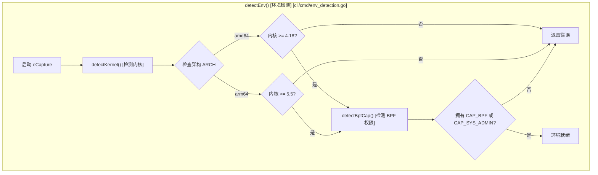
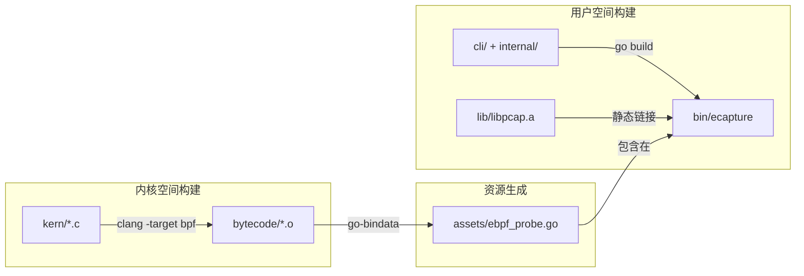

# 安装指南与先决条件

<details>
<summary>相关源文件</summary>

以下文件被用作生成此维基页面的上下文：

- [.github/ISSUE_TEMPLATE/bug_report.md](https://github.com/gojue/ecapture/blob/943a19fe/.github/ISSUE_TEMPLATE/bug_report.md)
- [.github/workflows/go-c-cpp.yml](https://github.com/gojue/ecapture/blob/943a19fe/.github/workflows/go-c-cpp.yml)
- [.github/workflows/release.yml](https://github.com/gojue/ecapture/blob/943a19fe/.github/workflows/release.yml)
- [.golangci.yml](https://github.com/gojue/ecapture/blob/943a19fe/.golangci.yml)
- [Makefile](https://github.com/gojue/ecapture/blob/943a19fe/Makefile)
- [builder/Dockerfile](https://github.com/gojue/ecapture/blob/943a19fe/builder/Dockerfile)
- [builder/Makefile.release](https://github.com/gojue/ecapture/blob/943a19fe/builder/Makefile.release)
- [builder/init_env.sh](https://github.com/gojue/ecapture/blob/943a19fe/builder/init_env.sh)
- [builder/rpmBuild.spec](https://github.com/gojue/ecapture/blob/943a19fe/builder/rpmBuild.spec)
- [cli/cmd/env_detection.go](https://github.com/gojue/ecapture/blob/943a19fe/cli/cmd/env_detection.go)
- [functions.mk](https://github.com/gojue/ecapture/blob/943a19fe/functions.mk)
- [variables.mk](https://github.com/gojue/ecapture/blob/943a19fe/variables.mk)

</details>

本页面提供了安装 eCapture 的全面指南，并确保您的环境满足基于 eBPF 的流量捕获所需的必要条件。eCapture 支持多种安装路径，从预编译二进制文件和包管理器到 Docker 镜像，以及针对自定义环境的源码构建。

## 先决条件与系统要求

eCapture 依赖于特定的 Linux 内核特性（eBPF、uprobes），并且需要足够的权限来加载和挂载 eBPF 程序。

### 硬件架构
*   **x86_64 (amd64)**
*   **aarch64 (arm64)**

### 内核版本要求
由于特定 eBPF 辅助函数（helpers）和特性的可用性，最低内核版本取决于 CPU 架构。

| 架构 | 最低内核版本 | 原因 |
| :--- | :--- | :--- |
| x86_64 | 4.18 | 必要的 eBPF 特性开始提供初始稳定支持。 |
| aarch64 | 5.5 | ARM64 上的 `bpf_probe_read_user` 支持需要 >= 5.5。 |

Sources: [cli/cmd/env_detection.go:32-43](https://github.com/gojue/ecapture/blob/943a19fe/cli/cmd/env_detection.go#L32-L43), [variables.mk:154-157](https://github.com/gojue/ecapture/blob/943a19fe/variables.mk#L154-L157)

### 环境检测逻辑
eCapture 在启动时会执行自动检查，以确保宿主环境兼容。


Sources: [cli/cmd/env_detection.go:26-78](https://github.com/gojue/ecapture/blob/943a19fe/cli/cmd/env_detection.go#L26-L78)

---

## 安装方法

### 1. 预编译二进制文件 (GitHub Releases)
安装 eCapture 最常用的方法是从 [GitHub Releases](https://github.com/gojue/ecapture/releases) 页面下载预编译的压缩包。这些文件适用于 Linux 和 Android。

*   **Linux**: 以 `ecapture-vX.Y.Z-linux-amd64.tar.gz` 形式分发。
*   **Android**: 以 `ecapture-vX.Y.Z-android-arm64.tar.gz` 形式分发。

Sources: [builder/Makefile.release:94-113](https://github.com/gojue/ecapture/blob/943a19fe/builder/Makefile.release#L94-L113), [.github/workflows/release.yml:100-109](https://github.com/gojue/ecapture/blob/943a19fe/.github/workflows/release.yml#L100-L109)

### 2. 包管理器 (RPM/DEB)
对于标准的 Linux 发行版，eCapture 提供了原生安装包。

*   **DEB (Debian/Ubuntu)**: 通过 `dpkg-deb` 生成。
*   **RPM (CentOS/Fedora/RHEL)**: 使用 spec 文件通过 `rpmbuild` 生成。

| 特性 | RPM 详情 | DEB 详情 |
| :--- | :--- | :--- |
| **工具** | `rpmbuild` | `dpkg-deb` |
| **位置** | `/usr/local/bin/ecapture` | `/usr/local/bin/ecapture` |
| **Spec/Control 文件** | `builder/rpmBuild.spec` | `builder/Makefile.release` (内联) |

Sources: [builder/rpmBuild.spec:39-50](https://github.com/gojue/ecapture/blob/943a19fe/builder/rpmBuild.spec#L39-L50), [builder/Makefile.release:141-157](https://github.com/gojue/ecapture/blob/943a19fe/builder/Makefile.release#L141-L157), [Makefile:65-71](https://github.com/gojue/ecapture/blob/943a19fe/Makefile#L65-L71)

### 3. Docker 镜像
eCapture 可以在容器内运行，以检查宿主机的流量。镜像托管在 Docker Hub 上，名称为 `gojue/ecapture`。

**注意：** 容器必须使用 `--privileged` 参数或特定的 capabilities 运行，以便与宿主机内核交互。

```bash
docker run --rm --privileged=true --net=host -v /sys/kernel/debug:/sys/kernel/debug gojue/ecapture tls
```
Sources: [builder/Dockerfile:35-39](https://github.com/gojue/ecapture/blob/943a19fe/builder/Dockerfile#L35-L39), [.github/workflows/release.yml:115-167](https://github.com/gojue/ecapture/blob/943a19fe/.github/workflows/release.yml#L115-L167)

---

## 源码编译

如果您正在开发新的探针，或者需要一个针对特定内核（non-CO-RE）定制的版本，则需要从源码构建。

### 编译工具链要求
| 组件 | 要求 | 用途 |
| :--- | :--- | :--- |
| **Go** | >= 1.24 | 用户态控制平面。 |
| **Clang/LLVM** | >= 14 | eBPF C 程序编译。 |
| **libelf-dev** | 必须 | eBPF 对象加载。 |
| **linux-source** | 必须 | non-CO-RE 编译所需的头文件。 |

Sources: [functions.mk:26-34](https://github.com/gojue/ecapture/blob/943a19fe/functions.mk#L26-L34), [.github/workflows/go-c-cpp.yml:22-30](https://github.com/gojue/ecapture/blob/943a19fe/.github/workflows/go-c-cpp.yml#L22-L30), [builder/init_env.sh:72-79](https://github.com/gojue/ecapture/blob/943a19fe/builder/init_env.sh#L72-L79)

### 编译流程
Makefile 管理着一个复杂的多阶段构建过程，涉及 C 编译 (Clang)、资源嵌入 (`go-bindata`) 和 Go 链接。


Sources: [Makefile:117-128](https://github.com/gojue/ecapture/blob/943a19fe/Makefile#L117-L128), [Makefile:162-166](https://github.com/gojue/ecapture/blob/943a19fe/Makefile#L162-L166), [functions.mk:47-54](https://github.com/gojue/ecapture/blob/943a19fe/functions.mk#L47-L54)

### 编译命令
*   **标准编译 (CO-RE)**: `make all` (需要内核支持 BTF)。
*   **Non-CO-RE 编译**: `make nocore` (适用于不支持 BTF 的旧内核)。
*   **Android 编译**: `ANDROID=1 make nocore` (针对 Android GKI)。
*   **交叉编译**: `CROSS_ARCH=arm64 make all` (在 x86_64 上构建 arm64 版本)。

Sources: [Makefile:4-15](https://github.com/gojue/ecapture/blob/943a19fe/Makefile#L4-L15), [Makefile:92-95](https://github.com/gojue/ecapture/blob/943a19fe/Makefile#L92-L95), [builder/Makefile.release:10-11](https://github.com/gojue/ecapture/blob/943a19fe/builder/Makefile.release#L10-L11)

---

## 安装故障排查

### 1. 缺少 BTF (vmlinux)
如果 eCapture 无法在 CO-RE 模式下启动，可能是内核缺少 BTF 信息。
*   **现象**: 加载 eBPF 对象失败，或编译期间提示缺少 "vmlinux.h"。
*   **解决方案**: 使用 `nocore` 编译，或确保内核配置中设置了 `CONFIG_DEBUG_INFO_BTF=y`。

### 2. 权限拒绝 (Permission Denied)
*   **现象**: `failed to get the capabilities of the current process`。
*   **解决方案**: eCapture 需要 `CAP_SYS_ADMIN`（旧内核）或 `CAP_BPF` + `CAP_PERFMON` + `CAP_SYS_PTRACE`（新内核）。请使用 `sudo` 运行。更多详情请参阅 [最小权限配置](2.2-minimum-privileges.md)。

### 3. 符号缺失 (Missing Symbols)
*   **现象**: `uprobe attach failed`。
*   **解决方案**: 确保目标二进制文件（例如 `/usr/lib/x86_64-linux-gnu/libssl.so.3`）包含符号表。对于 Go 二进制文件，不能是完全去除符号（fully stripped）的版本。

Sources: [cli/cmd/env_detection.go:58-61](https://github.com/gojue/ecapture/blob/943a19fe/cli/cmd/env_detection.go#L58-L61), [Makefile:163](https://github.com/gojue/ecapture/blob/943a19fe/Makefile#L163)