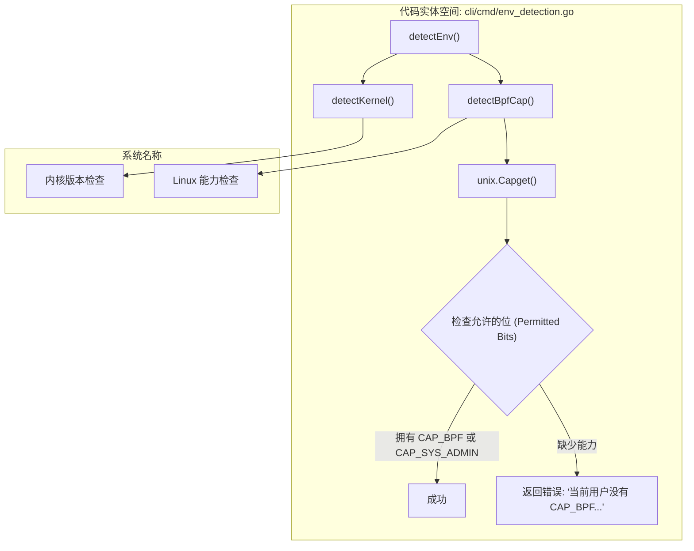
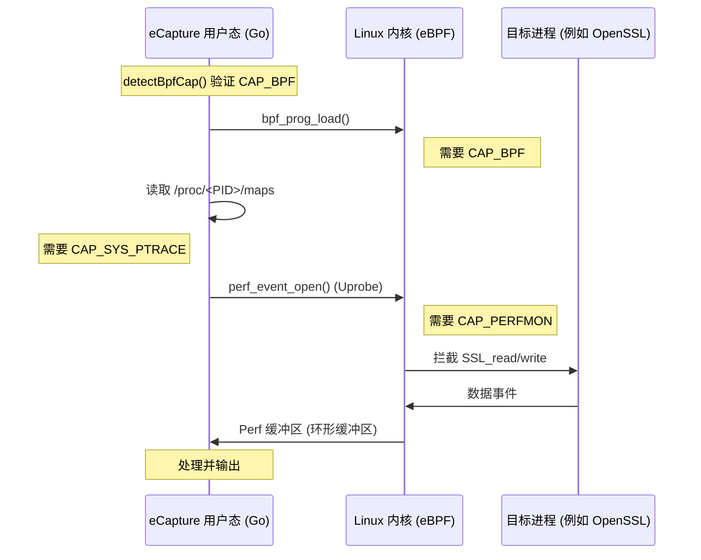

# 最小权限配置

<details>
<summary>相关源文件</summary>

以下文件被用作生成此维基页面的上下文：

- [.github/ISSUE_TEMPLATE/bug_report.md](https://github.com/gojue/ecapture/blob/943a19fe/.github/ISSUE_TEMPLATE/bug_report.md)
- [.golangci.yml](https://github.com/gojue/ecapture/blob/943a19fe/.golangci.yml)
- [README-zh_Hans.md](https://github.com/gojue/ecapture/blob/943a19fe/README-zh_Hans.md)
- [SECURITY.md](https://github.com/gojue/ecapture/blob/943a19fe/SECURITY.md)
- [cli/cmd/env_detection.go](https://github.com/gojue/ecapture/blob/943a19fe/cli/cmd/env_detection.go)
- [docs/README.md](https://github.com/gojue/ecapture/blob/943a19fe/docs/README.md)
- [docs/defense-detection.md](https://github.com/gojue/ecapture/blob/943a19fe/docs/defense-detection.md)
- [docs/example-outputs.md](https://github.com/gojue/ecapture/blob/943a19fe/docs/example-outputs.md)
- [docs/minimum-privileges.md](https://github.com/gojue/ecapture/blob/943a19fe/docs/minimum-privileges.md)
- [docs/performance-benchmarks.md](https://github.com/gojue/ecapture/blob/943a19fe/docs/performance-benchmarks.md)
- [docs/release-verification.md](https://github.com/gojue/ecapture/blob/943a19fe/docs/release-verification.md)
- [pkg/util/kernel/kernel_version.go](https://github.com/gojue/ecapture/blob/943a19fe/pkg/util/kernel/kernel_version.go)
- [pkg/util/kernel/kernel_version_unsupport.go](https://github.com/gojue/ecapture/blob/943a19fe/pkg/util/kernel/kernel_version_unsupport.go)
- [pkg/util/kernel/version.go](https://github.com/gojue/ecapture/blob/943a19fe/pkg/util/kernel/version.go)

</details>

eCapture 是一款强大的安全审计工具，利用 eBPF 技术拦截用户态库中的函数调用。由于它直接与 Linux 内核的 BPF 子系统交互，并将 uprobes 附加到其他进程，因此需要较高的权限。本页面详细介绍了在不同内核版本下所需的特定 Linux Capabilities（能力），并为安全部署提供了配置示例。

## 各内核版本的权限要求

Linux 内核不断演进，为 BPF 和性能监控提供了更细粒度的控制。eCapture 实现了运行时检测以验证这些要求。

### 内核 >= 5.8（细粒度权限）
在 Linux 5.8 及更高版本中，BPF 相关的权限从单一的 `CAP_SYS_ADMIN` 中拆分成了特定的能力 [docs/minimum-privileges.md:7-17](https://github.com/gojue/ecapture/blob/943a19fe/docs/minimum-privileges.md#L7-L17)。

| 能力 | 用途 | eCapture 是否需要 |
| :--- | :--- | :--- |
| `CAP_BPF` | 允许加载和管理 eBPF 程序。 | 所有模式 |
| `CAP_PERFMON` | 允许创建 perf 事件并读取 perf 缓冲区（用于数据输出）。 | 所有模式 |
| `CAP_SYS_PTRACE` | 允许读取 `/proc/<pid>/maps` 以定位库文件偏移量。 | 所有模式 |
| `CAP_NET_ADMIN` | 流量控制（TC）挂载所需。 | 仅限 `pcapng` 模式 |

### 内核 < 5.8（传统模式）
在较旧的内核上，不存在专门的 `CAP_BPF` 和 `CAP_PERFMON` 能力。用户必须提供更广泛的权限 [docs/minimum-privileges.md:18-26](https://github.com/gojue/ecapture/blob/943a19fe/docs/minimum-privileges.md#L18-L26)。

| 能力 | 用途 | eCapture 是否需要 |
| :--- | :--- | :--- |
| `CAP_SYS_ADMIN` | 包含 BPF 和性能监控能力。 | 所有模式 |
| `CAP_SYS_PTRACE` | 允许为 uprobes 检查内存映射。 | 所有模式 |
| `CAP_NET_ADMIN` | 流量控制（TC）挂载所需。 | 仅限 `pcapng` 模式 |

---

## 运行时权限检测

eCapture 在命令执行阶段执行环境检查。函数 `detectEnv` 会调用 `detectKernel` 和 `detectBpfCap` 以确保环境符合要求 [cli/cmd/env_detection.go:66-78](https://github.com/gojue/ecapture/blob/943a19fe/cli/cmd/env_detection.go#L66-L78)。

### 能力验证逻辑
`detectBpfCap` 函数使用 `unix.Capget` 系统调用来检查进程允许的能力 [cli/cmd/env_detection.go:47-64](https://github.com/gojue/ecapture/blob/943a19fe/cli/cmd/env_detection.go#L47-L64)。


Sources: [cli/cmd/env_detection.go:26-78](https://github.com/gojue/ecapture/blob/943a19fe/cli/cmd/env_detection.go#L26-L78), [pkg/util/kernel/version.go:22-32](https://github.com/gojue/ecapture/blob/943a19fe/pkg/util/kernel/version.go#L22-L32)

---

## 配置示例

### 1. 宿主机二进制文件 (setcap)
使用 `setcap` 是遵循**最小权限原则**的推荐方法，可以在不使用 `sudo` 的情况下进行本地执行 [docs/minimum-privileges.md:45-67](https://github.com/gojue/ecapture/blob/943a19fe/docs/minimum-privileges.md#L45-L67)。

**对于内核 >= 5.8：**
```bash
# 文本 (Text) 或 Keylog 模式
sudo setcap 'cap_bpf,cap_perfmon,cap_sys_ptrace=eip' /usr/local/bin/ecapture

# Pcapng 模式（需要网络相关能力）
sudo setcap 'cap_bpf,cap_perfmon,cap_net_admin,cap_sys_ptrace=eip' /usr/local/bin/ecapture
```

### 2. Docker 部署
在生产环境中应避免使用 `--privileged=true`，因为它会授予容器完整的宿主机访问权限 [docs/minimum-privileges.md:104-105](https://github.com/gojue/ecapture/blob/943a19fe/docs/minimum-privileges.md#L104-L105)。相反，应使用特定的 `--cap-add` 标志和卷挂载 [docs/minimum-privileges.md:75-102](https://github.com/gojue/ecapture/blob/943a19fe/docs/minimum-privileges.md#L75-L102)。

```bash
docker run --rm \
  --cap-add=BPF \
  --cap-add=PERFMON \
  --cap-add=NET_ADMIN \
  --cap-add=SYS_PTRACE \
  --pid=host \
  --net=host \
  -v /sys/kernel/debug:/sys/kernel/debug:ro \
  -v /sys/fs/bpf:/sys/fs/bpf \
  gojue/ecapture:latest tls
```

**必要的挂载和标志：**
*   `/sys/kernel/debug`：通过 debugfs 挂载 uprobe 所需 [docs/minimum-privileges.md:110](https://github.com/gojue/ecapture/blob/943a19fe/docs/minimum-privileges.md#L110)。
*   `/sys/fs/bpf`：固定（pinning）BPF map 所需 [docs/minimum-privileges.md:111](https://github.com/gojue/ecapture/blob/943a19fe/docs/minimum-privileges.md#L111)。
*   `--pid=host`：追踪宿主机命名空间中的进程所必需 [docs/minimum-privileges.md:117](https://github.com/gojue/ecapture/blob/943a19fe/docs/minimum-privileges.md#L117)。

### 3. Kubernetes securityContext
对于 Kubernetes 部署，请配置容器规范中的 `securityContext`：

```yaml
securityContext:
  capabilities:
    add:
      - BPF
      - PERFMON
      - NET_ADMIN
      - SYS_PTRACE
readinessProbe:
  # ...
volumeMounts:
  - name: sys-kernel-debug
    mountPath: /sys/kernel/debug
    readOnly: true
```

---

## 数据流与权限边界

下图展示了 eCapture 如何利用这些权限在用户态二进制文件与内核 eBPF 子系统之间建立桥梁。


Sources: [docs/minimum-privileges.md:5-34](https://github.com/gojue/ecapture/blob/943a19fe/docs/minimum-privileges.md#L5-L34), [docs/performance-benchmarks.md:7-12](https://github.com/gojue/ecapture/blob/943a19fe/docs/performance-benchmarks.md#L7-L12), [cli/cmd/env_detection.go:47-64](https://github.com/gojue/ecapture/blob/943a19fe/cli/cmd/env_detection.go#L47-L64)

---

## 安全最佳实践
1.  **限制二进制文件访问**：使用组权限来限制谁可以执行带有设定能力的 eCapture 二进制文件 [docs/minimum-privileges.md:142-146](https://github.com/gojue/ecapture/blob/943a19fe/docs/minimum-privileges.md#L142-L146)。
2.  **限定捕获范围**：始终使用 `--pid` 标志将捕获限制在特定的目标进程，而不是进行全系统审计 [docs/minimum-privileges.md:137](https://github.com/gojue/ecapture/blob/943a19fe/docs/minimum-privileges.md#L137)。
3.  **清理环境**：在故障排除或审计会话完成后，移除二进制文件或清除能力（`setcap -r`）[docs/minimum-privileges.md:139](https://github.com/gojue/ecapture/blob/943a19fe/docs/minimum-privileges.md#L139)。

Sources:
* [cli/cmd/env_detection.go:26-78](https://github.com/gojue/ecapture/blob/943a19fe/cli/cmd/env_detection.go#L26-L78)
* [docs/minimum-privileges.md:1-154](https://github.com/gojue/ecapture/blob/943a19fe/docs/minimum-privileges.md#L1-L154)
* [pkg/util/kernel/version.go:1-50](https://github.com/gojue/ecapture/blob/943a19fe/pkg/util/kernel/version.go#L1-L50)
* [docs/defense-detection.md:117-138](https://github.com/gojue/ecapture/blob/943a19fe/docs/defense-detection.md#L117-L138)