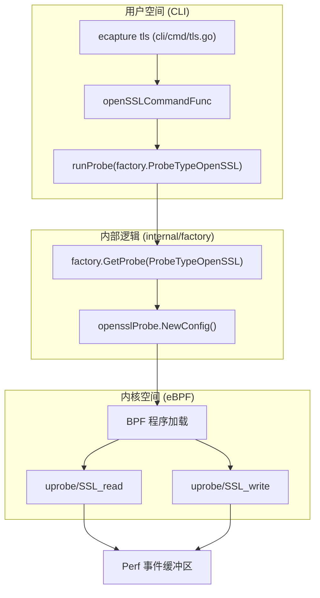
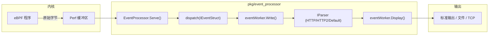

# 快速开始（5分钟运行首个示例）

<details>
<summary>相关源文件</summary>

以下文件被用作生成此维基页面的上下文：

- [README-zh_Hans.md](https://github.com/gojue/ecapture/blob/943a19fe/README-zh_Hans.md)
- [SECURITY.md](https://github.com/gojue/ecapture/blob/943a19fe/SECURITY.md)
- [cli/cmd/gnutls.go](https://github.com/gojue/ecapture/blob/943a19fe/cli/cmd/gnutls.go)
- [cli/cmd/gotls.go](https://github.com/gojue/ecapture/blob/943a19fe/cli/cmd/gotls.go)
- [cli/cmd/nss.go](https://github.com/gojue/ecapture/blob/943a19fe/cli/cmd/nss.go)
- [cli/cmd/root.go](https://github.com/gojue/ecapture/blob/943a19fe/cli/cmd/root.go)
- [cli/cmd/tls.go](https://github.com/gojue/ecapture/blob/943a19fe/cli/cmd/tls.go)
- [docs/README.md](https://github.com/gojue/ecapture/blob/943a19fe/docs/README.md)
- [docs/defense-detection.md](https://github.com/gojue/ecapture/blob/943a19fe/docs/defense-detection.md)
- [docs/example-outputs.md](https://github.com/gojue/ecapture/blob/943a19fe/docs/example-outputs.md)
- [docs/minimum-privileges.md](https://github.com/gojue/ecapture/blob/943a19fe/docs/minimum-privileges.md)
- [docs/performance-benchmarks.md](https://github.com/gojue/ecapture/blob/943a19fe/docs/performance-benchmarks.md)
- [docs/release-verification.md](https://github.com/gojue/ecapture/blob/943a19fe/docs/release-verification.md)
- [pkg/event_processor/http_request.go](https://github.com/gojue/ecapture/blob/943a19fe/pkg/event_processor/http_request.go)
- [pkg/event_processor/http_response.go](https://github.com/gojue/ecapture/blob/943a19fe/pkg/event_processor/http_response.go)
- [pkg/event_processor/iparser.go](https://github.com/gojue/ecapture/blob/943a19fe/pkg/event_processor/iparser.go)
- [pkg/event_processor/iworker.go](https://github.com/gojue/ecapture/blob/943a19fe/pkg/event_processor/iworker.go)
- [pkg/event_processor/processor.go](https://github.com/gojue/ecapture/blob/943a19fe/pkg/event_processor/processor.go)

</details>

本指南提供了一个动手实践的流程，帮助你使用 eCapture 运行首次捕获。我们将重点介绍最常见的用例：使用 `tls` 探针捕获来自 `curl` 的明文 TLS 流量。

## 1. 准备工作

确保你已经安装了 eCapture 二进制文件，并拥有必要的权限（root 或特定 capabilities）。eCapture 支持 Linux x86_64（内核 >= 4.18）和 aarch64（内核 >= 5.5）[cli/cmd/root.go:114-115](https://github.com/gojue/ecapture/blob/943a19fe/cli/cmd/root.go#L114-L115)。

### 验证安装
```bash
ecapture version
```

## 2. 启动你的首次捕获

`tls` 命令是捕获 SSL/TLS 明文的主要工具。它的工作原理是在共享库中的 `SSL_read` 和 `SSL_write` 等函数上挂载 eBPF uprobes [cli/cmd/tls.go:32-33](https://github.com/gojue/ecapture/blob/943a19fe/cli/cmd/tls.go#L32-L33)。

### 步骤 1：启动 eCapture
打开一个终端并以 `text` 模式（默认）运行 eCapture。我们将在启动后通过 `curl` 进程进行过滤，但现在，让我们观察所有的 OpenSSL 流量：

```bash
sudo ecapture tls -m text
```

### 步骤 2：触发流量
在第二个终端中，使用 `curl` 执行一个 HTTPS 请求：

```bash
curl https://www.google.com
```

### 步骤 3：观察输出
回到第一个终端，你将看到解密后的明文。输出格式通常包括 PID、进程名称以及请求和响应的十六进制/字符串内容 [pkg/event_processor/iworker.go:205-206](https://github.com/gojue/ecapture/blob/943a19fe/pkg/event_processor/iworker.go#L205-L206)。

## 3. 实用示例

### 按 PID 过滤
为了避免来自其他进程的干扰，请使用 `--pid`（或 `-p`）标志 [cli/cmd/root.go:166](https://github.com/gojue/ecapture/blob/943a19fe/cli/cmd/root.go#L166)。

```bash
# 1. 查找正在运行的进程（例如 nginx）的 PID
pidof nginx

# 2. 仅捕获该进程
sudo ecapture tls --pid 1234
```

### 从特定库捕获
如果你的二进制文件使用了非标准的 OpenSSL 路径，请使用 `--libssl` [cli/cmd/tls.go:51](https://github.com/gojue/ecapture/blob/943a19fe/cli/cmd/tls.go#L51)。

```bash
sudo ecapture tls --libssl /usr/lib/x86_64-linux-gnu/libssl.so.1.1
```

### Go 二进制文件 (gotls)
对于使用 Go 标准库 (`crypto/tls`) 编译的二进制文件，请使用 `gotls` 探针并指定 ELF 路径 [cli/cmd/gotls.go:32-35](https://github.com/gojue/ecapture/blob/943a19fe/cli/cmd/gotls.go#L32-L35)。

```bash
sudo ecapture gotls --elfpath /path/to/your/go_binary
```

## 4. 数据流架构

下图展示了用户命令如何触发 eBPF 插桩，以及数据如何流回终端。

### 从 CLI 到内核挂钩
“此图将 CLI 入口点映射到内部工厂和探针初始化。”


Sources: [cli/cmd/tls.go:47-80](https://github.com/gojue/ecapture/blob/943a19fe/cli/cmd/tls.go#L47-L80), [cli/cmd/root.go:158-176](https://github.com/gojue/ecapture/blob/943a19fe/cli/cmd/root.go#L158-L176), [cli/cmd/gotls.go:58-72](https://github.com/gojue/ecapture/blob/943a19fe/cli/cmd/gotls.go#L58-L72)

### 事件处理流水线
“此图显示了来自内核的原始字节如何被处理成可读文本。”


Sources: [pkg/event_processor/processor.go:64-87](https://github.com/gojue/ecapture/blob/943a19fe/pkg/event_processor/processor.go#L64-L87), [pkg/event_processor/iworker.go:153-161](https://github.com/gojue/ecapture/blob/943a19fe/pkg/event_processor/iworker.go#L153-L161), [pkg/event_processor/iworker.go:174-227](https://github.com/gojue/ecapture/blob/943a19fe/pkg/event_processor/iworker.go#L174-L227), [pkg/event_processor/iparser.go:85-115](https://github.com/gojue/ecapture/blob/943a19fe/pkg/event_processor/iparser.go#L85-L115)

## 5. 预期输出格式

| 模式 | 标志 | 描述 |
| :--- | :--- | :--- |
| **文本 (Text)** | `-m text` | 直接向终端输出明文。最适合快速调试 [cli/cmd/tls.go:53](https://github.com/gojue/ecapture/blob/943a19fe/cli/cmd/tls.go#L53)。 |
| **Pcap** | `-m pcap` | 保存到 `.pcapng` 文件。使用 `-w` 指定文件名 [cli/cmd/tls.go:55](https://github.com/gojue/ecapture/blob/943a19fe/cli/cmd/tls.go#L55)。 |
| **Keylog** | `-m keylog`| 将 TLS 密钥保存到文件供 Wireshark 使用。使用 `-k` 指定 [cli/cmd/tls.go:54](https://github.com/gojue/ecapture/blob/943a19fe/cli/cmd/tls.go#L54)。 |

### 文本模式示例输出
当运行 `ecapture tls` 时，`eventWorker` 会按如下格式格式化输出：
```text
PID:1234, Comm:curl, Src:192.168.1.5:44332, Dest:93.184.216.34:443,
GET / HTTP/1.1
Host: example.com
User-Agent: curl/7.74.0
```
Sources: [pkg/event_processor/iworker.go:205-206](https://github.com/gojue/ecapture/blob/943a19fe/pkg/event_processor/iworker.go#L205-L206)

## 6. 故障排查快速检查

*   **权限拒绝 (Permission Denied)**：确保你正在使用 `sudo` 运行。eCapture 需要 `CAP_SYS_ADMIN` 或 `CAP_BPF` [cli/cmd/root.go:130-136](https://github.com/gojue/ecapture/blob/943a19fe/cli/cmd/root.go#L130-L136)。
*   **无输出 (Empty Output)**：
    *   验证进程是否确实在使用你认为的库（例如，检查它是否在使用 GnuTLS 而不是 OpenSSL）。
    *   检查内核版本是否符合最低要求 [cli/cmd/root.go:114-115](https://github.com/gojue/ecapture/blob/943a19fe/cli/cmd/root.go#L114-L115)。
*   **BTF 错误**：如果你的内核不支持 BTF，请尝试使用 `-b 2` 强制进入非 CORE 模式 [cli/cmd/root.go:163](https://github.com/gojue/ecapture/blob/943a19fe/cli/cmd/root.go#L163)。

Sources: [cli/cmd/tls.go:1-80](https://github.com/gojue/ecapture/blob/943a19fe/cli/cmd/tls.go#L1-L80), [cli/cmd/root.go:1-180](https://github.com/gojue/ecapture/blob/943a19fe/cli/cmd/root.go#L1-L180), [pkg/event_processor/processor.go:1-214](https://github.com/gojue/ecapture/blob/943a19fe/pkg/event_processor/processor.go#L1-L214), [pkg/event_processor/iworker.go:1-265](https://github.com/gojue/ecapture/blob/943a19fe/pkg/event_processor/iworker.go#L1-L265), [pkg/event_processor/iparser.go:1-167](https://github.com/gojue/ecapture/blob/943a19fe/pkg/event_processor/iparser.go#L1-L167)