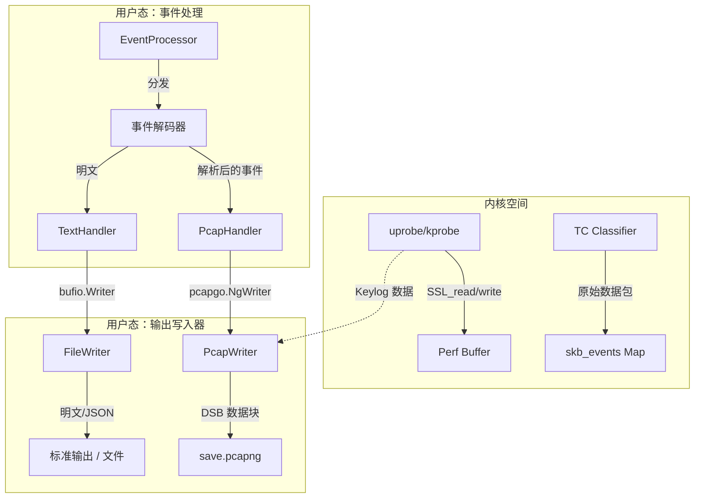
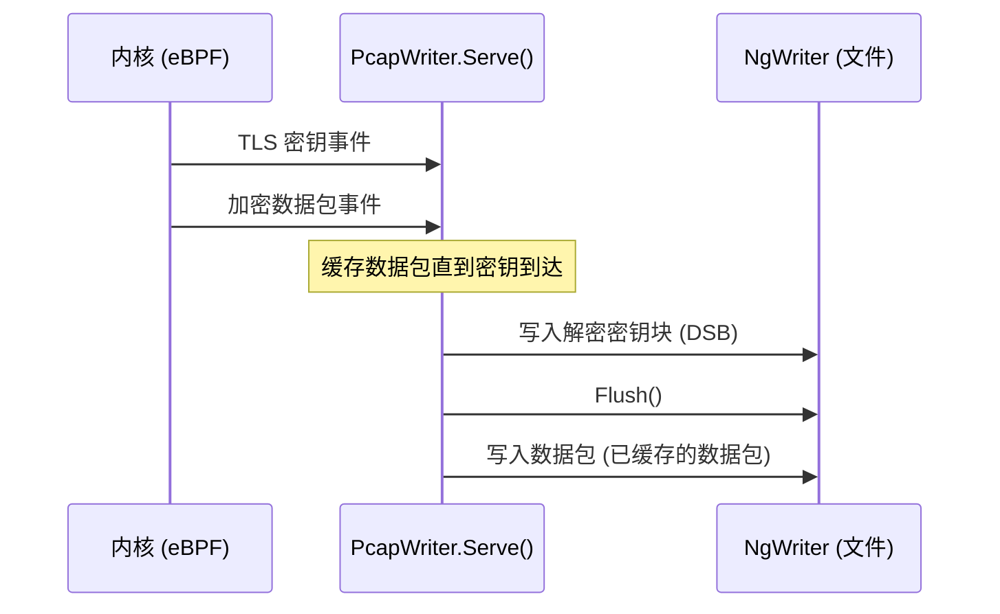

# 输出格式说明 (text / pcap / keylog)

<details>
<summary>相关源码文件</summary>

以下文件被用作生成此维基页面的上下文：

- [cli/cmd/gnutls.go](https://github.com/gojue/ecapture/blob/943a19fe/cli/cmd/gnutls.go)
- [cli/cmd/gotls.go](https://github.com/gojue/ecapture/blob/943a19fe/cli/cmd/gotls.go)
- [cli/cmd/nss.go](https://github.com/gojue/ecapture/blob/943a19fe/cli/cmd/nss.go)
- [cli/cmd/tls.go](https://github.com/gojue/ecapture/blob/943a19fe/cli/cmd/tls.go)
- [internal/output/writers/file_writer.go](https://github.com/gojue/ecapture/blob/943a19fe/internal/output/writers/file_writer.go)
- [internal/output/writers/pcap_writer.go](https://github.com/gojue/ecapture/blob/943a19fe/internal/output/writers/pcap_writer.go)
- [internal/probe/base/handlers/pcap_handler.go](https://github.com/gojue/ecapture/blob/943a19fe/internal/probe/base/handlers/pcap_handler.go)
- [kern/common.h](https://github.com/gojue/ecapture/blob/943a19fe/kern/common.h)
- [kern/ecapture.h](https://github.com/gojue/ecapture/blob/943a19fe/kern/ecapture.h)
- [kern/tc.h](https://github.com/gojue/ecapture/blob/943a19fe/kern/tc.h)
- [pkg/util/hkdf/hkdf.go](https://github.com/gojue/ecapture/blob/943a19fe/pkg/util/hkdf/hkdf.go)
- [pkg/util/hkdf/hkdf_test.go](https://github.com/gojue/ecapture/blob/943a19fe/pkg/util/hkdf/hkdf_test.go)

</details>

eCapture 支持三种主要的输出模式用于捕获和分析数据：**Text**、**Pcap/Pcapng** 和 **Keylog**。这些模式允许用户在即时的人类可读终端输出、通过 Wireshark 进行的专业网络分析或用于捕获后解密的加密密钥提取之间进行选择。

## 1. 输出模式概览

输出模式通过大多数探针（如 `tls`、`gotls`、`gnutls`）中提供的 `-m` 或 `--model` 标志进行控制。

| 模式 | 标志 | 用途 | 要求 |
| :--- | :--- | :--- | :--- |
| **Text** | `-m text` | 直接将明文输出到标准输出或文件。 | 默认 |
| **Pcapng** | `-m pcap` | 通过 TC (Traffic Control) eBPF 程序捕获原始网络数据包。 | `CAP_NET_ADMIN` |
| **Keylog** | `-m keylog` | 以 NSS Key Log 格式捕获 TLS 主密钥 (Master Secrets)。 | 支持的 TLS 探针 |

### 数据流架构

下图展示了内核中的 eBPF 事件如何通过用户态流水线转换为不同的输出格式。

**图 1：事件到输出流水线**

**Sources:** [cli/cmd/tls.go:53-55](https://github.com/gojue/ecapture/blob/943a19fe/cli/cmd/tls.go#L53-L55), [internal/probe/base/handlers/pcap_handler.go:126-159](https://github.com/gojue/ecapture/blob/943a19fe/internal/probe/base/handlers/pcap_handler.go#L126-L159), [internal/output/writers/pcap_writer.go:161-226](https://github.com/gojue/ecapture/blob/943a19fe/internal/output/writers/pcap_writer.go#L161-L226)

---

## 2. 文本模式 (`-m text`)

文本模式是默认行为。它捕获 `SSL_read` 和 `SSL_write` 等函数的明文参数并直接打印。

*   **实现**：从 eBPF perf buffer 读取数据，解码为字符串或十六进制格式，并发送到 `FileWriter` 或 `Stdout`。
*   **格式化**：支持使用 `--hex` 进行十六进制转储，使用 `--json` 进行结构化日志记录。
*   **示例**：
    ```bash
    ecapture tls -m text --pid 1234
    ```

**Sources:** [cli/cmd/tls.go:53](https://github.com/gojue/ecapture/blob/943a19fe/cli/cmd/tls.go#L53), [internal/output/writers/file_writer.go:27-33](https://github.com/gojue/ecapture/blob/943a19fe/internal/output/writers/file_writer.go#L27-L33)

---

## 3. Pcap/Pcapng 模式 (`-m pcap`)

在此模式下，eCapture 将 eBPF 程序挂载到 **TC (Traffic Control)** 子系统以捕获原始网络数据包。它使用 `PCAPNG` 格式，该格式比传统的 PCAP 具有更好的可扩展性。

### 实现细节
1.  **TC 挂载**：探针挂载到网络接口（由 `-i` 指定）。[cli/cmd/tls.go:56](https://github.com/gojue/ecapture/blob/943a19fe/cli/cmd/tls.go#L56)
2.  **数据包捕获**：原始数据包通过 `skb_events` perf map 发送到用户态。[kern/tc.h:58-63](https://github.com/gojue/ecapture/blob/943a19fe/kern/tc.h#L58-L63)
3.  **元数据注入**：eCapture 使用 `pcapgo.NgWriter` 创建 `PCAPNG` 文件。其中包含接口描述和标识 eCapture 为来源的注释。[internal/output/writers/pcap_writer.go:64-80](https://github.com/gojue/ecapture/blob/943a19fe/internal/output/writers/pcap_writer.go#L64-L80)
4.  **接口索引**：默认情况下，受监控的接口在 pcapng 标头中被设置为索引 `0`，以确保与 Wireshark 的兼容性。[internal/output/writers/pcap_writer.go:142-147](https://github.com/gojue/ecapture/blob/943a19fe/internal/output/writers/pcap_writer.go#L142-L147)

### CLI 示例
```bash
# 在 eth0 上捕获 TLS 流量并保存为 pcapng
ecapture tls -m pcap -i eth0 -w capture.pcapng tcp port 443
```

**Sources:** [internal/probe/base/handlers/pcap_handler.go:106-123](https://github.com/gojue/ecapture/blob/943a19fe/internal/probe/base/handlers/pcap_handler.go#L106-L123), [internal/output/writers/pcap_writer.go:39-53](https://github.com/gojue/ecapture/blob/943a19fe/internal/output/writers/pcap_writer.go#L39-L53)

---

## 4. Keylog 模式 (`-m keylog`)

Keylog 模式直接从目标进程的内存中提取 TLS 密钥（主密钥 Master Secrets、客户端随机数 Client Randoms）。这些密钥被格式化为 **NSS Key Log** 条目。

### 为什么使用 Keylog？
虽然 `text` 模式向你展示了 eCapture 看到的数据，但 `keylog` 模式允许你使用 **tcpdump** 等标准工具捕获流量，并在稍后使用生成的密钥文件通过 **Wireshark** 对其进行解密。

### 支持的密钥标签 (Secret Labels)
eCapture 同时支持 TLS 1.2 和 TLS 1.3 的密钥标签：
*   `CLIENT_RANDOM` (TLS 1.2)
*   `CLIENT_HANDSHAKE_TRAFFIC_SECRET` (TLS 1.3)
*   `SERVER_HANDSHAKE_TRAFFIC_SECRET` (TLS 1.3)
*   `EXPORTER_SECRET`

### 与 Pcapng (DSB) 集成
当使用 `-m pcap` 时，eCapture 会使用 **解密密钥块 (Decryption Secrets Blocks, DSB)** 自动将这些密钥嵌入到 `PCAPNG` 文件中。这意味着生成的文件可以在 Wireshark 中打开并直接解密，**无需**提供外部密钥文件。

**图 2：DSB 序列化逻辑**

*逻辑说明：eCapture 会延迟刷新数据包最多 3 秒，以确保 DSB（密钥）在文件流中出现在加密数据包之前。* [internal/output/writers/pcap_writer.go:171-184](https://github.com/gojue/ecapture/blob/943a19fe/internal/output/writers/pcap_writer.go#L171-L184)

### CLI 示例
```bash
# 将密钥保存到单独的文件中
ecapture tls -m keylog -k my_keys.log
```

**Sources:** [pkg/util/hkdf/hkdf.go:49-57](https://github.com/gojue/ecapture/blob/943a19fe/pkg/util/hkdf/hkdf.go#L49-L57), [internal/output/writers/pcap_writer.go:210-226](https://github.com/gojue/ecapture/blob/943a19fe/internal/output/writers/pcap_writer.go#L210-L226)

---

## 5. 输出配置标志

用户可以使用以下标志组合编码器和目标：

| 标志 | 类型 | 描述 |
| :--- | :--- | :--- |
| `-l`, `--logaddr` | 字符串 | 发送日志的文件路径或 TCP 地址（例如 `127.0.0.1:8080`）。 |
| `-w`, `--pcapfile` | 字符串 | PCAPNG 文件的输出路径。默认值：`save.pcapng`。 |
| `--hex` | 布尔值 | 以十六进制格式打印文本输出。 |
| `--perf-reorder` | 布尔值 | 在输出前按内核时间戳对 perf 事件进行重新排序，以确保按时间顺序排列。 |

### 高级：日志轮转
`FileWriter` 通过 `roratelog` 包支持日志轮转，从而在不填满磁盘空间的情况下实现生产级审计。[internal/output/writers/file_writer.go:56-65](https://github.com/gojue/ecapture/blob/943a19fe/internal/output/writers/file_writer.go#L56-L65)

**Sources:** [cli/cmd/tls.go:51-61](https://github.com/gojue/ecapture/blob/943a19fe/cli/cmd/tls.go#L51-L61), [internal/output/writers/file_writer.go:36-43](https://github.com/gojue/ecapture/blob/943a19fe/internal/output/writers/file_writer.go#L36-L43)