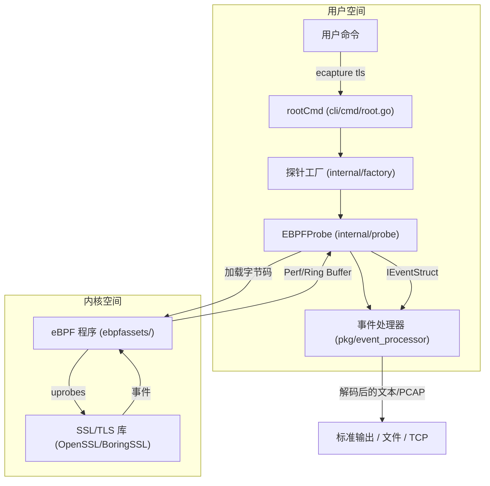
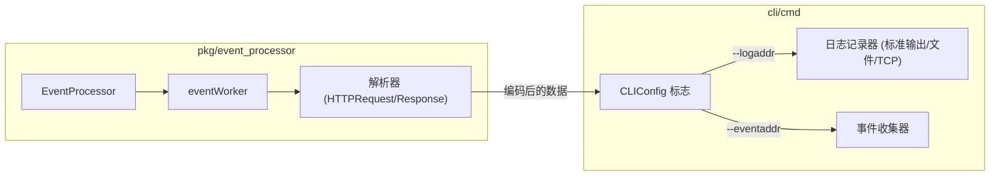

# 快速上手

<details>
<summary>相关源文件</summary>

以下文件被用作生成此维基页面的上下文：

- [CHANGELOG.md](https://github.com/gojue/ecapture/blob/943a19fe/CHANGELOG.md)
- [README.md](https://github.com/gojue/ecapture/blob/943a19fe/README.md)
- [cli/cmd/root.go](https://github.com/gojue/ecapture/blob/943a19fe/cli/cmd/root.go)
- [main.go](https://github.com/gojue/ecapture/blob/943a19fe/main.go)
- [pkg/event_processor/http_request.go](https://github.com/gojue/ecapture/blob/943a19fe/pkg/event_processor/http_request.go)
- [pkg/event_processor/http_response.go](https://github.com/gojue/ecapture/blob/943a19fe/pkg/event_processor/http_response.go)
- [pkg/event_processor/iparser.go](https://github.com/gojue/ecapture/blob/943a19fe/pkg/event_processor/iparser.go)
- [pkg/event_processor/iworker.go](https://github.com/gojue/ecapture/blob/943a19fe/pkg/event_processor/iworker.go)
- [pkg/event_processor/processor.go](https://github.com/gojue/ecapture/blob/943a19fe/pkg/event_processor/processor.go)

</details>

本页面是 eCapture 新用户的主要入口。它提供了从环境验证到运行首次明文捕获设置过程的高层概述。通过参考此处链接的子页面，您可以在五分钟内从全新安装进入到查看解密的 TLS 流量。

### 设置流程概览

使用 eCapture 的过程包含四个主要阶段：准备环境、获取二进制文件、确保正确的权限以及执行捕获模块。

1.  **安装**：在预编译二进制文件、Docker 镜像或源码编译之间进行选择。
2.  **环境检查**：验证您的 Linux 内核版本和 CPU 架构（x86_64 或 aarch64）。
3.  **权限配置**：配置必要的 Linux Capabilities 或使用 root 权限。
4.  **首次捕获**：运行一个简单的 `tls` 探针，从 `curl` 或 `wget` 等工具中拦截明文数据。

### 高层组件交互

下图展示了用户如何通过 eCapture CLI 交互来启动捕获会话，以及内部组件如何促进从内核到最终输出的数据流。

**CLI 到内核的数据路径**

Sources: [cli/cmd/root.go:105-137](https://github.com/gojue/ecapture/blob/943a19fe/cli/cmd/root.go#L105-L137), [internal/factory/factory.go:1-50](https://github.com/gojue/ecapture/blob/943a19fe/internal/factory/factory.go#L1-L50), [pkg/event_processor/processor.go:89-107](https://github.com/gojue/ecapture/blob/943a19fe/pkg/event_processor/processor.go#L89-L107), [README.md:106-119](https://github.com/gojue/ecapture/blob/943a19fe/README.md#L106-L119)

---

### 2.1 安装指南与先决条件
eCapture 支持多种安装方法以适应不同的环境。最常用的方法是从 GitHub Releases 直接下载 ELF 二进制文件。对于容器化环境，我们提供了 Docker 镜像，但它需要特定的权限才能与宿主机内核交互。

**支持的平台：**
*   **Linux x86_64**：内核版本 >= 4.18
*   **Linux aarch64**：内核版本 >= 5.5
*   **Android**：GKI 内核 (arm64)

有关详细的安装步骤和系统要求，请参阅 [安装指南与先决条件](2.1-installation-and-prerequisites.md)。

Sources: [README.md:12-15](https://github.com/gojue/ecapture/blob/943a19fe/README.md#L12-L15), [README.md:48-72](https://github.com/gojue/ecapture/blob/943a19fe/README.md#L48-L72)

### 2.2 最小权限配置
由于 eCapture 利用 eBPF 挂钩系统库，它需要较高的权限。虽然以 `root` 身份运行是最简单的方法，但生产环境通常需要受限的权限。eCapture 可以通过 Linux Capabilities 的子集运行，例如 `CAP_BPF`、`CAP_PERFMON` 和 `CAP_SYS_PTRACE`。

有关配置特定 Capability 和 Kubernetes securityContext 的说明，请参阅 [最小权限配置](2.2-minimum-privileges.md)。

Sources: [README.md:14-14](https://github.com/gojue/ecapture/blob/943a19fe/README.md#L14-L14), [cli/cmd/root.go:124-124](https://github.com/gojue/ecapture/blob/943a19fe/cli/cmd/root.go#L124-L124)

### 2.3 快速开始（5分钟运行首个示例）
验证设置最快的方法是运行 `tls` 模块。默认情况下，eCapture 会在系统中搜索 OpenSSL 或 BoringSSL 库并开始捕获明文。

**示例命令：**
```shell
sudo ecapture tls
```
启动后，在另一个终端执行类似 `curl https://google.com` 的命令将触发捕获，并在您的控制台中显示 HTTP/1.1 或 HTTP/2 的头部和主体。

有关包含 PID 过滤和特定应用程序示例的完整演练，请参阅 [快速开始（5分钟运行首个示例）](2.3-quick-start-run-the-first-example-in-5-minutes.md)。

Sources: [README.md:74-90](https://github.com/gojue/ecapture/blob/943a19fe/README.md#L74-L90), [cli/cmd/root.go:118-121](https://github.com/gojue/ecapture/blob/943a19fe/cli/cmd/root.go#L118-L121)

### 2.4 输出格式说明 (text / pcap / keylog)
eCapture 根据您的分析需求提供灵活的输出选项：
*   **文本模式 (Text Mode)**：直接向控制台输出人类可读的内容。
*   **Pcap/Pcapng 模式**：生成与 Wireshark 兼容的文件，用于深度数据包分析。
*   **Keylog 模式**：导出 TLS Master Secrets（NSS Key Log 格式），用于解密由 `tcpdump` 等其他工具捕获的流量。

底层的 `EventProcessor` 使用 `HTTPRequest` 和 `HTTPResponse` 等专用解析器，处理将原始 eBPF 事件转换为这些格式的工作。

有关选择和配置输出模式的详细信息，请参阅 [输出格式说明 (text / pcap / keylog)](2.4-output-formats-text--pcap--keylog.md)。

**内部输出流**

Sources: [pkg/event_processor/processor.go:28-48](https://github.com/gojue/ecapture/blob/943a19fe/pkg/event_processor/processor.go#L28-L48), [pkg/event_processor/iworker.go:174-227](https://github.com/gojue/ecapture/blob/943a19fe/pkg/event_processor/iworker.go#L174-L227), [cli/cmd/root.go:78-86](https://github.com/gojue/ecapture/blob/943a19fe/cli/cmd/root.go#L78-L86), [cli/cmd/root.go:168-171](https://github.com/gojue/ecapture/blob/943a19fe/cli/cmd/root.go#L168-L171)