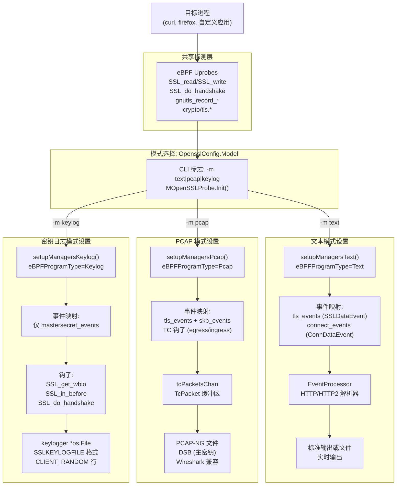
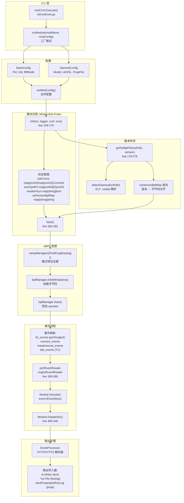

# TLS/SSL 捕获模块

## 目的与范围

本页概述了 eCapture 在多个加密库上的 TLS/SSL 捕获能力。TLS/SSL 捕获模块使用 eBPF uprobe 拦截加密库函数，无需 CA 证书、应用程序修改或库重新编译即可提取明文数据或 TLS 握手密钥。

eCapture 通过专用模块支持四大 TLS/SSL 库家族：

| 模块 | CLI 命令 | 支持的库 | 版本覆盖范围 |
|--------|-------------|-------------------|------------------|
| OpenSSL | `ecapture tls` | OpenSSL, LibreSSL, BoringSSL | OpenSSL 1.0.2-3.5.x, BoringSSL Android 12-16 |
| Go TLS | `ecapture gotls` | Go crypto/tls | Go 1.8+ (所有版本) |
| GnuTLS | `ecapture gnutls` | GnuTLS | 3.x 系列 |
| NSS/NSPR | `ecapture nss` | Mozilla NSS | NSS 3.x 系列 |

所有模块共享 `IModule` 接口 [user/module/imodule.go:47-75](https://github.com/gojue/ecapture/blob/ca085d05/user/module/imodule.go#L47-L75)，并实现三种捕获模式：
- **文本模式**：实时明文输出，带 HTTP/HTTP2 解析
- **PCAP 模式**：将网络数据包保存到 PCAP-NG 文件，并嵌入密钥
- **密钥日志模式**：以 SSLKEYLOGFILE 格式提取 TLS 主密钥

**子章节导航：**
- OpenSSL/BoringSSL 实现细节：参见页面 **3.1.1**
- Go TLS 实现和 ABI 处理：参见页面 **3.1.3**
- GnuTLS 和 NSS 实现：参见页面 **3.1.4**
- TLS 1.2/1.3 主密钥提取：参见页面 **3.1.5**

**来源：** [user/module/imodule.go:47-75](https://github.com/gojue/ecapture/blob/ca085d05/user/module/imodule.go#L47-L75), [README.md:36-43](https://github.com/gojue/ecapture/blob/ca085d05/README.md#L36-L43), [cli/cmd/root.go:80-113](https://github.com/gojue/ecapture/blob/ca085d05/cli/cmd/root.go#L80-L113)

---

## 支持的库与版本

eCapture 提供跨多个库实现的全面 TLS/SSL 捕获。每个模块自动检测库版本并选择带有版本特定结构偏移量的适当 eBPF 字节码。

### 各库的版本覆盖范围

**OpenSSL 模块 (`ecapture tls`)：**
- **OpenSSL 1.0.2a-u**：26 个版本分组到共享字节码
- **OpenSSL 1.1.0a-l**：12 个版本，使用标准钩子
- **OpenSSL 1.1.1a-w**：补丁版本间的通用字节码
- **OpenSSL 3.0.0-3.0.15**：支持 `ssl_connection_st` 结构
- **OpenSSL 3.1.0-3.5.4**：最新稳定版本
- **LibreSSL**：使用 OpenSSL 1.1.1 兼容字节码
- **BoringSSL Android 12-16**：每个 Android 版本的特定偏移量

**Go TLS 模块 (`ecapture gotls`)：**
- **Go 1.8-1.16**：基于栈的 ABI 调用约定
- **Go 1.17+**：基于寄存器的 ABI 调用约定
- 从二进制元数据自动检测 Go 版本

**GnuTLS 模块 (`ecapture gnutls`)：**
- **GnuTLS 3.x 系列**：完整的数据和密钥日志支持

**NSS/NSPR 模块 (`ecapture nss`)：**
- **NSS 3.x 系列**：用于 Firefox 和基于 NSS 的应用程序

### 平台支持矩阵

| 架构 | 内核要求 | 支持的模块 |
|--------------|-------------------|-------------------|
| Linux x86_64 | 4.18+ | 所有模块 |
| Linux aarch64 | 5.5+ | 所有模块 |
| Android x86_64 | Android 12+ | OpenSSL (BoringSSL) |
| Android aarch64 | Android 12+ | OpenSSL (BoringSSL) |

**来源：** [README.md:14-16](https://github.com/gojue/ecapture/blob/ca085d05/README.md#L14-L16), [CHANGELOG.md:1-45](https://github.com/gojue/ecapture/blob/ca085d05/CHANGELOG.md#L1-L45), [user/module/probe_openssl.go:178-278](https://github.com/gojue/ecapture/blob/ca085d05/user/module/probe_openssl.go#L178-L278)

---

## 捕获模式

所有 TLS/SSL 模块支持三种操作模式，用于确定捕获的数据如何处理和输出。通过 `-m` 命令行标志选择模式。

### 三种捕获模式概览

图示：按模式划分的 TLS 模块捕获流程



**来源：** [user/module/probe_openssl.go:58-76](https://github.com/gojue/ecapture/blob/ca085d05/user/module/probe_openssl.go#L58-L76), [user/module/probe_openssl.go:128-154](https://github.com/gojue/ecapture/blob/ca085d05/user/module/probe_openssl.go#L128-L154), [user/module/probe_openssl.go:280-350](https://github.com/gojue/ecapture/blob/ca085d05/user/module/probe_openssl.go#L280-L350), [user/config/iconfig.go:73-79](https://github.com/gojue/ecapture/blob/ca085d05/user/config/iconfig.go#L73-L79)

### 模式配置与行为

捕获模式由 `TlsCaptureModelType` 枚举 [user/module/probe_openssl.go:58-64](https://github.com/gojue/ecapture/blob/ca085d05/user/module/probe_openssl.go#L58-L64) 控制，并通过 `-m` CLI 标志配置：

| 模式 | CLI 标志 | eBPF 程序类型 | 主要用途 |
|------|----------|------------------|------------------|
| **文本** | `-m text` (默认) | `TlsCaptureModelTypeText` | 实时监控和调试 |
| **PCAP** | `-m pcap` 或 `-m pcapng` | `TlsCaptureModelTypePcap` | 在 Wireshark 中进行网络分析 |
| **密钥日志** | `-m keylog` 或 `-m key` | `TlsCaptureModelTypeKeylog` | 为外部工具提取 TLS 密钥 |

**文本模式特点：**
- 从 `SSL_read`/`SSL_write` 调用中捕获明文数据
- 事件通过带 HTTP/HTTP2 解析的 `EventProcessor` 流动
- 输出格式：带解析协议头的结构化文本
- 实时控制台输出或文件日志
- 命令：`sudo ecapture tls -m text`

**PCAP 模式特点：**
- 结合 uprobe 数据捕获和 TC (流量控制) 数据包捕获
- 生成带解密密钥块 (DSB) 的 PCAP-NG 文件
- 支持用于数据包过滤的 PCAP 过滤表达式
- 需要通过 `-i` 标志指定网络接口
- 输出与 Wireshark、tshark、tcpdump 兼容
- 命令：`sudo ecapture tls -m pcap -i eth0 --pcapfile=capture.pcapng`

**密钥日志模式特点：**
- 仅提取 TLS 握手密钥（无数据捕获）
- 输出与 Wireshark 兼容的 SSLKEYLOGFILE 格式
- 支持 TLS 1.2（单个主密钥）和 TLS 1.3（多个派生密钥）
- 可与实时 `tshark` 结合进行实时解密
- 命令：`sudo ecapture tls -m keylog --keylogfile=keys.log`

**模式选择实现：**

模式在 `MOpenSSLProbe.Init()` [user/module/probe_openssl.go:128-154](https://github.com/gojue/ecapture/blob/ca085d05/user/module/probe_openssl.go#L128-L154) 期间设置：

```
switch modConfig.Model {
case config.TlsCaptureModelKeylog, config.TlsCaptureModelKey:
    m.eBPFProgramType = TlsCaptureModelTypeKeylog
    m.keylogger = os.OpenFile(keylogFile, ...)
case config.TlsCaptureModelPcap, config.TlsCaptureModelPcapng:
    m.eBPFProgramType = TlsCaptureModelTypePcap
    m.tcPacketsChan = make(chan *TcPacket, 2048)
default:
    m.eBPFProgramType = TlsCaptureModelTypeText
}
```

选定的模式决定在 `Start()` [user/module/probe_openssl.go:284-299](https://github.com/gojue/ecapture/blob/ca085d05/user/module/probe_openssl.go#L284-L299) 中调用哪个 `setupManagers*()` 函数。

**来源：** [user/module/probe_openssl.go:58-76](https://github.com/gojue/ecapture/blob/ca085d05/user/module/probe_openssl.go#L58-L76), [user/module/probe_openssl.go:128-154](https://github.com/gojue/ecapture/blob/ca085d05/user/module/probe_openssl.go#L128-L154), [user/module/probe_openssl.go:284-299](https://github.com/gojue/ecapture/blob/ca085d05/user/module/probe_openssl.go#L284-L299), [user/config/iconfig.go:73-79](https://github.com/gojue/ecapture/blob/ca085d05/user/config/iconfig.go#L73-L79)

---

## 模块架构

### 高层组件交互

图示：带代码实体的 TLS 模块架构



**来源：** [cli/cmd/root.go:249-403](https://github.com/gojue/ecapture/blob/ca085d05/cli/cmd/root.go#L249-L403), [user/module/probe_openssl.go:83-106](https://github.com/gojue/ecapture/blob/ca085d05/user/module/probe_openssl.go#L83-L106), [user/module/probe_openssl.go:109-176](https://github.com/gojue/ecapture/blob/ca085d05/user/module/probe_openssl.go#L109-L176), [user/module/probe_openssl.go:280-350](https://github.com/gojue/ecapture/blob/ca085d05/user/module/probe_openssl.go#L280-L350)

### 连接跟踪系统

TLS 模块通过 `MOpenSSLProbe` 中的两个同步映射维护连接状态：

**主要数据结构：**

```
pidConns: map[PID]map[FD]ConnInfo
  ├─ 目的：正向查找 PID+FD → 网络元组
  └─ 使用者：dumpSslData() 用于关联 SSL 事件与连接

sock2pidFd: map[socket_address][PID, FD]
  ├─ 目的：用于清理操作的反向查找
  └─ 使用者：DestroyConn() 在套接字关闭时

masterKeys: map[hex_client_random]bool
  ├─ 目的：去重 TLS 主密钥
  └─ 使用者：saveMasterSecret() 防止冗余的密钥日志条目
```

**连接生命周期操作：**

| 操作 | 触发事件 | 函数 | 行为 |
|-----------|--------------|----------|----------|
| **创建** | `ConnDataEvent` (IsDestroy=0) | `AddConn()` line 398 | 用元组、套接字信息填充两个映射 |
| **查找** | `SSLDataEvent` | `GetConn()` line 464 | 返回用于元组关联的 ConnInfo |
| **调度销毁** | `ConnDataEvent` (IsDestroy=1) | `DelConn()` line 455 | 设置 3 秒清理定时器 |
| **执行销毁** | 定时器到期 | `DestroyConn()` line 418 | 从两个映射中删除，通知 EventProcessor |

**线程安全：** 所有操作在映射访问前获取 `pidLocker` 互斥锁 [user/module/probe_openssl.go:94](https://github.com/gojue/ecapture/blob/ca085d05/user/module/probe_openssl.go#L94)。

**来源：** [user/module/probe_openssl.go:83-106](https://github.com/gojue/ecapture/blob/ca085d05/user/module/probe_openssl.go#L83-L106), [user/module/probe_openssl.go:398-481](https://github.com/gojue/ecapture/blob/ca085d05/user/module/probe_openssl.go#L398-L481)

---

## 自动版本检测

TLS 模块自动检测目标库版本并选择带有正确结构偏移量的兼容 eBPF 字节码。这使得无需用户干预即可支持多个 OpenSSL、BoringSSL、GnuTLS 和 Go 版本。

### 版本检测和字节码选择流程

图示：库版本检测流程

```mermaid
flowchart TD
    START["MOpenSSLProbe.start()<br/>line 284-299"]
    
    DETECT_LIB["检测库路径<br/>1. --libssl CLI 标志<br/>2. /etc/ld.so.conf 搜索<br/>3. 常见路径: /usr/lib*/libssl.so*"]
    
    GET_SSL_BPF["getSslBpfFile(soPath, sslVersion)<br/>user/module/probe_openssl.go:178"]
    
    PARSE_ELF["detectOpenssl(soPath)<br/>line 207<br/>1. 打开 ELF 文件<br/>2. 读取 .rodata 节<br/>3. 正则: 'OpenSSL\s\d\.\d\.[0-9a-z]+'"]
    
    CHECK_VER{"版本字符串<br/>verString != ''?"}
    
    TRY_CRYPTO["回退: libcrypto.so<br/>1. getImpNeeded(libssl.so.3)<br/>2. 查找导入的 libcrypto<br/>3. detectOpenssl(libcrypto.so)"]
    
    ANDROID_CHECK{"isAndroid<br/>&& androidVer?"}
    
    BORING_KEY["bpfFileKey = 'boringssl_a_' + androidVer<br/>示例: 'boringssl_a_14'"]
    
    MAP_LOOKUP["sslVersionBpfMap[bpfFileKey]<br/>查找字节码文件名"]
    
    FOUND{"找到<br/>字节码文件名?"}
    
    AUTO_DETECT["autoDetectBytecode(bpfFileKey, soPath)<br/>user/module/probe_openssl.go:273<br/>迭代降级:<br/>3.0.12 → 3.0.0 → 3.0<br/>设置 sslBpfFile"]
    
    DEFAULT["默认字节码<br/>linux_default_3_0"]
    
    GET_EBPF_NAME["geteBPFName(sslBpfFile)<br/>user/module/imodule.go:191<br/>后缀: _core.o 或 _noncore.o<br/>后缀: _less52.o 如果内核 < 5.2"]
    
    LOAD_BPF["assets.Asset(bpfFileName)<br/>加载嵌入的字节码<br/>line 313"]
    
    INIT_MANAGER["bpfManager.InitWithOptions(byteBuf)<br/>line 320-325"]
    
    ATTACH["bpfManager.Start()<br/>附加 uprobes 到库<br/>line 329-331"]
    
    START --> DETECT_LIB
    DETECT_LIB --> GET_SSL_BPF
    GET_SSL_BPF --> PARSE_ELF
    PARSE_ELF --> CHECK_VER
    
    CHECK_VER -->|"否 (ErrProbeOpensslVerNotFound)"| TRY_CRYPTO
    CHECK_VER -->|是| ANDROID_CHECK
    TRY_CRYPTO --> ANDROID_CHECK
    
    ANDROID_CHECK -->|是| BORING_KEY
    ANDROID_CHECK -->|否| MAP_LOOKUP
    BORING_KEY --> MAP_LOOKUP
    
    MAP_LOOKUP --> FOUND
    FOUND -->|是| GET_EBPF_NAME
    FOUND -->|"否 (ErrProbeOpensslVerBytecodeNotFound)"| AUTO_DETECT
    AUTO_DETECT --> DEFAULT
    DEFAULT --> GET_EBPF_NAME
    
    GET_EBPF_NAME --> LOAD_BPF
    LOAD_BPF --> INIT_MANAGER
    INIT_MANAGER --> ATTACH
```



**检测方法：**

1. **ELF 解析：** `detectOpenssl()` [user/module/probe_openssl.go:207](https://github.com/gojue/ecapture/blob/ca085d05/user/module/probe_openssl.go#L207) 读取 `.rodata` 节，使用正则 `OpenSSL\s\d\.\d\.[0-9a-z]+` 搜索版本字符串

2. **回退到 libcrypto：** 如果 `libssl.so.3` 缺少版本信息，通过 `getImpNeeded()` [user/module/probe_openssl.go:221-235](https://github.com/gojue/ecapture/blob/ca085d05/user/module/probe_openssl.go#L221-L235) 检查导入的 `libcrypto.so`

3. **Android 检测：** 使用 `--androidver` 标志选择 BoringSSL 字节码：`boringssl_a_12` 到 `boringssl_a_16` [user/module/probe_openssl.go:247-262](https://github.com/gojue/ecapture/blob/ca085d05/user/module/probe_openssl.go#L247-L262)

4. **版本降级：** `autoDetectBytecode()` [user/module/probe_openssl.go:273](https://github.com/gojue/ecapture/blob/ca085d05/user/module/probe_openssl.go#L273) 迭代截断版本（例如，`3.0.12` → `3.0.0` → `3.0`）以查找最接近的兼容字节码

**版本到字节码映射：**

`initOpensslOffset()` 填充的 `sslVersionBpfMap` 将检测到的版本映射到字节码文件名：

```
"openssl 1.1.1a"   → "openssl_1_1_1_kern.o"
"openssl 3.0.0"    → "openssl_3_0_0_kern.o"
"boringssl_a_14"   → "boringssl_a_14_kern.o"
```

**字节码文件命名：**

模式：`<library>_<major>_<minor>_<patch>_kern[_core|_noncore].o`

示例：
- `openssl_3_0_0_kern_core.o` - OpenSSL 3.0.x 带 BTF CO-RE 支持
- `boringssl_a_14_kern_noncore.o` - BoringSSL Android 14 无 BTF

后缀由 `geteBPFName()` [user/module/imodule.go:191-214](https://github.com/gojue/ecapture/blob/ca085d05/user/module/imodule.go#L191-L214) 根据内核 BTF 可用性确定。

**来源：** [user/module/probe_openssl.go:178-278](https://github.com/gojue/ecapture/blob/ca085d05/user/module/probe_openssl.go#L178-L278), [user/module/imodule.go:191-214](https://github.com/gojue/ecapture/blob/ca085d05/user/module/imodule.go#L191-L214)

---

## 快速入门示例

### 文本模式 - 实时监控

捕获并显示带 HTTP 解析的明文 TLS 流量：

```bash
sudo ecapture tls
# 输出：实时 HTTP 请求/响应到控制台
```

**输出示例：**
```
UUID:233479_233479_curl_5_1_39.156.66.10:443, Name:HTTPRequest, Type:1, Length:73
GET / HTTP/1.1
Host: baidu.com
User-Agent: curl/7.81.0
```

**来源：** [README_CN.md:76-126](https://github.com/gojue/ecapture/blob/ca085d05/README_CN.md#L76-L126), [README.md:72-149](https://github.com/gojue/ecapture/blob/ca085d05/README.md#L72-L149)

### PCAP 模式 - 网络分析

保存带嵌入解密密钥的加密流量：

```bash
sudo ecapture tls -m pcap -i eth0 --pcapfile=capture.pcapng tcp port 443
# 在 Wireshark 中打开并自动解密
```

PCAP-NG 文件包含 DSB（解密密钥块），包含主密钥，使 Wireshark 能够自动解密 TLS 流量。

**来源：** [README_CN.md:156-201](https://github.com/gojue/ecapture/blob/ca085d05/README_CN.md#L156-L201), [README.md:177-232](https://github.com/gojue/ecapture/blob/ca085d05/README.md#L177-L232)

### 密钥日志模式 - 外部工具集成

提取 TLS 主密钥供 tshark 或其他工具使用：

```bash
# 终端 1：启动密钥提取
sudo ecapture tls -m keylog --keylogfile=keys.log

# 终端 2：使用 tshark 实时解密
tshark -o tls.keylog_file:keys.log -Y http -T fields -e http.file_data -f "port 443" -i eth0
```

**密钥日志格式：**
```
CLIENT_RANDOM 5a6f2b3c1d8e9f0a... 1d8e9f0a2b3c4d5e...
CLIENT_HANDSHAKE_TRAFFIC_SECRET 5a6f2b3c... 8c7d6e5f...
SERVER_HANDSHAKE_TRAFFIC_SECRET 5a6f2b3c... 3b2a1c0d...
```

**来源：** [README_CN.md:205-220](https://github.com/gojue/ecapture/blob/ca085d05/README_CN.md#L205-L220), [README.md:234-253](https://github.com/gojue/ecapture/blob/ca085d05/README.md#L234-L253)

---

## 模块特定实现

eCapture 提供四个专门的 TLS/SSL 模块，每个模块都针对特定的库家族量身定制。每个模块的实现细节、钩子策略和高级配置在专门的子章节中介绍：

### OpenSSL 和 BoringSSL（页面 3.1.1）

**模块：** `ecapture tls`
**实现：** `MOpenSSLProbe` [user/module/probe_openssl.go:83-106](https://github.com/gojue/ecapture/blob/ca085d05/user/module/probe_openssl.go#L83-L106)

全面支持 OpenSSL 1.0.2 到 3.5.x 和 Android 12-16 的 BoringSSL。具有自动版本检测、结构偏移管理和 BoringSSL 特定的主密钥提取功能。

**3.1.1 中的关键主题：**
- 版本特定的结构偏移量（ssl_st vs ssl_connection_st）
- BoringSSL Android 检测和字节码选择
- 跨版本的 Uprobe 钩子点差异
- OpenSSL 1.0.x 兼容性（SSL_state vs SSL_in_before）

**来源：** [user/module/probe_openssl.go:777-786](https://github.com/gojue/ecapture/blob/ca085d05/user/module/probe_openssl.go#L777-L786)

### BoringSSL 模块（页面 3.1.2）

**模块：** `ecapture tls`（带 `--android` 标志）

针对版本 12-16 的 Android 特定 BoringSSL 捕获。涵盖 Android APEX 模块路径检测、每版本偏移文件和独特的主密钥钩子策略。

**来源：** [CHANGELOG.md:32](https://github.com/gojue/ecapture/blob/ca085d05/CHANGELOG.md#L32), [README.md:14-16](https://github.com/gojue/ecapture/blob/ca085d05/README.md#L14-L16)

### Go TLS 模块（页面 3.1.3）

**模块：** `ecapture gotls`
**实现：** `MGoTLSProbe`

从使用标准库 `crypto/tls` 包的 Go 应用程序捕获明文。处理 Go ABI 差异（寄存器 vs 栈）、PIE 二进制分析和从 Go 调试信息计算结构偏移量。

**来源：** [README.md:254-276](https://github.com/gojue/ecapture/blob/ca085d05/README.md#L254-L276)

### GnuTLS 和 NSS 模块（页面 3.1.4）

**模块：** `ecapture gnutls`、`ecapture nss`

对 GnuTLS 和 Mozilla NSS 的备用 TLS 库支持。涵盖不同的钩子点、应用程序特定的注意事项（Firefox、wget 等）和密钥日志模式支持。

**来源：** [README.md:155-158](https://github.com/gojue/ecapture/blob/ca085d05/README.md#L155-L158), [CHANGELOG.md:126-127](https://github.com/gojue/ecapture/blob/ca085d05/CHANGELOG.md#L126-L127)

### 主密钥提取（页面 3.1.5）

深入探讨 TLS 1.2 和 TLS 1.3 主密钥捕获、用于 TLS 1.3 流量密钥的 HKDF 密钥派生、去重策略，以及跨所有支持库的 SSLKEYLOGFILE 格式生成。

**来源：** [user/module/probe_openssl.go:482-731](https://github.com/gojue/ecapture/blob/ca085d05/user/module/probe_openssl.go#L482-L731)

---

## 配置参考

### TLS 模块命令行标志

| 标志 | 类型 | 默认值 | 描述 | 模式适用性 |
|------|------|---------|-------------|-------------------|
| `-m, --model` | string | `text` | 捕获模式：text、pcap、pcapng、keylog、key | 所有 |
| `--libssl` | string | 自动检测 | SSL 库路径（libssl.so）或静态二进制 | 所有 |
| `--pcapfile` | string | `ecapture_openssl.pcapng` | PCAP 数据的输出文件路径 | 仅 PCAP |
| `--keylogfile` | string | `ecapture_masterkey.log` | 主密钥的输出文件路径 | 仅密钥日志 |
| `-i, --ifname` | string | (必需) | 网络接口名称（例如，eth0） | 仅 PCAP |
| `--pid` | uint64 | 0 | 目标进程 ID（0 = 所有进程） | 所有 |
| `--uid` | uint64 | 0 | 目标用户 ID（0 = 所有用户） | 所有 |
| `-b, --btf` | uint8 | 0 | BTF 模式：0=自动，1=core，2=non-core | 所有 |
| `--hex` | bool | false | 以十六进制格式显示输出 | 仅文本 |

**Android/BoringSSL 特定标志：**

| 标志 | 类型 | 描述 |
|------|------|-------------|
| `--android` | bool | 为 Android 启用 BoringSSL 检测 |
| `--androidver` | string | 用于字节码选择的 Android 版本（12、13、14、15 或 16） |

**全局标志（来自根命令）：**

| 标志 | 类型 | 默认值 | 描述 |
|------|------|---------|-------------|
| `--mapsize` | int | 1024 | 每个 CPU 的 eBPF 映射大小（KB）（用于事件缓冲区） |
| `--logaddr` | string | - | 将日志发送到文件、TCP 或 WebSocket 服务器 |
| `--eventaddr` | string | - | 事件收集器地址（file/TCP/WebSocket） |
| `--listen` | string | `localhost:28256` | 用于运行时配置更新的 HTTP API 服务器 |

**来源：** [user/config/iconfig.go:96-112](https://github.com/gojue/ecapture/blob/ca085d05/user/config/iconfig.go#L96-L112), [cli/cmd/root.go:140-153](https://github.com/gojue/ecapture/blob/ca085d05/cli/cmd/root.go#L140-L153)

### 配置示例

**带进程过滤的文本模式：**
```bash
sudo ecapture tls --pid=12345 --hex
```

**带网络过滤器的 PCAP 模式：**
```bash
sudo ecapture tls -m pcap -i eth0 --pcapfile=tls.pcapng "tcp port 443 and host 192.168.1.100"
```

**Android 上 Firefox 的密钥日志模式：**
```bash
sudo ecapture tls -m keylog --android=true --androidver=14 --libssl=/apex/com.android.conscrypt/lib64/libssl.so
```

**高流量的自定义 eBPF 映射大小：**
```bash
sudo ecapture tls --mapsize=4096 -m pcap -i eth0
```

**来源：** [README.md:183-184](https://github.com/gojue/ecapture/blob/ca085d05/README.md#L183-L184), [README_CN.md:156-161](https://github.com/gojue/ecapture/blob/ca085d05/README_CN.md#L156-L161)