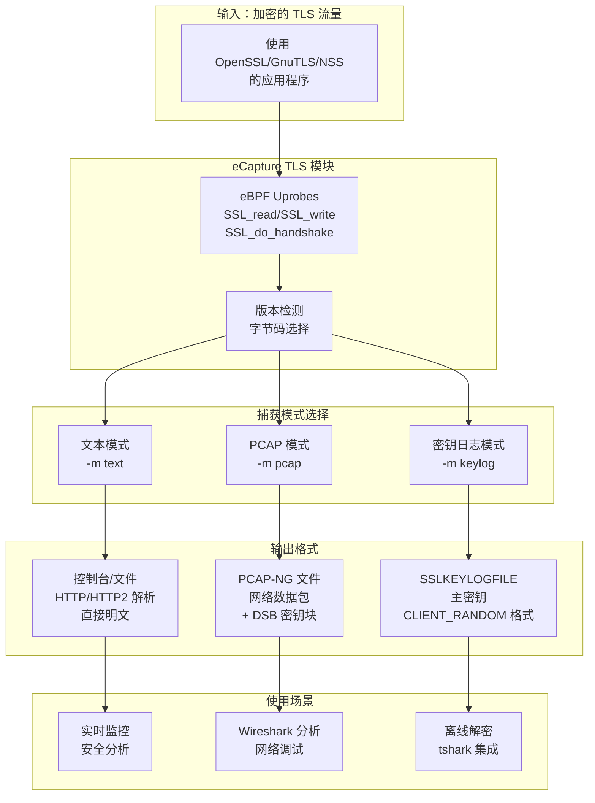
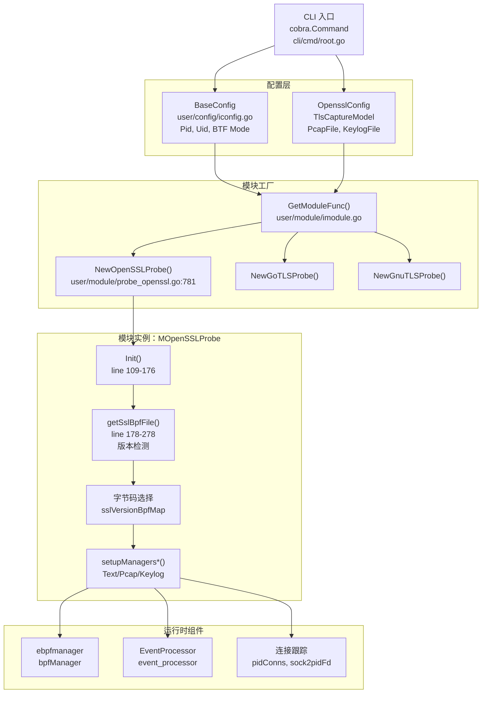
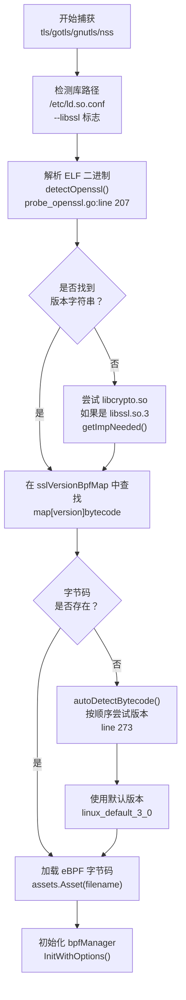

# TLS/SSL 模块

## 目的与范围

本文档概述了 eCapture 的 TLS/SSL 捕获模块，这些模块能够在无需 CA 证书或修改 SSL/TLS 库的情况下捕获加密网络流量的明文。TLS/SSL 模块集合支持多个加密库，包括 OpenSSL、BoringSSL、GnuTLS 和 NSS/NSPR，提供三种不同的捕获模式：文本输出、PCAP 数据包捕获和密钥日志生成。

有关特定模块的详细实现，请参阅：
- OpenSSL/BoringSSL 实现：[OpenSSL 模块](3.1.1-openssl-module.md)
- Go TLS 实现：[Go TLS 模块](3.1.2-go-tls-module.md)
- GnuTLS 和 NSS 实现：[GnuTLS 与 NSS 模块](3.1.3-gnutls-and-nss-modules.md)
- 主密钥提取机制：[主密钥提取](3.1.4-master-secret-extraction.md)

有关网络数据包捕获的详细信息，请参阅 [TC 网络数据包捕获](3.3-network-packet-capture-with-tc.md)。

---

## 支持的 TLS/SSL 库

eCapture 通过专用模块支持多种 TLS/SSL 库实现。每个模块使用 eBPF uprobe 拦截加密库函数并提取明文数据或主密钥。

| 模块名称 | 支持的库 | 版本覆盖范围 | 平台支持 |
|-------------|-------------------|------------------|------------------|
| `tls` | OpenSSL, LibreSSL, BoringSSL | OpenSSL 1.0.2 - 3.5.x<br/>BoringSSL Android 12-16 | Linux x86_64/aarch64<br/>Android |
| `gotls` | Go crypto/tls | Go 1.8+ (所有版本) | Linux x86_64/aarch64 |
| `gnutls` | GnuTLS | 3.x 系列 | Linux x86_64/aarch64 |
| `nss` | NSS/NSPR (Firefox, Chrome) | NSS 3.x 系列 | Linux x86_64/aarch64 |

**来源：** [README.md:38-42](https://github.com/gojue/ecapture/blob/0766a93b/README.md#L38-L42), [CHANGELOG.md:202-204](https://github.com/gojue/ecapture/blob/0766a93b/CHANGELOG.md#L202-L204), [cli/cmd/root.go:152-161](https://github.com/gojue/ecapture/blob/0766a93b/cli/cmd/root.go#L152-L161)

---

## 捕获模式

所有 TLS/SSL 模块都支持三种操作模式，用于确定捕获数据的处理和输出方式。通过 `-m` 命令行标志选择模式。

### 捕获模式对比



**来源：** [user/module/probe_openssl.go:58-76](https://github.com/gojue/ecapture/blob/0766a93b/user/module/probe_openssl.go#L58-L76), [user/config/iconfig.go:73-79](https://github.com/gojue/ecapture/blob/0766a93b/user/config/iconfig.go#L73-L79), [README.md:171-252](https://github.com/gojue/ecapture/blob/0766a93b/README.md#L171-L252)

### 模式配置类型

捕获模式由 `TlsCaptureModelType` 枚举表示：

```go
type TlsCaptureModelType uint8

const (
    TlsCaptureModelTypePcap   TlsCaptureModelType = iota  // PCAP-NG 格式
    TlsCaptureModelTypeText                                // 文本输出
    TlsCaptureModelTypeKeylog                             // 密钥日志格式
)
```

**模式选择逻辑：**

1. **文本模式**（`-m text` 或默认）：捕获明文数据并直接输出到控制台或文件。支持 HTTP/1.x 和 HTTP/2 协议解析以实现结构化输出。

2. **PCAP 模式**（`-m pcap` 或 `-m pcapng`）：以 PCAP-NG 格式捕获带有明文载荷和主密钥的网络数据包。需要 `-i`（网络接口）和 `--pcapfile` 参数。支持与 Wireshark 兼容的解密密钥块（DSB），可实现自动解密。

3. **密钥日志模式**（`-m keylog` 或 `-m key`）：仅捕获 TLS 主密钥，格式为与 Wireshark 和 tshark 兼容的 `SSLKEYLOGFILE`。需要 `--keylogfile` 参数（默认值：`ecapture_masterkey.log`）。

**来源：** [user/module/probe_openssl.go:128-154](https://github.com/gojue/ecapture/blob/0766a93b/user/module/probe_openssl.go#L128-L154), [README_CN.md:150-220](https://github.com/gojue/ecapture/blob/0766a93b/README_CN.md#L150-L220)

---

## 架构概览

### 模块初始化与配置流程



**来源：** [cli/cmd/root.go:249-403](https://github.com/gojue/ecapture/blob/0766a93b/cli/cmd/root.go#L249-L403), [user/module/probe_openssl.go:109-176](https://github.com/gojue/ecapture/blob/0766a93b/user/module/probe_openssl.go#L109-L176), [user/module/imodule.go:47-75](https://github.com/gojue/ecapture/blob/0766a93b/user/module/imodule.go#L47-L75)

### TLS 模块状态管理

`MOpenSSLProbe` 结构体维护 TLS 捕获操作的关键状态：

**关键数据结构：**

| 字段 | 类型 | 用途 |
|-------|------|---------|
| `pidConns` | `map[uint32]map[uint32]ConnInfo` | 通过 PID 和文件描述符跟踪连接 |
| `sock2pidFd` | `map[uint64][2]uint32` | 从套接字到 PID/FD 的反向查找，用于清理 |
| `masterKeys` | `map[string]bool` | 通过客户端随机数去重主密钥 |
| `eBPFProgramType` | `TlsCaptureModelType` | 活动捕获模式（Text/Pcap/Keylog） |
| `sslVersionBpfMap` | `map[string]string` | 将 SSL 版本映射到 eBPF 字节码文件 |
| `isBoringSSL` | `bool` | 指示是否检测到 BoringSSL 库 |

**连接跟踪操作：**

- `AddConn(pid, fd, tuple, sock)`：从 TC hook 或 connect 系统调用注册新连接
- `GetConn(pid, fd)`：检索用于数据事件关联的连接元组
- `DelConn(sock)`：在 3 秒延迟后安排连接清理
- `DestroyConn(sock)`：立即从跟踪映射中删除连接

**来源：** [user/module/probe_openssl.go:83-106](https://github.com/gojue/ecapture/blob/0766a93b/user/module/probe_openssl.go#L83-L106), [user/module/probe_openssl.go:398-481](https://github.com/gojue/ecapture/blob/0766a93b/user/module/probe_openssl.go#L398-L481)

---

## 版本检测与字节码选择

eCapture 自动检测 SSL/TLS 库版本并选择适当的 eBPF 字节码来处理特定于版本的结构布局。

### 版本检测流程



**来源：** [user/module/probe_openssl.go:178-278](https://github.com/gojue/ecapture/blob/0766a93b/user/module/probe_openssl.go#L178-L278), [user/module/probe_openssl.go:280-350](https://github.com/gojue/ecapture/blob/0766a93b/user/module/probe_openssl.go#L280-L350)

### 字节码命名约定

eBPF 字节码文件按照特定模式命名，该模式编码了版本、内核兼容性和 CO-RE 模式：

**模式：** `<library>_<version>_kern[_core|_noncore][_less52].o`

**示例：**
- `openssl_3_0_0_kern_core.o` - OpenSSL 3.0.x，CO-RE 模式，内核 ≥5.2
- `openssl_1_1_1_kern_noncore.o` - OpenSSL 1.1.x，非 CO-RE，内核 ≥5.2
- `boringssl_a_14_kern_core_less52.o` - BoringSSL Android 14，CO-RE，内核 <5.2

**版本映射初始化：**

`initOpensslOffset()` 方法填充 `sslVersionBpfMap`，包含如下映射：

```
"openssl 1.1.1a" -> "openssl_1_1_1_kern.o"
"openssl 3.0.0"  -> "openssl_3_0_0_kern.o"
"boringssl"      -> "boringssl_a_13_kern.o"
```

**来源：** [user/module/imodule.go:191-214](https://github.com/gojue/ecapture/blob/0766a93b/user/module/imodule.go#L191-L214), [CHANGELOG.md:14-24](https://github.com/gojue/ecapture/blob/0766a93b/CHANGELOG.md#L14-L24)

---

## 模块变体

### OpenSSL/BoringSSL 模块（`tls`）

**主要实现：** [user/module/probe_openssl.go](https://github.com/gojue/ecapture/blob/0766a93b/user/module/probe_openssl.go) 中的 `MOpenSSLProbe`

**支持的版本：**
- OpenSSL：1.0.2 到 3.5.x
- BoringSSL：Android 12 (A12) 到 Android 16 (A16)
- LibreSSL：兼容版本

**关键 Hook 点：**
- `SSL_read` / `SSL_write` - 数据捕获
- `SSL_do_handshake` - 主密钥提取（OpenSSL）
- `SSL_get_wbio` - Bio/FD 关联
- `SSL_in_before` / `SSL_state` - 握手状态（依赖版本）

**BoringSSL 特性：**
- 使用 `SSL_get_session` 进行主密钥提取
- 通过 `--androidver` 标志进行 Android 版本检测
- 针对 Android 12-16 变体的特殊偏移量处理

**来源：** [user/module/probe_openssl.go:83-106](https://github.com/gojue/ecapture/blob/0766a93b/user/module/probe_openssl.go#L83-L106), [CHANGELOG.md:305-309](https://github.com/gojue/ecapture/blob/0766a93b/CHANGELOG.md#L305-L309), [README.md:163-169](https://github.com/gojue/ecapture/blob/0766a93b/README.md#L163-L169)

### Go TLS 模块（`gotls`）

**主要实现：** `MGoTLSProbe`（在提供的文件中未包含）

**功能：**
- Go 二进制分析以获取 TLS 结构偏移量
- PIE（位置无关可执行文件）支持
- 寄存器与栈 ABI 检测
- 自动 `crypto/tls` 版本兼容性

**Hook 策略：**
- `crypto/tls.(*Conn).Read` / `Write` 用于数据
- `crypto/tls.(*Conn).handshakeContext` 用于密钥
- 从 Go 调试信息计算结构偏移量

**限制：**
- 需要调试符号或已知的 Go 版本
- 对于剥离的二进制文件可能需要 `--elfpath` 参数

**来源：** [README.md:254-276](https://github.com/gojue/ecapture/blob/0766a93b/README.md#L254-L276), [cli/cmd/root.go:156](https://github.com/gojue/ecapture/blob/0766a93b/cli/cmd/root.go#L156)

### GnuTLS 模块（`gnutls`）

**支持状态：** 自 v1.3.0 起完全支持捕获，包括密钥日志模式

**Hook 函数：**
- `gnutls_record_send` / `gnutls_record_recv` - 数据捕获
- `gnutls_handshake` - 主密钥提取
- TLS 1.3 的早期密钥支持

**输出模式：** 文本、PCAP、密钥日志（v1.3.0 中添加）

**来源：** [README.md:155](https://github.com/gojue/ecapture/blob/0766a93b/README.md#L155), [CHANGELOG.md:126-127](https://github.com/gojue/ecapture/blob/0766a93b/CHANGELOG.md#L126-L127)

### NSS/NSPR 模块（`nss`）

**目标应用程序：**
- Firefox 浏览器
- Chrome/Chromium（使用 NSS 构建时）
- 使用 NSS 加密库的应用程序

**Hook 函数：**
- `PR_Read` / `PR_Write`（NSPR 层）
- `SSL_ImportFD` - 会话初始化
- NSS 特定的握手函数

**注意事项：**
- 可能需要特殊处理 `libnss3.so` 路径检测
- 在某些平台上，Chrome 可能使用 BoringSSL 而非 NSS

**来源：** [README.md:158](https://github.com/gojue/ecapture/blob/0766a93b/README.md#L158), [CHANGELOG.md:402](https://github.com/gojue/ecapture/blob/0766a93b/CHANGELOG.md#L402)

---

## 关键功能

### 1. 主密钥提取

所有 TLS/SSL 模块都为 TLS 1.2 和 TLS 1.3 协议提取主密钥：

**TLS 1.2：**
- 客户端随机数（32 字节）
- 主密钥（48 字节）
- 输出格式：`CLIENT_RANDOM <random> <master_key>`

**TLS 1.3：**
- 客户端随机数（32 字节）
- 握手密钥
- 客户端/服务器握手流量密钥
- 客户端/服务器应用流量密钥
- 导出器密钥
- 使用 SHA256/SHA384 的 HKDF 派生

**密钥存储：**
- 通过以客户端随机数为键的 `masterKeys` 映射进行去重
- 格式与 `SSLKEYLOGFILE` 环境变量兼容
- 可与 Wireshark 的"Pre-Master-Secret log filename"设置一起使用

**来源：** [user/module/probe_openssl.go:482-642](https://github.com/gojue/ecapture/blob/0766a93b/user/module/probe_openssl.go#L482-L642), [README.md:234-247](https://github.com/gojue/ecapture/blob/0766a93b/README.md#L234-L247)

### 2. 协议解析

**文本模式 HTTP 支持：**

模块包含内置的 HTTP/1.x 和 HTTP/2 协议解析器：

- HTTP/1.x：请求/响应解析，包括头部和正文
- HTTP/2：帧解析，包括 HEADERS、DATA、SETTINGS、PING
- HTTP/2 的 HPACK 头部解压缩
- 自动内容类型检测和显示

**来源：** [CHANGELOG.md:487](https://github.com/gojue/ecapture/blob/0766a93b/CHANGELOG.md#L487), [cli/cmd/root.go:152](https://github.com/gojue/ecapture/blob/0766a93b/cli/cmd/root.go#L152)

### 3. 多架构支持

**支持的平台：**
- Linux x86_64：内核 4.18+
- Linux aarch64：内核 5.5+
- Android x86_64：Android 12+
- Android aarch64：Android 12+

**交叉编译：**
- 单个二进制文件中的双模式字节码（CO-RE 和非 CO-RE）
- 自动 BTF 检测和模式选择
- 内核版本特定的字节码变体（<5.2）

**来源：** [README.md:14-16](https://github.com/gojue/ecapture/blob/0766a93b/README.md#L14-L16), [CHANGELOG.md:553-561](https://github.com/gojue/ecapture/blob/0766a93b/CHANGELOG.md#L553-L561)

### 4. 过滤与定向

**进程过滤：**
- `--pid` 标志：针对特定进程 ID
- `--uid` 标志：针对特定用户 ID
- 默认：捕获所有进程/用户

**网络过滤（PCAP 模式）：**
- PCAP 过滤表达式支持（tcpdump 语法）
- 示例：`tcp port 443`
- 通过 TC eBPF 程序指令修补应用

**来源：** [user/module/probe_openssl.go:361-387](https://github.com/gojue/ecapture/blob/0766a93b/user/module/probe_openssl.go#L361-L387), [README.md:183-184](https://github.com/gojue/ecapture/blob/0766a93b/README.md#L183-L184)

### 5. 连接生命周期跟踪

**4 元组生成：**

模块使用 4 元组信息跟踪网络连接：
- 源 IP:端口
- 目标 IP:端口
- IPv4 和 IPv6 支持

**跟踪机制：**
1. TC hook 捕获数据包并生成 4 元组
2. 对 `tcp_sendmsg` / `__sys_connect` 的 Kprobe 将套接字与 PID/FD 关联
3. SSL 数据事件通过 `pidConns` 映射与元组关联
4. 在套接字销毁或进程退出时清理连接

**延迟清理：**
- 通过 `time.AfterFunc()` 延迟 3 秒以处理竞态条件
- 防止在事件传输中过早删除
- 与 EventProcessor 合并间隔协调

**来源：** [user/module/probe_openssl.go:398-462](https://github.com/gojue/ecapture/blob/0766a93b/user/module/probe_openssl.go#L398-L462), [CHANGELOG.md:306-309](https://github.com/gojue/ecapture/blob/0766a93b/CHANGELOG.md#L306-L309)

---

## 配置参数

### 通用 TLS 模块标志

| 标志 | 类型 | 默认值 | 描述 |
|------|------|---------|-------------|
| `-m, --model` | string | `text` | 捕获模式：text/pcap/pcapng/keylog/key |
| `--libssl` | string | 自动检测 | SSL 库路径或静态链接的二进制文件 |
| `--pcapfile` | string | `ecapture_openssl.pcapng` | PCAP 输出文件（pcap 模式） |
| `--keylogfile` | string | `ecapture_masterkey.log` | 密钥日志输出文件（keylog 模式） |
| `-i, --ifname` | string | - | 网络接口（pcap 模式，必需） |
| `--pid` | uint64 | 0 | 目标进程 ID（0 = 全部） |
| `--uid` | uint64 | 0 | 目标用户 ID（0 = 全部） |
| `-b, --btf` | uint8 | 0 | BTF 模式：0=自动，1=core，2=non-core |

### Android 特定标志

| 标志 | 类型 | 描述 |
|------|------|-------------|
| `--android` | bool | 启用 Android/BoringSSL 模式 |
| `--androidver` | string | Android 版本（12-16）用于字节码选择 |

**来源：** [user/config/iconfig.go:73-93](https://github.com/gojue/ecapture/blob/0766a93b/user/config/iconfig.go#L73-L93), [cli/cmd/root.go:140-152](https://github.com/gojue/ecapture/blob/0766a93b/cli/cmd/root.go#L140-L152)

---

## 输出示例

### 文本模式输出

```
UUID:233479_233479_curl_5_1_39.156.66.10:443, Name:HTTPRequest, Type:1, Length:73
GET / HTTP/1.1
Host: baidu.com
Accept: */*
User-Agent: curl/7.81.0
```

**UUID 格式：** `<pid>_<tid>_<comm>_<fd>_<direction>_<tuple>`

**来源：** [README_CN.md:103-125](https://github.com/gojue/ecapture/blob/0766a93b/README_CN.md#L103-L125)

### PCAP 模式输出

- 文件格式：PCAP-NG
- 包含：带有明文载荷的网络数据包
- 解密密钥块（DSB）：嵌入的主密钥
- 兼容：Wireshark、tshark、tcpdump

**来源：** [README.md:187-232](https://github.com/gojue/ecapture/blob/0766a93b/README.md#L187-L232)

### 密钥日志模式输出

```
CLIENT_RANDOM 5a6f2b3c... 1d8e9f0a...
CLIENT_HANDSHAKE_TRAFFIC_SECRET 5a6f2b3c... 8c7d6e5f...
SERVER_HANDSHAKE_TRAFFIC_SECRET 5a6f2b3c... 3b2a1c0d...
CLIENT_TRAFFIC_SECRET_0 5a6f2b3c... f9e8d7c6...
SERVER_TRAFFIC_SECRET_0 5a6f2b3c... b5a49382...
EXPORTER_SECRET 5a6f2b3c... 71625348...
```

**与 tshark 一起使用：**
```bash
tshark -o tls.keylog_file:ecapture_masterkey.log -Y http -T fields -e http.file_data -f "port 443" -i eth0
```

**来源：** [README.md:239-247](https://github.com/gojue/ecapture/blob/0766a93b/README.md#L239-L247), [user/module/probe_openssl.go:492-554](https://github.com/gojue/ecapture/blob/0766a93b/user/module/probe_openssl.go#L492-L554)