# OpenSSL 模块

OpenSSL 模块从使用 OpenSSL 或 BoringSSL 库的应用程序中捕获 SSL/TLS 明文流量和主密钥。它支持多种捕获模式（文本、pcap、keylog），并处理 TLS 1.2 和 TLS 1.3 协议，覆盖广泛的库版本范围。

有关其他 TLS/SSL 模块的信息，请参见 Go TLS 模块 [3.1.2](3.1.2-go-tls-module.md) 和 GnuTLS/NSS 模块 [3.1.3](3.1.3-gnutls-and-nss-modules.md)。有关主密钥提取技术的详细信息，请参见 [3.1.4](3.1.4-master-secret-extraction.md)。

---

## 架构概述

OpenSSL 模块由三个主要子系统组成：版本检测和字节码选择、用于数据捕获的 eBPF 探针，以及用于输出生成的用户空间处理。

### 核心组件

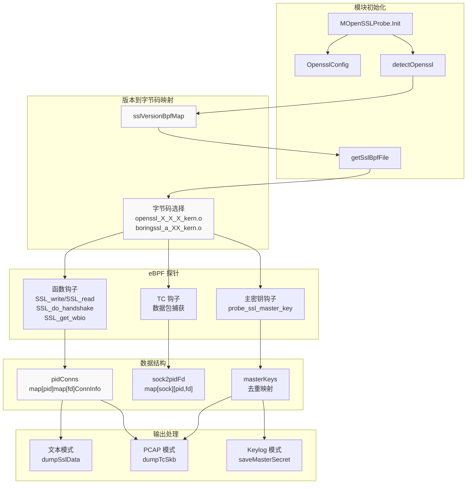

**MOpenSSLProbe 结构**: 主模块结构体 `MOpenSSLProbe` 嵌入了 `MTCProbe`（用于基于 TC 的数据包捕获），并维护几个关键的数据结构用于连接跟踪和密钥管理。

来源：[user/module/probe_openssl.go:83-106](https://github.com/gojue/ecapture/blob/0766a93b/user/module/probe_openssl.go#L83-L106)

---

## 支持的库版本

该模块通过版本特定的字节码变体支持广泛的 OpenSSL 和 BoringSSL 版本。

### 版本支持矩阵

| 库 | 版本范围 | 字节码文件 | 备注 |
|---------|--------------|----------------|-------|
| OpenSSL | 1.0.2a-1.0.2u | `openssl_1_0_2a_kern.o` | 需要 `SSL_state` 钩子 |
| OpenSSL | 1.1.0a-1.1.0l | `openssl_1_1_0a_kern.o` | 标准钩子 |
| OpenSSL | 1.1.1a-1.1.1w | `openssl_1_1_1{a,b,d,j}_kern.o` | 四个偏移量组 |
| OpenSSL | 3.0.0-3.0.17 | `openssl_3_0_{0,12}_kern.o` | 3.0.12 有独特的偏移量 |
| OpenSSL | 3.1.0-3.1.8 | `openssl_3_1_0_kern.o` | 与 3.0 共享偏移量 |
| OpenSSL | 3.2.0-3.2.5 | `openssl_3_2_{0,3,4}_kern.o` | 三个偏移量变体 |
| OpenSSL | 3.3.0-3.3.4 | `openssl_3_3_{0,2,3}_kern.o` | 三个偏移量变体 |
| OpenSSL | 3.4.0-3.4.2 | `openssl_3_4_{0,1}_kern.o` | 两个偏移量变体 |
| OpenSSL | 3.5.0-3.5.4 | `openssl_3_5_0_kern.o` | 最新支持版本 |
| BoringSSL | Android 12-16 | `boringssl_a_{13,14,15,16}_kern.o` | Android 特定 |
| BoringSSL | 非 Android | `boringssl_na_kern.o` | 通用 BoringSSL |

版本映射在 `initOpensslOffset()` 中初始化，该函数用版本到字节码的映射填充 `sslVersionBpfMap`。

来源：[user/module/probe_openssl_lib.go:73-187](https://github.com/gojue/ecapture/blob/0766a93b/user/module/probe_openssl_lib.go#L73-L187), [variables.mk:190-213](https://github.com/gojue/ecapture/blob/0766a93b/variables.mk#L190-L213)

---

## 版本检测机制

版本检测是一个关键阶段，它决定了加载哪个 eBPF 字节码以正确处理结构体偏移量。

### 检测流程

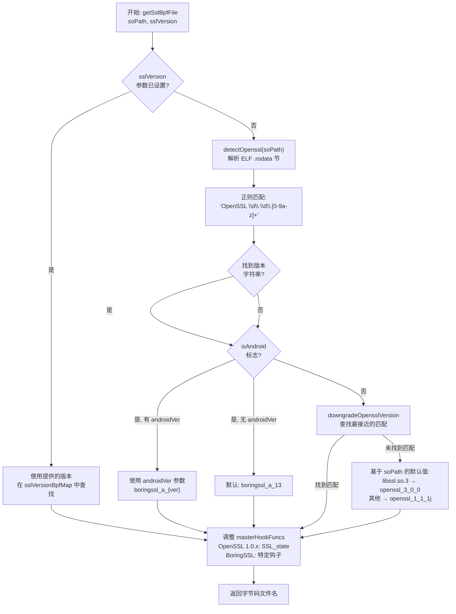

**ELF 解析**: `detectOpenssl()` 函数将共享库作为 ELF 文件打开，并在 `.rodata` 节中使用正则表达式模式 `(OpenSSL\s\d\.\d\.[0-9a-z]+)` 搜索 OpenSSL 版本字符串。

**回退策略**: 当版本检测失败时，模块依次尝试：
1. 如果 `libssl.so.3` 不包含版本信息，检查 `libcrypto.so.3`
2. 如果设置了 `isAndroid` 标志，使用 Android 特定的字节码
3. 应用 `downgradeOpensslVersion()` 查找最接近的匹配版本
4. 根据库路径回退到默认字节码

**特殊情况**:
- OpenSSL 1.0.x 需要使用 `SSL_state` 钩子而不是 `SSL_in_before`（一个宏）
- OpenSSL 3.0.12 的偏移量与 3.0.0-3.0.11 和 3.0.13-3.0.17 不同
- BoringSSL 版本通常是 "1.1.1"，但需要 Android 版本特定的字节码

来源：[user/module/probe_openssl.go:179-278](https://github.com/gojue/ecapture/blob/0766a93b/user/module/probe_openssl.go#L179-L278), [user/module/probe_openssl_lib.go:189-282](https://github.com/gojue/ecapture/blob/0766a93b/user/module/probe_openssl_lib.go#L189-L282), [user/module/probe_openssl_lib.go:284-369](https://github.com/gojue/ecapture/blob/0766a93b/user/module/probe_openssl_lib.go#L284-L369)

---

## 钩子点和 eBPF 探针

该模块将 uprobes 附加到战略性的 SSL/TLS 库函数上，以拦截明文数据和主密钥。

### 主要钩子函数

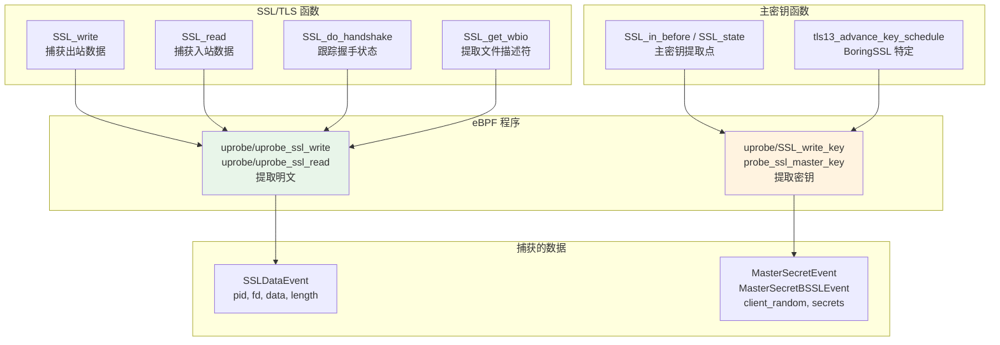

**数据捕获钩子**: `SSL_write` 和 `SSL_read` 上的探针在加密前和解密后捕获明文数据。`SSL_get_wbio` 钩子提取底层套接字文件描述符用于连接跟踪。

**主密钥钩子**: 主密钥提取的钩子点因库而异：
- **OpenSSL 1.1.0+**: `SSL_in_before` 函数
- **OpenSSL 1.0.x**: `SSL_state` 函数（因为 `SSL_in_before` 是一个宏）
- **BoringSSL**: `tls13_advance_key_schedule` 函数

主密钥钩子函数列表在 `masterHookFuncs` 数组中配置，并在初始化期间根据检测到的版本进行调整。

来源：[user/module/probe_openssl.go:104](https://github.com/gojue/ecapture/blob/0766a93b/user/module/probe_openssl.go#L104), [user/module/probe_openssl.go:179-196](https://github.com/gojue/ecapture/blob/0766a93b/user/module/probe_openssl.go#L179-L196), [kern/openssl_masterkey.h:80-257](https://github.com/gojue/ecapture/blob/0766a93b/kern/openssl_masterkey.h#L80-L257), [kern/boringssl_masterkey.h:169-403](https://github.com/gojue/ecapture/blob/0766a93b/kern/boringssl_masterkey.h#L169-L403)

---

## 连接跟踪系统

该模块维护进程、文件描述符和网络套接字之间的双向映射，以将捕获的数据与连接关联起来。

### 连接跟踪数据结构

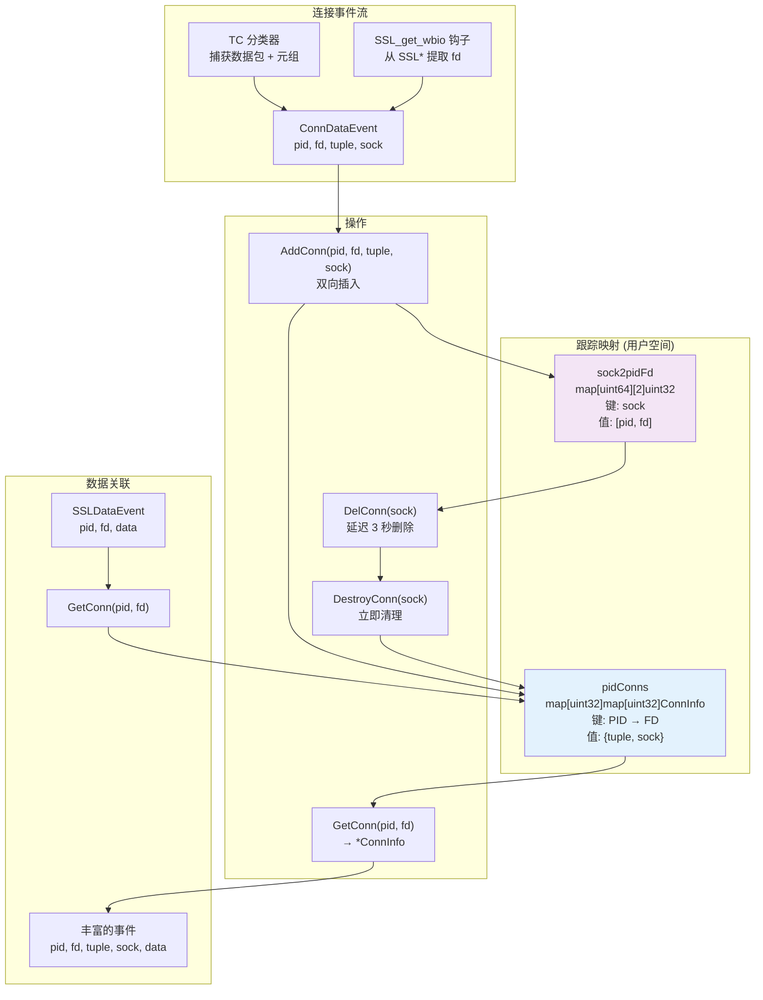

**ConnInfo 结构**: 每个连接由一个 `ConnInfo` 结构体表示，包含网络 4 元组（源/目标 IP:端口）和套接字指针。

**双向查找**: 
- `pidConns`: 映射 `(pid, fd)` → `ConnInfo`，用于丰富 SSL 数据事件
- `sock2pidFd`: 映射 `sock` → `(pid, fd)`，用于套接字关闭时的连接清理

**生命周期管理**:
- **AddConn**: 当 TC 钩子或 SSL_get_wbio 捕获连接元数据时调用
- **GetConn**: 在处理 SSL 数据时检索给定 `(pid, fd)` 对的元组
- **DelConn**: 安排延迟删除（3 秒），以允许事件处理完成
- **DestroyConn**: 执行实际清理，通知事件处理器

`DelConn` 中的 3 秒延迟确保任何正在处理的事件在连接元数据被删除之前仍然可以被关联。

来源：[user/module/probe_openssl.go:78-81](https://github.com/gojue/ecapture/blob/0766a93b/user/module/probe_openssl.go#L78-L81), [user/module/probe_openssl.go:91-94](https://github.com/gojue/ecapture/blob/0766a93b/user/module/probe_openssl.go#L91-L94), [user/module/probe_openssl.go:398-481](https://github.com/gojue/ecapture/blob/0766a93b/user/module/probe_openssl.go#L398-L481), [user/module/probe_openssl.go:756-775](https://github.com/gojue/ecapture/blob/0766a93b/user/module/probe_openssl.go#L756-L775)

---

## 主密钥提取

主密钥使捕获的 TLS 流量能够被解密。TLS 1.2 和 TLS 1.3 之间的提取技术不同，因为密钥派生机制不同。

### TLS 1.2 主密钥提取

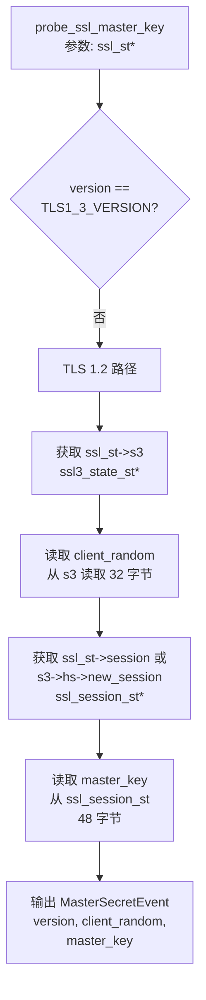

**TLS 1.2 结构导航** (OpenSSL):
1. `ssl_st->s3` → `ssl3_state_st*`
2. `ssl3_state_st->client_random`（32 字节）
3. `ssl_st->session` → `ssl_session_st*`
4. `ssl_session_st->master_key`（48 字节）

**TLS 1.2 结构导航** (BoringSSL):
1. `ssl_st->s3` → `bssl::SSL3_STATE*`
2. `ssl3_state->client_random`（32 字节）
3. `ssl3_state->hs` → `bssl::SSL_HANDSHAKE*`
4. `ssl_handshake->new_session` 或 `ssl_st->session` → `ssl_session_st*`
5. `ssl_session_st->secret` 和 `ssl_session_st->secret_length`

握手状态被检查以确保握手已完成（BoringSSL 的 `state >= CLIENT_STATE12_SEND_CLIENT_FINISHED`）。

来源：[kern/openssl_masterkey.h:82-169](https://github.com/gojue/ecapture/blob/0766a93b/kern/openssl_masterkey.h#L82-L169), [kern/boringssl_masterkey.h:170-342](https://github.com/gojue/ecapture/blob/0766a93b/kern/boringssl_masterkey.h#L170-L342), [kern/openssl_masterkey_3.0.h:82-165](https://github.com/gojue/ecapture/blob/0766a93b/kern/openssl_masterkey_3.0.h#L82-L165)

### TLS 1.3 主密钥提取

TLS 1.3 使用多个派生密钥而不是单个主密钥。提取更加复杂：

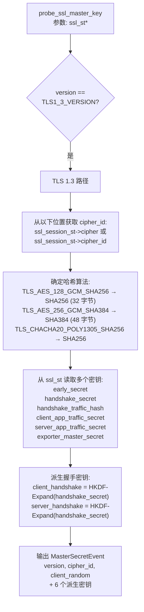

**TLS 1.3 结构导航** (OpenSSL):
1. `ssl_st->s3->client_random`（32 字节）- OpenSSL 3.0+ 中 client_random 直接在 ssl_st 中
2. `ssl_st->session->cipher->id` → 密码套件 ID
3. 从 `ssl_st` 读取多个密钥（每个最多 64 字节）：
   - `early_secret`（偏移量 `SSL_ST_EARLY_SECRET`）
   - `handshake_secret`（偏移量 `SSL_ST_HANDSHAKE_SECRET`）
   - `handshake_traffic_hash`（偏移量 `SSL_ST_HANDSHAKE_TRAFFIC_HASH`）
   - `client_app_traffic_secret`（偏移量 `SSL_ST_CLIENT_APP_TRAFFIC_SECRET`）
   - `server_app_traffic_secret`（偏移量 `SSL_ST_SERVER_APP_TRAFFIC_SECRET`）
   - `exporter_master_secret`（偏移量 `SSL_ST_EXPORTER_MASTER_SECRET`）

**TLS 1.3 结构导航** (BoringSSL):
1. 从 `bssl::SSL3_STATE` 获取 `ssl_st->s3->client_random`
2. `ssl_st->s3->hs->hash_len` 用于密钥长度
3. `ssl_st->s3->hs->client_version` 用于验证 TLS 1.3
4. 检查握手状态：`tls13_state >= CLIENT_STATE13_READ_SERVER_FINISHED`
5. 从 `ssl_handshake` 读取私有成员密钥（计算的偏移量）：
   - `early_traffic_secret_`（偏移量 `SSL_HANDSHAKE_EARLY_TRAFFIC_SECRET_`）
   - `client_handshake_secret_`（偏移量 `SSL_HANDSHAKE_CLIENT_HANDSHAKE_SECRET_`）
   - `server_handshake_secret_`（偏移量 `SSL_HANDSHAKE_SERVER_HANDSHAKE_SECRET_`）
   - `client_traffic_secret_0_`（偏移量 `SSL_HANDSHAKE_CLIENT_TRAFFIC_SECRET_0_`）
   - `server_traffic_secret_0_`（偏移量 `SSL_HANDSHAKE_SERVER_TRAFFIC_SECRET_0_`）
6. 从 `ssl_st->s3` 读取：
   - `exporter_secret`（偏移量 `BSSL__SSL3_STATE_EXPORTER_SECRET`）

**HKDF 派生**: 对于 OpenSSL TLS 1.3，握手流量密钥必须在用户空间使用 HKDF-Expand-Label 派生，因为 OpenSSL 只存储基本的 `handshake_secret`。派生使用标签 "c hs traffic" 和 "s hs traffic" 以及握手摘要哈希。

**BoringSSL 私有成员**: BoringSSL 将 TLS 1.3 密钥存储为 `SSL_HANDSHAKE` 结构体中的私有成员。偏移量通过在 `hash_len_` 字段之后为每个密钥添加 `SSL_MAX_MD_SIZE`（48 字节）来计算。参见 `SSL_HANDSHAKE_SECRET_` 到 `SSL_HANDSHAKE_EXPECTED_CLIENT_FINISHED_` 常量定义。

来源：[kern/openssl_masterkey.h:171-257](https://github.com/gojue/ecapture/blob/0766a93b/kern/openssl_masterkey.h#L171-L257), [kern/boringssl_masterkey.h:343-403](https://github.com/gojue/ecapture/blob/0766a93b/kern/boringssl_masterkey.h#L343-L403), [kern/openssl_masterkey_3.0.h:167-253](https://github.com/gojue/ecapture/blob/0766a93b/kern/openssl_masterkey_3.0.h#L167-L253), [kern/boringssl_const.h:1-63](https://github.com/gojue/ecapture/blob/0766a93b/kern/boringssl_const.h#L1-L63), [user/module/probe_openssl.go:518-551](https://github.com/gojue/ecapture/blob/0766a93b/user/module/probe_openssl.go#L518-L551)

### Keylog 格式生成

捕获的主密钥按照 NSS Key Log 格式（SSLKEYLOGFILE）格式化：

**TLS 1.2 格式**:
```
CLIENT_RANDOM <client_random_hex> <master_key_hex>
```

**TLS 1.3 格式**:
```
CLIENT_HANDSHAKE_TRAFFIC_SECRET <client_random_hex> <secret_hex>
SERVER_HANDSHAKE_TRAFFIC_SECRET <client_random_hex> <secret_hex>
CLIENT_TRAFFIC_SECRET_0 <client_random_hex> <secret_hex>
SERVER_TRAFFIC_SECRET_0 <client_random_hex> <secret_hex>
EXPORTER_SECRET <client_random_hex> <secret_hex>
```

`client_random`（32 字节）作为去重的键——每个唯一的 client random 只写入 keylog 文件一次。`masterKeys` 映射跟踪哪些 client randoms 已被处理。

来源：[user/module/probe_openssl.go:482-642](https://github.com/gojue/ecapture/blob/0766a93b/user/module/probe_openssl.go#L482-L642), [user/module/probe_openssl.go:98](https://github.com/gojue/ecapture/blob/0766a93b/user/module/probe_openssl.go#L98)

---

## 捕获模式

该模块支持三种不同的捕获模式，通过 `OpensslConfig.Model` 字段配置。

### 捕获模式比较

| 模式 | 输出格式 | 使用场景 | 捕获的数据 |
|------|--------------|----------|---------------|
| Text | 人类可读的文本 | 实时监控 | 明文 SSL 数据 + HTTP/HTTP2 解析 |
| PCAP | PCAP-NG 文件 | 网络分析 | 原始数据包 + 带主密钥的 DSB |
| Keylog | SSLKEYLOGFILE | 流量解密 | 仅主密钥 |

### 文本模式

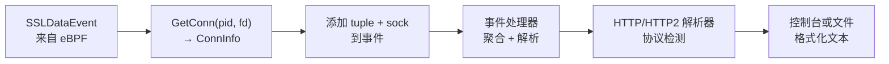

**文本模式流程**:
1. uprobe 捕获的 `SSLDataEvent` 包含 `pid`、`fd`、`data`、`data_len`
2. `dumpSslData()` 调用 `GetConn(pid, fd)` 检索连接元组
3. 使用元组和套接字指针丰富事件
4. 发送到事件处理器，该处理器聚合片段并检测 HTTP/HTTP2
5. 解析的事件作为格式化文本输出

文本模式是默认模式，提供对解密流量的即时可见性和自动协议解析。

来源：[user/module/probe_openssl.go:756-775](https://github.com/gojue/ecapture/blob/0766a93b/user/module/probe_openssl.go#L756-L775), [user/module/probe_openssl.go:152-153](https://github.com/gojue/ecapture/blob/0766a93b/user/module/probe_openssl.go#L152-L153)

### PCAP 模式

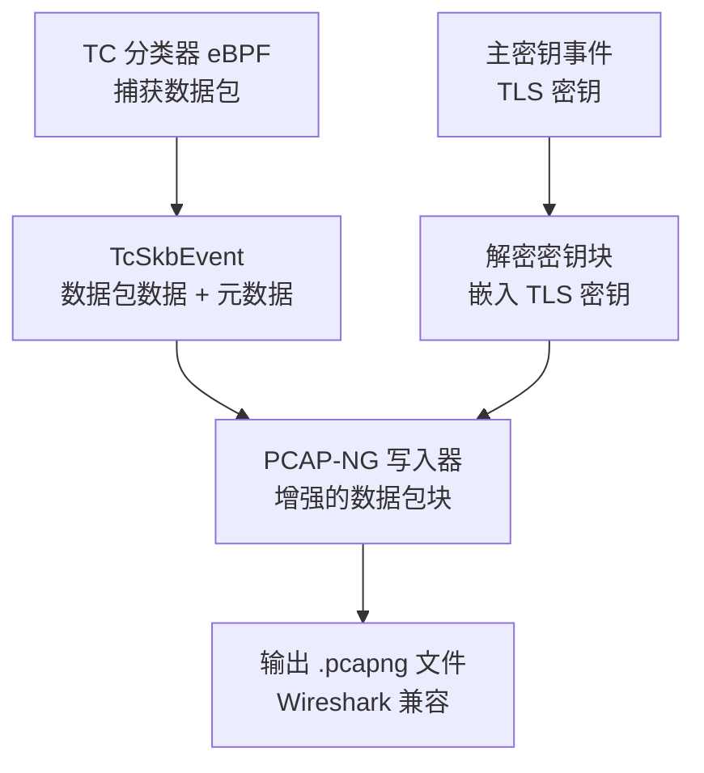

**PCAP 模式特性**:
- **数据包捕获**: TC eBPF 分类器捕获原始网络数据包（入站/出站）
- **解密密钥块（DSB）**: 主密钥使用 DSB 格式嵌入到 PCAP-NG 文件中
- **4 元组过滤**: 可以通过 BPF 指令按源/目标 IP/端口过滤数据包
- **Wireshark 集成**: 生成的文件可以直接在 Wireshark 中打开进行解密

`setupManagersPcap()` 函数在网络接口上配置 TC 钩子，而 `savePcapngSslKeyLog()` 将主密钥作为 DSB 记录写入。

PCAP 模式非常适合离线分析和与标准网络分析工具共享捕获。

来源：[user/module/probe_openssl.go:138-148](https://github.com/gojue/ecapture/blob/0766a93b/user/module/probe_openssl.go#L138-L148), [user/module/probe_openssl.go:288-289](https://github.com/gojue/ecapture/blob/0766a93b/user/module/probe_openssl.go#L288-L289)

### Keylog 模式

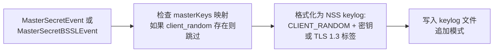

**Keylog 模式特性**:
- **输出**: 与浏览器和工具兼容的标准 SSLKEYLOGFILE 格式
- **去重**: 使用 `client_random` 作为键来防止重复条目
- **TLS 版本支持**: 处理 TLS 1.2（单个主密钥）和 TLS 1.3（多个派生密钥）
- **文件管理**: 以追加模式打开 keylog 文件，权限为 0600

keylog 文件可用于：
- Wireshark（编辑 → 首选项 → 协议 → TLS → Pre-Master-Secret 日志文件名）
- 浏览器，用于调试加密流量
- 其他支持 NSS Key Log 格式的工具

当只需要主密钥进行解密时，Keylog 模式是最轻量的选项。

来源：[user/module/probe_openssl.go:129-136](https://github.com/gojue/ecapture/blob/0766a93b/user/module/probe_openssl.go#L129-L136), [user/module/probe_openssl.go:482-642](https://github.com/gojue/ecapture/blob/0766a93b/user/module/probe_openssl.go#L482-L642), [user/module/probe_openssl.go:288](https://github.com/gojue/ecapture/blob/0766a93b/user/module/probe_openssl.go#L288)

---

## 初始化和生命周期

该模块遵循标准的 IModule 生命周期，并为 SSL/TLS 拦截进行专门设置。

### 模块生命周期

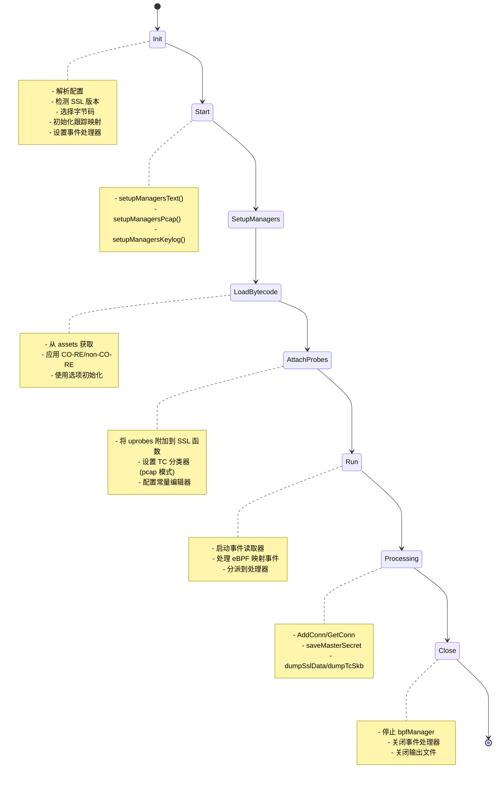

**初始化步骤**（`Init`）:
1. 调用基础 `Module.Init()` 进行通用设置
2. 初始化连接跟踪映射（`pidConns`、`sock2pidFd`、`masterKeys`）
3. 从配置确定捕获模式
4. 打开输出文件（keylog 或 PCAP）
5. 调用 `initOpensslOffset()` 填充版本到字节码映射
6. 调用 `getSslBpfFile()` 检测版本并选择字节码
7. 根据检测到的库设置 `masterHookFuncs`（OpenSSL 与 BoringSSL）

**启动阶段**:
- 根据 `eBPFProgramType` 调用适当的设置函数
- 使用探针和映射配置 `ebpfmanager`
- 应用常量编辑器进行 PID/UID 过滤
- 从嵌入的 assets 加载字节码
- 初始化 eBPF 映射的解码函数

**运行时处理**:
- 事件读取器持续轮询 eBPF 映射（perf 数组或 ring 缓冲区）
- 事件通过 `Dispatcher()` 分派到适当的处理器
- 通过 `AddConn`、`GetConn`、`DelConn` 操作管理连接生命周期

**清理**（`Close`）:
- 使用 `CleanAll` 标志停止 `bpfManager`
- 关闭事件处理器
- 关闭 keylog 文件（如果打开）
- 调用基础 `Module.Close()`

来源：[user/module/probe_openssl.go:109-176](https://github.com/gojue/ecapture/blob/0766a93b/user/module/probe_openssl.go#L109-L176), [user/module/probe_openssl.go:280-350](https://github.com/gojue/ecapture/blob/0766a93b/user/module/probe_openssl.go#L280-L350), [user/module/probe_openssl.go:352-358](https://github.com/gojue/ecapture/blob/0766a93b/user/module/probe_openssl.go#L352-L358), [user/module/probe_openssl.go:733-754](https://github.com/gojue/ecapture/blob/0766a93b/user/module/probe_openssl.go#L733-L754)

---

## 配置

OpenSSL 模块通过 `OpensslConfig` 结构体进行配置。

### 配置参数

| 参数 | 类型 | 用途 | 默认值 |
|-----------|------|---------|---------|
| `Pid` | uint64 | 目标进程 ID（0 = 全部） | 0 |
| `Uid` | uint64 | 目标用户 ID（0 = 全部） | 0 |
| `Model` | string | 捕获模式：text/pcap/keylog | text |
| `KeylogFile` | string | keylog 输出文件路径 | - |
| `PcapFile` | string | PCAP 输出文件路径 | - |
| `PcapFilter` | string | 数据包捕获的 BPF 过滤器 | "" |
| `SslVersion` | string | 手动版本覆盖 | "" |
| `IsAndroid` | bool | Android 环境标志 | false |
| `AndroidVer` | string | Android API 级别（13-16） | "" |
| `CGroupPath` | string | 用于过滤的 cgroup 路径 | "" |
| `BtfMode` | uint8 | BTF 模式：0=自动，1=core，2=non-core | 0 |

**手动版本覆盖**: 设置 `SslVersion` 会绕过自动检测。在版本检测可能不可靠的 Android 上很有用。示例：
- `--ssl_version='boringssl_a_13'` 用于 Android 12
- `--ssl_version='openssl 3.0.0'` 用于特定的 OpenSSL 版本

**PCAP 过滤器**: 使用 PCAP 模式时，`PcapFilter` 对捕获的数据包应用 BPF 过滤。过滤器被编译成应用于 TC 分类器的 eBPF 指令补丁。

来源：[user/config/iconfig.go:73-79](https://github.com/gojue/ecapture/blob/0766a93b/user/config/iconfig.go#L73-L79), [cli/cmd/root.go:157-175](https://github.com/gojue/ecapture/blob/0766a93b/cli/cmd/root.go#L157-L175)

---

## 与事件处理的集成

OpenSSL 模块将事件分派到中央事件处理系统进行聚合、解析和输出。

### 事件类型和处理器

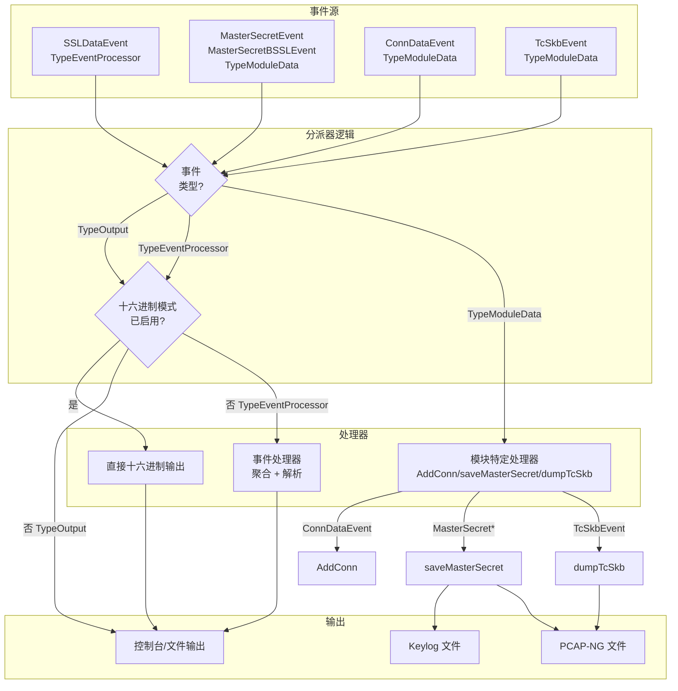

**事件类型路由**:
- `TypeEventProcessor`: SSL 数据事件发送到事件处理器进行聚合和 HTTP 解析
- `TypeModuleData`: 模块内部事件（连接、主密钥、数据包）由模块处理
- `TypeOutput`: 预格式化的输出事件直接发送到输出写入器

**模块特定处理器**:
- `ConnDataEvent`: 根据 `IsDestroy` 标志调用 `AddConn()` 或 `DelConn()`
- `MasterSecretEvent`/`MasterSecretBSSLEvent`: 调用 `saveMasterSecret()` 或 `saveMasterSecretBSSL()`
- `TcSkbEvent`: 调用 `dumpTcSkb()` 将数据包写入 PCAP-NG
- `SSLDataEvent`: 调用 `dumpSslData()` 丰富并转发到处理器

`Dispatcher()` 方法实现此路由逻辑，检查 `isClosed` 标志以防止在关闭后处理事件。

来源：[user/module/probe_openssl.go:733-754](https://github.com/gojue/ecapture/blob/0766a93b/user/module/probe_openssl.go#L733-L754), [user/module/imodule.go:408-448](https://github.com/gojue/ecapture/blob/0766a93b/user/module/imodule.go#L408-L448)

---

## 结构体偏移量计算

捕获主密钥需要从内部 SSL/TLS 库结构体中读取。由于这些结构体因版本而异，精确的偏移量计算至关重要。

### 偏移量计算方法

**1. 自动偏移量生成**（BoringSSL）:

`boringssl-offset.c` 实用程序使用 C 的 `offsetof()` 宏在编译时计算结构体成员偏移量：

```c
#define X(struct_name, field_name) \
    format(#struct_name, #field_name, offsetof(struct struct_name, field_name));

SSL_STRUCT_OFFSETS
```

这生成头文件常量，如：
```c
#define SSL_ST_S3 0x18
#define BSSL__SSL3_STATE_HS 0x30
#define SSL_SESSION_ST_SECRET 0x48
```

**2. 手动偏移量映射**（OpenSSL）:

对于 OpenSSL，偏移量是针对每个主要版本手动确定的，方法是：
- 分析 OpenSSL 源代码结构定义
- 验证次要版本更新之间的偏移量
- 创建版本特定的头文件（例如，`openssl_1_1_1j_offset.h`）

**3. 私有成员处理**（BoringSSL TLS 1.3）:

BoringSSL 将 TLS 1.3 密钥存储为 `SSL_HANDSHAKE` 中的私有成员。由于 `offsetof()` 无法访问私有成员，偏移量通过以下方式计算：
- 找到最后一个公共成员（`max_version`）
- 添加大小和内存对齐
- 计算每个密钥字段的累积偏移量

`boringssl_const.h` 中的示例计算：
```c
// max_version 位于偏移量 30，sizeof(uint16_t) = 2
// 内存对齐到 8 字节边界
#define SSL_HANDSHAKE_HASH_LEN_ roundup(30+2, 8)  // = 32
#define SSL_HANDSHAKE_SECRET_ (32 + 8)  // hash_len_ 是 size_t (8 字节)
#define SSL_HANDSHAKE_EARLY_TRAFFIC_SECRET_ (40 + 48*1)
#define SSL_HANDSHAKE_CLIENT_HANDSHAKE_SECRET_ (40 + 48*2)
// ... 每个密钥相隔 SSL_MAX_MD_SIZE (48 字节)
```

**版本特定挑战**:
- OpenSSL 3.0+ 将 `client_random` 直接移到 `ssl_st` 结构体中
- OpenSSL 3.0.12 的偏移量与其他 3.0.x 版本不同
- Android BoringSSL 在 API 级别之间改变偏移量

来源：[utils/boringssl-offset.c:1-79](https://github.com/gojue/ecapture/blob/0766a93b/utils/boringssl-offset.c#L1-L79), [kern/boringssl_const.h:1-63](https://github.com/gojue/ecapture/blob/0766a93b/kern/boringssl_const.h#L1-L63), [user/module/probe_openssl_lib.go:73-187](https://github.com/gojue/ecapture/blob/0766a93b/user/module/probe_openssl_lib.go#L73-L187)

---

## 性能考虑

**连接跟踪开销**: 双向映射（`pidConns`、`sock2pidFd`）使用互斥锁保证线程安全。连接仅在套接字事件时添加/删除，而不是每个数据包，从而最小化锁争用。

**事件缓冲区大小**: 每个 CPU 的映射大小（默认 1024 * PAGE_SIZE）影响在丢弃之前可以缓冲多少事件。通过 `--mapsize` 标志增加以适应高吞吐量场景。

**延迟连接清理**: `DelConn()` 中的 3 秒延迟防止在事件处理器仍在处理事件时过早删除连接元数据。这以内存换取正确性。

**主密钥去重**: `masterKeys` 映射防止向 keylog 文件写入重复条目。每个条目由 `client_random` 十六进制字符串索引，确保 O(1) 查找。

**PCAP 模式开销**: 基于 TC 的数据包捕获的开销低于传统的 libpcap，因为它完全在内核空间中运行。但是，它捕获接口上的所有数据包，除非过滤，否则可能包括非 SSL 流量。

来源：[user/module/probe_openssl.go:94](https://github.com/gojue/ecapture/blob/0766a93b/user/module/probe_openssl.go#L94), [user/module/probe_openssl.go:98](https://github.com/gojue/ecapture/blob/0766a93b/user/module/probe_openssl.go#L98), [user/module/probe_openssl.go:454-462](https://github.com/gojue/ecapture/blob/0766a93b/user/module/probe_openssl.go#L454-L462), [cli/cmd/root.go:143](https://github.com/gojue/ecapture/blob/0766a93b/cli/cmd/root.go#L143)

---

## 错误处理和回退

**版本检测失败**: 当 `detectOpenssl()` 未能找到版本字符串时：
1. 尝试从 `libcrypto.so.3` 而不是 `libssl.so.3` 读取
2. 应用 `downgradeOpensslVersion()` 查找最接近的匹配版本
3. 根据库路径模式回退到默认字节码
4. 记录警告并建议手动指定版本

**字节码选择失败**: 如果没有字节码匹配检测到的版本，模块使用保守的默认值：
- `openssl_1_1_1j_kern.o` 用于通用 Linux OpenSSL
- `openssl_3_0_0_kern.o` 用于 `libssl.so.3`
- `boringssl_a_13_kern.o` 用于 Android

**主密钥提取错误**: eBPF 探针包含广泛的错误检查和调试日志。如果读取字段失败，探针通常会提前返回，而不是发送部分/损坏的数据。常见的失败场景：
- 握手尚未完成（状态检查防止过早捕获）
- 会话结构的空指针（回退会话检索逻辑）
- 无效的内存地址（bpf_probe_read_user 返回错误）

**连接跟踪错误**: 当 `GetConn()` 未能找到连接时（例如，SSL 数据事件在 TC 事件之前到达）：
- 事件仍然使用默认元组 `"0.0.0.0:0-0.0.0.0:0"` 处理
- 记录以用于调试
- 不阻止 SSL 数据捕获

来源：[user/module/probe_openssl_lib.go:206-278](https://github.com/gojue/ecapture/blob/0766a93b/user/module/probe_openssl_lib.go#L206-L278), [user/module/probe_openssl_lib.go:284-317](https://github.com/gojue/ecapture/blob/0766a93b/user/module/probe_openssl_lib.go#L284-L317), [user/module/probe_openssl.go:756-775](https://github.com/gojue/ecapture/blob/0766a93b/user/module/probe_openssl.go#L756-L775)