# OpenSSL 模块

## 目的与范围

OpenSSL 模块从使用 OpenSSL 库（版本 1.0.x、1.1.x 和 3.x）的应用程序中捕获 TLS/SSL 明文流量和主密钥。它使用 eBPF uprobe 钩住 `SSL_read` 和 `SSL_write` 函数，无需修改应用程序或安装根 CA 证书。该模块支持三种输出模式：text（明文显示）、pcap（网络数据包捕获）和 keylog（用于解密的主密钥提取）。

有关 BoringSSL 支持（Android 和非 Android 变体），请参阅[BoringSSL 模块](3.1.2-boringssl-module.md)。有关 Go TLS 捕获，请参阅[Go TLS 模块](3.1.3-go-tls-module.md)。有关所有库中主密钥提取的实现细节，请参阅[主密钥提取](3.1.5-master-secret-extraction.md)。

**来源：** [user/module/probe_openssl.go:15-106](https://github.com/gojue/ecapture/blob/ca085d05/user/module/probe_openssl.go#L15-L106), [cli/cmd/root.go:86-101](https://github.com/gojue/ecapture/blob/ca085d05/cli/cmd/root.go#L86-L101)

---

## 支持的 OpenSSL 版本

该模块通过智能字节码选择和偏移量分组支持广泛的 OpenSSL 版本：

| 版本范围 | 字节码文件 | 偏移量组 |
|--------------|---------------|---------------|
| 1.0.2a - 1.0.2u | `openssl_1_0_2a_kern.o` | 单一组（26 个版本） |
| 1.1.0a - 1.1.0l | `openssl_1_1_0a_kern.o` | 单一组（12 个版本） |
| 1.1.1a | `openssl_1_1_1a_kern.o` | 组 A |
| 1.1.1b - 1.1.1c | `openssl_1_1_1b_kern.o` | 组 B |
| 1.1.1d - 1.1.1i | `openssl_1_1_1d_kern.o` | 组 C |
| 1.1.1j - 1.1.1w | `openssl_1_1_1j_kern.o` | 组 D |
| 3.0.0 - 3.0.11, 3.0.13 - 3.0.17 | `openssl_3_0_0_kern.o` | 标准 3.0.x |
| 3.0.12 | `openssl_3_0_12_kern.o` | 特殊情况（唯一偏移量） |
| 3.1.0 - 3.1.8 | `openssl_3_1_0_kern.o` | 与 3.0.x 兼容 |
| 3.2.0 - 3.2.2 | `openssl_3_2_0_kern.o` | 3.2 基础组 |
| 3.2.3 | `openssl_3_2_3_kern.o` | 3.2 变体 A |
| 3.2.4 - 3.2.5 | `openssl_3_2_4_kern.o` | 3.2 变体 B |
| 3.3.0 - 3.3.1 | `openssl_3_3_0_kern.o` | 3.3 基础组 |
| 3.3.2 | `openssl_3_3_2_kern.o` | 3.3 变体 A |
| 3.3.3 - 3.3.4 | `openssl_3_3_3_kern.o` | 3.3 变体 B |
| 3.4.0 | `openssl_3_4_0_kern.o` | 3.4 基础 |
| 3.4.1 - 3.4.2 | `openssl_3_4_1_kern.o` | 3.4 变体 |
| 3.5.0 - 3.5.4 | `openssl_3_5_0_kern.o` | 3.5 基础组 |

**注意：** OpenSSL 3.0.12 是一个特殊情况，其内部结构偏移量与周围版本（3.0.11 和 3.0.13）不同，需要专用字节码。

**来源：** [user/module/probe_openssl_lib.go:30-62](https://github.com/gojue/ecapture/blob/ca085d05/user/module/probe_openssl_lib.go#L30-L62), [user/module/probe_openssl_lib.go:73-187](https://github.com/gojue/ecapture/blob/ca085d05/user/module/probe_openssl_lib.go#L73-L187)

---

## 版本检测与字节码选择

### 检测流程

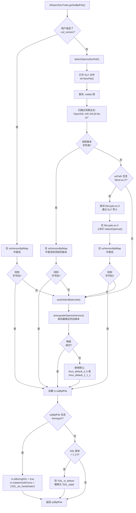
```mermaid
flowchart TD
    Start["MOpenSSLProbe.getSslBpfFile()"] --> CheckUserVer{"用户指定了<br/>--ssl_version?"}
    CheckUserVer -->|是| LookupMap["在 sslVersionBpfMap<br/>中查找"]
    CheckUserVer -->|否| DetectELF["detectOpenssl(soPath)"]
    
    DetectELF --> OpenELF["打开 ELF 文件<br/>elf.NewFile()"]
    OpenELF --> FindRodata["查找 .rodata 段"]
    FindRodata --> ScanSection["扫描正则表达式:<br/>'OpenSSL \\d\\.\\d\\.[0-9a-z]+'"]
    ScanSection --> VersionFound{"找到版本<br/>字符串?"}
    
    VersionFound -->|是| LookupDetected["在 sslVersionBpfMap<br/>中查找检测到的版本"]
    VersionFound -->|否| CheckLibSSL3{"soPath 包含<br/>'libssl.so.3'?"}
    
    CheckLibSSL3 -->|是| TryLibcrypto["尝试 libcrypto.so.3<br/>通过 ELF 导入"]
    CheckLibSSL3 -->|否| AutoDetect["autoDetectBytecode()"]
    
    TryLibcrypto --> DetectLibcrypto["在 libcrypto.so.3<br/>上执行 detectOpenssl()"]
    DetectLibcrypto --> LookupLibcrypto["在 sslVersionBpfMap<br/>中查找"]
    
    LookupMap --> Found1{"找到<br/>字节码?"}
    LookupDetected --> Found2{"找到<br/>字节码?"}
    LookupLibcrypto --> Found3{"找到<br/>字节码?"}
    
    Found1 -->|是| SetBpfFile["设置 m.sslBpfFile"]
    Found2 -->|是| SetBpfFile
    Found3 -->|是| SetBpfFile
    
    Found1 -->|否| AutoDetect
    Found2 -->|否| AutoDetect
    Found3 -->|否| AutoDetect
    
    AutoDetect --> Downgrade["downgradeOpensslVersion()<br/>查找最接近的旧版本"]
    Downgrade --> DefaultFallback{"降级<br/>成功?"}
    
    DefaultFallback -->|是| SetBpfFile
    DefaultFallback -->|否| UseDefault["使用默认:<br/>linux_default_3_0 或<br/>linux_default_1_1_1"]
    UseDefault --> SetBpfFile
    
    SetBpfFile --> CheckBoringSSL{"sslBpfFile 包含<br/>'boringssl'?"}
    CheckBoringSSL -->|是| SetBoringSSLFlag["m.isBoringSSL = true<br/>m.masterHookFuncs = ['SSL_do_handshake']"]
    CheckBoringSSL -->|否| CheckOldVersion{"SSL 版本<br/>< 1.1.0?"}
    
    CheckOldVersion -->|是| ReplaceHook["将 'SSL_in_before'<br/>替换为 'SSL_state'"]
    CheckOldVersion -->|否| End["返回 sslBpfFile"]
    
    SetBoringSSLFlag --> End
    ReplaceHook --> End
```

**版本检测算法**

`detectOpenssl` 函数对 OpenSSL 共享库执行二进制分析：

1. **ELF 解析**：将共享库作为 ELF 文件打开并验证架构（x86_64 或 aarch64）
2. **段扫描**：定位包含只读数据的 `.rodata` 段
3. **版本字符串提取**：以 1MB 块读取段，搜索正则表达式模式 `(OpenSSL\s\d\.\d\.[0-9a-z]+)`
4. **边界情况处理**：使用重叠读取（每次迭代减去 30 字节）来处理跨缓冲区边界分割的版本字符串

**来源：** [user/module/probe_openssl.go:178-278](https://github.com/gojue/ecapture/blob/ca085d05/user/module/probe_openssl.go#L178-L278), [user/module/probe_openssl_lib.go:189-282](https://github.com/gojue/ecapture/blob/ca085d05/user/module/probe_openssl_lib.go#L189-L282)

### 降级策略

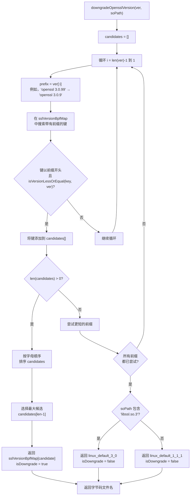
```mermaid
flowchart TD
    Start["downgradeOpensslVersion(ver, soPath)"] --> InitCandidates["candidates = []"]
    InitCandidates --> LoopPrefix["循环 i = len(ver)-1 到 1"]
    
    LoopPrefix --> CreatePrefix["prefix = ver[:i]<br/>例如，'openssl 3.0.99' → 'openssl 3.0.9'"]
    CreatePrefix --> SearchMap["在 sslVersionBpfMap<br/>中搜索带有前缀的键"]
    
    SearchMap --> CheckVersion{"键以前缀开头<br/>且 isVersionLessOrEqual(key, ver)?"}
    CheckVersion -->|是| AddCandidate["将键添加到 candidates[]"]
    CheckVersion -->|否| Continue["继续循环"]
    
    AddCandidate --> CheckCandidates{"len(candidates) > 0?"}
    Continue --> LoopPrefix
    
    CheckCandidates -->|是| SortCandidates["按字母顺序<br/>排序 candidates"]
    CheckCandidates -->|否| NextPrefix["尝试更短的前缀"]
    
    SortCandidates --> SelectMax["选择最大候选<br/>candidates[len-1]"]
    SelectMax --> ReturnBytecode["返回 sslVersionBpfMap[candidate]<br/>isDowngrade = true"]
    
    NextPrefix --> AllPrefixesTried{"所有前缀<br/>都已尝试?"}
    AllPrefixesTried -->|是| UseDefault{"soPath 包含<br/>'libssl.so.3'?"}
    AllPrefixesTried -->|否| LoopPrefix
    
    UseDefault -->|是| Return30["返回 linux_default_3_0<br/>isDowngrade = false"]
    UseDefault -->|否| Return111["返回 linux_default_1_1_1<br/>isDowngrade = false"]
    
    ReturnBytecode --> End["返回字节码文件名"]
    Return30 --> End
    Return111 --> End
```

**版本比较逻辑**

`isVersionLessOrEqual` 函数通过以下方式比较版本字符串：
- 去除 "openssl " 前缀
- 按点分割（例如，`3.0.12` → `["3", "0", "12"]`）
- 将每个段解析为数字和字母部分（例如，`12a` → `(12, "a")`）
- 首先进行数字比较，然后对后缀进行字母比较

**来源：** [user/module/probe_openssl_lib.go:341-422](https://github.com/gojue/ecapture/blob/ca085d05/user/module/probe_openssl_lib.go#L341-L422), [user/module/probe_openssl_lib.go:284-317](https://github.com/gojue/ecapture/blob/ca085d05/user/module/probe_openssl_lib.go#L284-L317)

---

## eBPF 钩子架构

### Uprobe 钩子点

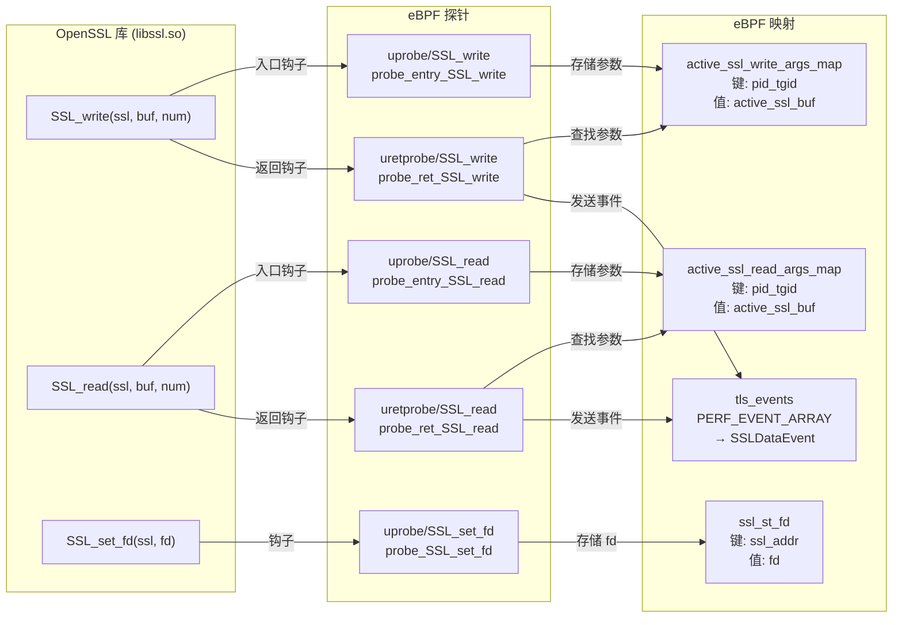
```mermaid
flowchart LR
    subgraph "OpenSSL 库 (libssl.so)"
        SSL_write["SSL_write(ssl, buf, num)"]
        SSL_read["SSL_read(ssl, buf, num)"]
        SSL_set_fd["SSL_set_fd(ssl, fd)"]
    end
    
    subgraph "eBPF 探针"
        entry_write["uprobe/SSL_write<br/>probe_entry_SSL_write"]
        ret_write["uretprobe/SSL_write<br/>probe_ret_SSL_write"]
        entry_read["uprobe/SSL_read<br/>probe_entry_SSL_read"]
        ret_read["uretprobe/SSL_read<br/>probe_ret_SSL_read"]
        setfd["uprobe/SSL_set_fd<br/>probe_SSL_set_fd"]
    end
    
    subgraph "eBPF 映射"
        write_args["active_ssl_write_args_map<br/>键: pid_tgid<br/>值: active_ssl_buf"]
        read_args["active_ssl_read_args_map<br/>键: pid_tgid<br/>值: active_ssl_buf"]
        ssl_fd_map["ssl_st_fd<br/>键: ssl_addr<br/>值: fd"]
        tls_events["tls_events<br/>PERF_EVENT_ARRAY<br/>→ SSLDataEvent"]
    end
    
    SSL_write -->|"入口钩子"| entry_write
    SSL_write -->|"返回钩子"| ret_write
    SSL_read -->|"入口钩子"| entry_read
    SSL_read -->|"返回钩子"| ret_read
    SSL_set_fd -->|"钩子"| setfd
    
    entry_write -->|"存储参数"| write_args
    entry_read -->|"存储参数"| read_args
    ret_write -->|"查找参数"| write_args
    ret_read -->|"查找参数"| read_args
    setfd -->|"存储 fd"| ssl_fd_map
    
    ret_write -->|"发送事件"| tls_events
    ret_read -->|"发送事件"| tls_events
```

**Uprobe 实现细节**

两阶段探针模式工作原理如下：

1. **入口探针** (`probe_entry_SSL`)：
   - 捕获 SSL 上下文指针 (`PT_REGS_PARM1`) 和缓冲区指针 (`PT_REGS_PARM2`)
   - 从 `ssl->version` 偏移量读取 SSL 版本
   - 调用 `process_SSL_bio()` 从 `ssl->bio->num` 提取文件描述符和 BIO 类型
   - 将上下文存储在以 `pid_tgid` 为键的 `active_ssl_*_args_map` 中

2. **返回探针** (`probe_ret_SSL`)：
   - 从 `PT_REGS_RC` 检索返回值（读取/写入的字节数）
   - 从入口探针查找存储的上下文
   - 调用 `process_SSL_data()` 使用 `bpf_probe_read_user()` 读取实际缓冲区数据
   - 通过性能事件数组向用户空间发送 `ssl_data_event_t`

**来源：** [kern/openssl.h:268-323](https://github.com/gojue/ecapture/blob/ca085d05/kern/openssl.h#L268-L323), [kern/openssl.h:164-191](https://github.com/gojue/ecapture/blob/ca085d05/kern/openssl.h#L164-L191), [user/module/probe_openssl_text.go:46-151](https://github.com/gojue/ecapture/blob/ca085d05/user/module/probe_openssl_text.go#L46-L151)

### 连接跟踪集成

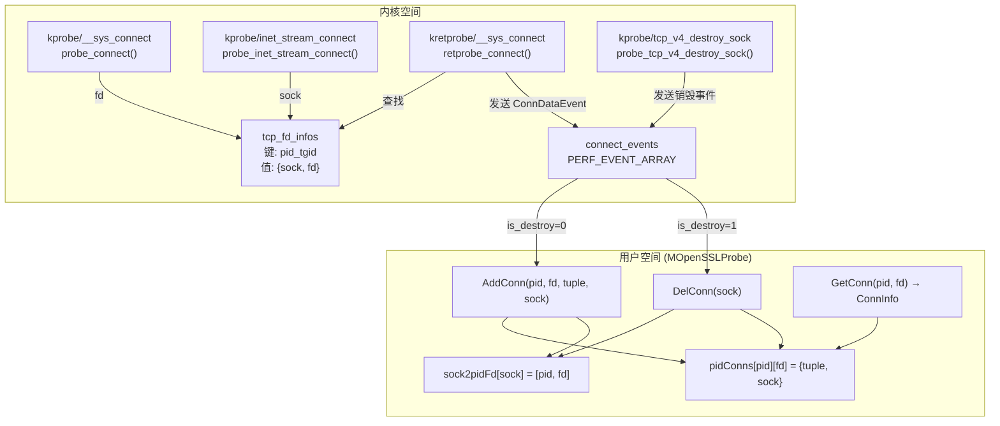
```mermaid
flowchart TD
    subgraph "内核空间"
        sys_connect["kprobe/__sys_connect<br/>probe_connect()"]
        inet_stream["kprobe/inet_stream_connect<br/>probe_inet_stream_connect()"]
        ret_connect["kretprobe/__sys_connect<br/>retprobe_connect()"]
        tcp_destroy["kprobe/tcp_v4_destroy_sock<br/>probe_tcp_v4_destroy_sock()"]
        
        tcp_fd_map["tcp_fd_infos<br/>键: pid_tgid<br/>值: {sock, fd}"]
        connect_events["connect_events<br/>PERF_EVENT_ARRAY"]
    end
    
    subgraph "用户空间 (MOpenSSLProbe)"
        AddConn["AddConn(pid, fd, tuple, sock)"]
        DelConn["DelConn(sock)"]
        GetConn["GetConn(pid, fd) → ConnInfo"]
        
        pidConns["pidConns[pid][fd] = {tuple, sock}"]
        sock2pidFd["sock2pidFd[sock] = [pid, fd]"]
    end
    
    sys_connect -->|"fd"| tcp_fd_map
    inet_stream -->|"sock"| tcp_fd_map
    ret_connect -->|"查找"| tcp_fd_map
    ret_connect -->|"发送 ConnDataEvent"| connect_events
    tcp_destroy -->|"发送销毁事件"| connect_events
    
    connect_events -->|"is_destroy=0"| AddConn
    connect_events -->|"is_destroy=1"| DelConn
    
    AddConn --> pidConns
    AddConn --> sock2pidFd
    DelConn --> sock2pidFd
    DelConn --> pidConns
    
    GetConn --> pidConns
```

**连接生命周期管理**

该模块维护进程/文件描述符与网络连接之间的双向映射：

- **pidConns**：`map[pid]map[fd]{tuple, sock}` - 通过进程和文件描述符查找连接信息
- **sock2pidFd**：`map[sock][pid, fd]` - 用于在套接字销毁时清理的反向查找

当处理 `SSLDataEvent` 时，`GetConn(pid, fd)` 检索元组（源:端口-目标:端口）和套接字指针，用网络上下文丰富捕获的数据。

**来源：** [user/module/probe_openssl.go:83-106](https://github.com/gojue/ecapture/blob/ca085d05/user/module/probe_openssl.go#L83-L106), [user/module/probe_openssl.go:406-488](https://github.com/gojue/ecapture/blob/ca085d05/user/module/probe_openssl.go#L406-L488), [kern/openssl.h:374-525](https://github.com/gojue/ecapture/blob/ca085d05/kern/openssl.h#L374-L525)

---

## 结构体偏移量计算

### 偏移量生成流程

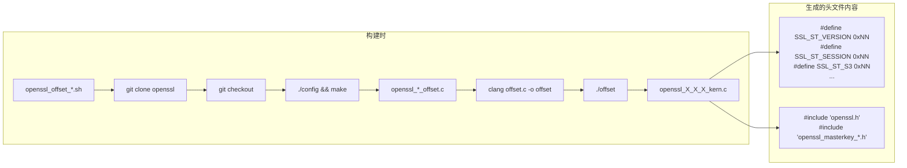
```mermaid
flowchart LR
    subgraph "构建时"
        Script["openssl_offset_*.sh"]
        CloneRepo["git clone openssl"]
        Checkout["git checkout <tag>"]
        Configure["./config && make"]
        OffsetC["openssl_*_offset.c"]
        Compile["clang offset.c -o offset"]
        Execute["./offset"]
        HeaderC["openssl_X_X_X_kern.c"]
    end
    
    subgraph "生成的头文件内容"
        Defines["#define SSL_ST_VERSION 0xNN<br/>#define SSL_ST_SESSION 0xNN<br/>#define SSL_ST_S3 0xNN<br/>..."]
        Includes["#include 'openssl.h'<br/>#include 'openssl_masterkey_*.h'"]
    end
    
    Script --> CloneRepo
    CloneRepo --> Checkout
    Checkout --> Configure
    Configure --> OffsetC
    OffsetC --> Compile
    Compile --> Execute
    Execute --> HeaderC
    
    HeaderC --> Defines
    HeaderC --> Includes
```

**偏移量提取机制**

偏移量生成脚本自动化从 OpenSSL 源代码提取结构体成员偏移量的过程：

1. **仓库设置**：在 `deps/openssl` 克隆或拉取 OpenSSL 仓库
2. **版本迭代**：遍历支持的版本（例如，3.0.0 到 3.0.17）
3. **构建配置**：运行 `./config` 和 `make build_generated` 生成头文件
4. **偏移量编译**：编译使用 `offsetof()` 宏计算结构体成员位置的 `offset.c`
5. **头文件生成**：执行编译后的二进制文件以输出 C 预处理器定义

**偏移量输出示例**（来自 `offset.c`）：
```c
printf("#define SSL_ST_VERSION %d\n", offsetof(struct ssl_st, version));
printf("#define SSL_ST_SESSION %d\n", offsetof(struct ssl_st, session));
printf("#define SSL_SESSION_ST_MASTER_KEY %d\n", offsetof(struct ssl_session_st, master_key));
```

**来源：** [utils/openssl_offset_3.0.sh:1-95](https://github.com/gojue/ecapture/blob/ca085d05/utils/openssl_offset_3.0.sh#L1-L95), [utils/openssl_offset_3.2.sh:1-82](https://github.com/gojue/ecapture/blob/ca085d05/utils/openssl_offset_3.2.sh#L1-L82), [utils/openssl_offset_3.3.sh:1-82](https://github.com/gojue/ecapture/blob/ca085d05/utils/openssl_offset_3.3.sh#L1-L82)

### OpenSSL 3.x 结构变更

从 OpenSSL 3.2.0 开始，内部结构被重构：

| OpenSSL 版本 | 结构变更 | 偏移量映射 |
|----------------|-------------------|----------------|
| 3.0.x, 3.1.x | 直接的 `ssl_st` 成员 | `SSL_ST_VERSION`, `SSL_ST_WBIO`, `SSL_ST_RBIO` |
| 3.2.x 及以后 | 通过 `ssl_connection_st` 间接访问 | `SSL_CONNECTION_ST_VERSION`, `SSL_CONNECTION_ST_WBIO` 等<br/>通过 `#define SSL_ST_VERSION SSL_CONNECTION_ST_VERSION` 映射回去 |

映射层允许 eBPF 代码使用一致的符号名称（`SSL_ST_*`），而实际偏移量值根据 OpenSSL 版本的内部结构布局而不同。

**来源：** [utils/openssl_offset_3.2.sh:58-67](https://github.com/gojue/ecapture/blob/ca085d05/utils/openssl_offset_3.2.sh#L58-L67), [utils/openssl_offset_3.3.sh:58-67](https://github.com/gojue/ecapture/blob/ca085d05/utils/openssl_offset_3.3.sh#L58-L67)

---

## 主密钥提取

### TLS 1.2 vs TLS 1.3 架构

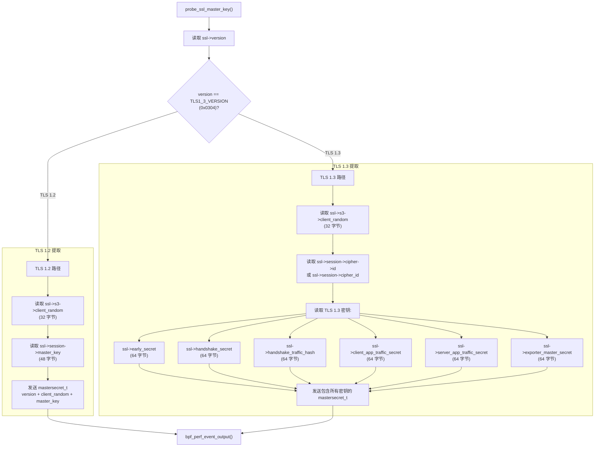
```mermaid
flowchart TD
    Start["probe_ssl_master_key()"] --> ReadVersion["读取 ssl->version"]
    ReadVersion --> CheckVersion{"version == TLS1_3_VERSION<br/>(0x0304)?"}
    
    CheckVersion -->|"TLS 1.2"| TLS12Path["TLS 1.2 路径"]
    CheckVersion -->|"TLS 1.3"| TLS13Path["TLS 1.3 路径"]
    
    subgraph "TLS 1.2 提取"
        TLS12Path --> ReadClientRandom12["读取 ssl->s3->client_random<br/>(32 字节)"]
        ReadClientRandom12 --> ReadMasterKey["读取 ssl->session->master_key<br/>(48 字节)"]
        ReadMasterKey --> SendTLS12["发送 mastersecret_t<br/>version + client_random + master_key"]
    end
    
    subgraph "TLS 1.3 提取"
        TLS13Path --> ReadClientRandom13["读取 ssl->s3->client_random<br/>(32 字节)"]
        ReadClientRandom13 --> ReadCipherID["读取 ssl->session->cipher->id<br/>或 ssl->session->cipher_id"]
        ReadCipherID --> ReadSecrets["读取 TLS 1.3 密钥:"]
        
        ReadSecrets --> EarlySecret["ssl->early_secret<br/>(64 字节)"]
        ReadSecrets --> HandshakeSecret["ssl->handshake_secret<br/>(64 字节)"]
        ReadSecrets --> HandshakeTrafficHash["ssl->handshake_traffic_hash<br/>(64 字节)"]
        ReadSecrets --> ClientAppSecret["ssl->client_app_traffic_secret<br/>(64 字节)"]
        ReadSecrets --> ServerAppSecret["ssl->server_app_traffic_secret<br/>(64 字节)"]
        ReadSecrets --> ExporterSecret["ssl->exporter_master_secret<br/>(64 字节)"]
        
        EarlySecret --> SendTLS13["发送包含所有密钥的 mastersecret_t"]
        HandshakeSecret --> SendTLS13
        HandshakeTrafficHash --> SendTLS13
        ClientAppSecret --> SendTLS13
        ServerAppSecret --> SendTLS13
        ExporterSecret --> SendTLS13
    end
    
    SendTLS12 --> End["bpf_perf_event_output()"]
    SendTLS13 --> End
```

**主密钥结构**

`mastersecret_t` 结构适用于 TLS 1.2 和 1.3：

```c
struct mastersecret_t {
    // 通用字段
    s32 version;                                    // TLS 版本
    u8 client_random[SSL3_RANDOM_SIZE];            // 32 字节
    
    // TLS 1.2 特定
    u8 master_key[MASTER_SECRET_MAX_LEN];          // 48 字节
    
    // TLS 1.3 特定
    u32 cipher_id;
    u8 early_secret[EVP_MAX_MD_SIZE];              // 64 字节
    u8 handshake_secret[EVP_MAX_MD_SIZE];          // 64 字节
    u8 handshake_traffic_hash[EVP_MAX_MD_SIZE];    // 64 字节
    u8 client_app_traffic_secret[EVP_MAX_MD_SIZE]; // 64 字节
    u8 server_app_traffic_secret[EVP_MAX_MD_SIZE]; // 64 字节
    u8 exporter_master_secret[EVP_MAX_MD_SIZE];    // 64 字节
};
```

**来源：** [kern/openssl_masterkey.h:25-39](https://github.com/gojue/ecapture/blob/ca085d05/kern/openssl_masterkey.h#L25-L39), [kern/openssl_masterkey.h:81-251](https://github.com/gojue/ecapture/blob/ca085d05/kern/openssl_masterkey.h#L81-L251), [kern/openssl_masterkey_3.0.h:82-247](https://github.com/gojue/ecapture/blob/ca085d05/kern/openssl_masterkey_3.0.h#L82-L247)

### Keylog 文件生成 (TLS 1.3)

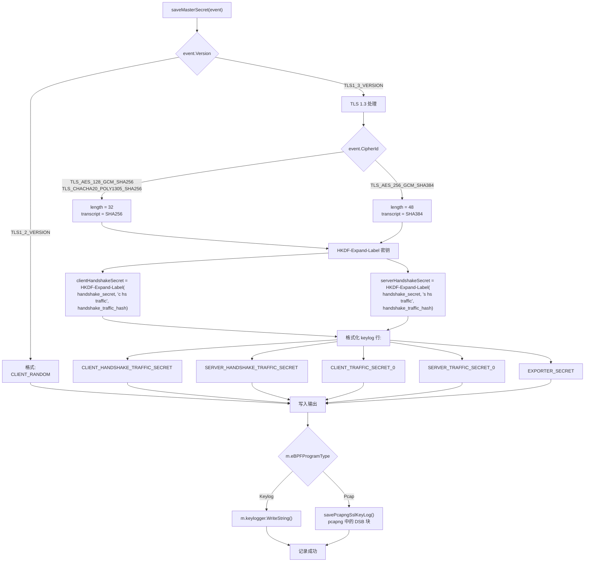
```mermaid
flowchart TD
    Start["saveMasterSecret(event)"] --> CheckVersion{"event.Version"}
    
    CheckVersion -->|"TLS1_2_VERSION"| TLS12Format["格式:<br/>CLIENT_RANDOM <client_random> <master_key>"]
    CheckVersion -->|"TLS1_3_VERSION"| TLS13Process["TLS 1.3 处理"]
    
    TLS13Process --> DetermineCipher{"event.CipherId"}
    DetermineCipher -->|"TLS_AES_128_GCM_SHA256<br/>TLS_CHACHA20_POLY1305_SHA256"| SetLen32["length = 32<br/>transcript = SHA256"]
    DetermineCipher -->|"TLS_AES_256_GCM_SHA384"| SetLen48["length = 48<br/>transcript = SHA384"]
    
    SetLen32 --> ExpandSecrets["HKDF-Expand-Label 密钥"]
    SetLen48 --> ExpandSecrets
    
    ExpandSecrets --> ClientHS["clientHandshakeSecret = HKDF-Expand-Label(<br/>handshake_secret, 'c hs traffic', handshake_traffic_hash)"]
    ExpandSecrets --> ServerHS["serverHandshakeSecret = HKDF-Expand-Label(<br/>handshake_secret, 's hs traffic', handshake_traffic_hash)"]
    
    ClientHS --> FormatLines["格式化 keylog 行:"]
    ServerHS --> FormatLines
    
    FormatLines --> Line1["CLIENT_HANDSHAKE_TRAFFIC_SECRET <cr> <chs>"]
    FormatLines --> Line2["SERVER_HANDSHAKE_TRAFFIC_SECRET <cr> <shs>"]
    FormatLines --> Line3["CLIENT_TRAFFIC_SECRET_0 <cr> <cats>"]
    FormatLines --> Line4["SERVER_TRAFFIC_SECRET_0 <cr> <sats>"]
    FormatLines --> Line5["EXPORTER_SECRET <cr> <ems>"]
    
    TLS12Format --> WriteOutput["写入输出"]
    Line1 --> WriteOutput
    Line2 --> WriteOutput
    Line3 --> WriteOutput
    Line4 --> WriteOutput
    Line5 --> WriteOutput
    
    WriteOutput --> CheckMode{"m.eBPFProgramType"}
    CheckMode -->|"Keylog"| WriteFile["m.keylogger.WriteString()"]
    CheckMode -->|"Pcap"| WriteDSB["savePcapngSslKeyLog()<br/>pcapng 中的 DSB 块"]
    
    WriteFile --> End["记录成功"]
    WriteDSB --> End
```

**TLS 1.3 的 HKDF 密钥派生**

TLS 1.3 使用 HKDF（基于 HMAC 的密钥派生函数）从握手密钥派生流量密钥。eBPF 程序捕获原始 `handshake_secret` 和 `handshake_traffic_hash`，用户空间执行：

```
clientHandshakeSecret = HKDF-Expand-Label(
    handshake_secret, 
    "c hs traffic", 
    handshake_traffic_hash, 
    hash_length
)
```

这与 TLS 1.3 RFC 8446 密钥调度匹配，生成 Wireshark 可用于解密的 SSLKEYLOGFILE 兼容输出。

**来源：** [user/module/probe_openssl.go:490-583](https://github.com/gojue/ecapture/blob/ca085d05/user/module/probe_openssl.go#L490-L583), [user/module/probe_openssl.go:509-559](https://github.com/gojue/ecapture/blob/ca085d05/user/module/probe_openssl.go#L509-L559)

### 钩子函数选择

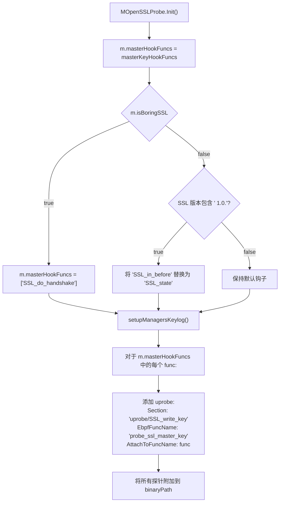
```mermaid
flowchart TD
    Start["MOpenSSLProbe.Init()"] --> InitHooks["m.masterHookFuncs = masterKeyHookFuncs"]
    InitHooks --> CheckBoringSSL{"m.isBoringSSL"}
    
    CheckBoringSSL -->|true| SetBoringFunc["m.masterHookFuncs = ['SSL_do_handshake']"]
    CheckBoringSSL -->|false| CheckOldSSL{"SSL 版本包含 ' 1.0.'?"}
    
    CheckOldSSL -->|true| ReplaceFunc["将 'SSL_in_before' 替换为 'SSL_state'"]
    CheckOldSSL -->|false| KeepDefault["保持默认钩子"]
    
    SetBoringFunc --> SetupProbes["setupManagersKeylog()"]
    ReplaceFunc --> SetupProbes
    KeepDefault --> SetupProbes
    
    SetupProbes --> CreateProbes["对于 m.masterHookFuncs 中的每个 func:"]
    CreateProbes --> AddProbe["添加 uprobe:<br/>Section: 'uprobe/SSL_write_key'<br/>EbpfFuncName: 'probe_ssl_master_key'<br/>AttachToFuncName: func"]
    
    AddProbe --> End["将所有探针附加到 binaryPath"]
```

**默认主密钥钩子函数**（在模块级别定义）：

```go
var masterKeyHookFuncs = []string{
    "SSL_do_handshake",
    "SSL_connect",
    "SSL_accept",
    "SSL_in_before",
}
```

对于 OpenSSL 1.0.x，`SSL_in_before` 被替换为 `SSL_state`，因为前者在旧版本中是宏而不是函数。

**来源：** [user/module/probe_openssl.go:178-196](https://github.com/gojue/ecapture/blob/ca085d05/user/module/probe_openssl.go#L178-L196), [user/module/probe_openssl_keylog.go:32-94](https://github.com/gojue/ecapture/blob/ca085d05/user/module/probe_openssl_keylog.go#L32-L94)

---

## MOpenSSLProbe 实现

### 核心结构

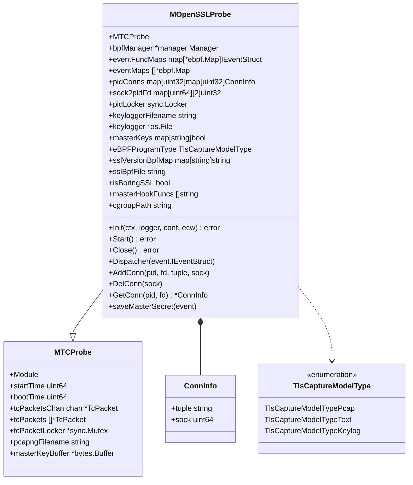
```mermaid
classDiagram
    class MOpenSSLProbe {
        +MTCProbe
        +bpfManager *manager.Manager
        +eventFuncMaps map[*ebpf.Map]IEventStruct
        +eventMaps []*ebpf.Map
        +pidConns map[uint32]map[uint32]ConnInfo
        +sock2pidFd map[uint64][2]uint32
        +pidLocker sync.Locker
        +keyloggerFilename string
        +keylogger *os.File
        +masterKeys map[string]bool
        +eBPFProgramType TlsCaptureModelType
        +sslVersionBpfMap map[string]string
        +sslBpfFile string
        +isBoringSSL bool
        +masterHookFuncs []string
        +cgroupPath string
        +Init(ctx, logger, conf, ecw) error
        +Start() error
        +Close() error
        +Dispatcher(event.IEventStruct)
        +AddConn(pid, fd, tuple, sock)
        +DelConn(sock)
        +GetConn(pid, fd) *ConnInfo
        +saveMasterSecret(event)
    }
    
    class MTCProbe {
        +Module
        +startTime uint64
        +bootTime uint64
        +tcPacketsChan chan *TcPacket
        +tcPackets []*TcPacket
        +tcPacketLocker *sync.Mutex
        +pcapngFilename string
        +masterKeyBuffer *bytes.Buffer
    }
    
    class ConnInfo {
        +tuple string
        +sock uint64
    }
    
    class TlsCaptureModelType {
        <<enumeration>>
        TlsCaptureModelTypePcap
        TlsCaptureModelTypeText
        TlsCaptureModelTypeKeylog
    }
    
    MOpenSSLProbe --|> MTCProbe
    MOpenSSLProbe *-- ConnInfo
    MOpenSSLProbe ..> TlsCaptureModelType
```

**字段说明**：

- **bpfManager**：管理 eBPF 程序生命周期（加载、附加、分离）
- **eventFuncMaps**：将 eBPF 映射映射到其相应的事件解码器
- **pidConns**：按 PID 和文件描述符进行连接跟踪
- **sock2pidFd**：从套接字指针到 [PID, FD] 的反向映射，用于清理
- **keylogger**：用于写入 SSLKEYLOGFILE 格式输出的文件句柄
- **masterKeys**：去重映射（client_random 十六进制 → bool）以避免重复密钥写入
- **eBPFProgramType**：确定要加载哪些 eBPF 程序（text/pcap/keylog）
- **sslVersionBpfMap**：版本字符串到字节码文件名的映射
- **isBoringSSL**：用于选择 BoringSSL 特定代码路径的标志

**来源：** [user/module/probe_openssl.go:83-106](https://github.com/gojue/ecapture/blob/ca085d05/user/module/probe_openssl.go#L83-L106), [user/module/probe_openssl.go:109-176](https://github.com/gojue/ecapture/blob/ca085d05/user/module/probe_openssl.go#L109-L176)

### 初始化流程

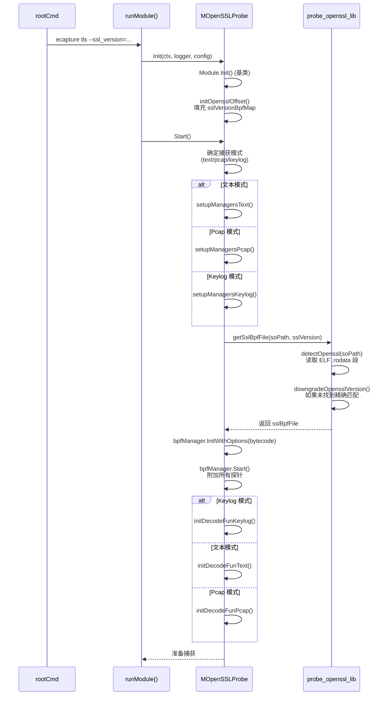
```mermaid
sequenceDiagram
    participant CLI as rootCmd
    participant RM as runModule()
    participant M as MOpenSSLProbe
    participant Lib as probe_openssl_lib
    
    CLI->>RM: ecapture tls --ssl_version=...
    RM->>M: Init(ctx, logger, config)
    M->>M: Module.Init() (基类)
    M->>M: initOpensslOffset()<br/>填充 sslVersionBpfMap
    
    RM->>M: Start()
    M->>M: 确定捕获模式<br/>(text/pcap/keylog)
    
    alt 文本模式
        M->>M: setupManagersText()
    else Pcap 模式
        M->>M: setupManagersPcap()
    else Keylog 模式
        M->>M: setupManagersKeylog()
    end
    
    M->>Lib: getSslBpfFile(soPath, sslVersion)
    Lib->>Lib: detectOpenssl(soPath)<br/>读取 ELF .rodata 段
    Lib->>Lib: downgradeOpensslVersion()<br/>如果未找到精确匹配
    Lib-->>M: 返回 sslBpfFile
    
    M->>M: bpfManager.InitWithOptions(bytecode)
    M->>M: bpfManager.Start()<br/>附加所有探针
    
    alt Keylog 模式
        M->>M: initDecodeFunKeylog()
    else 文本模式
        M->>M: initDecodeFunText()
    else Pcap 模式
        M->>M: initDecodeFunPcap()
    end
    
    M-->>RM: 准备捕获
```

**来源：** [user/module/probe_openssl.go:109-176](https://github.com/gojue/ecapture/blob/ca085d05/user/module/probe_openssl.go#L109-L176), [user/module/probe_openssl.go:280-350](https://github.com/gojue/ecapture/blob/ca085d05/user/module/probe_openssl.go#L280-L350), [user/module/probe_openssl_text.go:18-188](https://github.com/gojue/ecapture/blob/ca085d05/user/module/probe_openssl_text.go#L18-L188)

---

## 捕获模式

### 模式比较

| 模式 | 使用的 eBPF 映射 | 输出格式 | 使用场景 |
|------|---------------|---------------|----------|
| **Text** | `tls_events`, `connect_events` | 带元数据的明文 | 实时监控、调试 |
| **Pcap** | `tls_events`, `connect_events`, `skb_events` | 带 DSB 块的 Pcapng | Wireshark 分析、网络取证 |
| **Keylog** | `mastersecret_events` | SSLKEYLOGFILE 格式 | 预解密密钥提取 |

**事件类型映射**：

```go
// 文本模式
m.eventFuncMaps[tls_events] = &event.SSLDataEvent{}
m.eventFuncMaps[connect_events] = &event.ConnDataEvent{}

// Keylog 模式
if m.isBoringSSL {
    m.eventFuncMaps[mastersecret_events] = &event.MasterSecretBSSLEvent{}
} else {
    m.eventFuncMaps[mastersecret_events] = &event.MasterSecretEvent{}
}

// Pcap 模式（包括文本模式的所有内容加上）
m.eventFuncMaps[skb_events] = &event.TcSkbEvent{}
```

**来源：** [user/module/probe_openssl_text.go:190-234](https://github.com/gojue/ecapture/blob/ca085d05/user/module/probe_openssl_text.go#L190-L234), [user/module/probe_openssl_keylog.go:97-118](https://github.com/gojue/ecapture/blob/ca085d05/user/module/probe_openssl_keylog.go#L97-L118)

### 文本模式架构

文本模式捕获 SSL 数据事件并用连接信息丰富它们：

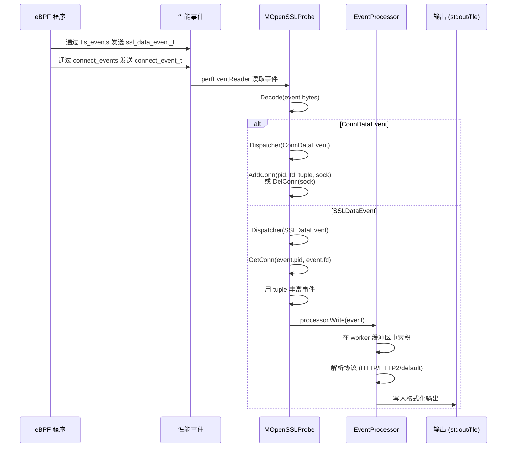
```mermaid
sequenceDiagram
    participant eBPF as eBPF 程序
    participant PE as 性能事件
    participant M as MOpenSSLProbe
    participant EP as EventProcessor
    participant Out as 输出 (stdout/file)
    
    eBPF->>PE: 通过 tls_events 发送 ssl_data_event_t
    eBPF->>PE: 通过 connect_events 发送 connect_event_t
    
    PE->>M: perfEventReader 读取事件
    M->>M: Decode(event bytes)
    
    alt ConnDataEvent
        M->>M: Dispatcher(ConnDataEvent)
        M->>M: AddConn(pid, fd, tuple, sock)<br/>或 DelConn(sock)
    else SSLDataEvent
        M->>M: Dispatcher(SSLDataEvent)
        M->>M: GetConn(event.pid, event.fd)
        M->>M: 用 tuple 丰富事件
        M->>EP: processor.Write(event)
        EP->>EP: 在 worker 缓冲区中累积
        EP->>EP: 解析协议 (HTTP/HTTP2/default)
        EP->>Out: 写入格式化输出
    end
```

**来源：** [user/module/probe_openssl.go:741-783](https://github.com/gojue/ecapture/blob/ca085d05/user/module/probe_openssl.go#L741-L783), [user/module/probe_openssl_text.go:18-188](https://github.com/gojue/ecapture/blob/ca085d05/user/module/probe_openssl_text.go#L18-L188)

### Keylog 模式架构

Keylog 模式专注于主密钥提取：

- 仅附加 uprobe 到主密钥钩子函数（不捕获数据）
- 以与 Wireshark 兼容的 NSS Key Log 格式写入密钥
- 通过 client_random 去重以避免重复密钥
- 对于 TLS 1.3，在用户空间执行 HKDF 密钥派生

**Keylog 输出示例**：
```
CLIENT_RANDOM 52d7... a8c9...
CLIENT_HANDSHAKE_TRAFFIC_SECRET 52d7... 9f3e...
SERVER_HANDSHAKE_TRAFFIC_SECRET 52d7... b2a1...
CLIENT_TRAFFIC_SECRET_0 52d7... 3c4d...
SERVER_TRAFFIC_SECRET_0 52d7... 7e8f...
EXPORTER_SECRET 52d7... 1a2b...
```

**来源：** [user/module/probe_openssl_keylog.go:32-118](https://github.com/gojue/ecapture/blob/ca085d05/user/module/probe_openssl_keylog.go#L32-L118), [user/module/probe_openssl.go:490-650](https://github.com/gojue/ecapture/blob/ca085d05/user/module/probe_openssl.go#L490-L650)

---

## 配置与过滤

### OpensslConfig 结构

```go
type OpensslConfig struct {
    BaseConfig
    Openssl      string // libssl.so 路径
    SslVersion   string // 用户指定的版本
    Model        string // text/pcap/keylog
    KeylogFile   string // keylog 模式的输出路径
    PcapFile     string // pcap 模式的输出路径
    PcapFilter   string // BPF 过滤器表达式
    ElfType      uint8  // ElfTypeSo = 0
    IsAndroid    bool   // Android 平台标志
    AndroidVer   string // Android 版本（例如，"13"、"14"）
    CGroupPath   string // 用于过滤的 Cgroup 路径
}
```

**版本指定**：
- `--ssl_version="openssl 3.0.12"` - 精确版本
- `--ssl_version="boringssl_a_14"` - Android BoringSSL 变体
- 如果未指定则自动检测

**来源：** [user/module/probe_openssl.go:108-176](https://github.com/gojue/ecapture/blob/ca085d05/user/module/probe_openssl.go#L108-L176), [cli/cmd/root.go:156-175](https://github.com/gojue/ecapture/blob/ca085d05/cli/cmd/root.go#L156-L175)

### 用于过滤的常量编辑器

```go
func (m *MOpenSSLProbe) constantEditor() []manager.ConstantEditor {
    return []manager.ConstantEditor{
        {
            Name:  "target_pid",
            Value: uint64(m.conf.GetPid()),
        },
        {
            Name:  "target_uid",
            Value: uint64(m.conf.GetUid()),
        },
        {
            Name:  "less52",
            Value: kernelLess52, // 0 或 1
        },
    }
}
```

这些常量在加载时在 eBPF 字节码中重写，允许高效过滤而无需映射查找。eBPF 中的 `passes_filter()` 函数在处理事件之前检查这些值。

**来源：** [user/module/probe_openssl.go:361-395](https://github.com/gojue/ecapture/blob/ca085d05/user/module/probe_openssl.go#L361-L395), [kern/openssl.h:269-271](https://github.com/gojue/ecapture/blob/ca085d05/kern/openssl.h#L269-L271)

---

## 错误处理与边界情况

### 空密钥检测

模块在写入之前验证提取的密钥是否非空：

```go
func (m *MOpenSSLProbe) mk13NullSecrets(hashLen int, 
    ClientHandshakeSecret, ClientTrafficSecret0, 
    ServerHandshakeSecret, ServerTrafficSecret0, 
    ExporterSecret [64]byte) bool {
    
    isNullCount := 5
    // 检查每个密钥；如果找到非零字节则递减计数器
    for i := 0; i < hashLen; i++ {
        if ClientHandshakeSecret[i] != 0 { isNullCount-- }
        // ... 检查其他密钥
    }
    return isNullCount != 0 // 如果任何密钥全为零则返回 true
}
```

这防止了将不完整或无效的密钥材料写入 keylog 文件。

**来源：** [user/module/probe_openssl.go:697-739](https://github.com/gojue/ecapture/blob/ca085d05/user/module/probe_openssl.go#L697-L739), [user/module/probe_openssl.go:652-672](https://github.com/gojue/ecapture/blob/ca085d05/user/module/probe_openssl.go#L652-L672)

### 文件描述符回退

当 `ssl->bio->num` 为 0（未设置）时，模块检查由 `SSL_set_fd` 钩子填充的 `ssl_st_fd` 映射：

```c
*fd = (u32)ssl_bio_num_addr;
if (*fd == 0) {
    u64 ssl_addr = (u64)ssl;
    u64 *fd_ptr = bpf_map_lookup_elem(&ssl_st_fd, &ssl_addr);
    if (fd_ptr) {
        *fd = (u32)*fd_ptr;
    }
}
```

这处理了显式调用 `SSL_set_fd()` 而不是使用 BIO 函数的应用程序。

**来源：** [kern/openssl.h:225-267](https://github.com/gojue/ecapture/blob/ca085d05/kern/openssl.h#L225-L267), [kern/openssl.h:528-543](https://github.com/gojue/ecapture/blob/ca085d05/kern/openssl.h#L528-L543)

### BIO 类型过滤

模块读取 BIO 方法类型以区分不同的 I/O 类型：

```c
#define BIO_TYPE_SOURCE_SINK 0x0400
#define BIO_TYPE_DESCRIPTOR  0x0100
```

具有 `bio_type > BIO_TYPE_SOURCE_SINK | BIO_TYPE_DESCRIPTOR` 的事件可能表示非套接字 BIO（例如，内存 BIO），并被记录为警告但不会被丢弃，因为 fd 仍可能从 `ssl_st_fd` 映射中有效。

**来源：** [kern/openssl.h:193-223](https://github.com/gojue/ecapture/blob/ca085d05/kern/openssl.h#L193-L223), [user/module/probe_openssl.go:764-779](https://github.com/gojue/ecapture/blob/ca085d05/user/module/probe_openssl.go#L764-L779)

---

## 总结

OpenSSL 模块通过以下方式展示了复杂的二进制插桩：

1. **版本无关设计**：通过偏移量分组支持 100 多个 OpenSSL 版本（26 个 1.0.2.x 版本共享一个字节码文件）
2. **双 TLS 协议支持**：处理 TLS 1.2（单个 master_key）和 TLS 1.3（使用 HKDF 派生的多个流量密钥）
3. **多模态输出**：文本（实时）、pcap（Wireshark 兼容）和 keylog（预解密密钥）
4. **智能回退**：自动版本降级、libcrypto 回退和默认字节码选择
5. **连接丰富**：集成基于 kprobe 的 TCP 连接跟踪，将 SSL 事件映射到网络元组

该模块的架构清晰地分离了关注点：版本检测在初始化时进行，eBPF 程序处理内核空间数据捕获，用户空间使用协议特定的解析器和密钥派生逻辑处理事件。

**来源：** [user/module/probe_openssl.go:1-795](https://github.com/gojue/ecapture/blob/ca085d05/user/module/probe_openssl.go#L1-L795), [user/module/probe_openssl_lib.go:1-449](https://github.com/gojue/ecapture/blob/ca085d05/user/module/probe_openssl_lib.go#L1-L449), [kern/openssl.h:1-544](https://github.com/gojue/ecapture/blob/ca085d05/kern/openssl.h#L1-L544)