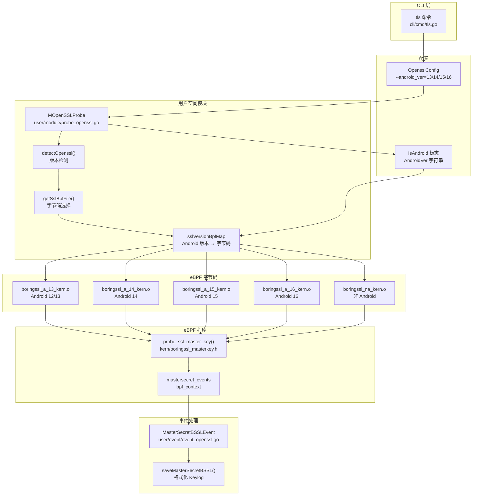
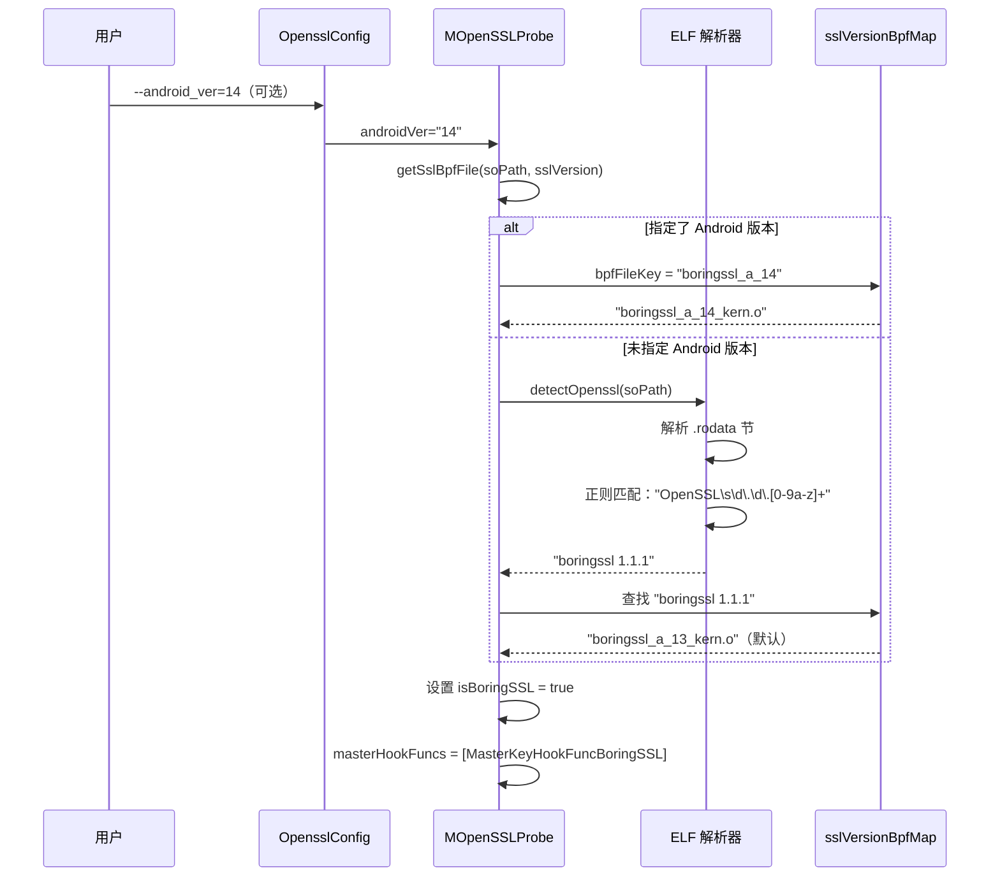
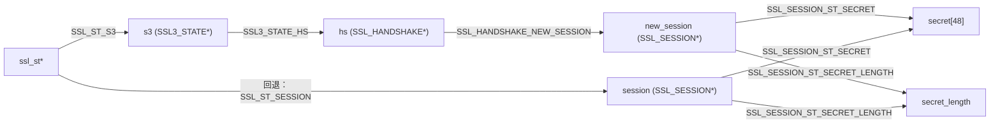
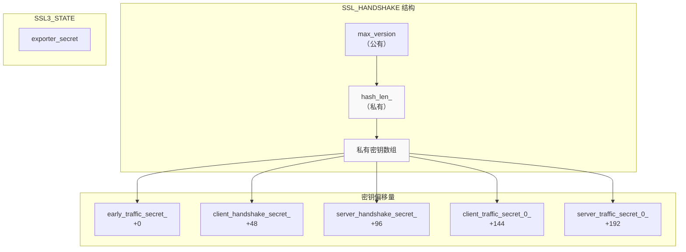

# BoringSSL 模块

## 目的与范围

BoringSSL 模块从使用 BoringSSL（Google 对 OpenSSL 的分支）的应用程序中捕获 TLS/SSL 明文流量和主密钥。该模块主要为 Android 环境（Android 12-16）设计，其中 BoringSSL 是默认的 SSL/TLS 实现，但它也支持非 Android 的 BoringSSL 部署。

对于一般的 OpenSSL 支持（版本 1.0.x、1.1.x、3.x），请参阅 [OpenSSL 模块](3.1.1-openssl-module.md)。对于 Go 的原生 TLS 实现，请参阅 [Go TLS 模块](3.1.3-go-tls-module.md)。对于整体 TLS/SSL 捕获能力，请参阅 [TLS/SSL 捕获模块](3.1-tlsssl-capture-modules.md)。

## 概述

BoringSSL 是 Google 对 OpenSSL 的分支，专为 Chrome/Chromium 和 Android 设计。虽然它与 OpenSSL 保持 API 兼容性，但其内部结构和偏移量差异显著，需要专用的 eBPF 字节码和偏移量计算。

BoringSSL 模块与 OpenSSL 模块共享相同的用户空间实现（`MOpenSSLProbe`），并针对以下方面进行了专门处理：
- Android 版本检测
- BoringSSL 特定的结构体偏移量
- 通过手动偏移量计算访问 C++ 私有成员
- BoringSSL 特定的主密钥事件（`MasterSecretBSSLEvent`）

来源：[user/module/probe_openssl.go:83-106](https://github.com/gojue/ecapture/blob/ca085d05/user/module/probe_openssl.go#L83-L106)、[user/module/probe_openssl_lib.go:90-103](https://github.com/gojue/ecapture/blob/ca085d05/user/module/probe_openssl_lib.go#L90-L103)

## 模块架构



来源：[user/module/probe_openssl.go:83-106](https://github.com/gojue/ecapture/blob/ca085d05/user/module/probe_openssl.go#L83-L106)、[user/module/probe_openssl_lib.go:73-187](https://github.com/gojue/ecapture/blob/ca085d05/user/module/probe_openssl_lib.go#L73-L187)

## 支持的 BoringSSL 版本

该模块支持多个 Android 版本和非 Android 部署的 BoringSSL：

| 版本键 | Android 版本 | 字节码文件 | Git 仓库 |
|-------------|----------------|---------------|----------------|
| `boringssl_a_13` | Android 12/13 | `boringssl_a_13_kern.o` | android12-release 分支 |
| `boringssl_a_14` | Android 14 | `boringssl_a_14_kern.o` | android14-release 分支 |
| `boringssl_a_15` | Android 15 | `boringssl_a_15_kern.o` | android15-release 分支 |
| `boringssl_a_16` | Android 16 | `boringssl_a_16_kern.o` | android16-release 分支 |
| `boringssl na` | 非 Android | `boringssl_na_kern.o` | github.com/google/boringssl |
| `boringssl 1.1.1` | 通用 | `boringssl_a_13_kern.o` | 未检测到版本时的回退 |

版本映射在 `initOpensslOffset()` 中初始化：

来源：[user/module/probe_openssl_lib.go:90-103](https://github.com/gojue/ecapture/blob/ca085d05/user/module/probe_openssl_lib.go#L90-L103)

## 版本检测

### 检测策略

BoringSSL 版本检测遵循多步骤流程：



来源：[user/module/probe_openssl.go:179-277](https://github.com/gojue/ecapture/blob/ca085d05/user/module/probe_openssl.go#L179-L277)、[user/module/probe_openssl_lib.go:189-282](https://github.com/gojue/ecapture/blob/ca085d05/user/module/probe_openssl_lib.go#L189-L282)

### Android 版本参数

用户可以显式指定 Android 版本以绕过自动检测：

```bash
# 显式指定 Android 14
ecapture tls --android_ver=14

# 显式指定 Android 15
ecapture tls --android_ver=15
```

当提供 `--android_ver` 标志时，模块会将字节码键构造为 `boringssl_a_{androidVer}` 并跳过版本字符串检测。这在版本检测失败或出于性能原因时特别有用。

来源：[user/module/probe_openssl.go:247-262](https://github.com/gojue/ecapture/blob/ca085d05/user/module/probe_openssl.go#L247-L262)

### 版本字符串检测回退

如果未指定 Android 版本，模块会尝试从 `libssl.so` 或 `libcrypto.so` 的 `.rodata` 节检测版本字符串。BoringSSL 通常报告自己为 `"boringssl 1.1.1"`，它映射到默认的 `boringssl_a_13_kern.o` 字节码。

然而，由于不同 Android 版本上的 BoringSSL 版本尽管报告相同的版本字符串，但内部结构偏移量不同，仅依赖版本字符串检测可能导致使用不正确的偏移量。这就是为什么建议在 Android 环境中使用 `--android_ver` 参数。

来源：[user/module/probe_openssl_lib.go:231-282](https://github.com/gojue/ecapture/blob/ca085d05/user/module/probe_openssl_lib.go#L231-L282)

## 结构体偏移量生成

### 私有成员挑战

BoringSSL 在关键结构（如 `SSL_HANDSHAKE`）中使用带有私有成员的 C++。由于 C++ 私有成员无法通过标准的 `offsetof()` 宏访问，eCapture 采用基于内存布局分析的手动偏移量计算策略。

BoringSSL 中的 `SSL_HANDSHAKE` 结构包含作为私有成员的 TLS 1.3 密钥：

```cpp
// 来自 boringssl src/ssl/internal.h
struct SSL_HANDSHAKE {
  uint16_t max_version = 0;  // 可通过 offsetof() 计算的偏移量
  
 private:
  size_t hash_len_ = 0;      // 必须手动计算的偏移量
  uint8_t secret_[SSL_MAX_MD_SIZE] = {0};
  uint8_t early_traffic_secret_[SSL_MAX_MD_SIZE] = {0};
  uint8_t client_handshake_secret_[SSL_MAX_MD_SIZE] = {0};
  uint8_t server_handshake_secret_[SSL_MAX_MD_SIZE] = {0};
  uint8_t client_traffic_secret_0_[SSL_MAX_MD_SIZE] = {0};
  uint8_t server_traffic_secret_0_[SSL_MAX_MD_SIZE] = {0};
};
```

来源：[kern/boringssl_const.h:9-33](https://github.com/gojue/ecapture/blob/ca085d05/kern/boringssl_const.h#L9-L33)

### 手动偏移量计算

私有成员的偏移量在 `kern/boringssl_const.h` 中使用内存对齐规则计算：

| 成员 | 计算方式 | 偏移量 |
|--------|-------------|--------|
| `max_version` | 来自 `offsetof()` | 变化（例如 30） |
| `hash_len_` | `roundup(max_version + sizeof(uint16_t), 8)` | 32 |
| `secret_` | `hash_len_ + sizeof(size_t)` | 40 |
| `early_traffic_secret_` | `secret_ + SSL_MAX_MD_SIZE * 1` | 88 |
| `client_handshake_secret_` | `secret_ + SSL_MAX_MD_SIZE * 2` | 136 |
| `server_handshake_secret_` | `secret_ + SSL_MAX_MD_SIZE * 3` | 184 |
| `client_traffic_secret_0_` | `secret_ + SSL_MAX_MD_SIZE * 4` | 232 |
| `server_traffic_secret_0_` | `secret_ + SSL_MAX_MD_SIZE * 5` | 280 |

`SSL_MAX_MD_SIZE` 常量为 48 字节（SHA-384 哈希大小）。

来源：[kern/boringssl_const.h:38-60](https://github.com/gojue/ecapture/blob/ca085d05/kern/boringssl_const.h#L38-L60)

### 偏移量生成脚本

`utils/boringssl-offset.c` 程序为可通过 `offsetof()` 访问的公共成员生成偏移量：

```c
#define SSL_STRUCT_OFFSETS                   \
    X(ssl_st, version)                       \
    X(ssl_st, session)                       \
    X(ssl_st, rbio)                          \
    X(ssl_st, wbio)                          \
    X(ssl_st, s3)                            \
    X(ssl_session_st, secret_length)         \
    X(ssl_session_st, secret)                \
    X(bssl::SSL3_STATE, hs)                  \
    X(bssl::SSL3_STATE, client_random)       \
    X(bssl::SSL3_STATE, exporter_secret)     \
    X(bssl::SSL_HANDSHAKE, new_session)      \
    X(bssl::SSL_HANDSHAKE, client_version)   \
    X(bssl::SSL_HANDSHAKE, state)            \
    X(bssl::SSL_HANDSHAKE, tls13_state)
```

该脚本为每个 Android 版本调用，以生成特定版本的偏移量文件（例如 `kern/boringssl_a_13_kern.c`）。

来源：[utils/boringssl-offset.c:23-46](https://github.com/gojue/ecapture/blob/ca085d05/utils/boringssl-offset.c#L23-L46)

## 主密钥提取

### BoringSSL 特定的事件结构

BoringSSL 使用专用的事件结构 `MasterSecretBSSLEvent`，其布局与 OpenSSL 的 `MasterSecretEvent` 不同：

```go
type MasterSecretBSSLEvent struct {
    Version      int32      // TLS 版本
    ClientRandom [32]byte   // 客户端随机数
    HashLen      uint32     // 哈希长度（SHA-256 为 32，SHA-384 为 48）
    
    // TLS 1.2 单个密钥
    Secret [48]byte
    
    // TLS 1.3 多个密钥
    EarlyTrafficSecret       [64]byte
    ClientHandshakeSecret    [64]byte
    ServerHandshakeSecret    [64]byte
    ClientTrafficSecret0     [64]byte
    ServerTrafficSecret0     [64]byte
    ExporterSecret           [64]byte
}
```

与 OpenSSL 的主要区别：
- 使用 `HashLen` 而不是单独的长度字段
- 密钥数组大小为最大哈希长度（EVP_MAX_MD_SIZE 的 64 字节）
- TLS 1.2 使用单个 `Secret` 字段而不是 `MasterKey`

来源：[user/event/event_openssl.go:76-95](https://github.com/gojue/ecapture/blob/ca085d05/user/event/event_openssl.go#L76-L95)

### TLS 1.2 主密钥提取

对于 TLS 1.2 连接，BoringSSL 在 `SSL_SESSION` 结构中存储主密钥：



`probe_ssl_master_key()` 中的提取逻辑遵循以下路径：

1. 检查握手状态是否完成（`state >= CLIENT_STATE12_SEND_CLIENT_FINISHED`）
2. 读取 `ssl_st->s3->hs->new_session` 地址
3. 如果 `new_session` 为 NULL，回退到 `ssl_st->session`
4. 从会话结构读取 `secret_length` 和 `secret`
5. 向用户空间发送事件

**Android 16 特殊情况**：在 Android 16 中，BoringSSL 从 `SSL_SESSION` 中删除了 `secret_length` 字段。模块通过检查 `SSL_SESSION_ST_SECRET_LENGTH == 0xFF` 来检测这种情况，并使用 `BORINGSSL_SSL_MAX_MASTER_KEY_LENGTH`（48 字节）作为默认长度。

来源：[kern/boringssl_masterkey.h:282-336](https://github.com/gojue/ecapture/blob/ca085d05/kern/boringssl_masterkey.h#L282-L336)、[kern/boringssl_masterkey.h:307-320](https://github.com/gojue/ecapture/blob/ca085d05/kern/boringssl_masterkey.h#L307-L320)

### TLS 1.3 密钥提取

TLS 1.3 使用在握手期间派生的多个流量密钥。BoringSSL 将这些密钥存储在 `SSL_HANDSHAKE` 的私有成员中：



提取序列：

1. 验证握手状态（`tls13_state >= CLIENT_STATE13_READ_SERVER_FINISHED`）
2. 读取 `hash_len_` 以确定密钥大小（SHA-256 为 32，SHA-384 为 48）
3. 从计算的偏移量读取每个密钥：
   - `SSL_HANDSHAKE_EARLY_TRAFFIC_SECRET_`
   - `SSL_HANDSHAKE_CLIENT_HANDSHAKE_SECRET_`
   - `SSL_HANDSHAKE_SERVER_HANDSHAKE_SECRET_`
   - `SSL_HANDSHAKE_CLIENT_TRAFFIC_SECRET_0_`
   - `SSL_HANDSHAKE_SERVER_TRAFFIC_SECRET_0_`
4. 从 `SSL3_STATE` 读取 `exporter_secret`（非私有）
5. 向用户空间发送完整事件

来源：[kern/boringssl_masterkey.h:338-396](https://github.com/gojue/ecapture/blob/ca085d05/kern/boringssl_masterkey.h#L338-L396)

### 用户空间处理

`saveMasterSecretBSSL()` 函数将密钥格式化为 SSLKEYLOGFILE 格式：

```go
func (m *MOpenSSLProbe) saveMasterSecretBSSL(secretEvent *event.MasterSecretBSSLEvent) {
    k := fmt.Sprintf("%02x", secretEvent.ClientRandom)
    
    // 检查重复
    if _, exists := m.masterKeys[k]; exists {
        return
    }
    
    switch secretEvent.Version {
    case event.Tls12Version:
        // TLS 1.2：单个 CLIENT_RANDOM 行
        length := int(secretEvent.HashLen)
        b = fmt.Sprintf("%s %02x %02x\n", 
            hkdf.KeyLogLabelTLS12,
            secretEvent.ClientRandom,
            secretEvent.Secret[:length])
        
    case event.Tls13Version:
        // TLS 1.3：多个密钥行
        length := int(secretEvent.HashLen)
        b.WriteString(fmt.Sprintf("%s %02x %02x\n",
            hkdf.KeyLogLabelClientHandshake,
            secretEvent.ClientRandom,
            secretEvent.ClientHandshakeSecret[:length]))
        // ... 对所有 5 个密钥重复
    }
    
    // 写入 keylog 文件或 PCAPNG DSB
    m.keylogger.WriteString(b.String())
}
```

来源：[user/module/probe_openssl.go:585-650](https://github.com/gojue/ecapture/blob/ca085d05/user/module/probe_openssl.go#L585-L650)

## eBPF 实现细节

### 钩子点

BoringSSL 使用单个钩子函数进行主密钥捕获：

```c
SEC("uprobe/SSL_write_key")
int probe_ssl_master_key(struct pt_regs *ctx) {
    void *ssl_st_ptr = (void *)PT_REGS_PARM1(ctx);
    // 提取密钥...
}
```

与可能钩住多个函数（`SSL_write`、`SSL_read`、`SSL_do_handshake`）的 OpenSSL 不同，BoringSSL 捕获使用统一的方法。函数名称 `SSL_write_key` 在初始化时确定：

```go
if strings.Contains(m.sslBpfFile, "boringssl") {
    m.isBoringSSL = true
    m.masterHookFuncs = []string{MasterKeyHookFuncBoringSSL}
}
```

来源：[kern/boringssl_masterkey.h:169-170](https://github.com/gojue/ecapture/blob/ca085d05/kern/boringssl_masterkey.h#L169-L170)、[user/module/probe_openssl.go:181-184](https://github.com/gojue/ecapture/blob/ca085d05/user/module/probe_openssl.go#L181-L184)

### 握手状态验证

BoringSSL 定义了特定的状态值来确定密钥何时就绪：

```c
// 客户端状态
#define CLIENT_STATE13_READ_SERVER_FINISHED 8
#define CLIENT_STATE13_DONE 14

// 服务器状态  
#define SERVER_STATE13_READ_CLIENT_FINISHED 14
#define SERVER_STATE13_DONE 16

// TLS 1.2 状态
#define CLIENT_STATE12_SEND_CLIENT_FINISHED 16
#define CLIENT_STATE12_DONE 22
#define SERVER_STATE12_READ_CLIENT_FINISHED 18
#define SERVER_STATE12_DONE 21
```

eBPF 程序在读取密钥前检查这些状态：

```c
// TLS 1.2 检查
if (mastersecret->version != TLS1_3_VERSION) {
    if (ssl3_hs_state.state < CLIENT_STATE12_SEND_CLIENT_FINISHED) {
        return 0; // 握手未完成
    }
}

// TLS 1.3 检查
if (ssl3_hs_state.tls13_state < CLIENT_STATE13_READ_SERVER_FINISHED) {
    return 0; // 握手未完成
}
```

这可以防止在握手过程中捕获不完整或无效的密钥。

来源：[kern/boringssl_masterkey.h:77-86](https://github.com/gojue/ecapture/blob/ca085d05/kern/boringssl_masterkey.h#L77-L86)、[kern/boringssl_masterkey.h:283-342](https://github.com/gojue/ecapture/blob/ca085d05/kern/boringssl_masterkey.h#L283-L342)

### 空密钥检测

用户空间模块在将密钥写入 keylog 之前验证它们非零：

```go
func (m *MOpenSSLProbe) bSSLEvent13NullSecrets(e *event.MasterSecretBSSLEvent) bool {
    hashLen := int(e.HashLen)
    return m.mk13NullSecrets(hashLen,
        e.ClientHandshakeSecret,
        e.ClientTrafficSecret0,
        e.ServerHandshakeSecret,
        e.ServerTrafficSecret0,
        e.ExporterSecret,
    )
}

func (m *MOpenSSLProbe) mk13NullSecrets(hashLen int, ...) bool {
    isNullCount := 5
    // 逐字节检查每个密钥
    for i := 0; i < hashLen; i++ {
        if ClientHandshakeSecret[i] != 0 {
            isNullCount -= 1
        }
        // ... 检查其他密钥
    }
    return isNullCount != 0 // 如果任何密钥全为零则返回 true
}
```

这可以防止在密钥未正确初始化或 eBPF 读取操作失败时写入无效的 keylog 条目。

来源：[user/module/probe_openssl.go:674-738](https://github.com/gojue/ecapture/blob/ca085d05/user/module/probe_openssl.go#L674-L738)

## 使用示例

### Android 上的基本 BoringSSL 捕获

```bash
# 自动检测 BoringSSL 版本（可能使用默认字节码）
ecapture tls

# 显式指定 Android 14
ecapture tls --android_ver=14

# 捕获到 keylog 文件
ecapture tls --android_ver=15 --keylogfile=/sdcard/keylog.log

# 捕获到带嵌入式密钥的 PCAPNG
ecapture tls --android_ver=15 -m pcap -w /sdcard/capture.pcapng
```

### 非 Android BoringSSL

对于使用 BoringSSL 的非 Android 系统（例如 Linux 上的 Chromium）：

```bash
# 可能需要指定库路径
ecapture tls --libssl=/path/to/libssl.so
```

模块将从版本字符串检测 BoringSSL 并使用 `boringssl_na_kern.o` 字节码。

来源：[cli/cmd/tls.go](https://github.com/gojue/ecapture/blob/ca085d05/cli/cmd/tls.go)（从架构引用）

### 解密捕获的流量

捕获到带嵌入式密钥的 PCAPNG 后：

```bash
# 在 Wireshark 中打开（自动使用嵌入式 DSB）
wireshark capture.pcapng

# 或使用 tshark 进行命令行分析
tshark -r capture.pcapng -Y "http"
```

对于 keylog 文件格式：

```bash
# 在 Wireshark 中使用：编辑 → 首选项 → 协议 → TLS
# 设置"(Pre)-Master-Secret 日志文件名"为 keylog 文件路径
```

来源：[输出格式](../4-output-formats/index.md)（架构引用）

## 限制与注意事项

### Android 版本检测

版本自动检测在 Android 上经常失败，因为 BoringSSL 报告通用版本字符串（`"boringssl 1.1.1"`），而不管内部结构差异如何。用户应该：

1. **使用 `--android_ver` 标志**：显式指定 Android 版本（13-16）
2. **检查 Android 版本**：将 eCapture 的 Android 版本支持与设备 OS 匹配
3. **使用已知流量测试**：在生产使用前验证 keylog 是否有效

### 结构体偏移量兼容性

BoringSSL 在 Android 版本之间频繁更改内部结构布局。每个 Android 版本需要专用的字节码：

- Android 12/13：相同偏移量
- Android 14：新的 `SSL_HANDSHAKE` 布局
- Android 15：进一步的布局更改
- Android 16：删除了 `secret_length` 字段

使用不正确的字节码会导致读取错误的内存位置并产生无效的 keylog。

来源：[user/module/probe_openssl.go:247-277](https://github.com/gojue/ecapture/blob/ca085d05/user/module/probe_openssl.go#L247-L277)、[kern/boringssl_masterkey.h:307-320](https://github.com/gojue/ecapture/blob/ca085d05/kern/boringssl_masterkey.h#L307-L320)

### 内存对齐

手动偏移量计算假设标准的 C++ 内存对齐规则（64 位为 8 字节对齐）。不同的编译器或构建配置理论上可能产生不同的布局，尽管这在 Android 的标准化构建环境中实际上很少见。

来源：[kern/boringssl_const.h:38-60](https://github.com/gojue/ecapture/blob/ca085d05/kern/boringssl_const.h#L38-L60)

### 性能

BoringSSL 捕获具有与 OpenSSL 捕获类似的性能特征。每个 SSL/TLS 操作都会触发 uprobe 开销，对于现代系统来说这通常可以忽略不计，但在极端负载下可能会很明显（每秒数万个 TLS 连接）。

来源：[架构](../2-architecture/index.md)（一般 eBPF 开销）