# Go TLS 模块

## 目的与范围

Go TLS 模块从使用 Go 编程语言编译的应用程序中捕获明文 TLS/SSL 流量和加密密钥。与挂钩动态库函数的 OpenSSL 模块（参见 [OpenSSL 模块](3.1.1-openssl-module.md)）不同，此模块通过解析 Go 应用程序的 ELF 结构和符号表，直接插桩 Go 二进制文件的 crypto/tls 包函数。

此模块解决了 Go 二进制文件的独特挑战：静态链接的 TLS 实现、不断演变的应用程序二进制接口（ABI）约定（基于寄存器与基于栈）、位置无关可执行文件（PIE）构建模式，以及特定版本的符号表格式。有关通用 TLS 捕获概念和主密钥提取技术，请参见 [主密钥提取](3.1.4-master-secret-extraction.md)。

**主要功能：**
- 无需库注入即可捕获 Go 应用程序的明文 TLS 数据
- 提取 TLS 主密钥用于流量解密
- 支持基于寄存器的 ABI（Go 1.17+）和基于栈的 ABI（Go <1.17）
- 处理 PIE 和非 PIE Go 二进制文件
- 三种输出模式：文本、密钥日志和 pcap（参见 [输出格式](../4-output-formats/index.md)）

---

## 架构概览

Go TLS 模块遵循三阶段初始化和执行模式，与基于库的模块不同：

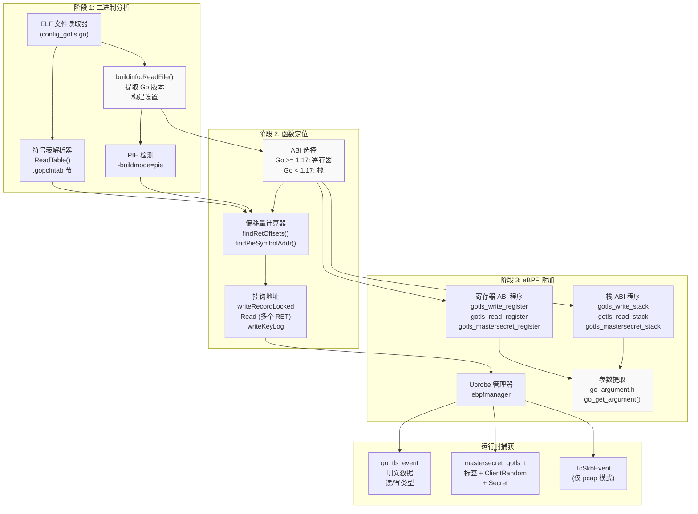

**来源：** [user/module/probe_gotls.go:58-122](https://github.com/gojue/ecapture/blob/0766a93b/user/module/probe_gotls.go#L58-L122), [user/config/config_gotls.go:95-190](https://github.com/gojue/ecapture/blob/0766a93b/user/config/config_gotls.go#L95-L190)

---

## Go 二进制分析与 ABI 检测

### ELF 结构解析

模块首先使用 Go 的 `debug/buildinfo` 和 `debug/elf` 包从目标 Go 二进制文件中提取元数据：

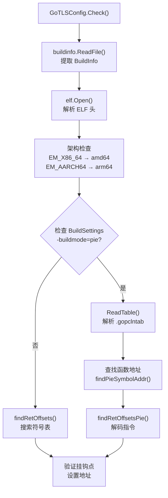

**关键数据结构：**

| 字段 | 类型 | 用途 |
|-------|------|---------|
| `Buildinfo` | `*buildinfo.BuildInfo` | Go 版本、构建设置、模块信息 |
| `goElf` | `*elf.File` | ELF 文件句柄，用于访问节/符号 |
| `goSymTab` | `*gosym.Table` | PIE 二进制文件的符号表 |
| `IsPieBuildMode` | `bool` | 指示 PIE 编译 |
| `ReadTlsAddrs` | `[]int` | Read uretprobe 的多个 RET 指令偏移量 |
| `GoTlsWriteAddr` | `uint64` | writeRecordLocked 函数地址 |
| `GoTlsMasterSecretAddr` | `uint64` | Config.writeKeyLog 函数地址 |

**来源：** [user/config/config_gotls.go:102-190](https://github.com/gojue/ecapture/blob/0766a93b/user/config/config_gotls.go#L102-L190)

### PIE 二进制文件的符号表解析

PIE 二进制文件需要特殊处理，因为符号未标记且经过重定位。模块使用魔数匹配定位 `.gopclntab` 节（或 PIE 的 `.data.rel.ro.gopclntab`）：

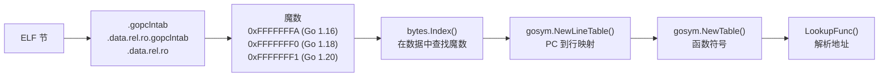

魔数因 Go 版本而异，以适应程序计数器行表格式的变化：

| Go 版本 | 魔数 | 十六进制值 |
|------------|--------------|-----------|
| < 1.16 | `go12magic` | `0xFFFFFFFB` |
| 1.16-1.17 | `go116magic` | `0xFFFFFFFA` |
| 1.18-1.19 | `go118magic` | `0xFFFFFFF0` |
| ≥ 1.20 | `go120magic` | `0xFFFFFFF1` |

**来源：** [user/config/config_gotls.go:46-69](https://github.com/gojue/ecapture/blob/0766a93b/user/config/config_gotls.go#L46-L69), [user/config/config_gotls.go:281-325](https://github.com/gojue/ecapture/blob/0766a93b/user/config/config_gotls.go#L281-L325)

### ABI 版本检测

Go 1.17 引入了基于寄存器的调用约定，从根本上改变了函数参数的传递方式。模块通过比较 Go 版本来检测这一点：

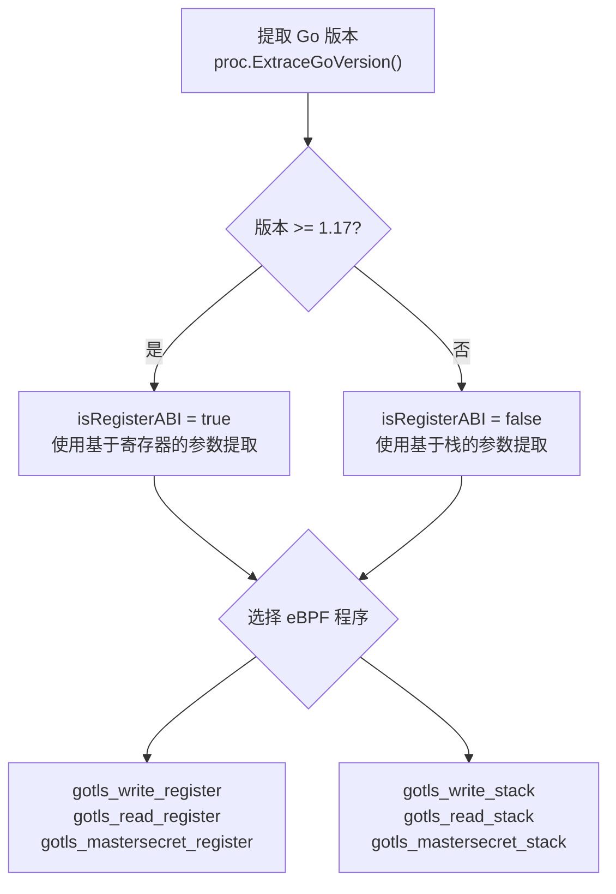

**来源：** [user/module/probe_gotls.go:71-79](https://github.com/gojue/ecapture/blob/0766a93b/user/module/probe_gotls.go#L71-L79), [user/module/probe_gotls_text.go:37-47](https://github.com/gojue/ecapture/blob/0766a93b/user/module/probe_gotls_text.go#L37-L47)

---

## 挂钩点与函数偏移量

### 目标函数

模块挂钩 `crypto/tls` 包中的三个关键函数：

| 函数 | 常量 | 用途 | 挂钩类型 |
|----------|----------|---------|-----------|
| `(*Conn).writeRecordLocked` | `GoTlsWriteFunc` | 写入 TLS 记录（明文数据） | Uprobe（入口） |
| `(*Conn).Read` | `GoTlsReadFunc` | 读取 TLS 记录（明文数据） | Uretprobe（返回） |
| `(*Config).writeKeyLog` | `GoTlsMasterSecretFunc` | 为密钥日志文件记录 TLS 密钥 | Uprobe（入口） |

**来源：** [user/config/config_gotls.go:31-35](https://github.com/gojue/ecapture/blob/0766a93b/user/config/config_gotls.go#L31-L35)

### RET 指令偏移量计算

对于 `Read` 函数 uretprobe，模块必须找到所有 RET 指令偏移量，因为用户空间的 uretprobe 被实现为 RET 指令上的 uprobe。PIE 与非 PIE 二进制文件的处理过程不同：

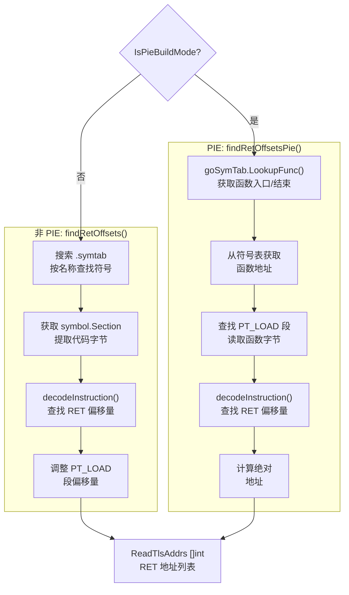

`decodeInstruction()` 函数是特定于架构的，搜索 RET 操作码（x86-64 上的 0xC3，ARM64 上的特定模式）。

**来源：** [user/config/config_gotls.go:196-262](https://github.com/gojue/ecapture/blob/0766a93b/user/config/config_gotls.go#L196-L262), [user/config/config_gotls.go:327-357](https://github.com/gojue/ecapture/blob/0766a93b/user/config/config_gotls.go#L327-L357)

---

## eBPF 程序与参数提取

### 基于寄存器与基于栈的 ABI 参数访问

核心挑战是提取函数参数，这在不同 ABI 之间有根本差异：

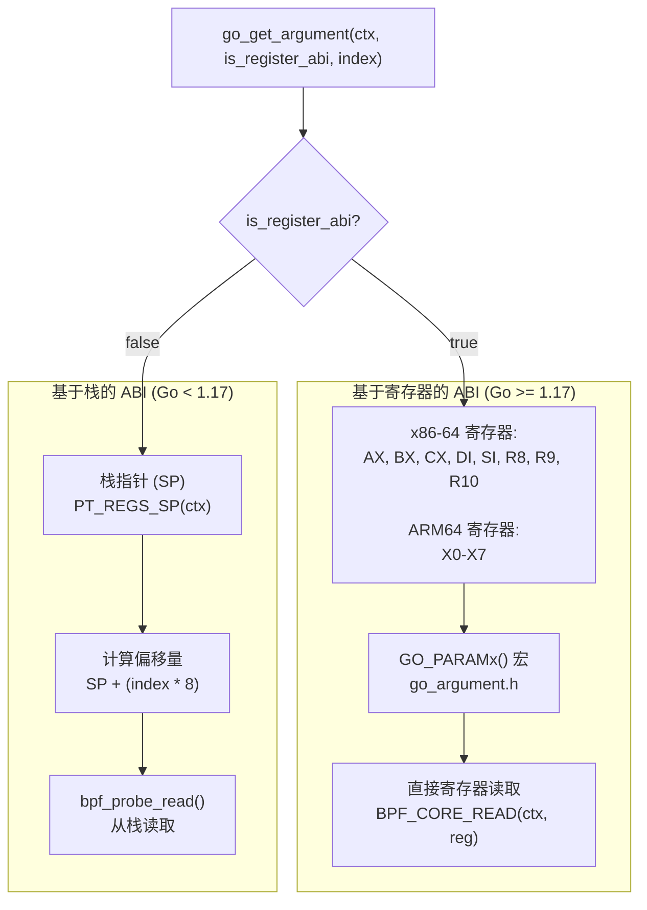

**x86-64 寄存器映射：**

| 参数索引 | 寄存器（寄存器 ABI） | 栈偏移量（栈 ABI） |
|----------------|------------------------|-------------------------|
| 1 | RAX | SP + 8 |
| 2 | RBX | SP + 16 |
| 3 | RCX | SP + 24 |
| 4 | RDI | SP + 32 |
| 5 | RSI | SP + 40 |
| 6 | R8 | SP + 48 |
| 7 | R9 | SP + 56 |
| 8 | R10 | SP + 64 |

**来源：** [kern/go_argument.h:74-108](https://github.com/gojue/ecapture/blob/0766a93b/kern/go_argument.h#L74-L108)

### 写入捕获（gotls_write）

`writeRecordLocked` 函数签名为：
```go
func (c *Conn) writeRecordLocked(typ recordType, data []byte) (int, error)
```

eBPF 程序提取：
- 参数 2：`recordType`（uint8）- 必须是 `recordTypeApplicationData`（23）
- 参数 3：`data` 指针（字节切片数组指针）
- 参数 4：`len`（int）- 数据长度

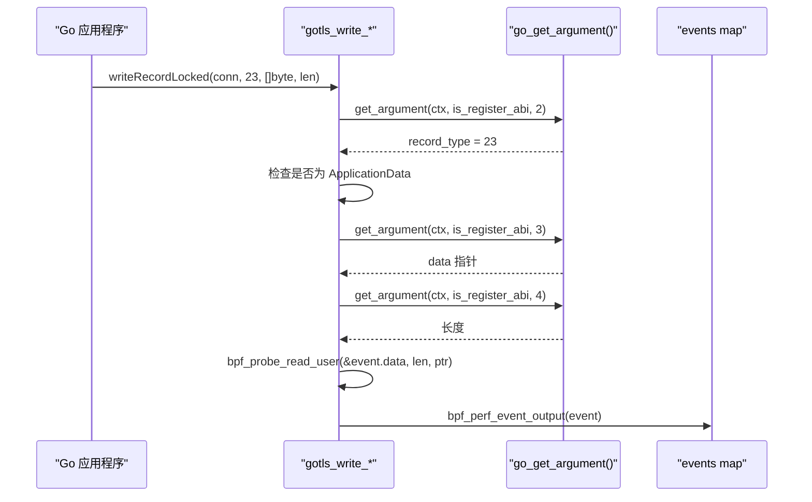

**事件结构：**

```c
struct go_tls_event {
    u64 ts_ns;              // 时间戳
    u32 pid;                // 进程 ID
    u32 tid;                // 线程 ID
    s32 data_len;           // 数据长度
    u8 event_type;          // 0=写入, 1=读取
    char comm[TASK_COMM_LEN]; // 进程名称
    char data[MAX_DATA_SIZE_OPENSSL]; // 明文数据
};
```

**来源：** [kern/gotls_kern.c:89-123](https://github.com/gojue/ecapture/blob/0766a93b/kern/gotls_kern.c#L89-L123), [kern/gotls_kern.c:31-39](https://github.com/gojue/ecapture/blob/0766a93b/kern/gotls_kern.c#L31-L39)

### 读取捕获（gotls_read）

`Read` 函数签名为：
```go
func (c *Conn) Read(b []byte) (int, error)
```

这使用 **uretprobe** 在读取完成后捕获数据。挑战在于在返回时，即使对于寄存器 ABI，参数也在栈上：

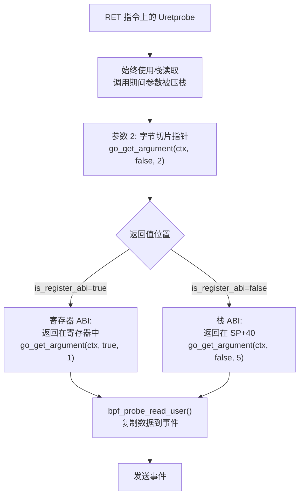

**来源：** [kern/gotls_kern.c:137-179](https://github.com/gojue/ecapture/blob/0766a93b/kern/gotls_kern.c#L137-L179)

### 主密钥捕获（gotls_mastersecret）

`writeKeyLog` 函数签名为：
```go
func (c *Config) writeKeyLog(label string, clientRandom, secret []byte) error
```

Go 切片表示为三字结构：`{指针, len, cap}`。eBPF 程序提取：

| 参数 | 索引 | 内容 |
|----------|-------|---------|
| label (string) | 2 | 标签指针 |
| label.len | 3 | 标签长度 |
| clientRandom ([]byte) | 4 | 客户端随机数指针 |
| clientRandom.len | 5 | 客户端随机数长度 |
| clientRandom.cap | 6 | （跳过） |
| secret ([]byte) | 7 | 密钥指针 |
| secret.len | 8 | 密钥长度 |

```c
struct mastersecret_gotls_t {
    u8 label[MASTER_SECRET_KEY_LEN];           // "CLIENT_RANDOM" 等
    u8 labellen;
    u8 client_random[EVP_MAX_MD_SIZE];         // 32 字节
    u8 client_random_len;
    u8 secret_[EVP_MAX_MD_SIZE];               // TLS 密钥
    u8 secret_len;
};
```

**来源：** [kern/gotls_kern.c:194-267](https://github.com/gojue/ecapture/blob/0766a93b/kern/gotls_kern.c#L194-L267), [kern/gotls_kern.c:41-48](https://github.com/gojue/ecapture/blob/0766a93b/kern/gotls_kern.c#L41-L48)

---

## 捕获模式

模块支持三种捕获模式，每种模式都有不同的 eBPF 程序配置：

### 文本模式

捕获明文数据以进行即时控制台输出或日志记录。

**设置：**
- 挂钩：`writeRecordLocked`（uprobe）、`Read`（多个 uretprobe）
- 映射：`events`（用于 `go_tls_event` 的性能数组）
- 无 TC 程序

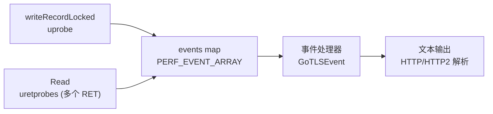

**来源：** [user/module/probe_gotls_text.go:31-118](https://github.com/gojue/ecapture/blob/0766a93b/user/module/probe_gotls_text.go#L31-L118), [user/module/probe_gotls_text.go:120-135](https://github.com/gojue/ecapture/blob/0766a93b/user/module/probe_gotls_text.go#L120-L135)

### 密钥日志模式

捕获 TLS 主密钥，用于使用外部工具（Wireshark 等）进行解密。

**设置：**
- 挂钩：仅 `writeKeyLog`（uprobe）
- 映射：`mastersecret_go_events`（用于 `mastersecret_gotls_t` 的性能数组）
- 输出：SSLKEYLOGFILE 格式

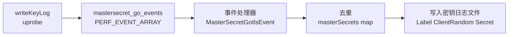

主密钥使用键 `{label}-{clientRandom}` 进行去重，以防止同一 TLS 会话出现重复条目。

**来源：** [user/module/probe_gotls_keylog.go:31-122](https://github.com/gojue/ecapture/blob/0766a93b/user/module/probe_gotls_keylog.go#L31-L122), [user/module/probe_gotls.go:236-275](https://github.com/gojue/ecapture/blob/0766a93b/user/module/probe_gotls.go#L236-L275)

### PCAP 模式

捕获明文数据和网络数据包以进行完整的流量重建。

**设置：**
- 挂钩：`writeKeyLog`（uprobe）、TC ingress/egress 分类器
- 映射：`mastersecret_go_events`、`packet_events`、连接跟踪映射
- 输出：带有 DSB（解密密钥块）的 PCAP-NG

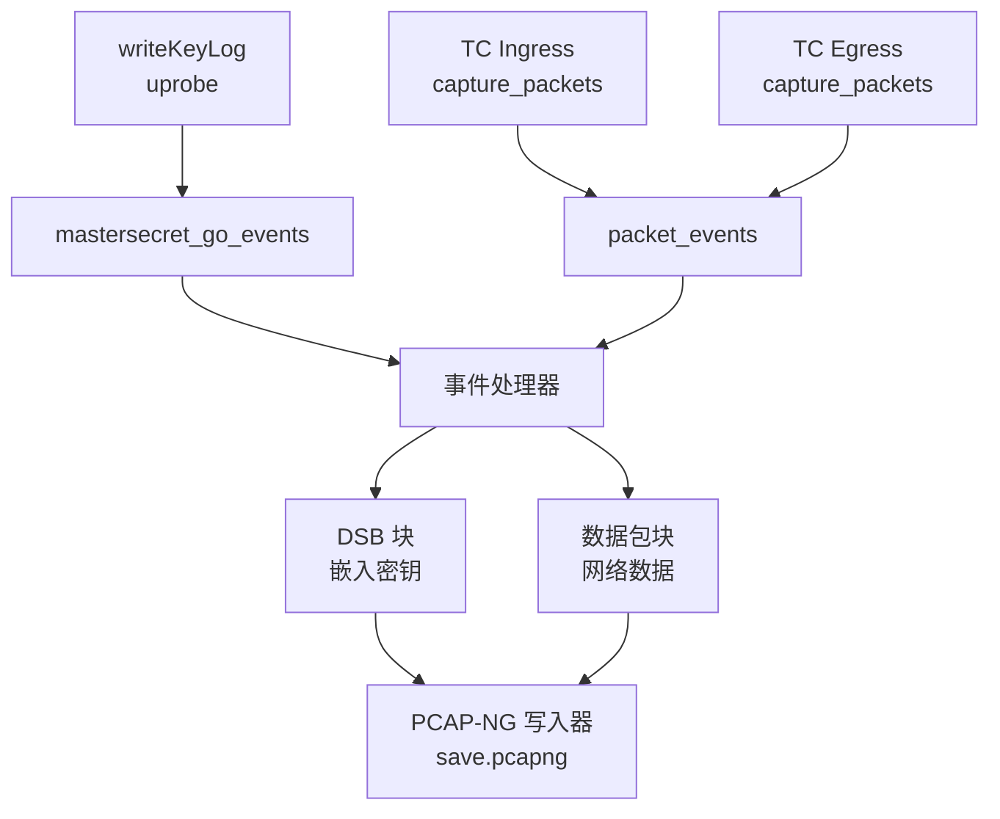

TC 分类器使用连接跟踪（参见 [网络连接跟踪](../2-architecture/2.6-network-connection-tracking.md)）将数据包与进程关联。

**来源：** [user/module/probe_gotls_pcap.go](https://github.com/gojue/ecapture/blob/0766a93b/user/module/probe_gotls_pcap.go)

---

## 配置与命令行界面

### 配置结构

`GoTLSConfig` 结构集中了所有模块设置：

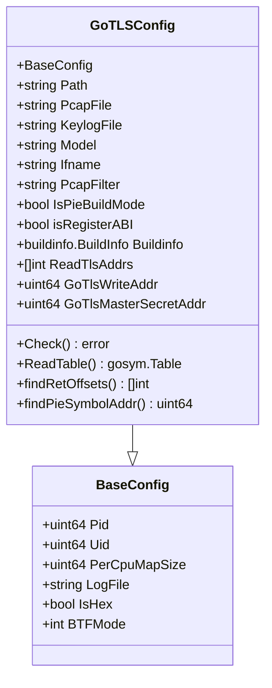

**来源：** [user/config/config_gotls.go:76-93](https://github.com/gojue/ecapture/blob/0766a93b/user/config/config_gotls.go#L76-L93)

### 命令行界面命令

`gotls` 子命令提供用户界面：

```bash
# 基本文本捕获
ecapture gotls --elfpath=/path/to/go_binary

# 带过滤的密钥日志模式
ecapture gotls -m keylog -k /tmp/keys.log --elfpath=/path/to/go_binary --pid=1234

# 带网络接口的 PCAP 模式
ecapture gotls -m pcap -w capture.pcapng -i eth0 --elfpath=/path/to/go_binary tcp port 443
```

**标志映射：**

| 标志 | 配置字段 | 默认值 | 用途 |
|------|--------------|---------|---------|
| `-e, --elfpath` | `Path` | （必需） | Go 二进制文件路径 |
| `-m, --model` | `Model` | `text` | 捕获模式：text/pcap/keylog |
| `-w, --pcapfile` | `PcapFile` | `ecapture_gotls.pcapng` | PCAP 输出文件 |
| `-k, --keylogfile` | `KeylogFile` | `ecapture_gotls_key.log` | 密钥日志输出文件 |
| `-i, --ifname` | `Ifname` | （pcap 必需） | 网络接口 |
| `--pid` | `Pid` | 0（全部） | 目标进程 ID |

**来源：** [cli/cmd/gotls.go:26-58](https://github.com/gojue/ecapture/blob/0766a93b/cli/cmd/gotls.go#L26-L58)

---

## 事件处理与输出

### 事件分发器

`Dispatcher` 方法根据类型路由事件：

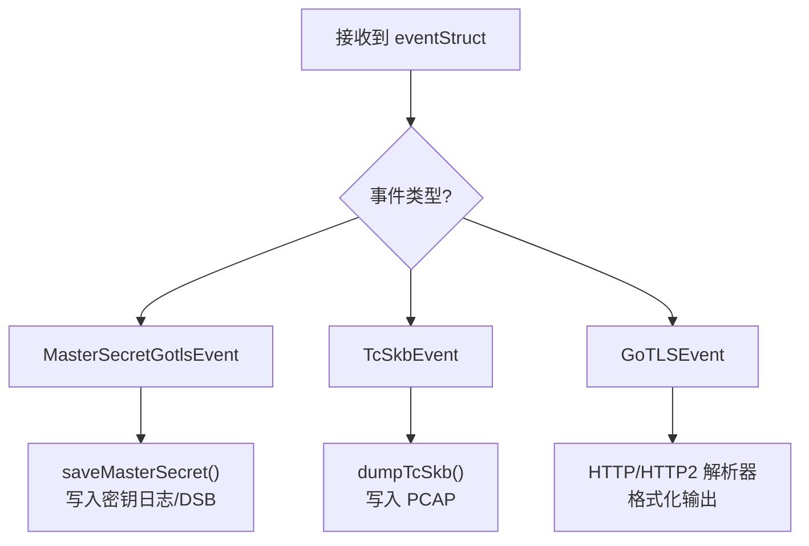

**来源：** [user/module/probe_gotls.go:277-288](https://github.com/gojue/ecapture/blob/0766a93b/user/module/probe_gotls.go#L277-L288)

### 主密钥去重

主密钥进行去重以防止多次写入相同的密钥：

```go
// 键格式："LABEL-CLIENTRANDOM"
// 例如，"CLIENT_RANDOM-6a7b8c9d..."
k := fmt.Sprintf("%s-%02x", label, clientRandom)

_, exists := g.masterSecrets[k]
if exists {
    return // 跳过重复
}
g.masterSecrets[k] = true
```

这确保了重复的 TLS 握手（例如，带有会话恢复的 HTTP/2）不会产生冗余的密钥日志条目。

**来源：** [user/module/probe_gotls.go:242-248](https://github.com/gojue/ecapture/blob/0766a93b/user/module/probe_gotls.go#L242-L248)

---

## 构建系统集成

该模块与 eCapture 的双路径 eBPF 编译集成：

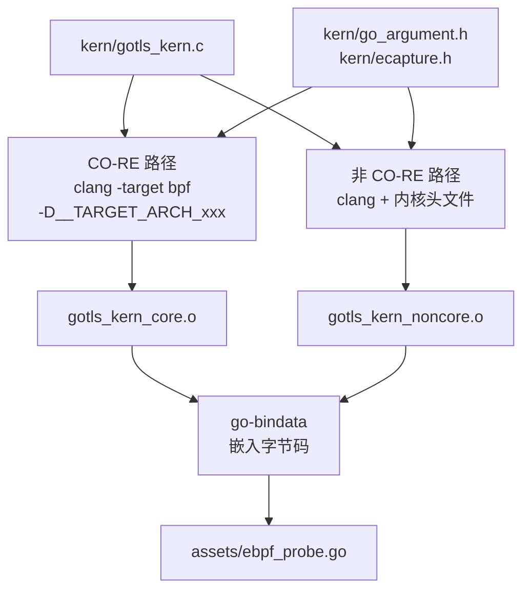

模块在运行时通过 `geteBPFName()` 根据内核 BTF 支持选择字节码。

**来源：** 有关全面的构建系统文档，请参见 [构建系统](../5-development-guide/5.1-build-system.md)。

---

## 错误处理与边缘情况

### 常见失败场景

| 问题 | 检测 | 缓解措施 |
|-------|-----------|-----------|
| 不是 Go 二进制文件 | `buildinfo.ReadFile()` 失败 | 返回 `ErrNotGoCompiledBin` |
| 架构不匹配 | `runtime.GOARCH != goElfArch` | 返回架构错误 |
| 剥离的 PIE 二进制文件 | 未找到符号表 | 返回 `ErrorSymbolNotFoundFromTable` |
| 未找到 RET 指令 | `decodeInstruction()` 返回空 | 返回 `ErrorNoRetFound` |
| 未找到函数 | `LookupFunc()` 返回 nil | 返回 `ErrorNoFuncFoundFromSymTabFun` |

**来源：** [user/config/config_gotls.go:37-44](https://github.com/gojue/ecapture/blob/0766a93b/user/config/config_gotls.go#L37-L44), [user/module/probe_gotls.go:40](https://github.com/gojue/ecapture/blob/0766a93b/user/module/probe_gotls.go#L40)

### PIE 二进制文件挑战

PIE 二进制文件带来了独特的挑战：
1. **重定位符号**：地址是相对的，需要运行时计算
2. **隐藏节**：`.gopclntab` 可能在 `.data.rel.ro` 中未标记
3. **魔数搜索**：必须扫描节数据以查找 pclntab 签名
4. **地址转换**：必须考虑 `PT_LOAD` 段虚拟地址

模块通过直接解析符号表并使用 `gosym.Table.LookupFunc()` 进行地址解析来处理这些问题。

**来源：** [user/config/config_gotls.go:281-325](https://github.com/gojue/ecapture/blob/0766a93b/user/config/config_gotls.go#L281-L325), [user/config/config_gotls.go:327-357](https://github.com/gojue/ecapture/blob/0766a93b/user/config/config_gotls.go#L327-L357)

---

## 总结

Go TLS 模块展示了针对 Go 独特运行时特性量身定制的复杂二进制插桩技术。通过解析 ELF 结构、检测 ABI 约定和挂钩 crypto/tls 函数，它可以在无需源代码修改或动态库注入的情况下捕获 TLS 流量。该模块对传统的基于栈的和现代的基于寄存器的 ABI 的支持确保了从 Go 1.0 到当前版本的兼容性。

有关使用动态库的相关 TLS 捕获技术，请参见 OpenSSL 模块（[OpenSSL 模块](3.1.1-openssl-module.md)）。有关适用于两个模块的主密钥提取详细信息，请参见 [主密钥提取](3.1.4-master-secret-extraction.md)。