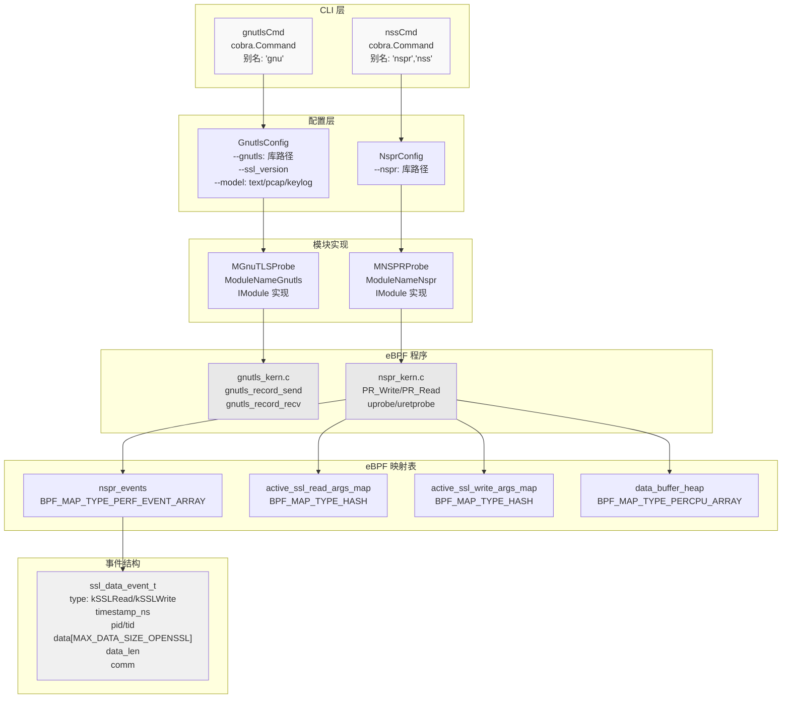
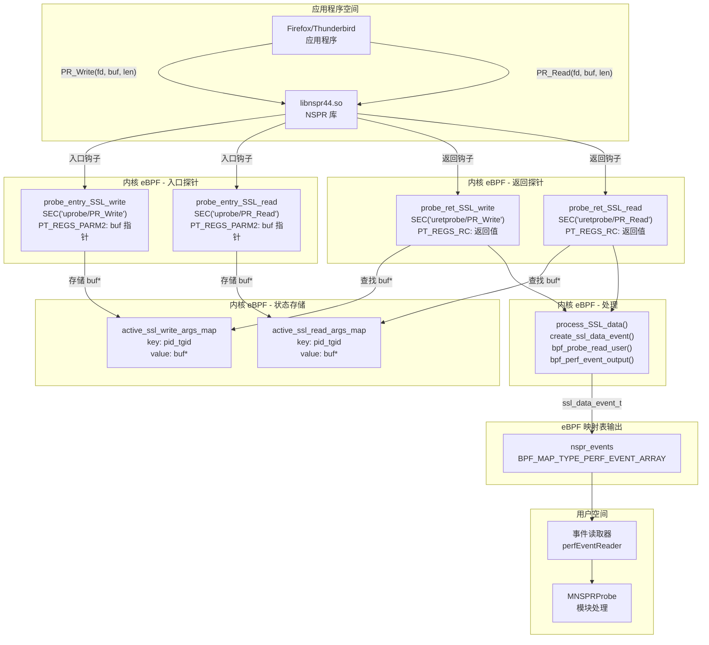
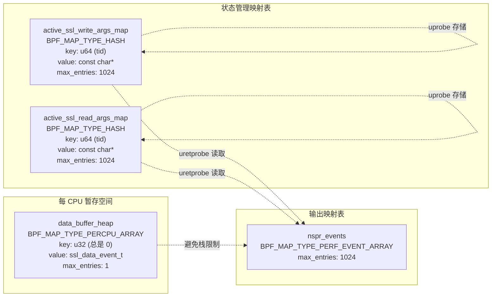
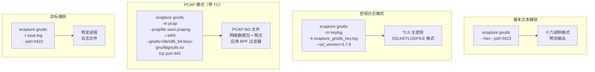
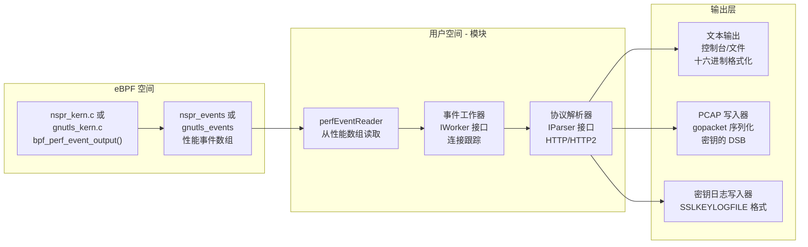

# GnuTLS 与 NSS 模块

## 目的与范围

本文档描述 eCapture 中的 GnuTLS 和 NSS/NSPR 捕获模块。这些模块为使用 GnuTLS 和 NSS/NSPR 加密库的应用程序提供 TLS/SSL 明文捕获功能，与 OpenSSL 模块（参见 [OpenSSL 模块](3.1.1-openssl-module.md)）和 GoTLS 模块（参见 [Go TLS 模块](3.1.2-go-tls-module.md)）形成互补。两个模块都使用 eBPF uprobe 来拦截各自库中的读/写函数，在加密前和解密后提取明文数据。

GnuTLS 模块针对使用 GnuTLS 库构建的应用程序（通常由 wget、curl 变体和其他 GNU 工具使用），而 NSS/NSPR 模块针对使用 Mozilla 的网络安全服务（NSS）和 Netscape 可移植运行时（NSPR）库的应用程序，最著名的是 Firefox 和 Thunderbird。

有关所有模块的 TLS 主密钥提取信息，请参见[主密钥提取](3.1.4-master-secret-extraction.md)。有关输出格式详细信息，请参见[输出格式](../4-output-formats/index.md)。

---

## 模块架构

两个模块都遵循 eCapture 的标准模块模式，实现 `IModule` 接口（参见[模块系统与生命周期](../2-architecture/2.4-module-system-and-lifecycle.md)）。它们与 OpenSSL 模块共享相似的架构模式，但针对不同的库函数签名。



**模块架构概览**：两个模块都集成到 eCapture 的 CLI 和模块系统中。GnuTLS 模块提供更全面的配置选项，包括捕获模式（text/pcap/keylog），而 NSPR 模块则专注于文本捕获。两者都使用 eBPF uprobe 来拦截库 I/O 函数，并使用性能事件数组将数据流式传输到用户空间。

**来源**：[cli/cmd/gnutls.go:1-65](https://github.com/gojue/ecapture/blob/0766a93b/cli/cmd/gnutls.go#L1-L65), [cli/cmd/nspr.go:1-52](https://github.com/gojue/ecapture/blob/0766a93b/cli/cmd/nspr.go#L1-L52), [kern/nspr_kern.c:1-218](https://github.com/gojue/ecapture/blob/0766a93b/kern/nspr_kern.c#L1-L218)

---

## 目标库

### GnuTLS

GnuTLS 是 TLS、SSL 和 DTLS 协议的自由软件实现。它提供了用于安全通信的高级 API，常用于：

- **GNU wget**：网络下载器
- **curl（GnuTLS 变体）**：命令行 HTTP 客户端
- **各种 GNU 工具**：需要安全网络的应用程序

该模块针对核心 I/O 函数：
- `gnutls_record_send()`：发送加密数据
- `gnutls_record_recv()`：接收并解密数据

### NSS/NSPR

网络安全服务（NSS）和 Netscape 可移植运行时（NSPR）是 Mozilla 开发的加密库：

- **NSS**：提供加密操作、证书处理和 SSL/TLS
- **NSPR**：提供 I/O、线程和其他系统操作的平台抽象

主要应用程序：
- **Mozilla Firefox**：网络浏览器
- **Mozilla Thunderbird**：电子邮件客户端
- **Chrome/Chromium（旧版本）**：网络浏览器
- **各种基于 Mozilla 的应用程序**

该模块针对 NSPR I/O 函数：
- `PR_Write()`：向文件描述符写入数据
- `PR_Read()`：从文件描述符读取数据

**来源**：[cli/cmd/gnutls.go:35-36](https://github.com/gojue/ecapture/blob/0766a93b/cli/cmd/gnutls.go#L35-L36), [cli/cmd/nspr.go:33-34](https://github.com/gojue/ecapture/blob/0766a93b/cli/cmd/nspr.go#L33-L34), [kern/nspr_kern.c:110-113](https://github.com/gojue/ecapture/blob/0766a93b/kern/nspr_kern.c#L110-L113)

---

## NSPR/NSS 模块实现

NSPR 模块展示了 eCapture 对特定库的 TLS 捕获方法。该实现使用 uprobe 入口/退出对在入口时捕获缓冲区指针，在返回时提取数据。

### 钩子点与数据流



**NSPR 钩子实现**：该模块使用两阶段方法。入口探针（`probe_entry_SSL_write`、`probe_entry_SSL_read`）捕获缓冲区指针并将它们存储在以线程 ID 为键的哈希映射中。返回探针（`probe_ret_SSL_write`、`probe_ret_SSL_read`）检索存储的指针，检查返回值是否成功，并使用 `process_SSL_data()` 提取明文并发出事件。这种模式确保仅在成功的 I/O 操作后捕获缓冲区内容。

**来源**：[kern/nspr_kern.c:114-217](https://github.com/gojue/ecapture/blob/0766a93b/kern/nspr_kern.c#L114-L217)

### 事件结构

NSPR 模块对读和写操作使用统一的事件结构：

| 字段 | 类型 | 描述 |
|-------|------|-------------|
| `type` | `enum ssl_data_event_type` | `kSSLRead` (0) 或 `kSSLWrite` (1) |
| `timestamp_ns` | `u64` | 来自 `bpf_ktime_get_ns()` 的事件时间戳 |
| `pid` | `u32` | 进程 ID（`pid_tgid` 的高 32 位） |
| `tid` | `u32` | 线程 ID（`pid_tgid` 的低 32 位） |
| `data` | `char[MAX_DATA_SIZE_OPENSSL]` | 捕获的明文数据 |
| `data_len` | `s32` | 实际数据长度（最大为 `MAX_DATA_SIZE_OPENSSL`） |
| `comm` | `char[TASK_COMM_LEN]` | 来自 `bpf_get_current_comm()` 的进程命令名 |

**来源**：[kern/nspr_kern.c:19-27](https://github.com/gojue/ecapture/blob/0766a93b/kern/nspr_kern.c#L19-L27)

### eBPF 映射表配置

NSPR 模块使用四个 eBPF 映射表：



**eBPF 映射表设计**：`data_buffer_heap` 使用 `BPF_MAP_TYPE_PERCPU_ARRAY` 来规避 eBPF 的 512 字节栈限制。每个 CPU 获得自己的 `ssl_data_event_t` 实例用于事件构造。`active_ssl_*_args_map` 哈希映射在 uprobe 入口和返回之间提供临时存储，使用线程 ID 作为键来处理并发操作。

**来源**：[kern/nspr_kern.c:29-62](https://github.com/gojue/ecapture/blob/0766a93b/kern/nspr_kern.c#L29-L62)

---

## GnuTLS 模块实现

GnuTLS 模块遵循与 NSPR 类似的架构模式，但针对不同的库函数并提供更全面的捕获模式。

### 库检测与版本处理

GnuTLS CLI 命令通过 `--ssl_version` 标志支持特定于版本的行为：

```bash
ecapture gnutls --ssl_version=3.7.9
```

这允许模块适应不同的 GnuTLS API 版本和结构布局。如果未指定路径，该模块会自动搜索 `libgnutls.so`。

**来源**：[cli/cmd/gnutls.go:54](https://github.com/gojue/ecapture/blob/0766a93b/cli/cmd/gnutls.go#L54)

### 捕获模式

GnuTLS 模块通过 `--model` 标志支持三种捕获模式：

| 模式 | 描述 | 输出 |
|------|-------------|--------|
| `text` | 直接明文捕获 | 控制台/日志文件，带 HTTP/HTTP2 解析 |
| `pcap`/`pcapng` | 网络数据包捕获（含明文） | 与 Wireshark 兼容的 PCAP-NG 文件 |
| `key`/`keylog` | TLS 主密钥 | 用于解密的 SSLKEYLOGFILE 格式 |

**来源**：[cli/cmd/gnutls.go:50-53](https://github.com/gojue/ecapture/blob/0766a93b/cli/cmd/gnutls.go#L50-L53)

### CLI 使用示例



**GnuTLS CLI 模式**：该命令支持灵活的定向（按 PID/UID）、自定义库路径、基于 TC 的数据包捕获的网络接口附加，以及 PCAP 模式的 BPF 过滤器表达式。密钥日志模式支持使用 Wireshark 等标准工具对捕获的流量进行离线解密。

**来源**：[cli/cmd/gnutls.go:36-43](https://github.com/gojue/ecapture/blob/0766a93b/cli/cmd/gnutls.go#L36-L43)

---

## 过滤与定向

两个模块都在 eBPF 级别实现 PID 和 UID 过滤，以实现高效的事件处理：

```c
#ifndef KERNEL_LESS_5_2
    // if target_ppid is 0 then we target all pids
    if (target_pid != 0 && target_pid != pid) {
        return 0;
    }
    if (target_uid != 0 && target_uid != uid) {
        return 0;
    }
#endif
```

这种过滤模式出现在所有钩子函数中，在捕获任何数据之前在内核空间中操作，最大限度地减少性能开销。条件编译（`#ifndef KERNEL_LESS_5_2`）表明用于过滤的全局变量仅在 5.2+ 版本的内核中可用。

**来源**：[kern/nspr_kern.c:122-130](https://github.com/gojue/ecapture/blob/0766a93b/kern/nspr_kern.c#L122-L130), [kern/nspr_kern.c:147-153](https://github.com/gojue/ecapture/blob/0766a93b/kern/nspr_kern.c#L147-L153), [kern/nspr_kern.c:177-185](https://github.com/gojue/ecapture/blob/0766a93b/kern/nspr_kern.c#L177-L185), [kern/nspr_kern.c:200-208](https://github.com/gojue/ecapture/blob/0766a93b/kern/nspr_kern.c#L200-L208)

---

## 数据捕获实现

### 缓冲区大小管理

两个模块都使用具有按位掩码的大小限制缓冲区以确保安全：

```c
// NSPR 模块数据捕获
event->data_len = (len < MAX_DATA_SIZE_OPENSSL ? 
                   (len & (MAX_DATA_SIZE_OPENSSL - 1)) : 
                   MAX_DATA_SIZE_OPENSSL);
bpf_probe_read_user(event->data, event->data_len, buf);
```

按位与操作 `(len & (MAX_DATA_SIZE_OPENSSL - 1))` 确保即使由于验证器限制导致比较失败，大小也不会超过缓冲区。这种模式在 eCapture 的 eBPF 程序中很常见，用于 eBPF 验证器合规性。

**来源**：[kern/nspr_kern.c:100-101](https://github.com/gojue/ecapture/blob/0766a93b/kern/nspr_kern.c#L100-L101)

### 事件创建与输出

NSPR 模块使用辅助函数从每 CPU 暂存空间创建事件：

```c
static __inline struct ssl_data_event_t* create_ssl_data_event(u64 current_pid_tgid) {
    u32 kZero = 0;
    struct ssl_data_event_t* event = bpf_map_lookup_elem(&data_buffer_heap, &kZero);
    if (event == NULL) {
        return NULL;
    }
    
    const u32 kMask32b = 0xffffffff;
    event->timestamp_ns = bpf_ktime_get_ns();
    event->pid = current_pid_tgid >> 32;
    event->tid = current_pid_tgid & kMask32b;
    return event;
}
```

此函数通过使用每 CPU 数组映射来避免栈分配，规避 512 字节 eBPF 栈限制。然后通过 `bpf_perf_event_output()` 将事件输出到 `nspr_events` 性能数组。

**来源**：[kern/nspr_kern.c:68-80](https://github.com/gojue/ecapture/blob/0766a93b/kern/nspr_kern.c#L68-L80), [kern/nspr_kern.c:103](https://github.com/gojue/ecapture/blob/0766a93b/kern/nspr_kern.c#L103)

---

## 与事件处理流程的集成

两个模块都与 eCapture 的事件处理系统集成（参见[事件处理流程](../2-architecture/2.2-event-processing-pipeline.md)）：



**事件处理集成**：事件从 eBPF 程序通过性能数组流向模块的事件读取器。工作器层管理连接状态和生命周期，而解析器解码协议数据（HTTP/HTTP2）。输出处理器根据所选模式（text/pcap/keylog）格式化数据。

**来源**：[cli/cmd/gnutls.go:50-53](https://github.com/gojue/ecapture/blob/0766a93b/cli/cmd/gnutls.go#L50-L53), [cli/cmd/nspr.go:34-39](https://github.com/gojue/ecapture/blob/0766a93b/cli/cmd/nspr.go#L34-L39)

---

## 与其他 TLS 模块的比较

下表比较了 GnuTLS 和 NSS 模块与其他 TLS 捕获模块：

| 功能 | OpenSSL | GoTLS | GnuTLS | NSS/NSPR |
|---------|---------|-------|--------|----------|
| **主要目标** | OpenSSL/BoringSSL 应用 | Go TLS 应用 | GNU 工具 | Mozilla 应用 |
| **钩子函数** | SSL_read/SSL_write | crypto/tls.Conn.Read/Write | gnutls_record_recv/send | PR_Read/PR_Write |
| **版本检测** | 广泛（1.0.x-3.5.x） | Go 版本 + ABI | 可选 | 可选 |
| **主密钥提取** | 是（TLS 1.2/1.3） | 是 | 是 | 受限 |
| **PCAP 模式** | 是（带 TC） | 是（带 TC） | 是（带 TC） | 受限 |
| **密钥日志格式** | 是 | 是 | 是 | 否 |
| **Android 支持** | 是（BoringSSL） | 否 | 否 | 否 |
| **CLI 复杂度** | 高 | 中 | 中 | 低 |

**模块比较**：由于版本碎片化较少，GnuTLS 和 NSS 模块提供了比 OpenSSL 更简单的实现。NSS 模块是最小的，专注于基本文本捕获。GnuTLS 提供了一个折中方案，支持密钥日志和 PCAP，但不需要 OpenSSL 所需的大量特定于版本的字节码变体。

**来源**：[cli/cmd/tls.go:1-68](https://github.com/gojue/ecapture/blob/0766a93b/cli/cmd/tls.go#L1-L68), [cli/cmd/gotls.go:1-59](https://github.com/gojue/ecapture/blob/0766a93b/cli/cmd/gotls.go#L1-L59), [cli/cmd/gnutls.go:1-65](https://github.com/gojue/ecapture/blob/0766a93b/cli/cmd/gnutls.go#L1-L65), [cli/cmd/nspr.go:1-52](https://github.com/gojue/ecapture/blob/0766a93b/cli/cmd/nspr.go#L1-L52)

---

## 构建系统集成

两个模块都根据平台有条件地编译：

```go
//go:build !androidgki
// +build !androidgki
```

此构建标记将 GnuTLS 和 NSS 模块从 Android 构建中排除，因为这些库通常在 Android 平台上不可用。OpenSSL/BoringSSL 模块处理 Android 的 TLS 需求。

模块与 eCapture 的构建系统集成：
- **eBPF 编译**：通过 Makefile 编译 `kern/gnutls_kern.c` 和 `kern/nspr_kern.c`
- **CO-RE 支持**：两者都支持启用 BTF 的内核以实现可移植性
- **非 CO-RE 回退**：为旧系统提供基于内核头文件的编译
- **资源嵌入**：通过 go-bindata 将字节码嵌入到最终二进制文件中

**来源**：[cli/cmd/gnutls.go:1-2](https://github.com/gojue/ecapture/blob/0766a93b/cli/cmd/gnutls.go#L1-L2), [cli/cmd/nspr.go:1-2](https://github.com/gojue/ecapture/blob/0766a93b/cli/cmd/nspr.go#L1-L2)

---

## 使用示例

### 捕获 Firefox 流量（NSS）

```bash
# 带十六进制输出的基本捕获
ecapture nspr --hex --pid=$(pgrep firefox)

# 保存到日志文件
ecapture nspr -l firefox_capture.log --pid=$(pgrep firefox)

# 手动指定 NSPR 库路径
ecapture nspr --nspr=/usr/lib/x86_64-linux-gnu/libnspr4.so
```

### 捕获 wget 流量（GnuTLS）

```bash
# 文本模式（自动库检测）
ecapture gnutls

# PCAP 模式（带网络接口和 BPF 过滤器）
ecapture gnutls -m pcap --pcapfile wget_traffic.pcapng -i eth0 \
  --gnutls=/lib/x86_64-linux-gnu/libgnutls.so.30 \
  tcp port 443

# 密钥日志模式（用于离线解密）
ecapture gnutls -m keylog -k gnutls_keys.log --ssl_version=3.7.9

# 按 PID 定向捕获
ecapture gnutls --pid=$(pgrep wget) -l wget_output.log
```

### 高级过滤

```bash
# 仅捕获特定用户的流量
ecapture gnutls --uid=1000

# 带复杂 BPF 过滤器的 PCAP
ecapture gnutls -m pcap -w capture.pcapng -i wlan0 \
  "host 192.168.1.100 and tcp port 443"
```

**来源**：[cli/cmd/nspr.go:35-39](https://github.com/gojue/ecapture/blob/0766a93b/cli/cmd/nspr.go#L35-L39), [cli/cmd/gnutls.go:36-43](https://github.com/gojue/ecapture/blob/0766a93b/cli/cmd/gnutls.go#L36-L43)

---

## 限制与注意事项

### NSS/NSPR 模块限制

1. **无 PCAP 模式**：与 GnuTLS 不同，NSPR 模块不支持 PCAP 输出模式
2. **无密钥日志支持**：未实现主密钥提取
3. **有限配置**：与其他 TLS 模块相比，CLI 选项较少
4. **NSPR 特定**：仅通过 PR_Read/PR_Write 捕获数据，不捕获 NSS 的更高级别函数

### GnuTLS 模块限制

1. **版本敏感性**：某些 GnuTLS 版本可能具有不同的结构布局
2. **采用率有限**：使用 GnuTLS 的应用程序比使用 OpenSSL 的少
3. **主密钥提取复杂性**：TLS 1.3 密钥需要特定于版本的偏移量

### 一般注意事项

- **库检测**：如果库位于非标准路径，自动检测可能会失败
- **性能开销**：从繁忙的应用程序（如 Firefox）捕获所有流量可能会生成大量数据
- **内核版本**：某些功能需要内核 5.2+ 以支持全局变量
- **BTF 要求**：CO-RE 模式需要带有 BTF 支持的内核

**来源**：[cli/cmd/nspr.go:43-45](https://github.com/gojue/ecapture/blob/0766a93b/cli/cmd/nspr.go#L43-L45), [cli/cmd/gnutls.go:47-55](https://github.com/gojue/ecapture/blob/0766a93b/cli/cmd/gnutls.go#L47-L55), [kern/nspr_kern.c:122-130](https://github.com/gojue/ecapture/blob/0766a93b/kern/nspr_kern.c#L122-L130)

---

## 相关模块

要在不同应用程序和库之间实现全面的 TLS 捕获覆盖：

- **[OpenSSL 模块](3.1.1-openssl-module.md)**：OpenSSL/BoringSSL 应用程序的主要模块
- **[Go TLS 模块](3.1.2-go-tls-module.md)**：使用 crypto/tls 的 Go 应用程序的专用模块
- **[主密钥提取](3.1.4-master-secret-extraction.md)**：深入探讨 TLS 密钥材料提取
- **[TC 网络数据包捕获](3.3-network-packet-capture-with-tc.md)**：带进程归属的网络级数据包捕获

GnuTLS 和 NSS 模块将 eCapture 的覆盖范围扩展到 OpenSSL 生态系统之外的应用程序，实现跨多样化应用程序栈的全面 TLS 可观测性。