# Go TLS 模块

## 目的与范围

Go TLS 模块通过钩住 Go 标准库 `crypto/tls` 包中的函数，捕获使用 Go 工具链编译的应用程序的 TLS/SSL 明文流量。与钩住共享库函数的 OpenSSL 和 BoringSSL 模块不同，该模块直接将 uprobe 附加到 Go 二进制可执行文件中的函数上。

本页涵盖 Go 特定的 TLS 捕获实现，包括 Go 版本检测、调用约定（ABI）检测和函数钩子机制。有关一般 TLS 捕获概念，请参阅 [TLS/SSL 捕获模块](3.1-tlsssl-capture-modules.md)。有关其他 TLS 库，请参阅 [OpenSSL 模块](3.1.1-openssl-module.md)、[BoringSSL 模块](3.1.2-boringssl-module.md) 和 [GnuTLS 与 NSS 模块](3.1.4-gnutls-and-nss-modules.md)。

**来源:** [user/module/probe_gotls.go:1-312](https://github.com/gojue/ecapture/blob/ca085d05/user/module/probe_gotls.go#L1-L312), [README.md (inferred)]()

---

## 架构概览

Go TLS 模块遵循三阶段方法：检测 Go 版本和调用约定，定位二进制文件中的目标函数，并附加 uprobe 以捕获明文数据和主密钥。

### 系统组件

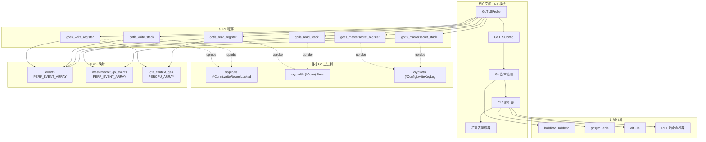

**来源:** [user/module/probe_gotls.go:43-56](https://github.com/gojue/ecapture/blob/ca085d05/user/module/probe_gotls.go#L43-L56), [kern/gotls_kern.c:50-87](https://github.com/gojue/ecapture/blob/ca085d05/kern/gotls_kern.c#L50-L87), [user/config/config_gotls.go:77-94](https://github.com/gojue/ecapture/blob/ca085d05/user/config/config_gotls.go#L77-L94)

---

## Go 版本和 ABI 检测

### 版本检测过程

该模块使用 `debug/buildinfo` 包从目标二进制文件中提取 Go 版本，该包从 Go 可执行文件中读取嵌入的构建信息。

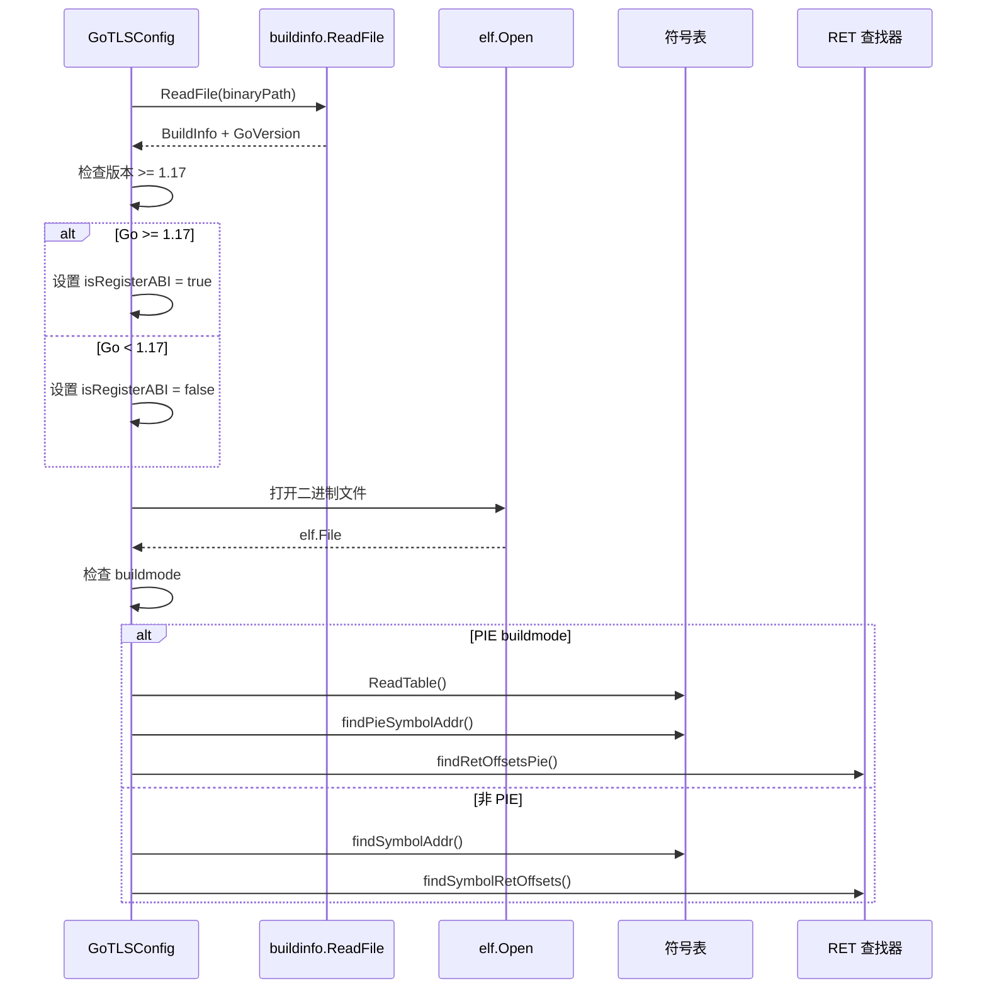

关键的版本边界是 **Go 1.17**，它通过内部 ABI 规范引入了基于寄存器的调用约定。之前的版本使用基于栈的参数传递。

**来源:** [user/module/probe_gotls.go:71-79](https://github.com/gojue/ecapture/blob/ca085d05/user/module/probe_gotls.go#L71-L79), [user/config/config_gotls.go:103-213](https://github.com/gojue/ecapture/blob/ca085d05/user/config/config_gotls.go#L103-L213)

### ABI 检测

| Go 版本 | 调用约定 | eBPF 程序后缀 | 参数提取 |
|------------|-------------------|-------------------|-------------------|
| < 1.17 | 基于栈 | `_stack` | 从栈指针读取（SP + offset * 8） |
| >= 1.17 | 基于寄存器 | `_register` | 从 CPU 寄存器读取（AX、BX、CX、DI、SI、R8-R11） |

**寄存器映射（x86_64）：**

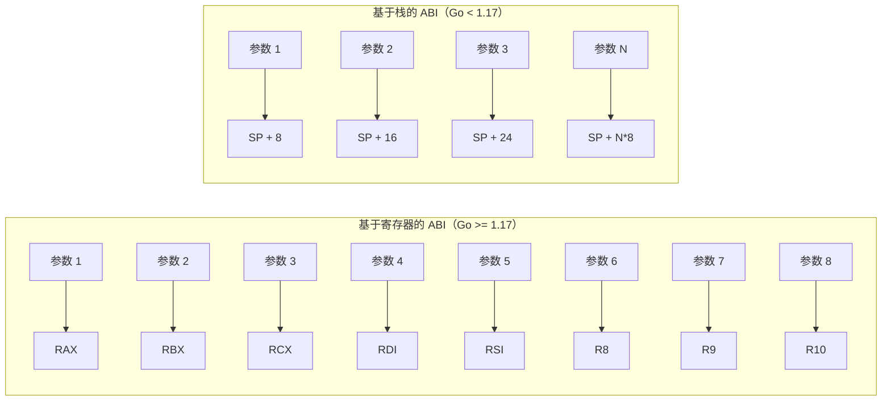

**来源:** [kern/go_argument.h:74-108](https://github.com/gojue/ecapture/blob/ca085d05/kern/go_argument.h#L74-L108), [user/module/probe_gotls.go:76-79](https://github.com/gojue/ecapture/blob/ca085d05/user/module/probe_gotls.go#L76-L79)

---

## 函数钩子

该模块钩住 `crypto/tls` 包中的三个关键函数以捕获明文数据和加密密钥。

### 被钩住的函数

| 函数 | 目的 | 钩子类型 | 事件类型 |
|----------|---------|-----------|------------|
| `crypto/tls.(*Conn).writeRecordLocked` | 捕获出站明文 | uprobe（入口） | `go_tls_event`（写入） |
| `crypto/tls.(*Conn).Read` | 捕获入站明文 | uprobe（在 RET） | `go_tls_event`（读取） |
| `crypto/tls.(*Config).writeKeyLog` | 捕获主密钥 | uprobe（入口） | `mastersecret_gotls_t` |

**来源:** [user/config/config_gotls.go:31-35](https://github.com/gojue/ecapture/blob/ca085d05/user/config/config_gotls.go#L31-L35), [kern/gotls_kern.c:31-48](https://github.com/gojue/ecapture/blob/ca085d05/kern/gotls_kern.c#L31-L48)

### 符号解析

该模块根据二进制文件是编译为 PIE（位置无关可执行文件）还是非 PIE 来以不同方式解析函数地址。

**PIE 模式：**
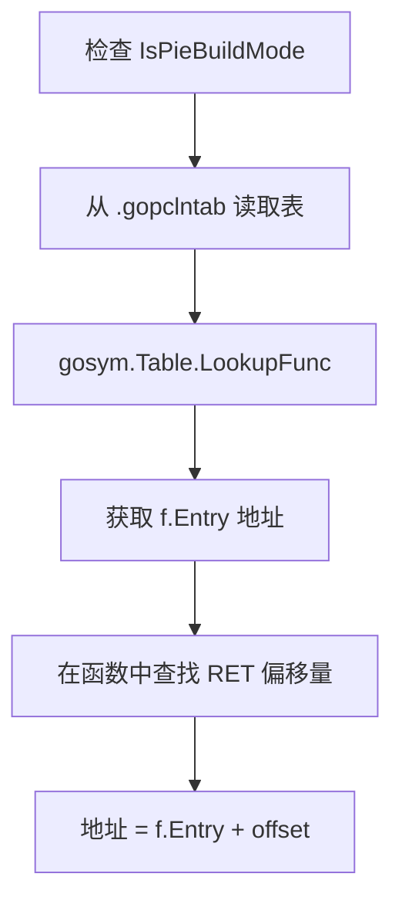

**非 PIE 模式：**
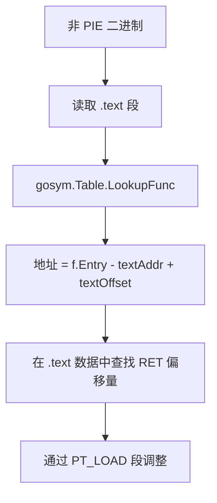

**来源:** [user/config/config_gotls.go:155-213](https://github.com/gojue/ecapture/blob/ca085d05/user/config/config_gotls.go#L155-L213), [user/config/config_gotls.go:350-446](https://github.com/gojue/ecapture/blob/ca085d05/user/config/config_gotls.go#L350-L446)

### RET 指令检测

对于 `Read` 函数，模块必须在返回点钩住（相当于 uretprobe），因为返回值表示实际读取了多少字节。模块在函数体内查找所有 RET 指令。

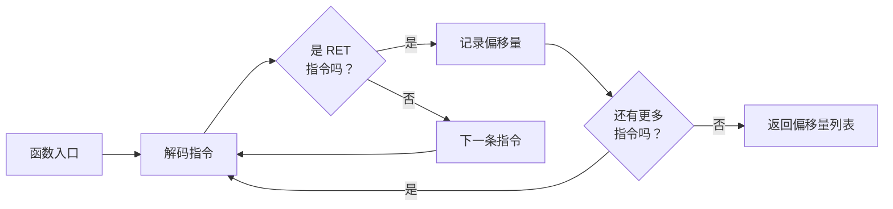

解码器使用特定于架构的指令分析：
- **x86_64**：查找 `0xc3`（RET）操作码
- **arm64**：查找 `0xd65f03c0`（RET）指令

**来源:** [user/config/config_gotls.go:219-285](https://github.com/gojue/ecapture/blob/ca085d05/user/config/config_gotls.go#L219-L285), [user/config/config_gotls_amd64.go (inferred)](), [user/config/config_gotls_arm64.go (inferred)]()

---

## eBPF 程序实现

### 数据捕获流程

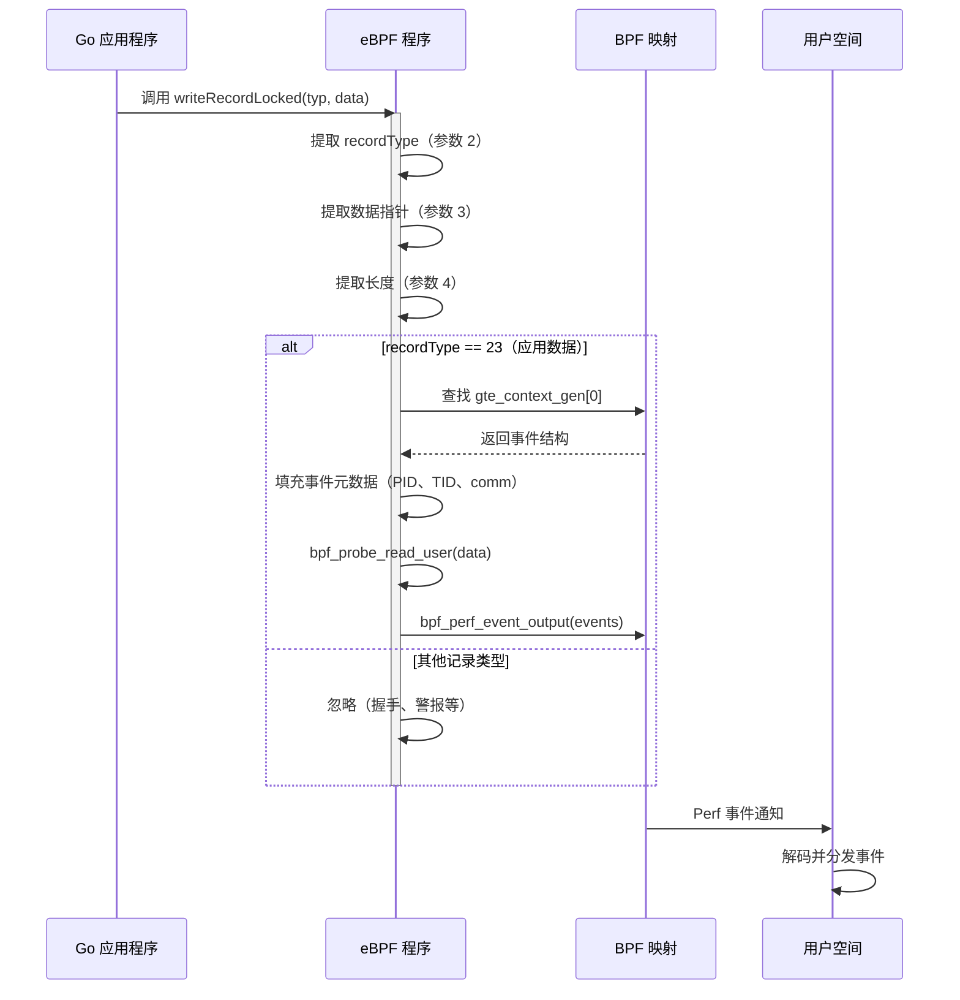

**来源:** [kern/gotls_kern.c:89-123](https://github.com/gojue/ecapture/blob/ca085d05/kern/gotls_kern.c#L89-L123)

### 事件结构

**go_tls_event**（明文数据）：
```c
struct go_tls_event {
    u64 ts_ns;                      // 时间戳
    u32 pid;                        // 进程 ID
    u32 tid;                        // 线程 ID
    s32 data_len;                   // 数据长度
    u8 event_type;                  // WRITE=0, READ=1
    char comm[TASK_COMM_LEN];       // 进程名称
    char data[MAX_DATA_SIZE_OPENSSL]; // 明文数据
};
```

**mastersecret_gotls_t**（TLS 密钥）：
```c
struct mastersecret_gotls_t {
    u8 label[MASTER_SECRET_KEY_LEN];     // 密钥标签
    u8 labellen;
    u8 client_random[EVP_MAX_MD_SIZE];   // 客户端随机数
    u8 client_random_len;
    u8 secret_[EVP_MAX_MD_SIZE];         // 密钥值
    u8 secret_len;
};
```

**来源:** [kern/gotls_kern.c:31-48](https://github.com/gojue/ecapture/blob/ca085d05/kern/gotls_kern.c#L31-L48)

### 参数提取

该模块使用 `go_get_argument()` 辅助函数根据 ABI 版本从寄存器或栈中提取参数。

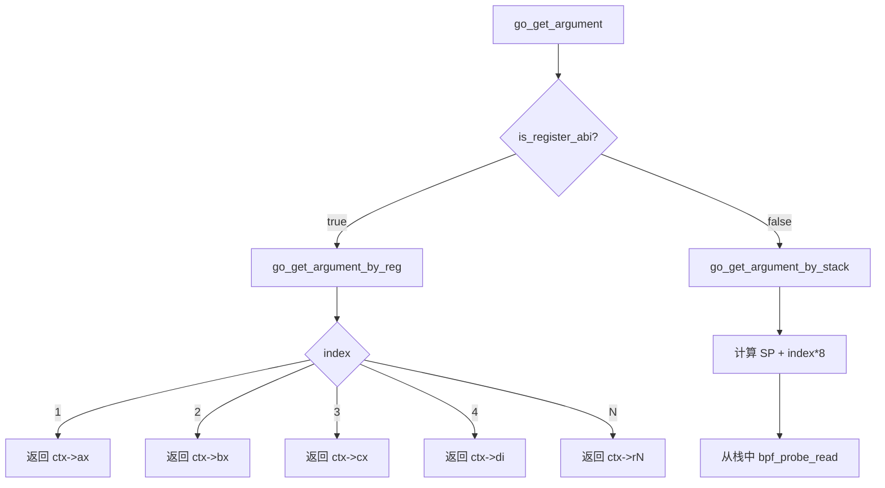

**来源:** [kern/go_argument.h:74-108](https://github.com/gojue/ecapture/blob/ca085d05/kern/go_argument.h#L74-L108), [kern/gotls_kern.c:94-98](https://github.com/gojue/ecapture/blob/ca085d05/kern/gotls_kern.c#L94-L98)

---

## 捕获模式

Go TLS 模块支持三种捕获模式，通过 `GoTLSConfig` 中的 `Model` 字段配置。

### 文本模式（默认）

捕获明文 TLS 数据并以文本格式输出到控制台或文件。

**设置：**
- 将 uprobe 附加到 `writeRecordLocked` 和 `Read` 函数
- 从 `events` 映射读取
- 分发 `GoTLSEvent` 结构

**配置：**
```go
type GoTLSConfig struct {
    Model: "text"  // 或空字符串
}
```

**使用的 eBPF 程序：**
- `uprobe/gotls_write_register` 或 `uprobe/gotls_write_stack`
- `uprobe/gotls_read_register` 或 `uprobe/gotls_read_stack`

**来源:** [user/module/probe_gotls_text.go:31-135](https://github.com/gojue/ecapture/blob/ca085d05/user/module/probe_gotls_text.go#L31-L135), [user/module/probe_gotls.go:99-103](https://github.com/gojue/ecapture/blob/ca085d05/user/module/probe_gotls.go#L99-L103)

### 密钥日志模式

捕获 TLS 主密钥并以 NSS 密钥日志格式写入，以便稍后解密。

**设置：**
- 仅将 uprobe 附加到 `writeKeyLog` 函数
- 从 `mastersecret_go_events` 映射读取
- 以格式写入密钥日志文件：`<LABEL> <CLIENT_RANDOM_HEX> <SECRET_HEX>`

**配置：**
```go
type GoTLSConfig struct {
    Model: "keylog" // 或 "key"
    KeylogFile: "/path/to/keylog.log"
}
```

**主密钥标签：**
- `CLIENT_HANDSHAKE_TRAFFIC_SECRET`
- `SERVER_HANDSHAKE_TRAFFIC_SECRET`
- `CLIENT_TRAFFIC_SECRET_0`
- `SERVER_TRAFFIC_SECRET_0`
- `EXPORTER_SECRET`

**来源:** [user/module/probe_gotls_keylog.go:31-122](https://github.com/gojue/ecapture/blob/ca085d05/user/module/probe_gotls_keylog.go#L31-L122), [user/module/probe_gotls.go:84-90](https://github.com/gojue/ecapture/blob/ca085d05/user/module/probe_gotls.go#L84-L90), [user/module/probe_gotls.go:244-283](https://github.com/gojue/ecapture/blob/ca085d05/user/module/probe_gotls.go#L244-L283)

### PCAP 模式

将主密钥捕获与 TC（流量控制）数据包捕获相结合，生成嵌入解密密钥的 pcapng 文件。

**设置：**
- 将 uprobe 附加到 `writeKeyLog` 函数
- 将 TC 分类器附加到网络接口
- 将主密钥作为 DSB（解密密钥块）写入 pcapng 文件
- 通过 `network_map` 将捕获的数据包与 Go 进程关联

**配置：**
```go
type GoTLSConfig struct {
    Model: "pcap"      // 或 "pcapng"
    PcapFile: "/path/to/capture.pcapng"
    Ifname: "eth0"     // 网络接口
    PcapFilter: ""     // 可选的 BPF 过滤器
}
```

**来源:** [user/module/probe_gotls_pcap.go (inferred)](), [user/module/probe_gotls.go:91-98](https://github.com/gojue/ecapture/blob/ca085d05/user/module/probe_gotls.go#L91-L98), [user/module/probe_gotls.go:148-153](https://github.com/gojue/ecapture/blob/ca085d05/user/module/probe_gotls.go#L148-L153)

---

## Read 函数钩子策略

`Read` 函数需要特殊处理，因为它在返回点被钩住以捕获实际读取的字节数（返回值）。

### 多 Uprobe 方法

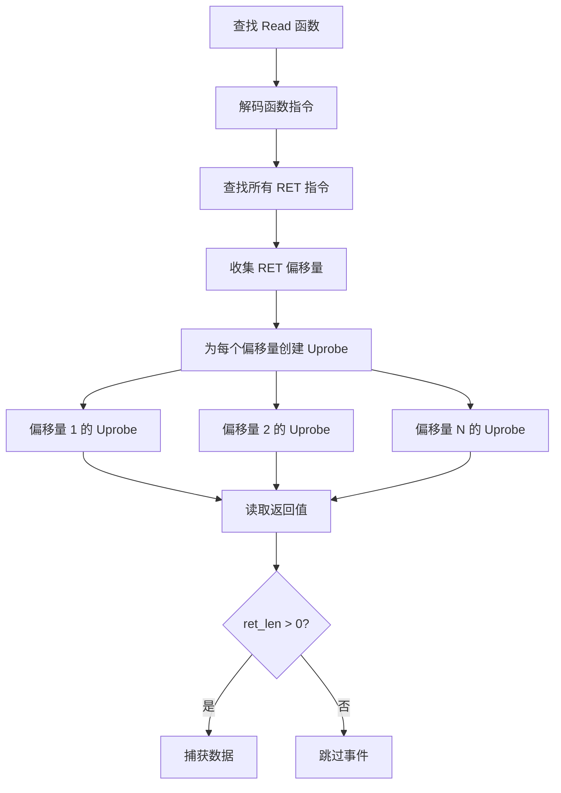

每个 RET 指令都获得一个唯一的 uprobe，其 UID 类似于 `gotls_read_register_12345`，其中 `12345` 是偏移量。

**返回值提取：**
- **寄存器 ABI**：寄存器中的返回值（通过 `go_get_argument` 的参数 1）
- **栈 ABI**：栈上位置 5 的返回值

**来源:** [user/module/probe_gotls_text.go:83-97](https://github.com/gojue/ecapture/blob/ca085d05/user/module/probe_gotls_text.go#L83-L97), [kern/gotls_kern.c:137-179](https://github.com/gojue/ecapture/blob/ca085d05/kern/gotls_kern.c#L137-L179)

---

## 主密钥提取

该模块从 `writeKeyLog` 函数捕获 TLS 密钥，Go 的 crypto/tls 在设置 `SSLKEYLOGFILE` 环境变量时或显式配置时会调用该函数以导出密钥。

### 参数布局

Go 函数签名：
```go
func (c *Config) writeKeyLog(label string, clientRandom, secret []byte) error
```

**Go 中的切片结构：**
```
type slice struct {
    array unsafe.Pointer  // 数据指针
    len   int             // 长度
    cap   int             // 容量
}
```

**参数索引：**

| 参数 | 索引（寄存器） | 描述 |
|----------|-----------------|-------------|
| `label` 指针 | 2 | 字符串数据指针 |
| `label` 长度 | 3 | 字符串长度 |
| `clientRandom` 指针 | 4 | 切片数据指针 |
| `clientRandom` 长度 | 5 | 切片长度 |
| `clientRandom` 容量 | 6 | 切片容量（未使用） |
| `secret` 指针 | 7 | 切片数据指针 |
| `secret` 长度 | 8 | 切片长度 |

**来源:** [kern/gotls_kern.c:194-267](https://github.com/gojue/ecapture/blob/ca085d05/kern/gotls_kern.c#L194-L267)

### 密钥存储

该模块维护一个去重映射以避免写入重复的密钥：

```go
masterSecrets map[string]bool  // 键：LABEL-clientRandomHex"
```

在写入密钥之前，它会检查该键是否存在于映射中。这可以防止在多次记录同一 TLS 会话时出现重复条目。

**输出格式：**
```
CLIENT_HANDSHAKE_TRAFFIC_SECRET <client_random_hex> <secret_hex>
SERVER_HANDSHAKE_TRAFFIC_SECRET <client_random_hex> <secret_hex>
```

**来源:** [user/module/probe_gotls.go:52-53](https://github.com/gojue/ecapture/blob/ca085d05/user/module/probe_gotls.go#L52-L53), [user/module/probe_gotls.go:244-283](https://github.com/gojue/ecapture/blob/ca085d05/user/module/probe_gotls.go#L244-L283)

---

## 模块生命周期

### 初始化流程

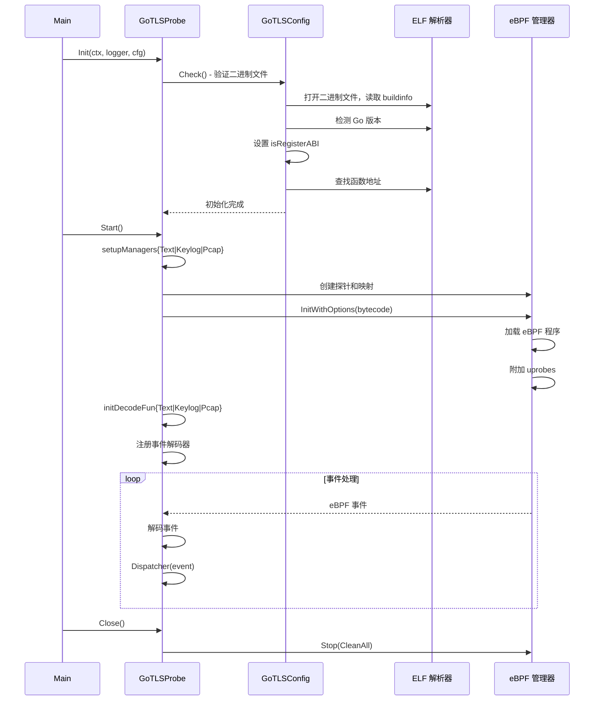

**来源:** [user/module/probe_gotls.go:58-122](https://github.com/gojue/ecapture/blob/ca085d05/user/module/probe_gotls.go#L58-L122), [user/module/probe_gotls.go:128-189](https://github.com/gojue/ecapture/blob/ca085d05/user/module/probe_gotls.go#L128-L189)

### 按模式的管理器设置

每种捕获模式都创建不同的探针配置：

**文本模式：**
- **探针**：`writeRecordLocked` 入口 + 多个 `Read` 返回点
- **映射**：`events`
- **解码器**：`GoTLSEvent`

**密钥日志模式：**
- **探针**：仅 `writeKeyLog` 入口
- **映射**：`mastersecret_go_events`
- **解码器**：`MasterSecretGotlsEvent`

**PCAP 模式：**
- **探针**：`writeKeyLog` 入口 + 网络接口上的 TC 分类器
- **映射**：`mastersecret_go_events`、`skb_events`、`network_map`
- **解码器**：`MasterSecretGotlsEvent`、`TcSkbEvent`

**来源:** [user/module/probe_gotls_text.go:31-135](https://github.com/gojue/ecapture/blob/ca085d05/user/module/probe_gotls_text.go#L31-L135), [user/module/probe_gotls_keylog.go:31-122](https://github.com/gojue/ecapture/blob/ca085d05/user/module/probe_gotls_keylog.go#L31-L122), [user/module/probe_gotls_pcap.go (inferred)]()

---

## PIE（位置无关可执行文件）支持

现代 Go 二进制文件通常使用 `-buildmode=pie` 编译以提高安全性。PIE 二进制文件具有不同的符号解析要求。

### 检测

```go
for _, bs := range gc.Buildinfo.Settings {
    if bs.Key == "-buildmode" && bs.Value == "pie" {
        gc.IsPieBuildMode = true
        break
    }
}
```

### 符号解析差异

| 方面 | 非 PIE | PIE |
|--------|---------|-----|
| 符号地址 | 绝对地址 | 相对于基址 |
| 符号表位置 | `.symtab` | `.gopclntab` + `.data.rel.ro` |
| 地址计算 | `f.Entry - textAddr + textOffset` | `f.Entry`（已经是相对的） |
| 函数数据位置 | `.text` 段 | PT_LOAD 段 |

**来源:** [user/config/config_gotls.go:155-183](https://github.com/gojue/ecapture/blob/ca085d05/user/config/config_gotls.go#L155-L183), [user/config/config_gotls.go:350-380](https://github.com/gojue/ecapture/blob/ca085d05/user/config/config_gotls.go#L350-L380)

---

## 配置参考

### GoTLSConfig 结构

```go
type GoTLSConfig struct {
    BaseConfig
    Path                  string    // Go 二进制文件路径
    PcapFile              string    // PCAP 输出文件（pcap 模式）
    KeylogFile            string    // 密钥日志输出文件（keylog 模式）
    Model                 string    // "text"、"pcap"、"keylog"
    Ifname                string    // 网络接口（pcap 模式）
    PcapFilter            string    // BPF 过滤器（pcap 模式）
    
    // 检测到的值
    Buildinfo             *buildinfo.BuildInfo
    ReadTlsAddrs          []int     // RET 指令偏移量
    GoTlsWriteAddr        uint64    // writeRecordLocked 地址
    GoTlsMasterSecretAddr uint64    // writeKeyLog 地址
    IsPieBuildMode        bool      // PIE 检测结果
}
```

**来源:** [user/config/config_gotls.go:77-94](https://github.com/gojue/ecapture/blob/ca085d05/user/config/config_gotls.go#L77-L94)

### 命令行标志

`gotls` 子命令接受以下标志：

| 标志 | 类型 | 描述 | 默认值 |
|------|------|-------------|---------|
| `--golang` | string | Go 二进制文件路径 | （必需） |
| `-m, --model` | string | 捕获模式：text/pcap/keylog | "text" |
| `-i, --ifname` | string | 网络接口（pcap 模式） | "" |
| `--pcapfile` | string | 输出 pcap 文件 | "gotls.pcapng" |
| `--keylogfile` | string | 输出密钥日志文件 | "gotls_keylog.log" |
| `--pcap-filter` | string | BPF 过滤器表达式 | "" |
| `--pid` | uint | 目标进程 ID | 0（全部） |
| `--uid` | uint | 目标用户 ID | 0（全部） |

**来源:** [cli/cmd/gotls.go (inferred)]()

---

## 事件处理

### 事件分发器

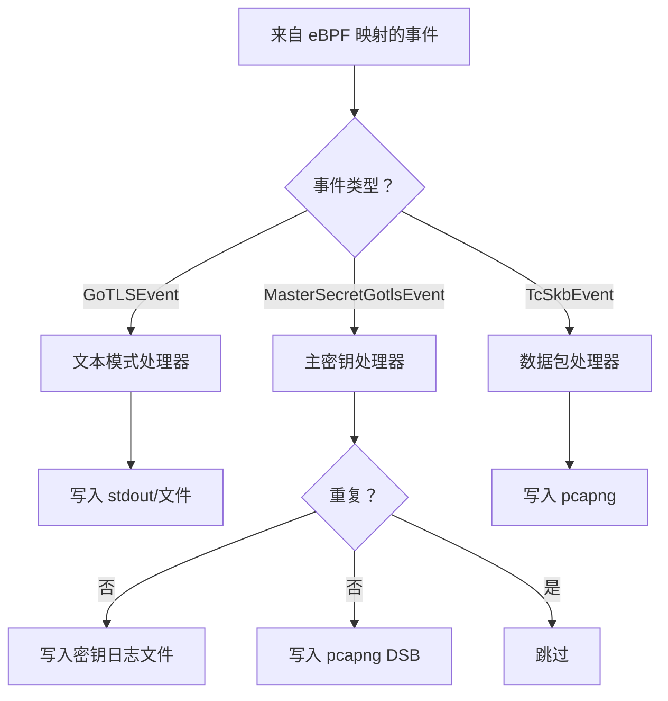

`Dispatcher` 方法根据具体类型路由事件：

```go
func (g *GoTLSProbe) Dispatcher(eventStruct event.IEventStruct) {
    switch eventStruct.(type) {
    case *event.MasterSecretGotlsEvent:
        g.saveMasterSecret(eventStruct.(*event.MasterSecretGotlsEvent))
    case *event.TcSkbEvent:
        g.dumpTcSkb(eventStruct.(*event.TcSkbEvent))
    }
}
```

**来源:** [user/module/probe_gotls.go:285-296](https://github.com/gojue/ecapture/blob/ca085d05/user/module/probe_gotls.go#L285-L296)

---

## 限制和注意事项

### 支持的 Go 版本

- **最低版本**：Go 1.8（引入稳定的 crypto/tls API）
- **寄存器 ABI**：Go 1.17+（需要单独的 eBPF 程序）
- **已测试**：Go 1.17 到 1.24+

### 二进制要求

- 必须是有效的 Go 可执行文件（不是脚本或非 Go 二进制文件）
- ELF 格式（仅限 Linux）
- 架构：x86_64 或 arm64（与 eCapture 构建架构匹配）
- 不能完全剥离（需要 `.gopclntab` 用于符号解析）

### 已知问题

1. **内联函数**：如果编译器内联 `Read` 或 `writeRecordLocked`，钩子可能无法附加
2. **剥离的二进制文件**：没有 `.gopclntab` 的完全剥离的二进制文件无法被钩住
3. **自定义 TLS 实现**：仅捕获通过 `crypto/tls` 包的流量
4. **FIPS 模式**：Go 的 FIPS 模式（BoringCrypto）可能具有不同的内部结构

**来源:** [user/config/config_gotls.go:103-213](https://github.com/gojue/ecapture/blob/ca085d05/user/config/config_gotls.go#L103-L213), [user/module/probe_gotls.go:71-79](https://github.com/gojue/ecapture/blob/ca085d05/user/module/probe_gotls.go#L71-L79)

---

## 与其他模块的集成

### 共享组件

Go TLS 模块利用通用基础设施：

- **MTCProbe**：具有 TC 和 pcapng 支持的基础探针实现
- **EventProcessor**：事件分发和工作器管理
- **IParser**：用于 HTTP/HTTP2 检测的协议解析
- **网络跟踪**：共享 `network_map` 用于进程到连接的映射

### 事件流到输出

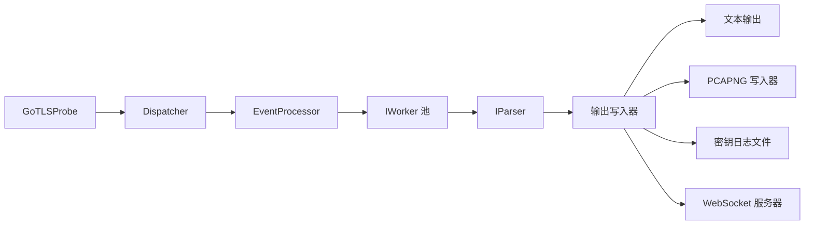

**来源:** [user/module/probe_gotls.go:43-56](https://github.com/gojue/ecapture/blob/ca085d05/user/module/probe_gotls.go#L43-L56), [user/module/probe_base.go (inferred)]()

---

## 使用示例

### 基本文本捕获

```bash
# 从 Go Web 服务器捕获 TLS
sudo ecapture gotls --golang=/usr/local/bin/myapp

# 针对特定进程
sudo ecapture gotls --golang=/usr/bin/go-service --pid=1234
```

### 密钥日志提取

```bash
# 提取主密钥用于离线解密
sudo ecapture gotls --golang=/app/server \
  -m keylog \
  --keylogfile=/tmp/tls_keys.log

# 与 Wireshark 一起使用
SSLKEYLOGFILE=/tmp/tls_keys.log wireshark
```

### 带解密密钥的 PCAP

```bash
# 捕获带有嵌入密钥的数据包
sudo ecapture gotls --golang=/usr/bin/myapp \
  -m pcap \
  -i eth0 \
  --pcapfile=/tmp/capture.pcapng

# 在 Wireshark 中打开（从 DSB 自动加载密钥）
wireshark /tmp/capture.pcapng
```

**来源:** [README.md (inferred)](), [cli/cmd/gotls.go (inferred)]()