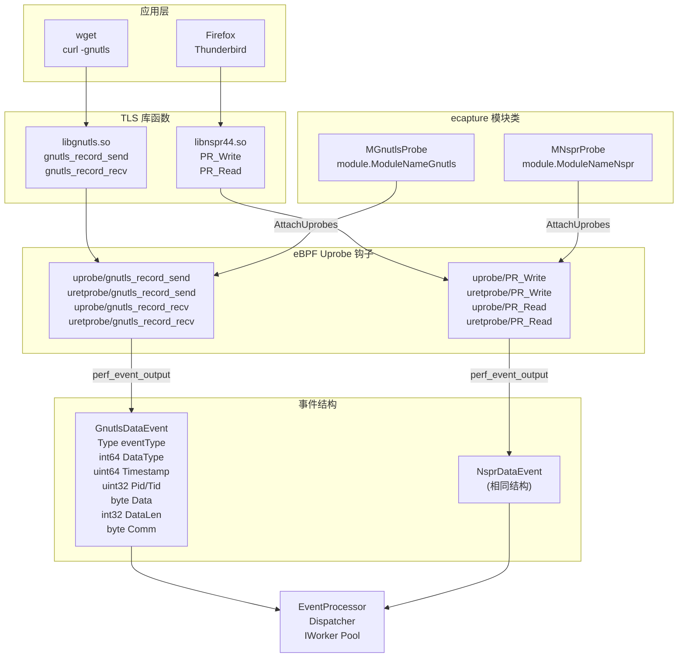
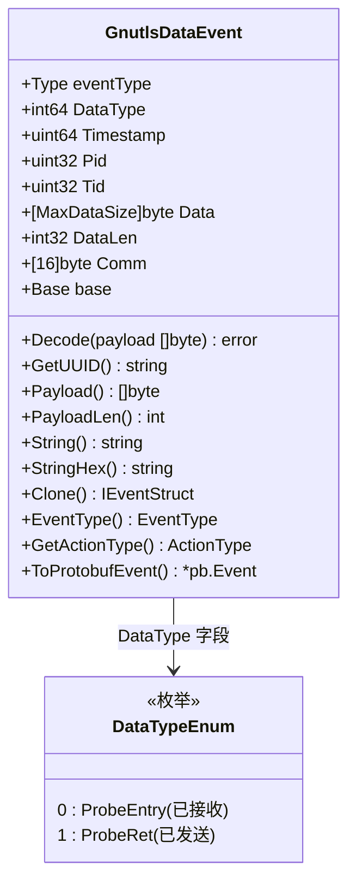
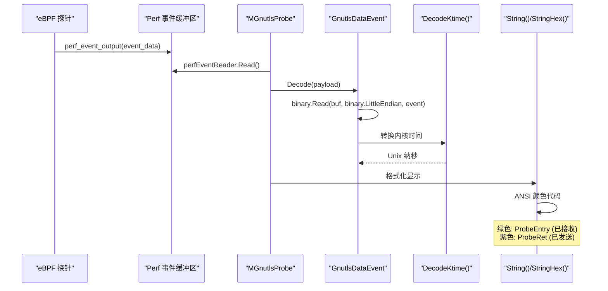
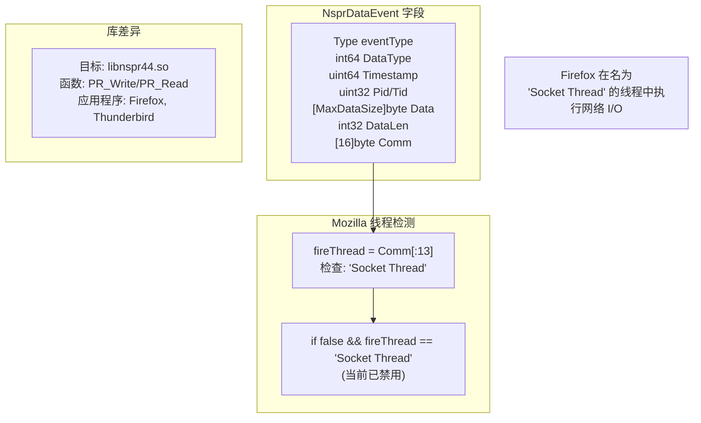
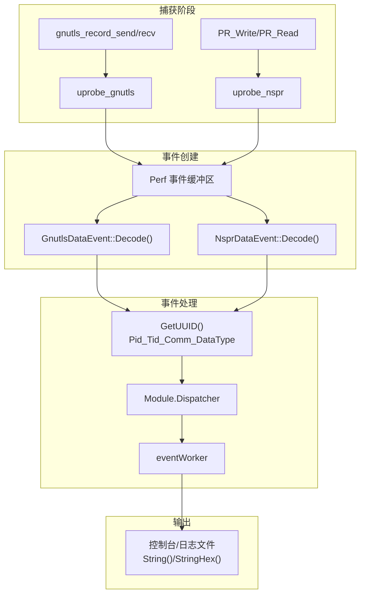
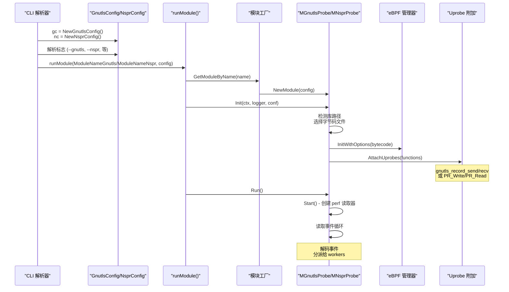
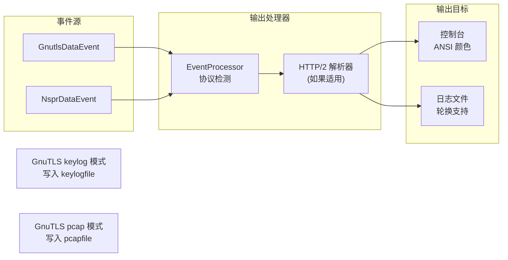

# GnuTLS 与 NSS 模块

## 目的与范围

本文档描述 GnuTLS 和 NSS/NSPR 捕获模块。这些模块用于拦截使用替代 TLS 库的应用程序的 TLS/SSL 流量。有关 OpenSSL/BoringSSL，请参见 3.1.1 页。有关 Go TLS，请参见 3.1.2 页。

**GnuTLS 模块**：捕获使用 GNU TLS 库（`libgnutls.so`）的应用程序的流量，例如 `wget` 和基于 GTK 的应用程序。注册为 `module.ModuleNameGnutls`。

**NSS/NSPR 模块**：捕获使用 Mozilla 网络安全服务库（`libnspr44.so`）的应用程序的流量，包括 Firefox、Thunderbird 以及某些发行版上的 Chrome。注册为 `module.ModuleNameNspr`。

**构建约束**：两个模块都通过 `//go:build !androidgki` 标签从 Android GKI 构建中排除。

**来源：** [cli/cmd/gnutls.go:1-3](https://github.com/gojue/ecapture/blob/ca085d05/cli/cmd/gnutls.go#L1-L3), [cli/cmd/nspr.go:1-3](https://github.com/gojue/ecapture/blob/ca085d05/cli/cmd/nspr.go#L1-L3), [README.md:155-159](https://github.com/gojue/ecapture/blob/ca085d05/README.md#L155-L159)

## 模块架构

两个模块都遵循 IModule 接口模式，将 uprobe 钩子附加到处理明文数据的库函数上，在加密之前（发送路径）和解密之后（接收路径）进行拦截。

**模块架构**


**来源：** [cli/cmd/gnutls.go:32-45](https://github.com/gojue/ecapture/blob/ca085d05/cli/cmd/gnutls.go#L32-L45), [cli/cmd/nspr.go:30-41](https://github.com/gojue/ecapture/blob/ca085d05/cli/cmd/nspr.go#L30-L41), [user/event/event_gnutls.go:25-45](https://github.com/gojue/ecapture/blob/ca085d05/user/event/event_gnutls.go#L25-L45), [user/event/event_nspr.go:26-46](https://github.com/gojue/ecapture/blob/ca085d05/user/event/event_nspr.go#L26-L46)

## GnuTLS 模块

### CLI 命令与配置

GnuTLS 模块使用 `gnutls` 命令（别名：`gnu`）调用。它提供与 OpenSSL 模块类似的选项，但针对 GnuTLS 库。

| 标志 | 短标志 | 默认值 | 描述 |
|------|-------|---------|-------------|
| `--gnutls` | | (自动检测) | `libgnutls.so` 路径，如果未指定则从系统路径自动发现 |
| `--model` | `-m` | `text` | 捕获模式：`text`、`pcap`/`pcapng`、`key`/`keylog` |
| `--keylogfile` | `-k` | `ecapture_gnutls_key.log` | TLS 密钥日志文件路径 |
| `--pcapfile` | `-w` | `save.pcapng` | pcapng 捕获的输出文件 |
| `--ifname` | `-i` | | TC 分类器的网络接口（pcap 模式） |
| `--ssl_version` | | | GnuTLS 版本字符串，例如 `--ssl_version="3.7.9"` |

**来源：** [cli/cmd/gnutls.go:29-56](https://github.com/gojue/ecapture/blob/ca085d05/cli/cmd/gnutls.go#L29-L56)

### 使用示例

```bash
# 基本文本捕获
ecapture gnutls

# 捕获特定 PID 的十六进制输出
ecapture gnutls --hex --pid=3423

# 保存到日志文件
ecapture gnutls -l save.log --pid=3423

# 指定自定义库路径
ecapture gnutls --gnutls=/lib/x86_64-linux-gnu/libgnutls.so

# keylog 模式用于 Wireshark 解密
ecapture gnutls -m keylog -k ecapture_gnutls_key.log --ssl_version=3.7.9

# 使用网络接口的 pcap 捕获
ecapture gnutls -m pcap --pcapfile save.pcapng -i eth0 --gnutls=/lib/x86_64-linux-gnu/libgnutls.so tcp port 443
```

**来源：** [cli/cmd/gnutls.go:36-43](https://github.com/gojue/ecapture/blob/ca085d05/cli/cmd/gnutls.go#L36-L43)

### GnuTLS 事件结构

`GnutlsDataEvent` 结构在 `libgnutls.so` 边界捕获明文数据。

**GnutlsDataEvent 结构**


**字段定义：**

| 字段 | 类型 | 描述 |
|-------|------|-------------|
| `eventType` | `Type` | 事件类型标识符（`TypeEventProcessor`） |
| `DataType` | `int64` | `0` = ProbeEntry（已接收），`1` = ProbeRet（已发送） |
| `Timestamp` | `uint64` | 内核时间，通过 `DecodeKtime()` 转换为 Unix 纳秒 |
| `Pid` | `uint32` | 进程 ID |
| `Tid` | `uint32` | 线程 ID |
| `Data` | `[MaxDataSize]byte` | 明文载荷缓冲区 |
| `DataLen` | `int32` | 实际捕获的数据长度 |
| `Comm` | `[16]byte` | 进程命令名称 |

**UUID 格式：** `{Pid}_{Tid}_{Comm}_{DataType}_{Fd}` (例如：`12345_12346_wget_0_5`)

**来源：** [user/event/event_gnutls.go:25-45](https://github.com/gojue/ecapture/blob/ca085d05/user/event/event_gnutls.go#L25-L45), [user/event/event_gnutls.go:96-102](https://github.com/gojue/ecapture/blob/ca085d05/user/event/event_gnutls.go#L96-L102)

### 事件解码与显示

事件使用 `encoding/binary` 包从 perf 缓冲区的二进制数据解码：

**事件解码流程**


**显示格式方法：**

- `String()`：返回带有 ANSI 颜色代码的格式化文本
  - 绿色 (`\033[32m`) 表示 ProbeEntry（接收的数据）
  - 紫色 (`\033[35m`) 表示 ProbeRet（发送的数据）
- `StringHex()`：返回二进制数据的十六进制转储格式

**示例输出：**
```
PID:1234, Comm:wget, TID:1234, TYPE:Received, DataLen:512 bytes, Payload:
GET / HTTP/1.1
Host: example.com
User-Agent: Wget/1.21
```

**来源：** [user/event/event_gnutls.go:47-91](https://github.com/gojue/ecapture/blob/ca085d05/user/event/event_gnutls.go#L47-L91), [user/event/event_gnutls.go:111-122](https://github.com/gojue/ecapture/blob/ca085d05/user/event/event_gnutls.go#L111-L122)

## NSS/NSPR 模块

### CLI 命令与配置

NSS/NSPR 模块使用 `nspr` 命令（别名：`nss`）调用。它比 GnuTLS 模块更简单，仅提供文本模式捕获。

| 标志 | 默认值 | 描述 |
|------|---------|-------------|
| `--nspr` | (自动检测) | `libnspr44.so` 路径，如果未指定则自动发现 |

**模块别名：** 该命令可以作为 `ecapture nspr` 或 `ecapture nss` 调用。

**来源：** [cli/cmd/nspr.go:27-46](https://github.com/gojue/ecapture/blob/ca085d05/cli/cmd/nspr.go#L27-L46)

### 使用示例

```bash
# 基本捕获
ecapture nspr

# 特定 PID 的十六进制输出
ecapture nspr --hex --pid=3423

# 保存到日志文件
ecapture nspr -l save.log --pid=3423

# 指定自定义库路径
ecapture nspr --nspr=/lib/x86_64-linux-gnu/libnspr44.so
```

**来源：** [cli/cmd/nspr.go:35-39](https://github.com/gojue/ecapture/blob/ca085d05/cli/cmd/nspr.go#L35-L39)

### NSS/NSPR 事件结构

`NsprDataEvent` 结构在结构上与 `GnutlsDataEvent` 相同，但具有 Mozilla 特定的事件处理逻辑。

**NsprDataEvent 结构比较**


**实现说明：**

- **相同结构**：与 `GnutlsDataEvent` 相同的字段布局，不同的目标库
- **线程名称检测**：检查 `Comm` 的前 13 个字节是否为 "Socket Thread" 字符串
- **已禁用过滤器**：代码行包含 `if false &&`，表示当前 Mozilla 特定的过滤处于非活动状态
- **目标库**：Mozilla NSPR（网络安全服务）的 `libnspr44.so`

**来源：** [user/event/event_nspr.go:26-46](https://github.com/gojue/ecapture/blob/ca085d05/user/event/event_nspr.go#L26-L46), [user/event/event_nspr.go:84-93](https://github.com/gojue/ecapture/blob/ca085d05/user/event/event_nspr.go#L84-L93)

### Firefox/Thunderbird 支持

NSS/NSPR 模块包含当前已禁用的 Mozilla 特定事件处理逻辑。

**线程检测实现：**
```go
var fireThread = strings.TrimSpace(fmt.Sprintf("%s", ne.Comm[:13]))
if false && fireThread == "Socket Thread" {
    // Firefox 网络线程的过滤逻辑
}
```

**Mozilla 线程模型：**
- Firefox/Thunderbird 在专用线程中执行网络 I/O
- 网络线程命名为 "Socket Thread"
- 检查 `Comm` 字段的前 13 个字节
- 过滤当前通过 `if false` 条件禁用

**UUID 格式：** `{Pid}_{Tid}_{Comm}_{DataType}_{Fd}` 

示例：`5678_5679_Socket Thread_1_7`

**来源：** [user/event/event_nspr.go:84-93](https://github.com/gojue/ecapture/blob/ca085d05/user/event/event_nspr.go#L84-L93), [user/event/event_nspr.go:132-140](https://github.com/gojue/ecapture/blob/ca085d05/user/event/event_nspr.go#L132-L140)

## 事件处理流程

两个模块在捕获数据后遵循相同的事件处理路径：

**事件处理流程**


**事件类型：** 两个模块都使用 `TypeEventProcessor` 作为其事件类型，将事件路由到事件处理流水线以进行潜在的 HTTP 解析和协议检测。

**来源：** [user/event/event_gnutls.go:104-108](https://github.com/gojue/ecapture/blob/ca085d05/user/event/event_gnutls.go#L104-L108), [user/event/event_nspr.go:123-127](https://github.com/gojue/ecapture/blob/ca085d05/user/event/event_nspr.go#L123-L127)

## 与 OpenSSL 模块的比较

TLS 捕获模块之间的主要架构和功能差异：

| 特性 | OpenSSL 模块 | GnuTLS 模块 | NSS/NSPR 模块 |
|---------|----------------|---------------|-----------------|
| **目标库** | `libssl.so` (OpenSSL/BoringSSL) | `libgnutls.so` | `libnspr44.so` |
| **模块名称** | `ModuleNameOpenssl` | `ModuleNameGnutls` | `ModuleNameNspr` |
| **探针函数** | `SSL_read`, `SSL_write`, `SSL_do_handshake` | `gnutls_record_send`, `gnutls_record_recv` | `PR_Write`, `PR_Read` |
| **版本检测** | 广泛（1.0.2-3.5、BoringSSL） | 版本标志（`--ssl_version`） | 不需要 |
| **捕获模式** | text、pcap、keylog | text、pcap、keylog | 仅 text |
| **连接跟踪** | 是（network_map、Tuple） | 否 | 否 |
| **主密钥提取** | 是（TLS 1.2/1.3） | 是（自 v0.8.10） | 否 |
| **早期密钥支持** | 是 | 是（自 v1.3.0） | 否 |
| **网络上下文** | 完整（IP:Port、Sock、Fd） | 有限（仅 Pid、Tid） | 有限（仅 Pid、Tid） |
| **主要用例** | curl、nginx、Apache、Python requests | wget、curl（GnuTLS 变体）、GTK 应用 | Firefox、Thunderbird、Chrome |
| **事件结构** | `SSLDataEvent` | `GnutlsDataEvent` | `NsprDataEvent` |
| **构建约束** | 无 | `!androidgki` | `!androidgki` |
| **Pcap 过滤器支持** | 是 | 是 | 否 |

**来源：** [cli/cmd/tls.go:29-68](https://github.com/gojue/ecapture/blob/ca085d05/cli/cmd/tls.go#L29-L68), [cli/cmd/gnutls.go:29-65](https://github.com/gojue/ecapture/blob/ca085d05/cli/cmd/gnutls.go#L29-L65), [cli/cmd/nspr.go:27-52](https://github.com/gojue/ecapture/blob/ca085d05/cli/cmd/nspr.go#L27-L52), [CHANGELOG.md:135-136](https://github.com/gojue/ecapture/blob/ca085d05/CHANGELOG.md#L135-L136), [CHANGELOG.md:425-425](https://github.com/gojue/ecapture/blob/ca085d05/CHANGELOG.md#L425-L425)

## 模块注册与初始化

两个模块都遵循标准的 IModule 生命周期：Init → Run → Close。

**模块初始化流程**


**模块注册常量：**
- GnuTLS：在模块注册表中定义的 `module.ModuleNameGnutls`
- NSS/NSPR：在模块注册表中定义的 `module.ModuleNameNspr`

**命令函数：**
- GnuTLS：`gnuTlsCommandFunc()` 位于 [cli/cmd/gnutls.go:59-64](https://github.com/gojue/ecapture/blob/ca085d05/cli/cmd/gnutls.go#L59-L64)
- NSPR：`nssCommandFunc()` 位于 [cli/cmd/nspr.go:49-51](https://github.com/gojue/ecapture/blob/ca085d05/cli/cmd/nspr.go#L49-L51)

**来源：** [cli/cmd/gnutls.go:59-64](https://github.com/gojue/ecapture/blob/ca085d05/cli/cmd/gnutls.go#L59-L64), [cli/cmd/nspr.go:49-51](https://github.com/gojue/ecapture/blob/ca085d05/cli/cmd/nspr.go#L49-L51), [cli/cmd/root.go:1-200](https://github.com/gojue/ecapture/blob/ca085d05/cli/cmd/root.go#L1-L200)

## 库检测策略

当未指定路径时，两个模块都支持自动库检测：

1. **搜索系统路径**：检查标准库位置（`/lib`、`/usr/lib`、`/lib64`、`/usr/lib64`）
2. **LD 库路径**：解析 `/etc/ld.so.conf` 和 `/etc/ld.so.conf.d/*`
3. **链接库**：检查目标进程内存映射
4. **回退**：使用默认系统路径

**指定路径优先级**：如果提供了 `--gnutls` 或 `--nspr` 标志，则直接使用这些路径而不进行自动检测。

**来源：** [cli/cmd/gnutls.go:49](https://github.com/gojue/ecapture/blob/ca085d05/cli/cmd/gnutls.go#L49), [cli/cmd/nspr.go:44](https://github.com/gojue/ecapture/blob/ca085d05/cli/cmd/nspr.go#L44)

## 限制与约束

### GnuTLS 模块限制

- **无连接元组跟踪**：不捕获套接字文件描述符、IP 地址或端口号
- **版本特定 Keylog**：可能需要 `--ssl_version` 标志以获取正确的 TLS 密钥结构偏移量
- **Pcap 模式要求**：需要使用 `--ifname` 参数附加 TC（流量控制）分类器
- **MaxDataSize 约束**：单个事件捕获最多 `MaxDataSize` 字节（在事件头中定义）
- **无 BIO 类型支持**：无法区分内存 BIO 和套接字 BIO 操作

### NSS/NSPR 模块限制

- **仅文本模式**：未实现 pcap 或 keylog 捕获模式
- **已禁用线程过滤**：存在 Mozilla 特定的 "Socket Thread" 过滤但已禁用（`if false`）
- **无主密钥提取**：无法提取 TLS 密钥用于 Wireshark 解密
- **元数据有限**：无 TLS 版本、密码套件或连接信息
- **无网络上下文**：无法将事件与网络元组（IP:Port）关联

### 共同约束

- **载荷截断**：事件限制为每次捕获 `MaxDataSize`，大载荷需要多个事件
- **Uprobe 性能**：函数调用拦截会给每个 TLS 读/写操作增加延迟
- **权限要求**：需要 root 或 `CAP_BPF` + `CAP_PERFMON` 能力
- **库检测**：如果库位于非标准位置，自动检测可能失败
- **Android 排除**：两个模块都通过构建标签 `!androidgki` 从 Android GKI 构建中排除

**来源：** [cli/cmd/gnutls.go:1-3](https://github.com/gojue/ecapture/blob/ca085d05/cli/cmd/gnutls.go#L1-L3), [cli/cmd/nspr.go:1-3](https://github.com/gojue/ecapture/blob/ca085d05/cli/cmd/nspr.go#L1-L3), [user/event/event_gnutls.go:32](https://github.com/gojue/ecapture/blob/ca085d05/user/event/event_gnutls.go#L32), [user/event/event_nspr.go:32](https://github.com/gojue/ecapture/blob/ca085d05/user/event/event_nspr.go#L32), [user/event/event_nspr.go:84-93](https://github.com/gojue/ecapture/blob/ca085d05/user/event/event_nspr.go#L84-L93)

## 与输出格式的集成

两个模块都支持标准的 ecapture 输出流水线：

**输出集成**


**Protobuf 支持**：两种事件类型都实现了 `ToProtobufEvent()` 用于序列化到外部系统，尽管它们填充的字段有限（没有 IP 地址或端口）。

**来源：** [user/event/event_gnutls.go:125-139](https://github.com/gojue/ecapture/blob/ca085d05/user/event/event_gnutls.go#L125-L139), [user/event/event_nspr.go:143-157](https://github.com/gojue/ecapture/blob/ca085d05/user/event/event_nspr.go#L143-L157)