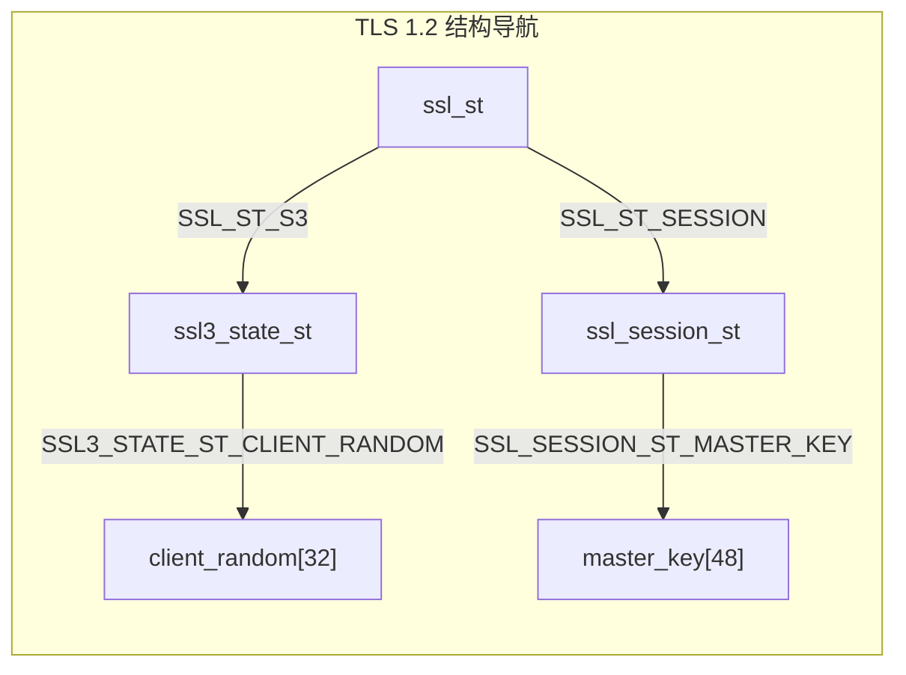
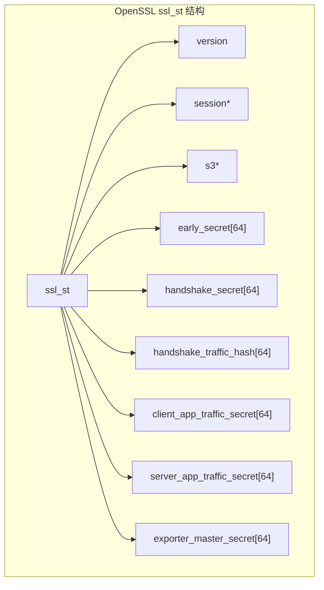
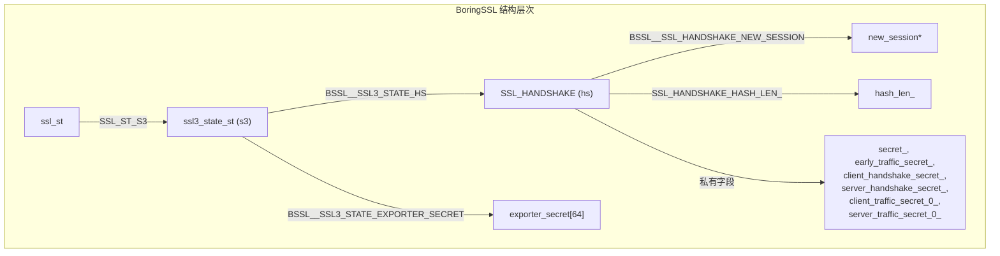
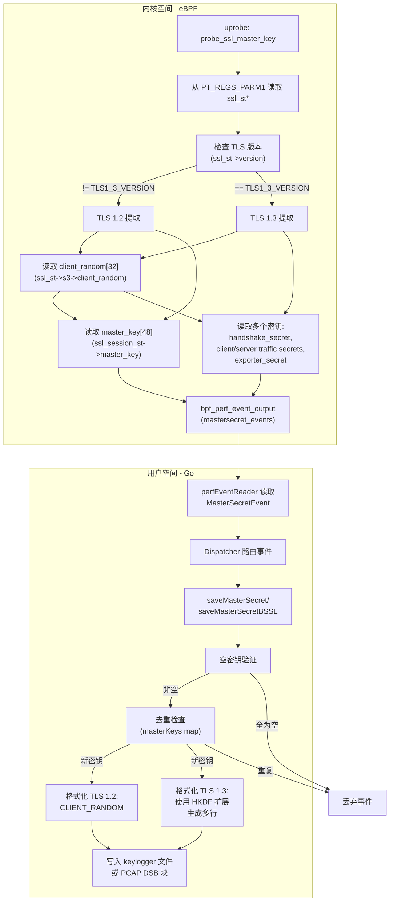
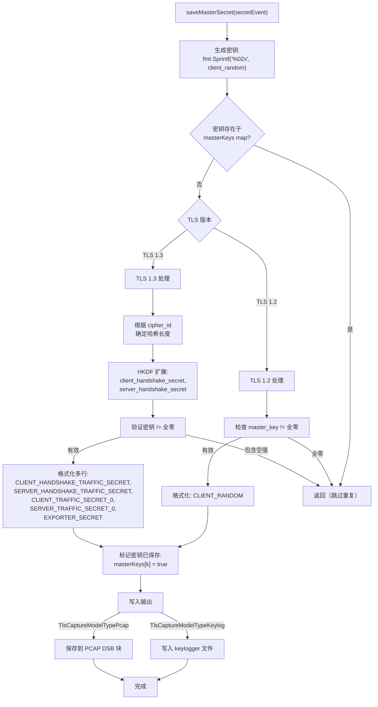

# 主密钥提取

本文档描述了 eCapture 从 OpenSSL 和 BoringSSL 库中提取 TLS 主密钥和流量密钥的机制。这些密钥使得在无需证书私钥的情况下解密捕获的 TLS 流量成为可能。

关于通用 TLS 捕获架构的信息，请参阅 [OpenSSL 模块](3.1.1-openssl-module.md)。关于密钥日志文件生成和 PCAP 集成的信息，请参阅 [TLS 密钥日志](../4-output-formats/4.3-tls-key-logging.md) 和 [PCAP 集成](../4-output-formats/4.2-pcap-integration.md)。

## 概述

主密钥提取通过附加到 SSL/TLS 库函数的 eBPF uprobes 来操作。eCapture 拦截加密握手以捕获：

- **TLS 1.2**: 握手期间派生的单个主密钥
- **TLS 1.3**: 多个流量密钥（握手密钥、客户端/服务器流量密钥、导出器密钥）

提取的密钥以 SSLKEYLOGFILE 格式导出，供 Wireshark 和其他解密工具使用。

来源：[user/module/probe_openssl.go:482-575](https://github.com/gojue/ecapture/blob/0766a93b/user/module/probe_openssl.go#L482-L575), [kern/openssl_masterkey.h:25-39](https://github.com/gojue/ecapture/blob/0766a93b/kern/openssl_masterkey.h#L25-L39), [kern/boringssl_masterkey.h:37-56](https://github.com/gojue/ecapture/blob/0766a93b/kern/boringssl_masterkey.h#L37-L56)

## TLS 版本差异

### TLS 1.2 密钥提取

TLS 1.2 使用从预主密钥和客户端/服务器随机值派生的单个 48 字节 `master_key`。此主密钥在会话期间保持不变。



**TLS 1.2 提取过程：**
1. 读取 `ssl_st->version` 以验证 TLS 版本
2. 导航到 `ssl_st->s3->client_random` 获取 32 字节随机值
3. 导航到 `ssl_st->session->master_key` 获取 48 字节主密钥
4. 格式化为：`CLIENT_RANDOM <client_random> <master_key>`

来源：[kern/openssl_masterkey.h:151-168](https://github.com/gojue/ecapture/blob/0766a93b/kern/openssl_masterkey.h#L151-L168), [kern/boringssl_masterkey.h:288-342](https://github.com/gojue/ecapture/blob/0766a93b/kern/boringssl_masterkey.h#L288-L342)

### TLS 1.3 密钥提取

TLS 1.3 用多个不同阶段的派生密钥替换了单个主密钥：

| 密钥类型 | 用途 | 大小 |
|------------|---------|------|
| `early_secret` | 早期数据（0-RTT） | 32 或 48 字节 |
| `handshake_secret` | 握手加密 | 32 或 48 字节 |
| `client_handshake_secret` | 从 handshake_secret 派生 | 32 或 48 字节 |
| `server_handshake_secret` | 从 handshake_secret 派生 | 32 或 48 字节 |
| `client_app_traffic_secret` | 客户端应用数据 | 32 或 48 字节 |
| `server_app_traffic_secret` | 服务器应用数据 | 32 或 48 字节 |
| `exporter_master_secret` | 密钥导出器 | 32 或 48 字节 |

密钥长度取决于密码套件（基于 SHA256 的为 32 字节，基于 SHA384 的为 48 字节）。

来源：[kern/openssl_masterkey.h:171-256](https://github.com/gojue/ecapture/blob/0766a93b/kern/openssl_masterkey.h#L171-L256), [kern/boringssl_masterkey.h:344-402](https://github.com/gojue/ecapture/blob/0766a93b/kern/boringssl_masterkey.h#L344-L402), [user/module/probe_openssl.go:502-551](https://github.com/gojue/ecapture/blob/0766a93b/user/module/probe_openssl.go#L502-L551)

## OpenSSL 与 BoringSSL 提取对比

### OpenSSL 结构布局

OpenSSL 直接在 `ssl_st` 结构中以固定偏移量存储 TLS 1.3 密钥：



**OpenSSL 偏移量宏**（特定版本）：
- `SSL_ST_VERSION`: 版本字段偏移量
- `SSL_ST_SESSION`: 会话指针偏移量
- `SSL_ST_EARLY_SECRET`: 早期密钥偏移量（TLS 1.3）
- `SSL_ST_HANDSHAKE_SECRET`: 握手密钥偏移量
- `SSL_ST_CLIENT_APP_TRAFFIC_SECRET`: 客户端流量密钥偏移量
- `SSL_ST_SERVER_APP_TRAFFIC_SECRET`: 服务器流量密钥偏移量
- `SSL_ST_EXPORTER_MASTER_SECRET`: 导出器密钥偏移量

来源：[kern/openssl_masterkey.h:80-257](https://github.com/gojue/ecapture/blob/0766a93b/kern/openssl_masterkey.h#L80-L257), [kern/openssl_masterkey_3.0.h:80-253](https://github.com/gojue/ecapture/blob/0766a93b/kern/openssl_masterkey_3.0.h#L80-L253)

### BoringSSL 结构布局

BoringSSL 将 TLS 1.3 密钥存储在 `SSL_HANDSHAKE` 结构中（通过 `ssl_st->s3->hs` 访问），一些密钥标记为 `private`，需要手动计算偏移量：



**私有字段偏移量计算：**

BoringSSL 的 `SSL_HANDSHAKE` 结构包含无法通过标准 `offsetof()` 访问的私有字段。偏移量手动计算：

```c
// max_version 是最后一个公共字段（uint16_t，偏移量 30）
// 内存对齐到 8 字节后：偏移量 32
// hash_len_（size_t）：偏移量 32
// secret_ 起始位置：32 + sizeof(size_t) = 40
#define SSL_HANDSHAKE_HASH_LEN_ roundup(BSSL__SSL_HANDSHAKE_MAX_VERSION+2,8)
#define SSL_HANDSHAKE_SECRET_ SSL_HANDSHAKE_HASH_LEN_+8
#define SSL_HANDSHAKE_EARLY_TRAFFIC_SECRET_ SSL_HANDSHAKE_SECRET_+SSL_MAX_MD_SIZE*1
#define SSL_HANDSHAKE_CLIENT_HANDSHAKE_SECRET_ SSL_HANDSHAKE_SECRET_+SSL_MAX_MD_SIZE*2
// ... 以此类推
```

来源：[kern/boringssl_const.h:28-60](https://github.com/gojue/ecapture/blob/0766a93b/kern/boringssl_const.h#L28-L60), [kern/boringssl_masterkey.h:90-98](https://github.com/gojue/ecapture/blob/0766a93b/kern/boringssl_masterkey.h#L90-L98), [utils/boringssl-offset.c:23-78](https://github.com/gojue/ecapture/blob/0766a93b/utils/boringssl-offset.c#L23-L78)

## eBPF 钩子点

OpenSSL 和 BoringSSL 提取使用相同的钩子点策略：

**Uprobe 函数：** `SSL_write_key`（符号名称，实际函数因版本而异）

eBPF 程序 `probe_ssl_master_key` 作为 uprobe 附加到 SSL/TLS 库函数。实际的钩子函数由版本检测确定（参见 [版本检测与字节码选择](../2-architecture/2.5-version-detection-and-bytecode-selection.md)）：

| 钩子函数 | 库 | 用途 |
|--------------|---------|---------|
| `SSL_write` | OpenSSL/BoringSSL | 在写入期间捕获密钥的主钩子点 |
| `SSL_do_handshake` | OpenSSL/BoringSSL | 握手完成钩子 |
| `SSL_get_wbio` | BoringSSL | 用于连接跟踪的 BIO 检索 |
| `SSL_in_before` | OpenSSL 1.1.0+ | 握手状态检查 |
| `SSL_state` | OpenSSL 1.0.x | 替代握手状态（旧版本） |

主钩子函数在 [user/module/probe_openssl_masterkey.go:13-21](https://github.com/gojue/ecapture/blob/0766a93b/user/module/probe_openssl_masterkey.go#L13-L21) 中配置：

```go
var masterKeyHookFuncs = []string{
    "SSL_write",
    "SSL_read",
    "SSL_do_handshake",
}
```

来源：[kern/openssl_masterkey.h:81-82](https://github.com/gojue/ecapture/blob/0766a93b/kern/openssl_masterkey.h#L81-L82), [kern/boringssl_masterkey.h:169-170](https://github.com/gojue/ecapture/blob/0766a93b/kern/boringssl_masterkey.h#L169-L170), [user/module/probe_openssl.go:104](https://github.com/gojue/ecapture/blob/0766a93b/user/module/probe_openssl.go#L104), [user/module/probe_openssl.go:179-195](https://github.com/gojue/ecapture/blob/0766a93b/user/module/probe_openssl.go#L179-L195)

## 提取流程

### 完整提取管道



来源：[kern/openssl_masterkey.h:82-257](https://github.com/gojue/ecapture/blob/0766a93b/kern/openssl_masterkey.h#L82-L257), [kern/boringssl_masterkey.h:170-403](https://github.com/gojue/ecapture/blob/0766a93b/kern/boringssl_masterkey.h#L170-L403), [user/module/probe_openssl.go:482-642](https://github.com/gojue/ecapture/blob/0766a93b/user/module/probe_openssl.go#L482-L642)

### 状态验证

eBPF 程序检查握手状态，以确保仅在协商完成后才捕获密钥：

**OpenSSL：** 无显式状态检查（依赖密钥可用性）

**BoringSSL TLS 1.2：**
```c
if (ssl3_hs_state.state < CLIENT_STATE12_SEND_CLIENT_FINISHED) {
    return 0; // 尚未完成
}
```

**BoringSSL TLS 1.3：**
```c
if (ssl3_hs_state.tls13_state < CLIENT_STATE13_READ_SERVER_FINISHED) {
    return 0; // 尚未完成
}
```

来源：[kern/boringssl_masterkey.h:263-292](https://github.com/gojue/ecapture/blob/0766a93b/kern/boringssl_masterkey.h#L263-L292), [kern/boringssl_masterkey.h:345-348](https://github.com/gojue/ecapture/blob/0766a93b/kern/boringssl_masterkey.h#L345-L348)

## 数据结构

### 内核侧事件结构

**OpenSSL 事件结构：**

```c
struct mastersecret_t {
    s32 version;                                   // TLS 版本
    u8 client_random[SSL3_RANDOM_SIZE];            // 32 字节
    u8 master_key[MASTER_SECRET_MAX_LEN];          // 48 字节（TLS 1.2）
    
    // TLS 1.3 字段
    u32 cipher_id;                                 // 密码套件 ID
    u8 early_secret[EVP_MAX_MD_SIZE];              // 64 字节
    u8 handshake_secret[EVP_MAX_MD_SIZE];          // 64 字节
    u8 handshake_traffic_hash[EVP_MAX_MD_SIZE];    // 64 字节
    u8 client_app_traffic_secret[EVP_MAX_MD_SIZE]; // 64 字节
    u8 server_app_traffic_secret[EVP_MAX_MD_SIZE]; // 64 字节
    u8 exporter_master_secret[EVP_MAX_MD_SIZE];    // 64 字节
};
```

**BoringSSL 事件结构：**

```c
struct mastersecret_bssl_t {
    s32 version;                                   // TLS 版本
    u8 client_random[SSL3_RANDOM_SIZE];            // 32 字节
    u8 secret_[MASTER_SECRET_MAX_LEN];             // 48 字节（TLS 1.2）
    
    // TLS 1.3 字段
    u32 hash_len;                                  // 哈希长度（32 或 48）
    u8 early_traffic_secret_[EVP_MAX_MD_SIZE];    // 64 字节
    u8 client_handshake_secret_[EVP_MAX_MD_SIZE]; // 64 字节
    u8 server_handshake_secret_[EVP_MAX_MD_SIZE]; // 64 字节
    u8 client_traffic_secret_0_[EVP_MAX_MD_SIZE]; // 64 字节
    u8 server_traffic_secret_0_[EVP_MAX_MD_SIZE]; // 64 字节
    u8 exporter_secret[EVP_MAX_MD_SIZE];          // 64 字节
};
```

来源：[kern/openssl_masterkey.h:25-39](https://github.com/gojue/ecapture/blob/0766a93b/kern/openssl_masterkey.h#L25-L39), [kern/boringssl_masterkey.h:37-56](https://github.com/gojue/ecapture/blob/0766a93b/kern/boringssl_masterkey.h#L37-L56)

### 用户空间事件结构

Go 侧在 [user/event/event_openssl.go](https://github.com/gojue/ecapture/blob/0766a93b/user/event/event_openssl.go) 中镜像这些结构：

- `MasterSecretEvent`: OpenSSL 主密钥事件
- `MasterSecretBSSLEvent`: BoringSSL 主密钥事件

两者都实现 `IEventStruct` 接口以进行统一的事件处理。

来源：[user/module/probe_openssl.go:50-56](https://github.com/gojue/ecapture/blob/0766a93b/user/module/probe_openssl.go#L50-L56)

## 主密钥处理

### 用户空间处理器：saveMasterSecret

`saveMasterSecret` 函数处理 OpenSSL 主密钥事件：



来源：[user/module/probe_openssl.go:482-575](https://github.com/gojue/ecapture/blob/0766a93b/user/module/probe_openssl.go#L482-L575)

### TLS 1.3 HKDF 扩展

对于 TLS 1.3，握手密钥必须使用 HKDF-Expand-Label 扩展：

**密码套件哈希确定：**

| 密码套件 | 哈希 | 长度 |
|-------------|------|--------|
| `TLS_AES_128_GCM_SHA256` | SHA256 | 32 字节 |
| `TLS_CHACHA20_POLY1305_SHA256` | SHA256 | 32 字节 |
| `TLS_AES_256_GCM_SHA384` | SHA384 | 48 字节 |

**HKDF-Expand-Label 调用：**

```go
// 将握手密钥扩展为客户端/服务器握手密钥
clientHandshakeSecret := hkdf.ExpandLabel(
    secretEvent.HandshakeSecret[:length],
    hkdf.ClientHandshakeTrafficLabel,
    secretEvent.HandshakeTrafficHash[:length],
    length,
    transcript
)

serverHandshakeSecret := hkdf.ExpandLabel(
    secretEvent.HandshakeSecret[:length],
    hkdf.ServerHandshakeTrafficLabel,
    secretEvent.HandshakeTrafficHash[:length],
    length,
    transcript
)
```

使用的标签：
- `ClientHandshakeTrafficLabel`: "c hs traffic"
- `ServerHandshakeTrafficLabel`: "s hs traffic"

来源：[user/module/probe_openssl.go:502-551](https://github.com/gojue/ecapture/blob/0766a93b/user/module/probe_openssl.go#L502-L551), [pkg/util/hkdf/hkdf.go](https://github.com/gojue/ecapture/blob/0766a93b/pkg/util/hkdf/hkdf.go)

### 空密钥验证

TLS 1.2 和 TLS 1.3 密钥都经过验证以确保它们不是全零（这表示错误或不完整的握手）：

**TLS 1.2 验证：**
```go
func (m *MOpenSSLProbe) mk12NullSecrets(hashLen int, secret []byte) bool {
    isNull := true
    for i := 0; i < hashLen; i++ {
        if secret[i] != 0 {
            isNull = false
            break
        }
    }
    return isNull
}
```

**TLS 1.3 验证：**
该函数检查所有五个密钥（客户端握手、客户端流量、服务器握手、服务器流量、导出器），如果任何一个保持全零则返回 `true`：

```go
func (m *MOpenSSLProbe) mk13NullSecrets(hashLen int,
    ClientHandshakeSecret [64]byte,
    ClientTrafficSecret0 [64]byte,
    ServerHandshakeSecret [64]byte,
    ServerTrafficSecret0 [64]byte,
    ExporterSecret [64]byte) bool {
    // 如果任何密钥仍为空则返回 true
    // ...
}
```

来源：[user/module/probe_openssl.go:652-731](https://github.com/gojue/ecapture/blob/0766a93b/user/module/probe_openssl.go#L652-L731)

## 输出格式

### SSLKEYLOGFILE 格式

TLS 密钥日志的标准格式：

**TLS 1.2：**
```
CLIENT_RANDOM <64 位十六进制 client_random> <96 位十六进制 master_key>
```

**TLS 1.3：**
```
CLIENT_HANDSHAKE_TRAFFIC_SECRET <64 位十六进制 client_random> <64-96 位十六进制>
SERVER_HANDSHAKE_TRAFFIC_SECRET <64 位十六进制 client_random> <64-96 位十六进制>
CLIENT_TRAFFIC_SECRET_0 <64 位十六进制 client_random> <64-96 位十六进制>
SERVER_TRAFFIC_SECRET_0 <64 位十六进制 client_random> <64-96 位十六进制>
EXPORTER_SECRET <64 位十六进制 client_random> <64-96 位十六进制>
```

### 输出模式

基于 `TlsCaptureModelType` 配置：

| 模式 | 实现 | 输出位置 |
|------|---------------|-----------------|
| `TlsCaptureModelTypeKeylog` | 通过 `m.keylogger.WriteString()` 写入文件 | 由 `--keylog` 标志指定的密钥日志文件 |
| `TlsCaptureModelTypePcap` | 通过 `m.savePcapngSslKeyLog()` 嵌入到 PCAP-NG DSB 块 | PCAP-NG 文件内部 |
| `TlsCaptureModelTypeText` | 无输出（不需要密钥） | N/A |

来源：[user/module/probe_openssl.go:58-76](https://github.com/gojue/ecapture/blob/0766a93b/user/module/probe_openssl.go#L58-L76), [user/module/probe_openssl.go:558-574](https://github.com/gojue/ecapture/blob/0766a93b/user/module/probe_openssl.go#L558-L574)

## 偏移量计算工具

### BoringSSL 偏移量生成器

`boringssl-offset.c` 工具通过针对 BoringSSL 头文件编译来生成 BoringSSL 结构的偏移量宏：

```bash
g++ -I include/ -I src/ ./utils/boringssl-offset.c -o off
./off > generated_offsets.h
```

它对公共字段使用 `offsetof()` 宏：

```c
#define X(struct_name, field_name) \
    format(#struct_name, #field_name, offsetof(struct struct_name, field_name));
SSL_STRUCT_OFFSETS
#undef X
```

输出示例：
```c
// ssl_st->version
#define SSL_ST_VERSION 0x10

// ssl_st->session
#define SSL_ST_SESSION 0x18
```

对于 BoringSSL 中的私有字段，需要手动计算（参见 [BoringSSL 结构布局](#boringssl-结构布局)）。

来源：[utils/boringssl-offset.c:1-78](https://github.com/gojue/ecapture/blob/0766a93b/utils/boringssl-offset.c#L1-L78), [kern/boringssl_const.h:28-60](https://github.com/gojue/ecapture/blob/0766a93b/kern/boringssl_const.h#L28-L60)

## 去重策略

`masterKeys` map 防止重复的主密钥输出：

```go
type MOpenSSLProbe struct {
    // ...
    masterKeys map[string]bool
}
```

**键：** `client_random` 的十六进制表示（32 字节 → 64 个十六进制字符）

**值：** 布尔标志，指示密钥是否已保存

当新的主密钥事件到达时：
1. 生成键：`k := fmt.Sprintf("%02x", secretEvent.ClientRandom)`
2. 检查存在性：`_, f := m.masterKeys[k]`
3. 如果存在，提前返回（重复）
4. 如果是新的，处理并标记：`m.masterKeys[k] = true`

这可以防止在同一连接上钩住多个 SSL/TLS 函数时出现重复条目。

来源：[user/module/probe_openssl.go:98](https://github.com/gojue/ecapture/blob/0766a93b/user/module/probe_openssl.go#L98), [user/module/probe_openssl.go:482-489](https://github.com/gojue/ecapture/blob/0766a93b/user/module/probe_openssl.go#L482-L489), [user/module/probe_openssl.go:500](https://github.com/gojue/ecapture/blob/0766a93b/user/module/probe_openssl.go#L500), [user/module/probe_openssl.go:533](https://github.com/gojue/ecapture/blob/0766a93b/user/module/probe_openssl.go#L533)