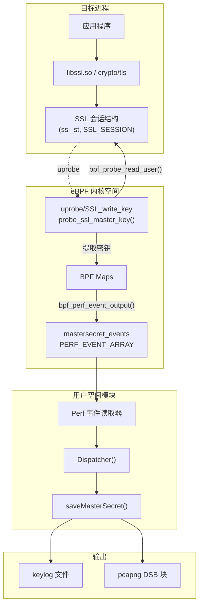
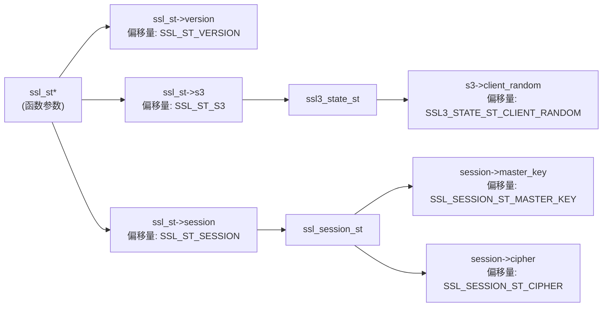
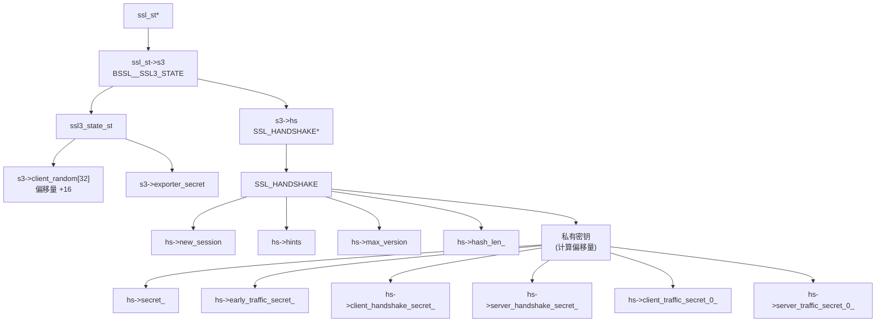
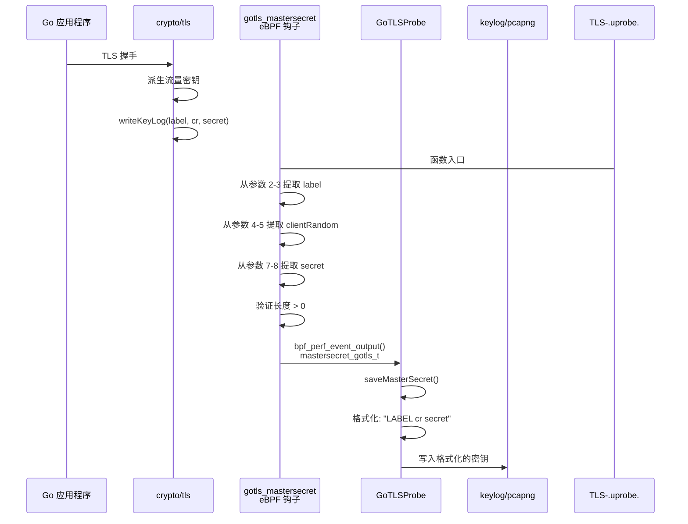
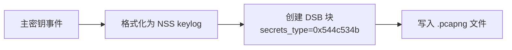

# 主密钥提取

本页面文档说明 eCapture 如何从运行中的进程提取 TLS/SSL 主密钥和流量密钥。主密钥提取使得在使用 keylog 或 pcap 输出模式时能够解密捕获的 TLS 流量。提取过程在 TLS 1.2 和 TLS 1.3 之间存在显著差异，并且在 OpenSSL、BoringSSL 和 Go TLS 实现之间也各不相同。

有关如何将提取的密钥写入输出文件的信息，请参见 [TLS 密钥日志](../4-output-formats/4.3-tls-key-logging.md)。有关使用主密钥提取的捕获模块的详细信息，请参见 [OpenSSL 模块](3.1.1-openssl-module.md)、[BoringSSL 模块](3.1.2-boringssl-module.md) 和 [Go TLS 模块](3.1.3-go-tls-module.md)。

## TLS 1.2 与 TLS 1.3 密钥材料对比

TLS 1.2 和 TLS 1.3 之间的根本区别在于密钥材料的结构和派生过程。

### TLS 1.2 主密钥

在 TLS 1.2 中，握手期间会派生出一个单一的主密钥，并在整个会话中使用。写入 keylog 文件的密钥格式遵循 NSS Key Log 格式：

```
CLIENT_RANDOM <client_random_hex> <master_secret_hex>
```

**密钥组件：**
- `client_random`: 来自 ClientHello 的 32 字节随机数据
- `master_secret`: 48 字节的主密钥材料

来源: [kern/openssl_masterkey.h:20-29](https://github.com/gojue/ecapture/blob/ca085d05/kern/openssl_masterkey.h#L20-L29), [kern/boringssl_masterkey.h:20-23](https://github.com/gojue/ecapture/blob/ca085d05/kern/boringssl_masterkey.h#L20-L23)

### TLS 1.3 流量密钥

TLS 1.3 使用多个派生密钥用于握手的不同阶段和应用数据传输。每个密钥都是独立派生的，并服务于特定目的：

| 密钥名称 | 用途 | 何时可用 |
|------------|---------|----------------|
| `CLIENT_EARLY_TRAFFIC_SECRET` | 0-RTT 早期数据（可选） | ClientHello 之后 |
| `CLIENT_HANDSHAKE_TRAFFIC_SECRET` | 客户端握手加密 | 握手期间 |
| `SERVER_HANDSHAKE_TRAFFIC_SECRET` | 服务器握手加密 | 握手期间 |
| `CLIENT_TRAFFIC_SECRET_0` | 客户端应用数据 | 握手完成后 |
| `SERVER_TRAFFIC_SECRET_0` | 服务器应用数据 | 握手完成后 |
| `EXPORTER_SECRET` | 密钥导出功能 | 握手完成后 |

每个密钥以以下格式记录：
```
<LABEL> <client_random_hex> <secret_hex>
```

来源: [kern/openssl_masterkey.h:32-39](https://github.com/gojue/ecapture/blob/ca085d05/kern/openssl_masterkey.h#L32-L39), [kern/boringssl_masterkey.h:44-56](https://github.com/gojue/ecapture/blob/ca085d05/kern/boringssl_masterkey.h#L44-L56)

## 主密钥提取架构



**提取流程：**
1. Uprobe 在 SSL 写入/读取函数上触发
2. eBPF 程序读取 SSL 结构偏移量以定位密钥
3. 验证握手状态以确保密钥可用
4. 提取客户端随机数和密钥材料
5. 通过 perf 缓冲区将事件发送到用户空间
6. 用户空间格式化并写入到 keylog 或 PCAP

来源: [kern/openssl_masterkey.h:80-251](https://github.com/gojue/ecapture/blob/ca085d05/kern/openssl_masterkey.h#L80-L251), [kern/boringssl_masterkey.h:169-397](https://github.com/gojue/ecapture/blob/ca085d05/kern/boringssl_masterkey.h#L169-L397), [user/module/probe_gotls.go:244-283](https://github.com/gojue/ecapture/blob/ca085d05/user/module/probe_gotls.go#L244-L283)

## OpenSSL 主密钥提取

### 钩点与结构导航

OpenSSL 主密钥通过钩住 SSL 写入/读取函数并导航内部结构来提取：



**TLS 1.2 提取 (OpenSSL 1.1.x, 3.x)：**

uprobe 钩子 `probe_ssl_master_key` 在 SSL 写入操作时执行：

1. 读取 `ssl_st->version` 确定 TLS 版本
2. 导航 `ssl_st->s3->client_random` 获取 32 字节随机数
3. 导航 `ssl_st->session->master_key` 获取 48 字节主密钥
4. 将 `mastersecret_t` 结构发送到用户空间

来源: [kern/openssl_masterkey.h:82-163](https://github.com/gojue/ecapture/blob/ca085d05/kern/openssl_masterkey.h#L82-L163)

**TLS 1.3 提取 (OpenSSL 1.1.1+, 3.x)：**

TLS 1.3 直接在 `ssl_st` 结构中存储密钥：

```c
// ssl_st 中 TLS 1.3 密钥的偏移量
ssl_st->early_secret              // SSL_ST_EARLY_SECRET
ssl_st->handshake_secret          // SSL_ST_HANDSHAKE_SECRET
ssl_st->handshake_traffic_hash    // SSL_ST_HANDSHAKE_TRAFFIC_HASH
ssl_st->client_app_traffic_secret // SSL_ST_CLIENT_APP_TRAFFIC_SECRET
ssl_st->server_app_traffic_secret // SSL_ST_SERVER_APP_TRAFFIC_SECRET
ssl_st->exporter_master_secret    // SSL_ST_EXPORTER_MASTER_SECRET
```

每个密钥为 64 字节 (`EVP_MAX_MD_SIZE`)。密码套件 ID 从 `ssl_session_st->cipher->id` 或 `ssl_session_st->cipher_id` 获取。

来源: [kern/openssl_masterkey.h:165-251](https://github.com/gojue/ecapture/blob/ca085d05/kern/openssl_masterkey.h#L165-L251)

### OpenSSL 3.0+ 差异

OpenSSL 3.0 重组了内部结构。主要差异是 client_random 的位置：

| OpenSSL 版本 | Client Random 位置 |
|----------------|----------------------|
| 1.1.x | `ssl_st->s3->client_random` |
| 3.0+ | `ssl_st->s3_client_random` (直接字段) |

提取使用 `SSL_ST_S3_CLIENT_RANDOM` 偏移量，在 3.0+ 中直接指向该字段。

来源: [kern/openssl_masterkey_3.0.h:114-128](https://github.com/gojue/ecapture/blob/ca085d05/kern/openssl_masterkey_3.0.h#L114-L128)

## BoringSSL 主密钥提取

BoringSSL（在 Android 上广泛使用）具有不同的内部结构布局。由于私有成员变量和握手状态管理，提取过程更加复杂。

### 结构导航



### 私有成员偏移量计算

BoringSSL 的 TLS 1.3 密钥是 C++ `private` 成员，无法通过标准 `offsetof()` 访问。偏移量基于公共成员后的内存布局计算：

```c
// 最后一个公共成员
uint16_t max_version;  // 偏移量: BSSL__SSL_HANDSHAKE_MAX_VERSION

// 私有部分在对齐后开始
// hash_len_ 是第一个私有成员
// 偏移量 = roundup(MAX_VERSION + 2, 8) = 32

#define SSL_HANDSHAKE_HASH_LEN_ roundup(BSSL__SSL_HANDSHAKE_MAX_VERSION+2, 8)
#define SSL_HANDSHAKE_SECRET_ SSL_HANDSHAKE_HASH_LEN_ + 8

// 后续密钥按 SSL_MAX_MD_SIZE (48 字节) 偏移
#define SSL_HANDSHAKE_EARLY_TRAFFIC_SECRET_ SSL_HANDSHAKE_SECRET_ + SSL_MAX_MD_SIZE*1
#define SSL_HANDSHAKE_CLIENT_HANDSHAKE_SECRET_ SSL_HANDSHAKE_SECRET_ + SSL_MAX_MD_SIZE*2
// ... 等等
```

来源: [kern/boringssl_const.h:28-61](https://github.com/gojue/ecapture/blob/ca085d05/kern/boringssl_const.h#L28-L61)

### 会话指针解析

BoringSSL 在 `SSL_SESSION` 中存储主密钥，但指针需要仔细解析：

1. **尝试 `ssl_st->s3->hs->new_session`**（活动握手的首选方式）
2. **如果 `new_session` 为 NULL，则回退到 `ssl_st->session`**

`get_session_addr()` 辅助函数实现此逻辑：

来源: [kern/boringssl_masterkey.h:141-166](https://github.com/gojue/ecapture/blob/ca085d05/kern/boringssl_masterkey.h#L141-L166)

### Android 特定处理

Android 16 对 BoringSSL 结构偏移量引入了破坏性更改：

**版本字段位置：**
- Android 15 及更早版本: `ssl_st->version`
- Android 16: `ssl_session_st->ssl_version`

**密钥长度：**
- Android 15 及更早版本: `ssl_session_st->secret_length`
- Android 16: 字段已删除，使用常量 `BORINGSSL_SSL_MAX_MASTER_KEY_LENGTH` (48)

条件编译处理这些差异：

```c
#ifdef SSL_SESSION_ST_SSL_VERSION
    // Android 16 路径
    u64 *ssl_version_ptr = (u64 *)(ssl_session_st_addr + SSL_SESSION_ST_SSL_VERSION);
#else
    // Android 15 及更早版本
    u64 *ssl_version_ptr = (u64 *)(ssl_st_ptr + SSL_ST_VERSION);
#endif
```

来源: [kern/boringssl_masterkey.h:196-320](https://github.com/gojue/ecapture/blob/ca085d05/kern/boringssl_masterkey.h#L196-L320), [utils/boringssl-offset.c:23-46](https://github.com/gojue/ecapture/blob/ca085d05/utils/boringssl-offset.c#L23-L46)

## Go TLS 主密钥提取

Go 的 `crypto/tls` 包提供了 `writeKeyLog` 回调用于记录密钥。eCapture 钩住此函数以拦截所有密钥材料。

### 钩子函数与 ABI 处理

**函数签名：**
```go
func (c *Config) writeKeyLog(label string, clientRandom, secret []byte) error
```

**eBPF 钩子：** `uprobe/gotls_mastersecret_register` 或 `uprobe/gotls_mastersecret_stack`

钩子必须处理两种 Go ABI 变体：
- **寄存器 ABI** (Go 1.17+): 参数在寄存器中传递
- **栈 ABI** (Go < 1.17): 参数在栈上传递

### 参数提取

Go 切片头部有三个字段：`array unsafe.Pointer`、`len int`、`cap int`。提取按顺序读取这些字段：

```c
// writeKeyLog(label string, clientRandom, secret []byte) 的参数索引
lab_ptr = go_get_argument(ctx, is_register_abi, 2);      // label.data
lab_len_ptr = go_get_argument(ctx, is_register_abi, 3);  // label.len
cr_ptr = go_get_argument(ctx, is_register_abi, 4);       // clientRandom.data
cr_len_ptr = go_get_argument(ctx, is_register_abi, 5);   // clientRandom.len
// 索引 6 的 cap 字段（忽略）
secret_ptr = go_get_argument(ctx, is_register_abi, 7);   // secret.data
secret_len_ptr = go_get_argument(ctx, is_register_abi, 8); // secret.len
```

来源: [kern/gotls_kern.c:194-220](https://github.com/gojue/ecapture/blob/ca085d05/kern/gotls_kern.c#L194-L220), [kern/go_argument.h:74-108](https://github.com/gojue/ecapture/blob/ca085d05/kern/go_argument.h#L74-L108)

### 主密钥结构

```c
struct mastersecret_gotls_t {
    u8 label[MASTER_SECRET_KEY_LEN];  // 最大 32 字节
    u8 labellen;
    u8 client_random[EVP_MAX_MD_SIZE]; // 64 字节
    u8 client_random_len;
    u8 secret_[EVP_MAX_MD_SIZE];       // 64 字节
    u8 secret_len;
};
```

标签标识密钥类型（例如，`"CLIENT_TRAFFIC_SECRET_0"`、`"SERVER_TRAFFIC_SECRET_0"`）。

来源: [kern/gotls_kern.c:41-48](https://github.com/gojue/ecapture/blob/ca085d05/kern/gotls_kern.c#L41-L48)

### Go TLS 密钥材料事件



来源: [kern/gotls_kern.c:194-267](https://github.com/gojue/ecapture/blob/ca085d05/kern/gotls_kern.c#L194-L267), [user/module/probe_gotls.go:244-283](https://github.com/gojue/ecapture/blob/ca085d05/user/module/probe_gotls.go#L244-L283)

## 握手状态验证

在提取密钥之前，eBPF 程序验证 TLS 握手已进行到足够阶段以使密钥可用。过早的提取会读取未初始化或不完整的数据。

### OpenSSL 状态验证

OpenSSL 在 TLS 1.2 的 `ssl_st` 结构中不暴露明确的握手状态。程序在读取主密钥之前简单地检查 `ssl_st->session` 是否非空。

对于 TLS 1.3，程序假设如果 `SSL_write` 的 uprobe 触发，则握手已完成且密钥可用。

来源: [kern/openssl_masterkey.h:82-163](https://github.com/gojue/ecapture/blob/ca085d05/kern/openssl_masterkey.h#L82-L163)

### BoringSSL 状态验证

BoringSSL 在 `SSL_HANDSHAKE->state` 和 `SSL_HANDSHAKE->tls13_state` 中维护明确的握手状态。提取验证这些状态：

**TLS 1.2 状态要求：**
```c
struct ssl3_handshake_st {
    s32 state;        // TLS 1.2 状态机
    s32 tls13_state;  // TLS 1.3 状态机
};

// TLS 1.2 最小状态
#define CLIENT_STATE12_SEND_CLIENT_FINISHED 16
#define SERVER_STATE12_READ_CLIENT_FINISHED 18

if (ssl3_hs_state.state < CLIENT_STATE12_SEND_CLIENT_FINISHED) {
    return 0;  // 尚未完成
}
```

**TLS 1.3 状态要求：**
```c
// TLS 1.3 最小状态
#define CLIENT_STATE13_READ_SERVER_FINISHED 8
#define SERVER_STATE13_READ_CLIENT_FINISHED 14

if (ssl3_hs_state.tls13_state < CLIENT_STATE13_READ_SERVER_FINISHED) {
    return 0;  // 尚未完成
}
```

这些常量对应 BoringSSL 状态机中的枚举值。

来源: [kern/boringssl_masterkey.h:76-86](https://github.com/gojue/ecapture/blob/ca085d05/kern/boringssl_masterkey.h#L76-L86), [kern/boringssl_masterkey.h:257-268](https://github.com/gojue/ecapture/blob/ca085d05/kern/boringssl_masterkey.h#L257-L268), [kern/boringssl_masterkey.h:283-342](https://github.com/gojue/ecapture/blob/ca085d05/kern/boringssl_masterkey.h#L283-L342)

### Go TLS 隐式验证

Go 的 `writeKeyLog` 回调仅在密钥就绪时由 TLS 库调用。eBPF 钩子不需要显式状态验证——函数调用本身表明密钥有效。

用户空间代码执行去重以避免多次记录相同的密钥：

```go
k := fmt.Sprintf("%s-%02x", label, clientRandom)
_, exists := g.masterSecrets[k]
if exists {
    return  // 已记录此密钥
}
g.masterSecrets[k] = true
```

来源: [user/module/probe_gotls.go:250-256](https://github.com/gojue/ecapture/blob/ca085d05/user/module/probe_gotls.go#L250-L256)

## 数据结构对比

### 主密钥事件结构

**OpenSSL (`mastersecret_t`)：**
```c
struct mastersecret_t {
    s32 version;                                 // TLS 版本
    u8 client_random[SSL3_RANDOM_SIZE];         // 32 字节
    u8 master_key[MASTER_SECRET_MAX_LEN];       // 48 字节 (TLS 1.2)
    
    // TLS 1.3 字段
    u32 cipher_id;
    u8 early_secret[EVP_MAX_MD_SIZE];           // 每个 64 字节
    u8 handshake_secret[EVP_MAX_MD_SIZE];
    u8 handshake_traffic_hash[EVP_MAX_MD_SIZE];
    u8 client_app_traffic_secret[EVP_MAX_MD_SIZE];
    u8 server_app_traffic_secret[EVP_MAX_MD_SIZE];
    u8 exporter_master_secret[EVP_MAX_MD_SIZE];
};
```

来源: [kern/openssl_masterkey.h:25-39](https://github.com/gojue/ecapture/blob/ca085d05/kern/openssl_masterkey.h#L25-L39)

**BoringSSL (`mastersecret_bssl_t`)：**
```c
struct mastersecret_bssl_t {
    s32 version;
    u8 client_random[SSL3_RANDOM_SIZE];         // 32 字节
    u8 secret_[MASTER_SECRET_MAX_LEN];          // 48 字节 (TLS 1.2)
    
    // TLS 1.3 字段
    u32 hash_len;
    u8 early_traffic_secret_[EVP_MAX_MD_SIZE];  // 每个 64 字节
    u8 client_handshake_secret_[EVP_MAX_MD_SIZE];
    u8 server_handshake_secret_[EVP_MAX_MD_SIZE];
    u8 client_traffic_secret_0_[EVP_MAX_MD_SIZE];
    u8 server_traffic_secret_0_[EVP_MAX_MD_SIZE];
    u8 exporter_secret[EVP_MAX_MD_SIZE];
};
```

关键区别在于 BoringSSL 包含 `hash_len`（哈希算法输出大小）而不是 `cipher_id`。

来源: [kern/boringssl_masterkey.h:37-56](https://github.com/gojue/ecapture/blob/ca085d05/kern/boringssl_masterkey.h#L37-L56)

**Go TLS (`mastersecret_gotls_t`)：**
```c
struct mastersecret_gotls_t {
    u8 label[MASTER_SECRET_KEY_LEN];           // 32 字节
    u8 labellen;
    u8 client_random[EVP_MAX_MD_SIZE];         // 64 字节
    u8 client_random_len;
    u8 secret_[EVP_MAX_MD_SIZE];               // 64 字节
    u8 secret_len;
};
```

Go 为每个密钥发送一个事件，标签标识密钥类型。OpenSSL 和 BoringSSL 在单个事件中发送所有密钥。

来源: [kern/gotls_kern.c:41-48](https://github.com/gojue/ecapture/blob/ca085d05/kern/gotls_kern.c#L41-L48)

## 内存管理与 BPF Map 使用

### 每 CPU 堆分配

eBPF 程序有 512 字节的栈限制。主密钥结构超过此限制，需要通过 BPF map 进行堆分配：

```c
struct {
    __uint(type, BPF_MAP_TYPE_ARRAY);
    __type(key, u32);
    __type(value, struct mastersecret_t);
    __uint(max_entries, 1);
} bpf_context_gen SEC(".maps");

struct {
    __uint(type, BPF_MAP_TYPE_LRU_HASH);
    __type(key, u64);  // PID/TID
    __type(value, struct mastersecret_t);
    __uint(max_entries, 2048);
} bpf_context SEC(".maps");

static __always_inline struct mastersecret_t *make_event() {
    u32 key_gen = 0;
    struct mastersecret_t *bpf_ctx = bpf_map_lookup_elem(&bpf_context_gen, &key_gen);
    if (!bpf_ctx) return 0;
    
    u64 id = bpf_get_current_pid_tgid();
    bpf_map_update_elem(&bpf_context, &id, bpf_ctx, BPF_ANY);
    return bpf_map_lookup_elem(&bpf_context, &id);
}
```

**分配策略：**
1. `bpf_context_gen` 是提供临时存储的每 CPU 数组
2. 将结构复制到以 PID/TID 为键的 `bpf_context` LRU 哈希
3. 从哈希 map 返回指针以供修改
4. 结构持续存在直到显式删除或 LRU 淘汰

此模式出现在所有三个实现中（OpenSSL、BoringSSL、Go TLS）。

来源: [kern/openssl_masterkey.h:62-78](https://github.com/gojue/ecapture/blob/ca085d05/kern/openssl_masterkey.h#L62-L78), [kern/boringssl_masterkey.h:122-137](https://github.com/gojue/ecapture/blob/ca085d05/kern/boringssl_masterkey.h#L122-L137)

### Perf 事件输出

填充结构后，eBPF 程序将其发送到用户空间：

```c
bpf_perf_event_output(ctx, &mastersecret_events, BPF_F_CURRENT_CPU, 
                      mastersecret, sizeof(struct mastersecret_t));
```

`mastersecret_events` perf 事件数组有 1024 个条目（每个可能的 CPU 一个）。用户空间轮询这些数组以接收事件。

来源: [kern/openssl_masterkey.h:48-53](https://github.com/gojue/ecapture/blob/ca085d05/kern/openssl_masterkey.h#L48-L53), [kern/gotls_kern.c:52-58](https://github.com/gojue/ecapture/blob/ca085d05/kern/gotls_kern.c#L52-L58)

## 与输出格式的集成

### Keylog 模式

在 keylog 模式下操作时（`-m keylog` 或 `-m key`），用户空间模块将密钥以 NSS Key Log 格式写入文件：

**TLS 1.2：**
```
CLIENT_RANDOM <32-byte-hex> <48-byte-hex>
```

**TLS 1.3（多行）：**
```
CLIENT_HANDSHAKE_TRAFFIC_SECRET <32-byte-hex> <secret-hex>
SERVER_HANDSHAKE_TRAFFIC_SECRET <32-byte-hex> <secret-hex>
CLIENT_TRAFFIC_SECRET_0 <32-byte-hex> <secret-hex>
SERVER_TRAFFIC_SECRET_0 <32-byte-hex> <secret-hex>
EXPORTER_SECRET <32-byte-hex> <secret-hex>
```

此格式与 Wireshark 和其他支持 NSS Key Log 文件的工具兼容。

来源: [user/module/probe_gotls.go:265-273](https://github.com/gojue/ecapture/blob/ca085d05/user/module/probe_gotls.go#L265-L273)

### 带 DSB 的 PCAP 模式

在 pcap/pcapng 模式下操作时（`-m pcap` 或 `-m pcapng`），密钥作为解密密钥块（DSB）嵌入 PCAP-NG 文件中：



DSB 块类型 `0x544c534b`（"TLSK"）表示 TLS Key Log 格式。Wireshark 在打开文件时自动使用这些密钥解密流量。

来源: [user/module/probe_gotls.go:275-279](https://github.com/gojue/ecapture/blob/ca085d05/user/module/probe_gotls.go#L275-L279)

### 去重逻辑

所有模块都实现去重以防止多次记录相同的密钥：

```go
// 密钥格式: "label-clientRandomHex"
k := fmt.Sprintf("%s-%02x", label, clientRandom)

_, exists := g.masterSecrets[k]
if exists {
    return  // 已记录
}

g.masterSecrets[k] = true
// ... 写入输出
```

这是必要的，因为：
- SSL 写入/读取函数可能会在每个连接上被多次调用
- Go 的 `writeKeyLog` 可能会为同一密钥被多次调用
- keylog 文件中的重复密钥可能会混淆解密工具

来源: [user/module/probe_gotls.go:250-256](https://github.com/gojue/ecapture/blob/ca085d05/user/module/probe_gotls.go#L250-L256)

## 偏移量生成与维护

### 构建时偏移量提取

结构偏移量因库版本而异。构建系统通过针对每个库版本编译小型 C 程序来生成偏移量头文件：

**OpenSSL 偏移量生成：**
```bash
# 脚本: boringssl_offset_android_16.sh
git clone https://boringssl.googlesource.com/boringssl
cd boringssl && git checkout android-16-release
g++ -I include/ -I src/ ./src/boringssl-offset.c -o off
./off > boringssl_a_16_kern.c
```

**偏移量提取程序：**
```c
#define X(struct_name, field_name) \
    format(#struct_name, #field_name, offsetof(struct struct_name, field_name));

SSL_STRUCT_OFFSETS  // 展开为偏移量计算
#undef X
```

这会生成如下输出：
```c
// ssl_st->version
#define SSL_ST_VERSION 0x18

// ssl_st->session  
#define SSL_ST_SESSION 0x30

// ssl_session_st->secret
#define SSL_SESSION_ST_SECRET 0x28
```

来源: [utils/boringssl-offset.c:69-78](https://github.com/gojue/ecapture/blob/ca085d05/utils/boringssl-offset.c#L69-L78)

### 特定版本的字节码

生成的偏移量头文件被编译成特定版本的 eBPF 字节码文件：
- `openssl_1_1_1a_kern.o` 到 `openssl_1_1_1w_kern.o`
- `openssl_3_0_0_kern.o` 到 `openssl_3_5_0_kern.o`
- `boringssl_a_13_kern.o` 到 `boringssl_a_16_kern.o`

运行时，模块检测库版本并加载相应的字节码。

来源: 文档参考章节 [结构体偏移量计算](../5-development-guide/5.2.2-structure-offset-calculation.md)

## 总结

eCapture 中的主密钥提取需要：

1. **版本检测**：识别 TLS 协议版本（1.2 vs 1.3）和库类型
2. **结构导航**：使用预先计算的偏移量遍历内部数据结构
3. **状态验证**：在读取密钥之前确保握手完成（BoringSSL）
4. **密钥提取**：根据 TLS 版本读取适当的字段
5. **事件传输**：通过 perf 事件将密钥发送到用户空间
6. **去重**：避免记录重复的密钥
7. **输出格式化**：将密钥以 NSS Key Log 格式写入 keylog 文件或 PCAP DSB

由于不同的内部结构布局和命名约定，实现是库特定的，但总体流程在 OpenSSL、BoringSSL 和 Go TLS 之间保持一致。

来源: [kern/openssl_masterkey.h](https://github.com/gojue/ecapture/blob/ca085d05/kern/openssl_masterkey.h), [kern/boringssl_masterkey.h](https://github.com/gojue/ecapture/blob/ca085d05/kern/boringssl_masterkey.h), [kern/gotls_kern.c](https://github.com/gojue/ecapture/blob/ca085d05/kern/gotls_kern.c), [user/module/probe_gotls.go:244-283](https://github.com/gojue/ecapture/blob/ca085d05/user/module/probe_gotls.go#L244-L283)