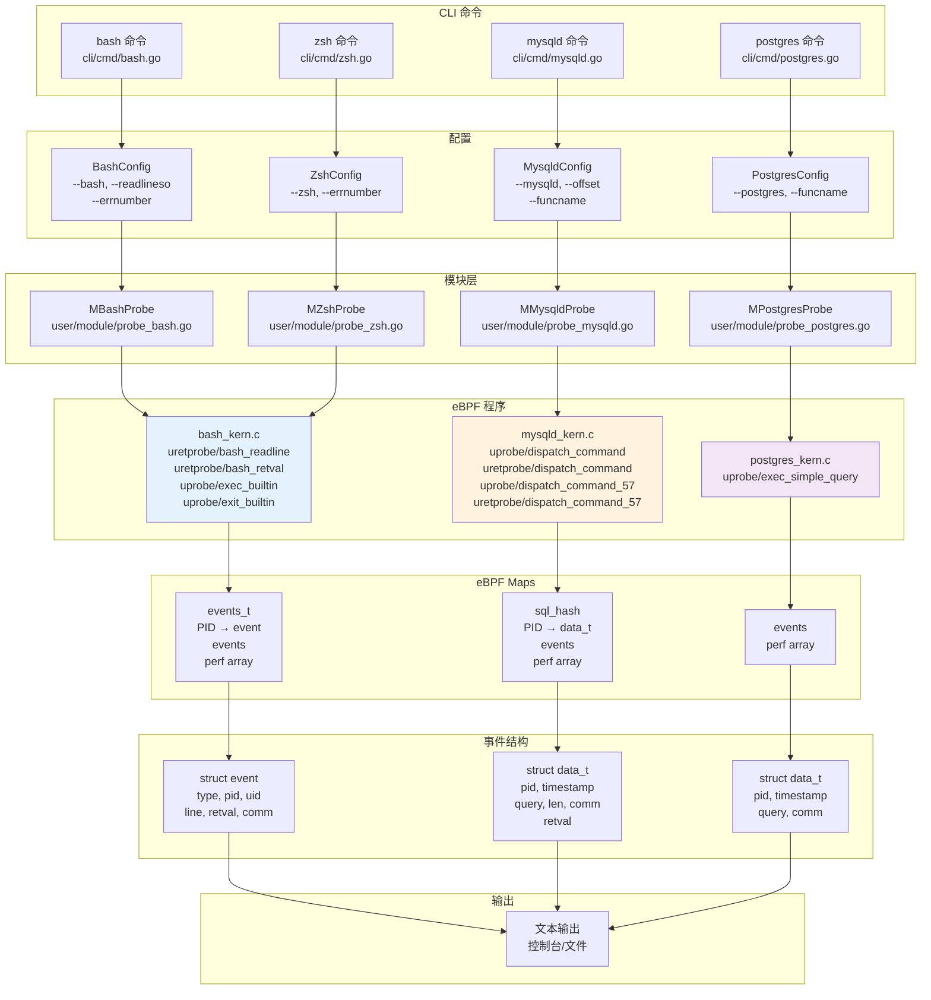
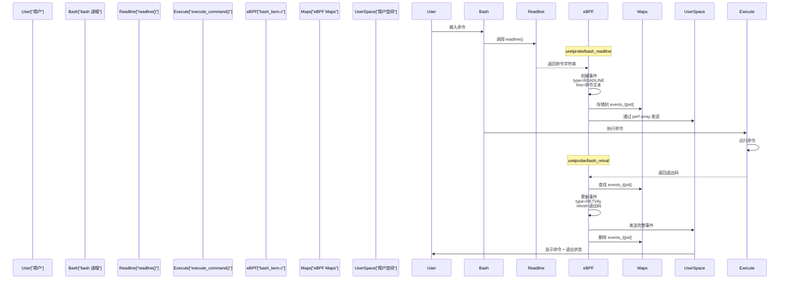
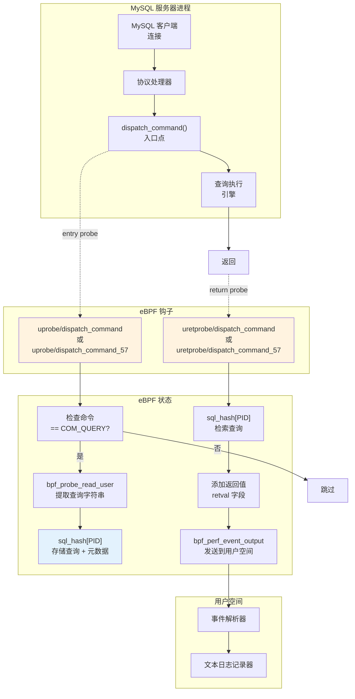
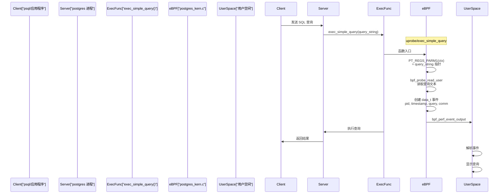

# 系统审计模块

## 目的与范围

本文档介绍 eCapture 的系统审计功能，用于在无需修改代码的情况下捕获 shell 命令和数据库查询。系统审计模块使用 eBPF uprobe 钩住 shell 解释器（Bash、Zsh）和数据库服务器（MySQL、PostgreSQL）中的关键函数，从而实现安全审计和取证分析。

关于 TLS/SSL 捕获模块（包括 OpenSSL 和 Go TLS），请参见 [TLS/SSL 模块](3.1-tlsssl-modules.md)。关于使用 TC 分类器进行网络数据包捕获，请参见 [TC 网络数据包捕获](3.3-network-packet-capture-with-tc.md)。

## 概述

系统审计模块提供以下实时可见性：
- **Shell 命令**：Bash 和 Zsh 命令执行，包括命令文本和退出状态
- **数据库查询**：MySQL 和 PostgreSQL 服务器进程执行的 SQL 查询

与专注于加密网络流量的 TLS 模块不同，系统审计模块直接从进程内存中捕获应用层活动，提供：
- 用于安全合规的命令行活动监控
- 用于调试和性能分析的数据库查询审计
- 通过 PID/UID 过滤进行进程和用户归属
- 对目标应用程序零配置要求

系统审计子系统由四个专用模块组成：

| 模块 | 目标 | 钩子函数 | 支持版本 |
|--------|--------|----------------|-------------------|
| Bash | `/bin/bash` | `readline()`, `execute_command()` | 所有版本 |
| Zsh | `/bin/zsh` | `zleread()`, `execcmd_exec()` | 所有版本 |
| MySQL | `mysqld`/`mariadbd` | `dispatch_command()` | 5.6, 5.7, 8.0, MariaDB 10.5+ |
| PostgreSQL | `postgres` | `exec_simple_query()` | 10+ |

**来源：** [cli/cmd/bash.go:1-56](https://github.com/gojue/ecapture/blob/0766a93b/cli/cmd/bash.go#L1-L56), [cli/cmd/zsh.go:1-58](https://github.com/gojue/ecapture/blob/0766a93b/cli/cmd/zsh.go#L1-L58), [cli/cmd/mysqld.go:1-50](https://github.com/gojue/ecapture/blob/0766a93b/cli/cmd/mysqld.go#L1-L50), [cli/cmd/postgres.go:1-46](https://github.com/gojue/ecapture/blob/0766a93b/cli/cmd/postgres.go#L1-L46)

## 系统审计架构



**图示：系统审计模块架构**

该架构采用分层设计，其中 CLI 命令将用户参数解析为配置对象，配置对象传递给加载和管理 eBPF 程序的模块实现。eBPF 程序使用 uprobe 拦截函数调用，在 eBPF map 中存储中间状态，并通过 perf array 将事件发送到用户空间。

**来源：** [cli/cmd/bash.go:24-55](https://github.com/gojue/ecapture/blob/0766a93b/cli/cmd/bash.go#L24-L55), [cli/cmd/mysqld.go:27-49](https://github.com/gojue/ecapture/blob/0766a93b/cli/cmd/mysqld.go#L27-L49), [cli/cmd/postgres.go:27-45](https://github.com/gojue/ecapture/blob/0766a93b/cli/cmd/postgres.go#L27-L45), [kern/bash_kern.c:17-133](https://github.com/gojue/ecapture/blob/0766a93b/kern/bash_kern.c#L17-L133), [kern/mysqld_kern.c:19-266](https://github.com/gojue/ecapture/blob/0766a93b/kern/mysqld_kern.c#L19-L266), [kern/postgres_kern.c:17-61](https://github.com/gojue/ecapture/blob/0766a93b/kern/postgres_kern.c#L17-L61)

## Shell 命令审计

### Bash 命令捕获

Bash 命令审计通过钩住 `readline()` 函数和相关执行函数来捕获命令文本及其退出状态。



**图示：Bash 命令捕获流程**

捕获过程使用两个 uretprobe：
1. **uretprobe/bash_readline** [kern/bash_kern.c:42-70](https://github.com/gojue/ecapture/blob/0766a93b/kern/bash_kern.c#L42-L70) 在 `readline()` 返回时捕获命令文本
2. **uretprobe/bash_retval** [kern/bash_kern.c:71-112](https://github.com/gojue/ecapture/blob/0766a93b/kern/bash_kern.c#L71-L112) 从命令执行中捕获退出状态

两阶段捕获使用 PID 索引的 map 存储来关联命令与其结果。

**来源：** [kern/bash_kern.c:42-112](https://github.com/gojue/ecapture/blob/0766a93b/kern/bash_kern.c#L42-L112)

### Bash eBPF 实现

Bash eBPF 程序定义事件结构并使用哈希表进行状态跟踪：

```c
struct event {
    u32 type;              // 事件类型：READLINE 或 RETVAL
    u32 pid;               // 进程 ID
    u32 uid;               // 用户 ID
    u8 line[MAX_DATA_SIZE_BASH];  // 命令文本
    u32 retval;            // 退出状态
    char comm[TASK_COMM_LEN];      // 进程名称
};
```

程序使用两个 eBPF map：
- **events** (BPF_MAP_TYPE_PERF_EVENT_ARRAY)：向用户空间输出事件 [kern/bash_kern.c:26-31](https://github.com/gojue/ecapture/blob/0766a93b/kern/bash_kern.c#L26-L31)
- **events_t** (BPF_MAP_TYPE_HASH)：存储按 PID 索引的部分事件 [kern/bash_kern.c:33-38](https://github.com/gojue/ecapture/blob/0766a93b/kern/bash_kern.c#L33-L38)

**PID/UID 过滤**：当为内核 ≥5.2 编译时（非 KERNEL_LESS_5_2），程序执行过滤：
```c
if (target_pid != 0 && target_pid != pid) {
    return 0;
}
if (target_uid != 0 && target_uid != uid) {
    return 0;
}
```

这允许用户通过 CLI 标志针对特定进程或用户。

**来源：** [kern/bash_kern.c:17-112](https://github.com/gojue/ecapture/blob/0766a93b/kern/bash_kern.c#L17-L112)

### Bash/Zsh 退出和执行事件

Bash 和 Zsh 模块都在 shell 退出或执行外部命令时捕获特殊事件：

```c
static __always_inline int send_bash_exit_event(struct pt_regs *ctx) {
    struct event event = {
        .type = BASH_EVENT_TYPE_EXIT_OR_EXEC,
        .pid = pid,
        .uid = uid,
    };
    bpf_perf_event_output(ctx, &events, BPF_F_CURRENT_CPU, &event, sizeof(struct event));
    return 0;
}

SEC("uprobe/exec_builtin")
int uprobe_exec_builtin(struct pt_regs *ctx) { return send_bash_exit_event(ctx); }

SEC("uprobe/exit_builtin")
int uprobe_exit_builtin(struct pt_regs *ctx) { return send_bash_exit_event(ctx); }
```

这些探针跟踪 shell 生命周期事件，对会话监控和取证分析很有用。

**来源：** [kern/bash_kern.c:114-133](https://github.com/gojue/ecapture/blob/0766a93b/kern/bash_kern.c#L114-L133)

### Zsh 命令捕获

Zsh 审计遵循与 Bash 相同的架构，但钩住不同的函数：
- `zleread()` 用于命令输入
- `execcmd_exec()` 用于返回值

Zsh 模块重用相同的 eBPF 字节码结构 [kern/bash_kern.c](https://github.com/gojue/ecapture/blob/0766a93b/kern/bash_kern.c)，但通过 CLI 命令 [cli/cmd/zsh.go:30-57](https://github.com/gojue/ecapture/blob/0766a93b/cli/cmd/zsh.go#L30-L57) 配置不同的钩子点。

**来源：** [cli/cmd/zsh.go:30-57](https://github.com/gojue/ecapture/blob/0766a93b/cli/cmd/zsh.go#L30-L57)

## 数据库查询审计

### MySQL 查询捕获

MySQL 查询审计拦截 `dispatch_command()` 函数，该函数处理包括 SQL 查询在内的所有客户端命令。



**图示：MySQL 查询捕获流程**

捕获使用版本特定的探针函数：
- **MySQL 5.6**: `dispatch_command(enum command, THD *thd, char *packet, uint length)` [kern/mysqld_kern.c:43-99](https://github.com/gojue/ecapture/blob/0766a93b/kern/mysqld_kern.c#L43-L99)
- **MySQL 5.7+/8.0**: `dispatch_command(THD *thd, const COM_DATA *com_data, enum command)` [kern/mysqld_kern.c:186-226](https://github.com/gojue/ecapture/blob/0766a93b/kern/mysqld_kern.c#L186-L226)

**来源：** [kern/mysqld_kern.c:43-266](https://github.com/gojue/ecapture/blob/0766a93b/kern/mysqld_kern.c#L43-L266)

### MySQL 版本特定处理

MySQL 模块处理两种不同的函数签名：

**MySQL 5.6 签名：**
```c
SEC("uprobe/dispatch_command")
int mysql56_query(struct pt_regs *ctx) {
    u64 command = (u64)PT_REGS_PARM1(ctx);  // enum_server_command
    if (command != COM_QUERY) {
        return 0;  // 仅捕获 SQL 查询 (COM_QUERY = 0x03)
    }
    
    u64 len = (u64)PT_REGS_PARM4(ctx);
    bpf_probe_read_user(&data.query, len, (void *)PT_REGS_PARM3(ctx));
}
```

**MySQL 5.7+/8.0 签名：**
```c
SEC("upr obe/dispatch_command_57")
int mysql57_query(struct pt_regs *ctx) {
    u64 command = (u64)PT_REGS_PARM3(ctx);  // enum_server_command 移动了位置
    if (command != COM_QUERY) {
        return 0;
    }
    
    void *st = (void *)PT_REGS_PARM2(ctx);  // COM_DATA 结构指针
    struct COM_QUERY_DATA query;
    bpf_probe_read_user(&query, sizeof(query), st);
    bpf_probe_read_user(&data.query, sizeof(data.query), query.query);
}
```

COM_DATA 结构布局在版本之间发生了变化 [kern/mysqld_kern.c:173-178](https://github.com/gojue/ecapture/blob/0766a93b/kern/mysqld_kern.c#L173-L178)。

**来源：** [kern/mysqld_kern.c:43-266](https://github.com/gojue/ecapture/blob/0766a93b/kern/mysqld_kern.c#L43-L266)

### MySQL 事件结构

MySQL 事件结构捕获全面的查询信息：

```c
struct data_t {
    u64 pid;        // 进程 ID
    u64 timestamp;  // 捕获时间戳
    char query[MAX_DATA_SIZE_MYSQL];  // SQL 查询文本
    u64 alllen;     // 原始查询长度
    u64 len;        // 捕获长度（如果 > MAX 则截断）
    char comm[TASK_COMM_LEN];  // 进程名称
    s8 retval;      // dispatch_command 返回值
};
```

`retval` 字段指示查询执行状态：
- **MySQL 5.6**: `DISPATCH_COMMAND_SUCCESS=0`, `DISPATCH_COMMAND_CLOSE_CONNECTION=1`, `DISPATCH_COMMAND_WOULDBLOCK=2`
- **MySQL 5.7**: 成功为 `0`，连接关闭为 `1`，内部使用 `DISPATCH_COMMAND_V57_FAILED=-2`

**来源：** [kern/mysqld_kern.c:19-27](https://github.com/gojue/ecapture/blob/0766a93b/kern/mysqld_kern.c#L19-L27), [kern/mysqld_kern.c:101-141](https://github.com/gojue/ecapture/blob/0766a93b/kern/mysqld_kern.c#L101-L141), [kern/mysqld_kern.c:233-266](https://github.com/gojue/ecapture/blob/0766a93b/kern/mysqld_kern.c#L233-L266)

### PostgreSQL 查询捕获

PostgreSQL 审计更简单，钩住处理文本查询的单个函数：



**图示：PostgreSQL 查询捕获流程**

PostgreSQL 实现很简单，因为 `exec_simple_query()` 在版本 10+ 中统一处理基于文本的查询。

**来源：** [kern/postgres_kern.c:35-60](https://github.com/gojue/ecapture/blob/0766a93b/kern/postgres_kern.c#L35-L60)

### PostgreSQL eBPF 实现

PostgreSQL eBPF 程序是数据库模块中最简单的：

```c
struct data_t {
    u64 pid;
    u64 timestamp;
    char query[MAX_DATA_SIZE_POSTGRES];
    char comm[TASK_COMM_LEN];
};

SEC("uprobe/exec_simple_query")
int postgres_query(struct pt_regs *ctx) {
    // PID/UID 过滤
    
    struct data_t data = {};
    data.pid = pid;
    data.timestamp = bpf_ktime_get_ns();
    
    char *sql_string = (char *)PT_REGS_PARM1(ctx);
    bpf_get_current_comm(&data.comm, sizeof(data.comm));
    bpf_probe_read_user(&data.query, sizeof(data.query), sql_string);
    bpf_perf_event_output(ctx, &events, BPF_F_CURRENT_CPU, &data, sizeof(data));
    return 0;
}
```

与 MySQL 不同，PostgreSQL 不需要返回值跟踪或多个版本特定的钩子。

**来源：** [kern/postgres_kern.c:17-60](https://github.com/gojue/ecapture/blob/0766a93b/kern/postgres_kern.c#L17-L60)

## CLI 使用与配置

### Shell 命令审计 CLI

**Bash 命令：**
```bash
# 基本用法
ecapture bash

# 指定 bash 二进制路径
ecapture bash --bash=/bin/bash

# 指定 readline 库路径
ecapture bash --readlineso=/lib/x86_64-linux-gnu/libreadline.so.8

# 按退出码过滤（例如，仅失败的命令）
ecapture bash -e 1

# PID/UID 过滤（通用标志）
ecapture bash --pid=1234 --uid=1000
```

**Zsh 命令：**
```bash
ecapture zsh
ecapture zsh --zsh=/bin/zsh -e 0  # 仅成功的命令
```

`--errnumber` 标志按退出状态过滤事件：
- `-e 0`：仅显示成功的命令
- `-e 1`：仅显示失败的命令
- `-e 128`（默认）：显示所有命令

**来源：** [cli/cmd/bash.go:27-55](https://github.com/gojue/ecapture/blob/0766a93b/cli/cmd/bash.go#L27-L55), [cli/cmd/zsh.go:30-57](https://github.com/gojue/ecapture/blob/0766a93b/cli/cmd/zsh.go#L30-L57)

### 数据库审计 CLI

**MySQL 命令：**
```bash
# 基本用法
ecapture mysqld

# 指定 mysqld 二进制文件
ecapture mysqld --mysqld=/usr/sbin/mysqld

# MariaDB
ecapture mysqld --mysqld=/usr/sbin/mariadbd

# 手动函数指定（用于符号解析问题）
ecapture mysqld --funcname=_Z16dispatch_commandP3THDPK8COM_DATA19enum_server_command

# 手动偏移量指定
ecapture mysqld --offset=0x710410
```

**PostgreSQL 命令：**
```bash
# 基本用法
ecapture postgres

# 指定 postgres 二进制文件
ecapture postgres --postgres=/usr/lib/postgresql/14/bin/postgres

# 手动函数指定
ecapture postgres --funcname=exec_simple_query
```

`--funcname` 和 `--offset` 标志在自动符号解析失败时提供回退机制。

**来源：** [cli/cmd/mysqld.go:30-49](https://github.com/gojue/ecapture/blob/0766a93b/cli/cmd/mysqld.go#L30-L49), [cli/cmd/postgres.go:30-45](https://github.com/gojue/ecapture/blob/0766a93b/cli/cmd/postgres.go#L30-L45)

## 系统审计模块比较

| 功能 | Bash/Zsh | MySQL | PostgreSQL |
|---------|----------|-------|------------|
| **钩子策略** | 两阶段（命令 + 返回值） | 两阶段（入口 + 返回） | 单阶段（仅入口） |
| **状态存储** | events_t[PID] 哈希表 | sql_hash[PID] 哈希表 | 无（直接输出） |
| **版本变体** | 单个 eBPF 程序 | 两个变体（5.6 vs 5.7+） | 单个程序 |
| **输出时机** | 命令完成后 | 查询完成后 | 查询开始时 |
| **截断** | MAX_DATA_SIZE_BASH | MAX_DATA_SIZE_MYSQL | MAX_DATA_SIZE_POSTGRES |
| **返回值** | 退出码（0-255） | dispatch_command 结果 | 不适用 |
| **生命周期事件** | 退出/执行跟踪 | 无 | 无 |
| **CLI 过滤** | 错误号、PID、UID | PID、UID | PID、UID |

## 实现注意事项

### 内存约束

eBPF 程序有 512 字节的栈限制，需要仔细管理缓冲区：
- Bash：`MAX_DATA_SIZE_BASH` 用于命令文本 [kern/bash_kern.c:21](https://github.com/gojue/ecapture/blob/0766a93b/kern/bash_kern.c#L21)
- MySQL：`MAX_DATA_SIZE_MYSQL` 用于查询 [kern/mysqld_kern.c:22](https://github.com/gojue/ecapture/blob/0766a93b/kern/mysqld_kern.c#L22)
- PostgreSQL：`MAX_DATA_SIZE_POSTGRES` 用于查询 [kern/postgres_kern.c:20](https://github.com/gojue/ecapture/blob/0766a93b/kern/postgres_kern.c#L20)

大型命令/查询会被截断，通过 `alllen` 与 `len` 字段进行长度跟踪。

### 基于 PID 的关联

shell 和数据库模块都使用 PID 索引的哈希表来关联入口和返回探针：
1. 入口探针将事件存储在 map 中 [kern/bash_kern.c:66](https://github.com/gojue/ecapture/blob/0766a93b/kern/bash_kern.c#L66), [kern/mysqld_kern.c:95](https://github.com/gojue/ecapture/blob/0766a93b/kern/mysqld_kern.c#L95)
2. 返回探针检索事件 [kern/bash_kern.c:89](https://github.com/gojue/ecapture/blob/0766a93b/kern/bash_kern.c#L89), [kern/mysqld_kern.c:132](https://github.com/gojue/ecapture/blob/0766a93b/kern/mysqld_kern.c#L132)
3. 返回探针更新返回值
4. 返回探针输出完整事件
5. 返回探针删除 map 条目

这种模式在实现两阶段捕获的同时防止内存泄漏。

### 跨版本兼容性

MySQL 需要版本检测来选择正确的 eBPF 程序：
- 模块代码通过二进制分析检测 MySQL 版本
- 加载 `mysql56_query`/`mysql56_query_return` 或 `mysql57_query`/`mysql57_query_return`
- COM_DATA 结构布局在版本之间有所不同

PostgreSQL 在版本 10+ 中稳定的 ABI 简化了实现。

**来源：** [kern/mysqld_kern.c:43-266](https://github.com/gojue/ecapture/blob/0766a93b/kern/mysqld_kern.c#L43-L266)