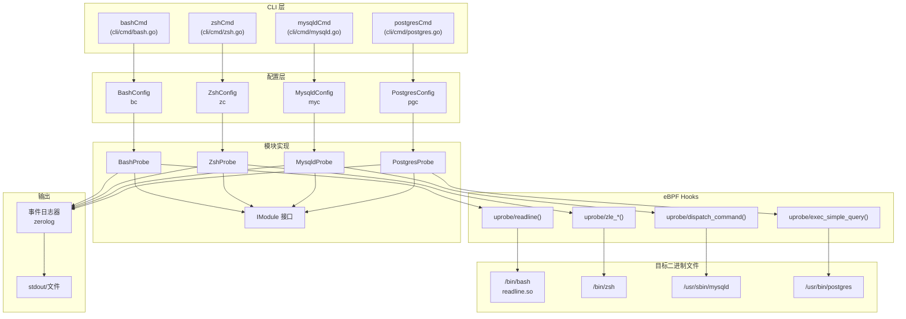
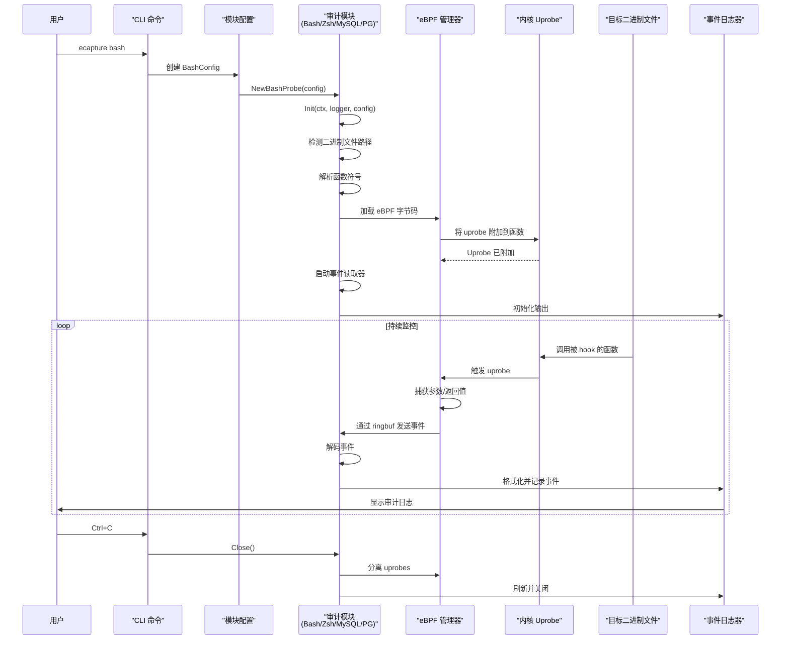
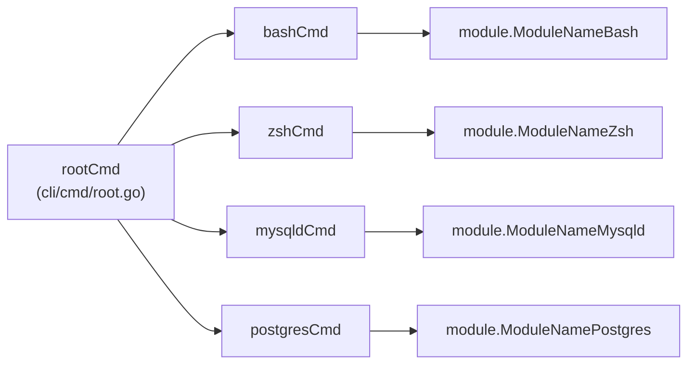

# 系统审计模块

本文档概述了 eCapture 的系统审计模块，这些模块可以在不修改代码的情况下实现对 shell 命令和数据库查询的安全监控。与 [TLS/SSL 捕获模块](3.1-tlsssl-capture-modules.md) 中介绍的模块不同，这些模块专注于审计用户操作和 SQL 查询，而不是网络流量。

关于 shell 审计的详细实现，请参见 [Shell 命令审计](3.2.1-shell-command-auditing.md)。关于数据库查询审计的详细信息，请参见 [数据库查询审计](3.2.2-database-query-auditing.md)。

---

## 目的与范围

系统审计模块使用 eBPF uprobe 技术拦截用户空间二进制文件中的函数调用，捕获命令行输入/输出和 SQL 查询字符串。这些模块用于安全审计、合规监控和取证分析等场景。

**支持的审计目标：**
- **Shell 命令**：bash（通过 readline 库）、zsh（通过 zle 库）
- **数据库查询**：MySQL/MariaDB（5.6、5.7、8.0）、PostgreSQL（10+）

所有审计模块独立于 TLS/SSL 模块运行，不需要网络接口访问或数据包捕获功能。

来源：[README.md:152-161](https://github.com/gojue/ecapture/blob/ca085d05/README.md#L152-L161)、[cli/cmd/bash.go:1-56](https://github.com/gojue/ecapture/blob/ca085d05/cli/cmd/bash.go#L1-L56)、[cli/cmd/zsh.go:1-58](https://github.com/gojue/ecapture/blob/ca085d05/cli/cmd/zsh.go#L1-L58)、[cli/cmd/mysqld.go:1-50](https://github.com/gojue/ecapture/blob/ca085d05/cli/cmd/mysqld.go#L1-L50)、[cli/cmd/postgres.go:1-46](https://github.com/gojue/ecapture/blob/ca085d05/cli/cmd/postgres.go#L1-L46)

---

## 模块概述

下表总结了 eCapture 中可用的四个系统审计模块：

| 模块 | 目标二进制文件 | Hook 库/函数 | 捕获的数据 | 主要用途 |
|--------|--------------|----------------------|---------------|------------------|
| `bash` | `/bin/bash` | readline.so (`readline()`) | 命令输入/输出、退出码 | Shell 命令审计 |
| `zsh` | `/bin/zsh` | zsh 二进制文件（zle 函数） | 命令输入/输出、退出码 | Shell 命令审计 |
| `mysqld` | `/usr/sbin/mysqld` 或 `/usr/sbin/mariadbd` | mysqld 二进制文件（dispatch 函数） | SQL 查询字符串 | 数据库查询审计 |
| `postgres` | `/usr/bin/postgres` | postgres 二进制文件（查询执行） | SQL 查询字符串 | 数据库查询审计 |

所有模块都继承自 `IModule` 接口，并遵循 [模块系统与生命周期](../2-architecture/2.5-module-system-and-lifecycle.md) 中描述的标准模块生命周期（Init → Run → Close）。

来源：[README.md:152-161](https://github.com/gojue/ecapture/blob/ca085d05/README.md#L152-L161)、[cli/cmd/bash.go:24-38](https://github.com/gojue/ecapture/blob/ca085d05/cli/cmd/bash.go#L24-L38)、[cli/cmd/zsh.go:27-41](https://github.com/gojue/ecapture/blob/ca085d05/cli/cmd/zsh.go#L27-L41)、[cli/cmd/mysqld.go:27-42](https://github.com/gojue/ecapture/blob/ca085d05/cli/cmd/mysqld.go#L27-L42)、[cli/cmd/postgres.go:27-40](https://github.com/gojue/ecapture/blob/ca085d05/cli/cmd/postgres.go#L27-L40)

---

## 架构集成

系统审计模块作为 `IModule` 接口的专用实现集成到 eCapture 的核心架构中，专注于基于 uprobe 的事件捕获，而不需要网络组件。

### 审计模块架构


```mermaid
graph TB
    subgraph "CLI 层"
        BASH_CMD["bashCmd<br/>(cli/cmd/bash.go)"]
        ZSH_CMD["zshCmd<br/>(cli/cmd/zsh.go)"]
        MYSQL_CMD["mysqldCmd<br/>(cli/cmd/mysqld.go)"]
        PG_CMD["postgresCmd<br/>(cli/cmd/postgres.go)"]
    end
    
    subgraph "配置层"
        BASH_CFG["BashConfig<br/>bc"]
        ZSH_CFG["ZshConfig<br/>zc"]
        MYSQL_CFG["MysqldConfig<br/>myc"]
        PG_CFG["PostgresConfig<br/>pgc"]
    end
    
    subgraph "模块实现"
        IMODULE["IModule 接口"]
        BASH_MOD["BashProbe"]
        ZSH_MOD["ZshProbe"]
        MYSQL_MOD["MysqldProbe"]
        PG_MOD["PostgresProbe"]
    end
    
    subgraph "eBPF Hooks"
        UPROBE_READLINE["uprobe/readline()"]
        UPROBE_ZLE["uprobe/zle_*()"]
        UPROBE_DISPATCH["uprobe/dispatch_command()"]
        UPROBE_EXEC["uprobe/exec_simple_query()"]
    end
    
    subgraph "目标二进制文件"
        BASH_BIN["/bin/bash<br/>readline.so"]
        ZSH_BIN["/bin/zsh"]
        MYSQL_BIN["/usr/sbin/mysqld"]
        PG_BIN["/usr/bin/postgres"]
    end
    
    subgraph "输出"
        LOGGER["事件日志器<br/>zerolog"]
        STDOUT["stdout/文件"]
    end
    
    BASH_CMD --> BASH_CFG
    ZSH_CMD --> ZSH_CFG
    MYSQL_CMD --> MYSQL_CFG
    PG_CMD --> PG_CFG
    
    BASH_CFG --> BASH_MOD
    ZSH_CFG --> ZSH_MOD
    MYSQL_CFG --> MYSQL_MOD
    PG_CFG --> PG_MOD
    
    BASH_MOD --> IMODULE
    ZSH_MOD --> IMODULE
    MYSQL_MOD --> IMODULE
    PG_MOD --> IMODULE
    
    BASH_MOD --> UPROBE_READLINE
    ZSH_MOD --> UPROBE_ZLE
    MYSQL_MOD --> UPROBE_DISPATCH
    PG_MOD --> UPROBE_EXEC
    
    UPROBE_READLINE --> BASH_BIN
    UPROBE_ZLE --> ZSH_BIN
    UPROBE_DISPATCH --> MYSQL_BIN
    UPROBE_EXEC --> PG_BIN
    
    BASH_MOD --> LOGGER
    ZSH_MOD --> LOGGER
    MYSQL_MOD --> LOGGER
    PG_MOD --> LOGGER
    
    LOGGER --> STDOUT
```

**与 TLS 模块的主要区别：**
- 不需要网络接口（`-i`）参数
- 没有 pcap/keylog 输出模式
- 没有 Traffic Control (TC) hooks 或数据包捕获
- 更简单的事件流：uprobe → decode → log（无协议解析）

来源：[cli/cmd/bash.go:1-56](https://github.com/gojue/ecapture/blob/ca085d05/cli/cmd/bash.go#L1-L56)、[cli/cmd/zsh.go:1-58](https://github.com/gojue/ecapture/blob/ca085d05/cli/cmd/zsh.go#L1-L58)、[cli/cmd/mysqld.go:1-50](https://github.com/gojue/ecapture/blob/ca085d05/cli/cmd/mysqld.go#L1-L50)、[cli/cmd/postgres.go:1-46](https://github.com/gojue/ecapture/blob/ca085d05/cli/cmd/postgres.go#L1-L46)

---

## 命令行接口

每个审计模块都作为 `ecapture` 二进制文件的子命令调用，具有特定于模块的配置标志。

### Shell 命令审计命令

#### Bash 模块

```bash
# 基本用法 - 自动检测 bash 二进制文件
sudo ecapture bash

# 指定 bash 二进制文件路径
sudo ecapture bash --bash=/bin/bash

# 指定 readline 库路径
sudo ecapture bash --readlineso=/lib/x86_64-linux-gnu/libreadline.so.8

# 按错误号过滤（仅显示失败的命令）
sudo ecapture bash --errnumber=1

# 结合日志记录的组合标志
sudo ecapture bash -l bash_audit.log --pid=1234
```

**配置结构**：`BashConfig` [cli/cmd/bash.go:24](https://github.com/gojue/ecapture/blob/ca085d05/cli/cmd/bash.go#L24)
- `Bashpath`：bash 二进制文件路径（默认：从 `$SHELL` 自动检测）
- `Readline`：readline.so 库路径（默认：自动检测）
- `ErrNo`：按退出码过滤命令（默认：`BashErrnoDefault`）

#### Zsh 模块

```bash
# 基本用法 - 自动检测 zsh 二进制文件
sudo ecapture zsh

# 指定 zsh 二进制文件路径
sudo ecapture zsh --zsh=/bin/zsh

# 按错误号过滤
sudo ecapture zsh --errnumber=127
```

**配置结构**：`ZshConfig` [cli/cmd/zsh.go:27](https://github.com/gojue/ecapture/blob/ca085d05/cli/cmd/zsh.go#L27)
- `Zshpath`：zsh 二进制文件路径（默认：从 `$SHELL` 自动检测）
- `ErrNo`：按退出码过滤命令（默认：`ZshErrnoDefault`）

来源：[cli/cmd/bash.go:24-56](https://github.com/gojue/ecapture/blob/ca085d05/cli/cmd/bash.go#L24-L56)、[cli/cmd/zsh.go:27-58](https://github.com/gojue/ecapture/blob/ca085d05/cli/cmd/zsh.go#L27-L58)

---

### 数据库查询审计命令

#### MySQL/MariaDB 模块

```bash
# 基本用法 - 默认 mysqld 路径
sudo ecapture mysqld

# 指定 mysqld 二进制文件（MySQL）
sudo ecapture mysqld --mysqld=/usr/sbin/mysqld

# 指定 mariadbd 二进制文件（MariaDB）
sudo ecapture mysqld --mysqld=/usr/sbin/mariadbd

# 通过名称 hook 特定函数
sudo ecapture mysqld --funcname=dispatch_command

# 通过偏移量 hook（高级用法）
sudo ecapture mysqld --offset=0x710410

# 结合日志记录
sudo ecapture mysqld -l mysql_queries.log --pid=3306
```

**配置结构**：`MysqldConfig` [cli/cmd/mysqld.go:27](https://github.com/gojue/ecapture/blob/ca085d05/cli/cmd/mysqld.go#L27)
- `Mysqldpath`：mysqld/mariadbd 二进制文件路径（默认：`/usr/sbin/mariadbd`）
- `FuncName`：要 hook 的特定函数名（可选）
- `Offset`：uprobe 附加的内存偏移量（可选，高级用法）

**支持的版本**：MySQL 5.6/5.7/8.0、MariaDB 10.5+

#### PostgreSQL 模块

```bash
# 基本用法 - 默认 postgres 路径
sudo ecapture postgres

# 指定 postgres 二进制文件路径
sudo ecapture postgres --postgres=/usr/lib/postgresql/14/bin/postgres

# Hook 特定函数
sudo ecapture postgres --funcname=exec_simple_query

# 结合日志记录
sudo ecapture postgres -l postgres_queries.log --pid=5432
```

**配置结构**：`PostgresConfig` [cli/cmd/postgres.go:27](https://github.com/gojue/ecapture/blob/ca085d05/cli/cmd/postgres.go#L27)
- `PostgresPath`：postgres 二进制文件路径（默认：`/usr/bin/postgres`）
- `FuncName`：要 hook 的特定函数名（可选）

**支持的版本**：PostgreSQL 10+

来源：[cli/cmd/mysqld.go:27-50](https://github.com/gojue/ecapture/blob/ca085d05/cli/cmd/mysqld.go#L27-L50)、[cli/cmd/postgres.go:27-46](https://github.com/gojue/ecapture/blob/ca085d05/cli/cmd/postgres.go#L27-L46)

---

## 模块执行流程

所有审计模块都遵循标准的 eCapture 模块生命周期，与 TLS 模块相比，事件处理更为简化。

### 审计模块生命周期


```mermaid
sequenceDiagram
    participant User as 用户
    participant CLI as "CLI 命令"
    participant Config as "模块配置"
    participant Module as "审计模块<br/>(Bash/Zsh/MySQL/PG)"
    participant eBPF as "eBPF 管理器"
    participant Kernel as "内核 Uprobe"
    participant Target as "目标二进制文件"
    participant Logger as "事件日志器"
    
    User->>CLI: ecapture bash
    CLI->>Config: 创建 BashConfig
    Config->>Module: NewBashProbe(config)
    
    Module->>Module: Init(ctx, logger, config)
    Module->>Module: 检测二进制文件路径
    Module->>Module: 解析函数符号
    
    Module->>eBPF: 加载 eBPF 字节码
    eBPF->>Kernel: 将 uprobe 附加到函数
    Kernel-->>eBPF: Uprobe 已附加
    
    Module->>Module: 启动事件读取器
    Module->>Logger: 初始化输出
    
    loop 持续监控
        Target->>Kernel: 调用被 hook 的函数
        Kernel->>eBPF: 触发 uprobe
        eBPF->>eBPF: 捕获参数/返回值
        eBPF->>Module: 通过 ringbuf 发送事件
        Module->>Module: 解码事件
        Module->>Logger: 格式化并记录事件
        Logger->>User: 显示审计日志
    end
    
    User->>CLI: Ctrl+C
    CLI->>Module: Close()
    Module->>eBPF: 分离 uprobes
    Module->>Logger: 刷新并关闭
```

**与 TLS 模块的主要区别：**
1. 无网络接口绑定或 TC 分类器设置
2. 无 EventProcessor/IWorker 池（更简单的事件流）
3. 无协议解析（不使用 IParser）
4. 直接的事件 decode → log 管道
5. 无主密钥提取或 pcap 文件生成

来源：[cli/cmd/bash.go:52-55](https://github.com/gojue/ecapture/blob/ca085d05/cli/cmd/bash.go#L52-L55)、[cli/cmd/mysqld.go:46-49](https://github.com/gojue/ecapture/blob/ca085d05/cli/cmd/mysqld.go#L46-L49)

---

## 通用配置参数

所有审计模块除了其特定于模块的标志外，还支持从根命令继承的标准全局标志。

### 全局标志（继承）

| 标志 | 类型 | 默认值 | 描述 |
|------|------|---------|-------------|
| `--pid` | uint | 0 | 目标特定进程 ID（0 = 所有进程） |
| `--uid` | uint | 0 | 目标特定用户 ID（0 = 所有用户） |
| `-l, --logaddr` | string | "" | 日志输出文件路径（空 = stdout） |
| `--hex` | bool | false | 以十六进制格式打印载荷 |

### 模块检测逻辑

每个审计模块都实现了二进制文件/库检测逻辑：

1. **Bash 模块** [cli/cmd/bash.go:36-37](https://github.com/gojue/ecapture/blob/ca085d05/cli/cmd/bash.go#L36-L37)
   - 从 `$SHELL` 环境变量自动检测 bash
   - 从 bash 的链接库自动定位 readline.so

2. **Zsh 模块** [cli/cmd/zsh.go:39](https://github.com/gojue/ecapture/blob/ca085d05/cli/cmd/zsh.go#L39)
   - 从 `$SHELL` 环境变量自动检测 zsh

3. **MySQL 模块** [cli/cmd/mysqld.go:40](https://github.com/gojue/ecapture/blob/ca085d05/cli/cmd/mysqld.go#L40)
   - 默认路径：`/usr/sbin/mariadbd`
   - 可以为 MySQL 安装指定 `/usr/sbin/mysqld`

4. **PostgreSQL 模块** [cli/cmd/postgres.go:37](https://github.com/gojue/ecapture/blob/ca085d05/cli/cmd/postgres.go#L37)
   - 默认路径：`/usr/bin/postgres`
   - 版本无关检测（适用于 PG 10+）

来源：[cli/cmd/bash.go:36-37](https://github.com/gojue/ecapture/blob/ca085d05/cli/cmd/bash.go#L36-L37)、[cli/cmd/zsh.go:39](https://github.com/gojue/ecapture/blob/ca085d05/cli/cmd/zsh.go#L39)、[cli/cmd/mysqld.go:40](https://github.com/gojue/ecapture/blob/ca085d05/cli/cmd/mysqld.go#L40)、[cli/cmd/postgres.go:37](https://github.com/gojue/ecapture/blob/ca085d05/cli/cmd/postgres.go#L37)

---

## 使用场景与示例

### 安全审计场景

#### 命令历史审计

**场景**：监控特定用户执行的所有 bash 命令，无需修改 shell 配置或需要用户配合。

```bash
# 监控用户 ID 1000 的所有命令
sudo ecapture bash --uid=1000 -l /var/log/audit/bash_commands.log

# 监控特定 bash 进程
sudo ecapture bash --pid=12345 -l /var/log/audit/process_12345.log

# 仅显示失败的命令（非零退出码）
sudo ecapture bash --errnumber=1
```

**输出格式**：捕获命令文本、PID、UID、时间戳和退出码。

#### 数据库查询审计

**场景**：审计生产 MySQL 服务器上执行的所有 SQL 查询，用于合规监控。

```bash
# 监控所有 MySQL 查询
sudo ecapture mysqld --mysqld=/usr/sbin/mysqld -l /var/log/audit/mysql_queries.log

# 通过 PID 监控特定 MySQL 实例
sudo ecapture mysqld --pid=3306 -l /var/log/audit/mysql_3306.log
```

**输出格式**：捕获 SQL 查询字符串及连接元数据（PID、时间戳）。

#### 取证分析

**场景**：通过在事件响应期间捕获所有 shell 命令和数据库查询来调查可疑活动。

```bash
# 终端 1：监控 bash 命令
sudo ecapture bash -l /tmp/forensics/bash.log

# 终端 2：监控 PostgreSQL 查询
sudo ecapture postgres -l /tmp/forensics/postgres.log

# 终端 3：监控 zsh 命令
sudo ecapture zsh -l /tmp/forensics/zsh.log
```

来源：[README.md:152-161](https://github.com/gojue/ecapture/blob/ca085d05/README.md#L152-L161)、[cli/cmd/bash.go:30-32](https://github.com/gojue/ecapture/blob/ca085d05/cli/cmd/bash.go#L30-L32)、[cli/cmd/mysqld.go:32-36](https://github.com/gojue/ecapture/blob/ca085d05/cli/cmd/mysqld.go#L32-L36)

---

## 与 TLS 模块的比较

下表突出显示了审计模块与 TLS 捕获模块之间的架构差异：

| 功能 | 系统审计模块 | TLS/SSL 模块 |
|---------|---------------------|-----------------|
| **Hook 类型** | 仅 Uprobe | Uprobe + TC + Kprobe |
| **网络接口** | 不需要 | pcap 模式需要 |
| **事件处理** | 直接 decode → log | EventProcessor + IWorker 池 |
| **协议解析** | 不适用 | IParser 实现 |
| **输出模式** | 仅文本 | 文本、pcap、keylog |
| **主密钥提取** | 不适用 | TLS 1.2/1.3 密钥 |
| **目标检测** | 二进制文件路径查找 | 库版本检测 |
| **用例** | 命令/查询审计 | 加密流量捕获 |

审计模块比 TLS 模块简单得多，因为它们不需要：
- 网络数据包重组
- 连接跟踪（4 元组映射）
- 协议状态机
- 主密钥提取
- 带 DSB 块的 PCAP 文件生成

有关 TLS 模块的详细信息，请参见 [TLS/SSL 捕获模块](3.1-tlsssl-capture-modules.md)。

来源：[README.md:38-43](https://github.com/gojue/ecapture/blob/ca085d05/README.md#L38-L43)、[README.md:152-161](https://github.com/gojue/ecapture/blob/ca085d05/README.md#L152-L161)

---

## 模块注册

所有审计模块通过各自命令文件中的 `init()` 函数在 CLI 命令结构中注册：


```mermaid
graph LR
    ROOT["rootCmd<br/>(cli/cmd/root.go)"]
    
    ROOT --> BASH["bashCmd"]
    ROOT --> ZSH["zshCmd"]
    ROOT --> MYSQL["mysqldCmd"]
    ROOT --> PG["postgresCmd"]
    
    BASH --> BASH_MOD["module.ModuleNameBash"]
    ZSH --> ZSH_MOD["module.ModuleNameZsh"]
    MYSQL --> MYSQL_MOD["module.ModuleNameMysqld"]
    PG --> PG_MOD["module.ModuleNamePostgres"]
```

**命令注册**：[cli/cmd/bash.go:35-55](https://github.com/gojue/ecapture/blob/ca085d05/cli/cmd/bash.go#L35-L55)、[cli/cmd/zsh.go:38-52](https://github.com/gojue/ecapture/blob/ca085d05/cli/cmd/zsh.go#L38-L52)、[cli/cmd/mysqld.go:39-44](https://github.com/gojue/ecapture/blob/ca085d05/cli/cmd/mysqld.go#L39-L44)、[cli/cmd/postgres.go:36-40](https://github.com/gojue/ecapture/blob/ca085d05/cli/cmd/postgres.go#L36-L40)

**模块执行**：所有命令都调用 `runModule(moduleName, config)`，该函数：
1. 调用 `setModConfig(globalConf, moduleConfig)`
2. 实例化模块实现
3. 执行标准生命周期：Init() → Run() → Close()

有关详细的模块生命周期信息，请参见 [模块系统与生命周期](../2-architecture/2.5-module-system-and-lifecycle.md)。

来源：[cli/cmd/bash.go:52-55](https://github.com/gojue/ecapture/blob/ca085d05/cli/cmd/bash.go#L52-L55)、[cli/cmd/zsh.go:54-57](https://github.com/gojue/ecapture/blob/ca085d05/cli/cmd/zsh.go#L54-L57)、[cli/cmd/mysqld.go:46-49](https://github.com/gojue/ecapture/blob/ca085d05/cli/cmd/mysqld.go#L46-L49)、[cli/cmd/postgres.go:42-45](https://github.com/gojue/ecapture/blob/ca085d05/cli/cmd/postgres.go#L42-L45)

---

## 构建配置

系统审计模块根据构建标签进行有条件编译：

- **Bash 模块**：在所有平台上可用
- **Zsh 模块**：在 Android 上排除（`!androidgki` 构建标签）[cli/cmd/zsh.go:1-2](https://github.com/gojue/ecapture/blob/ca085d05/cli/cmd/zsh.go#L1-L2)
- **MySQL 模块**：在 Android 上排除（`!androidgki` 构建标签）[cli/cmd/mysqld.go:1-2](https://github.com/gojue/ecapture/blob/ca085d05/cli/cmd/mysqld.go#L1-L2)
- **PostgreSQL 模块**：在 Android 上排除（`!androidgki` 构建标签）[cli/cmd/postgres.go:1-2](https://github.com/gojue/ecapture/blob/ca085d05/cli/cmd/postgres.go#L1-L2)

这种有条件编译减少了 Android 部署的二进制文件大小，因为这些审计功能通常在 Android 上不需要。

有关构建系统的详细信息，请参见 [构建系统](../5-development-guide/5.1-build-system.md)。

来源：[cli/cmd/zsh.go:1-2](https://github.com/gojue/ecapture/blob/ca085d05/cli/cmd/zsh.go#L1-L2)、[cli/cmd/mysqld.go:1-2](https://github.com/gojue/ecapture/blob/ca085d05/cli/cmd/mysqld.go#L1-L2)、[cli/cmd/postgres.go:1-2](https://github.com/gojue/ecapture/blob/ca085d05/cli/cmd/postgres.go#L1-L2)