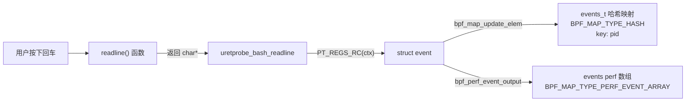
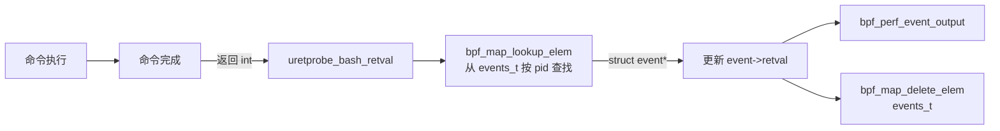
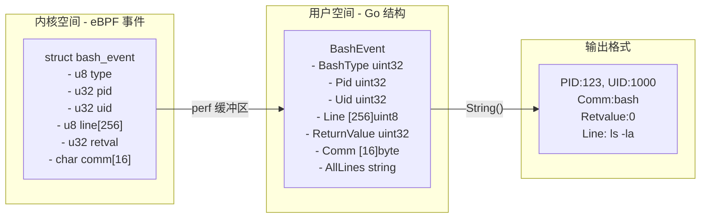
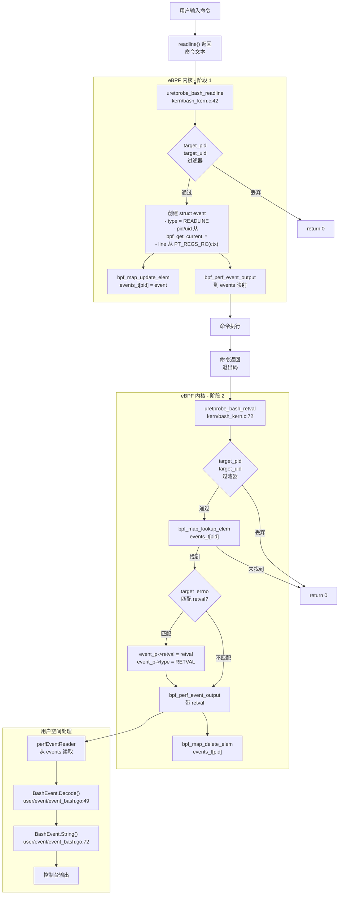
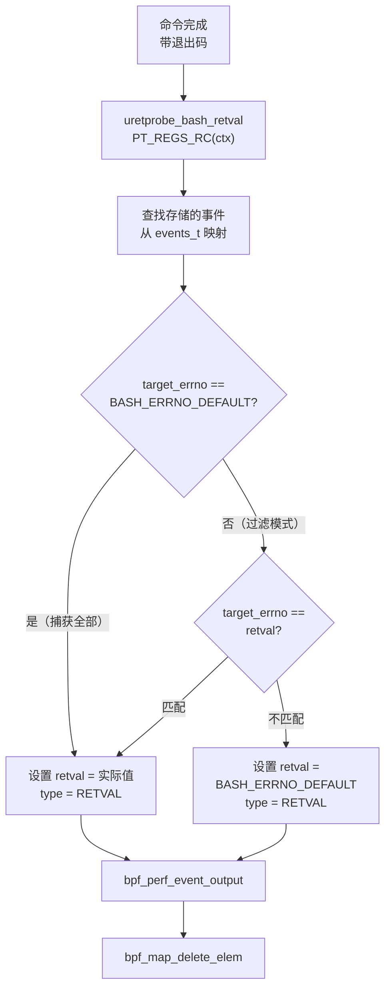
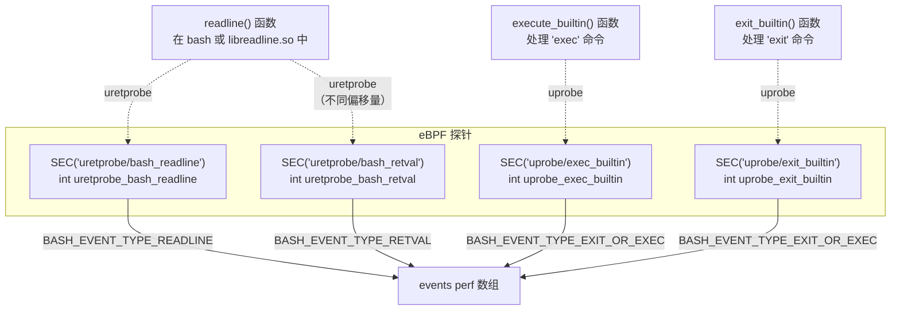
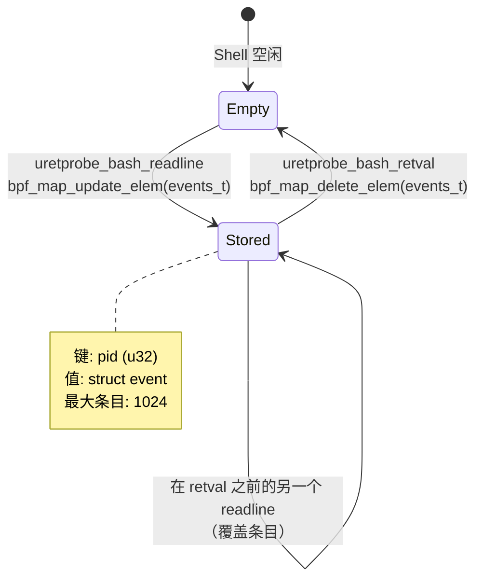
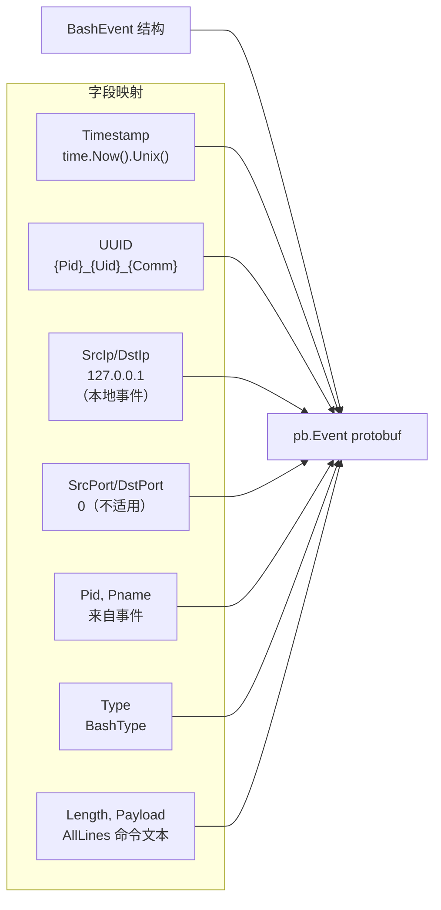

# Shell 命令审计

## 目的与范围

本文档描述 eCapture 对 Bash 和 Zsh shell 的命令审计能力。这些模块使用附加到 `readline()` 函数的 eBPF uretprobe 来捕获交互式命令行输入及其执行返回值。这种方法在库级别拦截命令，早于它们到达 shell 历史文件，提供了一个不可绕过的审计跟踪，用于安全监控。

实现采用两阶段捕获模式：第一个探针在 `readline()` 返回时捕获命令文本，第二个在执行后捕获命令的退出码。事件临时存储在 eBPF 哈希映射中以关联这两个阶段。

有关数据库查询审计，请参阅[数据库查询审计](3.2.2-database-query-auditing.md)。有关通用模块架构，请参阅[模块系统与生命周期](../2-architecture/2.4-module-system-and-lifecycle.md)。

## eBPF 程序架构

### 两阶段捕获模式

Bash 模块使用两个独立的 uretprobe 钩子和中间状态存储实现两阶段捕获机制：

**阶段 1 - 命令行捕获：**
标题：**命令行捕获流程**


**阶段 2 - 返回值捕获：**
标题：**返回值捕获流程**


**来源：** [kern/bash_kern.c:42-112](https://github.com/gojue/ecapture/blob/0766a93b/kern/bash_kern.c#L42-L112)

### eBPF 程序结构

内核侧 eBPF 程序定义了以下组件：

**事件结构：**
```c
struct event {
    u32 type;      // 事件类型（READLINE、RETVAL、EXIT_OR_EXEC）
    u32 pid;       // 进程 ID
    u32 uid;       // 用户 ID
    u8 line[MAX_DATA_SIZE_BASH];  // 命令行（256 字节）
    u32 retval;    // 命令返回值
    char comm[TASK_COMM_LEN];     // 进程名（16 字节）
};
```

**BPF 映射：**
- `events` - Perf 事件数组，用于向用户空间发送事件
- `events_t` - 哈希映射，用于在两个阶段之间临时存储事件（键：pid）

**探针函数：**
- `uretprobe_bash_readline` - 在 readline() 返回时捕获命令文本
- `uretprobe_bash_retval` - 在命令执行后捕获退出码
- `uprobe_exec_builtin` - 检测 `exec` 内置命令执行
- `uprobe_exit_builtin` - 检测 `exit` 内置命令执行

**来源：** [kern/bash_kern.c:17-133](https://github.com/gojue/ecapture/blob/0766a93b/kern/bash_kern.c#L17-L133)

---

## 配置

### Bash 模块配置

Bash 模块接受以下配置参数：

| 参数 | 标志 | 类型 | 默认值 | 描述 |
|-----------|------|------|---------|-------------|
| Bashpath | `--bash` | string | 从 `$SHELL` 自动检测 | bash 可执行文件路径 |
| Readline | `--readlineso` | string | 从 bash 路径自动检测 | readline.so 库路径 |
| ErrNo | `-e, --errnumber` | int | `BashErrnoDefault` | 按退出码过滤命令 |

**配置结构：**

```go
// 通过 config.NewBashConfig() 创建
type BashConfig struct {
    Bashpath string  // 目标 bash 二进制文件
    Readline string  // libreadline.so 路径
    ErrNo    int     // 退出码过滤器
}
```

### Zsh 模块配置

| 参数 | 标志 | 类型 | 默认值 | 描述 |
|-----------|------|------|---------|-------------|
| Zshpath | `--zsh` | string | 从 `$SHELL` 自动检测 | zsh 可执行文件路径 |
| ErrNo | `-e, --errnumber` | int | `ZshErrnoDefault` | 按退出码过滤命令 |

**来源：** [cli/cmd/bash.go:24-39](https://github.com/gojue/ecapture/blob/0766a93b/cli/cmd/bash.go#L24-L39), [cli/cmd/zsh.go:27-41](https://github.com/gojue/ecapture/blob/0766a93b/cli/cmd/zsh.go#L27-L41)

### 命令行使用

```bash
# 基本 bash 命令捕获
ecapture bash

# 使用自定义路径捕获 bash 命令
ecapture bash --bash=/bin/bash --readlineso=/lib/x86_64-linux-gnu/libreadline.so

# 按退出码过滤（只显示失败的命令）
ecapture bash -e 1

# Zsh 命令捕获
ecapture zsh --zsh=/bin/zsh -e 0
```

**来源：** [cli/cmd/bash.go:26-33](https://github.com/gojue/ecapture/blob/0766a93b/cli/cmd/bash.go#L26-L33), [cli/cmd/zsh.go:30-36](https://github.com/gojue/ecapture/blob/0766a93b/cli/cmd/zsh.go#L30-L36)

---

## 事件结构

### BashEvent 数据布局

从 shell 捕获的命令被编码在 `BashEvent` 结构中，它镜像了 eBPF 内核侧结构：



**来源：** [user/event/event_bash.go:26-47](https://github.com/gojue/ecapture/blob/0766a93b/user/event/event_bash.go#L26-L47)

### 字段描述

| 字段 | 类型 | 大小 | 描述 |
|-------|------|------|-------------|
| BashType | uint32 | 4 字节 | 事件类型（见事件类型表） |
| Pid | uint32 | 4 字节 | Shell 的进程 ID |
| Uid | uint32 | 4 字节 | 执行命令的用户 ID |
| Line | [256]uint8 | 256 字节 | 来自 readline 缓冲区的命令行文本 |
| ReturnValue | uint32 | 4 字节 | 命令的退出码（0=成功） |
| Comm | [16]byte | 16 字节 | 进程名（通常是 "bash" 或 "zsh"） |
| AllLines | string | 可变 | 聚合的完整命令（用户空间字段） |

### 事件类型

eBPF 程序生成三种类型的事件：

| 常量 | 值 | 描述 | 来源函数 |
|----------|-------|-------------|-----------------|
| BASH_EVENT_TYPE_READLINE | 0 | 从 readline() 捕获的命令行 | `uretprobe_bash_readline` |
| BASH_EVENT_TYPE_RETVAL | 1 | 捕获的命令退出码 | `uretprobe_bash_retval` |
| BASH_EVENT_TYPE_EXIT_OR_EXEC | 2 | 检测到 shell 退出或 exec | `uprobe_exec_builtin`, `uprobe_exit_builtin` |

**最大数据大小：** `MAX_DATA_SIZE_BASH` = 每个事件 256 字节（定义在 [kern/bash_kern.c:21](https://github.com/gojue/ecapture/blob/0766a93b/kern/bash_kern.c#L21)）

**来源：** [user/event/event_bash.go:37-47](https://github.com/gojue/ecapture/blob/0766a93b/user/event/event_bash.go#L37-L47), [kern/bash_kern.c:17-24](https://github.com/gojue/ecapture/blob/0766a93b/kern/bash_kern.c#L17-L24)

---

## 事件处理流程

### 从 Shell 到输出的数据流

标题：**完整的 Bash 命令捕获流程**


**来源：** [kern/bash_kern.c:42-112](https://github.com/gojue/ecapture/blob/0766a93b/kern/bash_kern.c#L42-L112), [user/event/event_bash.go:49-80](https://github.com/gojue/ecapture/blob/0766a93b/user/event/event_bash.go#L49-L80)

### 过滤机制

eBPF 程序实现了三个级别的过滤：

**1. PID/UID 过滤（内核级别）：**
```c
// 在 uretprobe_bash_readline 中（第 50-57 行）
if (target_pid != 0 && target_pid != pid) {
    return 0;  // 如果 PID 不匹配则丢弃
}
if (target_uid != 0 && target_uid != uid) {
    return 0;  // 如果 UID 不匹配则丢弃
}
```

**2. 退出码过滤（内核级别）：**
```c
// 在 uretprobe_bash_retval 中（第 92-102 行）
if (target_errno != BASH_ERRNO_DEFAULT && target_errno != retval) {
    // 仍然输出事件但标记为未捕获
    event_p->retval = BASH_ERRNO_DEFAULT;
    event_p->type = BASH_EVENT_TYPE_RETVAL;
    bpf_perf_event_output(...);
    return 0;
}
```

**3. 基于 UUID 的事件关联（用户级别）：**

UUID 格式：`{Pid}_{Uid}_{Comm}`

示例：`1234_1000_bash`

此 UUID 使得能够在事件处理流程中对来自同一 shell 会话的相关事件进行分组。

**来源：** [kern/bash_kern.c:50-102](https://github.com/gojue/ecapture/blob/0766a93b/kern/bash_kern.c#L50-L102), [user/event/event_bash.go:123-125](https://github.com/gojue/ecapture/blob/0766a93b/user/event/event_bash.go#L123-L125)

---

## 退出码过滤

### 过滤器配置

退出码过滤器使用 `target_errno` 变量在 eBPF 内核级别运行：

标题：**退出码过滤逻辑**


**常量：**
- `BASH_ERRNO_DEFAULT` - 特殊值，表示"捕获所有退出码"
- 当 `target_errno` 匹配此默认值时，无论退出码如何都会捕获所有命令
- 当 `target_errno` 设置为特定值（例如 0、1、127）时，只有匹配的命令才会被完全捕获

**来源：** [kern/bash_kern.c:92-102](https://github.com/gojue/ecapture/blob/0766a93b/kern/bash_kern.c#L92-L102)

### 常见用例

| ErrNo 值 | 用例 | 描述 |
|-------------|----------|-------------|
| 0 | 成功的命令 | 审计成功完成的命令 |
| 1 | 失败的命令 | 检测失败的执行尝试 |
| 127 | 命令未找到 | 识别拼写错误或缺少的二进制文件 |
| 126 | 权限被拒绝 | 跟踪权限问题 |
| Default | 所有命令 | 全面的审计跟踪 |

---

## 输出格式

### 文本输出结构

`BashEvent.String()` 方法格式化捕获的命令以在控制台显示：

```
PID:1234, UID:1000, 	Comm:bash, 	Retvalue:0, 	Line:
ls -la /etc/passwd
```

**格式模板：** `PID:%d, UID:%d, \tComm:%s, \tRetvalue:%d, \tLine:\n%s`

**颜色编码：** 输出使用来自 [user/event/event_bash.go:72-75](https://github.com/gojue/ecapture/blob/0766a93b/user/event/event_bash.go#L72-L75) 的标准颜色方案，尽管具体颜色取决于终端支持。

**来源：** [user/event/event_bash.go:72-75](https://github.com/gojue/ecapture/blob/0766a93b/user/event/event_bash.go#L72-L75)

### 十六进制输出模式

使用 `--hex` 标志运行时，命令以十六进制格式通过 `StringHex()` 显示：

```
PID:1234, UID:1000, 	Comm:bash, 	Retvalue:0, 	Line:
0000    6C 73 20 2D 6C 61    ls -la
```

**来源：** [user/event/event_bash.go:77-80](https://github.com/gojue/ecapture/blob/0766a93b/user/event/event_bash.go#L77-L80)

---

## 探针附加点

### 探针附加点

模块附加四个 eBPF 探针来捕获完整的命令生命周期：

标题：**eBPF 探针附加点**


**探针详情：**

| SEC 节 | 附加点 | 钩子类型 | 目的 |
|-------------|--------------|-----------|---------|
| `uretprobe/bash_readline` | `readline()` 返回 | uretprobe | 从返回值捕获命令文本 |
| `uretprobe/bash_retval` | 命令执行返回 | uretprobe | 捕获命令退出码 |
| `uprobe/exec_builtin` | `execute_builtin()` 入口 | uprobe | 检测 `exec` 命令（shell 替换） |
| `uprobe/exit_builtin` | `exit_builtin()` 入口 | uprobe | 检测 `exit` 命令（shell 终止） |

**数据提取：**
- 命令文本：在 `uretprobe_bash_readline` 中从 `PT_REGS_RC(ctx)` 读取（第 64 行）
- 退出码：在 `uretprobe_bash_retval` 中从 `PT_REGS_RC(ctx)` 读取（第 77 行）
- PID/UID：使用 `bpf_get_current_pid_tgid()` 和 `bpf_get_current_uid_gid()` 提取
- 进程名：通过 `bpf_get_current_comm()` 捕获

**来源：** [kern/bash_kern.c:42-133](https://github.com/gojue/ecapture/blob/0766a93b/kern/bash_kern.c#L42-L133)

---

## 状态管理

### 临时事件存储

eBPF 程序使用哈希映射来关联事件捕获的两个阶段：

标题：**events_t 哈希映射状态机**


**映射定义：**
```c
struct {
    __uint(type, BPF_MAP_TYPE_HASH);
    __type(key, u32);                  // PID
    __type(value, struct event);       // 临时事件存储
    __uint(max_entries, 1024);
} events_t SEC(".maps");
```

**生命周期：**
1. **插入：** 当 `readline()` 返回时，事件以 PID 作为键存储 [kern/bash_kern.c:66](https://github.com/gojue/ecapture/blob/0766a93b/kern/bash_kern.c#L66)
2. **查找：** 当命令完成时，通过 PID 检索事件 [kern/bash_kern.c:89](https://github.com/gojue/ecapture/blob/0766a93b/kern/bash_kern.c#L89)
3. **更新：** 返回值添加到现有事件 [kern/bash_kern.c:105](https://github.com/gojue/ecapture/blob/0766a93b/kern/bash_kern.c#L105)
4. **删除：** 发送到用户空间后删除事件 [kern/bash_kern.c:108](https://github.com/gojue/ecapture/blob/0766a93b/kern/bash_kern.c#L108)

**边缘情况：**
- 如果用户快速连续按回车多次，每个 PID 只跟踪最后一个命令
- 最多可以跟踪 1024 个并发 shell 会话
- 如果 retval 钩子永远不触发（例如 shell 崩溃），孤立的事件会保留到映射满为止

**来源：** [kern/bash_kern.c:33-38, 66, 89, 105-108]()

---

## 用户空间事件处理

### BashEvent 结构

Go 侧事件结构镜像内核结构，并带有附加字段：

```go
type BashEvent struct {
    eventType   Type
    BashType    uint32                 // 映射到内核 'type' 字段
    Pid         uint32
    Uid         uint32
    Line        [MaxDataSizeBash]uint8 // MaxDataSizeBash = 256
    ReturnValue uint32                 // 退出码
    Comm        [16]byte
    base        Base
    AllLines    string                 // 用户空间聚合字段
}
```

**解码过程：**
1. 原始字节通过 `perfEventReader` 从 perf 事件数组读取
2. `BashEvent.Decode()` 使用 `binary.LittleEndian` 反序列化二进制数据 [user/event/event_bash.go:49-70](https://github.com/gojue/ecapture/blob/0766a93b/user/event/event_bash.go#L49-L70)
3. 字段按顺序填充：BashType, Pid, Uid, Line, ReturnValue, Comm

**输出格式化：**
- `String()` 方法产生人类可读的输出 [user/event/event_bash.go:72-75](https://github.com/gojue/ecapture/blob/0766a93b/user/event/event_bash.go#L72-L75)
- `StringHex()` 方法产生十六进制转储输出 [user/event/event_bash.go:77-80](https://github.com/gojue/ecapture/blob/0766a93b/user/event/event_bash.go#L77-L80)
- 格式：`PID:%d, UID:%d, Comm:%s, Retvalue:%d, Line:\n%s`

**事件类型分类：**

事件被分类为 `TypeModuleData` [user/event/event_bash.go:84](https://github.com/gojue/ecapture/blob/0766a93b/user/event/event_bash.go#L84)，这意味着：
- 没有 HTTP/HTTP2 协议解析
- 没有自动 PCAP 生成
- 直接输出到控制台或文本文件
- 模块保持对格式化的完全控制

**来源：** [user/event/event_bash.go:37-86](https://github.com/gojue/ecapture/blob/0766a93b/user/event/event_bash.go#L37-L86)

---

## Protobuf 事件序列化

Shell 事件可以通过 Protobuf/WebSocket 接口导出以用于外部集成：

### Protobuf 映射



**特殊处理：**
- Bash 事件没有网络上下文（SrcIP/DstIP 设置为 `127.0.0.1`，端口设置为 `0`）
- 时间戳使用 `time.Now().Unix()` 而不是内核时间戳
- Payload 包含来自 `AllLines` 的完整命令行文本

**来源：** [user/event/event_bash.go:103-117](https://github.com/gojue/ecapture/blob/0766a93b/user/event/event_bash.go#L103-L117)

---

## 安全考虑

### 审计跟踪完整性

Shell 命令审计提供：

- **不可绕过的捕获：** 在库级别钩子，早于历史文件写入
- **UID 跟踪：** 将命令与用户身份关联
- **退出码跟踪：** 区分成功与失败的尝试
- **进程关联：** 将命令链接到特定 shell 会话

### 隐私影响

该模块捕获：
- 所有交互式命令输入（包括键入的密码）
- 命令参数（可能包含敏感数据）
- 工作目录上下文（通过进程检查）

**建议：** 在生产环境中部署时使用退出码过滤和安全日志存储。

---

## 用例

### 安全审计

```bash
# 监控特定用户执行的所有命令
ecapture bash --pid=$(pgrep -u suspicious_user bash)

# 跟踪失败的命令尝试（潜在的侦察）
ecapture bash -e 1
```

### 合规监控

```bash
# 捕获所有成功的管理命令
ecapture bash -e 0 -l /var/log/audit/bash_commands.log
```

### 调试与支持

```bash
# 在故障排除会话期间记录所有命令
ecapture bash > debug_session.log
```

### 入侵检测

```bash
# 监控命令未找到错误（异常活动）
ecapture bash -e 127
```

**来源：** [cli/cmd/bash.go:28-33](https://github.com/gojue/ecapture/blob/0766a93b/cli/cmd/bash.go#L28-L33), [user/event/event_bash.go:72-75](https://github.com/gojue/ecapture/blob/0766a93b/user/event/event_bash.go#L72-L75)