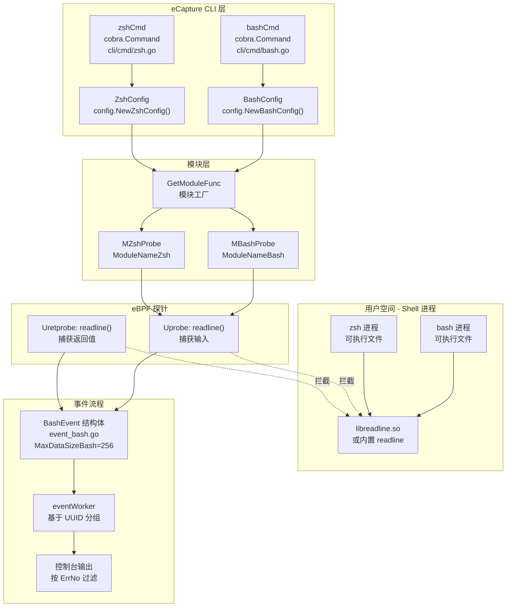
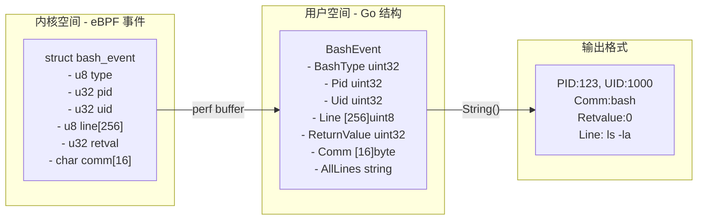
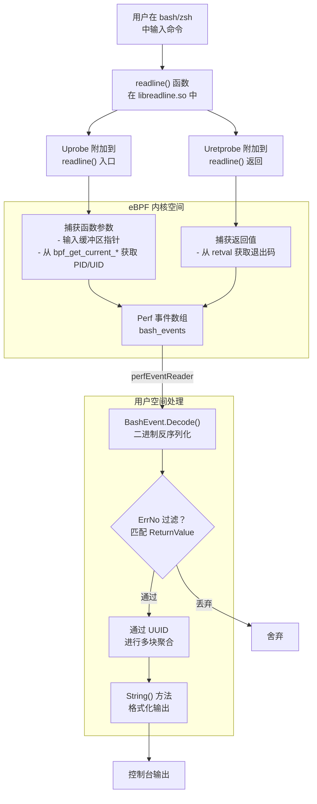
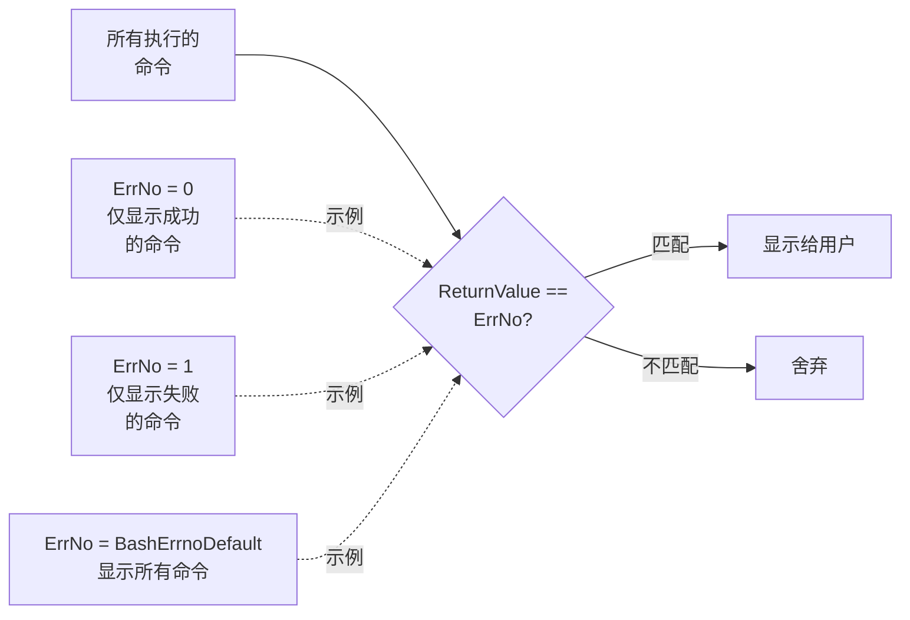
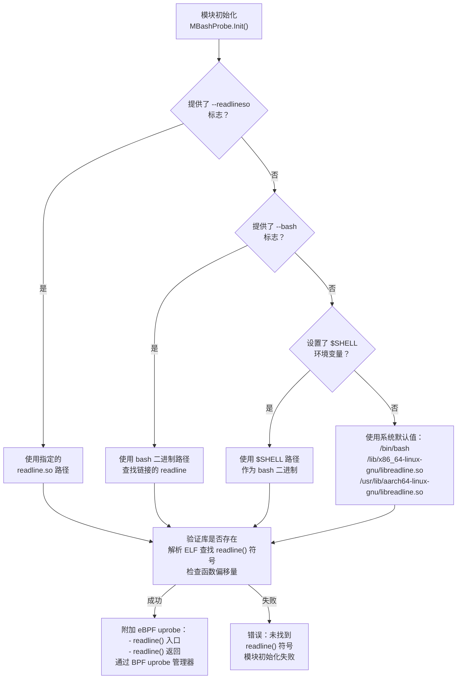
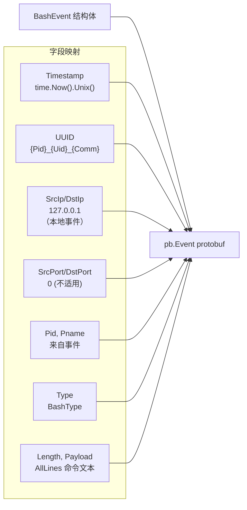

# Shell 命令审计

## 目的与范围

本文档描述了 eCapture 的 shell 命令审计功能，该功能拦截并记录在 Bash 和 Zsh shell 中执行的命令，用于安全审计目的。该模块使用 eBPF uprobe 钩入 GNU readline 库，在不需要 shell 历史文件或配置更改的情况下捕获命令行输入和执行结果。

本页涵盖 Bash 和 Zsh 捕获模块。有关数据库查询审计，请参见[数据库查询审计](3.2.2-database-query-auditing.md)。有关通用模块架构，请参见[模块系统与生命周期](../2-architecture/2.5-module-system-and-lifecycle.md)。

---

## 模块架构

shell 命令审计系统由两个共享相同底层架构的并行模块组成：一个用于 Bash，一个用于 Zsh。两个模块都钩入 readline 库以在命令执行前拦截用户输入。

### 系统组件


```mermaid
graph TB
    subgraph "用户空间 - Shell 进程"
        BashProc["bash 进程<br/>可执行文件"]
        ZshProc["zsh 进程<br/>可执行文件"]
        Readline["libreadline.so<br/>或内置 readline"]
    end
    
    subgraph "eCapture CLI 层"
        BashCmd["bashCmd<br/>cobra.Command<br/>cli/cmd/bash.go"]
        ZshCmd["zshCmd<br/>cobra.Command<br/>cli/cmd/zsh.go"]
        BashConfig["BashConfig<br/>config.NewBashConfig()"]
        ZshConfig["ZshConfig<br/>config.NewZshConfig()"]
    end
    
    subgraph "模块层"
        BashModule["MBashProbe<br/>ModuleNameBash"]
        ZshModule["MZshProbe<br/>ModuleNameZsh"]
        ModuleFactory["GetModuleFunc<br/>模块工厂"]
    end
    
    subgraph "eBPF 探针"
        ReadlineHook["Uprobe: readline()<br/>捕获输入"]
        ReadlineRetHook["Uretprobe: readline()<br/>捕获返回值"]
    end
    
    subgraph "事件流程"
        BashEvent["BashEvent 结构体<br/>event_bash.go<br/>MaxDataSizeBash=256"]
        EventWorker["eventWorker<br/>基于 UUID 分组"]
        Output["控制台输出<br/>按 ErrNo 过滤"]
    end
    
    BashProc --> Readline
    ZshProc --> Readline
    
    BashCmd --> BashConfig
    ZshCmd --> ZshConfig
    
    BashConfig --> ModuleFactory
    ZshConfig --> ModuleFactory
    
    ModuleFactory --> BashModule
    ModuleFactory --> ZshModule
    
    BashModule --> ReadlineHook
    ZshModule --> ReadlineHook
    
    ReadlineHook -.拦截.-> Readline
    ReadlineRetHook -.拦截.-> Readline
    
    ReadlineHook --> BashEvent
    ReadlineRetHook --> BashEvent
    
    BashEvent --> EventWorker
    EventWorker --> Output
```

**来源：** [cli/cmd/bash.go:1-56](https://github.com/gojue/ecapture/blob/ca085d05/cli/cmd/bash.go#L1-L56), [cli/cmd/zsh.go:1-58](https://github.com/gojue/ecapture/blob/ca085d05/cli/cmd/zsh.go#L1-L58), [user/event/event_bash.go:1-134](https://github.com/gojue/ecapture/blob/ca085d05/user/event/event_bash.go#L1-L134)

---

## 配置

### Bash 模块配置

Bash 模块接受以下配置参数：

| 参数 | 标志 | 类型 | 标志范围 | 默认值 | 描述 |
|-----------|------|------|------------|---------|-------------|
| Bashpath | `--bash` | string | 持久化 | 从 `$SHELL` 自动检测 | bash 可执行文件路径，例如 `/bin/bash` |
| Readline | `--readlineso` | string | 持久化 | 从 `$BASH_PATH` 自动检测 | readline.so 库路径 |
| ErrNo | `-e, --errnumber` | int | 本地 | `module.BashErrnoDefault` | 过滤：仅显示具有特定退出码的命令 |

**配置结构：**

bash 配置通过 `config.NewBashConfig()` 创建并传递给模块工厂。配置在 [cli/cmd/bash.go:24](https://github.com/gojue/ecapture/blob/ca085d05/cli/cmd/bash.go#L24) 中实例化：

```go
var bc = config.NewBashConfig()
```

标志注册发生在 [cli/cmd/bash.go:36-38](https://github.com/gojue/ecapture/blob/ca085d05/cli/cmd/bash.go#L36-L38) 中，其中 `--bash` 和 `--readlineso` 作为持久化标志（由子命令继承），`-e/--errnumber` 作为本地标志（特定于 bash 命令）。

### Zsh 模块配置

| 参数 | 标志 | 类型 | 标志范围 | 默认值 | 描述 |
|-----------|------|------|------------|---------|-------------|
| Zshpath | `--zsh` | string | 持久化 | 从 `$SHELL` 自动检测 | zsh 可执行文件路径，例如 `/bin/zsh` |
| ErrNo | `-e, --errnumber` | int | 本地 | `module.ZshErrnoDefault` | 过滤：仅显示具有特定退出码的命令 |

zsh 配置遵循与 bash 相同的模式，在 [cli/cmd/zsh.go:27](https://github.com/gojue/ecapture/blob/ca085d05/cli/cmd/zsh.go#L27) 中实例化并在 [cli/cmd/zsh.go:39-40](https://github.com/gojue/ecapture/blob/ca085d05/cli/cmd/zsh.go#L39-L40) 中注册。

**来源：** [cli/cmd/bash.go:24-39](https://github.com/gojue/ecapture/blob/ca085d05/cli/cmd/bash.go#L24-L39), [cli/cmd/zsh.go:27-41](https://github.com/gojue/ecapture/blob/ca085d05/cli/cmd/zsh.go#L27-L41)

### 命令行用法

bash 和 zsh 命令分别在 [cli/cmd/bash.go:39](https://github.com/gojue/ecapture/blob/ca085d05/cli/cmd/bash.go#L39) 和 [cli/cmd/zsh.go:41](https://github.com/gojue/ecapture/blob/ca085d05/cli/cmd/zsh.go#L41) 中注册，具有以下用法模式：

```bash
# 基本 bash 命令捕获（自动检测 $SHELL 和 readline）
ecapture bash

# 指定自定义 bash 二进制文件和 readline 库路径
ecapture bash --bash=/bin/bash --readlineso=/lib/x86_64-linux-gnu/libreadline.so

# 按退出码过滤：仅显示失败的命令（errno=1）
ecapture bash -e 1

# 按退出码过滤：仅显示成功的命令（errno=0）
ecapture bash -e 0

# 基本 zsh 命令捕获
ecapture zsh

# 带自定义路径和过滤的 zsh
ecapture zsh --zsh=/bin/zsh -e 0
```

命令函数 [cli/cmd/bash.go:53-55](https://github.com/gojue/ecapture/blob/ca085d05/cli/cmd/bash.go#L53-L55) 和 [cli/cmd/zsh.go:55-57](https://github.com/gojue/ecapture/blob/ca085d05/cli/cmd/zsh.go#L55-L57) 使用适当的模块名称（`module.ModuleNameBash` 或 `module.ModuleNameZsh`）和配置对象调用 `runModule()`。

**来源：** [cli/cmd/bash.go:28-55](https://github.com/gojue/ecapture/blob/ca085d05/cli/cmd/bash.go#L28-L55), [cli/cmd/zsh.go:30-57](https://github.com/gojue/ecapture/blob/ca085d05/cli/cmd/zsh.go#L30-L57)

---

## 事件结构

### BashEvent 数据布局

从 shell 捕获的命令被编码在 `BashEvent` 结构中，它镜像了 eBPF 内核侧结构：


```mermaid
graph LR
    subgraph "内核空间 - eBPF 事件"
        BPFStruct["struct bash_event<br/>- u8 type<br/>- u32 pid<br/>- u32 uid<br/>- u8 line[256]<br/>- u32 retval<br/>- char comm[16]"]
    end
    
    subgraph "用户空间 - Go 结构"
        GoStruct["BashEvent<br/>- BashType uint32<br/>- Pid uint32<br/>- Uid uint32<br/>- Line [256]uint8<br/>- ReturnValue uint32<br/>- Comm [16]byte<br/>- AllLines string"]
    end
    
    subgraph "输出格式"
        StringOut["PID:123, UID:1000<br/>Comm:bash<br/>Retvalue:0<br/>Line: ls -la"]
    end
    
    BPFStruct -->|"perf buffer"| GoStruct
    GoStruct -->|"String()"| StringOut
```

**来源：** [user/event/event_bash.go:26-47](https://github.com/gojue/ecapture/blob/ca085d05/user/event/event_bash.go#L26-L47)

### 字段描述

| 字段 | 类型 | 大小 | 描述 |
|-------|------|------|-------------|
| BashType | uint32 | 4 字节 | 事件类型标识符 |
| Pid | uint32 | 4 字节 | shell 的进程 ID |
| Uid | uint32 | 4 字节 | 执行命令的用户 ID |
| Line | [256]uint8 | 256 字节 | 命令行文本（可能是部分） |
| ReturnValue | uint32 | 4 字节 | 命令的退出码 |
| Comm | [16]byte | 16 字节 | 进程名称（通常是 "bash" 或 "zsh"） |
| AllLines | string | 可变 | 聚合的完整命令（用于多块命令） |

**最大数据大小：** 超过 256 字节的命令在多个事件中捕获，并使用 `AllLines` 字段重新组装。

**来源：** [user/event/event_bash.go:37-47](https://github.com/gojue/ecapture/blob/ca085d05/user/event/event_bash.go#L37-L47)

---

## 事件处理流程

### 从 Shell 到输出的数据流


```mermaid
flowchart TD
    Shell["用户在 bash/zsh<br/>中输入命令"]
    Readline["readline() 函数<br/>在 libreadline.so 中"]
    UprobeEntry["Uprobe 附加到<br/>readline() 入口"]
    UprobeRet["Uretprobe 附加到<br/>readline() 返回"]
    
    Shell --> Readline
    Readline --> UprobeEntry
    Readline --> UprobeRet
    
    subgraph "eBPF 内核空间"
        Capture["捕获函数参数<br/>- 输入缓冲区指针<br/>- 从 bpf_get_current_* 获取 PID/UID"]
        CaptureRet["捕获返回值<br/>- 从 retval 获取退出码"]
        PerfMap["Perf 事件数组<br/>bash_events"]
    end
    
    UprobeEntry --> Capture
    UprobeRet --> CaptureRet
    Capture --> PerfMap
    CaptureRet --> PerfMap
    
    subgraph "用户空间处理"
        Decode["BashEvent.Decode()<br/>二进制反序列化"]
        Filter{"ErrNo 过滤？<br/>匹配 ReturnValue"}
        Aggregate["通过 UUID<br/>进行多块聚合"]
        Format["String() 方法<br/>格式化输出"]
    end
    
    PerfMap -->|"perfEventReader"| Decode
    Decode --> Filter
    Filter -->|"通过"| Aggregate
    Filter -->|"丢弃"| Drop[舍弃]
    Aggregate --> Format
    Format --> Console["控制台输出"]
```

**来源：** [user/event/event_bash.go:49-80](https://github.com/gojue/ecapture/blob/ca085d05/user/event/event_bash.go#L49-L80), [cli/cmd/bash.go:38](https://github.com/gojue/ecapture/blob/ca085d05/cli/cmd/bash.go#L38)

### 基于 UUID 的事件关联

每个命令执行生成一个用于事件分组的唯一标识符：

**UUID 格式：** `{Pid}_{Uid}_{Comm}`

示例：`1234_1000_bash`

此 UUID 实现：
- 多块命令捕获的关联
- 来自同一 shell 会话的相关事件分组
- 事件工作器流程中的正确事件排序

**来源：** [user/event/event_bash.go:123-125](https://github.com/gojue/ecapture/blob/ca085d05/user/event/event_bash.go#L123-L125)

---

## 退出码过滤

shell 审计模块支持按命令退出码过滤，允许用户关注特定的执行结果。

### 过滤配置


```mermaid
graph LR
    AllCommands["所有执行的<br/>命令"]
    Filter{"ReturnValue ==<br/>ErrNo?"}
    Success["ErrNo = 0<br/>仅显示成功<br/>的命令"]
    Failure["ErrNo = 1<br/>仅显示失败<br/>的命令"]
    AllCodes["ErrNo = BashErrnoDefault<br/>显示所有命令"]
    
    AllCommands --> Filter
    Filter -->|"匹配"| Output["显示给用户"]
    Filter -->|"不匹配"| Drop["舍弃"]
    
    Success -.示例.-> Filter
    Failure -.示例.-> Filter
    AllCodes -.示例.-> Filter
```

**来源：** [cli/cmd/bash.go:38](https://github.com/gojue/ecapture/blob/ca085d05/cli/cmd/bash.go#L38), [cli/cmd/zsh.go:40](https://github.com/gojue/ecapture/blob/ca085d05/cli/cmd/zsh.go#L40)

### 常见用例

| ErrNo 值 | 用例 | 描述 |
|-------------|----------|-------------|
| 0 | 成功的命令 | 审计成功完成的命令 |
| 1 | 失败的命令 | 检测失败的执行尝试 |
| 127 | 命令未找到 | 识别拼写错误或缺失的二进制文件 |
| 126 | 权限被拒绝 | 跟踪权限问题 |
| 默认值 | 所有命令 | 综合审计跟踪 |

---

## 输出格式

### 文本输出结构

`BashEvent.String()` 方法为控制台显示格式化捕获的命令：

```
PID:1234, UID:1000, 	Comm:bash, 	Retvalue:0, 	Line:
ls -la /etc/passwd
```

**格式模板：** `PID:%d, UID:%d, \tComm:%s, \tRetvalue:%d, \tLine:\n%s`

**颜色编码：** 输出使用 [user/event/event_bash.go:72-75](https://github.com/gojue/ecapture/blob/ca085d05/user/event/event_bash.go#L72-L75) 的标准颜色方案，尽管具体颜色取决于终端支持。

**来源：** [user/event/event_bash.go:72-75](https://github.com/gojue/ecapture/blob/ca085d05/user/event/event_bash.go#L72-L75)

### 十六进制输出模式

使用 `--hex` 标志运行时，命令通过 `StringHex()` 以十六进制格式显示：

```
PID:1234, UID:1000, 	Comm:bash, 	Retvalue:0, 	Line:
0000    6C 73 20 2D 6C 61    ls -la
```

**来源：** [user/event/event_bash.go:77-80](https://github.com/gojue/ecapture/blob/ca085d05/user/event/event_bash.go#L77-L80)

---

## 库检测与挂钩

### Readline 库解析

模块采用多步骤过程定位 readline 库。bash 二进制文件和 readline 库路径通过 [cli/cmd/bash.go:36-37](https://github.com/gojue/ecapture/blob/ca085d05/cli/cmd/bash.go#L36-L37) 中的持久化标志配置：


```mermaid
flowchart TD
    Start["模块初始化<br/>MBashProbe.Init()"]
    
    CheckReadlineFlag{"提供了 --readlineso<br/>标志？"}
    UseReadlineFlag["使用指定的<br/>readline.so 路径"]
    
    CheckBashFlag{"提供了 --bash<br/>标志？"}
    UseBashPath["使用 bash 二进制路径<br/>查找链接的 readline"]
    
    CheckShellEnv{"设置了 $SHELL<br/>环境变量？"}
    UseShellEnv["使用 $SHELL 路径<br/>作为 bash 二进制"]
    
    DefaultPaths["使用系统默认值：<br/>/bin/bash<br/>/lib/x86_64-linux-gnu/libreadline.so<br/>/usr/lib/aarch64-linux-gnu/libreadline.so"]
    
    VerifyLib["验证库是否存在<br/>解析 ELF 查找 readline() 符号<br/>检查函数偏移量"]
    
    AttachUprobes["附加 eBPF uprobe：<br/>- readline() 入口<br/>- readline() 返回<br/>通过 BPF uprobe 管理器"]
    
    Start --> CheckReadlineFlag
    CheckReadlineFlag -->|"是"| UseReadlineFlag
    CheckReadlineFlag -->|"否"| CheckBashFlag
    
    CheckBashFlag -->|"是"| UseBashPath
    CheckBashFlag -->|"否"| CheckShellEnv
    
    CheckShellEnv -->|"是"| UseShellEnv
    CheckShellEnv -->|"否"| DefaultPaths
    
    UseReadlineFlag --> VerifyLib
    UseBashPath --> VerifyLib
    UseShellEnv --> VerifyLib
    DefaultPaths --> VerifyLib
    
    VerifyLib -->|"成功"| AttachUprobes
    VerifyLib -->|"失败"| Error["错误：未找到<br/>readline() 符号<br/>模块初始化失败"]
```

readline 库检测遵循 [cli/cmd/bash.go:36-37](https://github.com/gojue/ecapture/blob/ca085d05/cli/cmd/bash.go#L36-L37) 中定义的标志层次：
- 首先：显式 `--readlineso` 路径
- 其次：从 `--bash` 二进制路径派生
- 第三：使用 `$SHELL` 环境变量
- 最后：回退到系统默认路径

**来源：** [cli/cmd/bash.go:36-37](https://github.com/gojue/ecapture/blob/ca085d05/cli/cmd/bash.go#L36-L37)

### Uprobe 附加点

模块将 eBPF 探针附加到 readline 库中的两个关键点：

| 探针类型 | 函数目标 | 挂钩点 | 捕获的数据 |
|------------|----------------|------------|---------------|
| Uprobe | `readline()` | 函数入口 | PID（`bpf_get_current_pid_tgid()`）、UID（`bpf_get_current_uid_gid()`）、进程名称（`bpf_get_current_comm()`） |
| Uretprobe | `readline()` | 函数返回 | 返回值（指向命令字符串的指针）、通过 `bpf_probe_read_user()` 读取命令文本内容 |

eBPF 程序填充与 [user/event/event_bash.go:26-47](https://github.com/gojue/ecapture/blob/ca085d05/user/event/event_bash.go#L26-L47) 中定义的 Go `BashEvent` 结构匹配的 `bash_event` 结构。内核侧结构通过名为 `bash_events` 的 perf 事件数组传输到用户空间，该数组由 perfEventReader 轮询。

**注意：** bash 模块挂钩 `readline()` 而不是 shell 内置命令，以捕获所有交互式命令，无论它们是通过 shell 的内部命令解析器还是外部二进制文件执行。

**来源：** [user/event/event_bash.go:26-47](https://github.com/gojue/ecapture/blob/ca085d05/user/event/event_bash.go#L26-L47)

---

## Protobuf 事件序列化

Shell 事件可以通过 Protobuf/WebSocket 接口导出以进行外部集成：

### Protobuf 映射


```mermaid
graph LR
    BashEvent["BashEvent 结构体"]
    ProtoEvent["pb.Event protobuf"]
    
    subgraph "字段映射"
        Timestamp["Timestamp<br/>time.Now().Unix()"]
        UUID["UUID<br/>{Pid}_{Uid}_{Comm}"]
        IPs["SrcIp/DstIp<br/>127.0.0.1<br/>（本地事件）"]
        Ports["SrcPort/DstPort<br/>0 (不适用)"]
        Process["Pid, Pname<br/>来自事件"]
        Type["Type<br/>BashType"]
        Payload["Length, Payload<br/>AllLines 命令文本"]
    end
    
    BashEvent --> ProtoEvent
    Timestamp --> ProtoEvent
    UUID --> ProtoEvent
    IPs --> ProtoEvent
    Ports --> ProtoEvent
    Process --> ProtoEvent
    Type --> ProtoEvent
    Payload --> ProtoEvent
```

**特殊处理：**
- Bash 事件没有网络上下文（SrcIP/DstIP 设置为 `127.0.0.1`，端口设置为 `0`）
- 时间戳使用 `time.Now().Unix()` 而不是内核时间戳
- 有效载荷包含来自 `AllLines` 的完整命令行文本

**来源：** [user/event/event_bash.go:103-117](https://github.com/gojue/ecapture/blob/ca085d05/user/event/event_bash.go#L103-L117)

---

## 事件生命周期

### 事件类型分类

Shell 事件被分类为 `TypeModuleData`，这将它们路由通过模块特定的处理而不是通用事件处理器：

```go
func (be *BashEvent) Clone() IEventStruct {
    event := new(BashEvent)
    event.eventType = TypeModuleData  // 不是 TypeEventProcessor
    return event
}
```

这种分类意味着：
- 事件绕过 HTTP 协议解析
- 不生成 PCAP 输出
- 直接输出到控制台或日志文件
- 模块保持对格式化的控制

**来源：** [user/event/event_bash.go:82-86](https://github.com/gojue/ecapture/blob/ca085d05/user/event/event_bash.go#L82-L86)

### 多块命令处理

超过 256 字节的命令在多个事件中捕获：

1. 当用户按 Enter 时捕获第一个块
2. eBPF 程序从 readline 缓冲区读取最多 256 字节
3. 如果命令继续，则捕获后续块
4. 用户空间代码使用 UUID 关联将块聚合到 `AllLines` 字段中

**最大命令长度：** 受 eBPF 程序设计和事件聚合逻辑限制（在提供的文件中不可见，但结构通过 `AllLines` 字符串支持无限长度）。

**来源：** [user/event/event_bash.go:37-47](https://github.com/gojue/ecapture/blob/ca085d05/user/event/event_bash.go#L37-L47)

---

## 与其他模块的集成

### 模块工厂注册

Bash 和 Zsh 模块都在模块工厂中注册并遵循标准模块生命周期。[cli/cmd/bash.go:53-55](https://github.com/gojue/ecapture/blob/ca085d05/cli/cmd/bash.go#L53-L55) 和 [cli/cmd/zsh.go:55-57](https://github.com/gojue/ecapture/blob/ca085d05/cli/cmd/zsh.go#L55-L57) 中的命令函数使用不同的模块标识符调用 `runModule()`：

```
module.ModuleNameBash  -> MBashProbe  -> BashConfig (bc)
module.ModuleNameZsh   -> MZshProbe   -> ZshConfig (zc)
```

命令执行流程：

```go
// 来自 cli/cmd/bash.go:53-55
func bashCommandFunc(command *cobra.Command, args []string) error {
    return runModule(module.ModuleNameBash, bc)
}

// 来自 cli/cmd/zsh.go:55-57
func zshCommandFunc(command *cobra.Command, args []string) error {
    return runModule(module.ModuleNameZsh, zc)
}
```

`runModule()` 函数（在提供的文件中未显示）使用模块名称在工厂注册表中查找适当的模块构造函数，使用提供的配置实例化模块，并调用标准模块生命周期方法（`Init()`、`Run()`、`Close()`）。

**来源：** [cli/cmd/bash.go:53-55](https://github.com/gojue/ecapture/blob/ca085d05/cli/cmd/bash.go#L53-L55), [cli/cmd/zsh.go:55-57](https://github.com/gojue/ecapture/blob/ca085d05/cli/cmd/zsh.go#L55-L57)

### 共享基础设施

Shell 模块利用通用的 eCapture 基础设施：

- **事件流程：** [事件处理流程](../2-architecture/2.2-event-processing-pipeline.md)
- **模块生命周期：** [模块系统与生命周期](../2-architecture/2.5-module-system-and-lifecycle.md)
- **配置系统：** [配置系统](../2-architecture/2.4-configuration-system.md)
- **输出格式：** [文本输出模式](../4-output-formats/4.1-text-output-mode.md) 和 [Protobuf 与外部集成](../4-output-formats/4.4-protobuf-and-external-integration.md)

---

## 安全考虑

### 审计跟踪完整性

Shell 命令审计提供：

- **不可绕过的捕获：** 在库级别挂钩，在历史文件写入之前
- **UID 跟踪：** 将命令与用户身份关联
- **退出码跟踪：** 区分成功与失败的尝试
- **进程关联：** 将命令链接到特定的 shell 会话

### 隐私影响

该模块捕获：
- 所有交互式命令输入（包括键入的密码）
- 命令参数（可能包含敏感数据）
- 工作目录上下文（通过进程检查）

**建议：** 在生产环境中部署时使用退出码过滤和安全日志存储。

---

## 用例

### 安全审计

```bash
# 跟踪失败的命令尝试（潜在的侦察或拼写错误）
ecapture bash -e 1

# 捕获所有交互式 bash 命令进行取证分析
ecapture bash
```

### 合规监控

```bash
# 捕获所有成功的管理命令
ecapture bash -e 0 -l /var/log/audit/bash_commands.log

# 监控 zsh 会话的合规性
ecapture zsh -e 0
```

### 调试与支持

```bash
# 在故障排除会话期间记录所有命令
ecapture bash > debug_session.log

# 捕获成功和失败的命令
ecapture bash -e -1
```

### 入侵检测

```bash
# 监控命令未找到错误（异常活动）
ecapture bash -e 127

# 监控权限被拒绝错误（权限提升尝试）
ecapture bash -e 126
```

### 主机安全审计

如 [README.md:40](https://github.com/gojue/ecapture/blob/ca085d05/README.md#L40) 和 [README_CN.md:131](https://github.com/gojue/ecapture/blob/ca085d05/README_CN.md#L131) 中所述，bash 和 zsh 模块的主要目的是"主机安全审计" - 提供交互式 shell 活动的全面审计跟踪，而不依赖可能被禁用或篡改的 shell 历史文件。

**来源：** [cli/cmd/bash.go:28-33](https://github.com/gojue/ecapture/blob/ca085d05/cli/cmd/bash.go#L28-L33), [user/event/event_bash.go:72-75](https://github.com/gojue/ecapture/blob/ca085d05/user/event/event_bash.go#L72-L75), [README.md:40](https://github.com/gojue/ecapture/blob/ca085d05/README.md#L40), [README_CN.md:131](https://github.com/gojue/ecapture/blob/ca085d05/README_CN.md#L131)