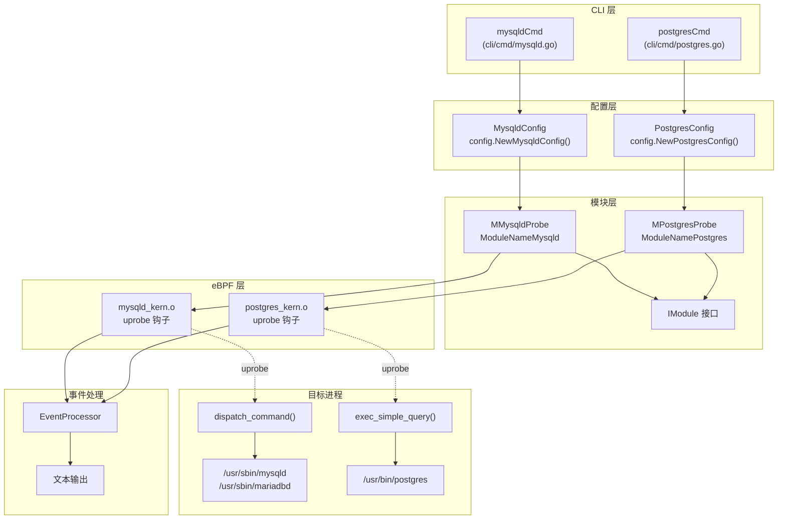
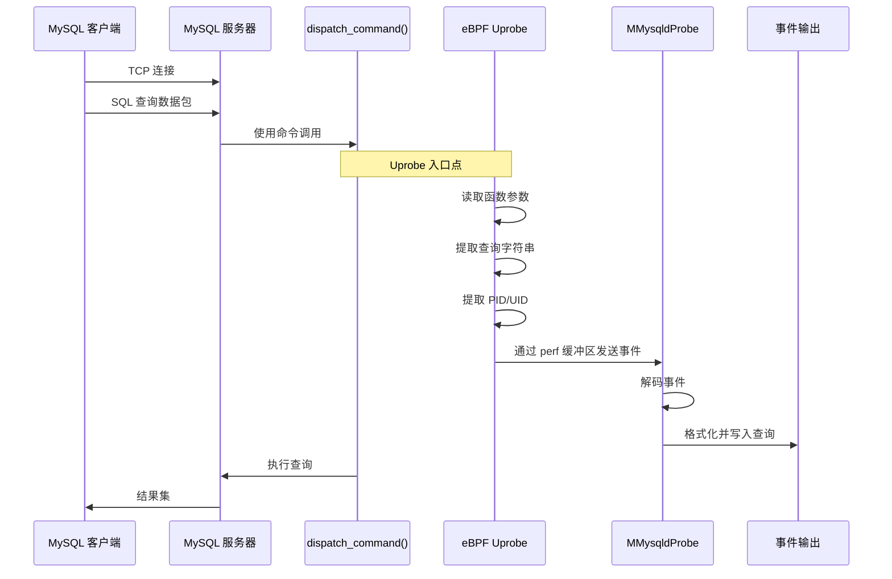
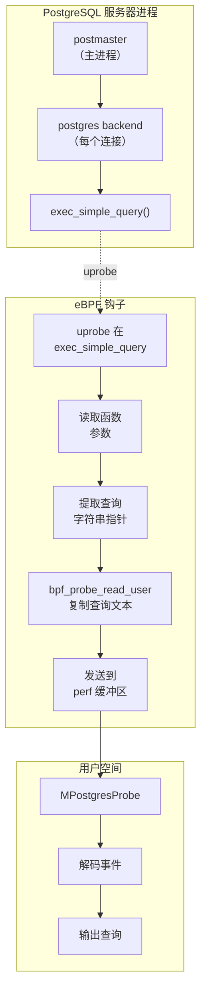
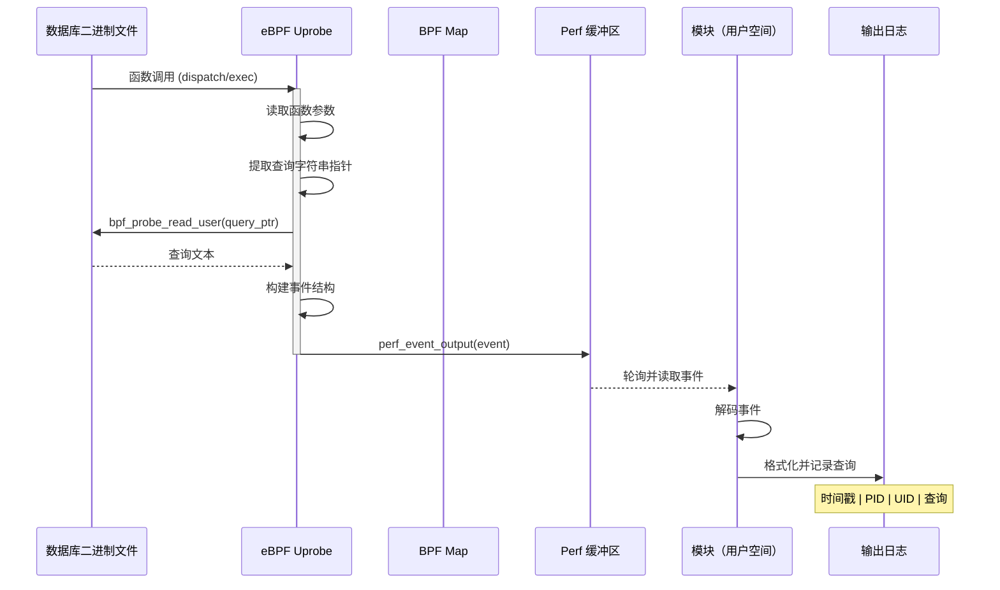

# 数据库查询审计

本页面介绍 eCapture 的数据库查询审计功能，可以捕获 MySQL 和 PostgreSQL 数据库服务器执行的 SQL 查询。这些模块支持实时数据库审计，无需修改应用程序或更改数据库配置。

关于 shell 命令审计（bash/zsh）的信息，请参见 [Shell 命令审计](3.2.1-shell-command-auditing.md)。关于通用模块架构和生命周期的信息，请参见 [模块系统与生命周期](../2-architecture/2.5-module-system-and-lifecycle.md)。

---

## 概述

eCapture 提供两个专门用于数据库查询审计的模块：

| 模块 | 数据库 | 支持版本 | 主要钩子函数 |
|--------|----------|-------------------|----------------------|
| `mysqld` | MySQL/MariaDB | MySQL 5.6/5.7/8.0, MariaDB 10.5+ | `dispatch_command` |
| `postgres` | PostgreSQL | PostgreSQL 10+ | `exec_simple_query` |

这两个模块都使用 eBPF uprobe 技术在数据库服务器二进制级别拦截查询执行函数，在查询被分发执行时捕获 SQL 语句。与 TLS 捕获模块不同，数据库模块不需要网络流量拦截或主密钥提取——它们直接从数据库进程内存中捕获查询。

**关键特性：**
- **无需数据库配置更改**：无需日志配置、无需触发器、无需安装插件
- **零应用程序影响**：在数据库服务器级别捕获，而非应用程序级别
- **原始查询捕获**：捕获数据库接收到的准确 SQL 文本
- **基于进程的过滤**：可以通过 PID 或 UID 定位特定数据库实例

---

## 模块架构

以下图表展示了数据库审计模块如何融入 eCapture 架构：


```mermaid
graph TB
    subgraph "CLI 层"
        MYSQLD_CMD["mysqldCmd<br/>(cli/cmd/mysqld.go)"]
        POSTGRES_CMD["postgresCmd<br/>(cli/cmd/postgres.go)"]
    end
    
    subgraph "配置层"
        MYSQLD_CFG["MysqldConfig<br/>config.NewMysqldConfig()"]
        POSTGRES_CFG["PostgresConfig<br/>config.NewPostgresConfig()"]
    end
    
    subgraph "模块层"
        MYSQLD_MOD["MMysqldProbe<br/>ModuleNameMysqld"]
        POSTGRES_MOD["MPostgresProbe<br/>ModuleNamePostgres"]
        IMODULE["IModule 接口"]
    end
    
    subgraph "eBPF 层"
        MYSQLD_BPF["mysqld_kern.o<br/>uprobe 钩子"]
        POSTGRES_BPF["postgres_kern.o<br/>uprobe 钩子"]
    end
    
    subgraph "目标进程"
        MYSQLD_BIN["/usr/sbin/mysqld<br/>/usr/sbin/mariadbd"]
        POSTGRES_BIN["/usr/bin/postgres"]
        DISPATCH["dispatch_command()"]
        EXEC_QUERY["exec_simple_query()"]
    end
    
    subgraph "事件处理"
        EVENT_PROC["EventProcessor"]
        OUTPUT["文本输出"]
    end
    
    MYSQLD_CMD --> MYSQLD_CFG
    POSTGRES_CMD --> POSTGRES_CFG
    
    MYSQLD_CFG --> MYSQLD_MOD
    POSTGRES_CFG --> POSTGRES_MOD
    
    MYSQLD_MOD --> IMODULE
    POSTGRES_MOD --> IMODULE
    
    MYSQLD_MOD --> MYSQLD_BPF
    POSTGRES_MOD --> POSTGRES_BPF
    
    MYSQLD_BPF -.uprobe.-> DISPATCH
    POSTGRES_BPF -.uprobe.-> EXEC_QUERY
    
    DISPATCH --> MYSQLD_BIN
    EXEC_QUERY --> POSTGRES_BIN
    
    MYSQLD_BPF --> EVENT_PROC
    POSTGRES_BPF --> EVENT_PROC
    
    EVENT_PROC --> OUTPUT
```

**来源：** [cli/cmd/mysqld.go:1-50](https://github.com/gojue/ecapture/blob/ca085d05/cli/cmd/mysqld.go#L1-L50), [cli/cmd/postgres.go:1-46](https://github.com/gojue/ecapture/blob/ca085d05/cli/cmd/postgres.go#L1-L46)

---

## MySQL/MariaDB 模块

### 支持版本

`mysqld` 模块支持以下数据库版本：

- **MySQL**: 5.6, 5.7, 8.0
- **MariaDB**: 10.5 及更新版本

该模块针对 `dispatch_command` 函数，这是 MySQL 服务器架构中所有 SQL 命令的入口点。

**来源：** [cli/cmd/mysqld.go:33-36](https://github.com/gojue/ecapture/blob/ca085d05/cli/cmd/mysqld.go#L33-L36), [README.md:157-158](https://github.com/gojue/ecapture/blob/ca085d05/README.md#L157-L158)

### 命令行接口

```bash
# 基本用法 - 自动检测 mysqld 二进制文件
ecapture mysqld

# 指定自定义 mysqld 路径
ecapture mysqld --mysqld=/usr/sbin/mysqld

# 按函数名钩子指定函数
ecapture mysqld --funcname=dispatch_command

# 按偏移量钩子（适用于剥离的二进制文件）
ecapture mysqld --offset=0x710410

# 按 PID 过滤
ecapture mysqld --pid=12345

# 将输出保存到文件
ecapture mysqld -l mysql_queries.log
```

**配置标志：**

| 标志 | 简写 | 默认值 | 描述 |
|------|-------|---------|-------------|
| `--mysqld` | `-m` | `/usr/sbin/mariadbd` | mysqld/mariadbd 二进制文件路径 |
| `--offset` | | `0` | uprobe 钩子的偏移地址 |
| `--funcname` | `-f` | _(自动)_ | 要钩子的函数名 |

**来源：** [cli/cmd/mysqld.go:40-43](https://github.com/gojue/ecapture/blob/ca085d05/cli/cmd/mysqld.go#L40-L43)

### 钩子架构

MySQL 模块钩子 `dispatch_command` 函数，该函数会为服务器接收到的每个 SQL 命令调用：


```mermaid
sequenceDiagram
    participant Client as MySQL 客户端
    participant Server as MySQL 服务器
    participant Dispatch as dispatch_command()
    participant eBPF as eBPF Uprobe
    participant Module as MMysqldProbe
    participant Output as 事件输出
    
    Client->>Server: TCP 连接
    Client->>Server: SQL 查询数据包
    Server->>Dispatch: 使用命令调用
    
    Note over Dispatch,eBPF: Uprobe 入口点
    eBPF->>eBPF: 读取函数参数
    eBPF->>eBPF: 提取查询字符串
    eBPF->>eBPF: 提取 PID/UID
    eBPF->>Module: 通过 perf 缓冲区发送事件
    
    Module->>Module: 解码事件
    Module->>Output: 格式化并写入查询
    
    Dispatch->>Server: 执行查询
    Server->>Client: 结果集
```

**函数签名（概念性）：**
```c
// MySQL 内部函数（因版本而异）
bool dispatch_command(THD *thd, const COM_DATA *com_data, enum enum_server_command command)
```

eBPF 程序读取：
- `THD` 指针：包含连接上下文的线程句柄
- `command`：命令类型（COM_QUERY 用于 SQL 查询）
- 查询字符串：从命令数据结构中提取

**来源：** [cli/cmd/mysqld.go:36-37](https://github.com/gojue/ecapture/blob/ca085d05/cli/cmd/mysqld.go#L36-L37)

### 版本特定注意事项

不同的 MySQL 版本可能有不同的内部结构布局。该模块通过以下方式处理：

1. **函数名检测**：自动检测 `dispatch_command` 符号
2. **偏移量计算**：可以为剥离的二进制文件使用 `--offset`
3. **结构适配**：eBPF 代码可能需要版本特定的偏移量

**常见 MariaDB 路径：**
- `/usr/sbin/mariadbd` (MariaDB 10.5+)
- `/usr/sbin/mysqld` (MySQL 5.6/5.7/8.0)

**来源：** [cli/cmd/mysqld.go:40](https://github.com/gojue/ecapture/blob/ca085d05/cli/cmd/mysqld.go#L40)

---

## PostgreSQL 模块

### 支持版本

`postgres` 模块支持 PostgreSQL 10 及更新版本。该模块针对 `exec_simple_query` 函数，该函数处理简单查询协议执行。

**来源：** [cli/cmd/postgres.go:32](https://github.com/gojue/ecapture/blob/ca085d05/cli/cmd/postgres.go#L32), [README.md:159](https://github.com/gojue/ecapture/blob/ca085d05/README.md#L159)

### 命令行接口

```bash
# 基本用法 - 自动检测 postgres 二进制文件
ecapture postgres

# 指定自定义 postgres 路径
ecapture postgres --postgres=/usr/lib/postgresql/14/bin/postgres

# 钩子指定函数
ecapture postgres --funcname=exec_simple_query

# 按 PID 过滤
ecapture postgres --pid=54321

# 将输出保存到文件
ecapture postgres -l postgres_queries.log
```

**配置标志：**

| 标志 | 简写 | 默认值 | 描述 |
|------|-------|---------|-------------|
| `--postgres` | `-m` | `/usr/bin/postgres` | postgres 二进制文件路径 |
| `--funcname` | `-f` | _(自动)_ | 要钩子的函数名 |

**来源：** [cli/cmd/postgres.go:37-38](https://github.com/gojue/ecapture/blob/ca085d05/cli/cmd/postgres.go#L37-L38)

### 钩子架构

PostgreSQL 模块钩子 `exec_simple_query` 函数，这是简单查询协议的入口点：


```mermaid
graph TB
    subgraph "PostgreSQL 服务器进程"
        POSTMASTER["postmaster<br/>（主进程）"]
        BACKEND["postgres backend<br/>（每个连接）"]
        EXEC["exec_simple_query()"]
    end
    
    subgraph "eBPF 钩子"
        UPROBE["uprobe 在<br/>exec_simple_query"]
        READ_ARGS["读取函数<br/>参数"]
        EXTRACT["提取查询<br/>字符串指针"]
        PROBE_READ["bpf_probe_read_user<br/>复制查询文本"]
        SEND_EVENT["发送到<br/>perf 缓冲区"]
    end
    
    subgraph "用户空间"
        MODULE["MPostgresProbe"]
        DECODE["解码事件"]
        OUTPUT["输出查询"]
    end
    
    POSTMASTER --> BACKEND
    BACKEND --> EXEC
    EXEC -.uprobe.-> UPROBE
    UPROBE --> READ_ARGS
    READ_ARGS --> EXTRACT
    EXTRACT --> PROBE_READ
    PROBE_READ --> SEND_EVENT
    SEND_EVENT --> MODULE
    MODULE --> DECODE
    DECODE --> OUTPUT
```

**函数签名（PostgreSQL 内部）：**
```c
// PostgreSQL 源码: src/backend/tcop/postgres.c
void exec_simple_query(const char *query_string)
```

eBPF 程序捕获：
- `query_string`：指向 SQL 查询文本的指针
- 连接元数据：PID、UID、时间戳
- 查询长度：用于有界内存复制

**来源：** [cli/cmd/postgres.go:32-34](https://github.com/gojue/ecapture/blob/ca085d05/cli/cmd/postgres.go#L32-L34)

### PostgreSQL 协议上下文

PostgreSQL 使用多种查询执行路径：

1. **简单查询协议**：单个 SQL 语句，由 `exec_simple_query` 捕获
2. **扩展查询协议**：预编译语句（Parse/Bind/Execute）
3. **快速路径接口**：函数调用接口

当前模块实现专注于简单查询协议，该协议处理：
- 来自 `psql` 命令行客户端的 SQL 语句
- 来自许多客户端库的直接 SQL 执行
- 管理命令

**来源：** [cli/cmd/postgres.go:30-34](https://github.com/gojue/ecapture/blob/ca085d05/cli/cmd/postgres.go#L30-L34)

---

## 查询捕获机制

这两个模块都遵循类似的基于 eBPF 的捕获模式：


```mermaid
sequenceDiagram
    participant DB as 数据库二进制文件
    participant Uprobe as eBPF Uprobe
    participant Map as BPF Map
    participant Perf as Perf 缓冲区
    participant Module as 模块（用户空间）
    participant Logger as 输出日志
    
    DB->>Uprobe: 函数调用 (dispatch/exec)
    
    activate Uprobe
    Uprobe->>Uprobe: 读取函数参数
    Uprobe->>Uprobe: 提取查询字符串指针
    Uprobe->>DB: bpf_probe_read_user(query_ptr)
    DB-->>Uprobe: 查询文本
    Uprobe->>Uprobe: 构建事件结构
    Uprobe->>Perf: perf_event_output(event)
    deactivate Uprobe
    
    Perf-->>Module: 轮询并读取事件
    Module->>Module: 解码事件
    Module->>Logger: 格式化并记录查询
    
    Note over Logger: 时间戳 | PID | UID | 查询
```

### 事件结构

这两个模块发出的事件具有类似的结构：

| 字段 | 类型 | 描述 |
|-------|------|-------------|
| `timestamp` | uint64 | 事件时间戳（纳秒） |
| `pid` | uint32 | 数据库服务器的进程 ID |
| `tid` | uint32 | 线程 ID |
| `uid` | uint32 | 进程的用户 ID |
| `query_len` | uint32 | 查询字符串的长度 |
| `query` | char[] | SQL 查询文本 |

### 内存安全

eBPF 程序实现了几项安全措施：

1. **有界读取**：查询长度受限以避免内核栈溢出
2. **用户内存访问**：使用 `bpf_probe_read_user()` 进行安全访问
3. **空终止**：确保查询字符串正确终止
4. **验证**：eBPF 验证器在加载前确保内存安全

---

## 通用特性

### 进程过滤

这两个模块都支持标准的 eCapture 过滤选项：

```bash
# 按特定 PID 过滤
ecapture mysqld --pid=1234

# 按特定 UID 过滤
ecapture mysqld --uid=1000

# 按进程名过滤（如果支持）
ecapture mysqld --pname=mysqld
```

### 输出模式

数据库审计模块以文本格式输出捕获的查询：

```
2024-09-15T10:30:45Z INF Query captured pid=12345 uid=999
SELECT * FROM users WHERE id = 123;

2024-09-15T10:30:46Z INF Query captured pid=12345 uid=999
UPDATE accounts SET balance = balance - 100 WHERE account_id = 456;
```

输出可以定向到：
- **控制台**：实时监控（默认）
- **文件**：使用 `-l` 或 `--logaddr` 标志
- **远程日志**：使用 `--logaddr` 进行集中收集

**来源：** [cli/cmd/mysqld.go:36-37](https://github.com/gojue/ecapture/blob/ca085d05/cli/cmd/mysqld.go#L36-L37), [cli/cmd/postgres.go:32-34](https://github.com/gojue/ecapture/blob/ca085d05/cli/cmd/postgres.go#L32-L34)

### 与模块系统集成

这两个数据库模块都实现了 `IModule` 接口并遵循标准生命周期：

1. **Init**：检测数据库二进制文件，解析函数地址
2. **Start**：加载 eBPF 字节码，附加 uprobe
3. **Run**：持续从 perf 缓冲区读取事件
4. **Close**：分离 uprobe，清理资源

有关 `IModule` 接口的详细信息，请参见 [模块系统与生命周期](../2-architecture/2.5-module-system-and-lifecycle.md)。

---

## 限制与注意事项

### MySQL/MariaDB 限制

1. **二进制格式**：需要函数符号（使用 `--offset` 可处理剥离的二进制文件）
2. **预编译语句**：在所有情况下可能无法捕获参数化查询
3. **二进制协议**：当前主要关注文本协议查询
4. **版本特定**：内部结构在不同版本之间有所不同

### PostgreSQL 限制

1. **仅限简单查询协议**：不捕获扩展查询协议（预编译语句）
2. **复制查询**：可能不捕获逻辑复制查询
3. **后台任务**：可能会遗漏自动清理和其他后台查询
4. **多语句查询**：批处理中的每个语句可能单独出现

### 一般限制

1. **性能影响**：对高流量数据库有最小但可测量的开销
2. **查询截断**：根据缓冲区大小，非常长的查询可能会被截断
3. **二进制数据**：查询中的 BLOB/二进制数据可能无法正确显示
4. **编码**：假设 UTF-8 或 ASCII 查询编码

### 安全注意事项

- **敏感数据暴露**：捕获的查询可能包含密码、PII
- **需要 Root 权限**：eBPF 需要 CAP_BPF 或 root
- **审计日志**：应使用适当的文件权限保护
- **合规性**：确保查询日志记录符合数据保护法规

---

## 与传统审计方法的比较

| 特性 | eCapture eBPF | 数据库日志 | 应用程序日志 |
|---------|---------------|------------------|---------------------|
| 配置 | 无 | 需要配置 | 需要代码更改 |
| 性能影响 | 最小 | 中等 | 变化 |
| 查询覆盖 | 所有查询 | 可配置 | 取决于实现 |
| 设置时间 | 立即 | 需要重启 | 需要部署 |
| 敏感数据 | 捕获所有内容 | 可配置 | 应用程序控制 |
| 开销位置 | 内核 | 数据库 | 应用程序 |

**来源：** [cli/cmd/mysqld.go:1-50](https://github.com/gojue/ecapture/blob/ca085d05/cli/cmd/mysqld.go#L1-L50), [cli/cmd/postgres.go:1-46](https://github.com/gojue/ecapture/blob/ca085d05/cli/cmd/postgres.go#L1-L46), [README.md:157-159](https://github.com/gojue/ecapture/blob/ca085d05/README.md#L157-L159)

---

## 使用示例

### MySQL 示例

```bash
# 启动 MySQL 查询捕获
sudo ecapture mysqld --mysqld=/usr/sbin/mysqld -l /var/log/mysql_audit.log

# 输出示例:
# 2024-09-15T10:30:45Z INF Query captured pid=12345 uid=999
# SELECT user, host FROM mysql.user;
#
# 2024-09-15T10:30:46Z INF Query captured pid=12345 uid=999  
# CREATE DATABASE testdb;
```

### PostgreSQL 示例

```bash
# 启动 PostgreSQL 查询捕获
sudo ecapture postgres --postgres=/usr/lib/postgresql/14/bin/postgres -l /var/log/postgres_audit.log

# 输出示例:
# 2024-09-15T11:15:22Z INF Query captured pid=54321 uid=109
# SELECT * FROM pg_stat_activity;
#
# 2024-09-15T11:15:23Z INF Query captured pid=54321 uid=109
# EXPLAIN ANALYZE SELECT * FROM large_table WHERE id > 1000;
```

### 结合进程过滤

```bash
# 仅审计特定数据库实例
sudo ecapture mysqld --pid=$(pgrep -f "mysqld.*port=3307")

# 仅审计来自特定用户的查询
sudo ecapture postgres --uid=1000
```

**来源：** [cli/cmd/mysqld.go:1-50](https://github.com/gojue/ecapture/blob/ca085d05/cli/cmd/mysqld.go#L1-L50), [cli/cmd/postgres.go:1-46](https://github.com/gojue/ecapture/blob/ca085d05/cli/cmd/postgres.go#L1-L46)