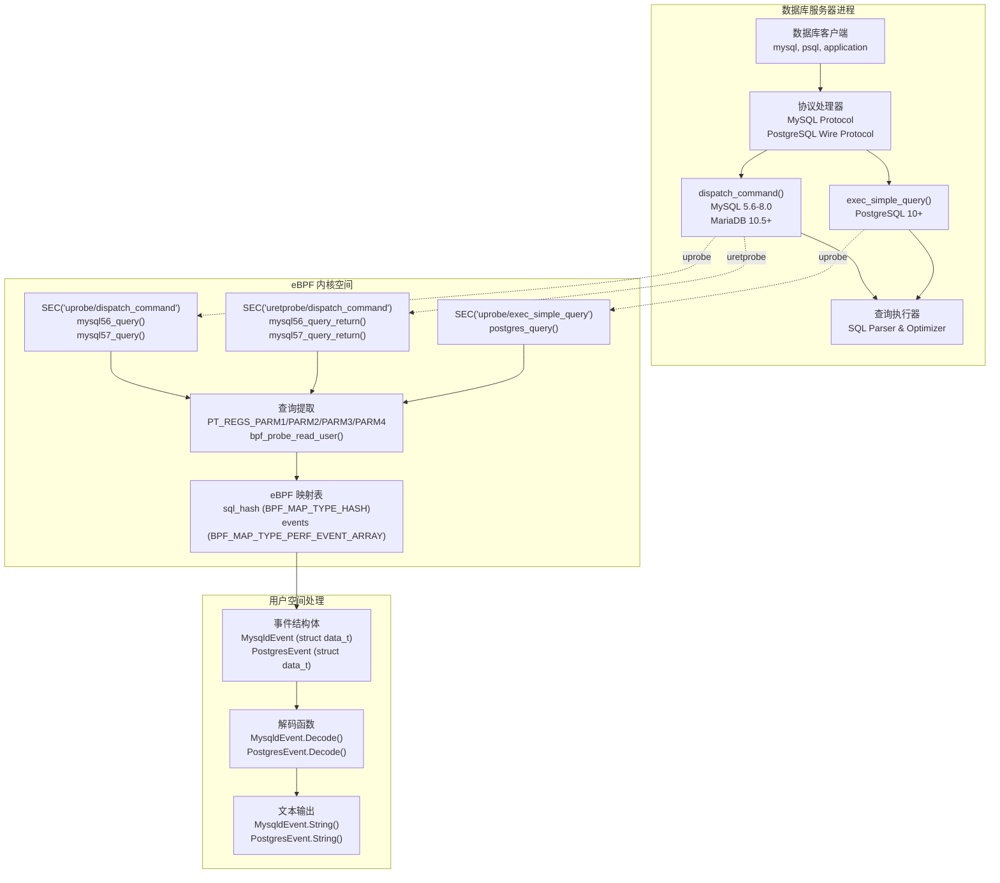

# 数据库查询审计

## 目的与范围

本文档描述了 eCapture 的数据库查询审计功能，该功能能够实时捕获 MySQL 和 PostgreSQL 数据库服务器执行的 SQL 查询，无需数据库级别的日志配置或权限。系统使用 eBPF uprobe 拦截数据库服务器二进制文件中的查询分发函数，捕获查询文本、进程信息和执行元数据。

本页涵盖 MySQL (`mysqld`) 和 PostgreSQL (`postgres`) 捕获模块。关于 shell 命令审计（bash/zsh），请参见[Shell 命令审计](3.2.1-shell-command-auditing.md)。关于 TLS/SSL 流量捕获，请参见[TLS/SSL 模块](3.1-tlsssl-modules.md)。

---

## 架构概述

数据库查询审计的运作方式与 TLS 模块不同，它针对的是数据库服务器进程而非 SSL/TLS 库。系统将 uprobe 附加到数据库二进制文件中的特定查询处理函数上，在查询被分发执行时捕获 SQL 查询字符串。

### 数据库查询捕获架构



**与 TLS 捕获的主要区别：**
- **单/双钩子点**: MySQL 使用入口+返回 uprobe（`mysql56_query` + `mysql56_query_return`），PostgreSQL 仅使用入口
- **无网络关联**: 事件包含查询文本但不包含网络 5 元组信息
- **无主密钥**: 数据库审计不需要密钥提取
- **直接文本捕获**: 通过 `bpf_probe_read_user()` 从内存中以明文形式捕获 SQL 查询

来源：[kern/mysqld_kern.c:1-266](https://github.com/gojue/ecapture/blob/0766a93b/kern/mysqld_kern.c#L1-L266), [kern/postgres_kern.c:1-61](https://github.com/gojue/ecapture/blob/0766a93b/kern/postgres_kern.c#L1-L61), [user/event/event_mysqld.go:1-169](https://github.com/gojue/ecapture/blob/0766a93b/user/event/event_mysqld.go#L1-L169), [user/event/event_postgres.go:1-119](https://github.com/gojue/ecapture/blob/0766a93b/user/event/event_postgres.go#L1-L119)

---

## MySQL 查询审计

### 支持的版本

MySQL 模块支持：
- **MySQL 5.6, 5.7, 8.0**
- **MariaDB 10.5+**

该模块针对 `dispatch_command` 函数，这是 MySQL/MariaDB 服务器二进制文件中的中央查询处理入口点。

来源：[cli/cmd/mysqld.go:32-35](https://github.com/gojue/ecapture/blob/0766a93b/cli/cmd/mysqld.go#L32-L35)

### 钩子函数和 eBPF 程序

#### MySQL 5.6/8.0 函数

MySQL 模块实现了两个 eBPF 探针对来捕获查询执行：

**mysql56_query (uprobe):**
- 钩子：函数入口处的 `SEC("uprobe/dispatch_command")`
- 函数：[kern/mysqld_kern.c:43-99](https://github.com/gojue/ecapture/blob/0766a93b/kern/mysqld_kern.c#L43-L99)
- 捕获：从 `PT_REGS_PARM3(ctx)` 获取查询字符串，从 `PT_REGS_PARM4(ctx)` 获取查询长度
- 检查：命令类型必须是 `COM_QUERY`（`PT_REGS_PARM1(ctx)`）
- 存储：将 `struct data_t` 写入 `sql_hash` 映射表（键：PID）

**mysql56_query_return (uretprobe):**
- 钩子：函数返回处的 `SEC("uretprobe/dispatch_command")`
- 函数：[kern/mysqld_kern.c:101-141](https://github.com/gojue/ecapture/blob/0766a93b/kern/mysqld_kern.c#L101-L141)
- 捕获：从 `PT_REGS_RC(ctx)` 获取返回值
- 检索：通过 PID 从 `sql_hash` 映射表中检索存储的查询
- 发送：通过 `bpf_perf_event_output()` 将完整事件发送到用户空间

#### MySQL 5.7+ 函数

MySQL 5.7+ 使用不同的内部结构（`COM_DATA` 联合体）：

**mysql57_query (uprobe):**
- 钩子：`SEC("uprobe/dispatch_command_57")`
- 函数：[kern/mysqld_kern.c:186-226](https://github.com/gojue/ecapture/blob/0766a93b/kern/mysqld_kern.c#L186-L226)
- 捕获：从 `PT_REGS_PARM2(ctx)` 获取 `COM_QUERY_DATA` 结构体，从 `PT_REGS_PARM3(ctx)` 获取命令类型
- 结构：从 `COM_QUERY_DATA` 读取 `query.query` 指针和 `query.length`

**mysql57_query_return (uretprobe):**
- 钩子：`SEC("uretprobe/dispatch_command_57")`
- 函数：[kern/mysqld_kern.c:233-266](https://github.com/gojue/ecapture/blob/0766a93b/kern/mysqld_kern.c#L233-L266)
- 捕获：布尔返回值（0=成功，1=退出）
- 映射返回值：如果返回值为 1，则映射到 `DISPATCH_COMMAND_V57_FAILED`

来源：[kern/mysqld_kern.c:43-266](https://github.com/gojue/ecapture/blob/0766a93b/kern/mysqld_kern.c#L43-L266)

### 事件结构

#### eBPF 内核结构体（struct data_t）

eBPF 程序在 [kern/mysqld_kern.c:19-27](https://github.com/gojue/ecapture/blob/0766a93b/kern/mysqld_kern.c#L19-L27) 中定义了 `struct data_t`：

```c
struct data_t {
    u64 pid;
    u64 timestamp;
    char query[MAX_DATA_SIZE_MYSQL];  // 256 字节
    u64 alllen;
    u64 len;
    char comm[TASK_COMM_LEN];         // 16 字节
    s8 retval;
};
```

该结构体通过 `events` perf 缓冲区传输并在用户空间解码。

#### 用户空间 Go 结构体（MysqldEvent）

[user/event/event_mysqld.go:68-78](https://github.com/gojue/ecapture/blob/0766a93b/user/event/event_mysqld.go#L68-L78) 中的 Go 事件结构体镜像了 eBPF 结构体：

| 字段 | 类型 | eBPF 类型 | 描述 |
|-------|------|-----------|-------------|
| `Pid` | `uint64` | `u64` | mysqld 服务器的进程 ID |
| `Timestamp` | `uint64` | `u64` | 通过 `bpf_ktime_get_ns()` 获取的内核时间戳 |
| `Query` | `[256]uint8` | `char[MAX_DATA_SIZE_MYSQL]` | SQL 查询文本（最多 256 字节）|
| `Alllen` | `uint64` | `u64` | 原始查询的总长度（截断前）|
| `Len` | `uint64` | `u64` | 捕获的查询文本长度（min(alllen, 256)）|
| `Comm` | `[16]uint8` | `char[TASK_COMM_LEN]` | 通过 `bpf_get_current_comm()` 获取的进程命令名 |
| `Retval` | `dispatchCommandReturn` | `s8` | `dispatch_command()` 的返回值 |

**返回值：**

`Retval` 字段指示查询执行结果：

| 常量 | 值 | 描述 |
|----------|-------|-------------|
| `DispatchCommandSuccess` | 0 | 查询执行成功 |
| `DispatchCommandCloseConnection` | 1 | 查询后连接关闭 |
| `DispatchCommandWouldblock` | 2 | 查询会阻塞（异步）|
| `DispatchCommandNotCaptured` | -1 | 探针未捕获查询 |
| `DispatchCommandV57Failed` | -2 | MySQL 5.7 特定失败 |

来源：[user/event/event_mysqld.go:38-78](https://github.com/gojue/ecapture/blob/0766a93b/user/event/event_mysqld.go#L38-L78), [user/event/event_mysqld.go:40-66](https://github.com/gojue/ecapture/blob/0766a93b/user/event/event_mysqld.go#L40-L66)

### CLI 使用

```bash
# 基本 MySQL 查询捕获
ecapture mysqld

# 指定自定义 mysqld 二进制文件路径
ecapture mysqld --mysqld /usr/sbin/mysqld

# 从 MariaDB 捕获
ecapture mysqld --mysqld /usr/sbin/mariadbd

# 手动偏移量指定（高级）
ecapture mysqld --offset 0x710410

# 自定义函数名（如果未找到 dispatch_command）
ecapture mysqld --funcname my_dispatch_command
```

**配置标志：**

| 标志 | 短标志 | 默认值 | 描述 |
|------|-------|---------|-------------|
| `--mysqld` | `-m` | `/usr/sbin/mariadbd` | mysqld 二进制文件路径 |
| `--offset` | | `0` | 手动函数偏移量（十六进制）|
| `--funcname` | `-f` | | 要钩取的自定义函数名 |

模块会自动在指定的二进制文件中定位 `dispatch_command` 函数符号。如果符号解析失败，可以使用 `--offset` 或 `--funcname` 手动指定钩子点。

来源：[cli/cmd/mysqld.go:39-43](https://github.com/gojue/ecapture/blob/0766a93b/cli/cmd/mysqld.go#L39-L43)

### 输出格式

MySQL 查询事件以文本格式显示：

```
PID:12345, Comm:mysqld, Time:1640000000000, length:(85/85), return:DISPATCH_COMMAND_SUCCESS, Line:SELECT * FROM users WHERE id = 42
```

输出包括：
- **PID**: 数据库服务器进程 ID
- **Comm**: 进程名（mysqld/mariadbd）
- **Time**: Unix 时间戳（纳秒）
- **length**: 捕获的长度 / 总查询长度
- **return**: Dispatch command 返回状态
- **Line**: SQL 查询文本

来源：[user/event/event_mysqld.go:112-115](https://github.com/gojue/ecapture/blob/0766a93b/user/event/event_mysqld.go#L112-L115)

---

## PostgreSQL 查询审计

### 支持的版本

PostgreSQL 模块支持：
- **PostgreSQL 10+**

该模块钩取 PostgreSQL 服务器内的查询执行函数来捕获 SQL 语句。

来源：[cli/cmd/postgres.go:32-33](https://github.com/gojue/ecapture/blob/0766a93b/cli/cmd/postgres.go#L32-L33)

### 钩子函数和 eBPF 程序

#### postgres_query (uprobe)

PostgreSQL 使用单个 uprobe，不使用返回钩子：

**postgres_query:**
- 钩子：函数入口处的 `SEC("uprobe/exec_simple_query")`
- 函数：[kern/postgres_kern.c:35-60](https://github.com/gojue/ecapture/blob/0766a93b/kern/postgres_kern.c#L35-L60)
- 目标：PostgreSQL 服务器中的 `exec_simple_query(const char *query_string)` 函数
- 捕获：从 `PT_REGS_PARM1(ctx)` 获取查询字符串指针（第一个参数）
- 读取：通过 `bpf_probe_read_user()` 读取最多 `MAX_DATA_SIZE_POSTGRES`（256 字节）
- 发送：通过 `bpf_perf_event_output()` 立即发送（不需要返回钩子）

**可配置的钩子点：**

`--funcname` 标志允许针对不同的查询处理入口点：
- `exec_simple_query` - 简单查询协议（默认）
- `exec_parse_message` - 扩展查询协议（解析阶段）
- `exec_bind_message` - 扩展查询协议（绑定阶段）
- `exec_execute_message` - 扩展查询协议（执行阶段）

所有变体都从第一个函数参数读取查询字符串。

来源：[kern/postgres_kern.c:31-60](https://github.com/gojue/ecapture/blob/0766a93b/kern/postgres_kern.c#L31-L60)

### 事件结构

#### eBPF 内核结构体（struct data_t）

eBPF 程序在 [kern/postgres_kern.c:17-22](https://github.com/gojue/ecapture/blob/0766a93b/kern/postgres_kern.c#L17-L22) 中定义了 `struct data_t`：

```c
struct data_t {
    u64 pid;
    u64 timestamp;
    char query[MAX_DATA_SIZE_POSTGRES];  // 256 字节
    char comm[TASK_COMM_LEN];             // 16 字节
};
```

该结构体通过 `events` perf 缓冲区直接传输，不经过中间存储。

#### 用户空间 Go 结构体（PostgresEvent）

[user/event/event_postgres.go:38-44](https://github.com/gojue/ecapture/blob/0766a93b/user/event/event_postgres.go#L38-L44) 中的 Go 事件结构体镜像了 eBPF 结构体：

| 字段 | 类型 | eBPF 类型 | 描述 |
|-------|------|-----------|-------------|
| `Pid` | `uint64` | `u64` | postgres 后端的进程 ID（来自 `bpf_get_current_pid_tgid() >> 32`）|
| `Timestamp` | `uint64` | `u64` | 通过 `bpf_ktime_get_ns()` 获取的内核时间戳 |
| `Query` | `[256]uint8` | `char[MAX_DATA_SIZE_POSTGRES]` | SQL 查询文本（最多 256 字节）|
| `Comm` | `[16]uint8` | `char[TASK_COMM_LEN]` | 通过 `bpf_get_current_comm()` 获取的进程命令名 |

**注意：** PostgreSQL 事件不捕获返回值或长度信息，因为钩子点位于与 MySQL 不同的查询处理阶段。

来源：[user/event/event_postgres.go:30-44](https://github.com/gojue/ecapture/blob/0766a93b/user/event/event_postgres.go#L30-L44)

### CLI 使用

```bash
# 基本 PostgreSQL 查询捕获
ecapture postgres

# 指定自定义 postgres 二进制文件路径
ecapture postgres --postgres /usr/lib/postgresql/14/bin/postgres

# 指定要钩取的自定义函数
ecapture postgres --funcname exec_simple_query
```

**配置标志：**

| 标志 | 短标志 | 默认值 | 描述 |
|------|-------|---------|-------------|
| `--postgres` | `-m` | `/usr/bin/postgres` | postgres 二进制文件路径 |
| `--funcname` | `-f` | | 要钩取的函数名（某些版本需要）|

`--funcname` 标志对 PostgreSQL 特别重要，因为最佳钩子函数因版本和使用场景而异。常见目标包括用于基本查询捕获的 `exec_simple_query` 或用于捕获预处理语句的 `exec_parse_message`。

来源：[cli/cmd/postgres.go:37-38](https://github.com/gojue/ecapture/blob/0766a93b/cli/cmd/postgres.go#L37-L38)

### 输出格式

PostgreSQL 查询事件以文本格式显示：

```
PID: 23456, Comm: postgres, Time: 1640000000000, Query: SELECT version();
```

输出包括：
- **PID**: PostgreSQL 后端进程 ID
- **Comm**: 进程名（postgres）
- **Time**: Unix 时间戳（纳秒）
- **Query**: SQL 查询文本

来源：[user/event/event_postgres.go:67-69](https://github.com/gojue/ecapture/blob/0766a93b/user/event/event_postgres.go#L67-L69)

---

## 数据流和事件处理

### 模块初始化和钩子附加


**初始化步骤：**
1. **CLI 解析**: `mysqldCommandFunc` 或 `postgresCommandFunc` 处理命令行参数
2. **模块创建**: `runModule` 使用 `ModuleNameMysqld` 或 `ModuleNamePostgres` 调用模块工厂
3. **二进制分析**: 模块 `Init` 函数使用 ELF 解析来解析目标二进制文件（mysqld/postgres）
4. **符号解析**: 定位目标函数符号（`dispatch_command` 或自定义函数）
5. **Uprobe 附加**: 将 eBPF uprobe 附加到函数入口点

来源：[cli/cmd/mysqld.go:46-48](https://github.com/gojue/ecapture/blob/0766a93b/cli/cmd/mysqld.go#L46-L48), [cli/cmd/postgres.go:43-44](https://github.com/gojue/ecapture/blob/0766a93b/cli/cmd/postgres.go#L43-L44)

### 事件捕获和解码


**事件流程：**
1. **函数入口**: 数据库服务器调用钩取的函数（`dispatch_command` 或 `exec_simple_query`）
2. **参数提取**: eBPF 探针使用 `PT_REGS_PARM1-4(ctx)` 读取函数参数
3. **PID/UID 过滤**: 检查 `target_pid` 和 `target_uid` 常量（如果未定义 `KERNEL_LESS_5_2`）
4. **查询捕获**: `bpf_probe_read_user()` 从查询字符串指针读取最多 256 字节
5. **事件构造**: 使用 PID、时间戳、查询、comm、长度填充 `struct data_t`
6. **中间存储（仅 MySQL）**: 以 PID 为键存储在 `sql_hash` 映射表中
7. **返回钩子（仅 MySQL）**: 从 `sql_hash` 检索事件，添加返回值
8. **Perf 缓冲区**: 通过 `bpf_perf_event_output(&events, BPF_F_CURRENT_CPU, &data)` 写入事件
9. **用户空间读取**: `perfEventReader` 通过 `cilium/ebpf` 库轮询 perf 缓冲区
10. **解码**: `Decode()` 方法使用 `binary.Read()` 和 `binary.LittleEndian` 字节序
11. **时间戳转换**: `DecodeKtime()` 将内核 ktime 转换为 Unix 纳秒
12. **显示**: `String()` 方法格式化包含 PID、查询、长度、返回值的事件

来源：[kern/mysqld_kern.c:43-266](https://github.com/gojue/ecapture/blob/0766a93b/kern/mysqld_kern.c#L43-L266), [kern/postgres_kern.c:35-60](https://github.com/gojue/ecapture/blob/0766a93b/kern/postgres_kern.c#L35-L60), [user/event/event_mysqld.go:80-109](https://github.com/gojue/ecapture/blob/0766a93b/user/event/event_mysqld.go#L80-L109), [user/event/event_postgres.go:46-64](https://github.com/gojue/ecapture/blob/0766a93b/user/event/event_postgres.go#L46-L64)

---

## eBPF 映射表和数据结构

### MySQL eBPF 映射表

MySQL eBPF 程序使用 [kern/mysqld_kern.c:29-41](https://github.com/gojue/ecapture/blob/0766a93b/kern/mysqld_kern.c#L29-L41) 中定义的两个映射表：

| 映射表名称 | 类型 | 键类型 | 值类型 | 最大条目数 | 用途 |
|----------|------|----------|------------|-------------|---------|
| `sql_hash` | `BPF_MAP_TYPE_HASH` | `u32` (PID) | `struct data_t` | 1024 | 入口/返回探针之间的临时存储 |
| `events` | `BPF_MAP_TYPE_PERF_EVENT_ARRAY` | `u32` | `u32` | 1024 | 用于向用户空间发送事件的 Perf 缓冲区 |

**映射表生命周期：**
1. `mysql56_query()`: 在函数入口将事件写入 `sql_hash`
2. `mysql56_query_return()`: 从 `sql_hash` 读取事件，添加返回值
3. `mysql56_query_return()`: 将完整事件发送到 `events` perf 缓冲区
4. 返回钩子从 `sql_hash` 删除条目（代码中未显示，推断得出）

### PostgreSQL eBPF 映射表

PostgreSQL 使用 [kern/postgres_kern.c:24-29](https://github.com/gojue/ecapture/blob/0766a93b/kern/postgres_kern.c#L24-L29) 中定义的单个映射表：

| 映射表名称 | 类型 | 键类型 | 值类型 | 最大条目数 | 用途 |
|----------|------|----------|------------|-------------|---------|
| `events` | `BPF_MAP_TYPE_PERF_EVENT_ARRAY` | `u32` | `u32` | 1024 | 用于向用户空间发送事件的 Perf 缓冲区 |

**简化流程：**
- PostgreSQL 立即发送事件，不经过中间存储
- 没有返回钩子意味着不需要临时存储映射表

来源：[kern/mysqld_kern.c:29-41](https://github.com/gojue/ecapture/blob/0766a93b/kern/mysqld_kern.c#L29-L41), [kern/postgres_kern.c:24-29](https://github.com/gojue/ecapture/blob/0766a93b/kern/postgres_kern.c#L24-L29)

---

## 事件结构对比

| 特性 | MySQL (MysqldEvent) | PostgreSQL (PostgresEvent) |
|---------|---------------------|----------------------------|
| **最大查询长度** | 256 字节 | 256 字节 |
| **PID 字段** | ✓ (uint64) | ✓ (uint64) |
| **时间戳** | ✓ (内核时间 → Unix 纳秒) | ✓ (内核时间 → Unix 纳秒) |
| **进程名** | ✓ (16 字节) | ✓ (16 字节) |
| **查询文本** | ✓ (256 字节) | ✓ (256 字节) |
| **总长度** | ✓ (Alllen 字段) | ✗ |
| **捕获长度** | ✓ (Len 字段) | ✗ |
| **返回值** | ✓ (dispatchCommandReturn) | ✗ |
| **事件类型** | `TypeOutput` | `TypeOutput` |
| **UUID 格式** | `{PID}_{Comm}` | `{PID}_{Comm}` |

两个模块都：
- 捕获最多 256 字节的查询文本（由 `MysqldMaxDataSize` 和 `PostgresMaxDataSize` 定义）
- 通过 `DecodeKtime` 将内核时间戳转换为 Unix 纳秒
- 使用 `TypeOutput` 事件类型用于直接控制台显示
- 通过 `ToProtobufEvent()` 支持 Protobuf 事件转换

MySQL 提供额外的元数据（查询长度跟踪、返回值），因为在 `dispatch_command` 钩子点有更丰富的信息可用。

来源：[user/event/event_mysqld.go:38-78](https://github.com/gojue/ecapture/blob/0766a93b/user/event/event_mysqld.go#L38-L78), [user/event/event_postgres.go:36-44](https://github.com/gojue/ecapture/blob/0766a93b/user/event/event_postgres.go#L36-L44)

---

## Protobuf 集成

两个数据库模块都实现了 `ToProtobufEvent()` 方法，用于通过 WebSocket 流进行外部集成（参见[Protobuf 与外部集成](../4-output-formats/4.4-protobuf-and-external-integration.md)）。

### MySQL Protobuf 事件

```go
// ToProtobufEvent 将 MysqldEvent 转换为 protobuf Event
// 来源：user/event/event_mysqld.go:138-151
Event {
    Timestamp: int64(me.Timestamp),
    Uuid:      "{PID}_{Comm}",
    SrcIp:     "127.0.0.1",  // 数据库事件没有网络信息
    SrcPort:   0,
    DstIp:     "127.0.0.1",
    DstPort:   0,
    Pid:       int64(me.Pid),
    Pname:     Comm string,
    Type:      uint32(me.Retval),  // Dispatch command 返回值
    Length:    uint32(me.Len),     // 查询长度
    Payload:   me.Query[:me.Len]   // SQL 查询字节
}
```

### PostgreSQL Protobuf 事件

```go
// ToProtobufEvent 将 PostgresEvent 转换为 protobuf Event
// 来源：user/event/event_postgres.go:87-101
Event {
    Timestamp: int64(pe.Timestamp),
    Uuid:      "{PID}_{Comm}",
    SrcIp:     "127.0.0.1",  // 数据库事件没有网络信息
    SrcPort:   0,
    DstIp:     "127.0.0.1",
    DstPort:   0,
    Pid:       int64(pe.Pid),
    Pname:     Comm string,
    Type:      0,             // PostgreSQL 没有返回值
    Length:    uint32(len(queryStr)),
    Payload:   queryStr bytes  // SQL 查询字节
}
```

**主要区别：**
- MySQL 事件使用 `Type` 字段编码 `dispatchCommandReturn` 状态
- PostgreSQL 事件的 `Type` 固定为 0
- 两者都使用占位符 IP（`127.0.0.1`），因为数据库事件没有网络关联
- 载荷包含原始 SQL 查询字节

来源：[user/event/event_mysqld.go:138-151](https://github.com/gojue/ecapture/blob/0766a93b/user/event/event_mysqld.go#L138-L151), [user/event/event_postgres.go:87-101](https://github.com/gojue/ecapture/blob/0766a93b/user/event/event_postgres.go#L87-L101)

---

## 限制和注意事项

### 查询长度截断

两个模块最多捕获 256 字节的查询文本：
- **MySQL**: `MysqldMaxDataSize = 256` ([user/event/event_mysqld.go:38](https://github.com/gojue/ecapture/blob/0766a93b/user/event/event_mysqld.go#L38))
- **PostgreSQL**: `PostgresMaxDataSize = 256` ([user/event/event_postgres.go:36](https://github.com/gojue/ecapture/blob/0766a93b/user/event/event_postgres.go#L36))

对于 MySQL，`Alllen` 字段指示总查询长度，允许检测截断。PostgreSQL 事件不跟踪总长度。

**长查询处理：**
```
# MySQL 输出显示截断
PID:12345, Comm:mysqld, length:(256/1024), return:DISPATCH_COMMAND_SUCCESS, Line:SELECT * FROM very_long_table_name WHERE column1 = 'val...

# PostgreSQL 输出仅显示捕获的部分
PID: 23456, Comm: postgres, Query: SELECT * FROM very_long_table_name WHERE column1 = 'val...
```

### 版本特定的符号要求

**MySQL/MariaDB:**
- 函数名 `dispatch_command` 在 MySQL 5.6-8.0 和 MariaDB 10.5+ 中保持一致
- 较旧的 MySQL 5.5 版本可能使用不同的内部函数名
- `--funcname` 标志允许在未找到符号时覆盖

**PostgreSQL:**
- 没有硬编码的默认函数名
- 通常需要 `--funcname` 标志来指定目标函数
- 常见目标：`exec_simple_query`、`exec_parse_message`、`exec_bind_message`
- 函数可用性因 PostgreSQL 版本而异

### 无网络上下文

与 TLS 模块不同，数据库审计事件不捕获：
- 客户端 IP 地址和端口
- 服务器 IP 地址和端口
- Socket 文件描述符
- 网络连接状态

这是因为钩子点位于查询处理层，在网络协议处理之后。进程 ID（`Pid`）和命令名（`Comm`）是将查询关联到数据库服务器实例的主要标识符。

### 进程 vs 连接跟踪

数据库事件与后端进程 PID 相关联，而非客户端连接：
- **MySQL**: 具有多个线程的单个 `mysqld` 进程（一个 PID）
- **PostgreSQL**: 每个连接有单独的后端进程（不同的 PID）

这影响事件关联：
- 来自所有连接的 MySQL 事件共享相同的 PID
- PostgreSQL 事件可以按后端 PID 分组以跟踪每个连接的活动

来源：[user/event/event_mysqld.go:158-159](https://github.com/gojue/ecapture/blob/0766a93b/user/event/event_mysqld.go#L158-L159), [user/event/event_postgres.go:108-109](https://github.com/gojue/ecapture/blob/0766a93b/user/event/event_postgres.go#L108-L109)

---

## 使用场景

### 安全审计

数据库查询审计支持：
- **SQL 注入检测**: 捕获具有异常语法的可疑查询模式
- **权限提升监控**: 跟踪访问敏感表或执行管理操作的查询
- **合规日志记录**: 记录所有数据库访问以用于审计跟踪，无需数据库级别的日志开销

### 性能分析

查询捕获支持：
- **慢查询识别**: 将捕获的查询与性能指标关联（需要外部工具）
- **查询模式分析**: 了解应用程序数据库访问模式
- **连接跟踪**（PostgreSQL）: 通过后端 PID 监控每个连接的查询序列

### 开发和调试

实时查询捕获有助于：
- **ORM 调试**: 观察 ORM（Hibernate、SQLAlchemy 等）生成的实际 SQL
- **应用程序跟踪**: 通过 PID 将应用程序代码执行与数据库查询关联
- **查询优化**: 在查询到达数据库日志之前捕获它们以进行即时分析

---

## 模块注册和 CLI 集成

### 模块名称常量

数据库模块使用预定义常量注册到模块系统：

```go
// MySQL 模块注册
// 来源：cli/cmd/mysqld.go:48
runModule(module.ModuleNameMysqld, myc)

// PostgreSQL 模块注册  
// 来源：cli/cmd/postgres.go:44
runModule(module.ModuleNamePostgres, pgc)
```

这些常量（`ModuleNameMysqld`、`ModuleNamePostgres`）映射到分别实例化 `MMysqldProbe` 和 `MPostgresProbe` 的模块工厂函数。

### 配置结构

**MySQL 配置：**
- `MysqldConfig` 结构体 ([cli/cmd/mysqld.go:27](https://github.com/gojue/ecapture/blob/0766a93b/cli/cmd/mysqld.go#L27))
- 字段：`Mysqldpath`、`Offset`、`FuncName`
- 通过 `config.NewMysqldConfig()` 创建

**PostgreSQL 配置：**
- `PostgresConfig` 结构体 ([cli/cmd/postgres.go:27](https://github.com/gojue/ecapture/blob/0766a93b/cli/cmd/postgres.go#L27))
- 字段：`PostgresPath`、`FuncName`
- 通过 `config.NewPostgresConfig()` 创建

两者都从基础配置继承通用配置字段（PID 过滤、UID 过滤、输出日志记录、十六进制显示等）。

来源：[cli/cmd/mysqld.go:27-49](https://github.com/gojue/ecapture/blob/0766a93b/cli/cmd/mysqld.go#L27-L49), [cli/cmd/postgres.go:27-44](https://github.com/gojue/ecapture/blob/0766a93b/cli/cmd/postgres.go#L27-L44)