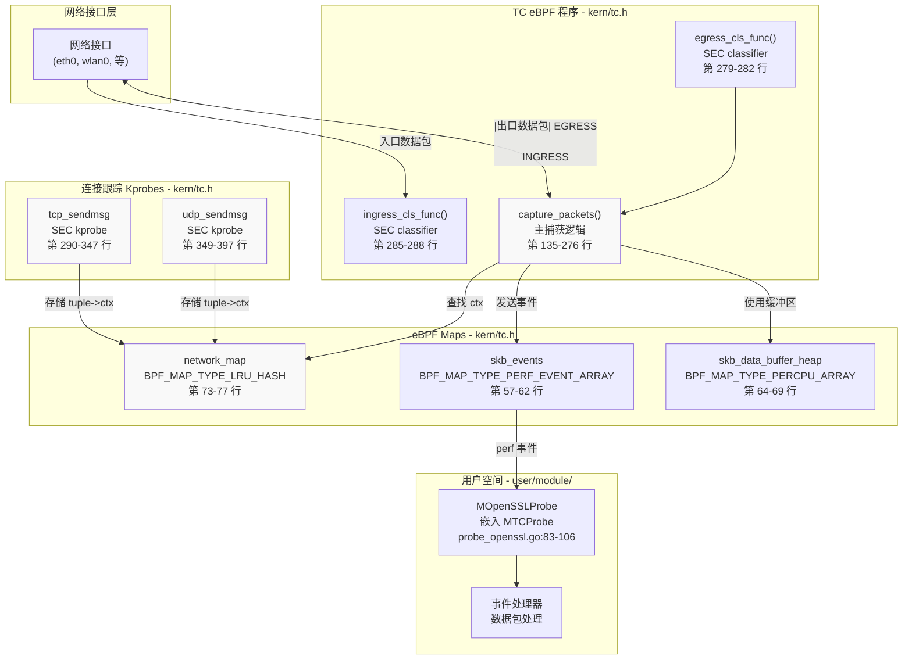
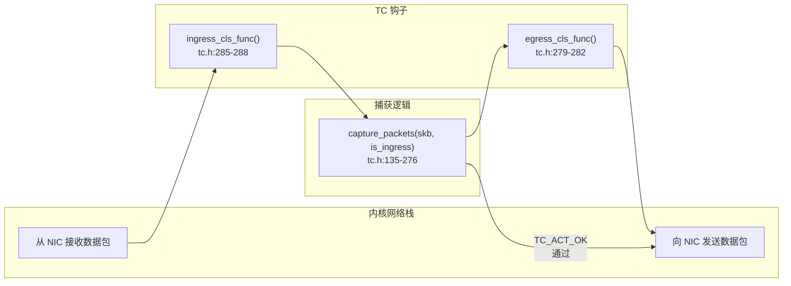
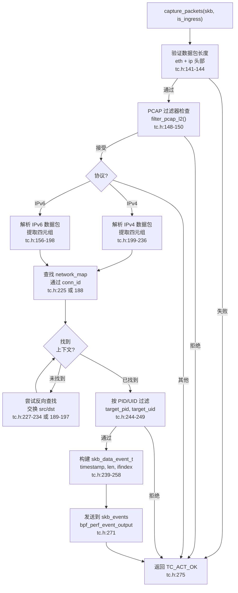
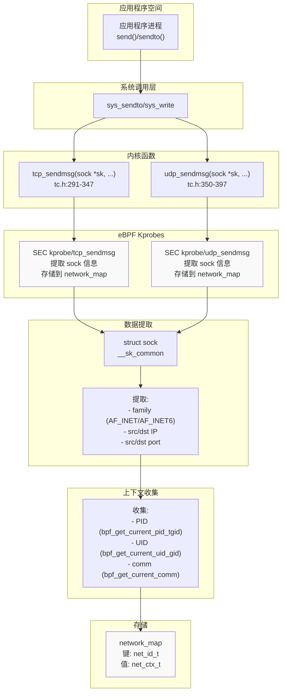
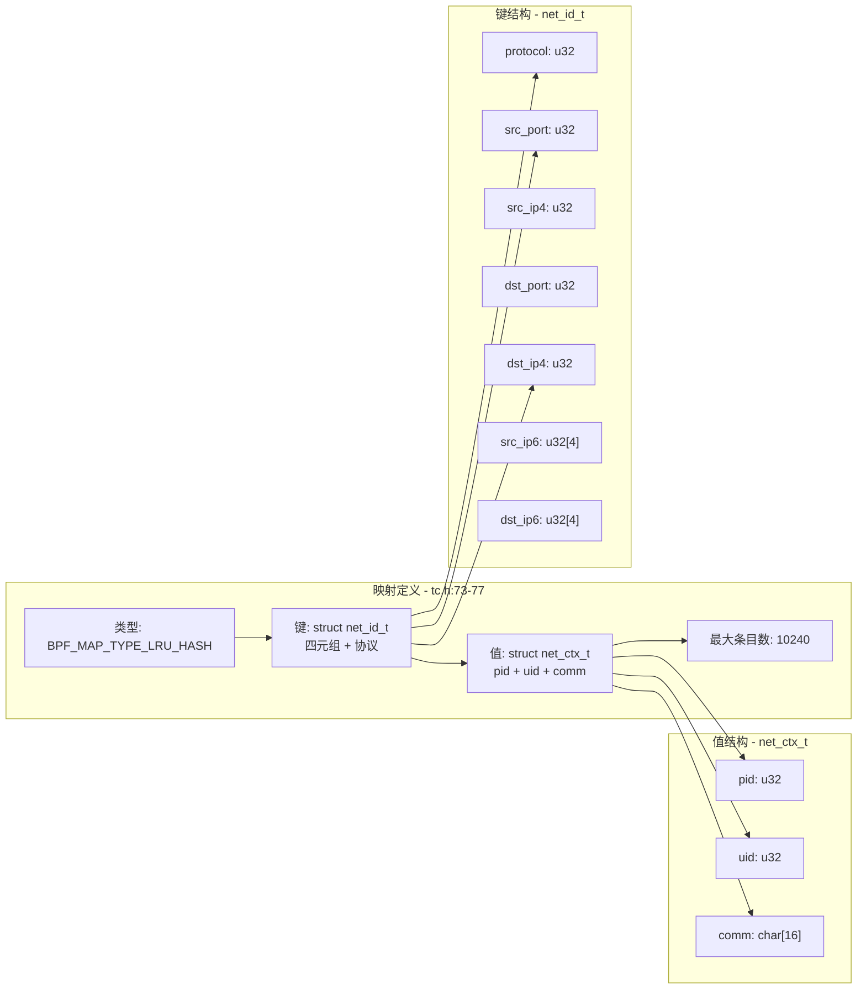
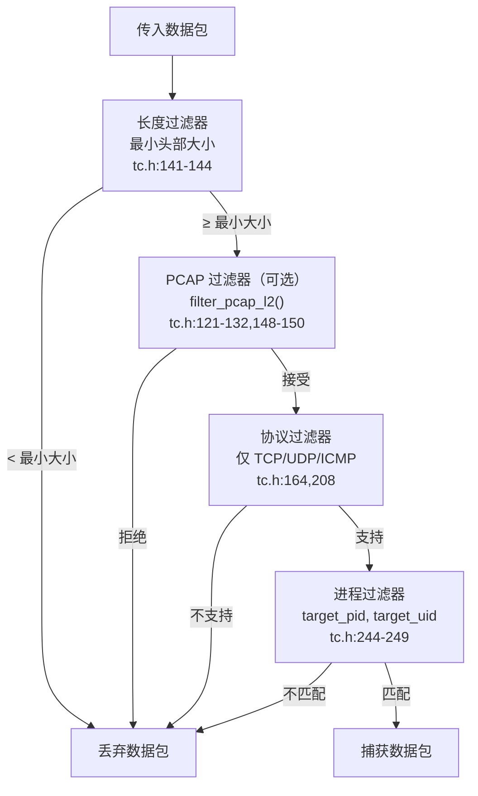
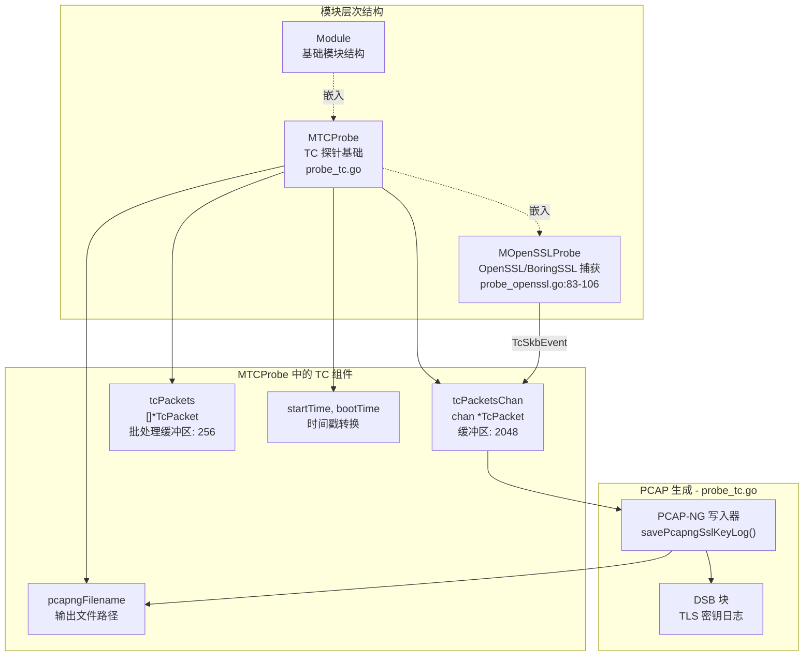
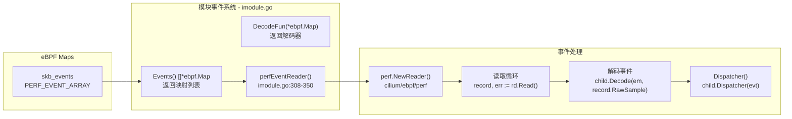

# TC 网络数据包捕获

## 目的与范围

本文档解释了 eCapture 基于流量控制（TC）的网络数据包捕获子系统。TC eBPF 程序附加到网络接口，在内核层面拦截数据包，使得能够捕获加密网络流量以及从 TLS 库中提取的明文数据。TC 子系统通过使用基于 kprobe 的连接跟踪，将网络连接映射到进程，从而提供进程归属功能。

有关 TLS/SSL 明文捕获的信息，请参阅 [TLS/SSL 模块](3.1-tlsssl-modules.md)。有关 PCAP 文件生成和输出格式的信息，请参阅 [PCAP 集成](../4-output-formats/4.2-pcap-integration.md)。

## 架构概述

TC 数据包捕获系统由三个主要组件组成：

1. **TC 分类器程序**：附加到网络接口的 eBPF 程序，在入口和出口点拦截数据包
2. **连接跟踪 Kprobes**：在 `tcp_sendmsg` 和 `udp_sendmsg` 上的 eBPF kprobes，将网络连接映射到进程
3. **网络映射系统**：一个 LRU 哈希映射，维护网络四元组与进程元数据之间的关联



**来源**：[kern/tc.h:1-398](https://github.com/gojue/ecapture/blob/0766a93b/kern/tc.h#L1-L398)，[user/module/probe_openssl.go:83-106](https://github.com/gojue/ecapture/blob/0766a93b/user/module/probe_openssl.go#L83-L106)

## TC 分类器程序

TC 分类器是附加到网络设备并处理通过它们的每个数据包的 eBPF 程序。eCapture 部署两个分类器程序：一个用于入口流量，一个用于出口流量。

### 附加点



两个分类器函数都委托给相同的 `capture_packets()` 函数，并带有方向标志：

- **ingress_cls_func**：处理传入的数据包 [kern/tc.h:285-288](https://github.com/gojue/ecapture/blob/0766a93b/kern/tc.h#L285-L288)
- **egress_cls_func**：处理传出的数据包 [kern/tc.h:279-282](https://github.com/gojue/ecapture/blob/0766a93b/kern/tc.h#L279-L282)

分类器返回 `TC_ACT_OK` 以允许数据包继续通过网络栈而不进行修改 [kern/common.h:58](https://github.com/gojue/ecapture/blob/0766a93b/kern/common.h#L58)。

**来源**：[kern/tc.h:135-288](https://github.com/gojue/ecapture/blob/0766a93b/kern/tc.h#L135-L288)，[kern/common.h:58](https://github.com/gojue/ecapture/blob/0766a93b/kern/common.h#L58)

## 数据包捕获逻辑

`capture_packets()` 函数实现核心的数据包捕获逻辑。它操作内核提供的套接字缓冲区结构（`struct __sk_buff`）。

### 处理流程



**来源**：[kern/tc.h:135-276](https://github.com/gojue/ecapture/blob/0766a93b/kern/tc.h#L135-L276)

### 协议支持

TC 捕获支持多种协议，包括 IPv4 和 IPv6：

| 协议 | 常量 | 过滤位置 |
|----------|----------|-----------------|
| TCP | `IPPROTO_TCP` | [kern/tc.h:208,320,332]() |
| UDP | `IPPROTO_UDP` | [kern/tc.h:208,370,382]() |
| ICMP | `IPPROTO_ICMP` | [kern/tc.h:208](https://github.com/gojue/ecapture/blob/0766a93b/kern/tc.h#L208) |
| ICMPv6 | `IPPROTO_ICMPV6` | [kern/tc.h:164](https://github.com/gojue/ecapture/blob/0766a93b/kern/tc.h#L164) |

捕获提取以下网络元组信息：

```c
struct net_id_t {
    u32 protocol;      // IPPROTO_TCP 或 IPPROTO_UDP
    u32 src_port;      // 源端口
    u32 src_ip4;       // 源 IPv4 地址
    u32 dst_port;      // 目标端口
    u32 dst_ip4;       // 目标 IPv4 地址
    u32 src_ip6[4];    // 源 IPv6 地址
    u32 dst_ip6[4];    // 目标 IPv6 地址
};
```

**来源**：[kern/tc.h:39-47,156-236]()

## 使用 Kprobes 进行连接跟踪

为了将捕获的数据包归属到特定进程，eCapture 在建立网络连接的内核函数上使用 kprobes。这些 kprobes 在数据包传输之前捕获进程上下文。

### Kprobe 附加点



**来源**：[kern/tc.h:290-397](https://github.com/gojue/ecapture/blob/0766a93b/kern/tc.h#L290-L397)

### 进程上下文提取

两个 kprobes 都提取相同的信息并将其存储在 `network_map` 中：

```c
struct net_ctx_t {
    u32 pid;              // 进程 ID
    u32 uid;              // 用户 ID
    char comm[16];        // 命令名称 (TASK_COMM_LEN)
};
```

kprobes 执行以下步骤：

1. **获取进程上下文** [kern/tc.h:292-294,351-353]()
   - `bpf_get_current_pid_tgid() >> 32` - 提取 PID
   - `bpf_get_current_uid_gid()` - 提取 UID
   - `bpf_get_current_comm()` - 获取进程名称

2. **提取套接字信息** [kern/tc.h:304-337,354-387]()
   - 读取 `sock->__sk_common.skc_family` - 地址族
   - 读取 `sock->__sk_common.skc_num` - 本地端口
   - 读取 `sock->__sk_common.skc_dport` - 远程端口
   - 读取源/目标 IP 地址

3. **存储映射** [kern/tc.h:345,395]()
   - 从网络元组创建 `net_id_t` 键
   - 从进程上下文创建 `net_ctx_t` 值
   - `bpf_map_update_elem(&network_map, &conn_id, &net_ctx, BPF_ANY)`

**来源**：[kern/tc.h:290-397](https://github.com/gojue/ecapture/blob/0766a93b/kern/tc.h#L290-L397)

## 网络映射系统

`network_map` 是将网络连接与进程信息关联的核心数据结构。它使用 LRU（最近最少使用）驱逐策略来维护活动连接的有界缓存。

### 映射配置



**来源**：[kern/tc.h:39-77](https://github.com/gojue/ecapture/blob/0766a93b/kern/tc.h#L39-L77)

### 双向查找

由于数据包可以从任一方向到达（客户端→服务器或服务器→客户端），`capture_packets()` 函数实现了双向查找：

1. **初始查找**：尝试使用数据包的源作为连接源来查找连接 [kern/tc.h:225,188]()
2. **反向查找**：如果未找到，交换源和目标后再次尝试 [kern/tc.h:227-234,189-197]()

这确保传入和传出的数据包都能正确归属到发起进程。

**来源**：[kern/tc.h:188-234](https://github.com/gojue/ecapture/blob/0766a93b/kern/tc.h#L188-L234)

## 数据包过滤

eCapture 支持多级过滤，以减少开销并仅捕获相关流量。

### 过滤层次结构



### PCAP 过滤器集成

`filter_pcap_l2()` 函数 [kern/tc.h:121-132](https://github.com/gojue/ecapture/blob/0766a93b/kern/tc.h#L121-L132) 作为从 PCAP 过滤器表达式生成的 BPF 字节码的注入点。该函数标记为 `__noinline` 以防止编译器优化，允许用户空间修补其指令。

过滤器修补在用户空间启动 [user/module/probe_openssl.go:303-307](https://github.com/gojue/ecapture/blob/0766a93b/user/module/probe_openssl.go#L303-L307)：

```go
if m.eBPFProgramType == TlsCaptureModelTypePcap && pcapFilter != "" {
    ebpfFuncs := []string{tcFuncNameIngress, tcFuncNameEgress}
    m.bpfManager.InstructionPatchers = prepareInsnPatchers(m.bpfManager,
        ebpfFuncs, pcapFilter)
}
```

**来源**：[kern/tc.h:121-150](https://github.com/gojue/ecapture/blob/0766a93b/kern/tc.h#L121-L150)，[user/module/probe_openssl.go:303-307](https://github.com/gojue/ecapture/blob/0766a93b/user/module/probe_openssl.go#L303-L307)

### 进程过滤

当设置了 `target_pid` 或 `target_uid`（内核 ≥ 5.2）时，数据包被过滤以匹配特定进程 [kern/tc.h:244-249](https://github.com/gojue/ecapture/blob/0766a93b/kern/tc.h#L244-L249)：

```c
if (target_pid != 0 && target_pid != net_ctx->pid) {
    return TC_ACT_OK;
}
if (target_uid != 0 && target_uid != net_ctx->uid) {
    return TC_ACT_OK;
}
```

此过滤发生在成功连接查找之后，确保只捕获属于目标进程的数据包。

**注意**：kprobes 本身不按 PID/UID 过滤 [kern/tc.h:296-302](https://github.com/gojue/ecapture/blob/0766a93b/kern/tc.h#L296-L302)，因为 `network_map` 必须包含所有连接，以便 TC 分类器执行归属。进程过滤仅在数据包捕获期间发生。

**来源**：[kern/tc.h:244-249,296-302]()，[kern/common.h:64-71](https://github.com/gojue/ecapture/blob/0766a93b/kern/common.h#L64-L71)

## 数据结构

### 事件结构

捕获的数据包元数据使用 `skb_data_event_t` 结构传输到用户空间：

```c
struct skb_data_event_t {
    uint64_t ts;                // 时间戳 (bpf_ktime_get_ns)
    u32 pid;                    // 进程 ID
    char comm[TASK_COMM_LEN];   // 进程名称
    u32 len;                    // 数据包长度 (skb->len)
    u32 ifindex;                // 网络接口索引
};
```

事件包含最小元数据（36 字节）[kern/tc.h:20](https://github.com/gojue/ecapture/blob/0766a93b/kern/tc.h#L20)，数据包有效载荷通过 `bpf_perf_event_output()` 的 flags 参数附加 [kern/tc.h:260-271](https://github.com/gojue/ecapture/blob/0766a93b/kern/tc.h#L260-L271)：

```c
u64 flags = BPF_F_CURRENT_CPU;
flags |= (u64)skb->len << 32;  // 在高 32 位编码数据包长度
bpf_perf_event_output(skb, &skb_events, flags, &event, TC_PACKET_MIN_SIZE);
```

**来源**：[kern/tc.h:30-37,239-271]()

### 缓冲区管理

为了避免大型结构导致的栈溢出，eCapture 使用每 CPU 数组映射进行临时事件存储：

```c
struct {
    __uint(type, BPF_MAP_TYPE_PERCPU_ARRAY);
    __type(key, u32);
    __type(value, struct skb_data_event_t);
    __uint(max_entries, 1);
} skb_data_buffer_heap SEC(".maps");
```

`make_skb_data_event()` 函数 [kern/tc.h:92-100](https://github.com/gojue/ecapture/blob/0766a93b/kern/tc.h#L92-L100) 从此映射检索缓冲区，该映射由内核自动按 CPU 管理。

**来源**：[kern/tc.h:64-100](https://github.com/gojue/ecapture/blob/0766a93b/kern/tc.h#L64-L100)

## 与捕获模块的集成

TC 数据包捕获主要与 TLS 捕获模块集成，以提供完整的网络流量可见性。

### MTCProbe 基础结构

TC 功能封装在 `MTCProbe` 结构体中，该结构体被需要网络数据包捕获的捕获模块嵌入 [user/module/probe_openssl.go:84](https://github.com/gojue/ecapture/blob/0766a93b/user/module/probe_openssl.go#L84)：



**来源**：[user/module/probe_openssl.go:83-106](https://github.com/gojue/ecapture/blob/0766a93b/user/module/probe_openssl.go#L83-L106)，[user/module/probe_tc.go](https://github.com/gojue/ecapture/blob/0766a93b/user/module/probe_tc.go)

### 事件流

当 OpenSSL 模块在 PCAP 模式下运行时，它接收 TC 数据包事件和 TLS 主密钥事件：

1. **初始化** [user/module/probe_openssl.go:137-148](https://github.com/gojue/ecapture/blob/0766a93b/user/module/probe_openssl.go#L137-L148)：
   - 设置 `eBPFProgramType = TlsCaptureModelTypePcap`
   - 创建 `tcPacketsChan` 缓冲通道（2048 个条目）
   - 初始化 `tcPackets` 批处理缓冲区（256 个条目）
   - 存储 PCAP 输出文件名

2. **事件分发** [user/module/probe_openssl.go:733-753](https://github.com/gojue/ecapture/blob/0766a93b/user/module/probe_openssl.go#L733-L753)：
   ```go
   switch ev := eventStruct.(type) {
   case *event.TcSkbEvent:
       err := m.dumpTcSkb(ev)  // 处理 TC 数据包
   case *event.MasterSecretEvent:
       m.saveMasterSecret(ev)   // 处理 TLS 密钥
   }
   ```

3. **PCAP 输出** [user/module/probe_openssl.go:558-565](https://github.com/gojue/ecapture/blob/0766a93b/user/module/probe_openssl.go#L558-L565)：
   - TC 数据包写入 PCAP-NG 文件
   - TLS 主密钥写入为 DSB（解密密钥块）
   - 使 Wireshark 能够解密捕获的 TLS 流量

**来源**：[user/module/probe_openssl.go:137-148,558-565,733-753]()

## 用户空间事件读取

用户空间模块使用标准事件读取基础设施从 `skb_events` perf 事件数组读取 TC 事件。

### 事件读取器设置



读取过程 [user/module/imodule.go:285-350](https://github.com/gojue/ecapture/blob/0766a93b/user/module/imodule.go#L285-L350)：

1. **映射发现**：`Events()` 返回所有事件映射，包括 `skb_events`
2. **读取器创建**：`perfEventReader()` 创建具有可配置缓冲区大小的 perf 事件读取器
3. **事件循环**：持续从 perf 环形缓冲区读取
4. **解码**：`Decode()` 将原始事件字节解析为 `TcSkbEvent` 结构
5. **分发**：将事件传递给模块的 `Dispatcher()` 进行处理

**来源**：[user/module/imodule.go:285-350](https://github.com/gojue/ecapture/blob/0766a93b/user/module/imodule.go#L285-L350)

## 内核版本兼容性

TC 捕获有特定的内核版本要求：

| 功能 | 最低内核版本 | 说明 |
|---------|----------------|------|
| TC 分类器 | 4.1+ | 基本 TC BPF 支持 |
| PCAP 过滤器注入 | 5.2+ | `filter_pcap_l2()` 修补所需 |
| PID/UID 过滤 | 5.2+ | 使用全局常量变量 [kern/common.h:64-71](https://github.com/gojue/ecapture/blob/0766a93b/kern/common.h#L64-L71) |

对于内核 < 5.2，存在以下限制：
- 无运行时 PCAP 过滤器注入
- TC 程序中无 PID/UID 过滤
- 通过 kprobes 的连接跟踪仍然有效

`KERNEL_LESS_5_2` 预处理指令 [kern/common.h:64-71](https://github.com/gojue/ecapture/blob/0766a93b/kern/common.h#L64-L71) 控制需要较新内核的功能的条件编译。

**来源**：[kern/common.h:64-71](https://github.com/gojue/ecapture/blob/0766a93b/kern/common.h#L64-L71)，[kern/tc.h:147-150,243-250]()

## 总结

基于 TC 的数据包捕获系统通过以下方式提供全面的网络可见性：

1. **拦截所有流量**：TC 分类器在网络接口层捕获数据包，在加密之前/解密之后
2. **进程归属**：在 `tcp_sendmsg`/`udp_sendmsg` 上的 Kprobes 通过 `network_map` LRU 哈希将连接映射到进程
3. **双向捕获**：处理入口和出口流量，具有自动源/目标反转功能
4. **灵活过滤**：支持 PCAP 过滤器表达式、协议过滤和 PID/UID 过滤
5. **TLS 集成**：将网络数据包与 TLS 主密钥结合，以 PCAP-NG 格式实现完整的流量解密

这种方法使 eCapture 能够捕获完整的网络流量及进程上下文，即使对于加密连接，也无需应用程序插桩或证书安装。

**来源**：[kern/tc.h:1-398](https://github.com/gojue/ecapture/blob/0766a93b/kern/tc.h#L1-L398)，[user/module/probe_openssl.go:83-106,303-307,558-565,733-753]()，[user/module/imodule.go:285-350](https://github.com/gojue/ecapture/blob/0766a93b/user/module/imodule.go#L285-L350)