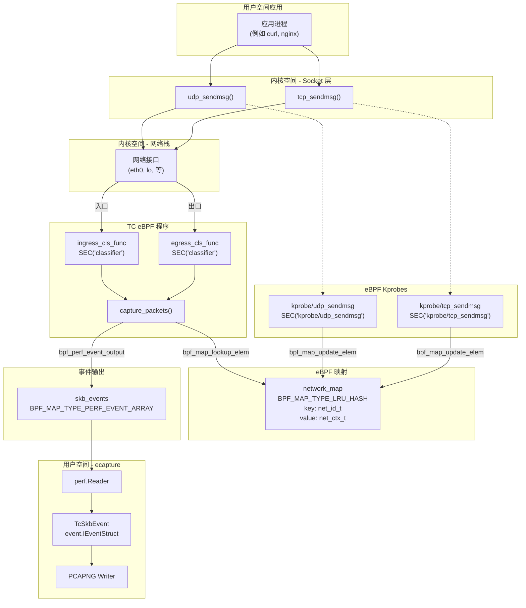
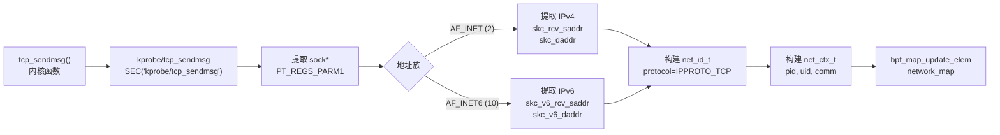
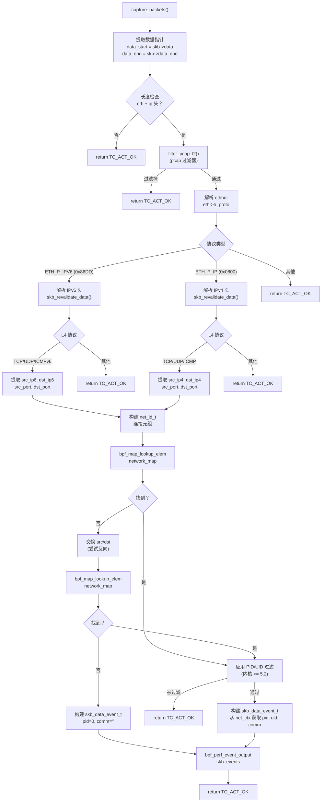
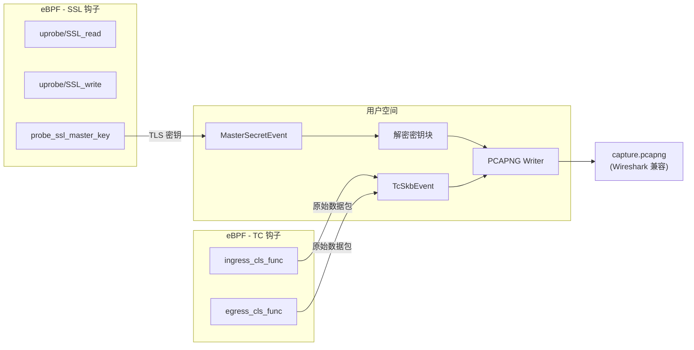

# 基于 TC 的网络数据包捕获

## 目的

本页面记录 ecapture 中基于流量控制（TC）分类器的数据包捕获机制。TC 分类器在数据链路层（第 2 层）运行，拦截进入（ingress）或离开（egress）网络接口的数据包。此功能对于 OpenSSL/BoringSSL 模块的 **PCAP 模式**至关重要，该模式重构完整的网络数据包并将其与应用层 TLS 密钥关联。

有关 TLS 密钥提取和 keylog 生成的信息，请参阅[主密钥提取](3.1.5-master-secret-extraction.md)。有关 PCAP 输出格式和 Wireshark 集成的详细信息，请参阅[PCAP 集成](../4-output-formats/4.2-pcap-integration.md)。有关 OpenSSL 模块的整体架构，请参阅[OpenSSL 模块](3.1.1-openssl-module.md)。

---

## 架构概述

TC 数据包捕获系统由三个协作组件组成：

1. **TC 分类器** - 附加到网络接口的 eBPF 程序，检查每个数据包
2. **内核探针** - 对 `tcp_sendmsg` 和 `udp_sendmsg` 的 kprobe，将数据包与进程关联
3. **网络映射** - 一个 LRU 哈希映射，存储网络连接与进程元数据（PID、UID、comm）之间的映射

### 系统流程图


```mermaid
graph TB
    subgraph "用户空间应用"
        App["应用进程<br/>(例如 curl, nginx)"]
    end
    
    subgraph "内核空间 - Socket 层"
        TcpSendmsg["tcp_sendmsg()"]
        UdpSendmsg["udp_sendmsg()"]
        App --> TcpSendmsg
        App --> UdpSendmsg
    end
    
    subgraph "eBPF Kprobes"
        TcpProbe["kprobe/tcp_sendmsg<br/>SEC('kprobe/tcp_sendmsg')"]
        UdpProbe["kprobe/udp_sendmsg<br/>SEC('kprobe/udp_sendmsg')"]
        TcpSendmsg -.-> TcpProbe
        UdpSendmsg -.-> UdpProbe
    end
    
    subgraph "eBPF 映射"
        NetworkMap["network_map<br/>BPF_MAP_TYPE_LRU_HASH<br/>key: net_id_t<br/>value: net_ctx_t"]
    end
    
    TcpProbe -->|"bpf_map_update_elem"| NetworkMap
    UdpProbe -->|"bpf_map_update_elem"| NetworkMap
    
    subgraph "内核空间 - 网络栈"
        NetIf["网络接口<br/>(eth0, lo, 等)"]
    end
    
    TcpSendmsg --> NetIf
    UdpSendmsg --> NetIf
    
    subgraph "TC eBPF 程序"
        EgressTC["egress_cls_func<br/>SEC('classifier')"]
        IngressTC["ingress_cls_func<br/>SEC('classifier')"]
        CapturePackets["capture_packets()"]
        
        EgressTC --> CapturePackets
        IngressTC --> CapturePackets
    end
    
    NetIf -->|"出口"| EgressTC
    NetIf -->|"入口"| IngressTC
    
    CapturePackets -->|"bpf_map_lookup_elem"| NetworkMap
    
    subgraph "事件输出"
        SkbEvents["skb_events<br/>BPF_MAP_TYPE_PERF_EVENT_ARRAY"]
        CapturePackets -->|"bpf_perf_event_output"| SkbEvents
    end
    
    subgraph "用户空间 - ecapture"
        PerfReader["perf.Reader"]
        TcSkbEvent["TcSkbEvent<br/>event.IEventStruct"]
        PcapWriter["PCAPNG Writer"]
        
        SkbEvents --> PerfReader
        PerfReader --> TcSkbEvent
        TcSkbEvent --> PcapWriter
    end
```

**来源：** [kern/tc.h:1-384](https://github.com/gojue/ecapture/blob/ca085d05/kern/tc.h#L1-L384), [user/module/probe_openssl.go:137-148](https://github.com/gojue/ecapture/blob/ca085d05/user/module/probe_openssl.go#L137-L148)

---

## eBPF 数据结构

### 连接标识：`net_id_t`

`net_id_t` 结构使用 IPv4 或 IPv6 的五元组唯一标识网络连接：

| 字段 | 类型 | 描述 |
|-------|------|-------------|
| `protocol` | `u32` | 协议号 (IPPROTO_TCP=6, IPPROTO_UDP=17, IPPROTO_ICMP=1, IPPROTO_ICMPV6=58) |
| `src_port` | `u32` | 源端口号 |
| `dst_port` | `u32` | 目标端口号 |
| `src_ip4` | `u32` | 源 IPv4 地址（用于 IPv4 连接） |
| `dst_ip4` | `u32` | 目标 IPv4 地址（用于 IPv4 连接） |
| `src_ip6` | `u32[4]` | 源 IPv6 地址（用于 IPv6 连接） |
| `dst_ip6` | `u32[4]` | 目标 IPv6 地址（用于 IPv6 连接） |

**来源：** [kern/tc.h:39-47](https://github.com/gojue/ecapture/blob/ca085d05/kern/tc.h#L39-L47)

### 进程上下文：`net_ctx_t`

`net_ctx_t` 结构存储与连接关联的进程元数据：

| 字段 | 类型 | 描述 |
|-------|------|-------------|
| `pid` | `u32` | 进程 ID |
| `uid` | `u32` | 用户 ID |
| `comm` | `char[TASK_COMM_LEN]` | 进程命令名称（16 字节） |

**来源：** [kern/tc.h:49-54](https://github.com/gojue/ecapture/blob/ca085d05/kern/tc.h#L49-L54)

### 数据包事件：`skb_data_event_t`

`skb_data_event_t` 结构表示发送到用户空间的捕获数据包事件：

| 字段 | 类型 | 描述 |
|-------|------|-------------|
| `ts` | `uint64_t` | 时间戳（自启动以来的纳秒数） |
| `pid` | `u32` | 进程 ID（来自 network_map 查找） |
| `comm` | `char[TASK_COMM_LEN]` | 进程命令名称 |
| `len` | `u32` | 数据包总长度 |
| `ifindex` | `u32` | 网络接口索引 |

**来源：** [kern/tc.h:30-37](https://github.com/gojue/ecapture/blob/ca085d05/kern/tc.h#L30-L37)

---

## eBPF 映射

### network_map

`network_map` 是将网络数据包与进程元数据关联的核心数据结构。

```c
struct {
    __uint(type, BPF_MAP_TYPE_LRU_HASH);
    __type(key, struct net_id_t);
    __type(value, struct net_ctx_t);
    __uint(max_entries, 10240);
} network_map SEC(".maps");
```

**类型：** `BPF_MAP_TYPE_LRU_HASH` - 在满时自动驱逐最近最少使用的条目

**容量：** 10,240 个连接

**生命周期：**
1. 由 `tcp_sendmsg` 和 `udp_sendmsg` kprobe 在进程发起连接时填充
2. 由 TC 分类器查询以将数据包与进程关联
3. 条目通过 LRU 驱逐自动过期

**来源：** [kern/tc.h:72-77](https://github.com/gojue/ecapture/blob/ca085d05/kern/tc.h#L72-L77)

### skb_events

`skb_events` 映射是用于将数据包数据发送到用户空间的 perf 事件数组：

```c
struct {
    __uint(type, BPF_MAP_TYPE_PERF_EVENT_ARRAY);
    __uint(key_size, sizeof(u32));
    __uint(value_size, sizeof(u32));
    __uint(max_entries, 10240);
} skb_events SEC(".maps");
```

**来源：** [kern/tc.h:57-62](https://github.com/gojue/ecapture/blob/ca085d05/kern/tc.h#L57-L62)

### skb_data_buffer_heap

一个每 CPU 数组映射，用于临时存储事件结构以避免栈限制：

```c
struct {
    __uint(type, BPF_MAP_TYPE_PERCPU_ARRAY);
    __type(key, u32);
    __type(value, struct skb_data_event_t);
    __uint(max_entries, 1);
} skb_data_buffer_heap SEC(".maps");
```

**来源：** [kern/tc.h:64-69](https://github.com/gojue/ecapture/blob/ca085d05/kern/tc.h#L64-L69)

---

## 内核探针钩子

### tcp_sendmsg Kprobe

`tcp_sendmsg` kprobe 拦截 TCP socket 发送操作以填充 `network_map`：


```mermaid
graph LR
    A["tcp_sendmsg()<br/>内核函数"] --> B["kprobe/tcp_sendmsg<br/>SEC('kprobe/tcp_sendmsg')"]
    B --> C["提取 sock*<br/>PT_REGS_PARM1"]
    C --> D{"地址族"}
    D -->|"AF_INET (2)"| E["提取 IPv4<br/>skc_rcv_saddr<br/>skc_daddr"]
    D -->|"AF_INET6 (10)"| F["提取 IPv6<br/>skc_v6_rcv_saddr<br/>skc_v6_daddr"]
    E --> G["构建 net_id_t<br/>protocol=IPPROTO_TCP"]
    F --> G
    G --> H["构建 net_ctx_t<br/>pid, uid, comm"]
    H --> I["bpf_map_update_elem<br/>network_map"]
```

**关键操作：**
1. 从第一个参数提取 `struct sock *` ([kern/tc.h:290](https://github.com/gojue/ecapture/blob/ca085d05/kern/tc.h#L290))
2. 读取 socket 族字段以确定 IPv4 或 IPv6 ([kern/tc.h:297](https://github.com/gojue/ecapture/blob/ca085d05/kern/tc.h#L297))
3. 从 `sock->__sk_common` 提取本地/远程 IP 地址和端口 ([kern/tc.h:299-323](https://github.com/gojue/ecapture/blob/ca085d05/kern/tc.h#L299-L323))
4. 构建 `net_id_t`，协议设置为 `IPPROTO_TCP` ([kern/tc.h:306-322](https://github.com/gojue/ecapture/blob/ca085d05/kern/tc.h#L306-L322))
5. 使用当前进程的 PID、UID 和 comm 填充 `net_ctx_t` ([kern/tc.h:325-328](https://github.com/gojue/ecapture/blob/ca085d05/kern/tc.h#L325-L328))
6. 更新 `network_map` 的连接元组 → 进程映射 ([kern/tc.h:331](https://github.com/gojue/ecapture/blob/ca085d05/kern/tc.h#L331))

**来源：** [kern/tc.h:285-333](https://github.com/gojue/ecapture/blob/ca085d05/kern/tc.h#L285-L333)

### udp_sendmsg Kprobe

`udp_sendmsg` kprobe 与 `tcp_sendmsg` 的操作相同，但用于 UDP 连接，在 `net_id_t` 结构中设置 `protocol = IPPROTO_UDP`。

**来源：** [kern/tc.h:335-383](https://github.com/gojue/ecapture/blob/ca085d05/kern/tc.h#L335-L383)

---

## TC 分类器实现

### 附加点

定义了两个 TC 分类器程序，附加到出口和入口挂钩点：

```c
SEC("classifier")
int egress_cls_func(struct __sk_buff *skb) {
    return capture_packets(skb, false);
}

SEC("classifier")
int ingress_cls_func(struct __sk_buff *skb) {
    return capture_packets(skb, true);
}
```

**出口（Egress）：** 离开主机的数据包（出站流量）  
**入口（Ingress）：** 进入主机的数据包（入站流量）

两个分类器都调用共同的 `capture_packets` 函数，返回 `TC_ACT_OK` 以允许正常数据包处理。

**来源：** [kern/tc.h:274-283](https://github.com/gojue/ecapture/blob/ca085d05/kern/tc.h#L274-L283)

### capture_packets 函数

`capture_packets` 函数执行核心数据包处理逻辑：


```mermaid
graph TB
    Start["capture_packets()"] --> ExtractData["提取数据指针<br/>data_start = skb->data<br/>data_end = skb->data_end"]
    ExtractData --> LenCheck{"长度检查<br/>eth + ip 头？"}
    LenCheck -->|"否"| ReturnOK1["return TC_ACT_OK"]
    LenCheck -->|"是"| FilterPcap["filter_pcap_l2()<br/>(pcap 过滤器)"]
    FilterPcap -->|"过滤掉"| ReturnOK2["return TC_ACT_OK"]
    FilterPcap -->|"通过"| ParseEth["解析 ethhdr<br/>eth->h_proto"]
    
    ParseEth --> ProtoCheck{"协议类型"}
    ProtoCheck -->|"ETH_P_IPV6 (0x86DD)"| ParseIPv6["解析 IPv6 头<br/>skb_revalidate_data()"]
    ProtoCheck -->|"ETH_P_IP (0x0800)"| ParseIPv4["解析 IPv4 头<br/>skb_revalidate_data()"]
    ProtoCheck -->|"其他"| ReturnOK3["return TC_ACT_OK"]
    
    ParseIPv6 --> L4IPv6{"L4 协议"}
    L4IPv6 -->|"TCP/UDP/ICMPv6"| ExtractIPv6["提取 src_ip6, dst_ip6<br/>src_port, dst_port"]
    L4IPv6 -->|"其他"| ReturnOK4["return TC_ACT_OK"]
    
    ParseIPv4 --> L4IPv4{"L4 协议"}
    L4IPv4 -->|"TCP/UDP/ICMP"| ExtractIPv4["提取 src_ip4, dst_ip4<br/>src_port, dst_port"]
    L4IPv4 -->|"其他"| ReturnOK5["return TC_ACT_OK"]
    
    ExtractIPv6 --> BuildConnId["构建 net_id_t<br/>连接元组"]
    ExtractIPv4 --> BuildConnId
    
    BuildConnId --> Lookup1["bpf_map_lookup_elem<br/>network_map"]
    Lookup1 --> Found1{"找到？"}
    Found1 -->|"否"| SwapTuple["交换 src/dst<br/>(尝试反向)"]
    SwapTuple --> Lookup2["bpf_map_lookup_elem<br/>network_map"]
    Lookup2 --> Found2{"找到？"}
    
    Found1 -->|"是"| FilterPidUid["应用 PID/UID 过滤<br/>(内核 >= 5.2)"]
    Found2 -->|"是"| FilterPidUid
    Found2 -->|"否"| BuildEvent1["构建 skb_data_event_t<br/>pid=0, comm=''"]
    
    FilterPidUid -->|"被过滤"| ReturnOK6["return TC_ACT_OK"]
    FilterPidUid -->|"通过"| BuildEvent2["构建 skb_data_event_t<br/>从 net_ctx 获取 pid, uid, comm"]
    
    BuildEvent1 --> SendEvent["bpf_perf_event_output<br/>skb_events"]
    BuildEvent2 --> SendEvent
    SendEvent --> ReturnOK7["return TC_ACT_OK"]
```

**来源：** [kern/tc.h:135-271](https://github.com/gojue/ecapture/blob/ca085d05/kern/tc.h#L135-L271)

### 数据包过滤与验证

#### 长度验证

在处理之前，函数验证数据包至少包含以太网头和 IP 头：

```c
if (data_start + sizeof(struct ethhdr) + sizeof(struct iphdr) > data_end) {
    return TC_ACT_OK;
}
```

**来源：** [kern/tc.h:141-144](https://github.com/gojue/ecapture/blob/ca085d05/kern/tc.h#L141-L144)

#### PCAP 过滤器集成

当通过 `--pcapfilter` 标志指定 pcap 过滤器时，`filter_pcap_l2` 函数应用编译的过滤器表达式：

```c
if (!filter_pcap_l2(skb, data_start, data_end))
    return TC_ACT_OK;
```

该函数标记为 `__noinline` 以允许用户空间加载器进行指令修补。指令修补器将 libpcap 过滤器表达式（例如 `tcp port 443`）转换为注入此函数的 eBPF 指令。

**来源：** [kern/tc.h:121-132](https://github.com/gojue/ecapture/blob/ca085d05/kern/tc.h#L121-L132), [kern/tc.h:147-149](https://github.com/gojue/ecapture/blob/ca085d05/kern/tc.h#L147-L149), [user/module/probe_openssl.go:302-307](https://github.com/gojue/ecapture/blob/ca085d05/user/module/probe_openssl.go#L302-L307)

### 协议解析

#### IPv4 数据包处理

对于 IPv4 数据包（`eth->h_proto == ETH_P_IP`）：

1. 在偏移量 `sizeof(struct ethhdr)` 处解析 `struct iphdr` ([kern/tc.h:205](https://github.com/gojue/ecapture/blob/ca085d05/kern/tc.h#L205))
2. 过滤非 TCP/UDP/ICMP 协议 ([kern/tc.h:207-209](https://github.com/gojue/ecapture/blob/ca085d05/kern/tc.h#L207-L209))
3. 提取源/目标 IP 地址：`iph->saddr`, `iph->daddr` ([kern/tc.h:211-213](https://github.com/gojue/ecapture/blob/ca085d05/kern/tc.h#L211-L213))
4. 重新验证缓冲区以访问 L4 头 ([kern/tc.h:214-217](https://github.com/gojue/ecapture/blob/ca085d05/kern/tc.h#L214-L217))
5. 解析 TCP/UDP 头（两者都使用前 4 字节作为端口） ([kern/tc.h:220](https://github.com/gojue/ecapture/blob/ca085d05/kern/tc.h#L220))
6. 提取源/目标端口：`bpf_ntohs(hdr->source)`, `bpf_ntohs(hdr->dest)` ([kern/tc.h:221-222](https://github.com/gojue/ecapture/blob/ca085d05/kern/tc.h#L221-L222))

**来源：** [kern/tc.h:198-234](https://github.com/gojue/ecapture/blob/ca085d05/kern/tc.h#L198-L234)

#### IPv6 数据包处理

对于 IPv6 数据包（`eth->h_proto == ETH_P_IPV6`）：

1. 在偏移量 `sizeof(struct ethhdr)` 处解析 `struct ipv6hdr` ([kern/tc.h:162](https://github.com/gojue/ecapture/blob/ca085d05/kern/tc.h#L162))
2. 通过 `iph->nexthdr` 过滤非 TCP/UDP/ICMPv6 协议 ([kern/tc.h:163-165](https://github.com/gojue/ecapture/blob/ca085d05/kern/tc.h#L163-L165))
3. 提取 128 位源/目标地址：`iph->saddr`, `iph->daddr` ([kern/tc.h:168-169](https://github.com/gojue/ecapture/blob/ca085d05/kern/tc.h#L168-L169))
4. 与 IPv4 相同地处理 L4 头 ([kern/tc.h:171-186](https://github.com/gojue/ecapture/blob/ca085d05/kern/tc.h#L171-L186))

**来源：** [kern/tc.h:155-197](https://github.com/gojue/ecapture/blob/ca085d05/kern/tc.h#L155-L197)

### 网络映射查找

在构建 `net_id_t` 连接元组后，函数执行双向查找：

```c
net_ctx = bpf_map_lookup_elem(&network_map, &conn_id);
if (net_ctx == NULL) {
    // 交换 src/dst 并尝试反向
    u32 tmp_ip = conn_id.src_ip4;
    conn_id.src_ip4 = conn_id.dst_ip4;
    conn_id.dst_ip4 = tmp_ip;
    u32 tmp_port = conn_id.src_port;
    conn_id.src_port = conn_id.dst_port;
    conn_id.dst_port = tmp_port;
    net_ctx = bpf_map_lookup_elem(&network_map, &conn_id);
}
```

这种双向查找处理同一连接的出口和入口数据包。当进程通过 `tcp_sendmsg` 发起连接时，`network_map` 被填充出口元组。对于响应数据包（入口方向），源和目标被交换，因此代码尝试两个方向。

**来源：** [kern/tc.h:224-234](https://github.com/gojue/ecapture/blob/ca085d05/kern/tc.h#L224-L234) (IPv4), [kern/tc.h:187-197](https://github.com/gojue/ecapture/blob/ca085d05/kern/tc.h#L187-L197) (IPv6)

### 进程过滤

在内核 >= 5.2 上，可以设置全局变量 `target_pid` 和 `target_uid` 以按进程过滤数据包：

```c
if (net_ctx != NULL) {
    // pid uid 过滤
    if (filter_rejects(net_ctx->pid, net_ctx->uid)) {
        return TC_ACT_OK;
    }
}
```

`filter_rejects` 函数检查是否应该根据 PID/UID 过滤数据包。这些全局变量通过用户空间模块初始化中的常量编辑器设置。

**来源：** [kern/tc.h:240-244](https://github.com/gojue/ecapture/blob/ca085d05/kern/tc.h#L240-L244), [kern/ecapture.h:93-105](https://github.com/gojue/ecapture/blob/ca085d05/kern/ecapture.h#L93-L105), [kern/common.h:68-70](https://github.com/gojue/ecapture/blob/ca085d05/kern/common.h#L68-L70)

### 事件提交

捕获的数据包元数据和原始数据包数据通过 `bpf_perf_event_output` 发送到用户空间：

```c
event.ts = bpf_ktime_get_ns();
event.len = skb->len;
event.ifindex = skb->ifindex;

u64 flags = BPF_F_CURRENT_CPU;
flags |= (u64)skb->len << 32;

size_t pkt_size = TC_PACKET_MIN_SIZE;
bpf_perf_event_output(skb, &skb_events, flags, &event, pkt_size);
```

`flags` 参数在高 32 位中编码 CPU 号和总数据包长度。实际数据包数据由内核的 perf 事件子系统从 `skb` 结构中读取。只有最小的元数据（`TC_PACKET_MIN_SIZE = 36` 字节）从事件结构复制。

**来源：** [kern/tc.h:251-266](https://github.com/gojue/ecapture/blob/ca085d05/kern/tc.h#L251-L266), [kern/tc.h:20](https://github.com/gojue/ecapture/blob/ca085d05/kern/tc.h#L20)

---

## 用户空间集成

### 模块配置

OpenSSL 模块在配置为 PCAP 模式时启用 TC 数据包捕获：

```go
case config.TlsCaptureModelPcap, config.TlsCaptureModelPcapng:
    pcapFile := m.conf.(*config.OpensslConfig).PcapFile
    m.eBPFProgramType = TlsCaptureModelTypePcap
    var fileInfo string
    fileInfo, err = filepath.Abs(pcapFile)
    if err != nil {
        return err
    }
    m.tcPacketsChan = make(chan *TcPacket, 2048)
    m.tcPackets = make([]*TcPacket, 0, 256)
    m.pcapngFilename = fileInfo
```

**来源：** [user/module/probe_openssl.go:137-148](https://github.com/gojue/ecapture/blob/ca085d05/user/module/probe_openssl.go#L137-L148)

### 管理器设置

`setupManagersPcap` 函数配置 eBPF 管理器以进行 TC 和 kprobe 附加：

```go
func (m *MOpenSSLProbe) setupManagersPcap() error {
    var err error
    m.bpfManager = &manager.Manager{
        Probes: []*manager.Probe{
            // SSL 函数 uprobes...
            {
                Section:          "kprobe/tcp_sendmsg",
                EbpfFuncName:     "kprobe_tcp_sendmsg",
                AttachToFuncName: "tcp_sendmsg",
            },
            {
                Section:          "kprobe/udp_sendmsg",
                EbpfFuncName:     "kprobe_udp_sendmsg",
                AttachToFuncName: "udp_sendmsg",
            },
        },
    }
    // ... TC 分类器设置
}
```

**关键组件：**
- **Kprobes：** 附加到 `tcp_sendmsg` 和 `udp_sendmsg` 内核函数
- **TC 分类器：** 附加到网络接口（在 TCObjects 中单独配置）
- **常量编辑器：** 设置 `target_pid` 和 `target_uid` 全局变量

**来源：** [user/module/probe_openssl.go:280-350](https://github.com/gojue/ecapture/blob/ca085d05/user/module/probe_openssl.go#L280-L350)

### PCAP 过滤器编译

当指定 `--pcapfilter` 时，指令修补器编译过滤器表达式：

```go
pcapFilter := m.conf.(*config.OpensslConfig).PcapFilter
if m.eBPFProgramType == TlsCaptureModelTypePcap && pcapFilter != "" {
    ebpfFuncs := []string{tcFuncNameIngress, tcFuncNameEgress}
    m.bpfManager.InstructionPatchers = prepareInsnPatchers(m.bpfManager,
        ebpfFuncs, pcapFilter)
}
```

`prepareInsnPatchers` 函数：
1. 解析 pcap 过滤器表达式（例如 `tcp port 443 and host 1.2.3.4`）
2. 使用 libpcap 将其编译为 BPF 指令
3. 在 `ingress_cls_func` 和 `egress_cls_func` 中修补 `filter_pcap_ebpf_l2` 函数

**来源：** [user/module/probe_openssl.go:302-307](https://github.com/gojue/ecapture/blob/ca085d05/user/module/probe_openssl.go#L302-L307)

### 事件处理

TC 数据包事件从 perf 事件数组读取并解码为 `TcSkbEvent` 结构：

```go
case *event.TcSkbEvent:
    err := m.dumpTcSkb(ev)
    if err != nil {
        m.logger.Error().Err(err).Msg("save packet error.")
    }
```

`dumpTcSkb` 函数：
1. 接收带有数据包元数据和原始字节的 `TcSkbEvent`
2. 在 `m.tcPackets` 切片中缓冲数据包
3. 定期刷新到带有进程元数据的 PCAPNG 文件

**来源：** [user/module/probe_openssl.go:746-750](https://github.com/gojue/ecapture/blob/ca085d05/user/module/probe_openssl.go#L746-L750)

---

## 支持的协议

### 第 3 层（网络层）

| 协议 | 常量 | 值 | 支持 |
|----------|----------|-------|---------|
| IPv4 | `ETH_P_IP` | `0x0800` | 完全支持 |
| IPv6 | `ETH_P_IPV6` | `0x86DD` | 完全支持 |

**来源：** [kern/common.h:59-60](https://github.com/gojue/ecapture/blob/ca085d05/kern/common.h#L59-L60)

### 第 4 层（传输层）

| 协议 | 常量 | 值 | Kprobe 钩子 | TC 支持 |
|----------|----------|-------|-------------|------------|
| TCP | `IPPROTO_TCP` | `6` | `tcp_sendmsg` | 完全支持 |
| UDP | `IPPROTO_UDP` | `17` | `udp_sendmsg` | 完全支持 |
| ICMP | `IPPROTO_ICMP` | `1` | 无 | 受限* |
| ICMPv6 | `IPPROTO_ICMPV6` | `58` | 无 | 受限* |

*ICMP/ICMPv6 数据包由 TC 分类器捕获，但无法与进程关联（无 kprobe 钩子），因此事件中 `pid=0`。

**来源：** [kern/tc.h:163](https://github.com/gojue/ecapture/blob/ca085d05/kern/tc.h#L163), [kern/tc.h:207](https://github.com/gojue/ecapture/blob/ca085d05/kern/tc.h#L207), [kern/tc.h:285-383](https://github.com/gojue/ecapture/blob/ca085d05/kern/tc.h#L285-L383)

---

## 内核版本要求

### 全局变量（target_pid, target_uid）

通过 `target_pid` 和 `target_uid` 进行进程过滤需要内核 >= 5.2 以支持 `.rodata` 部分：

```c
#ifndef KERNEL_LESS_5_2
const volatile u64 target_pid = 0;
const volatile u64 target_uid = 0;
#endif
```

在内核 < 5.2 上，这些过滤器被禁用，捕获所有匹配 pcap 过滤器的数据包。

**来源：** [kern/common.h:64-71](https://github.com/gojue/ecapture/blob/ca085d05/kern/common.h#L64-L71), [user/module/imodule.go:145-148](https://github.com/gojue/ecapture/blob/ca085d05/user/module/imodule.go#L145-L148)

### BTF 和 CO-RE

TC eBPF 程序支持 CO-RE 和非 CO-RE 模式：
- **CO-RE 模式：** 使用 `vmlinux.h` 和内核 BTF 进行自动结构重定位
- **非 CO-RE 模式：** 使用特定内核版本的内核头文件

模式根据 BTF 可用性自动选择，或通过 `-b/--btf` 标志选择。

**来源：** [kern/ecapture.h:18-88](https://github.com/gojue/ecapture/blob/ca085d05/kern/ecapture.h#L18-L88)

---

## 限制与注意事项

### 连接跟踪间隙

`network_map` 仅在进程调用 `tcp_sendmsg` 或 `udp_sendmsg` 时填充。这会为以下情况创建间隙：
1. **入站发起的连接：** 服务器进程接受连接可能直到发送数据时才出现在映射中
2. **预先存在的连接：** ecapture 启动前建立的连接不被跟踪
3. **内核发起的流量：** 内核直接发送的没有进程上下文的数据包

对于这些情况，TC 分类器捕获的数据包 `pid=0`。

### LRU 映射驱逐

`network_map` 的最大大小为 10,240 个条目。在高连接流失下，旧条目可能在其数据包被捕获之前被驱逐。LRU（最近最少使用）驱逐策略优先考虑活动连接。

**来源：** [kern/tc.h:76](https://github.com/gojue/ecapture/blob/ca085d05/kern/tc.h#L76)

### 数据包大小

支持的最大数据包大小为 `SKB_MAX_DATA_SIZE = 2048` 字节。较大的数据包被截断。实际数据包长度保留在 `skb_data_event_t.len` 中，但只捕获 2048 字节。

**来源：** [kern/common.h:61](https://github.com/gojue/ecapture/blob/ca085d05/kern/common.h#L61)

### 性能影响

TC 分类器在遍历网络接口的**每个数据包**上执行，包括与监控进程无关的流量。性能影响与总网络吞吐量成比例，而不仅仅是监控的应用流量。使用 pcap 过滤器来减少开销。

---

## 与 OpenSSL 模块的集成

TC 数据包捕获与 TLS 密钥提取集成以实现完整的明文恢复：


```mermaid
graph LR
    subgraph "eBPF - SSL 钩子"
        SSLRead["uprobe/SSL_read"]
        SSLWrite["uprobe/SSL_write"]
        SSLMasterKey["probe_ssl_master_key"]
    end
    
    subgraph "eBPF - TC 钩子"
        TCIngress["ingress_cls_func"]
        TCEgress["egress_cls_func"]
    end
    
    subgraph "用户空间"
        SecretEvent["MasterSecretEvent"]
        TcSkbEvent["TcSkbEvent"]
        PcapngWriter["PCAPNG Writer"]
        DSB["解密密钥块"]
    end
    
    SSLMasterKey -->|"TLS 密钥"| SecretEvent
    TCIngress -->|"原始数据包"| TcSkbEvent
    TCEgress -->|"原始数据包"| TcSkbEvent
    
    SecretEvent --> DSB
    DSB --> PcapngWriter
    TcSkbEvent --> PcapngWriter
    
    PcapngWriter --> WiresharkFile["capture.pcapng<br/>(Wireshark 兼容)"]
```

组合输出包括：
1. TC 捕获的带有进程元数据（PID、comm）的**网络数据包**
2. 从 SSL 库钩子提取的 **TLS 主密钥**
3. 嵌入密钥的 **PCAPNG DSB 块**，用于在 Wireshark 中自动解密

有关 DSB 生成的详细信息，请参阅[PCAP 集成](../4-output-formats/4.2-pcap-integration.md)。

**来源：** [user/module/probe_openssl.go:558-565](https://github.com/gojue/ecapture/blob/ca085d05/user/module/probe_openssl.go#L558-L565)

---

## 使用示例

### 基本 PCAP 捕获

将所有 TLS 流量捕获到 pcapng 文件：

```bash
ecapture tls --pcapng=/tmp/traffic.pcapng
```

### 过滤捕获

仅捕获特定进程的 HTTPS 流量（端口 443）：

```bash
ecapture tls --pcapng=/tmp/https.pcapng --pcapfilter="tcp port 443" --pid=12345
```

### IPv6 捕获

捕获 IPv6 TLS 流量：

```bash
ecapture tls --pcapng=/tmp/ipv6.pcapng --pcapfilter="ip6"
```

### 使用 Wireshark 分析

生成的 PCAPNG 文件可以直接在 Wireshark 中打开，Wireshark 将自动使用嵌入的 DSB 密钥解密 TLS 流量：

```bash
wireshark /tmp/traffic.pcapng
```

有关输出格式的更多信息，请参阅[PCAP 集成](../4-output-formats/4.2-pcap-integration.md)和[TLS 密钥日志](../4-output-formats/4.3-tls-key-logging.md)。